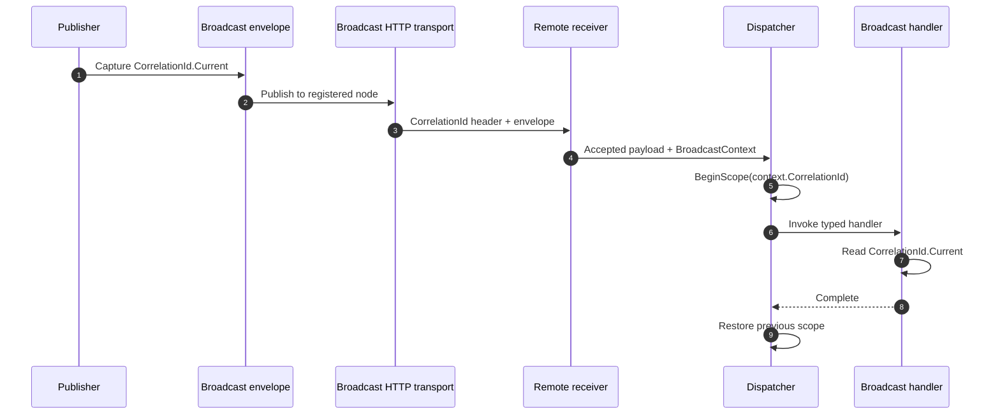

# Common Utilities Documentation

> Use shared utilities for resiliency, composition, diagrams, calendars, metrics, storage, and runtime support.

[TOC]

## Overview

The devkit includes a broad set of shared utilities for cross-cutting runtime concerns. It is not one single feature. Instead, it groups several lower-level building blocks that support application, domain, infrastructure, and presentation code.

This includes:

- resiliency and concurrency helpers such as `Retryer`, `Debouncer`, `Throttler`, `CircuitBreaker`, `RateLimiter`, `Bulkhead`, and `TimeoutHandler`
- lightweight background and in-process messaging helpers such as `BackgroundWorker`, `SimpleNotifier`, and `SimpleRequester`
- composable in-process pipelines with reusable steps, hooks, behaviors, and typed execution contexts
- reusable diagram builders and Mermaid renderers for state, flow, activity, sequence, class, and component diagrams
- business calendars with culture-based registration and dynamic calculated holidays
- date/time range utilities with half-open range algebra
- human-readable duration and relative-time text formatting
- dynamic predicate and reflection helpers
- content-type, Base64Url, compression, hashing, stream, and cloning utilities
- identifier, key, and friendly-name generators
- low-level activity and tracing helpers
- startup-task primitives and behaviors
- validation helpers for FluentValidation

Some of those areas also have higher-level feature docs elsewhere in `docs/`. This page focuses on the shared utilities available across the devkit and gives a short usage example for each main utility family.

## Business calendars

Business calendars provide culture-aware working-day calculations for due dates, planning windows, and date ranges.

Use them when an application needs weekends, holidays, regional calendars, or tenant-specific working-day rules to influence date calculations.

### Registration

Register calendars once in `Program.cs`. Calendar-aware convenience methods then resolve the matching calendar from the supplied culture at runtime.

```csharp
builder.Services.AddBusinessCalendars(calendars => calendars
    .SetDefault(new BusinessCalendar())
    .RegisterCountry("NL", new BusinessCalendar(
        holidays: [
            new DateOnly(2026, 1, 1),
            new DateOnly(2026, 12, 25)
        ]))
    .Register(
        CultureInfo.GetCultureInfo("de-DE"),
        new DynamicBusinessCalendar(
            new CalculatedHolidayProvider([
                new CalculatedHoliday("Good Friday", year =>
                    HolidayCalculations.GregorianEasterSunday(year).AddDays(-2)),
                new CalculatedHoliday("Easter Monday", year =>
                    HolidayCalculations.GregorianEasterSunday(year).AddDays(1))
            ]),
            nonWorkingDays: [DayOfWeek.Saturday, DayOfWeek.Sunday])));
```

Use the registered calendar through the date helpers when calculating due dates, reminders, or SLA deadlines:

```csharp
var culture = CultureInfo.GetCultureInfo("nl-NL");

var isOpen = date.IsBusinessDay(culture);
var dueDate = date.AddBusinessDays(3, culture);
var dueAt = createdAt.AddBusinessDays(2, culture);
```

For code that already has a calendar instance, call the calendar directly:

```csharp
var calendar = new BusinessCalendar(
    nonWorkingDays: [DayOfWeek.Friday, DayOfWeek.Saturday],
    holidays: [new DateOnly(2026, 1, 1)],
    rules: [
        new FixedHolidayRule([new FixedHoliday(12, 25, "Christmas Day")]),
        new ObservedHolidayRule([new FixedHoliday(1, 1, "New Year")])
    ]);

var nextWorkday = calendar.NextBusinessDay(date, includeCurrent: true);
var previousWorkday = calendar.PreviousBusinessDay(date);
var workingDaysInWindow = calendar.CountBusinessDays(start, end);
var info = calendar.GetBusinessDayInfo(date);
```

For libraries, console tools, and tests that do not use dependency injection, register calendars globally:

```csharp
BusinessCalendars.SetDefault(new BusinessCalendar());
BusinessCalendars.RegisterCountry("NL", dutchCalendar);

var dueDate = invoiceDate.AddBusinessDays(10, CultureInfo.GetCultureInfo("nl-NL"));
```

Resolution order is:

- exact culture, such as `nl-NL`
- country code, such as `NL`
- neutral language code, such as `nl`
- default calendar

### DI-aware calendars

Calendars that need services can be registered with factories or implementation types. This is useful for calendars that need configuration, tenants, repositories, or other scoped services.

```csharp
builder.Services.AddScoped<TenantHolidayRepository>();

builder.Services.AddBusinessCalendars(calendars => calendars
    .Register(
        CultureInfo.GetCultureInfo("nl-NL"),
        serviceProvider => new TenantBusinessCalendar(
            serviceProvider.GetRequiredService<TenantHolidayRepository>())));
```

For service-backed registrations, inject `IBusinessCalendarResolver` where the calendar is needed:

```csharp
public sealed class DueDateService(IBusinessCalendarResolver calendars)
{
    public DateOnly Calculate(DateOnly start, CultureInfo culture)
    {
        var calendar = calendars.Resolve(culture);
        return calendar.AddBusinessDays(start, 5);
    }
}
```

For database-backed holidays, create an application-specific `IBusinessCalendar` or `IHolidayProvider` that uses the project's repository or `DbContext`, then register it with `AddBusinessCalendars`.

Use `GetBusinessDayInfo` when the UI or audit log needs the reason a date is blocked:

```csharp
var info = calendar.GetBusinessDayInfo(date);

if (!info.IsBusinessDay)
{
    logger.LogInformation("Date is unavailable: {Reason}", info.Reason);
}
```

### Dynamic holidays

Use `DynamicBusinessCalendar` when holidays are calculated by year instead of stored as a fixed list. The built-in `CalculatedHolidayProvider` supports simple year-based rules, and projects can implement `IHolidayProvider` for richer logic.

```csharp
var calendar = new DynamicBusinessCalendar(
    new CalculatedHolidayProvider([
        new CalculatedHoliday("Good Friday", year =>
            HolidayCalculations.GregorianEasterSunday(year).AddDays(-2)),
        new CalculatedHoliday("Easter Sunday", HolidayCalculations.GregorianEasterSunday)
    ]));
```

Dynamic calendars can also combine calculated holidays with business-day rules:

```csharp
var calendar = new DynamicBusinessCalendar(
    new CalculatedHolidayProvider([
        new CalculatedHoliday("Easter Monday", year =>
            HolidayCalculations.GregorianEasterSunday(year).AddDays(1))
    ]),
    rules: [
        new CustomBusinessDayRule(date =>
            date.Month == 12 && date.Day == 24
                ? new BusinessDayRuleResult(BusinessDayRuleResultKind.NonWorkingDay, "Company closure")
                : BusinessDayRuleResult.NoMatch)
    ]);
```

## Human-readable duration text

Human-readable duration and relative-time text formats durations and relative values using the language registered for the current or supplied culture. Use it for activity feeds, notification text, dashboard ages, and compact duration labels.

Built-in languages are available for English, German, French, Dutch, Spanish, and Italian.

```csharp
var culture = CultureInfo.GetCultureInfo("nl-NL");

var text = TimeSpan.FromMinutes(3).ToDurationText(
    new RelativeTimeFormatOptions { Culture = culture });
```

The formatting methods resolve exact culture first, then neutral language, then the configured fallback language.

Format elapsed durations without relative suffixes:

```csharp
var duration = TimeSpan.FromMilliseconds(250);

var longText = duration.ToDurationText(); // 250 milliseconds
var shortText = duration.ToDurationText(new RelativeTimeFormatOptions
{
    UseShortUnits = true
}); // 250ms
```

Format dates and times relative to a reference value:

```csharp
var reference = new DateTime(2026, 6, 29, 12, 0, 0, DateTimeKind.Utc);

var past = reference.AddMinutes(-5).ToRelativeTimeText(reference); // 5 minutes ago
var future = reference.AddHours(2).ToRelativeTimeText(reference); // in 2 hours
```

Use the same API for date-only labels, time-only labels, and offset-aware instants:

```csharp
var dateLabel = DateOnly.FromDateTime(DateTime.Today)
    .AddDays(-1)
    .ToRelativeTimeText(DateOnly.FromDateTime(DateTime.Today)); // 1 day ago

var timeLabel = new TimeOnly(14, 30)
    .ToRelativeTimeText(new TimeOnly(14, 0)); // in 30 minutes

var instantLabel = eventTime.ToRelativeTimeText(DateTimeOffset.UtcNow);
```

Use options when UI text needs predictable rounding, compact units, or a different "just now" threshold:

```csharp
var timestamp = DateTimeOffset.UtcNow.AddMinutes(-90);

var text = timestamp.ToRelativeTimeText(DateTimeOffset.UtcNow, new RelativeTimeFormatOptions
{
    Culture = CultureInfo.GetCultureInfo("de-DE"),
    UseShortUnits = true,
    RoundingMode = RelativeTimeRoundingMode.Round,
    MinimumUnit = RelativeTimeUnit.Second,
    NowThreshold = TimeSpan.FromSeconds(10)
});
```

Add more application languages by implementing `IRelativeTimeLanguage` and registering them during startup:

```csharp
public sealed class PolishRelativeTimeLanguage : IRelativeTimeLanguage
{
    public string LanguageCode => "pl";

    public string Now(bool shortText) => "teraz";

    public string FormatUnit(RelativeTimeUnit unit, long value, bool shortText) => unit switch
    {
        RelativeTimeUnit.Millisecond => $"{value}ms",
        RelativeTimeUnit.Second => shortText ? $"{value}s" : $"{value} sekund",
        RelativeTimeUnit.Minute => shortText ? $"{value} min." : $"{value} minut",
        RelativeTimeUnit.Hour => shortText ? $"{value} godz." : $"{value} godzin",
        RelativeTimeUnit.Day => shortText ? $"{value} d" : $"{value} dni",
        _ => $"{value}"
    };

    public string FormatPast(string durationText, bool shortText) => $"{durationText} temu";

    public string FormatFuture(string durationText, bool shortText) => $"za {durationText}";
}

RelativeTimeLanguages.Register(new PolishRelativeTimeLanguage());
```

Set a fallback language when the application prefers a built-in language other than English for unsupported cultures:

```csharp
RelativeTimeLanguages.SetFallback("de");

var text = TimeSpan.FromMinutes(3).ToDurationText(
    new RelativeTimeFormatOptions { Culture = CultureInfo.GetCultureInfo("sv-SE") });
```

## Date and time ranges

The range types use half-open `[start, end)` semantics and support one open boundary:

- `DateTimeRange`
- `DateTimeOffsetRange`
- `DateOnlyRange`
- `TimeOnlyRange`

They are sortable and comparable, and include overlap, containment, intersection, union, gap, normalization, splitting, and ISO interval parsing/formatting helpers.

Sorting places open starts first and open ends last, which is useful before normalization or conflict checks:

```csharp
var sorted = ranges.OrderBy(range => range).ToArray();
```

Use finite ranges for bookings, report windows, retention periods, and availability checks:

```csharp
var range = new DateOnlyRange(
    new DateOnly(2026, 1, 1),
    new DateOnly(2026, 2, 1));

var contains = range.Contains(new DateOnly(2026, 1, 15));
var businessDays = range.BusinessDays(CultureInfo.GetCultureInfo("nl-NL")).ToArray();
var count = range.BusinessDayCount(CultureInfo.GetCultureInfo("nl-NL"));
```

Use open-ended ranges for states that start or end at a boundary, such as "valid from" or "valid until":

```csharp
var validFrom = new DateTimeOffsetRange(
    startInclusive: DateTimeOffset.UtcNow,
    endExclusive: null);

var validUntil = new DateOnlyRange(
    startInclusive: null,
    endExclusive: new DateOnly(2026, 12, 31));
```

Find conflicts, merge adjacent ranges, or calculate gaps:

```csharp
var requested = new TimeOnlyRange(new TimeOnly(9, 0), new TimeOnly(11, 0));
var existing = new TimeOnlyRange(new TimeOnly(10, 30), new TimeOnly(12, 0));

if (requested.TryIntersection(existing, out var conflict))
{
    // conflict is 10:30:00/11:00:00
}

var gap = requested.Gap(new TimeOnlyRange(new TimeOnly(13, 0), new TimeOnly(14, 0)));
```

Merge overlapping or adjacent ranges when building availability windows:

```csharp
if (requested.TryMerge(existing, out var merged))
{
    availability = merged;
}

var union = requested.Union(existing);
```

Normalize unsorted or touching ranges before storing or comparing them:

```csharp
var normalized = new[]
{
    new DateTimeRange(new DateTime(2026, 1, 5), new DateTime(2026, 1, 10)),
    new DateTimeRange(new DateTime(2026, 1, 1), new DateTime(2026, 1, 5))
}.Normalize();
```

Split finite ranges for grouping and reporting:

```csharp
var invoicePeriod = new DateOnlyRange(
    new DateOnly(2026, 1, 15),
    new DateOnly(2026, 4, 1));

var months = invoicePeriod.SplitByMonth().ToArray();
```

Use ISO interval text at API boundaries, query strings, and persisted filters:

```csharp
var text = range.ToIsoRangeString(); // 2026-01-01/2026-02-01

if ("2026-01-01/2026-02-01".TryParseDateOnlyRange(out var parsed))
{
    var days = parsed.Days;
}
```

Convert date-only ranges to instants when scheduling across offsets or time zones:

```csharp
var localPeriod = new DateOnlyRange(
    new DateOnly(2026, 6, 1),
    new DateOnly(2026, 6, 8));

var offsetRange = localPeriod.AtStartAndEndOfDay(TimeSpan.FromHours(2));
```

Convert offset ranges to a target time zone when displaying schedules:

```csharp
var displayRange = offsetRange.ToTimeZone(userTimeZone);
```

### Entity Framework Core

Store ranges as two boundary columns when an entity needs to persist them. This keeps filters, indexes, and overlap queries database-friendly while the entity can still expose a range value.

```csharp
public sealed class Contract
{
    private DateOnly? validityStart;
    private DateOnly? validityEnd;

    public Guid Id { get; private set; }

    public DateOnlyRange Validity => new(this.validityStart, this.validityEnd);

    public void ChangeValidity(DateOnlyRange validity)
    {
        this.validityStart = validity.StartInclusive;
        this.validityEnd = validity.EndExclusive;
    }
}
```

Configure the boundary fields as columns and ignore the computed range property:

```csharp
public sealed class ContractConfiguration : IEntityTypeConfiguration<Contract>
{
    public void Configure(EntityTypeBuilder<Contract> builder)
    {
        builder.HasKey(contract => contract.Id);

        builder.Ignore(contract => contract.Validity);

        builder.Property<DateOnly?>("validityStart")
            .HasColumnName("ValidityStart");

        builder.Property<DateOnly?>("validityEnd")
            .HasColumnName("ValidityEnd");

        builder.HasIndex("validityStart", "validityEnd");
    }
}
```

Use the same pattern for instant ranges:

```csharp
private DateTimeOffset? activeFrom;
private DateTimeOffset? activeUntil;

public DateTimeOffsetRange ActivePeriod => new(this.activeFrom, this.activeUntil);
```

When querying, compare the stored boundary columns so EF Core can translate the expression to SQL:

```csharp
var queryRange = new DateOnlyRange(
    new DateOnly(2026, 1, 1),
    new DateOnly(2026, 2, 1));
var queryStart = queryRange.StartInclusive;
var queryEnd = queryRange.EndExclusive;

var contracts = await db.Contracts
    .Where(contract =>
        (!queryStart.HasValue ||
            EF.Property<DateOnly?>(contract, "validityEnd") == null ||
            queryStart.Value < EF.Property<DateOnly?>(contract, "validityEnd").Value) &&
        (!queryEnd.HasValue ||
            EF.Property<DateOnly?>(contract, "validityStart") == null ||
            EF.Property<DateOnly?>(contract, "validityStart").Value < queryEnd.Value))
    .ToListAsync();
```

Use ISO interval strings for API filters, query strings, exports, or logs. For normal relational persistence, separate boundary columns are easier to query and index.

## Composition

`Common.Utilities.Composition` adds low-level service composition building blocks for developers who want explicit, fluent DI-driven composition without repeatedly hand-writing wrapper registration code.

Use it when you want to:

- wrap a service with ordered same-contract behavior
- adapt one contract to another through an explicit adapter
- attach reusable runtime interception behavior to an interface contract
- resolve implementations by named strategy key
- combine multiple implementations behind one composite
- run ordered request handlers as a chain

The public entry point is:

```csharp
var services = new ServiceCollection();

services.AddComposition();
```

### Pattern guide

| Pattern | Use it when | Typical result |
| --- | --- | --- |
| `Decorator` | You need the same contract with explicit wrapper behavior. | Ordered wrapper classes around the implementation. |
| `Adapter` | You need to expose one contract through a different contract. | A translation layer between source and target services. |
| `Interception` | You need cross-cutting behavior around interface method calls. | Runtime behaviors such as logging, timeout, retry, metrics, authorization, or lazy activation. |
| `Strategy` | You need multiple named implementations and runtime selection. | A keyed resolver with optional default behavior. |
| `Composite` | You need to treat many implementations as one service. | One contract backed by a configured child set. |
| `Chain` | You need ordered handlers that may handle or pass on a request. | A `next`-driven pipeline with handled/unhandled outcomes. |

### Combined registration example

`AddComposition()` is additive, so multiple modules can contribute registrations and the final service resolves with the configured composition order of decorators, explicit interceptors, runtime interception behaviors, and the concrete implementation.

```csharp
var services = new ServiceCollection();

services.AddComposition()
    .For<IWeatherClient>()
        .Use<WeatherClient>()
        .Decorate(decorators => decorators
            .With<CachedWeatherClient>())
        .Intercept(interception => interception
            .With<AuthorizationWeatherInterceptor>()
            .WithLogging()
            .WithTimeout(TimeSpan.FromSeconds(5))
            .WithRetry(3))
        .RegisterScoped();

services.AddComposition()
    .Strategies<INotificationSender>()
    .Add<SmtpNotificationSender>("smtp")
    .Add<WebhookNotificationSender>("webhook")
    .WithDefault("smtp");

using var provider = services.BuildServiceProvider();

var weatherClient = provider.GetRequiredService<IWeatherClient>();
var notificationStrategies = provider.GetRequiredService<IStrategyResolver<INotificationSender>>();
var defaultSender = notificationStrategies.ResolveDefault();
```

### Decorator

Decorator pattern: wrap a service with one or more same-contract classes so you can add behavior before or after the inner implementation.

Use a decorator when the behavior should be a normal wrapper class that still implements the same contract.

```csharp
services.AddComposition()
    .For<INotificationSender>()
        .Use<SmtpNotificationSender>()
        .Decorate(decorators => decorators
            .With<LoggingNotificationSender>()
            .With<MetricsNotificationSender>())
        .RegisterScoped();
```

Typical constructor shape:

```csharp
public sealed class LoggingNotificationSender(INotificationSender inner, ILogger<LoggingNotificationSender> logger)
    : INotificationSender
{
    public Task SendAsync(NotificationMessage message, CancellationToken cancellationToken = default)
    {
        logger.LogInformation("sending notification");
        return inner.SendAsync(message, cancellationToken);
    }
}
```

### Adapter

Adapter pattern: translate one API or contract into another contract that the rest of the application expects.

Use an adapter when you already have an implementation but consumers need a different contract.

```csharp
services.AddComposition()
    .Adapt<LegacyMailClient>()
    .To<INotificationSender>()
    .Using<LegacyMailClientAdapter>()
    .RegisterScoped();

using var provider = services.BuildServiceProvider();
var sender = provider.GetRequiredService<INotificationSender>();
```

Typical adapter shape:

```csharp
public sealed class LegacyMailClientAdapter(LegacyMailClient client)
    : INotificationSender
{
    public Task SendAsync(NotificationMessage message, CancellationToken cancellationToken = default)
    {
        client.Send(message.Subject, message.Body, message.Recipients);
        return Task.CompletedTask;
    }
}
```

For adapting non-DI source instances at runtime, use `IAdapterFactory`:

```csharp
var adapterFactory = provider.GetRequiredService<IAdapterFactory>();
var client = new LegacyMailClient();
var sender = adapterFactory.Adapt<LegacyMailClient, INotificationSender>(client);
```

### Interception

Interception pattern: surround method calls on the same contract so cross-cutting concerns can run around the invocation pipeline.

Interception is interface-only and is designed for cross-cutting method behavior, not for hiding application logic. When runtime behaviors such as logging, retry, timeout, metrics, authorization, or lazy activation are configured, interception may internally create an interface proxy host for that invocation chain. Built-in retry and timeout interception reuse the existing `Retryer` and `TimeoutHandler` utilities instead of adding a second resiliency engine.

```csharp
var services = new ServiceCollection();

services.AddComposition()
    .For<IInventoryClient>()
        .Use<InventoryClient>()
        .Intercept(interception => interception
            .With<InventoryAuthorizationInterceptor>()
            .WithLogging()
            .WithMetrics()
            .WithAuthorization()
            .WithLazy()
            .WithTimeout(TimeSpan.FromSeconds(2))
            .WithRetry(3))
        .RegisterTransient();

using var provider = services.BuildServiceProvider();
var client = provider.GetRequiredService<IInventoryClient>();
```

`.WithMetrics()` resolves the optional shared `IMetricsService`. When metrics are enabled, it records total and current invocations, failed results or exceptions, and invocation duration with bounded service and method tags. When metrics are not registered, interception continues without telemetry. `.WithLogging()` remains a separate behavior and is not required for metric emission.

Typical explicit interceptor shape:

```csharp
public sealed class InventoryAuthorizationInterceptor(
    IInventoryClient inner,
    ICurrentUserService currentUser)
    : IInventoryClient
{
    public async Task<InventoryItem> GetBySkuAsync(string sku, CancellationToken cancellationToken = default)
    {
        if (!currentUser.HasPermission("inventory.read"))
        {
            throw new UnauthorizedAccessException("Missing inventory.read permission.");
        }

        return await inner.GetBySkuAsync(sku, cancellationToken);
    }
}
```

Typical runtime authorization authorizer shape for `.WithAuthorization()`:

```csharp
public sealed class InventoryAuthorizationAuthorizer
    : IInterceptionAuthorizer<IInventoryClient>
{
    public ValueTask<Result> AuthorizeAsync(
        InterceptionInvocationContext<IInventoryClient> context,
        CancellationToken cancellationToken = default)
    {
        var isAllowed = context.Method.Name.StartsWith("Get", StringComparison.Ordinal);
        return ValueTask.FromResult(isAllowed
            ? Result.Success()
            : Result.Failure().WithMessage("Inventory operation is not authorized."));
    }
}
```

Execution order is:

```text
Decorators
-> Explicit interceptors added with .With<TInterceptor>()
-> Runtime interception behaviors such as logging/retry/timeout
-> Concrete implementation
```

### Strategy

Strategy pattern: register multiple implementations for the same contract and choose one by key at runtime.

Use a strategy when runtime selection by string key is part of the design.

```csharp
services.AddComposition()
    .Strategies<INotificationSender>()
    .Add<SmtpNotificationSender>("smtp")
    .Add<WebhookNotificationSender>("webhook")
    .WithDefault("smtp");

using var provider = services.BuildServiceProvider();
var resolver = provider.GetRequiredService<IStrategyResolver<INotificationSender>>();

var sender = resolver.Resolve("webhook");
var defaultSender = resolver.ResolveDefault();
var availableKeys = resolver.Keys;
```

Typical strategy implementations:

```csharp
public sealed class SmtpNotificationSender : INotificationSender
{
    public Task SendAsync(NotificationMessage message, CancellationToken cancellationToken = default)
    {
        return Task.CompletedTask;
    }
}

public sealed class WebhookNotificationSender : INotificationSender
{
    public Task SendAsync(NotificationMessage message, CancellationToken cancellationToken = default)
    {
        return Task.CompletedTask;
    }
}
```

### Composite

Composite pattern: combine several implementations behind one contract so callers interact with one service while the composite coordinates its children.

Use a composite when multiple implementations should be coordinated behind one contract.

```csharp
services.AddComposition()
    .Composite<INotificationSender, BroadcastNotificationSender>(children => children
        .With<EmailNotificationSender>()
        .With<TeamsNotificationSender>()
        .With<WebhookNotificationSender>())
    .RegisterScoped();

using var provider = services.BuildServiceProvider();
var sender = provider.GetRequiredService<INotificationSender>();
```

Typical composite constructor shape:

```csharp
public sealed class BroadcastNotificationSender(IEnumerable<INotificationSender> children)
    : INotificationSender
{
    public async Task SendAsync(NotificationMessage message, CancellationToken cancellationToken = default)
    {
        foreach (var child in children)
        {
            await child.SendAsync(message, cancellationToken);
        }
    }
}
```

### Chain

Chain of responsibility pattern: pass a request through ordered handlers until one handles it or the chain completes without a handler taking responsibility.

Use a chain when each handler may process the request or pass it to the next handler.

```csharp
services.AddComposition()
    .Chain<IImportHandler, ImportContext>(chain => chain
        .With<CsvImportHandler>()
        .With<JsonImportHandler>()
        .With<XmlImportHandler>())
    .RegisterScoped();

using var provider = services.BuildServiceProvider();
var executor = provider.GetRequiredService<IChainExecutor<ImportContext>>();
var result = await executor.ExecuteAsync(new ImportContext("orders.csv"), cancellationToken);
```

Handlers return `ChainResult` to indicate whether the request was handled.

Typical handler shape:

```csharp
public sealed class CsvImportHandler : IImportHandler
{
    public ValueTask<ChainResult> HandleAsync(
        ImportContext context,
        ChainExecutionDelegate<ImportContext> next,
        CancellationToken cancellationToken)
    {
        if (!context.FileName.EndsWith(".csv", StringComparison.OrdinalIgnoreCase))
        {
            return next(context, cancellationToken);
        }

        return ValueTask.FromResult(new ChainResult
        {
            Handled = true,
            Result = Result.Success()
        });
    }
}
```

### Choosing a pattern

- Use `Decorator` when the behavior should be visible as an explicit wrapper class and still implement the same contract.
- Use `Adapter` when the implementation already exists but the consuming code needs a different contract.
- Use `Interception` when the behavior is cross-cutting and method-oriented rather than domain-specific.
- Use `Strategy` when runtime selection by string key is part of the design.
- Use `Composite` when multiple implementations should be coordinated behind one contract.
- Use `Chain` when each handler may continue or stop processing.

### Limitations

- Runtime interception supports interface contracts only. Class proxying is not included.
- The composition package does not include caching interception behavior.
- Configuration is intentionally explicit and fluent. It does not rely on source generation or attribute-first setup.

## Diagrams

The shared diagrams utilities provide a lightweight, deterministic way to build reusable diagram documents and render them without bringing in external graph or diagram packages.

The current Common diagrams surface covers:

- `StateDiagramBuilder` with `MermaidStateDiagramRenderer`
- `StateDiagramBuilder` with `SvgStateDiagramRenderer`
- `FlowDiagramBuilder` with `MermaidFlowDiagramRenderer`
- `FlowDiagramBuilder` with `SvgFlowDiagramRenderer`
- `ActivityDiagramBuilder` with `MermaidActivityDiagramRenderer`
- `ActivityDiagramBuilder` with `SvgActivityDiagramRenderer`
- `SequenceDiagramBuilder` with `MermaidSequenceDiagramRenderer`
- `SequenceDiagramBuilder` with `SvgSequenceDiagramRenderer`
- `ClassDiagramBuilder` with `MermaidClassDiagramRenderer`
- `ClassDiagramBuilder` with `SvgClassDiagramRenderer`
- `ComponentDiagramBuilder` with `MermaidComponentDiagramRenderer`
- `ComponentDiagramBuilder` with `SvgComponentDiagramRenderer`
- `BitmapDiagramRenderer` placeholder registrations for all built-in diagram kinds
- `AddDiagramRendering()` and `IDiagramRendererFactory` for dependency injection driven renderer resolution by `DiagramKind` and `DiagramRenderFormat`

The renderer abstraction is format-aware. Mermaid remains the main built-in text format, every built-in diagram kind now also has a native SVG renderer, and bitmap registrations are present as explicit `NotImplementedException` placeholders through `DiagramRenderFormat`, `DiagramRenderResult`, and format-specific render option types.

Example:

```csharp
var document = new SequenceDiagramBuilder()
    .AddParticipant("User", kind: DiagramNodeKind.Actor)
    .AddParticipant("Api", "Todo API")
    .AddMessage("User", "Api", "GET /todos")
    .AddMessage("Api", "User", "200 OK", DiagramEdgeKind.Reply)
    .Build();

var renderer = new MermaidSequenceDiagramRenderer();
var mermaid = renderer.Render(document).GetText();

var services = new ServiceCollection();
services.AddDiagramRendering();
var provider = services.BuildServiceProvider();
var factory = provider.GetRequiredService<IDiagramRendererFactory>();

var svg = factory.Render(
    new StateDiagramBuilder()
        .AddState("Created")
        .AddTransition("[*]", "Created")
        .Build(),
    DiagramRenderFormat.Svg,
    new SvgDiagramRenderOptions { Width = 640, Height = 320 })
    .GetText();
```

## Resiliency helpers

The strongest concentration of reusable behavior here is the resiliency set.

### Retryer

`Retryer` reruns an asynchronous operation a configured number of times with a fixed or exponential delay.

Use it when:

- an operation can fail transiently
- the caller should stay in-process instead of using an external queue
- retry state and progress should remain explicit in code

Key capabilities:

- fixed-delay retries
- optional exponential backoff
- `Task` and `Task<T>` overloads
- optional `ILogger`-based error handling
- optional `IProgress<RetryProgress>` reporting

Example:

```csharp
var progress = new Progress<RetryProgress>(p =>
    Console.WriteLine($"retry {p.CurrentAttempt}/{p.MaxAttempts}: {p.Status}"));

var retryer = new RetryerBuilder(3, TimeSpan.FromSeconds(1))
    .UseExponentialBackoff()
    .WithProgress(progress)
    .Build();

await retryer.ExecuteAsync(
    async cancellationToken => await ImportAsync(cancellationToken),
    cancellationToken);
```

### Debouncer and SimpleDebouncer

`Debouncer` delays execution until no new call arrived during the configured interval. It is useful for noisy inputs such as UI typing, file-change bursts, or repeated refresh triggers.

`SimpleDebouncer` is the lighter-weight sibling when you only need basic delayed coalescing behavior without the richer progress shape.

Use them when:

- repeated calls should collapse into one execution
- the latest trigger matters more than the earlier ones
- you want cancellation-aware delayed execution

Example:

```csharp
var progress = new Progress<DebouncerProgress>(p => Console.WriteLine(p.Status));

var debouncer = new DebouncerBuilder(
        TimeSpan.FromMilliseconds(500),
        async ct => await SearchAsync(ct))
    .WithProgress(progress)
    .Build();

await debouncer.DebounceAsync(cancellationToken);

using var simpleDebouncer = new SimpleDebouncer(
    TimeSpan.FromMilliseconds(250),
    async () => await SaveDraftAsync());

simpleDebouncer.Debounce();
```

### Throttler

`Throttler` lets calls happen immediately and then suppresses repeated execution until the throttle interval expires.

Use it when:

- work should happen at most once per interval
- first-call responsiveness matters
- repeated triggers during the interval should not queue up unlimited work

Example:

```csharp
var progress = new Progress<ThrottlerProgress>(p =>
    Console.WriteLine($"remaining: {p.RemainingInterval.TotalMilliseconds} ms"));

using var throttler = new ThrottlerBuilder(
        TimeSpan.FromSeconds(1),
        async ct => await RefreshCacheAsync(ct))
    .WithProgress(progress)
    .Build();

await throttler.ThrottleAsync(cancellationToken);
```

### CircuitBreaker

`CircuitBreaker` protects callers from repeatedly invoking a failing dependency.

Key capabilities:

- `Closed`, `Open`, and `HalfOpen` states
- configurable failure threshold
- configurable reset timeout
- optional handled-error mode
- optional `IProgress<CircuitBreakerProgress>` reporting

Use it when:

- a downstream dependency is unstable
- fast failure is better than repeatedly waiting for the same failing call
- you want the dependency to get a recovery window before traffic resumes

Example:

```csharp
var progress = new Progress<CircuitBreakerProgress>(p =>
    Console.WriteLine($"{p.State}: {p.Status}"));

var circuitBreaker = new CircuitBreakerBuilder(3, TimeSpan.FromSeconds(30))
    .WithProgress(progress)
    .Build();

await circuitBreaker.ExecuteAsync(
    async ct => await CallRemoteServiceAsync(ct),
    cancellationToken);
```

### TimeoutHandler

`TimeoutHandler` wraps an async operation with a maximum allowed duration.

Use it when:

- a call should not outlive a known SLA
- you need explicit timeout behavior even when the underlying code lacks one
- callers need remaining-time progress information

Example:

```csharp
var progress = new Progress<TimeoutHandlerProgress>(p =>
    Console.WriteLine($"{p.RemainingTime.TotalSeconds:n1}s remaining"));

var timeout = new TimeoutHandlerBuilder(TimeSpan.FromSeconds(5))
    .WithProgress(progress)
    .Build();

await timeout.ExecuteAsync(
    async ct => await GenerateReportAsync(ct),
    cancellationToken);
```

### Bulkhead

`Bulkhead` limits concurrency using a semaphore and isolates pressure from one workload from starving the rest of the process.

Use it when:

- only a fixed number of expensive operations should run in parallel
- you want queued work rather than unrestricted concurrency
- a resource such as CPU, network, or a fragile dependency needs protection

Example:

```csharp
var progress = new Progress<BulkheadProgress>(p =>
    Console.WriteLine($"{p.CurrentConcurrency}/{p.MaxConcurrency} active"));

var bulkhead = new BulkheadBuilder(4)
    .WithProgress(progress)
    .Build();

await bulkhead.ExecuteAsync(
    async ct => await ProcessFileAsync(ct),
    cancellationToken);
```

### RateLimiter

`RateLimiter` enforces a maximum number of operations inside a time window.

Use it when:

- a dependency has rate limits
- local work should be smoothed over time
- excess requests should fail or be skipped explicitly

Example:

```csharp
var progress = new Progress<RateLimiterProgress>(p =>
    Console.WriteLine($"{p.CurrentOperations}/{p.MaxOperations} in window"));

var rateLimiter = new RateLimiterBuilder(10, TimeSpan.FromMinutes(1))
    .WithProgress(progress)
    .Build();

await rateLimiter.ExecuteAsync(
    async ct => await SendWebhookAsync(ct),
    cancellationToken);
```

### BackgroundWorker

`BackgroundWorker` is a lightweight helper for running cancellable background work with progress reporting.

Use it when:

- you want an in-process long-running task with cooperative cancellation
- the work should expose progress updates
- a full hosted-service or scheduler abstraction would be excessive

Example:

```csharp
var progress = new Progress<BackgroundWorkerProgress>(p =>
    Console.WriteLine($"{p.ProgressPercentage}%"));

var worker = new BackgroundWorkerBuilder(async (ct, p) =>
    {
        for (var i = 0; i <= 100; i += 10)
        {
            await Task.Delay(100, ct);
            p.Report(i);
        }
    })
    .WithProgress(progress)
    .Build();

await worker.StartAsync(cancellationToken);
```

### SimpleNotifier and SimpleRequester

These two types are lightweight in-process messaging helpers:

- `SimpleNotifier`: publish/subscribe notification fan-out
- `SimpleRequester`: single-handler request/response dispatch

They support progress reporting and pipeline-style extensibility, but they are the lighter-weight option. For the richer devkit-level guidance around in-process request/notification handling, see [Requester and Notifier](./features-requester-notifier.md).

Example:

```csharp
public sealed record UserImported(string Email) : ISimpleNotification;
public sealed record Ping(string Text) : ISimpleRequest<string>;

var notifier = new SimpleNotifierBuilder()
    .WithProgress(new Progress<SimpleNotifierProgress>(p => Console.WriteLine(p.Status)))
    .Build();

notifier.Subscribe<UserImported>((message, ct) =>
{
    Console.WriteLine(message.Email);
    return ValueTask.CompletedTask;
});

await notifier.PublishAsync(new UserImported("alice@example.com"), cancellationToken: cancellationToken);

var requester = new SimpleRequesterBuilder()
    .WithProgress(new Progress<SimpleRequesterProgress>(p => Console.WriteLine(p.Status)))
    .Build();

requester.RegisterHandler<Ping, string>((request, ct) => new ValueTask<string>($"pong: {request.Text}"));

var response = await requester.SendAsync<Ping, string>(new Ping("hello"), cancellationToken: cancellationToken);
```

### Progress types

The resiliency family also defines typed progress models such as:

- `RetryProgress`
- `DebouncerProgress`
- `ThrottlerProgress`
- `CircuitBreakerProgress`
- `RateLimiterProgress`
- `BackgroundWorkerProgress`
- `TimeoutHandlerProgress`
- `BulkheadProgress`
- `SimpleNotifierProgress`
- `SimpleRequesterProgress`

That lets callers observe utility-specific state without reducing everything to plain log messages.

Example:

```csharp
var progress = new Progress<RetryProgress>(p =>
    logger.LogInformation("attempt {Attempt}/{Max}: {Status}", p.CurrentAttempt, p.MaxAttempts, p.Status));
```

## Metrics

The devkit metrics feature is a thin developer-friendly layer over .NET diagnostics metrics from `System.Diagnostics.Metrics`.

It does not invent a separate metrics runtime. Instead, it builds on the standard .NET `Meter`, `Counter<T>`, `UpDownCounter<T>`, `Histogram<T>`, and `ObservableGauge<T>` primitives so applications can emit custom metrics and let the hosting app decide how those metrics are collected and exported.

The shared devkit meter name is `bdk`.

### What it provides

- `Metrics` for normalized series naming and high-resolution timestamps
- `IMetricsService` and `MetricsService` as the single abstraction for creating and recording devkit-owned instruments
- `MetricTag` for passing stable, low-cardinality measurement tags without exposing concrete .NET instruments
- `AddMetrics(...)` for DI registration
- optional system metrics endpoints via `AddMetrics(options => options.AddEndpoints())`
- optional built-in metrics behaviors for requester, notifier, messaging, queueing, jobs, orchestrations, repositories, and storage

### Registering metrics

Register the feature once in the host. Use the configuration callback explicitly so this devkit registration is unambiguous alongside the .NET metrics APIs:

```csharp
services.AddMetrics(options => options
    .Enabled()
    .AddEndpoints());
```

That registers `IMetricsService` as a singleton and, when requested, the supporting snapshot services used by the web metrics endpoints.

Metrics are optional. Omitting `AddMetrics(...)`, or configuring `.Enabled(false)`, leaves `IMetricsService` unregistered. Devkit behaviors and providers resolve it optionally and continue their normal work without emitting metrics. Adding a metrics behavior does not implicitly enable the metrics service.

Applications that inject `IMetricsService` directly into their own required services should therefore register metrics. Feature composition code that treats metrics as optional can resolve `IMetricsService` with `GetService<IMetricsService>()`.

### Emitting custom metrics

Use `IMetricsService` in application or infrastructure code when you want custom metrics without dealing with raw `Meter` APIs directly.

```csharp
public sealed class InventoryRefreshService(IMetricsService metrics)
{
    public async Task RefreshAsync(CancellationToken cancellationToken)
    {
        using var scope = metrics.Track("inventory_refresh", "warehouse_a");

        try
        {
            await Task.Delay(50, cancellationToken);
        }
        catch
        {
            metrics.IncrementFailure("inventory_refresh", "warehouse_a");
            throw;
        }
    }
}
```

The helper methods map to standard metric concepts:

- `Increment(...)` records cumulative totals
- `IncrementFailure(...)` records failure totals
- `ChangeCurrent(...)` records live concurrency style values with an up/down counter
- `RecordDuration(...)` records latency in milliseconds with a histogram
- `Track(...)` combines total, current, and duration tracking into one disposable scope

Metric names are normalized automatically and follow the shared naming pattern:

- base series: `family_part_a_part_b`
- failure series: `family_part_a_part_b_failure`
- current series: `family_part_a_part_b_current`
- duration series: `family_part_a_part_b_duration`

Prefer low-cardinality parts such as operation names, message types, or status values. Avoid ids, titles, emails, or other unbounded values in metric parts.

### Tagged and high-fidelity metrics

Use the direct instrument methods when the metric has a stable name with dimensions expressed as tags:

```csharp
public sealed class InventoryImportService(IMetricsService metrics)
{
    public async Task ImportAsync(
        string warehouse,
        IReadOnlyList<InventoryItem> items,
        CancellationToken cancellationToken)
    {
        MetricTag[] tags =
        [
            new("operation", "import"),
            new("warehouse", warehouse)
        ];

        var startedTimestamp = metrics.StartTimestamp();
        metrics.AddCounter("inventory_imports", tags: tags);
        metrics.AddUpDownCounter("inventory_imports_current", 1, tags);
        metrics.RecordHistogram("inventory_import_items", items.Count, "{item}", tags);

        try
        {
            await ImportCoreAsync(items, cancellationToken);
            metrics.AddCounter(
                "inventory_import_outcomes",
                tags:
                [
                    new("operation", "import"),
                    new("warehouse", warehouse),
                    new("outcome", "success")
                ]);
        }
        finally
        {
            metrics.AddUpDownCounter("inventory_imports_current", -1, tags);
            metrics.RecordHistogramDuration("inventory_import_duration", startedTimestamp, tags);
        }
    }
}
```

The direct API supports:

- `AddCounter(...)` with an arbitrary `long` increment
- `AddUpDownCounter(...)` with positive or negative `long` deltas
- `RecordHistogram(...)` with `long` or `double` values and an optional unit
- `RecordHistogramDuration(...)` for elapsed milliseconds
- `SetGauge(...)` for the latest observable `long` value

`MetricsService` owns and reuses the concrete instruments safely across concurrent callers. Reusing an instrument name with a conflicting kind or unit is ignored instead of disrupting application work. Recording, listener, or meter-factory failures are also isolated from the instrumented operation. Disposing an owned `MetricsService` is idempotent and later recording calls become no-ops.

Keep tag values bounded. Values such as operation, provider, store, outcome, or a small known warehouse set are appropriate. Customer ids, blob names, message ids, exception messages, and other unbounded values are not.

### Built-in feature metrics

Several devkit features already have ready-made behaviors that emit metrics without additional custom instrumentation in your handlers or services.

Examples include:

- `MetricsRequestBehavior<,>`
- `MetricsNotificationBehavior<,>`
- `MetricsNotificationHandlerBehavior<,>`
- `MetricsMessagePublisherBehavior`
- `MetricsMessageHandlerBehavior`
- `MetricsQueueEnqueuerBehavior`
- `MetricsQueueHandlerBehavior`
- `MetricsJobSchedulingBehavior`
- `MetricsOrchestrationBehavior`
- `RepositoryMetricsBehavior`
- blob, file, document, and permalink storage metrics
- job scheduler runtime metrics
- composition interception via `.WithMetrics()`

Developers can often add metrics to higher-level features by enabling the shared service and registering the corresponding behavior:

```csharp
services.AddMetrics(options => options.Enabled());

services.AddMessaging(builder.Configuration)
    .WithBehavior<MetricsMessagePublisherBehavior>()
    .WithBehavior<MetricsMessageHandlerBehavior>();

services.AddJobScheduling(builder.Configuration)
    .WithBehavior<MetricsJobSchedulingBehavior>();
```

### OpenTelemetry and collector compatibility

The instrumentation itself is OpenTelemetry-friendly because it uses the standard .NET diagnostics metrics stack.

In practice that means a host can export devkit metrics to an OpenTelemetry collector as long as it:

- registers OpenTelemetry metrics
- subscribes to the `bdk` meter
- configures an exporter such as OTLP or Prometheus

The devkit does not configure OpenTelemetry exporters or collector endpoints on behalf of the host application. That setup remains the responsibility of the client application.

If a host wants devkit metrics to participate in its OpenTelemetry pipeline, it should make sure the `bdk` meter is included:

```csharp
builder.Services.AddOpenTelemetry()
    .WithMetrics(metrics => metrics
        .AddMeter("bdk")
        .AddRuntimeInstrumentation()
        .AddAspNetCoreInstrumentation());
        // .AddOtlpExporter()
        // or .AddPrometheusExporter()
```

### Endpoints

Metrics exposes JSON snapshot endpoints such as:

- `/_bdk/api/metrics/bdk`
- `/_bdk/api/metrics/overview`
- `/_bdk/api/metrics/dotnet`
- `/_bdk/api/metrics/aspnet`

These endpoints are useful for dashboards, debugging, demos, and internal operational inspection. They are backed by in-process snapshot services that listen to the `bdk` meter and project the measurements into JSON models.

The `bdk` snapshot groups requester, messaging, queueing, jobs, orchestration, repository, composition, and storage instruments by feature. Observable gauges are collected when each snapshot is requested and represent their latest value rather than a cumulative total.

They are not an OTLP endpoint, and they are not a Prometheus scrape endpoint. Those concerns belong to the host application's OpenTelemetry configuration.

## Requester utilities

The devkit also includes a fuller in-process request and notification stack than the small resiliency helpers.

It includes:

- `Requester` and `RequesterBuilder`
- `Notifier` and `NotifierBuilder`
- DI registration helpers
- handler discovery and caching
- pipeline behaviors
- policy attributes for retry, timeout, chaos, cache invalidation, and authorization
- no-op implementations for optional wiring scenarios

This area overlaps conceptually with the higher-level feature documentation in [Requester and Notifier](./features-requester-notifier.md). That feature page should be the main conceptual guide. This page just gives a short orientation and example.

Example:

```csharp
services.AddRequester()
    .AddHandlers()
    .WithBehavior(typeof(ValidationPipelineBehavior<,>))
    .WithRetryOptions(3, 250);

services.AddNotifier()
    .AddHandlers();
```

## Pipeline utilities

The pipeline utilities compose named, in-process workflows from reusable synchronous or asynchronous
steps. Pipelines can carry a strongly typed context and can include conditions, hooks, behaviors,
tracing, timing, and inline steps.

Registering pipelines is additive, so independent modules can contribute definitions without replacing
registrations made by another module:

```csharp
services.AddPipelines()
    .WithPipeline<OrderImportContext>("order-import", pipeline => pipeline
        .AddStep<ValidateOrderImportStep>()
        .AddStep<LoadOrdersStep>()
        .AddBehavior<PipelineTracingBehavior>());

var pipeline = pipelineFactory.Create<OrderImportContext>("order-import");
var result = await pipeline.ExecuteAsync(
    new OrderImportContext(),
    cancellationToken: cancellationToken);
```

Use [Pipelines](./features-pipelines.md) for the complete definition, registration, execution, control
flow, observability, testing, and source-generation guidance.

## Startup task utilities

The devkit includes shared startup-task primitives and behaviors, including:

- `StartupTaskOptions`
- `StartupTaskOptionsBuilder`
- `StartupTasksBuilderContext`
- retry, timeout, circuit-breaker, and chaos behaviors for startup work

These are the lower-level building blocks behind the startup-task concept. For the feature-level usage story, see [StartupTasks](./features-startuptasks.md).

Example:

```csharp
var options = new StartupTaskOptionsBuilder()
    .Enabled()
    .Order(100)
    .StartupDelay(TimeSpan.FromSeconds(5))
    .HaltOnFailure()
    .Build();
```

## Activity and tracing helpers

The devkit provides lower-level helpers around `System.Diagnostics.Activity` and `ActivitySource`.

This includes:

- `ActivityHelper`
- `ActivitySourceExtensions`
- `ActivityConstants`

Use these helpers when you need explicit activity creation, tagging, baggage propagation, or exception/status recording in low-level code.

This is closely related to [Common Observability Tracing](./common-observability-tracing.md), which documents the higher-level tracing conventions and decorators used elsewhere in the devkit.

Example:

```csharp
var source = new ActivitySource("MyModule");

await source.StartActvity(
    "import-users",
    async (activity, ct) =>
    {
        activity?.SetTag("tenant.id", tenantId);
        await ImportUsersAsync(ct);
    },
    cancellationToken: cancellationToken);
```

### Outbound HTTP correlation propagation

`CorrelationIdPropagationHandler` adds the application correlation identifier to the
`CorrelationId` header of outbound requests. It is independent from W3C trace-context propagation,
which remains the responsibility of `HttpClient` diagnostics and OpenTelemetry instrumentation.
See [Presentation Correlation IDs](./features-presentation-correlationid.md) for the complete inbound,
ambient, async, outbound, and cross-transport lifecycle.

Enable propagation globally for every named, typed, and generated client created by
`IHttpClientFactory`:

```csharp
services.AddCorrelationIdPropagation();
services.AddHttpClient<WeatherClient>();
services.AddHttpClient("payments");
```

Or enable it for one client:

```csharp
services.AddHttpClient<WeatherClient>()
    .AddCorrelationIdPropagation();
```

Registration is idempotent. For each request, the handler:

1. Uses a valid `CorrelationId.Current`.
2. Otherwise preserves one valid correlation header already present on the request.
3. Otherwise generates a new 12-character lowercase identifier.
4. Writes exactly one correlation header and scopes that value for subsequent handlers.

The middleware and handler share the same validation contract: 1–128 ASCII letters, digits, hyphens,
underscores, periods, or colons. Invalid ambient or request values are silently replaced. The global
registration affects only clients created by `IHttpClientFactory`; it cannot intercept a manually
constructed `new HttpClient()`.

For example, enable propagation explicitly on a typed external-service client:

```csharp
services.AddHttpClient<IWeatherClient, WeatherClient>()
    .AddCorrelationIdPropagation();
```

## Reflection and expression helpers

### PredicateBuilder

`PredicateBuilder<T>` is a fluent builder for dynamic LINQ predicates.

It is useful when:

- filters are assembled conditionally
- the final predicate must stay EF Core compatible
- nested `if` trees would otherwise make query construction noisy

It supports:

- `Add(...)` and `Or(...)`
- conditional additions like `AddIf(...)` and `OrIf(...)`
- grouped conditions
- custom combinators

Example:

```csharp
var predicate = new PredicateBuilder<Customer>()
    .Add(c => c.IsActive)
    .AddIf(minAge.HasValue, c => c.Age >= minAge.Value)
    .BeginGroup(useOr: true)
    .Add(c => c.City == "Berlin")
    .Or(c => c.City == "Hamburg")
    .EndGroup()
    .BuildExpression();

var customers = dbContext.Customers.Where(predicate);
```

### ReflectionHelper and PrivateReflection

`ReflectionHelper` provides cached reflection access and helpers for:

- reading and writing properties dynamically
- discovering methods and properties with caching
- creating low-level getter delegates
- scanning assemblies for matching types

Private-reflection helpers complement that with more ergonomic access to non-public members.

These helpers are mainly useful in infrastructure, testing, diagnostics, and framework-style code where dynamic access is justified.

Example:

```csharp
var customer = new Customer();

ReflectionHelper.SetProperty(customer, "Name", "Alice");
var name = ReflectionHelper.GetProperty<string>(customer, "Name");

var handlers = ReflectionHelper.FindTypes(
    t => t.Name.EndsWith("Handler"),
    typeof(Customer).Assembly);
```

## Shared state and value helpers

### TimeProviderAccessor

`TimeProviderAccessor` gives ambient access to the current `TimeProvider`. It is useful when code needs the current time without threading a `TimeProvider` through every constructor or method.

Use it when:

- domain or helper code needs the current time
- tests need to replace time deterministically
- you want one consistent time source within an async flow

Example:

```csharp
var now = TimeProviderAccessor.Current.GetUtcNow();

TimeProviderAccessor.Current = fakeTimeProvider;
var later = TimeProviderAccessor.Current.GetUtcNow();

TimeProviderAccessor.Reset();
```

### Version

`Version` is the devkit's semantic-version helper. It can parse version strings, compare versions, and render short or full version text.

Use it when:

- you need SemVer parsing and comparison
- prerelease or build metadata values matter
- version values should stay richer than plain strings

Example:

```csharp
var current = Version.Parse("2.4.0-beta.1+build45");
var released = Version.Parse("2.3.9");

var isNewer = current > released;
var shortText = current.ToString(VersionFormat.Short);
```

### ValueList

`ValueList<T>` is an immutable list designed for very small collections. It works well when a value object or helper only needs to carry a handful of items.

Use it when:

- most cases contain zero, one, or two items
- you want simple immutable append-style usage
- a full `List<T>` would be unnecessary overhead

Example:

```csharp
var tags = default(ValueList<string>)
    .Add("important")
    .Add("internal");

foreach (var tag in tags.AsEnumerable())
{
    Console.WriteLine(tag);
}
```

### PropertyBag

`PropertyBag` stores flexible named values with typed reads and optional typed keys. It works well for metadata, context, ad-hoc attributes, and extension points.

Use it when:

- you need named values without creating a dedicated class
- callers should read values back in a typed way
- metadata needs to travel alongside a request, event, or object

Example:

```csharp
var bag = new PropertyBag();
bag.Set("tenantId", "acme");
bag.Set("retryCount", 3);

var tenantId = bag.Get<string>("tenantId");
var retryCount = bag.Get<int>("retryCount");
```

### SafeDictionary

`SafeDictionary<TKey, TValue>` behaves like a normal mutable dictionary, but missing keys return the default value instead of throwing. For string keys it is case-insensitive by default.

Use it when:

- missing keys are expected and should be harmless
- callers prefer simple indexer access
- string-key lookups should be case-insensitive

Example:

```csharp
var values = new SafeDictionary<string, int>();
values["Retries"] = 3;

var retries = values["retries"];
var missing = values["unknown"]; // returns 0
```

### Enumeration and smart enumeration

`Enumeration` is the devkit's smart-enum base type. It lets you model fixed values as rich types instead of plain enums, while still supporting lookup by id or value.

Use it when:

- a fixed set of options needs behavior or metadata
- ids and display values both matter
- you want stronger domain semantics than a plain `enum`

Example:

```csharp
public sealed class OrderStatus : Enumeration
{
    public static readonly OrderStatus Draft = new(1, "Draft");
    public static readonly OrderStatus Submitted = new(2, "Submitted");

    private OrderStatus(int id, string value) : base(id, value) { }
}

var status = Enumeration.FromValue<OrderStatus>("Submitted");
var allStatuses = Enumeration.GetAll<OrderStatus>();
```

## Data and content helpers

### ByteSize

`ByteSize` centralizes binary byte-size calculations so options and defaults do not repeat raw `1024` multiplication expressions.

Use it for storage limits, cache-size thresholds, stream buffer thresholds, and memory display conversions:

```csharp
var maxValueSize = ByteSize.Megabytes(1);
var maxCachedBlobSize = ByteSize.Megabytes(10);
var chunkSize = (int)ByteSize.Megabytes(4);
var previewLimit = (int)ByteSize.Kilobytes(64);
```

Available unit helpers return raw byte counts:

- `ByteSize.Bytes(value)`
- `ByteSize.Kilobytes(value)`
- `ByteSize.Megabytes(value)`
- `ByteSize.Gigabytes(value)`
- `ByteSize.Terabytes(value)`

Use `ByteSize.ToMegabytes(bytes)` when rendering memory or file-size values as megabytes:

```csharp
var workingSetMb = ByteSize.ToMegabytes(process.WorkingSet64);
```

Rules:

- Units are binary: 1 KB is 1024 bytes.
- Negative size values throw `ArgumentOutOfRangeException`.
- Calculations use checked arithmetic and throw `OverflowException` when the result exceeds `long`.
- Size options should still store raw byte counts, usually as `long` or `long?`.

### Shortener

`Shortener` produces compact, readable display values for paths and other separator-delimited identifiers. It preserves the terminal segment whenever the configured character budget allows, which makes it suitable for dashboard paths, filenames, namespaces, type names, and storage keys.

The default adaptive strategy progressively abbreviates every parent segment using the configured prefix length, then one-character initials, before using left truncation as the final fallback. This keeps the most useful end of a value visible without relying only on CSS clipping.

```csharp
var displayPath = Shortener.Apply(
    "archives/2026/july/customer-report.pdf",
    new PathShorteningOptions
    {
        MaximumLength = 32,
        Separator = "/",
        Placeholder = "...",
        SegmentPrefixLength = 3
    });

var typeName = Shortener.Apply(
    "Company.Product.Storage.DocumentHandler",
    36,
    separator: ".");
```

Examples:

| Input | Configuration | Output |
| --- | --- | --- |
| `archives/2026/report.pdf` | `MaximumLength = 12`, `Strategy = Shortener.LeftTruncate` | `...eport.pdf` |
| `archives/2026/report.pdf` | `MaximumLength = 12`, `Strategy = Shortener.RightTruncate` | `archives/...` |
| `archives/2026/july/report.pdf` | `MaximumLength = 18`, `Strategy = Shortener.SegmentInitials` | `a/2/j/report.pdf` |
| `Company.Product.Feature.Handler` | `MaximumLength = 16`, `Separator = "."`, `SegmentPrefixLength = 2`, `Strategy = Shortener.SegmentPrefixes` | `Co.Pr.Fe.Handler` |
| `FirstProduct/Items/PriceDiscount/aaa.json` | `MaximumLength = 20`, `Strategy = Shortener.CamelCaseInitials` | `FP/I/PD/aaa.json` |
| `archives/2026/july/report.pdf` | `MaximumLength = 20`, `SegmentPrefixLength = 3`, adaptive default | `ar/20/ju/report.pdf` |

When an abbreviated result still exceeds the budget, use `OverflowTruncation` to choose the final fallback direction:

| Input | Configuration | Output |
| --- | --- | --- |
| `FirstProduct/Items/PriceDiscount/aaa.json` | `MaximumLength = 11`, `Strategy = Shortener.CamelCaseInitials`, `OverflowTruncation = Left` | `...aaa.json` |
| `FirstProduct/Items/PriceDiscount/aaa.json` | `MaximumLength = 11`, `Strategy = Shortener.CamelCaseInitials`, `OverflowTruncation = Right` | `FP/I/PD/...` |

Available strategies are exposed by `Shortener`:

- `LeftTruncate` preserves the end of a value, for example `.../report.pdf`.
- `RightTruncate` preserves the beginning of a value, for example `archives/...`.
- `SegmentInitials` reduces each parent segment to one character while preserving the terminal segment.
- `SegmentPrefixes` keeps `SegmentPrefixLength` characters from each parent segment.
- `CamelCaseInitials` uses the initials of PascalCase or camelCase words, for example `FirstProduct/Items/PriceDiscount/aaa.json` becomes `FP/I/PD/aaa.json`.
- `Adaptive` tries the longest readable segment prefixes first, then initials, and finally left truncation.

Set `Placeholder` to an empty string when the shortened representation must not include a marker. `Separator` defaults to `/` but can be set to `.`, `:`, `|`, or any other non-empty delimiter.

Segment-based strategies always fit the configured budget. When parent-segment abbreviation is still too long, `OverflowTruncation` selects the fallback: `Left` (the default) preserves the final filename or identifier, while `Right` preserves the beginning of the abbreviated path.

### Content types

The content-type helpers define a `ContentType` model plus extension methods for:

- resolving from MIME type
- resolving from file name
- resolving from file extension
- reading metadata such as `MimeType()`, `FileExtension()`, `IsText()`, and `IsBinary()`

This is a small but practical utility family for file, document, and HTTP-oriented scenarios.

Example:

```csharp
var contentType = ContentTypeExtensions.FromFileName("report.pdf");
var mimeType = contentType.MimeType();
var isBinary = contentType.IsBinary();
```

### CompressionHelper

`CompressionHelper` compresses and decompresses:

- strings
- byte arrays
- streams

It uses GZip and supports async workflows, making it useful for payload compression, export/import scenarios, and storage pipelines. Prefer the stream factory methods for large payloads or provider integrations, because they avoid requiring the full content as a byte array.

String and byte-array helpers are convenient for small payloads that are already in memory:

```csharp
var compressed = await CompressionHelper.CompressAsync("hello world");
var original = await CompressionHelper.DecompressAsync(compressed);
```

Stream-first compression:

```csharp
await using var compressed = File.Create("report.csv.gz");
await using (var compressor = CompressionHelper.CreateGZipCompressionStream(
    compressed,
    CompressionLevel.Optimal,
    leaveOpen: false))
{
    await source.CopyToAsync(compressor, cancellationToken);
}
```

Stream-first decompression:

```csharp
await using var compressed = File.OpenRead("report.csv.gz");
await using var decompressor = CompressionHelper.CreateGZipDecompressionStream(
    compressed,
    leaveOpen: false);

await decompressor.CopyToAsync(target, cancellationToken);
```

`CompressionHelper` also provides single-entry ZIP stream helpers for workflows that need ZIP container compatibility.

### EncryptionHelper

`EncryptionHelper` encrypts and decrypts:

- strings
- byte arrays
- streams

It uses AES-CBC/PKCS7 and centralizes key-size validation, initialization-vector generation, and stream creation for features that need symmetric encryption. AES-CBC does not authenticate the ciphertext. Use an authenticated encryption scheme when an attacker can modify the stored or transported payload.

Use the string and byte-array helpers for small payloads that are already in memory. These helpers generate a new initialization vector per encryption operation. The byte-array payload format is `IV || ciphertext`; the string payload is Base64 for that same binary envelope.

```csharp
var key = EncryptionHelper.GenerateAesKey();

var encryptedText = await EncryptionHelper.EncryptAsync("secret", key, cancellationToken);
var text = await EncryptionHelper.DecryptAsync(encryptedText, key, cancellationToken);

var encryptedBytes = await EncryptionHelper.EncryptAsync(bytes, key, cancellationToken);
var decryptedBytes = await EncryptionHelper.DecryptAsync(encryptedBytes, key, cancellationToken);
```

Prefer the stream factory methods for large payloads or provider integrations:

```csharp
var key = EncryptionHelper.GenerateAesKey(); // AES-256 by default
var iv = EncryptionHelper.GenerateAesCbcInitializationVector();

await using var encrypted = File.Create("report.bin");
await using (var encryptor = EncryptionHelper.CreateAesCbcEncryptionStream(
    encrypted,
    key,
    iv,
    leaveOpen: false))
{
    await source.CopyToAsync(encryptor, cancellationToken);
    encryptor.FlushFinalBlock();
}
```

Decrypt with the same key and initialization vector:

```csharp
await using var encrypted = File.OpenRead("report.bin");
await using var decryptor = EncryptionHelper.CreateAesCbcDecryptionStream(
    encrypted,
    key,
    iv,
    leaveOpen: false);

await decryptor.CopyToAsync(target, cancellationToken);
```

Rules:

- AES keys must be 16, 24, or 32 bytes.
- AES-CBC initialization vectors must be 16 bytes.
- Generate a new initialization vector for every encrypted payload.
- Store keys in application configuration or a secret store, not in source files.

### Encryption key providers

`IEncryptionKeyProvider` separates active write-key selection from historical read-key lookup. `EncryptionKeyMaterial` copies supplied key bytes, and `DictionaryEncryptionKeyProvider` provides an immutable in-memory implementation suitable for configuration-backed key sets and tests.

```csharp
var keys = new DictionaryEncryptionKeyProvider(
    "2026-07",
    new Dictionary<string, byte[]>
    {
        ["2026-07"] = currentKey,
        ["2026-01"] = previousKey
    });

var active = await keys.GetActiveKeyAsync(cancellationToken);
var historical = await keys.GetKeyAsync("2026-01", cancellationToken);
```

Keep old key ids available until no persisted encrypted value references them.

### Stream operations and temporary files

`StreamHelper` is the shared location for stream operations. Its `CopyAsync` method performs pooled asynchronous copies while optionally enforcing a maximum byte count and calculating an incremental hash. It leaves caller streams open and throws `StreamSizeLimitExceededException` before writing bytes beyond the configured limit.

```csharp
var copy = await StreamHelper.CopyAsync(
    source,
    destination,
    new StreamCopyOptions
    {
        MaximumBytes = ByteSize.Megabytes(10),
        HashAlgorithm = HashAlgorithmName.SHA256
    },
    cancellationToken);

Console.WriteLine($"{copy.Length} bytes, hash {copy.Hash}");
```

`TemporaryFileHelper.Create(...)` returns a `TemporaryFileLease` with an asynchronous sequential stream and a unique path. Synchronous or asynchronous disposal closes the stream and unconditionally attempts to delete the file.

```csharp
await using var temporary = TemporaryFileHelper.Create(prefix: "bdk-export-");
await source.CopyToAsync(temporary.Stream, cancellationToken);
```

### Base64Url encoding

`Base64UrlHelper` converts binary values to canonical unpadded Base64Url text and back. `Encode` replaces the standard Base64 `+` and `/` characters with URL-safe characters and omits padding. `Decode` accepts only that canonical unpadded representation, rejecting malformed input, standard Base64 padding, and alternate encodings of the same bytes.

```csharp
var encoded = Base64UrlHelper.Encode("payload"u8);
var decoded = Base64UrlHelper.Decode(encoded);
```

Use this helper for URL, key, token, and metadata formats that explicitly require Base64Url. Continue using standard `Convert.ToBase64String` and `Convert.FromBase64String` when a protocol requires regular padded Base64.

### Property scalar encoding

`PropertyBagScalarCodec` preserves scalar property types across string-only persistence systems. Encoded values use a versioned `bdk_v1_` Base64Url envelope. Strings remain strings even when they look like numbers or booleans; legacy unprefixed values are read as strings.

Supported values include null, strings, characters, Boolean and numeric primitives, `Guid`, date/time values, `TimeSpan`, and byte arrays. Complex values are rejected.

```csharp
var encoded = PropertyBagScalarCodec.Encode(DateTimeOffset.UtcNow);
var decoded = (DateTimeOffset)PropertyBagScalarCodec.Decode(encoded);
```

### Opaque continuation tokens

`OpaqueContinuationTokenCodec` serializes purpose-bound, versioned tokens. Without an `IContinuationTokenProtector`, tokens are unsigned. With `HmacContinuationTokenProtector`, tokens use HMAC-SHA256 and reject unsigned, modified, incorrectly signed, or wrong-purpose payloads.

```csharp
var protector = new HmacContinuationTokenProtector(secret);
var token = OpaqueContinuationTokenCodec.Serialize(payload, "blob-storage", protector);
var restored = OpaqueContinuationTokenCodec.Deserialize<MyPayload>(token, "blob-storage", protector);
```

Use a distinct stable purpose for each feature and keep the HMAC secret consistent across application instances that exchange continuation tokens.

### HashHelper

`HashHelper` computes lowercase hexadecimal hashes for:

- strings
- byte arrays
- streams
- arbitrary objects serialized to JSON

`Compute(...)` uses MD5; `ComputeSha256(...)` and `ComputeSha256Async(...)` use SHA-256. Prefer SHA-256
for new fingerprints, change detection, cache keys, and duplicate detection. MD5 remains useful only
where a compact legacy-compatible, non-security hash is required. Neither API is suitable for password
storage; use a dedicated password-hashing algorithm for credentials.

Example:

```csharp
var legacyFingerprint = HashHelper.Compute("hello world");
var fingerprint = HashHelper.ComputeSha256("hello world");
var objectFingerprint = HashHelper.Compute(new { Id = 42, Name = "Alice" });
var streamFingerprint = await HashHelper.ComputeSha256Async(stream, cancellationToken: cancellationToken);
```

The synchronous stream overloads hash from the beginning and leave a seekable stream positioned at its
end. The asynchronous SHA-256 overload hashes from the stream's current position. Object hashes depend
on the serialized JSON representation, so they should not be treated as stable across arbitrary model
or serializer changes.

For persisted storage content, prefer `ContentHashHelper`. It produces and validates the canonical
`sha256:<lowercase-hex>` representation and can calculate the hash while copying a stream.

### CloneHelper and CloneHelperNew

`CloneHelper` clones through Newtonsoft.Json with non-public constructor support and type metadata. `CloneHelperNew` uses System.Text.Json with reference preservation, field inclusion, and runtime discovery of derived types.

These helpers are useful when:

- a defensive deep copy is needed
- mutable graph state should be duplicated for comparison or sandboxed modification

Because cloning is serialization-based, it is best treated as a utility of convenience rather than a universal object-copy strategy.

Example:

```csharp
var snapshot = CloneHelper.Clone(order);
var snapshot2 = CloneHelperNew.Clone(order);
```

## ID and key helpers

The generators serve different purposes:

- `GuidGenerator.Create(value)` creates the same deterministic GUID for the same string. A null value
  returns `Guid.Empty`. Use it for stable technical identities derived from a known value, not for
  secrets or collision-resistant content hashes.
- `GuidGenerator.CreateSequential()` creates a new sequentially ordered GUID using MassTransit's
  `NewId`. Use it when a GUID-shaped generated identifier should have insertion-friendly ordering.
- `IdGenerator.Create()` creates an efficient 20-character uppercase identifier containing a
  machine-derived prefix and a process-local increasing value. It is useful for correlation-style or
  operational identifiers, but it is not a secret.
- `KeyGenerator.Create(length)` creates a cryptographically random mixed-case alphanumeric key.
  `CreateLowercase(length)` and `CreateUppercase(length)` constrain the alphabet for systems that need
  normalized identifiers.
- `NameGenerator.Create()` creates a memorable lowercase adjective-and-noun label such as
  `poisonivy` or `largeape`. Names are intended for display, diagnostics, and friendly instance labels;
  they are random but not guaranteed unique.
- `Base36.Encode(...)` and `Base36.Decode(...)` convert non-negative integer values to and from compact
  uppercase Base36 text.

Choose a generator by intent rather than by output length:

| Need | Helper |
| --- | --- |
| Stable GUID derived from text | `GuidGenerator.Create(value)` |
| New sequential GUID | `GuidGenerator.CreateSequential()` |
| Compact operational identifier | `IdGenerator.Create()` |
| Random opaque alphanumeric key | `KeyGenerator.Create*()` |
| Friendly human-readable label | `NameGenerator.Create()` |

```csharp
var stableUseCaseId = GuidGenerator.Create("GET /orders/{id}");
var sequentialId = GuidGenerator.CreateSequential();
var operationId = IdGenerator.Create();
var apiKey = KeyGenerator.Create(32);
var lowercaseToken = KeyGenerator.CreateLowercase(12);
var uppercaseCode = KeyGenerator.CreateUppercase(8);
var friendlyName = NameGenerator.Create();
```

Generated names and operational IDs can collide and should not be used as database uniqueness
guarantees without a constraint and collision-handling strategy. Random keys should still be stored and
transported according to the application's secret-management requirements.

## Factory helpers

`Factory<T>` and the non-generic `Factory` provide dynamic construction helpers. These are useful in framework-style code, plugin scenarios, or places where types are resolved dynamically and you want the call site to stay terse.

Example:

```csharp
var customer = Factory<Customer>.Create(new Dictionary<string, object>
{
    ["Name"] = "Alice",
    ["Age"] = 42
});

var handler = Factory.Create(typeof(MyHandler), serviceProvider);
```

## Validation helpers

The devkit includes `FluentValidatorExtensions`, including `AddRangeRule<T>(...)`.

This helper is designed for dynamic validator construction, especially when validation rules are assembled from reflected metadata instead of hard-coded property expressions.

Example:

```csharp
var validator = new InlineValidator<Product>();
var property = typeof(Product).GetProperty(nameof(Product.Price));

validator.AddRangeRule(property, 0m, 9999m, "Price must stay within the allowed range.");
```

## Other helpers

Several smaller low-level helpers round out this utility set:

- `ValueStopwatch` for lightweight elapsed-time measurement
- `Retry` as a compact retry utility alongside the richer `Retryer`
- GUID validation extensions for checking string representations
- `EnvironmentExtensions` for detecting build-time OpenAPI document generation
- `WorkspacePathUtilities` for finding and normalizing repository workspace roots

These are small but useful support pieces that round out the shared utility set.

Example:

```csharp
var stopwatch = ValueStopwatch.StartNew();
await Retry.On<TimeoutException>(
    () => SendAsync(),
    delays: [TimeSpan.FromMilliseconds(100), TimeSpan.FromMilliseconds(250)]);

Console.WriteLine(stopwatch.GetElapsedMilliseconds());
```

Build-time registration code can avoid starting runtime-only services while OpenAPI documents are
generated:

```csharp
if (!EnvironmentExtensions.IsBuildTimeOpenApiGeneration())
{
    services.AddHostedService<Worker>();
}
```

Repository-aware tooling can resolve the nearest parent containing a solution file or `.git`
directory, then use the normalized path for stable comparisons or hashing:

```csharp
var workspaceRoot = WorkspacePathUtilities.ResolveWorkspaceRoot(
    builder.Environment.ContentRootPath);
```

### Background service health checks

`BackgroundServiceHealthCheck<TService>` reports whether a registered hosted service has not started,
is running, completed, was cancelled, or faulted. The registration helper is idempotent by health-check
name, which lets multiple feature builders safely request the same check:

```csharp
services.TryAddBackgroundServiceHealthCheck<CleanupService>(
    "cleanup",
    tags: ["ready"]);
```

Use this for operational visibility into long-running `BackgroundService` implementations. A completed
service can be healthy or degraded depending on whether it represents completed startup work or a
worker that was expected to remain active.

## Storage-neutral utilities

Storage features share the following helpers instead of implementing local byte, stream, expiration, hashing, initialization, or key-display logic:

- `ByteSize.Bytes/Kilobytes/Megabytes/Gigabytes` for checked byte calculations.
- `StreamHelper.CopyAsync` for pooled bounded asynchronous copying with optional incremental hashing.
- `TemporaryFileHelper` and `TemporaryFileLease` for unique sequential temporary files with unconditional disposal cleanup.
- `Base64UrlHelper` for URL-safe binary envelopes.
- `ExpirationHelper` for UTC preserve/set/clear/relative expiration resolution and due checks.
- `ContentHashHelper` for canonical `sha256:<lowercase-hex>` hashes.
- `AsyncInitializationGate` for retryable, concurrent, idempotent resource initialization.
- `PeriodicBackgroundService` for monitored startup-gated work that runs one iteration at a time with `TimeProvider`-based delays and bounded shutdown.
- `RawKeyDisplayStrategy` and `Sha256KeyDisplayStrategy` for operational key logging.

```csharp
var limit = ByteSize.Megabytes(1);
var hash = ContentHashHelper.ComputeSha256(payload);
var expiresAt = ExpirationHelper.Resolve(
    ExpirationChange.After(TimeSpan.FromHours(1)),
    current: null,
    TimeProvider.System);
```

Recurring hosted work derives from `PeriodicBackgroundService` and implements one iteration. The base class waits for `ApplicationStarted`, applies `StartupDelay`, serializes iterations, exposes unexpected failures through `BackgroundService.ExecuteTask`, and applies `StopTimeout` during shutdown.

```csharp
public sealed class CleanupService(IHostApplicationLifetime lifetime, TimeProvider timeProvider)
    : PeriodicBackgroundService(
        new()
        {
            StartupDelay = TimeSpan.FromSeconds(15),
            Interval = TimeSpan.FromHours(1),
            StopTimeout = TimeSpan.FromSeconds(10)
        },
        lifetime,
        timeProvider)
{
    protected override Task ExecuteIterationAsync(CancellationToken cancellationToken) =>
        CleanupAsync(cancellationToken);
}
```

## Broadcasting

Use Broadcasting for immediate, best-effort control notifications to every currently registered node
in a deployment scope. It is intended for short-lived operational or developer actions, not durable
application messaging. Offline nodes do not catch up, delivery can be duplicated, and handlers should
be idempotent.

Calls to `AddBroadcasting` compose one shared host runtime. Reusable features can contribute handlers
and scopes independently, while the application makes the final environment-specific enabled-state,
registry, transport, address, and authentication choices.

Scopes are optional. If no registration call contributes a scope, the node registers in the
case-insensitive `default` scope. Publishing with an omitted, null, empty, or whitespace-only scope
collection also targets `default`:

```csharp
services.AddBroadcasting()
    .AddHandler<RefreshRuntimeBroadcast, RefreshRuntimeBroadcastHandler>();

var result = await broadcastService.PublishAsync(
    new RefreshRuntimeBroadcast(),
    cancellationToken: cancellationToken);
```

The first explicit `.Scopes(...)` contribution replaces the implicit default. To register both the
default and named scopes, contribute `"default"` explicitly together with the named scopes.

### In-memory single-process setup

```csharp
services.AddBroadcasting()
    .AddHandler<RefreshRuntimeBroadcast, RefreshRuntimeBroadcastHandler>();

services.AddBroadcasting(options => options
    .Enabled(builder.Environment.IsDevelopment())
    .Scopes("MyApp.Development"));

var result = await broadcastService.PublishAsync(
    new RefreshRuntimeBroadcast(),
    ["MyApp.Development"],
    cancellationToken: cancellationToken);
```

The default registry and transport are process-local, so this setup requires neither a database nor an
HTTP receiver. A disabled runtime remains resolvable but performs no registry, dispatcher, endpoint, or
transport work. Publishing then returns a failed Result containing `BroadcastingDisabledError`.

### Entity Framework registry and HTTP transport

Applications can use an application-owned EF Core context for node discovery. Implement
`IBroadcastingContext` and expose both registry sets:

```csharp
public sealed class AppDbContext : DbContext, IBroadcastingContext
{
    public DbSet<BroadcastNodeRegistrationEntity> BroadcastNodeRegistrations { get; set; }

    public DbSet<BroadcastNodeScopeEntity> BroadcastNodeScopes { get; set; }
}
```

The entities map to `__Broadcasting_NodeRegistrations` and `__Broadcasting_NodeScopes` through
attributes and EF conventions, so no Broadcasting-specific `OnModelCreating` call is required. The
application owns creation and migration of these tables.

Register the shared EF provider together with the HTTP transport:

```csharp
services.AddBroadcasting(options => options
        .Enabled(builder.Environment.IsDevelopment())
        .StartupDelay(TimeSpan.FromSeconds(15))
        .Scopes("MyApp.Development"))
    .WithEntityFrameworkRegistry<AppDbContext>()
    .WithHttpTransport(options => options
        .SharedSecret(builder.Configuration["Broadcasting:SharedSecret"]))
    .AddConsoleCommands();

app.MapEndpoints();
```

This setup is also useful for a single development node when the application should exercise the EF
registry. Using `Enabled(builder.Environment.IsDevelopment())` keeps Broadcasting disabled outside
the Development environment.

Initial node registration begins only after the host reports `ApplicationStarted`. `StartupDelay`
adds a non-blocking delay after that event; it does not delay host startup. Selecting the Entity
Framework registry automatically coordinates registration with the selected `DbContext` readiness
name. If an `IDatabaseReadyService` is registered by a database creator, migrator, or checker,
Broadcasting waits for it for up to two minutes by default before accessing the registry. The
readiness dependency is optional: when the service is absent, registration proceeds after the startup
delay. Override the defaults when needed:

```csharp
services.AddBroadcasting(options => options
    .StartupDelay("00:00:30")
    .DatabaseReadiness("AppDbContext", TimeSpan.FromMinutes(5))
    .Scopes("MyApp.Development"));
```

`IDatabaseReadyService` is defined in `Common.Abstractions`, allowing infrastructure-neutral features
to coordinate with database initialization without depending on the Domain or Entity Framework
packages.

The HTTP receiver uses the built-in dedicated shared-secret authentication. Null is represented as an
empty string; empty and whitespace-only secrets are valid and must match exactly. The UTF-8 bytes are
Base64 encoded in the `X-Bdk-Broadcast-Key` header for transport safety. Base64 is not encryption, so
use HTTPS and a non-empty secret outside controlled development environments.

The receiver endpoint alone bypasses application fallback OAuth or bearer authorization and then
enforces its dedicated Broadcasting authentication before reading the request body. Broadcasting does
not modify application authentication schemes, policies, or protection on other endpoints.

Address resolution checks an explicitly configured address first, then ordered custom resolvers added
with `AddNodeAddressResolver<TResolver>(order)`, and finally a concrete Kestrel-bound address. Wildcard
bindings and shared load-balanced addresses are invalid because each registration must address one
specific process. Custom authentication can be selected with
`WithHttpAuthentication<TAuthentication>()`.

When Console Commands are enabled by the host, `.AddConsoleCommands()` contributes a
`broadcasting` command group. Use `broadcasting list` to inspect the current node registrations and
`broadcasting probe` to publish the built-in delivery probe to the `default` scope. Supply
`broadcasting probe --scope <name>` only when a named scope must be targeted explicitly.

### Runtime behavior

The defaults are a 64 KB serialized payload, two-second per-node delivery timeout, 16 concurrent
deliveries, five-second lifetime, 32 queued items per handler type, and duplicate protection retaining
up to 1,024 identifiers for ten minutes. A successful publication Result contains the immediate
acceptance outcome for each selected node; it does not represent later handler completion. Its
`TargetScopes`, `StartedUtc`, and `CompletedUtc` values describe the fixed target snapshot and delivery
window. Each envelope and handler `BroadcastContext` also contains `SenderNodeIdentity` when the
publisher identity is available.

### Correlation propagation

Broadcasting transports the application correlation ID, not the distributed tracing `TraceId`. The
request-correlation middleware establishes the current value, and publishers resolve it through the
ambient `CorrelationId.Current` API:

```csharp
var correlationId = CorrelationId.Current;
var result = await broadcastService.PublishAsync(
    new RefreshRuntimeBroadcast(),
    ["MyApp.Development"],
    cancellationToken: cancellationToken);
```

The correlation ID is included in the envelope and sent to remote receivers with the `CorrelationId`
HTTP header understood by `UseRequestCorrelation()`. The receiver dispatcher re-establishes that value
while the typed handler executes, so `CorrelationId.Current` returns the transported ID on both local
and remote nodes. The W3C activity trace continues independently and may have a different `TraceId`.



The general inbound, ambient, and outbound HTTP rules are documented in
[Presentation Correlation IDs](./features-presentation-correlationid.md).

### Diagnostics and dashboard

`IBroadcastingDiagnostics` exposes provider-neutral registrations grouped by scope. Manual stale-node
removal is denied until the application replaces `IBroadcastOperationalAuthorizer`.

When the DevKit dashboard is registered, its built-in plugin adds a **Broadcasting** page. The page
shows active and inactive node registrations, scopes, receiver addresses, protocol versions,
reachability state, registration timestamps, and lease details. When the shared metrics snapshot is
registered, it also shows successful publications made by the current process as **Published** and
receiver admissions on the current process as **Accepted locally**. Acceptance means admission to the
bounded handler queue, not handler completion. Its **Publish probe** action sends the built-in no-op
`BroadcastProbe` through the normal delivery pipeline and reports immediate per-node outcomes. It does
not accept arbitrary CLR type names or payload JSON, and both the page and action inherit the
dashboard's existing authorization. The default page path is
`/_bdk/dashboard/broadcasting`; no application-specific dashboard registration is required beyond the
existing `AddDashboard(...)` call.

## Related documentation

- [Requester and Notifier](./features-requester-notifier.md)
- [Pipelines](./features-pipelines.md)
- [Presentation Correlation IDs](./features-presentation-correlationid.md)
- [StartupTasks](./features-startuptasks.md)
- [Common Observability Tracing](./common-observability-tracing.md)
- [Common Extensions](./common-extensions.md)
