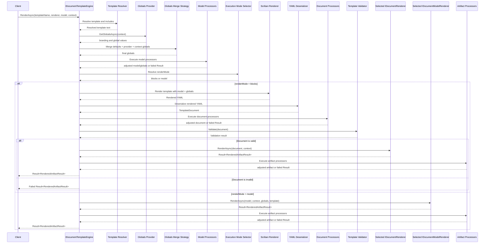

# Design Document: Extensible Document Templating Feature

[TOC]

## 1. Overview

This document describes the design of a reusable document templating platform for .NET based on:

- renderer families such as `pdf`, `html`, `text`, and future extensions such as `excel`
- MigraDoc and PDFsharp for one concrete `pdf` renderer implementation
- Scriban for dynamic template expansion
- YAML as the human-readable template definition format

The platform is intended to support:

- dynamic document templates
- reusable built-in templates
- project-specific template extensions
- multiple template sources
- supports alternative renderers over the same document model and template pipeline
- optional whole-document model renderers for families that do not fit block composition well
- globalization/localization
- branding/themes
- custom business document modules
- use across multiple applications/projects

The platform is not just a rendering helper. It is intended to be a shared infrastructure package for document generation.

---

## 2. Goals

### 2.1 Functional goals

The system shall support:

- defining document templates as text
- dynamic placeholders, loops, and conditions
- rendering normal business documents such as:
  - invoices
  - letters
  - offers
  - reports
- additional renderer implementations for other output targets
- custom document types added later by developers
- built-in default templates distributed with the package
- project-specific templates loaded from:
  - embedded resources
  - file system
  - SQL/database
  - custom sources
- template partials/includes
- localization and culture-aware template resolution
- themes/branding such as:
  - company colors
  - logos
  - legal footer text
  - tenant/customer branding
- validation before rendering
- renderer-family-specific output generation such as PDF, HTML, text, or future Excel

### 2.2 Technical goals

The system shall be:

- reusable across multiple solutions/projects
- extensible without modifying the core package
- DI-friendly
- aligned with the DevKit `Result`/`Result<T>` pattern on public APIs
- testable
- observable/debuggable
- versionable
- suitable for packaging into NuGet libraries
- renderer-agnostic in the core pipeline
- open for new renderer families without redesigning template resolution or schema

---

## 3. Non-goals

The system is not intended to:

- mirror the full object model of any concrete renderer in YAML
- become a general-purpose document design language
- support WYSIWYG template editing out of the box
- act as an HTML/CSS rendering engine
- support arbitrary user scripting beyond controlled Scriban usage
- expose unrestricted dynamic code execution in templates

---

## 4. High-level architecture

## 4.1 Processing pipeline

```text
Business Model
    ->
Template Resolution
    ->
Global Merge Strategy
    ->
Model Processors
    ->
Execution Mode Selection
    ->
    [blocks] Scriban Rendering
        ->
    [blocks] Rendered YAML
        ->
    [blocks] YAML Deserialization
        ->
    [blocks] TemplateDocument
        ->
    [blocks] Document Processors
        ->
    [blocks] Validation
        ->
    [blocks] Renderer
    or
    [model] Model Renderer
    ->
Artifact Processors
    ->
Rendered Output
```

The same pipeline as a Mermaid flowchart:

```mermaid
flowchart LR
    model[Model] --> resolve[Template Resolution]
    resolve --> globals[Global Merge Strategy]
    globals --> modelProcessors[Model Processors]
    modelProcessors --> mode{Execution Mode}
    mode -->|blocks| scriban[Scriban Rendering]
    scriban --> yaml[Rendered YAML]
    yaml --> parse[YAML Deserialization]
    parse --> document[TemplateDocument]
    document --> documentProcessors[Document Processors]
    documentProcessors --> validate[Validation]
    validate --> renderer[Selected IDocumentRenderer]
    mode -->|model| modelRenderer[Selected IDocumentModelRenderer]
    renderer --> artifactProcessors[Artifact Processors]
    modelRenderer --> artifactProcessors
    artifactProcessors --> output[Rendered Output]
```



One renderer implementation may target PDF using MigraDoc and PDFsharp. The architecture must primarily support peer renderer families over the same validated `TemplateDocument`, for example HTML preview, email body generation through HTML, plain text, or future Excel export. It should also support a simpler whole-document model-renderer path for families or document types where block composition would be unnatural, overly verbose, or too lossy.

## 4.2 Separation of concerns

The platform is divided into these layers:

1. Template resolution
2. Strategy and processor based pipeline customization
3. execution mode selection
4. Template text rendering with Scriban for block-based templates
5. Template parsing/deserialization for block-based templates
6. Validation
7. Intermediate document model
8. block-based renderer family abstraction
9. whole-document model-renderer abstraction
10. concrete renderer family implementation (PDF, HTML, text, etc.)
11. Extension/module registration

This separation allows independent extension and testing. In practice, the block path is the richer shared-document path, while the model path is the easier code-first path when a team wants to stay close to the original CLR model and renderer-native APIs.

A runtime render request typically flows through the components like this:



---

## 5. Core design principles

### 5.1 Shared intermediate document model

The canonical path transforms most document types into a common intermediate structure:

- `TemplateDocument`
- sections
- styles
- blocks

This avoids creating a separate engine per document family for the normal case.

### 5.2 Multiple input models, one rendering model

Different business data models may be used:

- `InvoiceModel`
- `LetterModel`
- `InspectionReportModel`

Most are rendered through Scriban into the same shared `TemplateDocument`.

### 5.3 Extensible block model

The core platform provides standard blocks such as:

- paragraph
- table
- image
- spacer
- page break

Projects/modules may add custom blocks such as:

- invoiceLineItems
- totalsBlock
- addressWindow
- findingsTable
- signatureBlock

### 5.4 Resolver-based template sourcing

Templates are not tied to file paths.
Templates are loaded via resolver abstractions.

### 5.5 Built-ins + override model

The platform provides built-in templates as embedded resources.
Projects may override or extend them via additional resolvers.

### 5.6 Scriban for data expansion, not layout semantics

Scriban is used to:

- inject values
- iterate collections
- include partials
- evaluate simple conditions

It is not intended to become the layout engine itself.

### 5.7 Renderer-agnostic output model

The default template pipeline ends in a validated `TemplateDocument`, not in a PDF-only representation.

Block-based renderers are peers. PDF, HTML, plain text, or other target formats should normally transform the same document model without changing template resolution, Scriban evaluation, YAML parsing, or validation behavior.

An additional HTML renderer transforming the same document model should be implemented as a proof of concept for this renderer-agnostic design.

### 5.8 Optional simpler model-renderer path

Some families or document types do not fit the shared block model well, for example `excel`, narrowly specialized email bodies, or highly branded renderer-native PDFs.

For those cases the platform may branch after template resolution, global merging, and model processors into a whole-document model renderer selected by `template name + renderer family`.

This is the simpler authoring path when a team wants to stay close to the CLR model and renderer-native APIs:

- model renderers are the easiest path to implement for renderer-native output
- block renderers remain the richer shared-document path when reuse across renderer families matters
- model renderers are opt-in through the resolved execution descriptor with `RenderMode = Model`
- template resolution, tenant/module/culture fallback, model processors, and artifact processors still stay shared
- the model-renderer path skips Scriban, YAML-to-`TemplateDocument` deserialization, document processors, and block rendering

### 5.9 Concept glossary

The following glossary summarizes the main concepts used throughout the design. It is a quick reference, not a replacement for the detailed sections later in the document.

| Term | Meaning in this design | Technical shape / notes |
| --- | --- | --- |
| family | A logical output category used to group renderers and block renderers | usually a renderer family such as `pdf`, `html`, `text`, or `excel` |
| template | A named document definition that the engine can resolve and render | may come from YAML-backed resolvers or code-first registration |
| configured template | A template registered directly in code instead of loaded from YAML | `RegisterModelTemplate(...)`, `ConfiguredTemplateResolver` |
| template source | One raw template input before indexing and resolution | `TemplateSource` |
| template resolver | A component that loads template sources from one backend | `ITemplateResolver`, for example embedded resource, file system, SQL, configured |
| template cache | The in-memory index of all loaded templates and the place where logical matching happens | `ITemplateCache`; resolves by `Name + TenantId + Module + Culture` |
| template metadata | Static identity data used to match and diagnose templates | `TemplateMetadata`; includes `name`, `tenantId`, `module`, `culture` |
| execution descriptor | Static data that tells the engine how to execute a resolved template | `TemplateExecutionDescriptor`; mainly `RenderMode` and `DocumentKind` |
| resolved template | The single template chosen for one render request | `ResolvedTemplate`; includes metadata, source info, execution descriptor |
| business model | The application/domain object passed into rendering as the main input | examples are `InvoiceModel`, `OrderDocumentModel`, `OrderExportModel` |
| block path | The default execution path that goes through Scriban, YAML deserialization, `TemplateDocument`, validation, and block renderers | `RenderMode = Blocks` |
| model path | The simpler execution path that skips `TemplateDocument` and renders directly from the CLR model | `RenderMode = Model` |
| render context | Per-request caller input that influences resolution and rendering | `TemplateRenderContext`; includes `Culture`, `TenantId`, `Module`, globals |
| document model | The shared intermediate structure for the block path | `TemplateDocument` |
| document kind | The structural kind of block-rendered document being materialized | open string key; built-ins are `page` and `workbook` |
| `TemplateDocument` | The concrete shared document type used on the block path | one root with `Kind` plus kind-specific shapes such as `Sections` or `Sheets` |
| document kind definition | A registered definition for one block-path document kind | built-ins: `page`, `workbook`; custom kinds are allowed |
| document kind parser | A parser/materializer that turns kind-specific YAML into `TemplateDocument` | `ITemplateDocumentKindParser` |
| document kind validator | A validator for one registered block-path document kind | `ITemplateDocumentKindValidator` |
| kind payload | An advanced typed payload for custom document kinds inside the shared root | `TemplateDocument.KindPayload` |
| page kind | The built-in page/document-oriented block kind | `document.kind: page`; uses `sections`, `header`, `body`, `footer` |
| workbook kind | The built-in workbook-oriented block kind | `document.kind: workbook`; uses `sheets` |
| block | One semantic fragment inside the shared document model | `IBlock`; examples are paragraph, table, image, custom blocks |
| block renderer | A family-specific renderer for one block type | `IBlockRenderer`; for example `(pdf, paragraph)` or `(html, table)` |
| block validator | A validator for one block type after YAML deserialization | `IBlockValidator` |
| renderer family | A named output family such as `pdf`, `html`, `text`, or `excel` | selected by renderer `Name` / family key |
| document renderer | A renderer that turns a `TemplateDocument` into one family-specific artifact | `IDocumentRenderer` |
| model renderer | A renderer that skips blocks and produces the final artifact directly from the CLR model | `IDocumentModelRenderer` |
| renderer implementation | A concrete class for one renderer family | for example MigraDoc/PDFsharp PDF renderer, `ProjectHtmlRenderer`, `ProjectTextRenderer`, `OrderExportExcelRenderer` |
| PDF renderer | A concrete renderer implementation for the `pdf` family | usually page-oriented, for example MigraDoc/PDFsharp |
| HTML renderer | A concrete renderer implementation for the `html` family | may use a typed HTML tree such as `HtmlTags` |
| text renderer | A concrete renderer implementation for the `text` family | produces readable plain text output |
| Excel renderer | Usually a model renderer for the `excel` family | for example ClosedXML-based export renderer |
| template engine | The main application-facing service used to render and validate templates | `IDocumentTemplateEngine` |
| branding provider | Supplies branding/theme values for rendering | provider service, consumed during globals assembly |
| globals provider | Supplies global values shared across templates | provider service, consumed before merge strategy |
| asset resolver | Resolves external named assets such as images or files | `IAssetResolver` |
| Scriban configurer | Applies project-specific Scriban setup before rendering templates | `IScribanConfigurer` |
| discovery service | Scans assemblies and registers discovered handlers | block discovery service, document kind discovery service, model renderer discovery service |
| document kind registry | Runtime lookup for registered document kinds, parsers, and validators | built-in kinds plus custom registered kinds |
| strategy | A single active policy component that owns one centralized decision rule | `ITemplateGlobalsMergeStrategy`, `IRenderDegradationStrategy` |
| processor | An ordered pipeline step that can enrich, mutate, diagnose, or stop processing at a safe lifecycle stage | `ITemplateModelProcessor`, `ITemplateDocumentProcessor`, `IRenderedArtifactProcessor` |
| validator | A component that checks whether some render input is valid | block validators, document validation, model-renderer validators |
| model-renderer validator | An optional validator for a whole-document model renderer path | `IModelRendererValidator` |
| artifact | The final rendered output returned by the engine | `RenderedArtifactResult`; includes `ContentType`, `Content`, optional `NativeArtifact` |
| artifact content | The serialized bytes of the final artifact | `RenderedArtifactResult.Content` |
| native artifact | An optional renderer-native object exposed alongside serialized bytes | `RenderedArtifactResult.NativeArtifact` |
| artifact processor | A post-render processor that adjusts the final artifact | `IRenderedArtifactProcessor`; may work on bytes and optionally `NativeArtifact` |
| diagnostics | Structured information about how the render ran | `TemplateDiagnostics`; includes selected template, execution mode, processors, strategies, warnings |
| registries | Runtime lookup maps for discovered handlers | block renderer registry, model renderer registry |

---

## 6. Main use cases

### 6.1 Built-in business document generation

A project uses built-in templates such as:

- invoice
- letter

and renders them with project-specific business models.

### 6.2 Project-specific templates from embedded resources

A consuming project ships its own templates embedded into its assembly.

### 6.3 Templates from SQL

A project stores templates centrally in SQL and resolves them through a custom resolver.

### 6.4 Localized templates

A document named `invoice` is resolved using culture fallback:

- `invoice.de-DE`
- `invoice.de`
- `invoice`

### 6.5 Branding and themes

A project injects:

- logos
- colors
- company data
- legal text
- named assets and text fragments
- tenant- or project-specific soft resources

through a global theme/branding provider.

### 6.6 Custom document modules

A project adds custom blocks and templates for a domain-specific document family.

### 6.7 Multiple render targets

A project renders the same logical template to different targets, for example:

- PDF for final delivery
- HTML for preview
- plain text or other custom formats for downstream processing

---

## 7. Package architecture

Recommended package split:

### 7.1 `BridgingIT.DevKit.Application.Templating.Core`

Contains:

- core abstractions
- root models
- registry abstractions
- resolver abstractions
- renderer abstractions
- diagnostics
- exceptions
- builder contracts

### 7.2 `BridgingIT.DevKit.Application.Templating.Scriban`

Contains:

- Scriban rendering service
- include support
- helper registration
- caching of compiled Scriban templates

### 7.3 `BridgingIT.DevKit.Application.Templating.Yaml`

Contains:

- YAML deserialization
- polymorphic block deserialization
- template schema loading helpers

### 7.4 `BridgingIT.DevKit.Application.Templating.MigraDoc`

Contains:

- `pdf` family block renderers
- MigraDoc style mapping
- page setup mapping
- a PDF renderer implementation
- PDF output pipeline

### 7.5 `BridgingIT.DevKit.Application.Templating.Html`

Contains:

- `html` family block renderers
- typed HTML fragment/document targets built on `HtmlTags`
- an HTML renderer implementation
- HTML/email body output helpers

### 7.6 `BridgingIT.DevKit.Application.Templating.Text`

Contains:

- `text` family block renderers
- plain text targets
- a text renderer implementation
- readable fallback formatting for non-textual blocks

### 7.7 `BridgingIT.DevKit.Application.Templating.Templates.Core`

Contains:

- embedded built-in templates
- shared style partials
- default invoice/letter templates
- embedded resource resolver registration

### 7.8 Optional extension packages

Examples:

- `BridgingIT.DevKit.Application.Templating.Extensions.Invoicing`
- `BridgingIT.DevKit.Application.Templating.Extensions.Reporting`
- `BridgingIT.DevKit.Application.Templating.Extensions.ProjectX`
- `BridgingIT.DevKit.Application.Templating.Excel`
- other renderer-family packages as needed

---

## 8. Public configuration model

The platform shall expose a builder-style registration API.

## 8.1 Example target usage

```csharp
builder.Services
    .AddTemplating(c =>
    {
        c.Enabled = true;
        c.RegisterModelTemplate(
            name: "order-export",
            module: "Sales",
            culture: "en-US");
    })
    .AddCoreTemplates()
    .AddInvoiceModule()
    .AddTemplates<AssemblyTypeMarker>()
    .AddDocumentKinds<AssemblyTypeMarker>()
    .AddResolver(
        c => c.Enabled = true,
        new SqlTemplateResolver(...));
```

## 8.2 Builder API goals

The builder API should:

- be fluent
- support optional configuration of each feature/module
- integrate with dependency injection
- support adding built-ins and project-specific modules
- support custom resolvers
- support code-first model template registration in `AddTemplating(...)`
- support custom renderer families
- support open document-kind registration with built-in `page` and `workbook`
- support automatic discovery of blocks, renderer-family-specific block renderers, and optional validators
- support strategy replacement for centralized policy decisions
- support ordered processors for safe pipeline customization
- support resolver ordering

## 8.3 Example builder interfaces

```csharp
public sealed class TemplatingOptions
{
    public bool Enabled { get; set; } = true;
    public string DefaultCulture { get; set; } = "en-US";
    public bool EnableCaching { get; set; } = true;
    public bool EnableValidation { get; set; } = true;
    public IList<ConfiguredTemplateRegistration> Templates { get; } = [];

    public TemplatingOptions RegisterModelTemplate(
        string name,
        string? module = null,
        string? culture = null,
        string? tenantId = null,
        string? variant = null,
        string? version = null)
    {
        Templates.Add(new ConfiguredTemplateRegistration
        {
            Metadata = new TemplateMetadata
            {
                Name = name,
                TenantId = tenantId,
                Module = module,
                Culture = culture,
                Variant = variant,
                Version = version
            },
            Execution = new TemplateExecutionDescriptor
            {
                RenderMode = TemplateExecutionMode.Model
            },
            Source = "AddTemplating"
        });

        return this;
    }
}
```

```csharp
public interface ITemplatingBuilder
{
    IServiceCollection Services { get; }
}
```

Extension examples:

```csharp
public static class TemplatingServiceCollectionExtensions
{
    public static ITemplatingBuilder AddTemplating(
        this IServiceCollection services,
        Action<TemplatingOptions>? configure = null);

    public static ITemplatingBuilder AddCoreTemplates(
        this ITemplatingBuilder builder);

    public static ITemplatingBuilder AddInvoiceModule(
        this ITemplatingBuilder builder);

    public static ITemplatingBuilder AddProjectTemplates(
        this ITemplatingBuilder builder);

    public static ITemplatingBuilder AddBlocks<TMarker>(
        this ITemplatingBuilder builder);

    public static ITemplatingBuilder AddDocumentKinds<TMarker>(
        this ITemplatingBuilder builder);

    public static ITemplatingBuilder AddModelRenderers<TMarker>(
        this ITemplatingBuilder builder);

    public static ITemplatingBuilder AddEmbeddedResourceResolver(
        this ITemplatingBuilder builder,
        Assembly assembly,
        int priority = 500);

    public static ITemplatingBuilder AddResolver(
        this ITemplatingBuilder builder,
        Action<ResolverOptions>? configure,
        ITemplateResolver resolver);

    public static ITemplatingBuilder AddRenderer<TRenderer>(
        this ITemplatingBuilder builder)
        where TRenderer : class, IDocumentRenderer;

    public static ITemplatingBuilder AddGlobalsMergeStrategy<T>(
        this ITemplatingBuilder builder)
        where T : class, ITemplateGlobalsMergeStrategy;

    public static ITemplatingBuilder AddRenderDegradationStrategy<T>(
        this ITemplatingBuilder builder)
        where T : class, IRenderDegradationStrategy;

    public static ITemplatingBuilder AddModelProcessor<T>(
        this ITemplatingBuilder builder)
        where T : class, ITemplateModelProcessor;

    public static ITemplatingBuilder AddDocumentProcessor<T>(
        this ITemplatingBuilder builder)
        where T : class, ITemplateDocumentProcessor;

    public static ITemplatingBuilder AddArtifactProcessor<T>(
        this ITemplatingBuilder builder)
        where T : class, IRenderedArtifactProcessor;
}
```

---

## 9. Template resolution

## 9.1 Requirement

Templates must be loadable from various sources:

- `AddTemplating(...)` code-first registrations
- embedded resources
- file system
- SQL/database
- custom backends

## 9.2 Core abstractions

```csharp
public interface ITemplateResolver
{
    Task<IReadOnlyList<TemplateSource>> LoadAsync(
        CancellationToken cancellationToken = default);
}
```

Code-first template registrations should not bypass resolution. They should be translated into the same shared template source/caching model through an internal options-backed resolver such as `ConfiguredTemplateResolver`.

## 9.3 Template identifier

```csharp
public sealed class TemplateIdentifier
{
    public string Name { get; init; } = default!;
    public string? Culture { get; init; }
}
```

## 9.4 Resolved template

```csharp
public sealed class ResolvedTemplate
{
    public string Name { get; init; } = default!;
    public string? TenantId { get; init; }
    public string? Module { get; init; }
    public string? Culture { get; init; }
    public string? Variant { get; init; }
    public string? Version { get; init; }
    public string? Content { get; init; }
    public string? Source { get; init; }
    public ContentType? ContentType { get; init; }
    public string? TemplateFormat { get; init; }
    public DateTimeOffset? LastModifiedUtc { get; init; }
    public bool IsBuiltIn { get; init; }
    public TemplateExecutionDescriptor Execution { get; init; } = default!;
}
```

## 9.5 Template sources: YAML and code-first

Resolvers are responsible for late-bound loading of template files/resources/rows.
`AddTemplating(...)` code-first registrations are responsible for early-bound application-level model template definitions and form the simplest setup for model-rendered templates.

They do not decide the final template match on their own. Instead, the templating pipeline:

- loads templates from all configured sources
- reads metadata/execution either directly from code-first registrations or by parsing the static YAML `metadata` section
- stores the loaded templates in an in-memory cache
- resolves by `Name + TenantId + Module + Culture` from that cache during rendering

Example source model:

```csharp
public sealed class TemplateSource
{
    public string? Content { get; init; }
    public TemplateMetadata? Metadata { get; init; }
    public TemplateExecutionDescriptor? Execution { get; init; }
    public string? Source { get; init; }
    public ContentType? ContentType { get; init; }
    public string? TemplateFormat { get; init; }
    public DateTimeOffset? LastModifiedUtc { get; init; }
    public bool IsBuiltIn { get; init; }
}

public sealed class TemplateMetadata
{
    public string Name { get; init; } = default!;
    public string? TenantId { get; init; }
    public string? Module { get; init; }
    public string? Culture { get; init; }
    public string? Variant { get; init; }
    public string? Version { get; init; }
}

public sealed class TemplateEnvelope
{
    public TemplateMetadata Metadata { get; init; } = default!;
    public object? Document { get; init; }
}

public enum TemplateExecutionMode
{
    Blocks,
    Model
}

public sealed class TemplateExecutionDescriptor
{
    public TemplateExecutionMode RenderMode { get; init; } =
        TemplateExecutionMode.Blocks;
    public string? DocumentKind { get; init; }
    public string? TemplateType { get; init; }
}

public sealed class TemplateMetadataParseResult
{
    public TemplateMetadata Metadata { get; init; } = default!;
    public TemplateExecutionDescriptor Execution { get; init; } = default!;
    public string DocumentContent { get; init; } = default!;
}

public interface ITemplateMetadataParser
{
    TemplateMetadataParseResult Parse(string templateContent);
}
```

For YAML-backed templates, each template contains static resolver metadata at the top of the YAML.

Recommended wrapper shape:

```yaml
metadata:
  name: order-confirmation
  tenantId:
  module: Sales
  culture: en-US
  variant:
  version:

document:
  version: 1
  renderMode: blocks
  kind: page
  sections:
    - body:
        - type: paragraph
          text: "Thank you for your purchase, {{ model.customerName }}."
```

The `metadata` section must be static YAML and must not contain Scriban expressions.
It is parsed before rendering and used for cache indexing and template selection.

Inside `document`, the `renderMode` scalar and, for block-rendered templates, the `kind` scalar must be static YAML scalars and must not contain Scriban expressions. The engine needs those values before Scriban runs so it can decide whether the template follows the normal block pipeline or the simpler model-renderer path and, for block-rendered templates, which document-kind parser should materialize the final `TemplateDocument`.

For code-first model templates, the application registers the same identity plus execution descriptor directly in `AddTemplating(...)`:

```csharp
builder.Services.AddTemplating(c =>
{
    c.RegisterModelTemplate(
        name: "order-export",
        module: "Sales",
        culture: "en-US");
});
```

That parsing should live behind a small abstraction such as `ITemplateMetadataParser`. The cache should use parsed metadata when content is YAML-backed, but it should accept already-supplied metadata/execution for code-first registrations. This keeps `TemplateCache` focused on loading, indexing, and lookup rather than envelope parsing mechanics.

The `document` section contains the existing Scriban/YAML document definition for block-rendered templates and the static `renderMode`/`kind` execution descriptor for YAML-backed model-rendered templates. Code-first model templates do not need a YAML wrapper at all.

For block-rendered templates, `document.kind` defaults to `page` when omitted so existing page-style templates remain valid. The platform ships `page` and `workbook` as built-in kinds, but the value is intentionally an open string so projects can register additional custom kinds later.

Explicit template identity rules:

- multiple templates may share the same `metadata.name`
- this is expected for tenant-specific, culture-specific, or module-specific templates
- the active logical key is `name + tenantId + module + culture`
- two templates with different cultures may therefore share the same `metadata.name` without conflict
- if multiple loaded templates produce the same full logical key, the last loaded template overwrites the earlier one in cache

`metadata.variant` and `metadata.version` are reserved for future use. They may be stored and exposed for diagnostics or future evolution, but they are not part of current selection or fallback behavior.

`ContentType` should use the typed [`ContentType`](/f:/projects/bit/bIT.bITdevKit/src/Common.Utilities/ContentTypes/ContentType.cs) enum from `BridgingIT.DevKit.Common` whenever the value represents a real media type. Internal template authoring details such as `"yaml.scriban"` or `"configured"` should use a separate field such as `TemplateFormat`, not `ContentType`.

Source rules:

- `metadata` is the source of truth for template identity and selection
- `metadata.tenantId` is optional and enables tenant-specific templates
- resolver-loaded YAML templates contribute identity by parsing static YAML metadata
- code-first registrations contribute identity by supplying the same metadata directly in `AddTemplating(...)`
- callers may register model templates one by one in `AddTemplating(...)`
- embedded resource resolution is assembly-scan-first: the resolver scans the provided assembly for embedded `*.yaml.scriban` resources and loads them automatically
- resource names are only a discovery detail and are not part of the public matching contract
- in v1, code-first registration is only for `renderMode: model`, which is also the simpler authoring path

## 9.6 Built-in resolvers

The platform should provide:

- `ConfiguredTemplateResolver`
- `EmbeddedResourceTemplateResolver`
- `FileSystemTemplateResolver`
- `SqlTemplateResolver`

Optional:

- `InMemoryTemplateResolver`

## 9.7 Composite resolver strategy

A composite resolver loads templates from child resolvers in precedence order and contributes them to the shared template cache.

Recommended resolution order:

1. built-in embedded resource resolver
2. file system resolver(s)
3. SQL/database resolver(s)
4. project-specific resolver(s)
5. code-first configured template resolver

When multiple loaded templates produce the same logical key, later-loaded templates overwrite earlier-loaded templates during cache population.

To make that deterministic:

- lower `Priority` values should be loaded first
- higher `Priority` values should be loaded later and therefore win on conflict
- each resolver should enumerate its templates in a deterministic order

`Priority` is an overwrite precedence, not an execution urgency flag. Higher numbers mean stronger override behavior.

Default precedence rule:

- code-first registrations from `AddTemplating(...)` should be loaded last and therefore win over resolver-loaded templates with the same logical key

## 9.8 Localization fallback

Template resolution shall support culture fallback:

Request:

- `invoice`, culture `de-DE`

Resolution attempts:

1. `invoice.de-DE`
2. `invoice.de`
3. `invoice`

This logic should be centralized and reusable across resolvers.

## 9.9 Module-aware resolution

`TemplateRenderContext.Module` is an optional case insensitive selector that flows into template resolution.

If a module is specified, render-time resolution should first look for module-scoped cached templates and then fall back to the global template set.

Example request:

- template `invoice`, module `Invoicing`, culture `de-DE`

Resolution attempts may be:

1. module `Invoicing` + `invoice.de-DE`
2. module `Invoicing` + `invoice.de`
3. module `Invoicing` + `invoice`
4. global + `invoice.de-DE`
5. global + `invoice.de`
6. global + `invoice`

The physical file name or resource name is only a load-time detail. The logical match is based on cached YAML metadata.

If `Module` is not set, template resolution stays global only.

## 9.10 Tenant-aware resolution

`TemplateRenderContext.TenantId` is an optional selector that also flows into template resolution.

If a tenant is specified, render-time resolution should first look for tenant-scoped cached templates and then fall back to non-tenant templates.

Example request:

- template `invoice`, tenant `tenant-42`, module `Invoicing`, culture `de-DE`

Resolution attempts may be:

1. tenant `tenant-42` + module `Invoicing` + `invoice.de-DE`
2. tenant `tenant-42` + module `Invoicing` + `invoice.de`
3. tenant `tenant-42` + module `Invoicing` + `invoice`
4. tenant `tenant-42` + global + `invoice.de-DE`
5. tenant `tenant-42` + global + `invoice.de`
6. tenant `tenant-42` + global + `invoice`
7. non-tenant + module `Invoicing` + `invoice.de-DE`
8. non-tenant + module `Invoicing` + `invoice.de`
9. non-tenant + module `Invoicing` + `invoice`
10. non-tenant + global + `invoice.de-DE`
11. non-tenant + global + `invoice.de`
12. non-tenant + global + `invoice`

`Brand` remains available through `TemplateRenderContext` and the branding/global providers, but it is not part of template identity. Brand differences should normally be expressed through branding values instead of separate templates.

---

## 10. Template includes and partials

## 10.1 Requirement

Templates must support partials/includes.

Use cases:

- shared header
- shared footer
- default styles
- common address block
- legal notices

## 10.2 Design

Includes must resolve through the same resolver abstraction, not file paths.

This ensures support for:

- embedded resources
- SQL
- composite resolution
- localization
- project overrides

The include bridge should run through the shared template cache rather than bypassing the template pipeline.

Recommended flow:

1. The main template is resolved from `ITemplateCache`.
2. Scriban include requests are intercepted by a custom Scriban template loader.
3. That loader builds a `TemplateIdentifier` for the include name.
4. The loader resolves the include through `ITemplateCache.Resolve(...)` using the current `TemplateResolutionContext`.
5. Culture, tenant, and module fallback therefore apply to partials the same way they apply to root templates.
6. The loader returns the included template text to Scriban.

Sketch:

```csharp
public sealed class ScribanIncludeLoader : /* Scriban template loader interface */
{
    private readonly ITemplateCache _cache;

    public ScribanIncludeLoader(ITemplateCache cache)
    {
        _cache = cache;
    }

    public string Load(
        string includeName,
        TemplateResolutionContext context)
    {
        var result = _cache.Resolve(
            new TemplateIdentifier { Name = includeName },
            context);

        if (result.IsFailure)
            throw new InvalidOperationException(
                $"Included template '{includeName}' could not be resolved.");

        return result.Value.Content;
    }
}
```

Built-in document kinds `page` and `workbook` should be registered by default in `AddTemplating(...)`. `AddDocumentKinds<TMarker>()` is for custom kind discovery and extension modules, not for enabling the built-ins.

This keeps include resolution aligned with resolver precedence, cache semantics, tenant/module selection, and culture fallback.

## 10.3 Include conventions

Examples:

- `"shared/header"`
- `"shared/footer"`
- `"styles/default"`
- `"invoice/line-items"`

A resolver convention may map these to actual resource names or records.

---

## 11. Globalization and localization

## 11.1 Requirement

The platform must support:

- culture-aware template resolution
- culture-aware formatting
- localized labels/content
- fallback behavior

## 11.2 Culture-aware render context

```csharp
public sealed class TemplateRenderContext
{
    public string? Culture { get; init; }
    public string? TimeZone { get; init; }
    public string? TenantId { get; init; }
    public string? Brand { get; init; }
    public string? Module { get; init; }
    public IDictionary<string, object?> Globals { get; init; } =
        new Dictionary<string, object?>();
}
```

`TenantId` is optional. When set, it acts as an additional template selector. `Module` is also optional and further narrows selection. `Brand` remains available to branding/global providers, but does not participate in template identity.

Global merge precedence should be explicit:

1. built-in defaults
2. `ITemplateGlobalsProvider`
3. `TemplateRenderContext.Globals`

When the same key exists more than once, the later source wins. Merging should be case-insensitive.

That merge rule should live behind a dedicated `ITemplateGlobalsMergeStrategy` so projects can replace it without reimplementing the whole engine. The default strategy should preserve the current precedence:

1. built-in defaults
2. `ITemplateGlobalsProvider`
3. `TemplateRenderContext.Globals`

## 11.3 Localization strategies

Supported strategies may include:

- separate localized templates
- localized partials
- localized global values
- helper-based formatting

## 11.4 Scriban helpers for globalization

Custom helpers should support:

- date formatting
- number formatting
- currency formatting
- culture lookup
- translation lookup

Examples:

- `format_date`
- `format_currency`
- `translate`

---

## 12. Branding and themes

## 12.1 Requirement

The platform must support project-level and tenant-level branding.

Examples:

- logo
- company name
- address
- primary/secondary colors
- legal footer text
- support contact data
- named image assets
- named text snippets
- arbitrary branding values used by specific templates

## 12.2 Global theme/branding provider

```csharp
public interface ITemplateGlobalsProvider
{
    Task<IDictionary<string, object?>> GetGlobalsAsync(
        TemplateRenderContext context,
        CancellationToken cancellationToken = default);
}
```

Typical globals:

- `branding`
- `company`
- `legal`
- `app`

The `branding` global should not be limited to a fixed CLR shape. It should support named soft resources so templates can access branding assets, colors, texts, and other values without requiring a core model change for every new branding need.

## 12.3 Theme model example

```csharp
public sealed class BrandingModel
{
    public string? CompanyName { get; set; }
    public IDictionary<string, string> Assets { get; set; } =
        new Dictionary<string, string>(StringComparer.OrdinalIgnoreCase);
    public IDictionary<string, string> Colors { get; set; } =
        new Dictionary<string, string>(StringComparer.OrdinalIgnoreCase);
    public IDictionary<string, string> Texts { get; set; } =
        new Dictionary<string, string>(StringComparer.OrdinalIgnoreCase);
    public IDictionary<string, object?> Values { get; set; } =
        new Dictionary<string, object?>(StringComparer.OrdinalIgnoreCase);
}
```

This keeps common branding data structured, but still allows project- and tenant-specific resources such as `branding.assets.headerLogo`, `branding.colors.accent`, `branding.texts.legalDisclaimer`, or `branding.values.supportPhone`.

## 12.4 Template usage

Templates may consume theme globals like:

```yaml
header:
  - type: image
    path: "{{ branding.assets.headerLogo }}"
    width: 4cm

  - type: paragraph
    text: "{{ branding.companyName }}"

  - type: paragraph
    text: "{{ branding.texts.legalDisclaimer }}"

body:
  - type: paragraph
    text: "Support: {{ branding.values.supportEmail }}"
```

Named colors may then be consumed through styles or renderer-specific mappings where appropriate. The templating should not break if a template references a branding value that is not set. This allows templates to be resilient to different branding configurations and for branding to evolve without necessarily requiring template changes.

---

## 13. Asset resolution

## 13.1 Requirement

Templates may reference assets:

- logos
- static images
- signatures
- icons

Assets must not be tied to physical file paths.

## 13.2 Abstraction

```csharp
public interface IAssetResolver
{
    Task<ResolvedAsset> ResolveAsync(
        string identifier,
        CancellationToken cancellationToken = default);
}
```

```csharp
public sealed class ResolvedAsset
{
    public string Identifier { get; init; } = default!;
    public Stream Content { get; init; } = default!;
    public ContentType? ContentType { get; init; }
    public string? Source { get; init; }
}
```

## 13.3 Supported asset sources

- file system
- embedded resources
- database
- blob storage
- project-specific providers

---

## 14. Template schema

## 14.1 Root model

The following schema describes the inner `document` section of a template wrapper for the default block-rendered path. Resolver metadata such as `module` and `culture` lives in the outer `metadata` section, not inside `TemplateDocument`.

`TemplateDocument` is a shared semantic document model. It is intentionally renderer-family-neutral and should not encode MigraDoc-, HTML-, text-, or Excel-specific object graphs.

The public model now distinguishes between execution mode and document kind:

- `RenderMode = Blocks` means the template will materialize a shared `TemplateDocument`
- `RenderMode = Model` means the template skips `TemplateDocument` entirely
- `Kind` identifies the block-path document shape and is only relevant when `RenderMode = Blocks`

`document.kind` is an open extension point. The platform provides built-in registrations for `page` and `workbook`, but projects may add their own kinds through discovery and builder registration. To keep authoring simple, built-in kinds use friendly kind-specific shapes such as `sections` for `page` and `sheets` for `workbook` instead of exposing a generic container DSL.

```csharp
public sealed class TemplateDocument
{
    public int Version { get; set; } = 1;
    public TemplateExecutionMode RenderMode { get; set; } =
        TemplateExecutionMode.Blocks;
    public string Kind { get; set; } = "page";
    public string? TemplateType { get; set; }
    public TemplateInfo? Info { get; set; }
    public List<TemplateStyle> Styles { get; set; } = [];
    public List<TemplateSection> Sections { get; set; } = [];
    public List<TemplateSheet> Sheets { get; set; } = [];
    public object? KindPayload { get; set; }
}
```

`RenderMode` defaults to `blocks`. `Kind` defaults to `page`. `TemplateType` is optional semantic metadata for block-rendered documents when a module wants to classify the resulting `TemplateDocument`. It is not used to select model renderers. When `renderMode: model` is selected, the engine still parses the static execution descriptor from the unresolved template envelope, but it does not deserialize the rest of the `document` node into `TemplateDocument`.

For built-in kinds, only the matching kind-specific shape should normally be populated. In other words, `page` documents should populate `Sections`, `workbook` documents should populate `Sheets`, and validators should reject mixed or ambiguous shapes. Custom kinds may instead populate `KindPayload`.

## 14.2 Section and sheet model

```csharp
public sealed class TemplateSection
{
    public PageSetupSpec? PageSetup { get; set; }
    public List<IBlock> Header { get; set; } = [];
    public List<IBlock> Footer { get; set; } = [];
    public List<IBlock> Body { get; set; } = [];
}
```

```csharp
public sealed class TemplateSheet
{
    public string Name { get; set; } = default!;
    public List<IBlock> Body { get; set; } = [];
}
```

`PageSetupSpec` is a renderer hint. Page-oriented families such as `pdf` will usually honor it directly. Flow-oriented or text-oriented families such as `html` and `text` may ignore it and record diagnostics.

`TemplateSection` is the built-in shape for `document.kind: page`. `TemplateSheet` is the initial built-in shape for `document.kind: workbook`. The workbook shape is intentionally small in v1: a workbook contains named `sheets`, and each sheet currently exposes one `body` block list.

Projects may register additional document kinds beyond `page` and `workbook`. Those custom kinds may define their own friendly YAML/document shape, but they should still materialize into the same shared `TemplateDocument` root. For advanced custom kinds, the parser may place a typed payload into `KindPayload`. The complexity belongs in the registered kind parser, not in normal template authoring.

## 14.3 Standard block set

Initial block set:

- paragraph
- table
- image
- spacer
- pageBreak

Additional standard blocks may be added later.

The standard block set is shared across renderer families. A given block may have implementations for `pdf`, `html`, `text`, or any future renderer family without changing the YAML shape.

## 14.4 Custom blocks

Custom blocks are supported via registration and a type discriminator.

- `type: invoiceLineItems`
- `type: findingsTable`

## 14.5 Why blocks exist

`IBlock` objects are fragment DTOs, not behavior objects.

They exist to separate:

- full document input data
- document fragment composition
- final renderer-family execution

For example, a caller may pass one full render model such as `OrderDocumentModel`, but the template may decompose that model into several smaller document fragments:

- `paragraph`
- `orderSummary`
- `orderLineItems`
- `image`

Those blocks are narrower contracts than the full document input model. A block renderer then depends only on the fragment data it actually needs instead of the entire model for the whole document.

This keeps the design modular:

- the full input model can stay broad
- the template chooses which fragments to emit
- each block renderer handles one fragment shape
- renderer families remain generic and do not become order-specific, invoice-specific, or report-specific

Custom blocks should therefore be used for reusable or meaningful document fragments, not for every small grouping of fields.

---

## 15. Block extensibility model

## 15.1 Core abstraction

```csharp
public interface IBlock
{
    string Name { get; }
}
```

## 15.2 Renderer-family abstraction

```csharp
public interface IBlockRenderer
{
    string Renderer { get; }
    string BlockName { get; }

    Task RenderAsync(
        IBlock block,
        IBlockRenderTarget target,
        BlockRenderContext context,
        CancellationToken cancellationToken = default);
}

public interface IBlockRenderTarget
{
}

public interface IBlockRenderer<TBlock, TTarget> : IBlockRenderer
    where TBlock : class, IBlock
    where TTarget : class, IBlockRenderTarget
{
    Task RenderAsync(
        TBlock block,
        TTarget target,
        BlockRenderContext context,
        CancellationToken cancellationToken = default);
}

public abstract class BlockRenderer<TBlock, TTarget> : IBlockRenderer<TBlock, TTarget>
    where TBlock : class, IBlock
    where TTarget : class, IBlockRenderTarget
{
    public abstract string Renderer { get; }
    public abstract string BlockName { get; }

    public abstract Task RenderAsync(
        TBlock block,
        TTarget target,
        BlockRenderContext context,
        CancellationToken cancellationToken = default);

    async Task IBlockRenderer.RenderAsync(
        IBlock block,
        IBlockRenderTarget target,
        BlockRenderContext context,
        CancellationToken cancellationToken)
    {
        if (block is not TBlock typedBlock)
        {
            throw new InvalidOperationException(
                $"Renderer '{Renderer}' for block '{BlockName}' expected block type '{typeof(TBlock).Name}' but received '{block.GetType().Name}'.");
        }

        if (target is not TTarget typedTarget)
        {
            throw new InvalidOperationException(
                $"Renderer '{Renderer}' for block '{BlockName}' expected target type '{typeof(TTarget).Name}' but received '{target.GetType().Name}'.");
        }

        await RenderAsync(typedBlock, typedTarget, context, cancellationToken);
    }
}
```

The core package does not know about MigraDoc `Section`, `HtmlTag`, text buffers, or future Excel worksheets. Those concrete targets belong to renderer-family packages and are wrapped behind `IBlockRenderTarget`.

The runtime engine and registry still dispatch through the non-generic `IBlockRenderer` interface. The generic interface and base class are the preferred authoring surface so extension authors do not write local casts in normal renderer implementations.

If an adapter detects a mismatched block or target type, that is an internal wiring error. The public engine surface should translate that failure into a failed `Result` with `TemplateRenderError` rather than leaking raw casting or invalid operation exceptions to callers.

This also applies to built-in blocks. The engine does not contain special-case paragraph, table, image, spacer, or page-break rendering logic. Instead, each renderer-family package provides the built-in block renderers for the families it supports.

For example, an `html` package may expose an `HtmlRenderTarget` whose `Root` is an `HtmlTag`, allowing block renderers to append typed nodes and only serialize to markup at the end of the renderer pipeline.

## 15.3 Validator abstraction

```csharp
public interface IBlockValidator
{
    string Name { get; }

    IEnumerable<TemplateValidationError> Validate(
        IBlock block,
        ValidationContext context);
}

public interface IBlockValidator<TBlock> : IBlockValidator
    where TBlock : class, IBlock
{
    IEnumerable<TemplateValidationError> Validate(
        TBlock block,
        ValidationContext context);
}

public abstract class BlockValidator<TBlock> : IBlockValidator<TBlock>
    where TBlock : class, IBlock
{
    public abstract string Name { get; }

    public abstract IEnumerable<TemplateValidationError> Validate(
        TBlock block,
        ValidationContext context);

    IEnumerable<TemplateValidationError> IBlockValidator.Validate(
        IBlock block,
        ValidationContext context)
    {
        if (block is not TBlock typedBlock)
        {
            throw new InvalidOperationException(
                $"Validator '{Name}' expected block type '{typeof(TBlock).Name}' but received '{block.GetType().Name}'.");
        }

        return Validate(typedBlock, context);
    }
}
```

If a typed validator adapter detects a mismatched block type, that is also an internal wiring error and should be translated to the public error model before leaving the engine boundary.

## 15.4 Registry

The engine maintains a central registry of:

- block model types
- renderer-family-specific block renderers
- validators

This registry is the main extensibility point for custom document modules.

## 15.5 Automatic block discovery

Manual `registry.Register(...)` calls should not be the normal setup path for application developers.

Instead, the templating feature should support assembly scanning that:

- finds concrete `IBlock` implementations
- finds concrete `IBlockRenderer<TBlock, TTarget>` or `BlockRenderer<TBlock, TTarget>` implementations
- finds zero or one concrete `IBlockValidator<TBlock>` or `BlockValidator<TBlock>` per block name
- matches renderers by `Renderer + BlockName`
- registers the resulting block pipeline automatically into `IBlockRegistry`

Discovery rules:

1. each discovered block name must have exactly one block model type
2. a validator is optional
3. a block may have zero or many renderers, one per renderer family
4. duplicate block names should fail fast during startup
5. duplicate renderers for the same `(renderer, blockName)` should fail fast during startup
6. duplicate validators for the same block name should fail fast during startup

A block may therefore be valid in the schema even if not every renderer family supports it. Support is determined at render time by the selected renderer family and the discovered `(renderer, blockName)` handler.

The runtime registry remains non-generic. Generic renderers and validators are an authoring convenience layer that adapters back into the non-generic runtime contracts.

The discovery mechanism should be explicit:

- `BlockDiscoveryOptions.Assemblies` is only configuration input
- an `IBlockDiscoveryService` should read those assemblies
- it should scan them with reflection
- it should validate the discovery rules
- it should populate `IBlockRegistry`

Recommended startup behavior:

- discovery runs once during application startup
- discovery must complete before the first `RenderAsync(...)`, `RenderPdfAsync(...)`, `RenderHtmlAsync(...)`, or `ValidateAsync(...)` call
- startup should fail fast if discovery finds duplicate or invalid registrations

Example for the built-in `paragraph` block:

- core schema defines `ParagraphBlock`
- `pdf` package provides `ParagraphPdfBlockRenderer : BlockRenderer<ParagraphBlock, MigraDocSectionTarget>`
- `html` package provides `ParagraphHtmlBlockRenderer : BlockRenderer<ParagraphBlock, HtmlRenderTarget>`
- `text` package provides `ParagraphTextBlockRenderer : BlockRenderer<ParagraphBlock, TextRenderTarget>`
- optional validation can use `ParagraphBlockValidator : BlockValidator<ParagraphBlock>`

At render time the engine resolves `ParagraphBlock` from YAML `type: paragraph`, then asks the registry for the renderer-family-specific handler such as `(pdf, paragraph)` or `(html, paragraph)`.

The registry remains the runtime lookup mechanism, but startup should populate it from discovery rather than from repetitive manual registration code.

## 15.6 Model-renderer discovery

Whole-document model renderers should use a separate discovery and registry path so they do not blur the block-renderer contract.

Discovery should be explicit through a builder method such as `AddModelRenderers<TMarker>()` and should scan assemblies for:

- concrete `IDocumentModelRenderer<TModel>` or `DocumentModelRenderer<TModel>` implementations
- optional `IModelRendererValidator<TModel>` or `ModelRendererValidator<TModel>` implementations
- unique keys by `Renderer + TemplateName`

Discovery rules:

1. each discovered `(renderer, templateName)` pair must map to exactly one model renderer
2. a validator is optional
3. duplicate model renderers for the same `(renderer, templateName)` must fail fast during startup
4. duplicate validators for the same `(renderer, templateName)` must fail fast during startup

This registry is only consulted when the resolved template execution descriptor declares `RenderMode = Model`, regardless of whether that descriptor came from YAML or a code-first registration. For the model path, the resolved template `Name` is the canonical identity and the lookup key that pairs with the requested renderer family.

---

## 16. Built-in templates

## 16.1 Requirement

The platform should ship with built-in templates such as:

- invoice
- letter

These should be easy to distribute in a NuGet package.

## 16.2 Distribution strategy

Built-in templates will be embedded resources.

Advantages:

- no separate file deployment required
- versioned with package
- easy packaging
- easy registration

## 16.3 Example built-in content

Built-in embedded templates may include files such as:

- `Templates.Shared.header.yaml.scriban`
- `Templates.Shared.footer.yaml.scriban`
- `Templates.Shared.styles.yaml.scriban`
- `Templates.Invoice.invoice.yaml.scriban`
- `Templates.Letter.letter.yaml.scriban`

These file names are only packaging examples. `AddEmbeddedResourceResolver(assembly)` scans the assembly for all embedded `*.yaml.scriban` resources automatically. The cache then reads the YAML `metadata` and uses that metadata, not the resource name, for logical matching.

For v1, embedded resources remain the normal distribution mechanism for block-rendered built-ins. Code-first registrations are an additional application-level registration path and are primarily intended for model-rendered templates.

## 16.4 Overriding built-ins

Projects may override built-ins by registering higher-`Priority` resolvers. During cache population, later-loaded templates overwrite earlier-loaded templates that have the same active logical key.

---

## 17. Scriban integration

## 17.1 Role of Scriban

Scriban is used for:

- placeholder expansion
- loops
- conditions
- partial includes
- helper function usage

## 17.2 Extensibility

Projects/modules may register:

- custom helper functions
- global values
- include loaders
- custom formatting helpers

## 17.3 Scriban configuration abstraction

```csharp
public interface IScribanConfigurer
{
    void Configure(TemplateContext context);
}
```

## 17.4 Constraints

Scriban usage should be constrained to avoid:

- unrestricted script execution
- deep recursive includes
- excessive runtime complexity

Scriban does not offer full cooperative cancellation for arbitrary template execution. The design should acknowledge that `CancellationToken` alone is not sufficient to stop a bad template once execution has started.

Practical safeguards should include:

- setting Scriban `LoopLimit`
- setting Scriban `RecursiveLimit`
- enforcing `TemplatingOptions.MaxIncludeDepth`
- optionally wrapping execution in a timeout boundary where operationally required

If a timeout boundary is used, it should be treated as a pragmatic safeguard rather than a perfect cancellation mechanism.

---

## 18. YAML deserialization

## 18.1 Requirement

Rendered YAML must be deserialized into the intermediate model.

## 18.2 Polymorphic block handling

Blocks are deserialized based on the `type` field.

Example:

```yaml
- type: paragraph
  text: "Hello"

- type: invoiceLineItems
  items: ...
```

The deserializer uses the block registry to locate the correct CLR type.

The YAML key is `type`, and its value is the registered block name, for example `paragraph` or `orderLineItems`.

This is also the runtime materialization step for custom blocks:

1. the caller provides one full render model
2. Scriban projects that model into YAML
3. that YAML explicitly emits block-shaped objects using `type: ...`
4. the deserializer reads each `type`
5. the block registry maps that `type` to the registered CLR block type
6. YAML is deserialized into concrete `IBlock` instances such as `ParagraphBlock`, `OrderSummaryBlock`, or `OrderLineItemsBlock`

So the engine does not automatically decompose the model into blocks on its own. The template author performs that decomposition by shaping the YAML output. Deserialization then materializes those YAML fragments into typed block DTOs.

## 18.3 Validation after deserialization

Deserialization is followed by structural validation before renderer execution.

---

## 19. Rendering model

## 19.1 Role

The rendering layer converts either a `TemplateDocument` or a whole input model into a renderer-specific output, depending on the selected execution mode.

## 19.2 Responsibilities

- select the target renderer
- select the target execution mode
- validate document-kind support
- expose renderer family capabilities
- apply document metadata
- apply styles
- create sections, sheets, or other kind-appropriate native containers
- configure page setup where relevant
- render headers/footers or other kind-defined regions
- delegate block rendering through registered family-specific block renderers
- optionally delegate whole-document rendering through a model renderer
- produce the renderer-specific output artifact

## 19.3 Renderer abstraction

```csharp
public interface IDocumentRenderer
{
    string Name { get; }
    RendererCapabilities Capabilities { get; }

    Task<Result<RenderedArtifactResult>> RenderAsync(
        TemplateDocument document,
        TemplateRenderContext context,
        CancellationToken cancellationToken = default);
}

public sealed class RendererCapabilities
{
    public IReadOnlyCollection<string> SupportedKinds { get; init; } =
        ["page"];
    public bool SupportsPageSetup { get; init; }
    public bool SupportsHeaders { get; init; }
    public bool SupportsFooters { get; init; }
    public bool SupportsStyles { get; init; }
    public bool SupportsImages { get; init; }
    public bool SupportsTables { get; init; }
    public bool SupportsAbsoluteLayout { get; init; }
    public bool SupportsNativeArtifact { get; init; }
}
```

The engine selects the renderer by matching `IDocumentRenderer.Name` against the `renderer` argument passed to `RenderAsync`. Projects extend rendering by registering additional `IDocumentRenderer` implementations in DI.

One implementation may use MigraDoc and PDFsharp to produce PDF output. Other implementations may target formats such as HTML, plain text, or future Excel. The core engine remains unchanged when new renderer families are added.

Each renderer must also declare the block-path document kinds it supports through `RendererCapabilities.SupportedKinds`. Unsupported `(renderer family, document kind)` combinations should fail clearly with a typed validation/render error instead of silently trying to flatten the document into an unrelated native model.

Each renderer family is also responsible for the built-in blocks for that family. For example, the `pdf` renderer package provides the `paragraph`, `table`, `image`, `spacer`, and `pageBreak` renderers for `pdf`. The `html` and `text` packages do the same for their own families.

## 19.3a Model-renderer abstraction

```csharp
public interface IDocumentModelRenderer
{
    string Renderer { get; }
    string TemplateName { get; }

    Task<Result<RenderedArtifactResult>> RenderAsync(
        object model,
        ModelRenderContext context,
        CancellationToken cancellationToken = default);
}

public interface IDocumentModelRenderer<TModel> : IDocumentModelRenderer
{
    Task<Result<RenderedArtifactResult>> RenderAsync(
        TModel model,
        ModelRenderContext context,
        CancellationToken cancellationToken = default);
}
```

The engine selects a model renderer by matching `(renderer family, template name)` when the resolved template execution descriptor declares `RenderMode = Model`.

If a generic adapter detects that the supplied model does not match `TModel`, that is an internal wiring or caller mismatch and should be translated into a failed `Result` with `TemplateRenderError` rather than leaked as a cast exception.

Model renderers are intentionally narrower than `IDocumentRenderer`, and for many teams they are also the easier onboarding path:

- they are only used for `RenderMode = Model`
- they receive the original model rather than a `TemplateDocument`
- they keep template resolution, globals, model processors, and artifact processors shared with the rest of the platform
- they do not replace the block renderer architecture for normal templates

## 19.4 Strategy and processor extensibility

The advanced extensibility model should support two complementary forms:

- targeted strategies for centralized policy decisions where exactly one active implementation should own the rule
- ordered processors for cross-cutting adjustments at a few safe lifecycle stages

Strategies are appropriate when the platform needs one authoritative answer, for example:

- how globals are merged before Scriban
- how unsupported renderer features degrade

Processors are appropriate when projects want to enrich or adjust the pipeline without replacing the engine, for example:

- adding preview globals before Scriban
- injecting disclaimer blocks after YAML materialization
- adjusting final HTML, text, or PDF output after rendering
- adjusting final output after a model renderer has produced an artifact

Processors should remain intentionally limited to three mutation stages:

1. before execution mode selection
2. after `TemplateDocument` materialization and before validation for block-rendered templates
3. after renderer output has been produced

They are global registrations and decide from the current render context whether they apply.

## 19.5 Rendering context

Render context includes:

- current document-kind location, for example body/header/footer within a page section or body within a workbook sheet
- culture/timezone
- branding info if needed
- diagnostics integration

Model-renderer execution should receive a dedicated context carrying:

- resolved template metadata/source
- static execution descriptor including `renderMode`
- selected document kind when relevant
- merged globals
- culture/timezone/tenant/module/brand
- diagnostics integration

## 19.6 Processor pipeline

The engine should orchestrate the advanced extensibility points in this order:

1. resolve template from cache
2. collect built-in defaults and provider globals
3. merge globals through `ITemplateGlobalsMergeStrategy`
4. execute `ITemplateModelProcessor` in ascending `Order`
5. read the execution descriptor from the resolved template
6. branch by `RenderMode`
7. block path:
8. render Scriban to text
9. select the registered document-kind parser by `document.kind`, defaulting to `page` when omitted
10. parse the YAML envelope and materialize `TemplateDocument`
11. validate the selected renderer against `RendererCapabilities.SupportedKinds`
12. execute `ITemplateDocumentProcessor` in ascending `Order`
13. run document-kind validation and block validation
14. render through the selected `IDocumentRenderer`
15. use `IRenderDegradationStrategy` inside renderers when they cannot faithfully support a feature
16. model path:
17. resolve `IDocumentModelRenderer` by `(renderer, templateName)`
18. optionally run model-renderer validation
19. render through the selected `IDocumentModelRenderer`
20. after either path, execute `IRenderedArtifactProcessor` in ascending `Order`
21. return `Result<RenderedArtifactResult>`

Important rule:

- `ITemplateDocumentProcessor` is the only document mutation stage
- there is no post-validation document mutation stage
- `ITemplateDocumentProcessor` does not run for `RenderMode = Model`

This keeps validation authoritative. A document should not be modified after it has already been validated.

## 19.7 Renderer-family semantics

Block-renderer families are peers over the same `TemplateDocument`. Model renderers are the simpler code-first option for cases where a family or template cannot be expressed reasonably through that shared model or where staying close to the CLR model is preferable.

- `pdf` will usually support the built-in `page` kind and honor page setup, headers, footers, styles, tables, and images
- `html` will usually support the built-in `page` kind and may ignore print-specific page setup while still rendering semantic content and styles, preferably through a typed HTML model such as `HtmlTags`
- `text` will usually support the built-in `page` kind and may flatten layout features into paragraphs, separators, and textual table output
- a future block-path `excel` renderer could declare support for the built-in `workbook` kind
- custom renderer packages may declare support for custom kinds and interpret `TemplateDocument.KindPayload` for those kinds
- families or templates that need richer native concepts than the shared block model should continue to use the model-renderer path

## 19.8 Degradation and diagnostics

When a selected renderer family cannot support a feature, the default behavior is best-effort rendering with diagnostics.

That policy should be owned by a dedicated `IRenderDegradationStrategy`. The default strategy should preserve the current behavior:

- unsupported block:
  - render a visible placeholder in the output
  - add a diagnostic entry with renderer, block name, path, and reason
- unsupported section-level feature such as page setup in `html` or `text`:
  - skip the feature
  - add a diagnostic entry
- unsupported style detail:
  - apply the supported subset
  - record a diagnostic when useful

Rendering should only fail when the renderer cannot produce any valid artifact at all.

Processors may also add diagnostics or stop the pipeline with a failed `Result`, but they should not silently suppress renderer limitations without recording what happened.

## 19.9 Standard block interpretation examples

The shared block schema stays stable, but renderer families interpret blocks differently according to their capabilities.

- `paragraph`
  - `pdf`: paragraph element with style mapping
  - `html`: semantic paragraph or heading markup
  - `text`: plain text line or paragraph
- `image`
  - `pdf`: embedded image or asset placement
  - `html`: `` or equivalent markup
  - `text`: readable placeholder or asset reference line
- `table`
  - `pdf`: native table rendering
  - `html`: `<table>` markup
  - `text`: aligned text table or readable row listing
  - future `excel`: likely a strong native fit
- `spacer`
  - `pdf`: spacing element or paragraph spacing
  - `html`: margin or spacer markup
  - `text`: blank line or separator
- `pageBreak`
  - `pdf`: real page break
  - `html`: visual separator or ignored with diagnostics
  - `text`: textual separator marker
  - future `excel`: likely ignored with diagnostics

---

## 20. Validation

## 20.1 Requirement

Validation must happen before renderer execution and before final output generation.

## 20.2 Validation phases

Validation has two entry points:

- `ValidateAsync(templateName, model, context)` for the default block-rendered path
- `ValidateAsync(templateName, renderer, model, context)` for renderer-aware validation when a template may use `renderMode: model`

### Phase 1: execution descriptor validation

Checks:

- an execution descriptor is available from either code-first registration or parsed YAML
- `RenderMode` is present and parseable
- for YAML-backed templates, execution descriptor values are static YAML scalars and do not depend on Scriban
- for code-first registrations, startup validation should reject missing `Name`, unsupported `RenderMode`, and duplicate logical keys

### Phase 2: document-kind/schema validation

Checks:

- a parser is registered for the selected `document.kind`, defaulting to `page` when omitted
- a validator is registered for the selected `document.kind`, defaulting to `page` when omitted
- `page` documents have valid `sections` content
- `workbook` documents have valid `sheets` content
- styles are valid
- referenced styles exist
- page setup values are parseable
- block types are registered

### Phase 3: block-specific validation

Checks:

- paragraph has text or valid content
- image block has path
- table rows match columns
- custom block semantic constraints

Renderer-family support is not a validation concern. A block may validate successfully and still be degraded by a selected renderer family that does not implement that block.

Renderer-kind compatibility is renderer-aware validation concern. When a caller validates for a specific renderer, the engine should fail clearly if that renderer does not declare support for the selected `document.kind`.

### Phase 4: model-renderer validation

When `RenderMode = Model` is selected, the renderer-aware validation entry point should:

- resolve the model renderer by `(renderer, templateName)`
- fail if no model renderer is registered for that pair
- optionally execute a companion model-renderer validator for that same pair

The model path does not run document or block validation because it does not materialize a `TemplateDocument`.

## 20.3 Validation output

```csharp
public sealed class TemplateValidationError
{
    public string Path { get; set; } = default!;
    public string Code { get; set; } = default!;
    public string Message { get; set; } = default!;
}
```

---

## 21. Diagnostics and observability

## 21.1 Requirement

The platform should be easy to debug and support in production.

## 21.2 Diagnostics model

The engine should expose:

- resolved template source
- selected execution mode
- selected `templateName`
- included templates
- rendered Scriban output
- deserialized intermediate document
- validation errors
- renderer warnings and degradation diagnostics
- selected model renderer when applicable
- selected document kind and kind parser when applicable
- skipped pipeline stages for model-rendered templates
- processor and strategy participation where relevant
- resolution/rendering timings

## 21.3 Example diagnostics object

```csharp
public sealed class TemplateDiagnostics
{
    public string TemplateName { get; init; } = default!;
    public string? ResolvedFrom { get; init; }
    public TemplateExecutionMode ExecutionMode { get; init; } =
        TemplateExecutionMode.Blocks;
    public string? DocumentKind { get; init; }
    public string? TemplateType { get; init; }
    public string? ModelRenderer { get; init; }
    public List<string> IncludedTemplates { get; init; } = [];
    public string? RenderedText { get; init; }
    public TemplateDocument? TemplateDocument { get; init; }
    public List<string> SkippedStages { get; init; } = [];
    public TimeSpan ResolutionTime { get; init; }
    public TimeSpan RenderTime { get; init; }
    public List<TemplateRenderDiagnostic> RenderDiagnostics { get; init; } = [];
    public IReadOnlyList<TemplateValidationError> ValidationErrors { get; init; }
        = [];
}

public sealed class TemplateRenderDiagnostic
{
    public string Severity { get; init; } = "warning";
    public string Code { get; init; } = default!;
    public string Message { get; init; } = default!;
    public string? Path { get; init; }
    public string? Renderer { get; init; }
    public string? BlockName { get; init; }
    public string? Processor { get; init; }
    public string? Strategy { get; init; }
}
```

## 21.4 Debug/preview modes

The platform should support:

- resolve only
- render Scriban only for block-rendered templates
- parse only for block-rendered templates
- validate only
- render a renderer-native document without final serialization where supported
- full rendering through a selected renderer

---

## 22. Caching

## 22.1 Requirement

To support production workloads, the system should cache:

- loaded template content
- compiled Scriban templates
- parsed template metadata

## 22.2 Design

The feature uses a process-local static in-memory collection when `EnableCaching` is enabled.

The cache should be populated lazily on first use:

1. load templates from all configured sources
2. for YAML-backed sources, parse the static YAML `metadata` section through `ITemplateMetadataParser`
3. for code-first registrations, read the supplied metadata and execution descriptor directly
4. store content where present plus resolved metadata/execution in memory
5. resolve from memory for subsequent render requests

Selection keys should include:

- template name
- module
- culture
- tenantId

The cache should expose a runtime reset operation so a caller can clear and rebuild it without restarting the process.

The cache should not own YAML envelope parsing logic directly. It should delegate metadata extraction to `ITemplateMetadataParser` for YAML-backed sources and should accept already-supplied metadata/execution for code-first registrations. That metadata extraction now includes the static block-path `document.kind` value in addition to execution mode.

## 22.3 Notes

Embedded resource and file-system templates are good fits for this approach because their contents are normally static during runtime.

When a mutable resolver such as SQL saves a template, it should invalidate or reset the cache so the next render rebuilds it from the latest stored data.

`EnsureLoadedAsync()` should be concurrency-safe. Concurrent first-render requests must not all rebuild the cache independently. The recommended design is a guarded lazy initialization using `SemaphoreSlim` or an equivalent single-flight pattern with a double-check before and after the lock.

---

## 23. Versioning

## 23.1 Template schema version

The intermediate document schema has a version field:

- `TemplateDocument.Version`

## 23.2 Template content version

Template metadata may also carry content version information for diagnostics or future evolution. `variant` and `version` are reserved in the current design and are not part of active template selection or fallback rules.

## 23.3 Evolution strategy

Future schema changes should be additive where possible.
Breaking changes should increment schema version.

---

## 24. Public result model

Public caller-facing APIs should return `Result` or `Result<T>` from `BridgingIT.DevKit.Common`.

This aligns templating with the rest of the DevKit and allows callers to compose rendering through fluent operations such as `Map`, `Bind`, and `Tap`.

Normal failure cases should be represented as typed `IResultError` instances instead of being thrown to the caller.

Recommended public error types:

- `TemplateNotFoundError`
- `TemplateParseError`
- `TemplateValidationError`
- `TemplateRenderError`
- `TemplateIncludeResolutionError`

Exceptions are still appropriate for programmer errors, invalid internal state, or unexpected low-level failures, but the public engine surface should translate those cases into failed `Result` values before returning.

---

## 25. Security and safety

## 25.1 Risks

When templates come from SQL or external sources:

- untrusted template content
- include abuse
- recursion abuse
- excessive output generation
- malformed YAML

## 25.2 Mitigations

The platform should support:

- maximum include depth
- restricted helper registration
- template size limits
- recursion guards
- rendering timeouts where feasible
- controlled asset resolution

---

## 26. Dependency injection and modules

## 26.1 Requirement

The engine must be easy to compose from reusable modules.

## 26.2 Module abstraction

```csharp
public interface ITemplateFeatureModule
{
    void Register(ITemplatingBuilder builder);
}
```

## 26.3 Use cases

Examples:

- core templates module
- invoicing module
- renderer module
- project-specific module
- SQL template source module

---

## 27. Public engine API

A high-level engine service should shield callers from internal complexity.

The renderer-agnostic `RenderAsync` method is the primary API. Renderer-specific convenience methods such as `RenderPdfAsync` may exist for common cases, but they are optional wrappers over the same pipeline.

All caller-facing methods should return `Result` or `Result<T>`. This keeps rendering composable inside application pipelines and makes validation, resolution, and renderer failures explicit without forcing exception-based control flow.

The advanced strategy/processor extensibility model stays behind this same public engine surface. Callers still use `RenderAsync(...)`, `RenderPdfAsync(...)`, `RenderHtmlAsync(...)`, or `RenderTextAsync(...)`; strategies and processors adjust the internal pipeline without changing the caller contract.

## 27.1 API shape

```csharp
using BridgingIT.DevKit.Common;

public interface IDocumentTemplateEngine
{
    Task<Result<RenderedArtifactResult>> RenderAsync<TModel>(
        string templateName,
        string renderer,
        TModel model,
        TemplateRenderContext? context = null,
        CancellationToken cancellationToken = default);

    Task<Result<byte[]>> RenderPdfAsync<TModel>(
        string templateName,
        TModel model,
        TemplateRenderContext? context = null,
        CancellationToken cancellationToken = default);

    Task<Result<string>> RenderHtmlAsync<TModel>(
        string templateName,
        TModel model,
        TemplateRenderContext? context = null,
        CancellationToken cancellationToken = default);

    Task<Result<string>> RenderTextAsync<TModel>(
        string templateName,
        TModel model,
        TemplateRenderContext? context = null,
        CancellationToken cancellationToken = default);

    Task<Result<IReadOnlyList<TemplateValidationError>>> ValidateAsync<TModel>(
        string templateName,
        TModel model,
        TemplateRenderContext? context = null,
        CancellationToken cancellationToken = default);

    Task<Result<IReadOnlyList<TemplateValidationError>>> ValidateAsync<TModel>(
        string templateName,
        string renderer,
        TModel model,
        TemplateRenderContext? context = null,
        CancellationToken cancellationToken = default);

    Task<Result> ResetCacheAsync(
        CancellationToken cancellationToken = default);
}
```

Runtime cache reset example:

```csharp
var reset = await engine.ResetCacheAsync(cancellationToken);
```

This is primarily useful when a mutable resolver such as SQL saves or updates templates and the process-local template cache must be rebuilt.

A developer typically injects `IDocumentTemplateEngine` into an application service and calls the high-level API with the template name, renderer name, business model, and optional render context.

Example PDF rendering:

```csharp
using BridgingIT.DevKit.Application.Templating;
using BridgingIT.DevKit.Common;

public sealed class InvoiceDocumentService
{
    private readonly IDocumentTemplateEngine _engine;

    public InvoiceDocumentService(IDocumentTemplateEngine engine)
    {
        _engine = engine;
    }

    public Task<Result<byte[]>> GenerateInvoicePdfAsync(
        InvoiceModel model,
        CancellationToken cancellationToken = default)
    {
        var context = new TemplateRenderContext
        {
            Culture = model.CustomerLanguage ?? "en-US",
            TenantId = model.TenantId,
            Brand = model.Brand,
            Module = "Invoicing",
            Globals = new Dictionary<string, object?>
            {
                ["generatedBy"] = "Billing"
            }
        };

        return _engine.RenderPdfAsync(
            templateName: "invoice",
            model: model,
            context: context,
            cancellationToken: cancellationToken);
    }
}
```

In this example, the engine resolves the `invoice` template through the configured template sources, reads the resolved execution descriptor, follows the default block path, renders the Scriban template with the `InvoiceModel`, validates the generated `TemplateDocument`, and returns PDF bytes as `Result<byte[]>`. A module-specific `invoice` template can be selected first through `TemplateRenderContext.Module`, with automatic fallback to a global template when no module-scoped template exists.
The first render lazily populates the in-memory template cache by loading templates from the configured sources and reading either parsed YAML metadata or code-first registration metadata. Later renders resolve directly from that cache until `ResetCacheAsync()` is called.

Additional render targets use the same template pipeline, but select a different renderer family either by name or through a convenience API.

Example HTML rendering:

```csharp
using BridgingIT.DevKit.Application.Templating;
using BridgingIT.DevKit.Common;

public sealed class InvoicePreviewService
{
    private readonly IDocumentTemplateEngine _engine;

    public InvoicePreviewService(IDocumentTemplateEngine engine)
    {
        _engine = engine;
    }

    public Task<Result<string>> GenerateInvoiceHtmlAsync(
        InvoiceModel model,
        CancellationToken cancellationToken = default)
    {
        var context = new TemplateRenderContext
        {
            Culture = model.CustomerLanguage ?? "en-US",
            TenantId = model.TenantId,
            Brand = model.Brand,
            Module = "Invoicing"
        };

        return _engine.RenderHtmlAsync(
            templateName: "invoice",
            model: model,
            context: context,
            cancellationToken: cancellationToken);
    }
}
```

In this case, template resolution, execution-mode selection, Scriban expansion, YAML deserialization, and validation stay unchanged. Only the selected renderer changes. The HTML renderer can be used for browser preview or as the body source for email workflows. The `text` renderer follows the same pattern through `RenderTextAsync(...)`, while future families such as `excel` may either use the block path or opt into `renderMode: model` and the generic `RenderAsync(..., renderer: "excel", ...)` path.

## 27.2 Render result

```csharp
public sealed class RenderedArtifactResult
{
    public string Renderer { get; init; } = default!;
    public ContentType? ContentType { get; init; }
    public byte[]? Content { get; init; }
    public object? NativeArtifact { get; init; }
    public TemplateExecutionMode ExecutionMode { get; init; } =
        TemplateExecutionMode.Blocks;
    public string? DocumentKind { get; init; }
    public string? TemplateType { get; init; }
    public string? ModelRenderer { get; init; }
    public string? RenderedTemplateText { get; init; }
    public TemplateDocument? TemplateDocument { get; init; }
    public TemplateDiagnostics Diagnostics { get; init; } = default!;
}
```

`ContentType` is part of the renderer contract and should use the typed `ContentType` enum, for example `ContentType.PDF`, `ContentType.HTML`, or `ContentType.TXT`. Callers can derive the MIME string through `ContentTypeExtensions.MimeType()` when needed, which avoids hard-coding MIME knowledge outside the renderer.

`NativeArtifact` exists for renderer-family-specific native objects when a concrete renderer wants to expose them. Those native objects do not shape the core public API.

Artifact processors are byte-oriented by default through `Content`. When a renderer can expose a useful family-specific object model as well, it may populate `NativeArtifact` alongside `Content` so processors can choose the richer path without losing the final serialized output. `NativeArtifact` is therefore optional, but populating both members is the recommended shape whenever the renderer can do so without ambiguity or excessive cost.

For block-rendered templates, `RenderedTemplateText` and `TemplateDocument` should normally be populated. For model-rendered templates, those members may be `null` because the engine never materializes those intermediate representations.

---

## 28. Example startup configuration

```csharp
builder.Services
    .AddTemplating(c =>
    {
        c.Enabled = true;
        c.DefaultCulture = "en-US";
        c.EnableCaching = true;
        c.EnableValidation = true;
        c.RegisterModelTemplate(
            name: "order-export",
            module: "Sales");
    })
    .AddCoreTemplates()
    .AddInvoiceModule()
    .AddTemplates<AssemblyTypeMarker>()
    .AddBlocks<AssemblyTypeMarker1>()
    .AddBlocks<AssemblyTypeMarker2>()
    .AddModelRenderers<AssemblyTypeMarker1>()
    .AddEmbeddedResourceResolver(
        typeof(SomeProjectAssemblyMarker).Assembly)
    .AddFileSystemResolver(c =>
    {
        c.Enabled = true;
        c.RootPath = "Templates";
    })
    .AddResolver(c => c.Enabled = true, new SqlTemplateResolver(...))
    .AddBrandingProvider<ProjectBrandingProvider>()
    .AddGlobalsProvider<ProjectTemplateGlobalsProvider>()
    .AddAssetResolver<ProjectAssetResolver>()
    .AddRenderer<MigraDocPdfRenderer>()
    .AddRenderer<ProjectHtmlRenderer>()
    .AddRenderer<ProjectTextRenderer>()
    .AddGlobalsMergeStrategy<ProjectGlobalsMergeStrategy>()
    .AddRenderDegradationStrategy<ProjectRenderDegradationStrategy>()
    .AddModelProcessor<PreviewModelProcessor>()
    .AddDocumentProcessor<TenantDisclaimerProcessor>()
    .AddArtifactProcessor<EmailHtmlArtifactProcessor>()
    .AddScribanConfigurer<ProjectScribanConfigurer>();
```

---

## 29. Example built-in template strategy

Built-in templates should provide a useful baseline.

Recommended initial built-ins:

- invoice
- letter

Recommended shared partials:

- shared styles
- default header
- default footer
- company info block

These should be embedded resources in the built-in templates package.

---

## 30. Example extension strategy for projects

Projects should be able to extend the platform in these ways:

### 30.1 Add new templates

- embedded resource templates
- filesystem templates
- SQL templates

### 30.2 Override built-ins

- register higher-`Priority` resolvers

### 30.3 Add custom block types

- implement the block model with a `Name`
- implement one or more renderer-family-specific renderers with the same `BlockName`
- optionally implement a validator with the same `Name`
- opt the assembly into discovery

### 30.4 Add custom globals

- branding
- legal text
- app metadata
- tenant-specific values

### 30.5 Add custom Scriban helpers

- translation helper
- formatting helper
- domain-specific helper

### 30.6 Add custom renderers

Projects may add their own renderer by:

- implementing `IDocumentRenderer`
- assigning a unique renderer `Name`
- exposing renderer family `Capabilities`
- registering it through the builder
- calling `RenderAsync(..., renderer: "<name>", ...)`

Example:

```csharp
builder.Services
    .AddTemplating()
    .AddCoreTemplates()
    .AddRenderer<ProjectHtmlRenderer>();
```

```csharp
using BridgingIT.DevKit.Application.Templating;
using BridgingIT.DevKit.Application.Templating.Schema;
using BridgingIT.DevKit.Common;
using System.Text;

public sealed class ProjectHtmlRenderer : IDocumentRenderer
{
    public string Name => "html";
    public RendererCapabilities Capabilities => new()
    {
        SupportsHeaders = true,
        SupportsFooters = true,
        SupportsStyles = true,
        SupportsImages = true,
        SupportsTables = true
    };

    public Task<Result<RenderedArtifactResult>> RenderAsync(
        TemplateDocument document,
        TemplateRenderContext context,
        CancellationToken cancellationToken = default)
    {
        // The html family should preferably build a typed HtmlTags tree first
        // and only serialize it to string at the outer renderer boundary.
        var htmlDocument = RenderHtml(document, context);
        var html = htmlDocument.ToString();

        return Task.FromResult(
            Result<RenderedArtifactResult>.Success(new RenderedArtifactResult
            {
                Renderer = Name,
                ContentType = ContentType.HTML,
                Content = Encoding.UTF8.GetBytes(html),
                RenderedTemplateText = string.Empty,
                TemplateDocument = document,
                Diagnostics = new TemplateDiagnostics()
            }));
    }
}
```

For the `html` family, prefer a typed HTML model based on [`HtmlTags`](https://github.com/HtmlTags/htmltags) instead of manual string concatenation. That keeps block renderers closer to the MigraDoc experience: they append typed nodes to an HTML target and serialization happens once at the end.

The renderer is then selected through:

```csharp
var result = await engine.RenderAsync(
    templateName: "invoice",
    renderer: "html",
    model: model,
    context: context,
    cancellationToken: cancellationToken);
```

The same extension pattern applies to `text` or future families such as `excel`. Only the renderer `Name`, `Capabilities`, and family-specific block renderers change.

### 30.7 Add strategy and processor customizations

Projects may adjust the shared pipeline without replacing the engine by registering:

- one globals merge strategy
- one render degradation strategy
- zero or more ordered model processors
- zero or more ordered document processors
- zero or more ordered artifact processors

Typical examples:

- `PreviewModelProcessor` adds preview flags or derived globals before Scriban
- `TenantDisclaimerProcessor` injects tenant-specific paragraphs or blocks before validation
- `EmailHtmlArtifactProcessor` reads HTML bytes from `Content` or a typed HTML object from `NativeArtifact`, then inlines CSS, wraps the HTML body, or minifies final HTML
- `StrictRenderDegradationStrategy` turns unsupported blocks from warnings into failures
- `CollisionRejectingGlobalsMergeStrategy` rejects conflicting globals instead of last-write-wins

These processors do not replace block renderers, block validators, or model renderers:

- block renderers still render one block for one renderer family
- block validators still validate one block DTO
- model renderers still own one `(renderer, templateName)` whole-document contract
- processors operate at the broader pipeline stage level

For artifact processors, the baseline contract is `Content` plus `ContentType`. When available, `NativeArtifact` provides an optional renderer-native object for richer post-processing, for example a typed HTML tree or a renderer-specific PDF object.

---

## 31. Recommended Feature Baseline

The feature baseline should include a production-relevant slice of the full design.

### 31.1 Baseline capabilities

- builder-based registration
- code-first model template registration in `AddTemplating(...)`
- embedded resource templates
- file system templates
- composite resolver
- culture-aware resolution
- global data injection
- standard blocks:
  - paragraph
  - table
  - image
  - spacer
  - pageBreak
- one custom block family:
  - invoiceLineItems
- optional model-renderer path for one family such as `excel`
- validation
- diagnostics
- renderer abstraction
- renderer-family capabilities
- strategies and ordered processors for advanced customization
- at least one concrete renderer family implementation such as PDF, HTML, or text

### 31.2 Initial built-in templates

- invoice
- letter

### 31.3 Deferred features

- advanced layout containers
- visual template designer
- SQL editor UI
- template authoring tools
- template schema introspection tooling
- full multi-tenant admin management UI

---

## 32. Future enhancements

Potential future additions:

- admin UI for template management
- template schema documentation generator
- template preview web endpoint
- richer block library
- localization resource provider integration
- QR code/barcode block support
- document comparison/debug tooling
- template migration tools for schema versions

---

## 33. Summary

This design defines an extensible document templating platform with the following characteristics:

- text-based templates using YAML + Scriban
- a shared template pipeline with pluggable renderers
- renderer-specific outputs such as PDF or HTML over the same pipeline
- an optional simpler model-renderer path for whole-document renderer-native output
- code-first model template registration in `AddTemplating(...)`
- built-in embedded templates for easy distribution
- project-specific extension via resolvers and modules
- culture-aware and branding-aware rendering
- custom block support for domain-specific documents
- fluent builder-based registration
- strategy and processor based pipeline customization
- validation, diagnostics, and caching support
- reusable architecture suitable for multiple projects and packages

The most important architectural choices are:

1. one shared intermediate `TemplateDocument` as the default path
2. shared logical template resolution across resolver-backed and code-first sources
3. embedded built-in templates with override support
4. extensible block registry for custom document capabilities
5. optional whole-document model renderers keyed by `(renderer, templateName)`
6. renderer-agnostic output generation over one validated document model where possible
7. builder/module-based configuration for adoption across projects
8. strategy and processor extension points for policy and cross-cutting customization

---

## 34. Proposed next artifacts

Recommended follow-up documents/artifacts:

1. Detailed API/interface specification
2. Implementation plan
3. YAML template schema reference
4. Resolver precedence and localization rules
5. Block registration and custom module guide
6. Sample built-in templates:
   - invoice
   - letter

---

## 35. Concrete C# interfaces and classes

### 2.1 Core options and builder

```csharp
using Microsoft.Extensions.DependencyInjection;
using System.Reflection;

namespace BridgingIT.DevKit.Application.Templating;

public sealed class TemplatingOptions
{
    public bool Enabled { get; set; } = true;
    public string DefaultCulture { get; set; } = "en-US";
    public bool EnableCaching { get; set; } = true;
    public bool EnableValidation { get; set; } = true;
    public int MaxIncludeDepth { get; set; } = 10;
    public IList<ConfiguredTemplateRegistration> Templates { get; } = [];

    public TemplatingOptions RegisterModelTemplate(
        string name,
        string? module = null,
        string? culture = null,
        string? tenantId = null,
        string? variant = null,
        string? version = null)
    {
        Templates.Add(new ConfiguredTemplateRegistration
        {
            Metadata = new TemplateMetadata
            {
                Name = name,
                TenantId = tenantId,
                Module = module,
                Culture = culture,
                Variant = variant,
                Version = version
            },
            Execution = new TemplateExecutionDescriptor
            {
                RenderMode = TemplateExecutionMode.Model
            },
            Source = "AddTemplating"
        });

        return this;
    }
}

public sealed class ResolverOptions
{
    public bool Enabled { get; set; } = true;
    public int Priority { get; set; } = 0;
}

public sealed class BlockDiscoveryOptions
{
    public List<Assembly> Assemblies { get; } = [];
}

public sealed class DocumentKindDiscoveryOptions
{
    public List<Assembly> Assemblies { get; } = [];
}

public sealed class ModelRendererDiscoveryOptions
{
    public List<Assembly> Assemblies { get; } = [];
}

public sealed class ConfiguredTemplateRegistration
{
    public TemplateMetadata Metadata { get; init; } = default!;
    public TemplateExecutionDescriptor Execution { get; init; } = default!;
    public string Source { get; init; } = "AddTemplating";
}

public interface IBlockDiscoveryService
{
    Task DiscoverAsync(CancellationToken cancellationToken = default);
}

public interface IDocumentKindDefinition
{
    string Kind { get; }
}

public interface ITemplateDocumentKindParser
{
    string Kind { get; }

    Schema.TemplateDocument Parse(string renderedTemplateText);
}

public interface ITemplateDocumentKindValidator
{
    string Kind { get; }

    IReadOnlyList<TemplateValidationError> Validate(
        Schema.TemplateDocument document);
}

public interface IDocumentKindRegistry
{
    void Register(
        IDocumentKindDefinition definition,
        ITemplateDocumentKindParser parser,
        ITemplateDocumentKindValidator validator);

    bool IsRegistered(string kind);
    ITemplateDocumentKindParser GetParser(string kind);
    ITemplateDocumentKindValidator GetValidator(string kind);
}

public interface IDocumentKindDiscoveryService
{
    Task DiscoverAsync(CancellationToken cancellationToken = default);
}

public interface IModelRendererDiscoveryService
{
    Task DiscoverAsync(CancellationToken cancellationToken = default);
}

public sealed class TemplateCacheOptions
{
    public bool UseStaticInMemoryCache { get; set; } = true;
}

public interface IOrderedTemplatingProcessor
{
    int Order { get; }
}

public interface ITemplatingBuilder
{
    IServiceCollection Services { get; }
}
```

```csharp
using Microsoft.Extensions.DependencyInjection;
using Microsoft.Extensions.DependencyInjection.Extensions;
using Microsoft.Extensions.Options;
using System.Reflection;

namespace BridgingIT.DevKit.Application.Templating;

internal sealed class TemplatingBuilder : ITemplatingBuilder
{
    public TemplatingBuilder(IServiceCollection services)
    {
        Services = services;
    }

    public IServiceCollection Services { get; }
}

public static class TemplatingServiceCollectionExtensions
{
    public static ITemplatingBuilder AddTemplating(
        this IServiceCollection services,
        Action<TemplatingOptions>? configure = null)
    {
        services.AddOptions<TemplatingOptions>();
        services.AddOptions<BlockDiscoveryOptions>();
        services.AddOptions<DocumentKindDiscoveryOptions>();
        services.AddOptions<ModelRendererDiscoveryOptions>();
        services.AddOptions<TemplateCacheOptions>();
        if (configure is not null)
        {
            services.Configure(configure);
        }

        services.TryAddSingleton<IBlockRegistry, BlockRegistry>();
        services.TryAddSingleton<IBlockDiscoveryService, ReflectionBlockDiscoveryService>();
        services.TryAddHostedService<BlockDiscoveryHostedService>();
        services.TryAddSingleton<IDocumentKindRegistry, DocumentKindRegistry>();
        services.TryAddSingleton<IDocumentKindDiscoveryService, ReflectionDocumentKindDiscoveryService>();
        services.TryAddHostedService<DocumentKindDiscoveryHostedService>();
        services.TryAddSingleton<IModelRendererRegistry, ModelRendererRegistry>();
        services.TryAddSingleton<IModelRendererDiscoveryService, ReflectionModelRendererDiscoveryService>();
        services.TryAddHostedService<ModelRendererDiscoveryHostedService>();
        services.TryAddSingleton<ConfiguredTemplateResolver>();
        services.TryAddEnumerable(ServiceDescriptor.Singleton(
            typeof(OrderedTemplateResolver),
            sp => new OrderedTemplateResolver(
                int.MaxValue,
                sp.GetRequiredService<ConfiguredTemplateResolver>())));
        services.TryAddSingleton<ITemplateResolver, CompositeTemplateResolver>();
        services.TryAddSingleton<ITemplateCache, TemplateCache>();
        services.TryAddSingleton<IDocumentTemplateEngine, TemplateEngine>();
        services.TryAddSingleton<ITemplateLoader, TemplateLoader>();
        services.TryAddSingleton<ITemplateValidator, TemplateValidator>();
        services.TryAddSingleton<ITemplateGlobalsProvider, EmptyGlobalsProvider>();
        services.TryAddSingleton<ITemplateGlobalsMergeStrategy,
            DefaultTemplateGlobalsMergeStrategy>();
        services.TryAddSingleton<IRenderDegradationStrategy,
            DefaultRenderDegradationStrategy>();
        services.TryAddSingleton<ITemplateDiagnosticsCollector,
            NoopTemplateDiagnosticsCollector>();

        return new TemplatingBuilder(services);
    }

    public static ITemplatingBuilder AddResolver(
        this ITemplatingBuilder builder,
        Action<ResolverOptions>? configure,
        ITemplateResolver resolver)
    {
        var options = new ResolverOptions();
        configure?.Invoke(options);

        if (!options.Enabled)
            return builder;

        builder.Services.AddSingleton(new OrderedTemplateResolver(
            options.Priority,
            resolver));

        return builder;
    }

    public static ITemplatingBuilder AddGlobalsProvider<T>(
        this ITemplatingBuilder builder)
        where T : class, ITemplateGlobalsProvider
    {
        builder.Services.AddSingleton<ITemplateGlobalsProvider, T>();
        return builder;
    }

    public static ITemplatingBuilder AddAssetResolver<T>(
        this ITemplatingBuilder builder)
        where T : class, IAssetResolver
    {
        builder.Services.AddSingleton<IAssetResolver, T>();
        return builder;
    }

    public static ITemplatingBuilder AddBlocks<TMarker>(
        this ITemplatingBuilder builder)
    {
        builder.Services.Configure<BlockDiscoveryOptions>(options =>
        {
            options.Assemblies.Add(typeof(TMarker).Assembly);
        });

        return builder;
    }

    public static ITemplatingBuilder AddDocumentKinds<TMarker>(
        this ITemplatingBuilder builder)
    {
        builder.Services.Configure<DocumentKindDiscoveryOptions>(options =>
        {
            options.Assemblies.Add(typeof(TMarker).Assembly);
        });

        return builder;
    }

    public static ITemplatingBuilder AddModelRenderers<TMarker>(
        this ITemplatingBuilder builder)
    {
        builder.Services.Configure<ModelRendererDiscoveryOptions>(options =>
        {
            options.Assemblies.Add(typeof(TMarker).Assembly);
        });

        return builder;
    }

    public static ITemplatingBuilder AddRenderer<T>(
        this ITemplatingBuilder builder)
        where T : class, IDocumentRenderer
    {
        builder.Services.AddSingleton<IDocumentRenderer, T>();
        return builder;
    }

    public static ITemplatingBuilder AddGlobalsMergeStrategy<T>(
        this ITemplatingBuilder builder)
        where T : class, ITemplateGlobalsMergeStrategy
    {
        builder.Services.Replace(ServiceDescriptor.Singleton<
            ITemplateGlobalsMergeStrategy, T>());
        return builder;
    }

    public static ITemplatingBuilder AddRenderDegradationStrategy<T>(
        this ITemplatingBuilder builder)
        where T : class, IRenderDegradationStrategy
    {
        builder.Services.Replace(ServiceDescriptor.Singleton<
            IRenderDegradationStrategy, T>());
        return builder;
    }

    public static ITemplatingBuilder AddModelProcessor<T>(
        this ITemplatingBuilder builder)
        where T : class, ITemplateModelProcessor
    {
        builder.Services.AddSingleton<ITemplateModelProcessor, T>();
        return builder;
    }

    public static ITemplatingBuilder AddDocumentProcessor<T>(
        this ITemplatingBuilder builder)
        where T : class, ITemplateDocumentProcessor
    {
        builder.Services.AddSingleton<ITemplateDocumentProcessor, T>();
        return builder;
    }

    public static ITemplatingBuilder AddArtifactProcessor<T>(
        this ITemplatingBuilder builder)
        where T : class, IRenderedArtifactProcessor
    {
        builder.Services.AddSingleton<IRenderedArtifactProcessor, T>();
        return builder;
    }

    public static ITemplatingBuilder AddScribanConfigurer<T>(
        this ITemplatingBuilder builder)
        where T : class, IScribanConfigurer
    {
        builder.Services.AddSingleton<IScribanConfigurer, T>();
        return builder;
    }

    public static ITemplatingBuilder AddModule<T>(
        this ITemplatingBuilder builder)
        where T : class, ITemplateFeatureModule
    {
        builder.Services.AddSingleton<ITemplateFeatureModule, T>();
        return builder;
    }
}
```

### 2.2 Public engine API

```csharp
using BridgingIT.DevKit.Common;
using Microsoft.Extensions.Hosting;

namespace BridgingIT.DevKit.Application.Templating;

public interface IDocumentTemplateEngine
{
    Task<Result<RenderedArtifactResult>> RenderAsync<TModel>(
        string templateName,
        string renderer,
        TModel model,
        TemplateRenderContext? context = null,
        CancellationToken cancellationToken = default);

    // Optional convenience wrappers over RenderAsync for common renderers.
    Task<Result<byte[]>> RenderPdfAsync<TModel>(
        string templateName,
        TModel model,
        TemplateRenderContext? context = null,
        CancellationToken cancellationToken = default);

    Task<Result<Stream>> RenderPdfAsync<TModel>(
        string templateName,
        TModel model,
        Stream outputStream,
        TemplateRenderContext? context = null,
        CancellationToken cancellationToken = default);

    Task<Result<string>> RenderHtmlAsync<TModel>(
        string templateName,
        TModel model,
        TemplateRenderContext? context = null,
        CancellationToken cancellationToken = default);

    Task<Result<string>> RenderTextAsync<TModel>(
        string templateName,
        TModel model,
        TemplateRenderContext? context = null,
        CancellationToken cancellationToken = default);

    Task<Result<Stream>> RenderHtmlAsync<TModel>(
        string templateName,
        TModel model,
        Stream outputStream,
        TemplateRenderContext? context = null,
        CancellationToken cancellationToken = default);

    Task<Result<Stream>> RenderTextAsync<TModel>(
        string templateName,
        TModel model,
        Stream outputStream,
        TemplateRenderContext? context = null,
        CancellationToken cancellationToken = default);

    Task<Result<IReadOnlyList<TemplateValidationError>>> ValidateAsync<TModel>(
        string templateName,
        TModel model,
        TemplateRenderContext? context = null,
        CancellationToken cancellationToken = default);

    Task<Result<IReadOnlyList<TemplateValidationError>>> ValidateAsync<TModel>(
        string templateName,
        string renderer,
        TModel model,
        TemplateRenderContext? context = null,
        CancellationToken cancellationToken = default);

    Task<Result> ResetCacheAsync(
        CancellationToken cancellationToken = default);
}
```

### 2.3 Resolution model

```csharp
namespace BridgingIT.DevKit.Application.Templating;

public sealed class TemplateIdentifier
{
    public string Name { get; init; } = default!;
    public string? Culture { get; init; }
}

public sealed class TemplateResolutionContext
{
    public string? Culture { get; init; }
    public string? TenantId { get; init; }
    public string? Brand { get; init; }
    public string? Module { get; init; }
    public string? ParentTemplateName { get; init; }
    public int IncludeDepth { get; init; }
}

public sealed class ResolvedTemplate
{
    public string Name { get; init; } = default!;
    public string? TenantId { get; init; }
    public string? Module { get; init; }
    public string? Culture { get; init; }
    public string? Variant { get; init; }
    public string? Version { get; init; }
    public string? Content { get; init; }
    public string? Source { get; init; }
    public ContentType? ContentType { get; init; }
    public string? TemplateFormat { get; init; }
    public DateTimeOffset? LastModifiedUtc { get; init; }
    public bool IsBuiltIn { get; init; }
    public TemplateExecutionDescriptor Execution { get; init; } = default!;
}

public sealed class TemplateSource
{
    public string? Content { get; init; }
    public TemplateMetadata? Metadata { get; init; }
    public TemplateExecutionDescriptor? Execution { get; init; }
    public string? Source { get; init; }
    public ContentType? ContentType { get; init; }
    public string? TemplateFormat { get; init; }
    public DateTimeOffset? LastModifiedUtc { get; init; }
    public bool IsBuiltIn { get; init; }
}
```

```csharp
namespace BridgingIT.DevKit.Application.Templating;

public static class TemplateDocumentKinds
{
    public const string Page = "page";
    public const string Workbook = "workbook";
}

public sealed class TemplateMetadata
{
    public string Name { get; init; } = default!;
    public string? TenantId { get; init; }
    public string? Module { get; init; }
    public string? Culture { get; init; }
    public string? Variant { get; init; }
    public string? Version { get; init; }
}

public enum TemplateExecutionMode
{
    Blocks,
    Model
}

public sealed class TemplateExecutionDescriptor
{
    public TemplateExecutionMode RenderMode { get; init; } =
        TemplateExecutionMode.Blocks;
    public string? DocumentKind { get; init; }
    public string? TemplateType { get; init; }
}

public sealed class TemplateMetadataParseResult
{
    public TemplateMetadata Metadata { get; init; } = default!;
    public TemplateExecutionDescriptor Execution { get; init; } = default!;
    public string DocumentContent { get; init; } = default!;
}

public interface ITemplateMetadataParser
{
    TemplateMetadataParseResult Parse(string templateContent);
}
```

```csharp
namespace BridgingIT.DevKit.Application.Templating;

public interface ITemplateResolver
{
    Task<IReadOnlyList<TemplateSource>> LoadAsync(
        CancellationToken cancellationToken = default);
}
```

```csharp
namespace BridgingIT.DevKit.Application.Templating;

public sealed class OrderedTemplateResolver
{
    public OrderedTemplateResolver(int priority, ITemplateResolver resolver)
    {
        Priority = priority;
        Resolver = resolver;
    }

    public int Priority { get; }
    public ITemplateResolver Resolver { get; }
}
```

```csharp
namespace BridgingIT.DevKit.Application.Templating;

public sealed class CompositeTemplateResolver : ITemplateResolver
{
    private readonly IReadOnlyList<OrderedTemplateResolver> _resolvers;

    public CompositeTemplateResolver(IEnumerable<OrderedTemplateResolver> resolvers)
    {
        _resolvers = resolvers
            .OrderBy(x => x.Priority)
            .ToArray();
    }

    public async Task<IReadOnlyList<TemplateSource>> LoadAsync(
        CancellationToken cancellationToken = default)
    {
        var result = new List<TemplateSource>();

        foreach (var resolver in _resolvers)
        {
            var templates = await resolver.Resolver.LoadAsync(cancellationToken);
            result.AddRange(templates);
        }

        return result;
    }
}
```

```csharp
namespace BridgingIT.DevKit.Application.Templating;

public sealed class ConfiguredTemplateResolver : ITemplateResolver
{
    private readonly TemplatingOptions _options;

    public ConfiguredTemplateResolver(IOptions<TemplatingOptions> options)
    {
        _options = options.Value;
    }

    public Task<IReadOnlyList<TemplateSource>> LoadAsync(
        CancellationToken cancellationToken = default)
    {
        var result = _options.Templates
            .Select(x => new TemplateSource
            {
                Metadata = x.Metadata,
                Execution = x.Execution,
                Source = x.Source,
                TemplateFormat = "configured",
                IsBuiltIn = false
            })
            .ToArray();

        return Task.FromResult<IReadOnlyList<TemplateSource>>(result);
    }
}
```

```csharp
using BridgingIT.DevKit.Common;

namespace BridgingIT.DevKit.Application.Templating;

public interface ITemplateCache
{
    Task EnsureLoadedAsync(CancellationToken cancellationToken = default);

    Result<ResolvedTemplate> Resolve(
        TemplateIdentifier identifier,
        TemplateResolutionContext context);

    Task<Result> ResetAsync(CancellationToken cancellationToken = default);
}
```

`EnsureLoadedAsync()` should be implemented as a concurrency-safe single-flight operation. A `SemaphoreSlim`-guarded lazy load with a second loaded-state check inside the lock is the recommended design.

`TemplateCache` should consume `ITemplateMetadataParser` for YAML-backed templates instead of parsing YAML envelopes directly. For code-first registrations, it should trust the supplied metadata and execution descriptor and skip YAML parsing entirely.

### 2.4 Globalization, branding, globals

```csharp
namespace BridgingIT.DevKit.Application.Templating;

public sealed class TemplateRenderContext
{
    public string? Culture { get; init; }
    public string? TimeZone { get; init; }
    public string? TenantId { get; init; }
    public string? Brand { get; init; }
    public string? Module { get; init; }
    public IDictionary<string, object?> Globals { get; init; } =
        new Dictionary<string, object?>(StringComparer.OrdinalIgnoreCase);
}
```

Global merge precedence should be:

1. built-in defaults
2. `ITemplateGlobalsProvider`
3. `TemplateRenderContext.Globals`

Later sources overwrite earlier ones using case-insensitive keys.

```csharp
namespace BridgingIT.DevKit.Application.Templating;

public interface ITemplateGlobalsProvider
{
    Task<IDictionary<string, object?>> GetGlobalsAsync(
        TemplateRenderContext context,
        CancellationToken cancellationToken = default);
}

internal sealed class EmptyGlobalsProvider : ITemplateGlobalsProvider
{
    public Task<IDictionary<string, object?>> GetGlobalsAsync(
        TemplateRenderContext context,
        CancellationToken cancellationToken = default)
    {
        IDictionary<string, object?> result =
            new Dictionary<string, object?>(StringComparer.OrdinalIgnoreCase);

        return Task.FromResult(result);
    }
}
```

```csharp
namespace BridgingIT.DevKit.Application.Templating;

public sealed class BrandingModel
{
    public string? CompanyName { get; set; }
    public IDictionary<string, string> Assets { get; set; } =
        new Dictionary<string, string>(StringComparer.OrdinalIgnoreCase);
    public IDictionary<string, string> Colors { get; set; } =
        new Dictionary<string, string>(StringComparer.OrdinalIgnoreCase);
    public IDictionary<string, string> Texts { get; set; } =
        new Dictionary<string, string>(StringComparer.OrdinalIgnoreCase);
    public IDictionary<string, object?> Values { get; set; } =
        new Dictionary<string, object?>(StringComparer.OrdinalIgnoreCase);
}
```

Projects and tenants can populate `branding` with stable common fields plus named soft resources, without extending the core contract every time a new logo, snippet, label, or metadata value is needed by a template.

### 2.5 Asset resolution

```csharp
namespace BridgingIT.DevKit.Application.Templating;

public sealed class ResolvedAsset
{
    public string Identifier { get; init; } = default!;
    public Stream Content { get; init; } = default!;
    public ContentType? ContentType { get; init; }
    public string? Source { get; init; }
}

public interface IAssetResolver
{
    Task<ResolvedAsset> ResolveAsync(
        string identifier,
        CancellationToken cancellationToken = default);
}
```

### 2.6 Template schema

```csharp
namespace BridgingIT.DevKit.Application.Templating.Schema;

public sealed class TemplateDocument
{
    public int Version { get; set; } = 1;
    public TemplateExecutionMode RenderMode { get; set; } =
        TemplateExecutionMode.Blocks;
    public string Kind { get; set; } = TemplateDocumentKinds.Page;
    public string? TemplateType { get; set; }
    public TemplateInfo? Info { get; set; }
    public List<TemplateStyle> Styles { get; set; } = [];
    public List<TemplateSection> Sections { get; set; } = [];
    public List<TemplateSheet> Sheets { get; set; } = [];
    public object? KindPayload { get; set; }
}

public sealed class TemplateInfo
{
    public string? Title { get; set; }
    public string? Author { get; set; }
    public string? Subject { get; set; }
}

public sealed class TemplateSection
{
    public PageSetupSpec? PageSetup { get; set; }
    public List<IBlock> Header { get; set; } = [];
    public List<IBlock> Footer { get; set; } = [];
    public List<IBlock> Body { get; set; } = [];
}

public sealed class TemplateSheet
{
    public string Name { get; set; } = default!;
    public List<IBlock> Body { get; set; } = [];
}
```

```csharp
namespace BridgingIT.DevKit.Application.Templating.Schema;

public sealed class TemplateStyle
{
    public string Name { get; set; } = default!;
    public string? BaseStyle { get; set; }
    public FontSpec? Font { get; set; }
    public ParagraphFormatSpec? ParagraphFormat { get; set; }
}

public sealed class FontSpec
{
    public string? Name { get; set; }
    public double? Size { get; set; }
    public bool? Bold { get; set; }
    public bool? Italic { get; set; }
    public string? Color { get; set; }
}

public sealed class ParagraphFormatSpec
{
    public string? Alignment { get; set; }
    public string? SpaceBefore { get; set; }
    public string? SpaceAfter { get; set; }
}

public sealed class PageSetupSpec
{
    public string? Size { get; set; }
    public string? Orientation { get; set; }
    public string? MarginTop { get; set; }
    public string? MarginBottom { get; set; }
    public string? MarginLeft { get; set; }
    public string? MarginRight { get; set; }
}
```

### 2.7 Block contracts and standard blocks

```csharp
namespace BridgingIT.DevKit.Application.Templating.Schema;

public interface IBlock
{
    string Name { get; }
}
```

```csharp
namespace BridgingIT.DevKit.Application.Templating.Schema.Blocks;

public sealed class ParagraphBlock : IBlock
{
    public string Name => "paragraph";
    public string? Style { get; set; }
    public string? Text { get; set; }
    public string? Alignment { get; set; }
}

public sealed class SpacerBlock : IBlock
{
    public string Name => "spacer";
    public string Height { get; set; } = "5mm";
}

public sealed class ImageBlock : IBlock
{
    public string Name => "image";
    public string Path { get; set; } = default!;
    public string? Width { get; set; }
    public string? Height { get; set; }
}

public sealed class PageBreakBlock : IBlock
{
    public string Name => "pageBreak";
}

public sealed class TableBlock : IBlock
{
    public string Name => "table";
    public string? Style { get; set; }
    public bool FirstRowIsHeader { get; set; }
    public List<string> Columns { get; set; } = [];
    public List<TableRowBlock> Rows { get; set; } = [];
}

public sealed class TableRowBlock
{
    public List<TableCellBlock> Cells { get; set; } = [];
}

public sealed class TableCellBlock
{
    public string? Text { get; set; }
    public string? Style { get; set; }
    public string? Alignment { get; set; }
}
```

### 2.8 Block registry

```csharp
using BridgingIT.DevKit.Application.Templating.Schema;
using BridgingIT.DevKit.Common;

namespace BridgingIT.DevKit.Application.Templating;

public interface IBlockRegistry
{
    void Register(
        Type blockType,
        string blockName,
        string renderer,
        IBlockRenderer rendererInstance,
        IBlockValidator? validator = null);

    void Register<TBlock>(
        string blockName,
        string renderer,
        IBlockRenderer rendererInstance,
        IBlockValidator? validator = null)
        where TBlock : class, IBlock;

    Type GetBlockType(string blockName);
    IBlockRenderer GetRenderer(string renderer, string blockName);
    IBlockValidator? TryGetValidator(string blockName);
    bool IsRegistered(string blockName);
    bool CanRender(string renderer, string blockName);
}
```

```csharp
using Microsoft.Extensions.Hosting;
using Microsoft.Extensions.Options;

namespace BridgingIT.DevKit.Application.Templating;

public sealed class ReflectionBlockDiscoveryService : IBlockDiscoveryService
{
    private readonly BlockDiscoveryOptions _options;
    private readonly IServiceProvider _serviceProvider;
    private readonly IBlockRegistry _registry;

    public ReflectionBlockDiscoveryService(
        IOptions<BlockDiscoveryOptions> options,
        IServiceProvider serviceProvider,
        IBlockRegistry registry)
    {
        _options = options.Value;
        _serviceProvider = serviceProvider;
        _registry = registry;
    }

    public Task DiscoverAsync(CancellationToken cancellationToken = default)
    {
        // Scan configured assemblies, instantiate discovered blocks/renderers/validators,
        // validate duplicates, and populate _registry.
        return Task.CompletedTask;
    }
}

public sealed class BlockDiscoveryHostedService : IHostedService
{
    private readonly IBlockDiscoveryService _discovery;

    public BlockDiscoveryHostedService(IBlockDiscoveryService discovery)
    {
        _discovery = discovery;
    }

    public Task StartAsync(CancellationToken cancellationToken) =>
        _discovery.DiscoverAsync(cancellationToken);

    public Task StopAsync(CancellationToken cancellationToken) =>
        Task.CompletedTask;
}
```

`BlockDiscoveryHostedService` is the startup bridge that turns configured `BlockDiscoveryOptions.Assemblies` into populated registry entries before the first render request. If discovery fails, application startup should fail.

```csharp
using BridgingIT.DevKit.Application.Templating.Schema;
using BridgingIT.DevKit.Common;

namespace BridgingIT.DevKit.Application.Templating;

public sealed class BlockRegistry : IBlockRegistry
{
    private readonly Dictionary<string, Type> _blockTypes = new(
        StringComparer.OrdinalIgnoreCase);

    private readonly Dictionary<string, IBlockRenderer> _renderers = new(
        StringComparer.OrdinalIgnoreCase);

    private readonly Dictionary<string, IBlockValidator> _validators = new(
        StringComparer.OrdinalIgnoreCase);

    public void Register(
        Type blockType,
        string blockName,
        string renderer,
        IBlockRenderer rendererInstance,
        IBlockValidator? validator = null)
    {
        _blockTypes[blockName] = blockType;
        _renderers[BuildRendererKey(renderer, blockName)] = rendererInstance;

        if (validator is not null)
            _validators[blockName] = validator;
    }

    public void Register<TBlock>(
        string blockName,
        string renderer,
        IBlockRenderer rendererInstance,
        IBlockValidator? validator = null)
        where TBlock : class, IBlock
    {
        Register(typeof(TBlock), blockName, renderer, rendererInstance, validator);
    }

    public Type GetBlockType(string blockName) =>
        _blockTypes.TryGetValue(blockName, out var result)
            ? result
            : throw new UnknownBlockTypeException(blockName);

    public IBlockRenderer GetRenderer(string renderer, string blockName) =>
        _renderers.TryGetValue(BuildRendererKey(renderer, blockName), out var result)
            ? result
            : throw new InvalidOperationException(
                $"No renderer '{renderer}' registered for block '{blockName}'.");

    public IBlockValidator? TryGetValidator(string blockName) =>
        _validators.TryGetValue(blockName, out var result) ? result : null;

    public bool IsRegistered(string blockName) => _blockTypes.ContainsKey(blockName);

    public bool CanRender(string renderer, string blockName) =>
        _renderers.ContainsKey(BuildRendererKey(renderer, blockName));

private static string BuildRendererKey(string renderer, string blockName) =>
    $"{renderer}::{blockName}";
}
```

### 2.8a Model-renderer registry

```csharp
using BridgingIT.DevKit.Common;

namespace BridgingIT.DevKit.Application.Templating;

public interface IModelRendererRegistry
{
    void Register(
        string renderer,
        string templateName,
        IDocumentModelRenderer rendererInstance,
        IModelRendererValidator? validator = null);

    IDocumentModelRenderer GetRenderer(string renderer, string templateName);
    IModelRendererValidator? TryGetValidator(string renderer, string templateName);
    bool CanRender(string renderer, string templateName);
}

public sealed class ReflectionModelRendererDiscoveryService : IModelRendererDiscoveryService
{
    public Task DiscoverAsync(CancellationToken cancellationToken = default)
    {
        // Scan configured assemblies, instantiate discovered model renderers and validators,
        // validate duplicates, and populate IModelRendererRegistry.
        return Task.CompletedTask;
    }
}

public sealed class ModelRendererDiscoveryHostedService : IHostedService
{
    private readonly IModelRendererDiscoveryService _discovery;

    public ModelRendererDiscoveryHostedService(IModelRendererDiscoveryService discovery)
    {
        _discovery = discovery;
    }

    public Task StartAsync(CancellationToken cancellationToken) =>
        _discovery.DiscoverAsync(cancellationToken);

    public Task StopAsync(CancellationToken cancellationToken) =>
        Task.CompletedTask;
}

public sealed class ModelRendererRegistry : IModelRendererRegistry
{
    public void Register(
        string renderer,
        string templateName,
        IDocumentModelRenderer rendererInstance,
        IModelRendererValidator? validator = null)
    {
        // Register and fail fast on duplicate (renderer, templateName) keys.
    }

    public IDocumentModelRenderer GetRenderer(string renderer, string templateName) =>
        throw new NotImplementedException();

    public IModelRendererValidator? TryGetValidator(string renderer, string templateName) =>
        throw new NotImplementedException();

    public bool CanRender(string renderer, string templateName) =>
        throw new NotImplementedException();
}
```

### 2.9 Rendering and validation contracts

```csharp
using BridgingIT.DevKit.Application.Templating.Schema;

namespace BridgingIT.DevKit.Application.Templating;

public enum RenderArea
{
    Header,
    Footer,
    Body
}

public sealed class BlockRenderContext
{
    public BlockRenderContext(
        RenderArea area,
        TemplateRenderContext templateContext,
        TemplateDiagnostics diagnostics)
    {
        Area = area;
        TemplateContext = templateContext;
        Diagnostics = diagnostics;
    }

    public RenderArea Area { get; }
    public TemplateRenderContext TemplateContext { get; }
    public TemplateDiagnostics Diagnostics { get; }

    public static BlockRenderContext Header(
        TemplateRenderContext ctx,
        TemplateDiagnostics diagnostics) =>
        new(RenderArea.Header, ctx, diagnostics);

    public static BlockRenderContext Footer(
        TemplateRenderContext ctx,
        TemplateDiagnostics diagnostics) =>
        new(RenderArea.Footer, ctx, diagnostics);

    public static BlockRenderContext Body(
        TemplateRenderContext ctx,
        TemplateDiagnostics diagnostics) =>
        new(RenderArea.Body, ctx, diagnostics);
}

public interface IBlockRenderer
{
    string Renderer { get; }
    string BlockName { get; }

    Task RenderAsync(
        IBlock block,
        IBlockRenderTarget target,
        BlockRenderContext context,
        CancellationToken cancellationToken = default);
}

public interface IBlockRenderTarget
{
}

public interface IBlockRenderer<TBlock, TTarget> : IBlockRenderer
    where TBlock : class, IBlock
    where TTarget : class, IBlockRenderTarget
{
    Task RenderAsync(
        TBlock block,
        TTarget target,
        BlockRenderContext context,
        CancellationToken cancellationToken = default);
}

public abstract class BlockRenderer<TBlock, TTarget> : IBlockRenderer<TBlock, TTarget>
    where TBlock : class, IBlock
    where TTarget : class, IBlockRenderTarget
{
    public abstract string Renderer { get; }
    public abstract string BlockName { get; }

    public abstract Task RenderAsync(
        TBlock block,
        TTarget target,
        BlockRenderContext context,
        CancellationToken cancellationToken = default);

    async Task IBlockRenderer.RenderAsync(
        IBlock block,
        IBlockRenderTarget target,
        BlockRenderContext context,
        CancellationToken cancellationToken)
    {
        if (block is not TBlock typedBlock)
        {
            throw new InvalidOperationException(
                $"Renderer '{Renderer}' for block '{BlockName}' expected block type '{typeof(TBlock).Name}' but received '{block.GetType().Name}'.");
        }

        if (target is not TTarget typedTarget)
        {
            throw new InvalidOperationException(
                $"Renderer '{Renderer}' for block '{BlockName}' expected target type '{typeof(TTarget).Name}' but received '{target.GetType().Name}'.");
        }

        await RenderAsync(typedBlock, typedTarget, context, cancellationToken);
    }
}
```

```csharp
using BridgingIT.DevKit.Application.Templating.Schema;
using BridgingIT.DevKit.Common;

namespace BridgingIT.DevKit.Application.Templating;

public sealed class ValidationContext
{
    public ValidationContext(string path)
    {
        Path = path;
    }

    public string Path { get; }
}

public sealed class TemplateValidationError : ResultErrorBase
{
    public TemplateValidationError(string message = null)
        : base(message)
    {
    }

    public string Path { get; set; } = default!;
    public string Code { get; set; } = default!;
}

public interface IBlockValidator
{
    string Name { get; }

    IEnumerable<TemplateValidationError> Validate(
        IBlock block,
        ValidationContext context);
}

public interface IBlockValidator<TBlock> : IBlockValidator
    where TBlock : class, IBlock
{
    IEnumerable<TemplateValidationError> Validate(
        TBlock block,
        ValidationContext context);
}

public abstract class BlockValidator<TBlock> : IBlockValidator<TBlock>
    where TBlock : class, IBlock
{
    public abstract string Name { get; }

    public abstract IEnumerable<TemplateValidationError> Validate(
        TBlock block,
        ValidationContext context);

    IEnumerable<TemplateValidationError> IBlockValidator.Validate(
        IBlock block,
        ValidationContext context)
    {
        if (block is not TBlock typedBlock)
        {
            throw new InvalidOperationException(
                $"Validator '{Name}' expected block type '{typeof(TBlock).Name}' but received '{block.GetType().Name}'.");
        }

        return Validate(typedBlock, context);
    }
}

public interface ITemplateValidator
{
    IReadOnlyList<TemplateValidationError> Validate(
        Schema.TemplateDocument document);
}

public interface IModelRendererValidator
{
    string Renderer { get; }
    string TemplateName { get; }

    IReadOnlyList<TemplateValidationError> Validate(
        object model,
        ModelRenderContext context);
}

public interface IModelRendererValidator<TModel> : IModelRendererValidator
{
    IReadOnlyList<TemplateValidationError> Validate(
        TModel model,
        ModelRenderContext context);
}
```

### 2.10 Loader and Scriban contracts

```csharp
using BridgingIT.DevKit.Application.Templating.Schema;
using BridgingIT.DevKit.Common;

namespace BridgingIT.DevKit.Application.Templating;

public interface ITemplateLoader
{
    Task<TemplateLoadResult> LoadAsync<TModel>(
        string templateName,
        TModel model,
        TemplateRenderContext? context = null,
        CancellationToken cancellationToken = default);
}

public sealed class TemplateLoadResult
{
    public ResolvedTemplate ResolvedTemplate { get; init; } = default!;
    public string RenderedTemplateText { get; init; } = default!;
    public Schema.TemplateDocument TemplateDocument { get; init; } = default!;
    public TemplateDiagnostics Diagnostics { get; init; } = default!;
}
```

`ITemplateLoader` is a block-path abstraction. It is used after execution-mode selection has determined that the template should continue through Scriban and `TemplateDocument` materialization. The model-renderer path does not use `ITemplateLoader`.

```csharp
namespace BridgingIT.DevKit.Application.Templating;

public interface IScribanTemplateRenderer
{
    Task<string> RenderAsync<TModel>(
        ResolvedTemplate template,
        TModel model,
        TemplateRenderContext context,
        CancellationToken cancellationToken = default);
}

public interface IScribanConfigurer
{
    void Configure(TemplateContext templateContext);
}
```

```csharp
public sealed class ScribanIncludeLoader : /* Scriban template loader interface */
{
    private readonly ITemplateCache _cache;

    public ScribanIncludeLoader(ITemplateCache cache)
    {
        _cache = cache;
    }

    public string Load(
        string includeName,
        TemplateResolutionContext context)
    {
        var result = _cache.Resolve(
            new TemplateIdentifier { Name = includeName },
            context);

        if (result.IsFailure)
            throw new InvalidOperationException(
                $"Included template '{includeName}' could not be resolved.");

        return result.Value.Content;
    }
}
```

`IScribanConfigurer` should use the real Scriban `TemplateContext` type. Includes should be bridged through a custom Scriban template loader backed by `ITemplateCache` so include resolution uses the same tenant/module/culture rules as root template resolution.

Scriban execution should also be constrained through `LoopLimit`, `RecursiveLimit`, `TemplatingOptions.MaxIncludeDepth`, and an optional operational timeout boundary when needed.

### 2.10a Strategy and processor contracts

```csharp
using BridgingIT.DevKit.Application.Templating.Schema;
using BridgingIT.DevKit.Common;

namespace BridgingIT.DevKit.Application.Templating;

public interface ITemplateGlobalsMergeStrategy
{
    IReadOnlyDictionary<string, object?> Merge(
        IReadOnlyDictionary<string, object?> builtInDefaults,
        IReadOnlyDictionary<string, object?> providerGlobals,
        IReadOnlyDictionary<string, object?> contextGlobals);
}

public interface IRenderDegradationStrategy
{
    Result HandleUnsupportedBlock(UnsupportedBlockContext context);
    Result HandleUnsupportedFeature(UnsupportedFeatureContext context);
}

public interface ITemplateModelProcessor : IOrderedTemplatingProcessor
{
    Task<Result> ExecuteAsync(
        TemplateModelProcessorContext context,
        CancellationToken cancellationToken = default);
}

public interface ITemplateDocumentProcessor : IOrderedTemplatingProcessor
{
    Task<Result> ExecuteAsync(
        TemplateDocumentProcessorContext context,
        CancellationToken cancellationToken = default);
}

public interface IRenderedArtifactProcessor : IOrderedTemplatingProcessor
{
    Task<Result> ExecuteAsync(
        RenderedArtifactProcessorContext context,
        CancellationToken cancellationToken = default);
}

public sealed class TemplateModelProcessorContext
{
    public string TemplateName { get; init; } = default!;
    public string Renderer { get; init; } = default!;
    public ResolvedTemplate Template { get; init; } = default!;
    public object Model { get; set; } = default!;
    public TemplateRenderContext RenderContext { get; init; } = default!;
    public IDictionary<string, object?> Globals { get; } =
        new Dictionary<string, object?>(StringComparer.OrdinalIgnoreCase);
    public TemplateDiagnostics Diagnostics { get; init; } = default!;
}

public sealed class ModelRenderContext
{
    public string TemplateName { get; init; } = default!;
    public string Renderer { get; init; } = default!;
    public ResolvedTemplate Template { get; init; } = default!;
    public object Model { get; init; } = default!;
    public TemplateRenderContext RenderContext { get; init; } = default!;
    public IReadOnlyDictionary<string, object?> Globals { get; init; } =
        new Dictionary<string, object?>(StringComparer.OrdinalIgnoreCase);
    public TemplateDiagnostics Diagnostics { get; init; } = default!;
}

public sealed class TemplateDocumentProcessorContext
{
    public string TemplateName { get; init; } = default!;
    public string Renderer { get; init; } = default!;
    public string RenderedTemplateText { get; init; } = default!;
    public TemplateDocument Document { get; set; } = default!;
    public TemplateRenderContext RenderContext { get; init; } = default!;
    public TemplateDiagnostics Diagnostics { get; init; } = default!;
}

public sealed class RenderedArtifactProcessorContext
{
    public string TemplateName { get; init; } = default!;
    public RenderedArtifactResult Artifact { get; set; } = default!;
    public TemplateRenderContext RenderContext { get; init; } = default!;
    public TemplateDiagnostics Diagnostics { get; init; } = default!;
}

`RenderedArtifactProcessorContext.Artifact` should contain serialized `Content` whenever the renderer can provide it. `NativeArtifact` is optional and may hold a richer renderer-native object for processors that understand that specific family.

public sealed class UnsupportedBlockContext
{
    public string Renderer { get; init; } = default!;
    public string BlockName { get; init; } = default!;
    public string? Path { get; init; }
    public IBlock Block { get; init; } = default!;
    public IBlockRenderTarget Target { get; init; } = default!;
    public BlockRenderContext Context { get; init; } = default!;
}

public sealed class UnsupportedFeatureContext
{
    public string Renderer { get; init; } = default!;
    public string Feature { get; init; } = default!;
    public string? Path { get; init; }
    public TemplateRenderContext RenderContext { get; init; } = default!;
    public TemplateDiagnostics Diagnostics { get; init; } = default!;
}

internal sealed class DefaultTemplateGlobalsMergeStrategy
    : ITemplateGlobalsMergeStrategy
{
    public IReadOnlyDictionary<string, object?> Merge(
        IReadOnlyDictionary<string, object?> builtInDefaults,
        IReadOnlyDictionary<string, object?> providerGlobals,
        IReadOnlyDictionary<string, object?> contextGlobals)
    {
        var result = new Dictionary<string, object?>(
            builtInDefaults,
            StringComparer.OrdinalIgnoreCase);

        foreach (var pair in providerGlobals)
        {
            result[pair.Key] = pair.Value;
        }

        foreach (var pair in contextGlobals)
        {
            result[pair.Key] = pair.Value;
        }

        return result;
    }
}

internal sealed class DefaultRenderDegradationStrategy
    : IRenderDegradationStrategy
{
    public Result HandleUnsupportedBlock(UnsupportedBlockContext context)
    {
        context.Context.Diagnostics.RenderDiagnostics.Add(
            new TemplateRenderDiagnostic
            {
                Code = "templating.renderer.unsupported_block",
                Message = $"Block '{context.BlockName}' is not supported by renderer '{context.Renderer}'.",
                Path = context.Path,
                Renderer = context.Renderer,
                BlockName = context.BlockName,
                Strategy = nameof(DefaultRenderDegradationStrategy)
            });

        return Result.Success();
    }

    public Result HandleUnsupportedFeature(UnsupportedFeatureContext context)
    {
        context.Diagnostics.RenderDiagnostics.Add(
            new TemplateRenderDiagnostic
            {
                Code = "templating.renderer.unsupported_feature",
                Message = $"Feature '{context.Feature}' is not supported by renderer '{context.Renderer}'.",
                Path = context.Path,
                Renderer = context.Renderer,
                Strategy = nameof(DefaultRenderDegradationStrategy)
            });

        return Result.Success();
    }
}
```

Strategies are single active policies. Processors are ordered chains and may mutate, add diagnostics, or stop the pipeline with a failed `Result`. In the default degradation flow, the strategy decides that best-effort rendering should continue and records the diagnostic, while the concrete renderer remains responsible for emitting a visible placeholder when that renderer family supports one.

### 2.11 Diagnostics

```csharp
namespace BridgingIT.DevKit.Application.Templating;

public sealed class TemplateDiagnostics
{
    public string TemplateName { get; init; } = default!;
    public string? ResolvedFrom { get; set; }
    public TemplateExecutionMode ExecutionMode { get; set; } =
        TemplateExecutionMode.Blocks;
    public string? DocumentKind { get; set; }
    public string? TemplateType { get; set; }
    public string? ModelRenderer { get; set; }
    public List<string> IncludedTemplates { get; init; } = [];
    public string? RenderedText { get; set; }
    public TemplateDocument? TemplateDocument { get; set; }
    public List<string> SkippedStages { get; init; } = [];
    public TimeSpan ResolutionTime { get; set; }
    public TimeSpan RenderTime { get; set; }
    public List<TemplateRenderDiagnostic> RenderDiagnostics { get; init; } = [];
    public IReadOnlyList<TemplateValidationError> ValidationErrors { get; set; } =
        [];
}

public sealed class TemplateRenderDiagnostic
{
    public string Severity { get; init; } = "warning";
    public string Code { get; init; } = default!;
    public string Message { get; init; } = default!;
    public string? Path { get; init; }
    public string? Renderer { get; init; }
    public string? BlockName { get; init; }
    public string? Processor { get; init; }
    public string? Strategy { get; init; }
}
```

```csharp
namespace BridgingIT.DevKit.Application.Templating;

public interface ITemplateDiagnosticsCollector
{
    void OnResolved(ResolvedTemplate template);
    void OnIncluded(string includeName);
    void OnRendered(string renderedText);
    void OnRenderDiagnostic(TemplateRenderDiagnostic diagnostic);
}

internal sealed class NoopTemplateDiagnosticsCollector
    : ITemplateDiagnosticsCollector
{
    public void OnResolved(ResolvedTemplate template) { }
    public void OnIncluded(string includeName) { }
    public void OnRendered(string renderedText) { }
    public void OnRenderDiagnostic(TemplateRenderDiagnostic diagnostic) { }
}
```

### 2.12 Engine result model

```csharp
using BridgingIT.DevKit.Application.Templating.Schema;

namespace BridgingIT.DevKit.Application.Templating;

public sealed class RenderedArtifactResult
{
    public string Renderer { get; init; } = default!;
    public ContentType? ContentType { get; init; }
    public byte[]? Content { get; init; }
    public object? NativeArtifact { get; init; }
    public TemplateExecutionMode ExecutionMode { get; init; } =
        TemplateExecutionMode.Blocks;
    public string? DocumentKind { get; init; }
    public string? TemplateType { get; init; }
    public string? ModelRenderer { get; init; }
    public string? RenderedTemplateText { get; init; }
    public TemplateDocument? TemplateDocument { get; init; }
    public TemplateDiagnostics Diagnostics { get; init; } = default!;
}
```

### 2.12a Renderer contract

```csharp
using BridgingIT.DevKit.Application.Templating.Schema;

namespace BridgingIT.DevKit.Application.Templating;

public interface IDocumentRenderer
{
    string Name { get; }
    RendererCapabilities Capabilities { get; }

    Task<Result<RenderedArtifactResult>> RenderAsync(
        TemplateDocument document,
        TemplateRenderContext context,
        CancellationToken cancellationToken = default);
}

public sealed class RendererCapabilities
{
    public IReadOnlyCollection<string> SupportedKinds { get; init; } =
        [TemplateDocumentKinds.Page];
    public bool SupportsPageSetup { get; init; }
    public bool SupportsHeaders { get; init; }
    public bool SupportsFooters { get; init; }
    public bool SupportsStyles { get; init; }
    public bool SupportsImages { get; init; }
    public bool SupportsTables { get; init; }
    public bool SupportsAbsoluteLayout { get; init; }
    public bool SupportsNativeArtifact { get; init; }
}

public interface IDocumentModelRenderer
{
    string Renderer { get; }
    string TemplateName { get; }

    Task<Result<RenderedArtifactResult>> RenderAsync(
        object model,
        ModelRenderContext context,
        CancellationToken cancellationToken = default);
}

public interface IDocumentModelRenderer<TModel> : IDocumentModelRenderer
{
    Task<Result<RenderedArtifactResult>> RenderAsync(
        TModel model,
        ModelRenderContext context,
        CancellationToken cancellationToken = default);
}
```

The engine resolves the requested block renderer from the registered `IDocumentRenderer` services by matching `Name`. Returning `Result<RenderedArtifactResult>` lets custom renderers participate directly in fluent DevKit pipelines. For `renderMode: model`, the engine instead resolves `IDocumentModelRenderer` by `(renderer, templateName)`.

For the block path, the engine must also verify that the selected renderer declares support for `TemplateDocument.Kind` through `RendererCapabilities.SupportedKinds`. Unsupported combinations should fail clearly instead of silently coercing one document kind into another.

### 2.13 Public result errors and internal exceptions

```csharp
using BridgingIT.DevKit.Common;

namespace BridgingIT.DevKit.Application.Templating;

public sealed class TemplateNotFoundError(string templateName)
    : ResultErrorBase($"Template '{templateName}' was not found.")
{
    public string TemplateName { get; } = templateName;
}

public sealed class TemplateParseError(string message) : ResultErrorBase(message);

public sealed class TemplateRenderError(string message, string? renderer = null)
    : ResultErrorBase(message)
{
    public string? Renderer { get; } = renderer;
}

public sealed class TemplateIncludeResolutionError(string includeName)
    : ResultErrorBase($"Included template '{includeName}' could not be resolved.")
{
    public string IncludeName { get; } = includeName;
}

public sealed class UnknownBlockTypeException : Exception
{
    public UnknownBlockTypeException(string type)
        : base($"Unknown block type '{type}'.")
    {
    }
}
```

Public engine methods should return failed `Result` values with these error types. Internal implementations may still throw `UnknownBlockTypeException` or other exceptions, but those should be translated before crossing the public API boundary.

### 2.14 Feature modules

```csharp
namespace BridgingIT.DevKit.Application.Templating;

public interface ITemplateFeatureModule
{
    void Register(ITemplatingBuilder builder);
}
```

### 2.15 Example built-in template registration module

```csharp
using System.Reflection;

namespace BridgingIT.DevKit.Application.Templating;

public static class CoreTemplateBuilderExtensions
{
    public static ITemplatingBuilder AddCoreTemplates(
        this ITemplatingBuilder builder)
    {
        builder.AddResolver(
            c =>
            {
                c.Enabled = true;
                c.Priority = 1000;
            },
            new EmbeddedResourceTemplateResolver(
                typeof(CoreTemplateBuilderExtensions).Assembly));

        return builder;
    }

    public static ITemplatingBuilder AddEmbeddedResourceResolver(
        this ITemplatingBuilder builder,
        Assembly assembly,
        int priority = 500)
    {
        builder.AddResolver(
            c =>
            {
                c.Enabled = true;
                c.Priority = priority;
            },
            new EmbeddedResourceTemplateResolver(assembly));

        return builder;
    }
}
```

The embedded resource resolver scans embedded `*.yaml.scriban` templates from the provided assembly at runtime, reads each template once, and extracts the static YAML `metadata` section into the shared template cache. Resource names are only used for discovery. Logical resolution still happens from parsed metadata.

Code-first registrations from `AddTemplating(...)` should enter that same cache through `ConfiguredTemplateResolver`, but they supply metadata and execution descriptors directly instead of shipping YAML content.

### 2.16 Example embedded resource resolver skeleton

```csharp
using System.Reflection;

namespace BridgingIT.DevKit.Application.Templating;

public sealed class EmbeddedResourceTemplateResolver : ITemplateResolver
{
    private readonly Assembly _assembly;

    public EmbeddedResourceTemplateResolver(
        Assembly assembly)
    {
        _assembly = assembly;
    }

    public Task<IReadOnlyList<TemplateSource>> LoadAsync(
        CancellationToken cancellationToken = default)
    {
        var result = new List<TemplateSource>();
        var resourceNames = _assembly.GetManifestResourceNames()
            .Where(x =>
                x.EndsWith(".yaml.scriban", StringComparison.OrdinalIgnoreCase));

        foreach (var resourceName in resourceNames.OrderBy(x => x, StringComparer.OrdinalIgnoreCase))
        {
            using var stream = _assembly.GetManifestResourceStream(resourceName);
            if (stream is null)
                continue;

            using var reader = new StreamReader(stream);
            var content = reader.ReadToEnd();

            result.Add(new TemplateSource
            {
                Content = content,
                Source = resourceName,
                ContentType = ContentType.YAML,
                TemplateFormat = "yaml.scriban",
                IsBuiltIn = true
            });
        }

        return Task.FromResult<IReadOnlyList<TemplateSource>>(result);
    }
}
```

### 2.16a Example configured template resolver skeleton

```csharp
using Microsoft.Extensions.Options;

namespace BridgingIT.DevKit.Application.Templating;

public sealed class ConfiguredTemplateResolver : ITemplateResolver
{
    private readonly TemplatingOptions _options;

    public ConfiguredTemplateResolver(IOptions<TemplatingOptions> options)
    {
        _options = options.Value;
    }

    public Task<IReadOnlyList<TemplateSource>> LoadAsync(
        CancellationToken cancellationToken = default)
    {
        var result = _options.Templates
            .Select(x => new TemplateSource
            {
                Metadata = x.Metadata,
                Execution = x.Execution,
                Source = x.Source,
                TemplateFormat = "configured",
                IsBuiltIn = false
            })
            .ToArray();

        return Task.FromResult<IReadOnlyList<TemplateSource>>(result);
    }
}
```

### 2.17 Example project extension module

```csharp
namespace BridgingIT.DevKit.Application.Templating.Extensions.Invoicing;

public static class InvoiceTemplatingBuilderExtensions
{
    public static ITemplatingBuilder AddInvoiceModule(
        this ITemplatingBuilder builder)
    {
        return builder;
    }
}
```

With global discovery, a feature module like `AddInvoiceModule()` no longer needs to register blocks or model renderers. It can still be useful for template resolvers, globals, or feature-specific configuration, but block discovery should happen centrally through `AddBlocks<TMarker>()` and whole-document model-renderer discovery through `AddModelRenderers<TMarker>()` during application startup.

### 2.18 Example invoice custom block

```csharp
using BridgingIT.DevKit.Application.Templating.Schema;

namespace BridgingIT.DevKit.Application.Templating.Extensions.Invoicing;

public sealed class InvoiceLineItemsBlock : IBlock
{
    public string Name => "invoiceLineItems";
    public string Currency { get; set; } = "EUR";
    public bool ShowVat { get; set; }
    public List<InvoiceLineItemRow> Items { get; set; } = [];
}

public sealed class InvoiceLineItemRow
{
    public string Description { get; set; } = default!;
    public decimal Quantity { get; set; }
    public decimal UnitPrice { get; set; }
    public decimal Total { get; set; }
}
```

---

## 35. Usage walkthroughs

Usage-oriented walkthroughs and appendices have been moved to [usage-application-templating.md](usage-application-templating.md).
