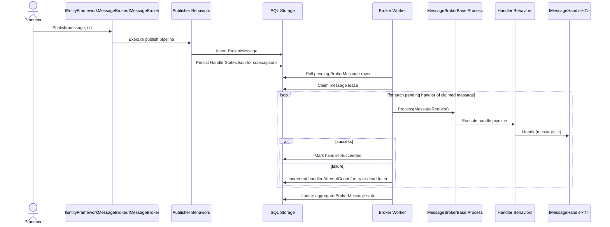
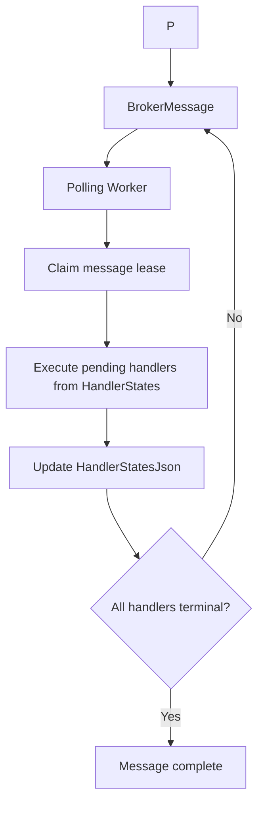

# Design Document: EntityFramework Message Broker Feature (Application.Messaging)

> This design document outlines the architecture and behavior of the new Entity Framework Message Broker transport for the existing messaging feature. It defines the core concepts, goals, non-goals, high-level architecture, core design principles, delivery model, persistence model, runtime behavior, multi-node coordination, public API and configuration, testing strategies, and typical use cases for the Entity Framework broker.

[TOC]

## 1. Introduction

The messaging feature already provides a stable abstraction through `IMessageBroker`, `IMessage`, `IMessageHandler<T>`, publisher behaviors, handler behaviors, and multiple transport implementations. Today, durable delivery is typically achieved by combining a broker with the Entity Framework backed outbox. That approach is useful, but it is not the same as having a durable broker transport.

The current Entity Framework outbox stores a message for later publication and tracks whether that message has been processed by the outbox worker. This is sufficient for reliable publication, especially when publication must be coupled to an existing business transaction. It is not sufficient for full broker behavior because it does not model message leasing for multiple processing nodes, handler-specific retry state, or broker-owned dead-letter lifecycle.

This design introduces an `EntityFrameworkMessageBroker` as a SQL backed `IMessageBroker` transport alternative beside `InProcessMessageBroker`, `RabbitMQMessageBroker`, and `ServiceBusMessageBroker`. Its role is to persist broker messages and serialized handler execution state in relational storage and to process those messages through a hosted worker. The design extends the messaging feature without replacing the existing outbox implementation.

The broker provider itself is intentionally standalone. It should depend only on its own Entity Framework capability interface and its own broker table. An application `DbContext` may implement additional capability interfaces such as document store or outbox contracts, but the Entity Framework broker must not require inbox or outbox extensions in order to work.

In short:

- the existing outbox remains the preferred solution when atomic persistence with business state matters
- the new Entity Framework broker provides durable transport, message leasing, and handler execution lifecycle inside SQL
- both approaches complement each other and solve different problems

---

## 2. Goals

The `EntityFrameworkMessageBroker` is intended to satisfy the following goals.

### 2.1 Durable SQL backed transport

Publishing through the broker shall persist messages durably in SQL before they are considered accepted by the transport.

### 2.2 Durable pub/sub delivery

The broker shall implement publish/subscribe semantics where each active subscription results in its own durable handler execution state inside the stored message. A successfully processed handler for one subscription shall not imply successful processing for any other handler.

### 2.3 Multi-node-safe processing

The broker shall support multiple application instances polling and processing the same storage without duplicate concurrent handling of the same broker message.

### 2.4 Reuse of existing messaging abstractions

The design shall preserve the current `IMessageBroker` contract and reuse the existing publisher behavior and handler behavior pipelines.

### 2.5 Explicit processing lifecycle

The broker shall support message leasing, handler-level retry, expiration, failure tracking, and dead-letter semantics as first-class concerns of the transport.

### 2.6 Low-friction adoption

Existing producers, message types, handlers, and behavior registrations should continue to work when the transport is switched to the new broker.

---

## 3. Non-goals

The Entity Framework broker intentionally does not try to solve every transport concern.

### 3.1 No replacement for the current outbox

This design does not replace the current outbox pattern, its tables, or its worker. The outbox remains valid and supported.

### 3.2 No atomic publish with arbitrary business changes

The broker itself is not responsible for guaranteeing atomic commit of business entity changes and broker messages in the same transaction. That remains the responsibility of transactional outbox patterns.

### 3.3 No work queue model

This design targets durable pub/sub. Competing-consumer queue semantics are out of scope.

### 3.4 No replay/backfill for future subscriptions

If a new handler subscribes after a message was published, the broker will not automatically generate historical handler execution records for that handler.

### 3.5 No strict distributed ordering guarantees

The broker may preserve best-effort ordering by persisted creation time, but it does not guarantee total ordering across all handlers, all instances, or all message types.

---

## 4. High-level architecture

The `EntityFrameworkMessageBroker` fits into the existing messaging feature as another transport implementation. Producers continue to publish through `IMessageBroker`, behaviors continue to wrap publication and handling, and the transport is responsible for durable storage and dispatch.

### 4.1 Architectural position

The new broker becomes a peer transport beside the existing brokers:

- `InProcessMessageBroker` for simple in-memory dispatch
- `RabbitMQMessageBroker` for broker-backed asynchronous messaging
- `ServiceBusMessageBroker` for Azure Service Bus backed messaging
- `EntityFrameworkMessageBroker` for SQL backed durable messaging

### 4.2 Runtime flow

At runtime, the flow is:

1. a producer calls `IMessageBroker.Publish`
2. publisher behaviors run
3. the Entity Framework broker stores one durable broker message row
4. the broker stores one serialized handler state entry per active subscription
5. a hosted worker polls pending broker messages
6. the worker claims a broker message with a lease
7. the worker deserializes the stored message
8. the worker executes pending handlers for that message on the same node
9. handler behaviors run
10. the worker updates serialized handler execution state and aggregate message state

### 4.3 Sequence diagram



### 4.4 Storage and worker flow



---

## 5. Core design principles

The broker design follows a small set of explicit principles.

### 5.1 Transport durability is separate from transactional outbox durability

The broker is a transport. It accepts messages and ensures durable message and handler processing lifecycle inside SQL. It does not replace the transactional outbox concern of persisting domain state changes and messages together.

### 5.2 Preserve `IMessageBroker`

Existing message publishers and handlers should not need a new programming model. The transport is swapped at composition time.

### 5.3 Message ownership and handler state are separate concerns

Durable multi-node processing requires the system to lease a broker message to a single node at a time. Durable pub/sub retry behavior requires the system to track each subscribed handler independently. A message is not truly complete until all subscribed handlers reach a terminal state, but ownership of the work item remains at message level.

### 5.4 At-least-once delivery is preferred

The broker should optimize for reliability rather than exactly-once delivery. Handlers must remain idempotent.

### 5.5 Broker lifecycle must be observable

Pending, processing, failed, expired, and dead-lettered messages and handler states must be visible in storage and through logs and metrics.

---

## 6. Delivery model

The Entity Framework broker uses a durable pub/sub model with message-level leasing and handler-level retry tracking.

### 6.1 Message and handler relationship

Each call to `Publish` produces:

- one `BrokerMessage` row that represents the stored logical message payload
- one serialized handler state entry for each active subscription at publish time

This relationship allows the broker to model one logical message while still tracking execution state separately for each handler while still persisting everything in a single table.

### 6.2 Subscription snapshot semantics

Subscriptions are evaluated at publish time. The broker creates handler state entries from the subscriptions that are active when the message is accepted by the transport. New subscriptions added later do not receive historical handler state entries.

### 6.3 Lease semantics

Only one node may own a given `BrokerMessage` at a time. Ownership is represented by a time-bounded lease on the message row, not inside the individual handler states.

When a node holds the lease for a message:

- it is the only node allowed to execute pending handlers for that message
- it may execute all pending handlers for that message on that node
- other nodes must skip that message until the lease expires or is released

### 6.4 Retry semantics

Retries should, when possible, happen at handler level rather than at whole-message level.

That means:

- if handler A succeeds and handler B fails, handler A remains complete
- only handler B is retried on a later attempt
- the message stays incomplete until all handlers are terminal

### 6.5 Completion semantics

Handler completion is authoritative. A message may be considered operationally complete only when all of its handler states have reached a terminal state such as:

- `Succeeded`
- `DeadLettered`
- `Expired`

One failed or pending handler does not invalidate the successful completion of another handler for the same message, but it does mean the logical message is not fully complete yet.

### 6.6 Archiving semantics

Archiving is separate from processing completion. A message may be archived only after it has reached a terminal aggregate state and is no longer needed in the active operational working set.

The archive flag supports two goals:

- keep active polling and operational queries fast even with a large retained history
- preserve completed message history for UI, diagnostics, audits, and retention workflows

Archived messages remain queryable through the application service and REST API, but they are excluded from normal worker polling and from active operational lists by default.

---

## 7. Persistence model

The broker introduces its own storage model rather than reusing the existing outbox entities.

### 7.1 Context contract

The broker should define a dedicated Entity Framework context contract, for example:

```csharp
public interface IMessagingContext
{
    DbSet<BrokerMessage> BrokerMessages { get; set; }
}
```

This keeps the storage model focused on broker transport concerns while allowing host applications to expose the required sets from an existing `DbContext`.

The intended integration pattern is the same one already used elsewhere in `Infrastructure.EntityFramework`: a project specific `DbContext` opts into support by implementing a small feature-specific interface and exposing the required `DbSet` properties. The broker provider, the `EntityFrameworkMessageBrokerWorker`, and the registration extensions should constrain `TContext` with:

```csharp
where TContext : DbContext, IMessagingContext
```

No inbox or outbox capability interface is required for this broker. If an application wants to use multiple Entity Framework backed features in the same `DbContext`, it can do so by implementing multiple capability interfaces side by side.

For example:

```csharp
public class AppDbContext : DbContext,
    IMessagingContext,
    IOutboxMessageContext,
    IDocumentStoreContext
{
    public DbSet<BrokerMessage> BrokerMessages { get; set; }

    public DbSet<OutboxMessage> OutboxMessages { get; set; }

    public DbSet<StorageDocument> StorageDocuments { get; set; }
}
```

This is a hosting choice of the application, not a requirement of the broker itself.

### 7.2 `BrokerMessage`

The `BrokerMessage` entity represents the durable stored payload. The initial model should contain at least:

- `Id`
- `MessageId`
- `Type`
- `Content`
- `ContentHash`
- `CreatedDate`
- `ExpiresOn`
- `Status`
- `IsArchived`
- `ArchivedDate`
- `LockedBy`
- `LockedUntil`
- `ProcessingStartedDate`
- `ProcessedDate`
- `LastError`
- `PropertiesJson`
- `HandlerStatesJson`

Recommended semantics:

- `MessageId` matches the logical message identifier from `IMessage`
- `Type` stores the serialized CLR type name needed for deserialization
- `Content` stores serialized message payload
- `ContentHash` supports diagnostics and integrity checks
- `CreatedDate` provides ordering and auditing
- `ExpiresOn` allows the worker to skip stale messages
- `Status` represents aggregate broker state for the message work item and should be implemented as a `BrokerMessageStatus` enum
- `IsArchived` marks whether the message is part of the active working set or historical retained data
- `ArchivedDate` captures when the message moved into archive state
- `LockedBy` identifies the node currently leasing the message
- `LockedUntil` defines lease expiry and recovery
- `ProcessingStartedDate` captures lease start for diagnostics
- `ProcessedDate` captures aggregate terminal completion
- `LastError` preserves the latest message-level failure summary
- `PropertiesJson` preserves correlation and other message properties
- `HandlerStatesJson` persists handler-specific retry and completion state

The entity should also expose a strongly typed handler state collection next to the serialized persistence column. The typed property is intended for in-memory access by the broker implementation, while the JSON column is intended for database persistence.

The following shape is the recommended implementation target for the entity:

```csharp
[Table("__Messaging_Messages")]
[Index(nameof(MessageId), IsUnique = true)]
[Index(nameof(IsArchived), nameof(Status), nameof(LockedUntil), nameof(CreatedDate))]
[Index(nameof(IsArchived), nameof(Type), nameof(CreatedDate))]
[Index(nameof(IsArchived), nameof(ProcessedDate))]
[Index(nameof(IsArchived), nameof(ArchivedDate))]
public class BrokerMessage
{
    [Key]
    public Guid Id { get; set; }

    [Required]
    [MaxLength(256)]
    public string MessageId { get; set; }

    [Required]
    [MaxLength(2048)]
    public string Type { get; set; }

    [Required]
    public string Content { get; set; }

    [MaxLength(64)] // MD5=32, SHA256=64
    public string ContentHash { get; set; }

    [Required]
    public DateTimeOffset CreatedDate { get; set; } = DateTimeOffset.UtcNow;

    public DateTimeOffset? ExpiresOn { get; set; }

    [Required]
    public BrokerMessageStatus Status { get; set; } = BrokerMessageStatus.Pending;

    [Required]
    public bool IsArchived { get; set; }

    public DateTimeOffset? ArchivedDate { get; set; }

    [MaxLength(256)]
    public string LockedBy { get; set; }

    public DateTimeOffset? LockedUntil { get; set; }

    public DateTimeOffset? ProcessingStartedDate { get; set; }

    public DateTimeOffset? ProcessedDate { get; set; }

    [MaxLength(4000)]
    public string LastError { get; set; }

    [NotMapped]
    public IDictionary<string, object> Properties { get; set; } = new Dictionary<string, object>();

    [Column("Properties")]
    public string PropertiesJson
    {
        get => this.Properties.IsNullOrEmpty()
            ? null
            : JsonSerializer.Serialize(this.Properties, DefaultJsonSerializerOptions.Create());
        set => this.Properties = value.IsNullOrEmpty()
            ? []
            : JsonSerializer.Deserialize<Dictionary<string, object>>(value, DefaultJsonSerializerOptions.Create());
    }

    [NotMapped]
    public IList<BrokerMessageHandlerState> HandlerStates { get; set; } = [];

    [Column("HandlerStates")]
    public string HandlerStatesJson
    {
        get => this.HandlerStates.IsNullOrEmpty()
            ? null
            : JsonSerializer.Serialize(this.HandlerStates, DefaultJsonSerializerOptions.Create());
        set => this.HandlerStates = value.IsNullOrEmpty()
            ? []
            : JsonSerializer.Deserialize<List<BrokerMessageHandlerState>>(value, DefaultJsonSerializerOptions.Create());
    }
}
```

This shape intentionally mirrors the existing attribute-driven EF style already used by entities such as `OutboxMessage`.

One important implementation note: EF Core attributes cover table name, indexes, key, required fields, lengths, column names, and non-mapped properties, but they do not cleanly cover every enum storage choice. If the implementation wants `BrokerMessageStatus` to be stored as strings rather than integers, that part should be configured in model building, for example with `HasConversion<string>()`.

### 7.3 `BrokerMessageStatus`

`BrokerMessage.Status` should be implemented as an enum rather than a free-form string so the transport, service layer, and REST API all share one strongly typed lifecycle model.

Recommended enum values:

- `Pending`
- `Processing`
- `Succeeded`
- `Failed`
- `DeadLettered`
- `Expired`

`IsArchived` remains a separate boolean flag rather than another status value so active-versus-archived storage behavior stays orthogonal to business processing state.

### 7.4 `BrokerMessageHandlerState`

`BrokerMessageHandlerState` is a strongly typed CLR model stored inside `BrokerMessage.HandlerStatesJson`. It represents one handler execution lifecycle for one subscribed subscription. The initial model should contain at least:

- `SubscriptionKey`
- `HandlerType`
- `Status`
- `AttemptCount`
- `LastError`
- `ProcessedDate`

Recommended semantics:

- `SubscriptionKey` uniquely identifies the message type plus handler type delivery target
- `HandlerType` stores the fully qualified handler identity for diagnostics and filtering
- `Status` tracks lifecycle state and should be implemented as a `BrokerMessageHandlerStatus` enum
- `AttemptCount` tracks retry progression
- `LastError` preserves the latest failure message
- `ProcessedDate` captures successful or terminal completion time

### 7.5 `BrokerMessageHandlerStatus`

`BrokerMessageHandlerState.Status` should also be implemented as an enum.

Recommended enum values:

- `Pending`
- `Processing`
- `Succeeded`
- `Failed`
- `DeadLettered`
- `Expired`

`Failed` is a transient state for retryable work, while `DeadLettered` and `Expired` are terminal states.

### 7.6 Recommended indexes

The storage model should include indexes that support:

- lookup by `MessageId`
- active operational queries filtered by `IsArchived`
- ordered worker polling of active messages by `IsArchived`, `Status`, `LockedUntil`, and `CreatedDate`
- lease recovery by `IsArchived`, `Status`, and `LockedUntil`
- history and retention queries by `IsArchived`, `ProcessedDate`, and `ArchivedDate`
- message list filtering by `IsArchived`, `Type`, and `CreatedDate`
- optional provider-specific querying of `HandlerStatesJson` when supported by the database engine

Practical examples:

- unique index on `BrokerMessages.MessageId`
- compound index on `BrokerMessages.IsArchived`, `BrokerMessages.Status`, `BrokerMessages.LockedUntil`, `BrokerMessages.CreatedDate`
- compound index on `BrokerMessages.IsArchived`, `BrokerMessages.Type`, `BrokerMessages.CreatedDate`
- compound index on `BrokerMessages.IsArchived`, `BrokerMessages.ProcessedDate`
- compound index on `BrokerMessages.IsArchived`, `BrokerMessages.ArchivedDate`

For large systems, active-worker and active-UI queries should always include `IsArchived = false` so the hot working set stays small and uses the active indexes efficiently. Provider-specific filtered indexes for `IsArchived = false` are recommended when the target database supports them, but the design must still work without provider-specific filtered-index features.

The design should not depend on JSON-path indexes or database-specific JSON features. Those can be added later as provider-specific optimizations if operational needs justify them.

### 7.7 Why existing `OutboxMessage` is not reused

The current outbox entities model reliable publication. They persist a single stored message and track whether the outbox worker has forwarded that message. They do not model message lease ownership, handler-specific retry state, terminal handler states, or broker-owned retry lifecycle. Reusing them would blur two separate responsibilities and force the outbox model to carry broker-specific semantics it was not designed for.

For that reason, the broker should introduce new storage types while leaving existing `OutboxMessage` types unchanged.

---

## 8. Runtime behavior

### 8.1 Publish behavior

When `Publish(message, ct)` is called, the Entity Framework broker should:

1. validate the message using the existing publish flow
2. execute publisher behaviors
3. resolve the active subscriptions for the message type
4. persist one `BrokerMessage` row
5. persist handler state entries inside `HandlerStatesJson`
6. complete successfully once durable storage is committed

If no subscriptions exist, the broker may still persist the `BrokerMessage` for auditability, but it may also choose to short-circuit handler-state creation while recording that there were no targets. The implementation should make that behavior explicit in code and documentation.

### 8.2 Worker processing behavior

The broker requires a hosted background worker that periodically processes stored messages. The worker should:

1. poll pending or reclaimable messages in batches
2. skip expired messages and mark message and pending handlers terminal
3. claim messages by assigning `LockedBy` and `LockedUntil`
4. load pending handler states for the claimed message
5. deserialize the message to the correct type
6. invoke the handler pipeline for each pending handler of the claimed message
7. update the handler state according to outcome
8. update aggregate message state according to remaining handler work
9. archive terminal messages whose retention age has elapsed according to configured archive options

### 8.3 Success semantics

If handler processing completes successfully:

- the handler state is marked `Succeeded`
- `ProcessedDate` is set
- `LastError` is cleared
- the message lease remains until the node has finished processing the claimed message

### 8.4 Failure semantics

If handler processing fails:

- `AttemptCount` is incremented
- `LastError` is updated
- the handler state remains eligible for retry unless max attempts are exceeded
- the message may be released for later reclaim if there is remaining retryable work

### 8.5 Dead-letter semantics

If `AttemptCount` exceeds configured maximum retries:

- the handler state is marked `DeadLettered`
- `ProcessedDate` is set to the terminal transition time
- no further automatic retries occur

### 8.6 Expiration semantics

If the message TTL has elapsed before successful processing:

- pending handler states are marked `Expired`
- handlers are not invoked
- the message becomes terminal

### 8.7 Aggregate message completion

After processing the pending handlers of a claimed message, the broker should derive the aggregate message state from the remaining handler states.

Recommended behavior:

- `Succeeded` when all handlers have succeeded
- `DeadLettered` when all remaining incomplete handlers are terminal and at least one is dead-lettered
- `Expired` when the message expires before completion
- `Pending` when retryable handler work remains and the message lease is released

### 8.8 Archive behavior

The worker may automatically archive terminal messages based on age and configured options.

Recommended behavior:

- only terminal messages are eligible for automatic archiving
- archiving sets `IsArchived = true`
- archiving sets `ArchivedDate`
- archiving must clear any lease fields
- archiving must not destroy handler state history needed for UI or diagnostics

Automatic archiving should be part of normal worker maintenance so active queries and polling remain focused on the live operational set rather than the full retained history.

---

## 9. Multi-node coordination

The design must be safe for multiple application instances connected to the same database.

### 9.1 Lease ownership

Each worker claims work by setting message lease fields:

- `LockedBy` to an instance identifier
- `LockedUntil` to the lease expiration timestamp

Only messages that are not archived and not currently leased, or whose lease has expired, may be claimed.

### 9.2 Reclaim behavior

If a node crashes or loses connectivity after claiming work, another node may reclaim the message when `LockedUntil` has passed.

### 9.3 Duplicate processing protection

The same message must never be processed concurrently by two active workers. The claim operation should therefore be implemented as an atomic storage update, not as a separate read followed by a non-protected write.

### 9.4 Lease renewal

Lease renewal should be a supported capability of the worker.

Purpose:

- allow short default lease durations for fast recovery when a node crashes
- prevent another node from reclaiming a message that is still being processed legitimately

Recommended behavior:

- while a worker is actively processing a claimed message, it periodically extends `LockedUntil`
- renewal should happen before the current lease expires, for example every `LeaseRenewalInterval`
- renewal should only succeed when `LockedBy` still matches the current worker instance
- if lease renewal fails, the worker should log the failure and stop assuming exclusive ownership of the message

This keeps the lease model robust for both:

- short-running handlers
- legitimately long-running handlers

---

## 10. Public API and configuration

The feature should integrate into messaging through the same builder style as existing brokers for the broker itself, while operational endpoints remain separately registered presentation components.

### 10.1 Registration

The broker should introduce:

```csharp
builder.Services.AddMessaging(builder.Configuration)
    .WithEntityFrameworkBroker<AppDbContext>(o => o
        .ProcessingInterval("00:00:10")
        .LeaseDuration("00:00:30")
        .MaxDeliveryAttempts(5)
        .MessageExpiration("01:00:00"));
```

The exact builder and option names can follow existing messaging conventions, but the composition style should remain consistent with the current transport registration API.

### 10.2 Broker options

The broker should add `EntityFrameworkMessageBrokerOptions` with at least:

- `StartupDelay`
- `ProcessingInterval`
- `ProcessingCount`
- `MaxDeliveryAttempts`
- `LeaseDuration`
- `LeaseRenewalInterval`
- `MessageExpiration`
- `AutoArchiveAfter`
- `AutoArchiveStatuses`
- optional `ProcessDelay`

These options control when processing starts, how often the worker polls, how many messages are processed per cycle, how long a message lease lasts, when stale work expires, and when terminal work automatically moves to archived storage state.

### 10.3 Configuration

Configuration should follow the same pattern as other transports and use a dedicated section:

- `Messaging:EntityFramework`

### 10.4 Messaging contract preservation

`IMessageBroker` should remain unchanged. Existing message contracts, handlers, and behavior registrations should work without modification when this broker is used.

### 10.5 Provider independence

The Entity Framework broker provider should be usable with only:

- a `DbContext` implementing `IMessagingContext`
- the broker entities and configuration
- the broker worker and options

It should not require the messaging outbox, a separate inbox abstraction, or any outbox worker registration in order to function. Those remain separate features that may coexist in the same application but are not prerequisites for the broker transport.

### 10.6 Application query and management service

Like the job scheduling feature exposes `IJobService` for querying and operating on scheduled jobs, the Entity Framework broker should expose an application-facing service for querying and managing persisted broker messages. This service is needed so higher layers can build dashboards, troubleshooting screens, and operational tooling without depending directly on the storage model.

The recommended contract is:

```csharp
public interface IMessageBrokerService
{
    Task<IEnumerable<BrokerMessageInfo>> GetMessagesAsync(
        BrokerMessageStatus? status = null,
        string type = null,
        string messageId = null,
        string lockedBy = null,
        bool? isArchived = false,
        DateTimeOffset? createdAfter = null,
        DateTimeOffset? createdBefore = null,
        bool includeHandlers = false,
        int? take = null,
        CancellationToken cancellationToken = default);

    Task<BrokerMessageInfo> GetMessageAsync(
        Guid id,
        bool includeHandlers = true,
        CancellationToken cancellationToken = default);

    Task<BrokerMessageContentInfo> GetMessageContentAsync(
        Guid id,
        CancellationToken cancellationToken = default);

    Task<BrokerMessageStats> GetMessageStatsAsync(
        DateTimeOffset? startDate = null,
        DateTimeOffset? endDate = null,
        bool? isArchived = false,
        CancellationToken cancellationToken = default);

    Task RetryMessageAsync(Guid id, CancellationToken cancellationToken = default);

    Task RetryMessageHandlerAsync(Guid id, string handlerType, CancellationToken cancellationToken = default);

    Task ReleaseLeaseAsync(Guid id, CancellationToken cancellationToken = default);

    Task ArchiveMessageAsync(Guid id, CancellationToken cancellationToken = default);

    Task PurgeMessagesAsync(
        DateTimeOffset? olderThan = null,
        IEnumerable<BrokerMessageStatus> statuses = null,
        bool? isArchived = null,
        CancellationToken cancellationToken = default);
}
```

This service should be read and operations focused. It is not a replacement for `IMessageBroker.Publish`; it is the operational surface over persisted broker state.

The implementation should follow the same public-contract documentation quality as `IJobService`: all public interfaces, classes, records, enums, properties, and methods should have XML documentation comments, and client-facing symbols should include usage examples through `<example>` blocks where that materially helps consumers.

### 10.7 Application models for UI and API

The service should return stable DTO-style models rather than leaking the storage entity directly.

Recommended models:

- `BrokerMessageInfo`
  - `Id`
  - `MessageId`
  - `Type`
  - `Status : BrokerMessageStatus`
  - `IsArchived`
  - `ArchivedDate`
  - `CreatedDate`
  - `ExpiresOn`
  - `LockedBy`
  - `LockedUntil`
  - `ProcessedDate`
  - `AttemptCountSummary`
  - `LastError`
  - `Properties`
  - `IEnumerable<BrokerMessageHandlerInfo> Handlers`
- `BrokerMessageHandlerInfo`
  - `SubscriptionKey`
  - `HandlerType`
  - `Status : BrokerMessageHandlerStatus`
  - `AttemptCount`
  - `LastError`
  - `ProcessedDate`
- `BrokerMessageContentInfo`
  - `Id`
  - `MessageId`
  - `Type`
  - `Content`
  - `ContentHash`
  - `CreatedDate`
  - `IsArchived`
- `BrokerMessageStats`
  - `Total`
  - `Pending`
  - `Processing`
  - `Succeeded`
  - `Failed`
  - `DeadLettered`
  - `Expired`
  - `Archived`
  - `Leased`

These models are intentionally close to the persisted state so a UI can render both message-level and handler-level status without understanding storage internals.

### 10.8 REST endpoints

The feature should also expose minimal REST endpoints in the same style as `JobSchedulingEndpoints`, so persisted broker messages can be surfaced in admin UIs and operational dashboards.

Recommended endpoint group:

- path: `/api/_system/messaging/messages`
- tag: `_System.Messaging`

Recommended endpoint class and options:

- `MessagingEndpoints : EndpointsBase`
- `MessagingEndpointsOptions : EndpointsOptionsBase`

The endpoint implementation should follow the same pattern as `JobSchedulingEndpoints`:

- derive from `EndpointsBase`
- accept `ILoggerFactory`, `IMessageBrokerService`, and `MessagingEndpointsOptions` through the constructor
- implement `public override void Map(IEndpointRouteBuilder app)`
- return early when `Enabled` is `false`
- create the route group through `this.MapGroup(app, this.options)`
- set tags and metadata on the group and mapped routes
- set `IsRegistered = true` after successful mapping

Recommended routes:

- `GET /api/_system/messaging/messages`
  - list messages with filters such as `status`, `type`, `messageId`, `lockedBy`, `isArchived`, `createdAfter`, `createdBefore`, `includeHandlers`, `take`
- `GET /api/_system/messaging/messages/{id}`
  - get one message including handler state, but without the full serialized payload by default
- `GET /api/_system/messaging/messages/{id}/content`
  - get the stored serialized message payload when operational inspection requires the message body
- `GET /api/_system/messaging/messages/stats`
  - get aggregate message statistics
- `POST /api/_system/messaging/messages/{id}/retry`
  - reset a failed/dead-lettered message back to retryable state where appropriate
- `POST /api/_system/messaging/messages/{id}/handlers/retry`
  - retry one handler state using `handlerType` from route or body
- `POST /api/_system/messaging/messages/{id}/lease/release`
  - release a stale lease for operational recovery
- `POST /api/_system/messaging/messages/{id}/archive`
  - archive one terminal message explicitly
- `DELETE /api/_system/messaging/messages`
  - purge old messages by date and/or status

The REST layer should delegate to `IMessageBrokerService` rather than reading `DbContext` directly.

### 10.8.1 Content access

The stored message payload should be available only through the dedicated detail-content route:

- `GET /api/_system/messaging/messages/{id}/content`

This keeps list and summary responses compact and avoids returning potentially large or sensitive payloads unless explicitly requested.

The application service should therefore expose a dedicated content retrieval method:

```csharp
Task<BrokerMessageContentInfo> GetMessageContentAsync(Guid id, CancellationToken cancellationToken = default);
```

This keeps the content endpoint explicit while still returning enough metadata for UI and diagnostics scenarios.

### 10.9 Endpoint registration

As with the job scheduling feature, endpoint registration should be optional and registered separately from the messaging broker builder. It should follow the same style already used in `Presentation.Web.JobScheduling`.

Recommended direction:

```csharp
builder.Services.AddMessaging(builder.Configuration)
    .WithEntityFrameworkBroker<AppDbContext>(...);

builder.Services.AddSingleton(new MessagingEndpointsOptions
{
    GroupPath = "/api/_system/messaging/messages",
    GroupTag = "_System.Messaging"
});

builder.Services.AddEndpoints<MessagingEndpoints>(builder.Environment.IsDevelopment());
```

The important design point is that the application service and endpoint layer remain opt-in, not hardwired into the core broker.

An implementation sketch should look conceptually like this:

```csharp
public class MessagingEndpoints(
    ILoggerFactory loggerFactory,
    IMessageBrokerService messageBrokerService,
    MessagingEndpointsOptions options = null) : EndpointsBase
{
    public override void Map(IEndpointRouteBuilder app)
    {
        if (!this.Enabled)
        {
            return;
        }

        var group = this.MapGroup(app, this.options)
            .WithTags("_System.Messaging");

        // map routes here

        this.IsRegistered = true;
    }
}
```

### 10.10 XML documentation and examples

All public code symbols introduced by this feature should include XML documentation comments:

- public classes
- public records
- public interfaces
- public enums
- public properties
- public methods

For public or client-facing symbols, the XML comments should also include usage examples where that improves discoverability. This applies especially to:

- `IMessageBrokerService`
- DTOs returned by `IMessageBrokerService`
- `MessagingEndpointsOptions`
- endpoint request and response models
- public option types such as `EntityFrameworkMessageBrokerOptions`

Recommended style:

```csharp
/// <summary>
/// Retrieves persisted broker messages for operational inspection.
/// </summary>
/// <param name="status">Optional aggregate message status filter.</param>
/// <param name="isArchived">Optional archive-state filter. Defaults to false for active operational views.</param>
/// <param name="cancellationToken">Token to cancel the operation.</param>
/// <returns>A collection of message summaries suitable for UI or API responses.</returns>
/// <example>
/// <code>
/// var messages = await messageBrokerService.GetMessagesAsync(
///     status: BrokerMessageStatus.Pending,
///     isArchived: false,
///     take: 100,
///     cancellationToken);
/// </code>
/// </example>
Task<IEnumerable<BrokerMessageInfo>> GetMessagesAsync(...);
```

---

## 11. Interaction with existing outbox

The new broker and the current outbox solve related but different concerns.

### 11.1 Current outbox

The outbox is primarily about transactional durability. It stores work in the same persistence boundary as business data and later republishes it through another transport. Its key question is:

> how do we avoid losing a message when business state and publication must stay consistent?

### 11.2 Entity Framework broker

The Entity Framework broker is primarily about transport durability. Its key question is:

> how do we model broker owned message leasing, handler-specific retries, expiration, and completion inside SQL?

### 11.3 Recommended usage

Use the current outbox when:

- business state changes and publication must commit together
- the broker itself is not part of the aggregate transaction
- a separate durable publication step is required

Use the Entity Framework broker when:

- SQL backed durable brokering is the desired transport
- per-handler retry tracking is required
- retry and dead-letter lifecycle should be owned by the broker
- external broker infrastructure is unnecessary or undesirable
- the application wants to extend its existing `DbContext` with broker tables through a dedicated capability interface only

The two approaches can also be combined. An application may persist work through an outbox and later publish that work into the Entity Framework broker, but that remains a composition choice rather than a requirement of this design.

---

## 12. Observability and operations

The broker should be explicit and observable in both logs and metrics.

### 12.1 Logs and metrics

The broker should emit enough information to answer:

- how many messages were published
- how many messages are pending
- how many messages are currently leased
- how many messages are archived
- how many handler states are pending
- how many retries have occurred
- how many handlers are dead-lettered
- how many handlers expired
- how long processing takes

### 12.2 Correlation propagation

Correlation and flow identifiers should continue to travel through existing message properties. The broker should store and restore those properties so scopes, traces, and logs remain meaningful during worker processing.

### 12.3 Operational needs

Operations should be able to:

- inspect pending messages and handler states
- inspect archived messages without polluting active operational views
- inspect dead-lettered handler states
- purge old succeeded or expired messages and handler states
- identify noisy handlers or failure hotspots
- correlate handler executions back to logical message identifiers
- archive terminal messages explicitly when retention policies require it

The initial design should leave room for retention and purge policies even if the first implementation keeps them simple.

---

## 13. Testing strategy

The broker should be covered by both unit and integration tests.

### 13.1 Unit tests

Unit tests should verify:

- publishing creates one `BrokerMessage` with one handler state entry per subscription
- success marks only the matching handler state complete
- failure increments `AttemptCount`
- max attempts transition to `DeadLettered`
- expiration skips handler execution
- message lease logic prevents duplicate claims
- publisher and handler behaviors still execute
- `IMessageBrokerService` correctly maps entity state to `BrokerMessageInfo` and `BrokerMessageStats`
- service-level retry and lease-release operations mutate only the intended message or handler state

### 13.2 Integration tests

Integration tests should verify:

- end-to-end publish and process using an Entity Framework backed context
- multiple handlers for one message create and process distinct handler states
- restart resilience with pending messages and handler states still in storage
- multi-instance-safe message claiming behavior
- automatic archiving moves only eligible terminal messages into archived state
- `MessagingEndpoints` expose message lists, detail views, stats, retry operations, archive operations, lease release, and purge over REST through `IMessageBrokerService`

---

## 14. Implementation shape

The feature is ready to be implemented as a focused set of application, infrastructure, and presentation types.

### 14.1 Application layer

Planned public application symbols:

- `IMessageBrokerService`
- `BrokerMessageInfo`
- `BrokerMessageHandlerInfo`
- `BrokerMessageStats`
- request and filter models used by the service and endpoints

### 14.2 Infrastructure layer

Planned infrastructure symbols:

- `IMessagingContext`
- `BrokerMessage`
- `BrokerMessageStatus`
- `BrokerMessageHandlerState`
- `BrokerMessageHandlerStatus`
- `EntityFrameworkMessageBroker<TContext>`
- `EntityFrameworkMessageBrokerWorker<TContext>`
- `EntityFrameworkMessageBrokerOptions`
- storage configuration for `BrokerMessage`

### 14.3 Presentation layer

Planned presentation symbols:

- `MessagingEndpoints`
- `MessagingEndpointsOptions`
- request models for retry, archive, purge, and filtering operations

`MessagingEndpoints` should be implemented as an `EndpointsBase` endpoint module in `Presentation.Web`, consistent with the existing endpoint registration and grouping model used by `JobSchedulingEndpoints`.

### 14.4 Deferred capabilities

The following remain intentionally outside this design:

- historical backfill for new subscriptions
- administrative replay APIs beyond targeted retry/archive/purge operations
- work queue mode
- atomic publish with arbitrary business transactions
- advanced lease renewal strategies if fixed leases are operationally sufficient

---

## 15. Summary

The messaging feature should be extended with an `EntityFrameworkMessageBroker` that acts as a durable SQL backed transport behind the existing `IMessageBroker` abstraction.

The core decision is:

- add a new broker transport rather than extending the current outbox tables
- model message-level leasing with handler-level retry tracking
- use enum-based aggregate and handler lifecycle states with archive-aware queries and indexes
- support at-least-once processing with retries, expiration, dead-lettering, auto-archiving, and lease based multi-node safety
- keep the current outbox as complementary infrastructure for transactional publication scenarios

The existing `OutboxMessage` model is not reused because it represents durable publication, not broker message leasing and handler processing lifecycle. A dedicated broker storage model with serialized strongly typed handler states is therefore the clearest and safest way to extend the messaging feature without conflating two different responsibilities.
