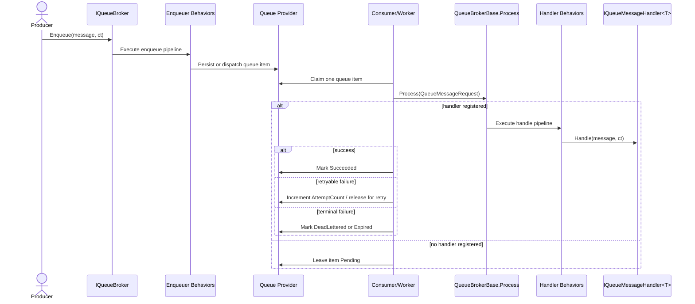

# Design Document: Queueing Feature (Application.Queueing)

> This design document outlines the architecture and behavior of the new Queueing feature within the application. It defines the core concepts, goals, non-goals, conceptual model, public abstractions, registration and composition patterns, provider model, delivery semantics, and specific design considerations for the Entity Framework provider.

[TOC]

## 1. Introduction

Queueing solves a different problem.

A queue represents a durable work stream where each queued message is handled by exactly one logical consumer. The same work item must not be processed by multiple handlers, while multiple application instances may still compete for work and distribute processing between themselves.

This design introduces a dedicated queueing feature:

- `Application.Queueing` is the single-consumer work abstraction
- it is conceptually parallel to messaging, but not technically coupled to `Application.Messaging`
- it must not depend on `Application.Messaging`, `MessageBrokerBase`, `IMessage`, `IMessageHandler<T>`, or any messaging provider implementation

The queueing feature should feel familiar to existing consumers of messaging from a developer-experience perspective. It should follow the same overall composition style, registration style, provider model, behavior pipeline model, and operational documentation quality, while remaining a separate feature with its own contracts and implementations.

The feature is designed around five providers:

- `InProcessQueueBroker`
- `EntityFrameworkQueueBroker`
- `ServiceBusQueueBroker`
- `AzureStorageQueueBroker`
- `RabbitMQQueueBroker`

The Entity Framework provider is the durable SQL-backed queue implementation. The Azure providers cover cloud-native queue transport on Azure. The RabbitMQ provider remains the durable broker-backed alternative. The in-process provider gives a low-friction option for simple local work distribution and tests.

---

## 2. Goals

The queueing feature is intended to satisfy the following goals.

### 2.1 Provide a queue-specific abstraction

The feature shall provide a first-class queue abstraction rather than overloading pub/sub messaging semantics for single-consumer work.

### 2.2 At most one logical handler per queued message type

Each queue message type may have zero or one registered handler in the application at runtime. Competing application instances may process different queue items in parallel, but a single queued item shall be handled by only one handler execution once a compatible handler is available.

### 2.3 Reuse familiar framework concepts

The feature shall mirror successful architectural ideas already used elsewhere in the platform:

- builder-based registration
- type-based subscription/registration
- provider abstraction
- behavior pipelines
- hosted background processing
- operational query surface

### 2.4 Durable provider options

The feature shall support durable queue providers with retry, expiration, dead-lettering, archiving, and multi-node-safe processing.

### 2.5 Low-friction adoption

Existing application developers should be able to adopt queueing with the same general development experience already established by messaging.

### 2.6 Minimal infrastructure pre-provisioning

Broker-backed queue providers should create the transport artifacts they need at runtime whenever the target platform supports it, so application teams do not depend on extensive pre-created queue infrastructure.

---

## 3. Non-goals

The queueing feature intentionally does not try to solve every possible work-processing scenario.

### 3.1 No pub/sub semantics

Queueing is not a second pub/sub system. If multiple handlers must observe the same message independently, messaging remains the correct feature.

### 3.2 No multiple handlers per queue message type

The queue abstraction intentionally does not allow multiple registered handlers for the same queued message type within one application composition.

### 3.3 No atomic business transaction guarantees by itself

Durable queue providers do not themselves guarantee atomic persistence of business state changes and queue publication in one transaction. If that is required, an outbox-style pattern remains the appropriate composition mechanism.

### 3.4 No strict global ordering guarantees

Providers may preserve best-effort ordering by queue and creation time, but the feature does not promise total global ordering across all queues, nodes, and message types.

### 3.5 No workflow orchestration engine

Queueing represents unit-of-work dispatch and processing. It is not intended to replace long-running workflows, sagas, or orchestration engines.

### 3.6 No technical dependency on messaging

The queueing feature must not be implemented as a thin wrapper over messaging and must not depend on messaging contracts, base classes, subscription maps, workers, or broker providers.

---

## 4. Conceptual model

The feature centers on a few simple rules.

### 4.1 Queue messages represent work

A queue message represents a unit of work to be processed once by one logical consumer.

### 4.2 One message type, at most one handler

Each queue message type maps to zero or one handler type at runtime.

That means:

- registration must reject duplicate handlers for the same queue message type
- a queue item may be enqueued before any handler is registered
- handler lookup happens when processing begins, not when the item is enqueued
- retries happen at message level because there is only one handler for the work item

### 4.3 Competing consumers are still valid

Single-consumer semantics do not mean single-node deployment.

Multiple application instances may consume the same queue and compete for work. The provider must ensure that one queue item is claimed by at most one active consumer at a time.

### 4.4 At-least-once delivery is the durable default

Durable providers should optimize for reliability. Queue handlers must therefore remain idempotent.

### 4.5 Queueing and messaging are complementary

The difference can be summarized as:

- messaging = one message may be handled by many handlers
- queueing = one queue item must be handled by one handler when a compatible handler is available

### 4.6 High-level architecture

At runtime, the queueing flow is:

1. a producer calls `IQueueBroker.Enqueue`
2. enqueuer behaviors run
3. the selected provider stores or dispatches one queue item
4. one consumer instance claims that queue item
5. the queue broker looks up the currently registered handler for the queued message type
6. handler behaviors run
7. the handler processes the queue item
8. the provider marks the queue item completed, retryable, dead-lettered, expired, or archived



### 4.7 Runtime provisioning principle

Broker-backed providers should provision their own runtime artifacts where practical.

That means:

- the application should not require manually pre-created queues, consumers, bindings, or subscriptions for normal operation
- the broker provider should create or verify the queue topology it requires during startup and subscription registration
- the only external prerequisite should be that the target broker service itself is available and reachable

This principle applies especially to:

- `ServiceBusQueueBroker`
- `RabbitMQQueueBroker`

---

## 5. Public abstractions

The queueing feature should introduce queue-specific abstractions that intentionally resemble the messaging model.

### 5.1 Core contracts

Recommended public contracts:

- `IQueueBroker`
- `IQueueMessage`
- `IQueueMessageHandler<TMessage>`
- `IQueueMessageHandlerFactory`
- `QueueMessageRequest`
- `IQueueEnqueuerBehavior`
- `IQueueHandlerBehavior`

### 5.2 `IQueueBroker`

The central abstraction should be a queue broker contract with queue-specific naming and semantics.

Recommended contract:

```csharp
public interface IQueueBroker
{
    Task Subscribe<TMessage, THandler>()
        where TMessage : IQueueMessage
        where THandler : IQueueMessageHandler<TMessage>;

    Task Subscribe(Type messageType, Type handlerType);

    Task Unsubscribe<TMessage, THandler>()
        where TMessage : IQueueMessage
        where THandler : IQueueMessageHandler<TMessage>;

    Task Unsubscribe(Type messageType, Type handlerType);

    Task Unsubscribe();

    Task Enqueue(IQueueMessage message, CancellationToken cancellationToken = default);

    Task EnqueueAndWait(IQueueMessage message, CancellationToken cancellationToken = default);

    Task Process(QueueMessageRequest messageRequest);
}
```

### 5.3 `IQueueMessage`

`IQueueMessage` should provide the same general envelope capabilities already used across the platform so correlation, timestamps, properties, and serializer reuse remain familiar.

Recommended shape:

- `MessageId`
- `Timestamp`
- `Properties`
- `Validate()`

To reduce repeated boilerplate in application code, the feature should also provide a reusable base class such as:

```csharp
public abstract class QueueMessageBase : IQueueMessage
{
    public string MessageId { get; set; } = Guid.NewGuid().ToString("N");

    public DateTimeOffset Timestamp { get; set; } = DateTimeOffset.UtcNow;

    public IDictionary<string, object> Properties { get; set; } = new Dictionary<string, object>();

    public virtual ValidationResult Validate() => new();
}
```

Application queue messages can then inherit from `QueueMessageBase` rather than re-declaring common metadata on every message type.

### 5.4 `IQueueMessageHandler<TMessage>`

Recommended contract:

```csharp
public interface IQueueMessageHandler<TMessage>
    where TMessage : IQueueMessage
{
    Task Handle(TMessage message, CancellationToken cancellationToken);
}
```

### 5.5 `QueueBrokerBase`

The feature should provide a standalone `QueueBrokerBase`.

Responsibilities:

- maintain the single-handler subscription map
- validate enqueued messages
- execute enqueuer behaviors
- execute handler behaviors
- resolve the currently registered handler through the handler factory during processing
- provide overridable provider hooks such as `OnEnqueue`, `OnProcess`, `OnSubscribe`, and `OnUnsubscribe`

`QueueBrokerBase` is conceptually similar to `MessageBrokerBase`, but it must be implemented inside `Application.Queueing` without inheriting from or depending on the messaging feature.

### 5.6 Subscription rules

Unlike messaging, the subscription map must enforce one handler per queue message type.

Recommended behavior:

- first registration for a message type succeeds
- a second distinct handler for the same message type is not registered
- when a second distinct handler is encountered, the system logs a warning that the additional handler competes with the already registered handler for that queue message type
- the first registered handler remains authoritative for that queue message type
- re-registering the same handler type is a no-op or explicit duplicate-registration warning, but the behavior must be deterministic
- enqueueing a queue message type without a registered handler is allowed
- processing should use the handler registration state that exists at processing time
- if no handler is registered when processing is attempted, the queue item should remain pending rather than becoming failed only because of missing runtime registration

---

## 6. Registration and composition

The queueing feature should follow the same builder style as messaging.

### 6.1 Service registration

Recommended entry point:

```csharp
builder.Services.AddQueueing(builder.Configuration)
    .WithSubscription<GenerateInvoiceQueueMessage, GenerateInvoiceQueueHandler>()
    .WithEntityFrameworkBroker<AppDbContext>(o => o
        .ProcessingInterval("00:00:10")
        .LeaseDuration("00:00:30")
        .MaxDeliveryAttempts(5)
        .MessageExpiration("01:00:00"));
```

### 6.2 Builder context

Recommended builder surface:

- `AddQueueing(...)`
- `WithSubscription<TMessage, THandler>()`
- `WithBehavior<TBehavior>(IQueueEnqueuerBehavior)`
- `WithBehavior<TBehavior>(IQueueHandlerBehavior)`
- `WithInProcessBroker(...)`
- `WithEntityFrameworkBroker<TContext>(...)`
- `WithServiceBusBroker(...)`
- `WithAzureStorageBroker(...)`
- `WithRabbitMQBroker(...)`

### 6.3 Hosted startup registration

A hosted startup component should apply registered subscriptions to the configured broker on application startup.

Recommended runtime service:

- `QueueingService`

### 6.4 Configuration

Configuration should follow the same options-binding style used elsewhere in the platform.

Recommended sections:

- `Queueing`
- `Queueing:InProcess`
- `Queueing:EntityFramework`
- `Queueing:ServiceBus`
- `Queueing:AzureStorage`
- `Queueing:RabbitMQ`

### 6.5 Sample usage

Example with the in-process provider:

```csharp
builder.Services.AddQueueing(builder.Configuration)
    .WithSubscription<GenerateInvoiceQueueMessage, GenerateInvoiceQueueHandler>()
    .WithInProcessBroker(o => o
        .MaxDegreeOfParallelism(1)
        .EnsureOrdered(true));
```

Example with the Entity Framework provider:

```csharp
builder.Services.AddQueueing(builder.Configuration)
    .WithSubscription<GenerateInvoiceQueueMessage, GenerateInvoiceQueueHandler>()
    .WithEntityFrameworkBroker<AppDbContext>(o => o
        .ProcessingInterval("00:00:05")
        .LeaseDuration("00:00:30")
        .EnqueueBufferCapacity(5000)
        .EnqueueBatchSize(250)
        .EnqueueFlushInterval("00:00:01"));
```

Example with the Azure Service Bus provider:

```csharp
builder.Services.AddQueueing(builder.Configuration)
    .WithSubscription<GenerateInvoiceQueueMessage, GenerateInvoiceQueueHandler>()
    .WithServiceBusBroker(o => o
        .ConnectionString(configuration["Queueing:ServiceBus:ConnectionString"])
        .QueueNamePrefix("bit")
        .AutoCreateQueue(true)
        .MaxConcurrentCalls(8));
```

Example with the Azure Storage Queue provider:

```csharp
builder.Services.AddQueueing(builder.Configuration)
    .WithSubscription<GenerateInvoiceQueueMessage, GenerateInvoiceQueueHandler>()
    .WithAzureStorageBroker(o => o
        .ConnectionString(configuration["Queueing:AzureStorage:ConnectionString"])
        .QueueNamePrefix("bit")
        .VisibilityTimeout("00:00:30"));
```

Example with the RabbitMQ provider:

```csharp
builder.Services.AddQueueing(builder.Configuration)
    .WithSubscription<GenerateInvoiceQueueMessage, GenerateInvoiceQueueHandler>()
    .WithRabbitMQBroker(o => o
        .ConnectionString(configuration["Queueing:RabbitMQ:ConnectionString"])
        .QueueNamePrefix("bit")
        .IsDurable(true)
        .PrefetchCount(20));
```

---

## 7. Provider model

The feature should support multiple queue broker providers behind `IQueueBroker`.

### 7.0 Provider comparison

| Provider | Durability | Best for | Operational history | Runtime provisioning | Notes |
|---|---|---|---|---|---|
| `InProcessQueueBroker` | No | Local work, tests, simple apps | No | N/A | Fastest and simplest, process-bound |
| `EntityFrameworkQueueBroker` | Yes | Durable app-local queues | Full | App + EF migrations | Best operational visibility and control |
| `ServiceBusQueueBroker` | Yes | Azure enterprise workloads | Limited/provider-specific | Yes | Rich broker semantics, cloud-native |
| `AzureStorageQueueBroker` | Yes | Simple Azure queue workloads | Limited/provider-specific | Yes | Lower-cost, simpler capabilities |
| `RabbitMQQueueBroker` | Yes | Self-hosted broker workloads | Limited/provider-specific | Yes | Flexible broker topology and distribution |

### 7.1 `InProcessQueueBroker`

The in-process provider is the simplest implementation.

Recommended characteristics:

- in-memory only
- uses `System.Threading.Channels`
- no cross-process durability
- best suited for local work, simple apps, and tests
- configurable concurrency and expiration behavior

Semantics:

- zero or one registered handler per queue message type
- a queued message is handled once within the current process
- queued items may remain buffered until a compatible handler is registered
- failures are surfaced locally and can optionally be retried by provider-specific policy

The preferred backing primitive is `Channel<T>` because it is a thread-safe, high-performance, .NET-native producer/consumer abstraction designed specifically for asynchronous in-process pipelines.

Recommended options:

- `ProcessDelay`
- `MessageExpiration`
- `MaxDegreeOfParallelism`
- `EnsureOrdered`

Recommended defaults:

- `ProcessDelay = 00:00:00`
- `MessageExpiration = 1.00:00:00`
- `MaxDegreeOfParallelism = 1`
- `EnsureOrdered = true`

### 7.2 `EntityFrameworkQueueBroker`

The Entity Framework provider is the durable SQL-backed queue transport.

Recommended characteristics:

- durable queue storage in SQL
- one row per queued message
- optimized for high enqueue throughput and burst absorption
- lease-based claiming for multi-node safety
- retries, dead-lettering, expiration, and archiving
- operational service and REST API support

Recommended options:

- `StartupDelay`
- `ProcessingInterval`
- `ProcessingCount`
- `MaxDeliveryAttempts`
- `LeaseDuration`
- `LeaseRenewalInterval`
- `CircuitBreakerFailureThreshold`
- `CircuitBreakerCooldown`
- `MessageExpiration`
- `EnqueueBufferCapacity`
- `EnqueueBatchSize`
- `EnqueueFlushInterval`
- `EnqueueWriterCount`
- `AutoArchiveAfter`
- `AutoArchiveStatuses`
- optional `ProcessDelay`

These batching and staging options primarily control the throughput-oriented `Enqueue` path and the shared writer pipeline used by `EnqueueAndWait`.

Recommended defaults:

- `StartupDelay = 00:00:05`
- `ProcessingInterval = 00:00:02`
- `ProcessingCount = 100`
- `MaxDeliveryAttempts = 5`
- `LeaseDuration = 00:00:30`
- `LeaseRenewalInterval = 00:00:10`
- `CircuitBreakerFailureThreshold = 25`
- `CircuitBreakerCooldown = 00:05:00`
- `MessageExpiration = 7.00:00:00`
- `EnqueueBufferCapacity = 5000`
- `EnqueueBatchSize = 250`
- `EnqueueFlushInterval = 00:00:01`
- `EnqueueWriterCount = 1`
- `AutoArchiveAfter = 30.00:00:00`
- `AutoArchiveStatuses = Succeeded, DeadLettered, Expired`
- `ProcessDelay = 00:00:00`

### 7.3 `ServiceBusQueueBroker`

The Azure Service Bus provider is the cloud-native broker-backed queue transport and should live in `Infrastructure.Azure.ServiceBus`.

Recommended characteristics:

- uses Azure Service Bus queues, not topics/subscriptions
- supports competing consumers across multiple instances
- uses manual complete/abandon/dead-letter semantics
- supports lock duration, delivery count, and queue-level broker capabilities
- preserves queue semantics with one consumer handling one queue item at a time

Recommended options:

- `ConnectionString`
- `QueueNamePrefix`
- `QueueNameSuffix`
- `PrefetchCount`
- `MaxConcurrentCalls`
- `AutoCreateQueue`
- `MessageExpiration`
- `MaxDeliveryAttempts`

Recommended defaults:

- `PrefetchCount = 20`
- `MaxConcurrentCalls = 8`
- `AutoCreateQueue = true`
- `MessageExpiration = 7.00:00:00`
- `MaxDeliveryAttempts = 5`

### 7.4 `AzureStorageQueueBroker`

The Azure Storage Queue provider is the simpler cloud-native queue transport and should live in `Infrastructure.Azure.Storage`.

Recommended characteristics:

- uses Azure Storage Queues
- optimized for simple, low-cost queue workloads
- supports visibility timeout based claiming
- supports poison-message handling through retry count and dead-letter strategy implemented by the broker
- has tighter payload and query limitations than Service Bus

Recommended options:

- `ConnectionString`
- `QueueNamePrefix`
- `QueueNameSuffix`
- `VisibilityTimeout`
- `PollingInterval`
- `MessageExpiration`
- `MaxDeliveryAttempts`
- `AutoCreateQueue`

Recommended defaults:

- `VisibilityTimeout = 00:00:30`
- `PollingInterval = 00:00:02`
- `MessageExpiration = 7.00:00:00`
- `MaxDeliveryAttempts = 5`
- `AutoCreateQueue = true`

### 7.5 `RabbitMQQueueBroker`

The RabbitMQ provider is the durable broker-backed queue transport.

Recommended characteristics:

- one durable queue per registered queue message type or configured queue name
- competing consumers across multiple instances supported naturally
- manual ack/nack semantics
- durable messages when configured
- broker-managed queue depth and distribution

Recommended options:

- `HostName` or `ConnectionString`
- `QueueNamePrefix`
- `QueueNameSuffix`
- `PrefetchCount`
- `IsDurable`
- `AutoDeleteQueue`
- `ExclusiveQueue`
- `MessageExpiration`
- `MaxDeliveryAttempts`

Recommended defaults:

- `PrefetchCount = 20`
- `IsDurable = true`
- `AutoDeleteQueue = false`
- `ExclusiveQueue = false`
- `MessageExpiration = 7.00:00:00`
- `MaxDeliveryAttempts = 5`

---

## 8. Delivery semantics

Queueing semantics must stay consistent across providers even though transport mechanics differ.

### 8.1 Single-consumer semantics

For any individual queued message:

- exactly one handler type is resolved
- only one active consumer may process that queued message at a time
- successful completion completes the queued item

### 8.1.1 Waiting-for-handler semantics

When a queued item exists but no compatible handler is currently registered, the provider should move the item into a dedicated `WaitingForHandler` state rather than leaving it indistinguishable from normal pending work.

This improves:

- operational visibility
- support diagnostics
- backlog analysis
- targeted recovery once a handler becomes available

### 8.2 Retry semantics

Retries happen at message level because there is only one handler for the queued item.

Recommended behavior:

- increment `AttemptCount` on failure
- move the queue item to `Failed` immediately after a handler execution attempt fails
- treat `Failed` as a transient processing outcome that records the most recent unsuccessful attempt before the broker decides the next action
- if `AttemptCount` is still below `MaxDeliveryAttempts`, clear the lease and move the item back to `Pending` for a later retry
- retry until `MaxDeliveryAttempts` is reached
- move to `DeadLettered` when retries are exhausted

This keeps the status model explicit:

- `Failed` means the latest processing attempt failed
- `Pending` means the item is eligible to be claimed again
- `DeadLettered` means retries are exhausted and no further automatic handling should occur

### 8.3 Expiration semantics

If a queued message expires before successful processing:

- it is marked `Expired`
- the handler is not invoked
- it becomes eligible for archive and retention workflows

### 8.4 Archive semantics

Archiving is separate from processing state.

Recommended behavior:

- archive only terminal queue messages
- keep active worker queries filtered to `IsArchived = false`
- expose archived queue messages through the operational service and API

### 8.4.1 Pause and resume semantics

The feature should support pausing and resuming processing by:

- `QueueName`
- queue message `Type`

Recommended behavior:

- pause state stops new claims for matching items
- already running handlers may finish normally
- paused items remain visible in operational queries
- resume re-enables normal claiming

Pause and resume are control-plane capabilities, not queue-item failure states.

Pause state should be runtime-only:

- it should not be stored in `QueueMessage`
- it should not be persisted in the database
- it should live in in-memory broker/worker control state
- after application restart, pause state is lost unless an operator re-applies it
- in multi-node deployments, pause and resume affect only the current process instance unless an external coordination mechanism is later introduced

### 8.4.2 Circuit-breaker semantics

The feature should support circuit-breaker behavior for repeatedly failing queue message types.

Recommended behavior:

- track repeated failures by queue message type
- when a configured threshold is exceeded, temporarily open the circuit for that type
- open circuits prevent additional claims for that type for a cooldown period
- emit warning/error logs and operational metrics for open circuits
- allow manual reset through the operational service if needed

This prevents one broken handler or poison workload pattern from dominating worker capacity.

Circuit-breaker state should also be runtime-only:

- it should not be persisted in the queue table
- it should be maintained in memory by the active broker/worker instance
- after application restart, circuit state is reset
- in multi-node deployments, an open circuit on one node does not automatically open the circuit on other nodes

### 8.5 Ordering semantics

Ordering is best-effort:

- preserve creation order within a queue when operationally possible
- do not promise global total ordering across different queue message types or nodes

### 8.6 Enqueue contract

Durable queue providers may use internal staging mechanisms to improve throughput, but the enqueue contract must remain explicit.

Recommended contract for `EntityFrameworkQueueBroker`:

- `Enqueue` is the default high-throughput API
- `Enqueue` may place the queue item into an internal in-memory staging queue and return without waiting for database commit
- if a later batch write fails, the provider should log the failure as an error with enough context to diagnose the lost or delayed queue item
- a database commit failure after staging must not surface back as an exception from the original `Enqueue` call because that call has already returned
- `EnqueueAndWait` is the explicit durability-confirming API
- `EnqueueAndWait` should wait until the queue item has been durably committed by the provider
- `EnqueueAndWait` may fail when staging or database persistence fails

This gives callers an explicit choice:

- use `Enqueue` for maximum throughput and minimal latency
- use `EnqueueAndWait` when the caller must wait for durable persistence confirmation

---

## 9. Entity Framework provider design

The Entity Framework provider is the most important durable provider because it extends the application’s existing database.

### 9.1 Context contract

The queue provider should define a dedicated capability interface:

```csharp
public interface IQueueingContext
{
    DbSet<QueueMessage> QueueMessages { get; set; }
}
```

The provider, worker, and registration extensions should constrain `TContext` with:

```csharp
where TContext : DbContext, IQueueingContext
```

As with other Entity Framework features in the repository, the application’s existing `DbContext` owns the `DbSet` and schema creation through normal migrations.

### 9.2 High-throughput enqueue path

The Entity Framework provider should be optimized for scenarios where many queue messages are enqueued concurrently.

Recommended design:

- use an internal bounded in-memory staging queue inside the provider
- use `System.Threading.Channels` as the staging primitive
- have one or more dedicated background writers drain staged items into the database in batches
- amortize `DbContext` creation, change tracking, and `SaveChangesAsync` cost across multiple queued items
- apply backpressure when the staging queue reaches capacity
- optionally use a bulk-insert strategy when the target database and provider support it

The goal is to prevent the enqueue path from degenerating into one database insert and one `SaveChangesAsync` call per queued item under burst load.

Recommended internal flow:

1. `Enqueue` validates and serializes the queue message
2. `Enqueue` creates the `QueueMessage` persistence model without requiring a handler lookup
3. `Enqueue` writes an internal work item to a bounded `Channel<T>` and returns once the item is successfully staged
4. `EnqueueAndWait` writes the same internal work item but waits for the staged item’s commit completion signal
5. a batch writer reads staged items until `EnqueueBatchSize` or `EnqueueFlushInterval` is reached
6. the batch writer inserts all staged `QueueMessage` rows in one unit of work
7. the writer completes the waiting tasks for `EnqueueAndWait` only after the batch commit succeeds
8. if the batch commit fails, the provider logs an error for the staged items and completes waiting `EnqueueAndWait` calls with failure

This design gives the provider:

- burst absorption in memory
- fewer database round-trips
- fewer transactions
- reduced lock and connection churn
- explicit backpressure rather than uncontrolled memory growth
- a non-blocking default enqueue path for very high throughput
- an opt-in durability-confirming enqueue path when callers need it
- an optional path to even higher write throughput through provider-specific bulk insertion

### 9.3 Backpressure and batching options

The Entity Framework provider should expose options that make throughput behavior tunable:

- `EnqueueBufferCapacity`
  - maximum number of staged items waiting to be written
- `EnqueueBatchSize`
  - maximum number of items written in one database batch
- `EnqueueFlushInterval`
  - maximum time to wait before flushing a partial batch
- `EnqueueWriterCount`
  - number of concurrent database batch writers

Recommended defaults:

- bounded buffer, not unbounded
- one writer by default for predictable ordering and reduced database contention
- batch sizes tuned for practical SQL throughput rather than extreme bulk-write behavior
- when the in-memory enqueue buffer is full, `Enqueue` and `EnqueueAndWait` should block briefly to apply backpressure rather than dropping items immediately

If higher parallelism is needed, `EnqueueWriterCount` can be increased, but the default should optimize for stable throughput and operational predictability rather than aggressive write fan-out.

Bulk insert support should remain an optional optimization layer, not a hard dependency. The default implementation should work with standard EF Core batching, while allowing optimized provider-specific insertion strategies to be plugged in later.

### 9.4 `QueueMessage`

The durable queued work item should be represented by a single `QueueMessage` entity.

Recommended semantics:

- one row per queued message
- no persisted handler type is required at enqueue time
- one lease owner at a time
- provider-neutral optimistic concurrency protection for lease and state transitions
- retries tracked directly on the queue item
- handler resolution happens when the queued item is processed

Recommended implementation target:

```csharp
[Table("__Queueing_Messages")]
[Index(nameof(MessageId), IsUnique = true)]
[Index(nameof(IsArchived), nameof(Status), nameof(LockedUntil), nameof(CreatedDate))]
[Index(nameof(IsArchived), nameof(QueueName), nameof(Status), nameof(LockedUntil), nameof(CreatedDate))]
[Index(nameof(IsArchived), nameof(Type), nameof(CreatedDate))]
[Index(nameof(IsArchived), nameof(ProcessedDate))]
[Index(nameof(IsArchived), nameof(ArchivedDate))]
public class QueueMessage
{
    [Key]
    public Guid Id { get; set; }

    [Required]
    [MaxLength(256)]
    public string MessageId { get; set; }

    [Required]
    [MaxLength(512)]
    public string QueueName { get; set; }

    [Required]
    [MaxLength(2048)]
    public string Type { get; set; }

    [Required]
    public string Content { get; set; }

    [MaxLength(64)] // MD5=32, SHA256=64
    public string ContentHash { get; set; }

    [Required]
    public DateTimeOffset CreatedDate { get; set; } = DateTimeOffset.UtcNow;

    [Required]
    [ConcurrencyCheck]
    public Guid ConcurrencyVersion { get; set; } = Guid.NewGuid();

    public DateTimeOffset? ExpiresOn { get; set; }

    [Required]
    public QueueMessageStatus Status { get; set; } = QueueMessageStatus.Pending;

    [Required]
    public int AttemptCount { get; set; }

    [Required]
    public bool IsArchived { get; set; }

    public DateTimeOffset? ArchivedDate { get; set; }

    [MaxLength(256)]
    public string LockedBy { get; set; }

    public DateTimeOffset? LockedUntil { get; set; }

    public DateTimeOffset? ProcessingStartedDate { get; set; }

    public DateTimeOffset? ProcessedDate { get; set; }

    [MaxLength(4000)]
    public string LastError { get; set; }

    [NotMapped]
    public IDictionary<string, object> Properties { get; set; } = new Dictionary<string, object>();

    [Column("Properties")]
    public string PropertiesJson
    {
        get => this.Properties.IsNullOrEmpty()
            ? null
            : JsonSerializer.Serialize(this.Properties, DefaultJsonSerializerOptions.Create());
        set => this.Properties = value.IsNullOrEmpty()
            ? []
            : JsonSerializer.Deserialize<Dictionary<string, object>>(value, DefaultJsonSerializerOptions.Create());
    }
}
```

Enum-to-string storage should be configured explicitly in model building when readable enum values in the database are preferred.

`ConcurrencyVersion` is the provider-neutral optimistic concurrency token for the queue row. It should be regenerated on every lease mutation and every persisted state transition so competing workers do not silently overwrite each other.

### 9.5 `QueueMessageStatus`

`QueueMessage.Status` should be implemented as an enum.

Recommended values:

- `Pending`
- `WaitingForHandler`
- `Processing`
- `Succeeded`
- `Failed`
- `DeadLettered`
- `Expired`

`IsArchived` remains a separate boolean flag rather than another status value.

`Failed` should not be treated as a long-lived terminal state. It represents the immediate result of a failed processing attempt and normally transitions either back to `Pending` for retry or forward to `DeadLettered` when retry limits are exhausted.

### 9.6 Worker behavior

The durable provider requires a hosted worker:

- `EntityFrameworkQueueBrokerWorker<TContext>`

Recommended worker flow:

1. poll non-archived `Pending`, `WaitingForHandler`, or reclaimable queue messages in batches
2. skip and expire stale messages
3. respect pause rules and open circuit-breakers before claiming items
4. poll broadly regardless of which handler types are currently registered in the process
5. claim messages with an optimistic-concurrency-safe lease transition by setting `LockedBy`, `LockedUntil`, `Status = Processing`, and regenerating `ConcurrencyVersion`
6. deserialize the queue message
7. resolve the current handler registration for the queue message type
8. if no handler is registered, clear the lease and move the item to `WaitingForHandler` without incrementing `AttemptCount`
9. invoke `QueueBrokerBase.Process` when a handler is available
10. maintain the lease while processing by periodically renewing `LockedUntil` and regenerating `ConcurrencyVersion`
11. finalize the claimed queue item by reloading the row, verifying `LockedBy` still matches the current worker instance, applying the in-memory processing result, clearing the lease, and regenerating `ConcurrencyVersion`
12. mark success, retry, dead-letter, or expired
13. archive terminal messages whose retention age has elapsed

Missing-handler behavior is not a processing failure by itself. A queue item may remain in `WaitingForHandler` until a compatible handler is registered or it expires.

The claim and finalize phases should not rely on a naive read-then-overwrite flow. Competing workers may observe the same candidate row, but only one worker should succeed in persisting the lease claim. Workers that lose the optimistic concurrency race should treat that as a normal outcome, log at debug or trace level, and continue with the next candidate.

Likewise, finalization should not blindly persist the post-processing state captured earlier in memory. Before saving completion, retry, dead-letter, or waiting-for-handler results, the worker should re-read the row, confirm it still owns the lease, copy the resolved processing outcome onto the tracked entity, and then persist the change. If lease ownership has changed or optimistic concurrency fails during finalize, the worker must stop assuming exclusive ownership and avoid overwriting the newer row state.

### 9.7 Multi-node coordination

The same queue item must never be processed concurrently by two active workers.

Recommended mechanism:

- lease-based claim on the row itself
- `LockedBy`
- `LockedUntil`
- `ConcurrencyVersion`

Only rows that are non-archived and not currently leased, or whose lease has expired, may be claimed.

The row lease should be protected by EF optimistic concurrency rather than database-specific locking primitives. This keeps the provider portable across EF-supported databases while still preventing two workers from both successfully persisting the same lease acquisition or final state transition.

### 9.7.1 Lease renewal

Lease renewal should be a supported capability of the `EntityFrameworkQueueBrokerWorker<TContext>`.

Purpose:

- allow short default lease durations for fast crash recovery
- prevent duplicate processing when a handler legitimately runs longer than the original `LeaseDuration`

Recommended behavior:

- while a worker is actively processing a claimed queue item, it periodically extends `LockedUntil`
- renewal should happen before the current lease expires, for example every `LeaseRenewalInterval`
- renewal should only succeed when `LockedBy` still matches the current worker instance
- each successful renewal should also regenerate `ConcurrencyVersion`
- if lease renewal fails, the worker should log an error or warning, stop assuming exclusive ownership, and avoid persisting a later finalize state based on the stale in-memory lease

This gives the provider a safer balance between:

- short leases for fast failover
- long-running handler support without concurrent duplicate processing

### 9.8 Indexing strategy

For large systems, active polling and operational queries should always filter on `IsArchived = false`.

The recommended indexes optimize:

- active worker polling
- queue-specific operational lists
- queue depth views
- lease recovery
- history and retention queries

Provider-specific filtered indexes for `IsArchived = false` are recommended when the target database supports them.

### 9.9 Operational query surface for Entity Framework

The Entity Framework provider should include a first-class query and management surface over the persisted queue table, analogous to the operational service and REST API defined for the Entity Framework messaging broker.

This is required so:

- UIs can inspect queued work without reading the `DbContext` directly
- support tooling can query pending, failed, dead-lettered, expired, and archived queue items
- retention, retry, archive, and lease-release operations have a stable application-facing contract

The Entity Framework provider is therefore not only a transport provider. It is also the durable operational-history provider for queue state stored in `IQueueingContext`.

---

## 10. Azure provider design

The Azure queue brokers should provide first-class cloud-native queue transport while preserving the queueing feature’s single-consumer semantics.

### 10.1 `ServiceBusQueueBroker`

`ServiceBusQueueBroker` should live in `Infrastructure.Azure.ServiceBus` and should take architectural cues from the existing Azure Service Bus messaging broker while remaining fully queue-specific and independent from messaging.

Recommended behavior:

- publish to Azure Service Bus queues rather than topics
- create or verify queues, senders, and processors on startup or subscription registration
- use `ServiceBusProcessor`
- complete messages only after successful handler completion
- abandon retryable failures
- dead-letter terminal failures when retry policy is exhausted
- allow queued messages to accumulate when no consumer/handler is currently registered

Provisioning principle:

- the broker should create the Azure Service Bus queue when configured to do so
- the broker should create and own the sender and processor instances it needs
- application deployment should only require an available Azure Service Bus namespace and sufficient permissions

Recommended transport metadata:

- `MessageId`
- queue-message type metadata
- correlation identifiers
- timestamp
- expiration

### 10.2 `AzureStorageQueueBroker`

`AzureStorageQueueBroker` should live in `Infrastructure.Azure.Storage`.

Recommended behavior:

- publish to Azure Storage Queues
- claim work by receiving a message with a visibility timeout
- delete the queue message only after successful handler completion
- re-surface the message for retry by allowing visibility timeout expiry or by explicit update
- move poison messages to a dead-letter strategy after retry exhaustion
- allow queued messages to accumulate when no consumer/handler is currently registered

Recommended transport metadata:

- `MessageId`
- queue-message type metadata
- dequeue count or mapped retry count
- insertion timestamp
- expiration timestamp when available

### 10.3 Cloud-provider limitations

External broker providers do not offer the same historic query model as the Entity Framework provider.

That means:

- `EntityFrameworkQueueBroker` is the full operational-history provider
- `ServiceBusQueueBroker` and `AzureStorageQueueBroker` focus on transport behavior first
- provider-specific operational inspection may be added, but the design should not assume the same retained message history that the SQL-backed provider can offer

### 10.4 Queue naming

Queue naming should support:

- default name derived from queue message type
- optional prefix and suffix
- provider-specific normalization to the target platform’s naming rules

---

## 11. RabbitMQ provider design

The RabbitMQ provider should map queue semantics to RabbitMQ’s work-queue model.

### 11.1 Queue topology

Recommended topology:

- one durable queue per registered queue message type by default
- queue name defaults to the queue message type name, with optional override through options
- multiple application instances consume from the same queue for round-robin distribution
- the broker creates and binds the required queue topology automatically

### 11.2 Publish and consume behavior

Recommended transport behavior:

- publish durable messages when configured
- use manual acknowledgement
- ack only after successful handler completion
- nack and requeue on retryable failure
- dead-letter or reject without requeue when retries are exhausted

Provisioning principle:

- the broker should create exchanges, queues, bindings, publishers, and consumers it requires for queue operation
- application deployment should only require a reachable RabbitMQ broker and sufficient permissions
- queue topology should be derived from queue-message registrations and provider options rather than maintained manually wherever possible

### 11.3 Subscription behavior

The broker should declare the queue when needed and should start one consumer pipeline only when a handler for that queue message type is registered.

As with all providers, duplicate handler registrations for the same queue message type must not create competing consumers. The broker should log a warning and ignore the additional registration so the first handler remains authoritative.

Queue publication must not require an active consumer. Messages may accumulate in the RabbitMQ queue until a compatible handler is registered and consuming.

### 11.4 Delivery metadata

RabbitMQ transport metadata should preserve:

- `MessageId`
- `Type`
- correlation identifiers
- timestamp
- expiration when configured

---

## 12. Operational service and endpoints

The durable queue providers should expose an operational query and management surface where their storage model supports it. The Entity Framework provider is the required full-fidelity operational provider because it owns retained queue history in SQL through `IQueueingContext`.

### 12.1 Application service

Recommended application-facing service:

- `IQueueBrokerService`

This service is specifically required for the Entity Framework / `DbContext` setup and should be implemented over `IQueueingContext` rather than exposing the EF entity directly to higher layers.

Pause/resume and circuit-breaker operations exposed by this service are runtime control operations. They should act on the current application instance and should not imply durable shared state across restarts or across different nodes.

Recommended contract:

```csharp
public interface IQueueBrokerService
{
    Task<IEnumerable<QueueMessageInfo>> GetMessagesAsync(
        QueueMessageStatus? status = null,
        string queueName = null,
        string type = null,
        string messageId = null,
        string lockedBy = null,
        bool? isArchived = false,
        DateTimeOffset? createdAfter = null,
        DateTimeOffset? createdBefore = null,
        int? take = null,
        CancellationToken cancellationToken = default);

    Task<QueueMessageInfo> GetMessageAsync(
        Guid id,
        CancellationToken cancellationToken = default);

    Task<QueueMessageContentInfo> GetMessageContentAsync(
        Guid id,
        CancellationToken cancellationToken = default);

    Task<QueueMessageStats> GetMessageStatsAsync(
        DateTimeOffset? startDate = null,
        DateTimeOffset? endDate = null,
        bool? isArchived = false,
        CancellationToken cancellationToken = default);

    Task RetryMessageAsync(Guid id, CancellationToken cancellationToken = default);

    Task ReleaseLeaseAsync(Guid id, CancellationToken cancellationToken = default);

    Task PauseQueueAsync(string queueName, CancellationToken cancellationToken = default);

    Task ResumeQueueAsync(string queueName, CancellationToken cancellationToken = default);

    Task PauseMessageTypeAsync(string type, CancellationToken cancellationToken = default);

    Task ResumeMessageTypeAsync(string type, CancellationToken cancellationToken = default);

    Task ResetMessageTypeCircuitAsync(string type, CancellationToken cancellationToken = default);

    Task ArchiveMessageAsync(Guid id, CancellationToken cancellationToken = default);

    Task PurgeMessagesAsync(
        DateTimeOffset? olderThan = null,
        IEnumerable<QueueMessageStatus> statuses = null,
        bool? isArchived = null,
        CancellationToken cancellationToken = default);
}
```

### 12.2 DTO models

Recommended models:

- `QueueMessageInfo`
  - `Id`
  - `MessageId`
  - `QueueName`
  - `Type`
  - `RegisteredHandlerType`
  - `Status : QueueMessageStatus`
  - `AttemptCount`
  - `IsArchived`
  - `ArchivedDate`
  - `CreatedDate`
  - `ExpiresOn`
  - `LockedBy`
  - `LockedUntil`
  - `ProcessedDate`
  - `LastError`
  - `Properties`
- `QueueMessageContentInfo`
  - `Id`
  - `MessageId`
  - `QueueName`
  - `Type`
  - `RegisteredHandlerType`
  - `Content`
  - `ContentHash`
  - `CreatedDate`
  - `IsArchived`
- `QueueMessageStats`
  - `Total`
  - `Pending`
  - `WaitingForHandler`
  - `Processing`
  - `Succeeded`
  - `Failed`
  - `DeadLettered`
  - `Expired`
  - `Archived`
  - `Leased`
  - `PausedQueues`
  - `PausedTypes`
  - `OpenCircuits`

### 12.3 REST endpoints

Recommended operational endpoint group:

- path: `/api/_system/queueing/messages`
- tag: `_System.Queueing`

Recommended routes:

- `GET /api/_system/queueing/messages`
- `GET /api/_system/queueing/messages/{id}`
- `GET /api/_system/queueing/messages/{id}/content`
- `GET /api/_system/queueing/messages/stats`
- `POST /api/_system/queueing/messages/{id}/retry`
- `POST /api/_system/queueing/messages/{id}/lease/release`
- `POST /api/_system/queueing/queues/{queueName}/pause`
- `POST /api/_system/queueing/queues/{queueName}/resume`
- `POST /api/_system/queueing/types/{type}/pause`
- `POST /api/_system/queueing/types/{type}/resume`
- `POST /api/_system/queueing/types/{type}/circuit/reset`
- `POST /api/_system/queueing/messages/{id}/archive`
- `DELETE /api/_system/queueing/messages`

The content endpoint keeps list and summary responses compact while still exposing the stored serialized payload when needed.

The full list/detail/content/history API is required for `EntityFrameworkQueueBroker`. External broker providers may later expose provider-specific inspection endpoints, but the design should not assume that Azure Service Bus, Azure Storage Queues, or RabbitMQ can provide the same retained-history experience through the same backend model.

`RegisteredHandlerType` in the DTO models is runtime-derived metadata. It reflects the handler currently registered for the queue message type, if any, and is not a column persisted in `QueueMessage`.

### 12.4 Endpoint implementation pattern

The web surface should follow the same pattern as the existing job scheduling and messaging endpoint modules:

- `QueueingEndpoints : EndpointsBase`
- `QueueingEndpointsOptions : EndpointsOptionsBase`
- constructor accepts `ILoggerFactory`, `IQueueBrokerService`, and options
- implement `public override void Map(IEndpointRouteBuilder app)`
- use `this.MapGroup(app, this.options)`
- set `this.IsRegistered = true`

### 12.5 Endpoint registration

Endpoint registration should remain separate from the queue broker builder:

```csharp
builder.Services.AddQueueing(builder.Configuration)
    .WithEntityFrameworkBroker<AppDbContext>(...);

builder.Services.AddSingleton(new QueueingEndpointsOptions
{
    GroupPath = "/api/_system/queueing/messages",
    GroupTag = "_System.Queueing"
});

builder.Services.AddEndpoints<QueueingEndpoints>(builder.Environment.IsDevelopment());
```

---

## 13. Relation to messaging

The feature should be documented as complementary to messaging rather than overlapping with it.

### 13.1 When to use messaging

Use messaging when:

- many handlers must observe the same event
- pub/sub fan-out is the desired semantic
- one published message should reach multiple modules or subscribers

### 13.2 When to use queueing

Use queueing when:

- one work item should be handled once
- retry and dead-letter behavior should be owned at work-item level
- competing consumers should distribute load
- zero or one handler per queue message type is the desired model, with processing starting when a handler becomes available

### 13.3 Composition

The two features may coexist in one application and even in one `DbContext` through separate capability interfaces, but they should remain distinct abstractions with distinct operational semantics.

---

## 14. Documentation and public API quality

All public code symbols introduced by this feature should include XML documentation comments:

- public classes
- public records
- public interfaces
- public enums
- public properties
- public methods

For public or client-facing symbols, XML comments should include usage examples where that improves discoverability.

This applies especially to:

- `IQueueBroker`
- `IQueueBrokerService`
- `IQueueMessage`
- `IQueueMessageHandler<TMessage>`
- DTOs and request models
- broker option types
- endpoint option types

Recommended style:

```csharp
/// <summary>
/// Enqueues a queue message for high-throughput single-consumer processing.
/// </summary>
/// <param name="message">The queued work item to persist or dispatch.</param>
/// <param name="cancellationToken">Token to cancel the operation.</param>
/// <example>
/// <code>
/// await queueBroker.Enqueue(
///     new GenerateInvoiceQueueMessage { InvoiceId = invoiceId },
///     cancellationToken);
/// </code>
/// </example>
Task Enqueue(IQueueMessage message, CancellationToken cancellationToken = default);
```

`EnqueueAndWait` should have equivalent XML documentation and examples that make the durability-confirming semantics explicit.

---

## 15. Testing strategy

The queueing feature should be covered by unit and integration tests.

### 15.1 Unit tests

Unit tests should verify:

- duplicate queue handler registration logs a warning and ignores the additional handler
- enqueue validation and behavior pipeline execution work correctly
- `Enqueue` returns after successful staging without waiting for database commit in the Entity Framework provider
- `EnqueueAndWait` waits for durable commit in the Entity Framework provider
- failed batch persistence is logged as an error for buffered `Enqueue` items
- failed batch persistence fails waiting `EnqueueAndWait` calls
- only the currently registered handler for the queued message type is invoked
- enqueue succeeds even when no handler is currently registered
- queue items move to `WaitingForHandler` when no handler is currently registered
- queue items are processed once a compatible handler is later registered
- pause/resume by queue and type prevents new claims while allowing resumed processing later
- repeated failures can open a circuit-breaker for a queue message type
- in-process broker handles queue items in the expected order/concurrency mode
- Entity Framework worker claim logic prevents duplicate processing
- Entity Framework worker finalize logic does not overwrite newer row state after lease ownership changes or optimistic concurrency loss
- Entity Framework worker renews leases for long-running handlers and stops finalizing stale in-memory results when renewal ownership is lost
- retry, dead-letter, expiration, and archive transitions behave correctly
- `IQueueBrokerService` correctly maps entity state to DTO models

### 15.2 Integration tests

Integration tests should verify:

- end-to-end enqueue and process using the in-process broker
- end-to-end enqueue and process using the Entity Framework broker
- restart resilience for pending durable queue messages
- durable queue items accumulate safely before a handler is registered and are processed after registration becomes available
- multi-instance-safe claiming for the Entity Framework broker
- long-running Entity Framework processing renews leases and avoids duplicate processing during legitimate handler execution
- queue-specific operational endpoints expose message lists, details, content, stats, retry, archive, lease release, and purge operations for the Entity Framework provider
- pause/resume and circuit-breaker controls are visible and effective through the operational surface
- Azure Service Bus and Azure Storage providers honor their provider-specific complete/abandon/visibility-timeout semantics when implemented
- RabbitMQ provider honors single-consumer queue semantics and ack/nack behavior when implemented

---

## 16. Implementation shape

The feature is ready to be implemented as a focused set of application, infrastructure, and presentation types.

### 16.1 Application layer

Planned public symbols:

- `IQueueBroker`
- `IQueueMessage`
- `IQueueMessageHandler<TMessage>`
- `QueueBrokerBase`
- `QueueMessageRequest`
- `IQueueEnqueuerBehavior`
- `IQueueHandlerBehavior`
- `IQueueBrokerService`
- queue DTOs and request models

`IQueueBroker` should expose both `Enqueue` and `EnqueueAndWait` so callers can explicitly choose throughput-oriented or durability-confirming behavior.

### 16.2 Infrastructure layer

Planned provider symbols:

- `InProcessQueueBroker`
- `InProcessQueueBrokerOptions`
- `EntityFrameworkQueueBroker<TContext>`
- `EntityFrameworkQueueBrokerWorker<TContext>`
- `EntityFrameworkQueueBrokerOptions`
- `ServiceBusQueueBroker`
- `ServiceBusQueueBrokerOptions`
- `AzureStorageQueueBroker`
- `AzureStorageQueueBrokerOptions`
- `RabbitMQQueueBroker`
- `RabbitMQQueueBrokerOptions`
- `IQueueingContext`
- `QueueMessage`
- `QueueMessageStatus`

### 16.3 Presentation layer

Planned web symbols:

- `QueueingEndpoints`
- `QueueingEndpointsOptions`
- request models for retry, archive, purge, and filtering operations

---

## 17. Summary

The queueing feature should be introduced as a dedicated sibling to messaging, not as a variant hidden inside pub/sub broker semantics.

The core decision is:

- add `Application.Queueing` with its own queue-specific abstractions
- preserve the familiar broker, behavior, registration, and provider model established by messaging
- enforce at most one handler per queue message type while allowing enqueue before handler registration
- provide five providers: in-process, Entity Framework, Azure Service Bus, Azure Storage Queues, and RabbitMQ
- model durable queue processing through retries, `WaitingForHandler`, expiration, dead-lettering, leasing, pause/resume controls, circuit-breaker protection, and archiving
- expose an operational service and REST API so durable queue state can support diagnostics and UI tooling

This gives the platform a clear distinction between:

- messaging for one-to-many notification and fan-out
- queueing for one-to-one work dispatch and durable single-consumer processing
