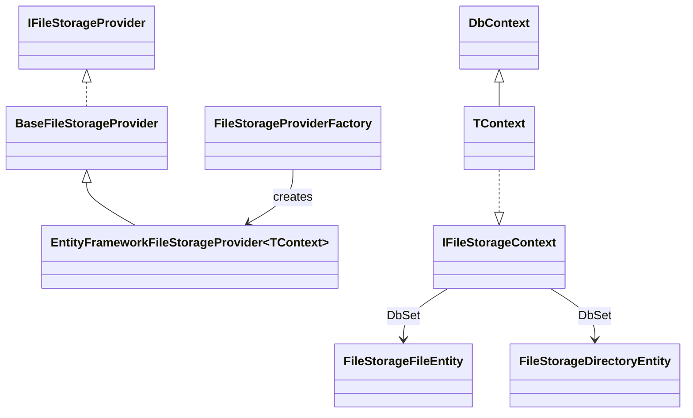
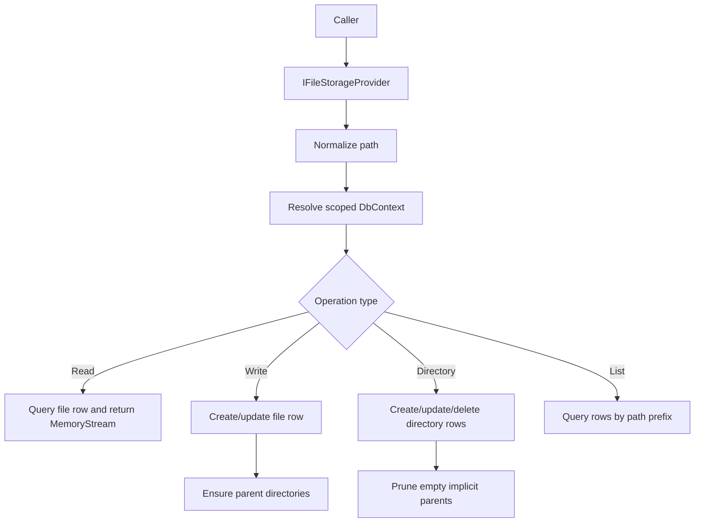

# Design Document: EntityFramework Virtual File System Provider (Application.Storage)

> This design document describes a full Entity Framework backed implementation of `IFileStorageProvider` that uses a relational database as a virtual filesystem. It aligns with the existing file storage abstractions in `Application.Storage` and follows the same DbContext extension model already used by Entity Framework based messaging, queueing, and file monitoring features.

[TOC]

## 1. Introduction

The `FileStorage` feature already defines a rich provider abstraction through `IFileStorageProvider`, its behaviors, its factory-based DI composition, and a comprehensive integration test suite. Existing providers target local disk, in-memory storage, network shares, and Azure storage systems.

This design introduces a new provider that persists files and directories in a relational database through Entity Framework Core and exposes that persistence through the same `IFileStorageProvider` contract. The provider must support the full file storage surface, including:

- file read and write operations
- streaming writes through `OpenWriteFileAsync`
- metadata access and updates
- file and directory listing
- directory lifecycle operations
- copy, move, rename, and delete operations
- health checks
- cross-provider compatibility through the existing extension methods

The result is a virtual filesystem whose backing store is the application database instead of a physical filesystem or cloud blob container.

This provider is intended for cases where files should live beside other durable application state and where adopting an extra blob or file storage system would add unnecessary infrastructure complexity.

---

## 2. Goals

The Entity Framework file storage provider is intended to satisfy the following goals.

### 2.1 Full `IFileStorageProvider` compatibility

The provider shall implement the full existing file storage contract without requiring a parallel API or special-case consumer code.

### 2.2 Database as virtual filesystem

The provider shall model files and directories in relational storage so callers can treat the database as a hierarchical filesystem.

### 2.3 Alignment with existing Entity Framework feature patterns

The provider shall follow the same capability-marker pattern used elsewhere in the repository:

- the application `DbContext` opts in by implementing a marker interface
- the provider depends only on that marker interface and its own EF entities
- the feature composes cleanly with contexts that already implement other system capability interfaces such as `IMessagingContext`, `IQueueingContext`, or `IFileMonitoringContext`

### 2.4 Cross-provider interoperability

The provider shall work with the existing storage behaviors and extension methods, including compression, encryption, traversal, deep copy, and cross-provider copy and move helpers.

### 2.5 Deterministic filesystem semantics

The provider shall provide consistent behavior for path normalization, directory existence, empty directories, conflict handling, metadata, and listing so consumers see stable virtual filesystem behavior independent of the underlying database engine.

### 2.6 Multi-instance safety

The provider shall support safe concurrent use from multiple application instances against the same database.

---

## 3. Non-goals

The design intentionally does not try to turn the relational database into a general-purpose content-addressable blob service or versioning platform.

### 3.1 No new file storage abstraction

This design does not introduce a second storage interface. The existing `IFileStorageProvider` remains the single abstraction.

### 3.2 No dependency on file monitoring events

The provider does not require `IFileMonitoringContext` or the file monitoring event store in order to function.

### 3.3 No dependency on messaging or queueing runtime components

The provider may be used on a context that also supports messaging or queueing, but it must not depend on those transports or their hosted workers.

### 3.4 No external object storage requirement

The persisted file content is owned by the provider and stored directly in the database schema managed by the consuming application context.

---

## 4. High-level architecture

The Entity Framework virtual filesystem becomes another concrete `IFileStorageProvider` implementation beside local, in-memory, network, and Azure-backed providers.

### 4.1 Architectural position

- `Application.Storage` continues to own the abstraction, behaviors, and cross-provider extensions
- `Infrastructure.EntityFramework` owns the EF entities, marker interface, provider implementation, and file-storage DI integration
- consuming applications extend their own `DbContext` with the provider marker interface and its `DbSet<>` properties

### 4.2 Runtime flow

At runtime:

1. application code resolves an `IFileStorageProvider` from the existing file storage factory
2. the Entity Framework provider normalizes the requested path and resolves a scoped `DbContext`
3. the provider loads or updates file and directory rows
4. file content is returned as streams or persisted from streams
5. the caller continues to use normal `IFileStorageProvider` behavior and extension methods

### 4.3 High-level component diagram



### 4.4 Operational flow



---

## 5. Core design principles

### 5.1 Keep the provider contract unchanged

Consumers should not need a special database-oriented storage API. The database-backed filesystem must conform to the existing contract and its current behavioral expectations.

### 5.2 Persist directories explicitly

Directories must be first-class persisted records rather than being inferred only from file paths. This is necessary to support:

- empty directories
- `CreateDirectoryAsync`
- `DeleteDirectoryAsync`
- `RenameDirectoryAsync`
- `DirectoryExistsAsync`
- `ListDirectoriesAsync`

### 5.3 Treat paths as provider-owned logical identifiers

The provider must normalize and compare paths consistently so that the virtual filesystem behaves deterministically across different database providers and host operating systems.

### 5.4 Reuse current provider composition patterns

The provider should plug into `AddFileStorage` and `FileStorageProviderFactory` just like the other providers and remain compatible with logging, retry, and caching decorators.

### 5.5 Prefer short-lived contexts with embedded row leases

The provider should not hold a long-lived `DbContext`. Each operation should use a fresh scoped context and rely on EF transactions, optimistic concurrency, and row-level leases on file and directory entities for safety.

### 5.6 Preserve extension behavior expectations

Existing cross-provider and compression extensions rely on stable semantics for listing, directory creation, move/copy behavior, and file metadata. The database-backed provider must preserve those semantics.

---

## 6. Context contract

The provider shall define a dedicated capability interface, aligned with the existing Entity Framework extension model.

### 6.1 Marker interface

Recommended contract:

```csharp
public interface IFileStorageContext
{
    DbSet<FileStorageFileEntity> StorageFiles { get; set; }

    DbSet<FileStorageDirectoryEntity> StorageDirectories { get; set; }
}
```

### 6.2 Consuming context example

```csharp
public class CoreDbContext(DbContextOptions<CoreDbContext> options) :
    ModuleDbContextBase(options),
    IMessagingContext,
    IQueueingContext,
    IFileStorageContext
{
    public DbSet<BrokerMessage> BrokerMessages { get; set; }

    public DbSet<QueueMessage> QueueMessages { get; set; }

    public DbSet<FileStorageFileEntity> StorageFiles { get; set; }

    public DbSet<FileStorageDirectoryEntity> StorageDirectories { get; set; }
}
```

### 6.3 Context independence

The provider depends only on `IFileStorageContext`. It must not require:

- `ModuleDbContextBase`
- messaging types
- queueing types
- file monitoring types

Those may coexist on the same context, but they are not prerequisites.

---

## 7. Persistence model

The virtual filesystem persists directories and files separately. Multi-node coordination is handled through lease fields on those same rows rather than through a separate lock table.

### 7.1 File entity

Recommended entity:

```csharp
[Table("__Storage_Files")]
[Index(nameof(LocationName), nameof(NormalizedPath), IsUnique = true)]
[Index(nameof(LocationName), nameof(ParentPath), nameof(Name))]
[Index(nameof(LocationName), nameof(ParentPath), nameof(LockedUntil))]
[Index(nameof(LocationName), nameof(LastModified))]
public class FileStorageFileEntity
{
    [Key]
    public Guid Id { get; set; }

    [Required]
    [MaxLength(256)]
    public string LocationName { get; set; }

    [Required]
    [MaxLength(2048)]
    public string NormalizedPath { get; set; }

    [MaxLength(2048)]
    public string ParentPath { get; set; }

    [Required]
    [MaxLength(512)]
    public string Name { get; set; }

    [Required]
    public ContentType ContentType { get; set; } = ContentType.DEFAULT;

    public string ContentText { get; set; }

    [MaxLength(256)]
    public string TextEncodingName { get; set; }

    [Required]
    public bool TextHasByteOrderMark { get; set; }

    public byte[] ContentBinary { get; set; }

    [Required]
    public long Length { get; set; }

    [MaxLength(64)]
    public string Checksum { get; set; }

    [Required]
    public DateTimeOffset LastModified { get; set; } = DateTimeOffset.UtcNow;

    [MaxLength(256)]
    public string LockedBy { get; set; }

    public DateTimeOffset? LockedUntil { get; set; }

    [Required]
    [ConcurrencyCheck]
    public Guid ConcurrencyVersion { get; set; } = Guid.NewGuid();
}
```

`ContentType` should be derived using the existing helpers in `Common.Utilities`, preferably:

```csharp
var contentType = ContentTypeExtensions.FromFileName(path, ContentType.DEFAULT);
var isBinary = contentType.IsBinary();
```

Persistence rules:

- if `contentType.IsBinary()` is `true`, store bytes in `ContentBinary` and keep all text-specific columns null or false
- otherwise decode the original bytes into `ContentText`, persist the detected `TextEncodingName`, persist whether the original payload had a byte-order mark in `TextHasByteOrderMark`, and keep `ContentBinary` null

The provider should validate that exactly one of `ContentText` or `ContentBinary` is populated for a stored file row.

For text files, exact byte round-tripping is required so checksums and reads stay faithful to the original content. The provider should therefore:

- detect text encoding from the incoming bytes using BOM-aware logic
- default to UTF-8 when no BOM is present
- decode using strict fallback behavior so unsupported or lossy byte sequences fail rather than being altered silently
- re-encode from `ContentText` using `TextEncodingName` and `TextHasByteOrderMark` when serving `ReadFileAsync`

If the provider cannot decode and later re-encode the text payload without changing bytes, the write should fail rather than accept lossy text persistence.

### 7.2 Directory entity

Recommended entity:

```csharp
[Table("__Storage_Directories")]
[Index(nameof(LocationName), nameof(NormalizedPath), IsUnique = true)]
[Index(nameof(LocationName), nameof(ParentPath), nameof(Name))]
[Index(nameof(LocationName), nameof(LockedUntil))]
[Index(nameof(LocationName), nameof(IsExplicit), nameof(LastModified))]
public class FileStorageDirectoryEntity
{
    [Key]
    public Guid Id { get; set; }

    [Required]
    [MaxLength(256)]
    public string LocationName { get; set; }

    [Required]
    [MaxLength(2048)]
    public string NormalizedPath { get; set; }

    [MaxLength(2048)]
    public string ParentPath { get; set; }

    [Required]
    [MaxLength(512)]
    public string Name { get; set; }

    [Required]
    public bool IsExplicit { get; set; }

    [Required]
    public DateTimeOffset LastModified { get; set; } = DateTimeOffset.UtcNow;

    [MaxLength(256)]
    public string LockedBy { get; set; }

    public DateTimeOffset? LockedUntil { get; set; }

    [Required]
    [ConcurrencyCheck]
    public Guid ConcurrencyVersion { get; set; } = Guid.NewGuid();
}
```

### 7.3 Why two tables

Two tables keep the virtual filesystem model clear and safe:

- empty directory support
- list-files versus list-directories queries
- file versus directory conflict validation
- subtree rename and delete logic
- distributed coordination across nodes through embedded row leases

### 7.4 Explicit versus implicit directories

The provider shall distinguish between:

- explicit directories created through `CreateDirectoryAsync`
- implicit directories automatically materialized because a file or descendant directory exists below them

This distinction is needed so parent directories created only as structural support can be pruned automatically when they become empty, while caller-created empty directories remain visible.

---

## 8. Path model

### 8.1 Normalization rules

All persisted paths shall use a normalized logical format:

- forward slash separators
- no leading slash
- no trailing slash for stored file and directory paths
- lowercase for comparisons and persistence
- empty string reserved for virtual root, not stored as a normal directory row

Examples:

- `folder/file.txt`
- `folder/subfolder`
- `""` as virtual root in code only

### 8.2 Derived path parts

For both files and directories the provider derives and persists:

- `NormalizedPath`
- `ParentPath`
- `Name`

These fields avoid repeated string parsing and simplify indexed queries.

### 8.3 Location scoping

`LocationName` shall be stored on every file and directory row so multiple logical file stores can share the same physical database.

---

## 9. Provider behavior

The provider implements the full `IFileStorageProvider` contract.

### 9.1 Provider shape

Recommended signature:

```csharp
public class EntityFrameworkFileStorageProvider<TContext> : BaseFileStorageProvider
    where TContext : DbContext, IFileStorageContext
```

Recommended constructor dependencies:

- `IServiceProvider`
- `ILoggerFactory`
- `string locationName`
- optional `string description`

The provider should resolve a scoped `TContext` per operation from `IServiceProvider`.

### 9.2 `SupportsNotifications`

The provider should report `false`.

The interface allows providers to state that they do not support change notifications. A database-backed virtual filesystem can still fully implement the file storage contract without native real-time watcher support.

### 9.3 File existence

`FileExistsAsync(path)` succeeds when a file row exists for the normalized path and location. It fails with `NotFoundError` when the file is missing.

### 9.4 File read

`ReadFileAsync(path)` loads the file row and returns:

- a `MemoryStream` over `ContentBinary` for binary content types
- a `MemoryStream` over the exact original text bytes reconstructed from `ContentText`, `TextEncodingName`, and `TextHasByteOrderMark` for text content types

The provider should use the persisted `ContentType` to decide which content column to read and validate that the row is internally consistent before returning content.

### 9.5 File write

`WriteFileAsync(path, content)` shall:

1. validate path and stream
2. copy the input stream into a memory buffer
3. determine `ContentType` from the file name using `ContentTypeExtensions.FromFileName(path, ContentType.DEFAULT)`
4. if `contentType.IsBinary()` is `false`, detect text encoding from the buffered bytes, decode losslessly into `ContentText`, and persist `TextEncodingName` plus `TextHasByteOrderMark`
5. compute checksum and length from the original incoming bytes
6. store the content in `ContentText` when `contentType.IsBinary()` is `false`, otherwise store it in `ContentBinary`
7. ensure all parent directories exist as persisted directory rows
8. create or update the file row
9. update `LastModified`

Text content should be stored in `ContentText` together with enough encoding metadata to recreate the exact original byte stream. Binary content should be stored unmodified in `ContentBinary`.

### 9.6 Open-write streaming

`OpenWriteFileAsync(path, useTemporaryWrite, ...)` shall return an `OpenWriteFileStream` that buffers to memory and commits to the database only after successful flush and dispose.

When `useTemporaryWrite` is `true`, the provider should keep the same observable semantics as the current staged-write pattern:

- the target file is not updated until successful finalization
- if stream completion fails, the previous persisted content remains unchanged

For this provider, both direct and temporary open-write operations may use the same internal buffer-and-commit implementation, but the commit point must still happen only on successful stream finalization.

### 9.7 File delete

`DeleteFileAsync(path)` removes the file row and then prunes now-empty implicit parent directories.

### 9.8 Checksum

`GetChecksumAsync(path)` returns the stored checksum. The checksum should be recomputed on every content write and copy operation using the canonical byte representation:

- raw bytes for binary files
- the original exact bytes for text files, reconstructed only for validation and readback, not normalized

### 9.9 Metadata

`GetFileMetadataAsync(path)` returns metadata for files and directory paths:

- for files: actual length and last modified
- for directories: length `0` and directory last modified

`SetFileMetadataAsync` and `UpdateFileMetadataAsync` shall support `LastModified`. `Length` remains derived from content and must not be caller-controlled for files.

### 9.10 File listing

`ListFilesAsync(path, searchPattern, recursive, continuationToken)` shall:

- treat `path` as a directory root
- query files by path prefix and location
- sort by `NormalizedPath`
- apply wildcard matching against the normalized file path
- page results with a stable numeric continuation token

Recommended page size: `100`, aligned with the current local provider behavior.

Paged listings are allowed to be eventually consistent under concurrent mutations. The continuation token is therefore a best-effort paging cursor, not a snapshot token, and concurrent inserts or deletes may cause later pages to reflect a newer view of the filesystem.

### 9.11 File copy

`CopyFileAsync(path, destinationPath)` copies content, `ContentType`, checksum, and metadata to a new file path, ensures destination parents exist, and leaves the source unchanged.

### 9.12 File rename and move

`RenameFileAsync` and `MoveFileAsync` both relocate a file row to a new normalized path. The implementation may share the same internal path-move helper.

### 9.13 Directory existence

`DirectoryExistsAsync(path)` succeeds when an explicit or implicit directory row exists for the normalized path.

### 9.14 Create directory

`CreateDirectoryAsync(path)` creates the target directory as `IsExplicit = true` and creates missing ancestors as implicit directories.

### 9.15 Delete directory

`DeleteDirectoryAsync(path, recursive)` shall:

- fail if the directory does not exist
- fail for non-recursive deletion when descendant files or directories exist
- remove all descendant file and directory rows when `recursive = true`
- preserve unrelated sibling paths
- prune empty implicit parent directories afterwards

### 9.16 Directory listing

`ListDirectoriesAsync(path, searchPattern, recursive)` shall return normalized directory paths excluding the requested root directory itself, matching the current provider expectations. Wildcard matching may be applied to the normalized returned directory path, not only to the final segment.

### 9.17 Directory rename

`RenameDirectoryAsync(path, destinationPath)` shall rename the directory row and rewrite all descendant file and directory paths in a single logical operation.

It must reject attempts to rename a directory into itself or into one of its own descendants.

### 9.18 Health check

`CheckHealthAsync()` should verify that the provider can resolve a context and perform a minimal query against the storage tables.

---

## 10. Directory materialization strategy

Directory persistence is the most important structural design choice in this provider.

### 10.1 Why explicit rows are required

Inferring directories only from file paths would break:

- empty directory behavior
- directory rename without loading and rewriting every path based only on prefix inference
- `DirectoryExistsAsync` on a path that contains no file yet
- test parity with existing provider expectations

### 10.2 Parent directory creation

Whenever the provider writes a file or creates a directory, it shall ensure that all parent directories exist as persisted directory rows.

Example:

Writing `alpha/beta/file.txt` creates or ensures:

- `alpha` as implicit if missing
- `alpha/beta` as implicit if missing
- `alpha/beta/file.txt` as file

### 10.3 Parent directory pruning

When a file or directory is removed, the provider should walk upward and remove implicit parent directories that have become empty.

It must not remove:

- explicit directories
- directories that still have child files
- directories that still have child directories

---

## 11. Transactions and concurrency

### 11.1 Context lifetime

The provider should resolve a fresh scoped `TContext` per operation.

This is important because the file storage factory may create singleton providers, and a singleton provider must not capture a scoped `DbContext`.

### 11.2 In-process coordination

The provider shall be thread safe for concurrent use from multiple callers in the same process.

The provider should maintain an internal lock registry based on normalized logical paths, for example through a `ConcurrentDictionary<string, SemaphoreSlim>` or equivalent keyed-lock mechanism.

The in-process locks are a coordination aid for same-node callers. They are not the source of truth for correctness, but they must prevent avoidable local races such as:

- two writers updating the same file path concurrently
- a file write racing with file delete on the same path
- a directory rename racing with a descendant file write
- recursive delete racing with child create or move operations

Each operation shall compute the set of affected logical lock keys before opening the database transaction.

Recommended lock scope:

- single-file operations: target file path plus its parent directory path
- file move and copy operations: source file path, destination file path, source parent directory, destination parent directory
- single-directory operations: target directory path plus its parent directory path
- subtree operations such as recursive delete or directory rename: source directory root, destination directory root when applicable, and their parent directories

When more than one in-process lock is needed, the provider shall:

1. normalize and de-duplicate all lock keys
2. sort them lexically using ordinal comparison
3. acquire them in that exact order
4. release them in reverse order

This ordering rule is mandatory to avoid local deadlocks.

The provider should keep lock hold times short and must never perform long-running work such as full input-stream copying while already holding the in-process locks unless that work is necessary for atomicity. For `WriteFileAsync` and `OpenWriteFileAsync`, the content should be buffered before the critical database commit section begins.

### 11.3 Database coordination

The provider should use:

- optimistic concurrency via `ConcurrencyVersion`
- embedded row leases via `LockedBy` and `LockedUntil` on file and directory rows
- short EF transactions for multi-row changes

The provider must also be lock safe at the database level when multiple application instances operate on the same virtual filesystem.

Database safety shall rely on these mechanisms together:

- unique indexes on `(LocationName, NormalizedPath)` so duplicate file or directory rows can never be committed
- optimistic concurrency tokens on mutable rows
- explicit row leases on `__Storage_Files` and `__Storage_Directories`
- short-lived transactions around each logical mutation
- deterministic row processing order inside those transactions
- bounded retries for transient lock-contention failures where retry is safe

The database is the final arbiter of correctness. In-process locks only coordinate callers on the same node.

Operations that should be transactional include:

- write file
- copy file
- move file
- rename file
- create directory
- delete directory
- rename directory
- recursive delete

### 11.4 Embedded lease model

The provider shall coordinate multi-node writers through lease fields stored on file and directory rows themselves.

Optimistic concurrency on file and directory rows protects conflicting updates to existing rows, but multi-node safety still requires explicit ownership during mutations. Instead of a separate lock table, that ownership is modeled through:

- `LockedBy`
- `LockedUntil`

on `FileStorageFileEntity` and `FileStorageDirectoryEntity`.

#### 11.4.1 Lease ownership

Each provider instance should generate a stable instance identifier such as:

`{Environment.MachineName}:{Guid.NewGuid():N}`

That identifier becomes `LockedBy`.

#### 11.4.2 Lease semantics

- a file-row lease protects one exact file path
- a directory-row lease protects that directory as the structural owner for descendant mutations
- a leased directory row is treated as the owner of its subtree for create, move, rename, and delete checks below that path

#### 11.4.3 Lease conflict rules

Two active leases conflict when they belong to the same `LocationName` and:

- they target the same file row
- they target the same directory row
- a directory row on the path chain to the target is leased by another node
- the operation needs a parent directory lease and that directory is leased by another node

Examples:

- write `a/b/file.txt` conflicts with an active lease on directory `a` or `a/b`
- rename directory `a` conflicts with an active lease on `a` or any descendant row participating in the rename
- recursive delete `a/b` conflicts with an active lease on `a/b` or on descendant rows that are part of the delete set

No additional `__Storage_Locks` table is required. The row being protected is also the row that carries the lease state.

#### 11.4.4 Recommended lease intent by operation

- file write, metadata update, delete: lease the file row when it exists; for create, lease the parent directory row
- file move or rename: lease source file row plus source and destination parent directory rows
- directory create: lease the parent directory row, then create the new directory row
- directory rename and recursive delete: lease the source directory row
- directory rename: also lease the destination parent directory row

For root-level file and directory creation, the provider needs one internal root directory row per `LocationName` so there is always a persistent row available to lease for root-scoped structural changes. That root row remains an internal implementation detail and is never listed as a normal directory.

The embedded-lease model trades some hotspot risk on parent directories for a simpler schema and simpler cleanup. A separate lock table would make arbitrary future-path locks easier, but it would add another lifecycle to maintain and keep consistent. For this provider, directory rows already represent structure, so embedding the lease state there is the better fit.

#### 11.4.5 Lease duration and renewal

Leases should be time-bounded rather than permanent.

Recommended model:

- acquire a lease with `LockedUntil = now + LeaseDuration`
- keep `LeaseDuration` short, for example 15 to 30 seconds
- renew only if a future operation can legitimately outlive the initial duration

Most filesystem mutations should complete inside one short transaction and should not require renewal. If renewal is needed later, it should follow the same `LockedBy` and `LockedUntil` pattern already used by the EF queueing worker.

### 11.5 Stable ordering

When multiple rows are updated in one operation, updates should be applied in deterministic path order to reduce deadlock risk and simplify testing.

This applies especially to:

- parent-directory creation
- implicit-directory pruning
- directory subtree rename
- recursive delete

The provider should order rows by normalized path using ordinal comparison before applying updates or deletes.

### 11.6 Mutation protocol

Every mutating operation should follow a consistent protocol:

1. normalize all input paths
2. buffer file content if needed
3. compute and acquire in-process lock keys in stable order
4. acquire row leases on the affected file and directory rows
5. create a fresh scoped context
6. begin a short database transaction
7. re-read the relevant file, directory, and lease state inside that transaction
8. validate conflicts and preconditions against current database state
9. apply changes in deterministic path order
10. save changes and commit
11. release row leases
12. release in-process locks

The re-read inside the transaction is important. The provider must not make mutation decisions only from state read before the transaction starts.

Lease acquisition should be implemented as conditional updates on the target file or directory rows:

- acquire when `LockedUntil` is null, expired, or already owned by the same `LockedBy`
- reject when another node still owns an unexpired lease
- rely on `ConcurrencyVersion` and affected-row counts to detect races

For creates where the target file row does not yet exist, the parent directory row is the synchronization point.

### 11.7 Concurrency conflict handling

The implementation must treat the following outcomes as normal concurrency situations rather than unexpected logic failures:

- `DbUpdateConcurrencyException`
- unique-index violations caused by concurrent create or rename operations
- deadlock-victim or serialization-failure database errors
- lock-timeout database errors

Handling rules:

- optimistic concurrency conflicts and uniqueness conflicts should be translated into meaningful `Result` failures when the operation can no longer succeed with the originally requested semantics
- active lease conflicts should surface as explicit lock or lease contention failures
- deadlock and transient lock-timeout failures should be retried a bounded number of times when the full operation is safe to replay
- replay-safe operations include buffered writes, file copy, file move, directory create, directory delete, and directory rename when the whole logical mutation is retried from the start
- retries must always start from a fresh `DbContext` and a new transaction

### 11.8 Transaction isolation and lock footprint

The implementation should prefer the database provider's normal write locking behavior with short transactions over coarse, long-running serializable transactions across the entire virtual filesystem.

The provider must avoid:

- table-wide locks
- transactions that span user-controlled stream writing time
- loading unrelated rows into the same write transaction

The mutation should touch only the rows needed for the requested path or subtree.

### 11.9 Subtree-operation safety

Directory rename and recursive delete are the most lock-sensitive operations because they affect many rows.

For subtree operations, the provider shall:

- lock the source root path and destination root path in-process when both exist in the operation
- acquire the required directory-row leases in the database before the write transaction proceeds
- query all affected descendant file and directory rows inside the transaction
- process those rows in deterministic path order
- update both directory and file paths within the same transaction
- fail the operation if a concurrent change invalidates the planned subtree mutation before commit

No subtree operation may partially commit.

---

## 12. Conflict and validation rules

The provider shall enforce clear filesystem-like conflict rules.

### 12.1 File versus directory conflicts

- writing a file to a path occupied by a directory fails
- creating a directory at a path occupied by a file fails
- moving or renaming a file onto a directory path fails
- moving or renaming a directory onto a file path fails

### 12.2 Root behavior

The root is virtual and always exists conceptually for callers. Internally, the provider should persist one root directory row per `LocationName` so root-scoped create, move, and delete operations have a stable row that can carry lease state. That internal row must not be returned by normal directory listing APIs and must never be exposed as a user-created directory.

### 12.3 Rename path safety

Directory renames must reject:

- same-source-and-destination no-op conflicts if the normalized paths are equal
- destination paths inside the source subtree
- source paths inside the destination subtree

### 12.4 Continuation token validity

Invalid continuation tokens should fail with a `Result` error rather than silently returning inconsistent pages.

---

## 13. Integration with `AddFileStorage`

The provider should compose through the existing factory model so consumers can register it like the other providers.

### 13.1 Builder extension

Recommended builder extension:

```csharp
public static FileStorageProviderFactory.FileStorageBuilder UseEntityFramework<TContext>(
    this FileStorageProviderFactory.FileStorageBuilder builder,
    string locationName,
    string description = null)
    where TContext : DbContext, IFileStorageContext
```

This extension should set `ProviderFactory` to create the provider using the DI service provider.

### 13.2 Example registration

```csharp
services.AddDbContext<CoreDbContext>(options => options.UseSqlServer(connectionString));

services.AddFileStorage(c => c
    .RegisterProvider("db", builder =>
    {
        builder.UseEntityFramework<CoreDbContext>("DatabaseFiles")
               .WithLogging()
               .WithLifetime(ServiceLifetime.Singleton);
    }));
```

### 13.3 Why factory integration matters

Factory integration ensures the provider automatically participates in:

- existing provider lookup by name
- behavior decoration
- test patterns already used elsewhere in the repository
- cross-provider features without special wiring

---

## 14. Implementation details needed later

This section captures concrete implementation guidance that should be preserved when coding the provider.

### 14.1 Recommended file layout

Suggested additions under `src/Infrastructure.EntityFramework/Storage/Files/`:

- `IFileStorageContext.cs`
- `FileStorageFileEntity.cs`
- `FileStorageDirectoryEntity.cs`
- `EntityFrameworkFileStorageProvider{TContext}.cs`
- `FileStorageProviderFactoryEntityFrameworkExtensions.cs`

### 14.2 Internal helper methods

The provider implementation will likely need dedicated helpers for:

- `NormalizePath(string path)`
- `GetParentPath(string normalizedPath)`
- `GetName(string normalizedPath)`
- `IsPathWithinSubtree(string path, string rootPath)`
- `EnsureRootDirectoryAsync(...)`
- `EnsureParentDirectoriesAsync(...)`
- `PruneEmptyImplicitParentsAsync(...)`
- `ValidateNoFileDirectoryConflictAsync(...)`
- `AcquireFileLeaseAsync(...)`
- `AcquireDirectoryLeaseAsync(...)`
- `AcquireParentDirectoryLeaseAsync(...)`
- `ReleaseRowLeaseAsync(...)`
- `IsLeaseAvailable(...)`
- `TryGetFileAsync(...)`
- `TryGetDirectoryAsync(...)`
- `ApplyDirectoryRenameAsync(...)`
- `SerializeContentAsync(...)`
- `DeserializeContent(...)`
- `DetectTextEncoding(...)`
- `EncodeTextContent(...)`
- `ParseContinuationToken(...)`

### 14.3 Stream handling detail

`OpenWriteFileAsync` should reuse `OpenWriteFileStream` and commit on `onSuccessAsync`.

The provider should not attempt to expose a live EF-backed stream. The database persistence boundary remains at stream finalization, not during each `WriteAsync` call.

### 14.4 Checksum detail

Use SHA256 and keep the encoding consistent with existing providers by returning the checksum as Base64.

For text files, the checksum must always be based on the original byte sequence, not on a normalized or re-encoded text representation.

### 14.5 Text encoding detail

Text persistence should preserve exact bytes while still storing human-readable content as `ContentText`.

Recommended rules:

- detect Unicode encodings from BOM when present
- otherwise assume UTF-8
- use strict decoder and encoder fallbacks so invalid byte sequences fail fast
- persist `TextEncodingName` and `TextHasByteOrderMark`
- re-encode from the stored text plus encoding metadata when reading the file back

This keeps the database representation text-friendly without sacrificing checksum fidelity or byte-exact reads.

### 14.6 Query strategy detail

For portability across EF providers:

- do prefix filtering and ordering in SQL
- do wildcard pattern evaluation in memory using the same `Match(...)` helper behavior already used by current providers, applied to the normalized returned path

This avoids provider-specific SQL pattern logic while preserving current semantics.

### 14.7 Transaction detail

Wrap multi-row mutations in `BeginTransactionAsync` when the provider supports relational transactions. When the underlying EF provider does not support full transactions, the provider should still preserve logical ordering and fail safely.

The implementation should centralize mutation execution through a helper such as `ExecuteLockedMutationAsync(...)` so all write operations reuse the same:

- path normalization
- lock-key calculation
- ordered lock acquisition
- fresh-context resolution
- transaction creation
- retry handling
- conflict translation

### 14.8 Lock-safety detail

The implementation should include provider-agnostic detection for transient lock-contention failures, for example:

- SQL Server deadlock victim and lock timeout
- PostgreSQL serialization or deadlock errors
- SQLite busy or locked errors

These should be recognized by an internal helper and retried only when the operation is safe to replay from the start.

The implementation should also define a dedicated result error for active filesystem lock or lease contention so callers can distinguish path contention from other failure modes.

### 14.9 Lease detail

The lease model should mirror the existing EF queueing and messaging lease pattern:

- `LockedBy`
- `LockedUntil`
- time-bounded ownership
- optimistic concurrency for claim and release

The difference is that the filesystem provider acquires leases on file and directory rows rather than on queued work items, and directory-row leases act as subtree ownership. No separate lock entity or lock table should be introduced.

Leases should be acquired with conditional row updates so the database itself arbitrates ownership across nodes. This keeps the concurrency model aligned with the actual filesystem rows and avoids orphaned lease records.

### 14.10 Metadata detail

`LastModified` on directories should be updated when:

- the directory is explicitly created
- a descendant file or directory is added, removed, or renamed under it
- the directory itself is renamed

This keeps directory metadata meaningful and deterministic.

### 14.11 Testing detail

The existing `FileStorageTestsBase` should be reused for parity testing. Add a dedicated EF-backed test class under infrastructure integration tests using SQLite as the primary relational test provider.

Additional targeted tests should cover:

- empty directories
- explicit versus implicit directory pruning
- directory subtree rename correctness
- invalid continuation tokens
- file/directory path conflicts
- singleton provider usage with scoped `DbContext` resolution
- same-path concurrent writes from multiple tasks
- cross-node-style lease contention using separate provider instances against the same database
- text-file persistence through `ContentText` and binary-file persistence through `ContentBinary`
- checksum stability for text files after write, read, copy, move, and rename
- BOM and non-BOM UTF text round-trip fidelity
- path-based wildcard matching for file and directory listings
- write versus delete races on the same path
- rename versus descendant write races
- retry behavior on simulated transient lock contention when feasible
- second-node lease conflict on the same file path
- second-node lease conflict through a leased parent directory row
- expired lease takeover by another node
- lease release after commit and rollback

### 14.12 Migration detail

The provider should not introduce standalone library-owned migrations. The consuming application context owns schema evolution and adds the new tables through its normal migration workflow after implementing `IFileStorageContext`.

---

## 15. Testing strategy

### 15.1 Contract parity tests

Use the existing storage integration test base to verify provider parity with the established contract.

### 15.2 Relational provider tests

Use SQLite-backed tests to validate relational behavior such as:

- persistence across context instances
- transactional updates
- query correctness
- rename and recursive delete behavior

### 15.3 Concurrency tests

Add focused tests for:

- simultaneous writes to the same path
- move and rename conflicts
- subtree rename while descendants exist

### 15.4 Cross-provider tests

Verify the new provider works with:

- `DeepCopyAsync`
- compression extensions
- object and text read/write extensions

---

## 16. Risks and trade-offs

### 16.1 Database size growth

Persisting binary content directly in relational tables increases database size and backup volume. This is an intentional trade-off in exchange for infrastructure simplicity and transactional locality.

### 16.2 Buffering during writes

`WriteFileAsync` and `OpenWriteFileAsync` use buffering before persistence. This keeps the implementation aligned with the current abstractions and simplifies atomic commit behavior, but it means very large writes are memory-intensive.

### 16.3 Subtree rename cost

Directory rename requires rewriting descendant paths. This is acceptable for a virtual filesystem design, but it is inherently more expensive than object stores that treat paths as opaque keys.

### 16.4 Notification support

The provider does not expose native change notifications. That is acceptable because the contract already supports providers that return `SupportsNotifications = false`.

---

## 17. Summary

This design adds a full Entity Framework backed virtual filesystem to the existing `FileStorage` feature by:

- keeping `IFileStorageProvider` unchanged
- introducing a dedicated `IFileStorageContext` marker interface
- persisting both files and directories explicitly
- integrating through the existing file storage factory and behaviors
- preserving the semantics expected by current storage extensions and tests

The most important design decisions are:

- directories are first-class persisted entities
- paths are normalized and location-scoped
- the provider uses short-lived contexts and optimistic concurrency
- the database is treated as the canonical backing store for a hierarchical virtual filesystem

This keeps the feature aligned with the repository’s existing architecture and provides a practical, implementation-ready design for durable database-backed file storage.
