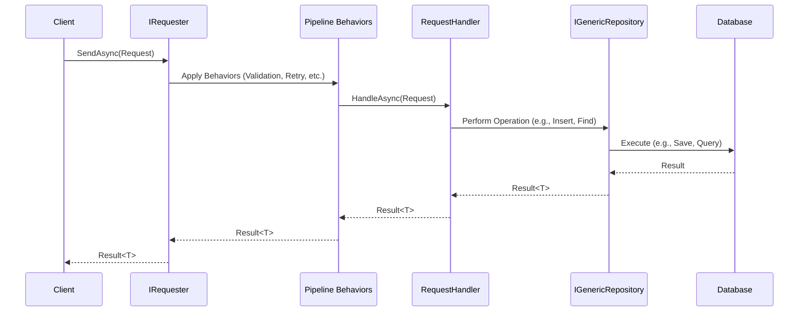

# Application Commands and Queries Feature Documentation

[TOC]

## Overview

### Background

The [Command Query Separation](https://en.wikipedia.org/wiki/Command%E2%80%93query_separation#:~:text=Command%2Dquery%20separation%20(CQS),the%20caller%2C%20but%20not%20both.) (CQS) principle, introduced by Bertrand Meyer, divides operations into commands, which modify system state and queries, which retrieve data without side effects. This separation enhances code clarity, predictability and maintainability by ensuring methods have distinct roles. By moving away from bloated application services that centralize all logic, commands and queries encapsulate specific business operations in smaller, focused units. This reduces the number of dependencies injected into each handler, improves testability by allowing isolated testing and promotes a cleaner architecture.

- **Commands**: Perform state-changing actions (e.g., creating a customer). They typically return `Result<Unit>` for actions with no meaningful return or `Result<T>` for minimal data like an ID.
- **Queries**: Retrieve data without altering state (e.g., fetching a customer). They return `Result<T>` with the requested data and are idempotent.

In Domain-Driven Design (DDD), commands and queries align with application services, encapsulating business logic and data access. The `Requester` feature in bITDevKit implements CQS using a mediator-like pattern, dispatching requests to handlers with type-safe `Result<T>` outcomes and extensible pipeline behaviors (e.g., validation, retries). This reduces coupling, as callers are unaware of handler implementations, minimizes dependency injection in handlers, and enables consistent handling of cross-cutting concerns, making the codebase more modular and testable.

### Challenges

- **Inconsistent Handling**: Ad hoc implementations lead to unpredictable behavior.
- **Mixed Concerns**: Combining state changes and data retrieval causes unintended side effects.
- **Extensibility**: Adding concerns like logging or validation requires modifying core logic.
- **Error Propagation**: Preserving error context across layers is complex.

### Solution

The `Requester` system provides:
- **Requests**: Inherit from `RequestBase<TResponse>`, defining inputs and outputs.
- **Handlers**: Implement `RequestHandlerBase<TRequest, TResponse>`, returning `Result<TResponse>`.
- **Dispatching**: Via `IRequester.SendAsync()`, routing requests through a pipeline of behaviors.

Behaviors (e.g., `ValidationPipelineBehavior`, `RetryPipelineBehavior`) handle concerns without altering business logic.

### Flow Diagram

The following Mermaid diagram illustrates the command/query flow:



## Setup

Register the `Requester` in the dependency injection (DI) container (e.g., in `CoreModule.cs`):

```csharp
services.AddRequester()
    .AddHandlers()  // Scans for handlers
    .WithBehavior<ValidationPipelineBehavior<,>>()  // Validates requests
    .WithBehavior<RetryPipelineBehavior<,>>();      // Adds retries
```

## Basic Usage

### Defining a Command
Commands modify state and return `Result<T>` (e.g., a DTO or `Unit`).

```csharp
public class CustomerCreateCommand(CustomerModel model) : RequestBase<CustomerModel>
{
    public CustomerModel Model { get; set; } = model;

    public class Validator : AbstractValidator<CustomerCreateCommand>
    {
        public Validator()
        {
            this.RuleFor(c => c.Model).NotNull();
            this.RuleFor(c => c.Model.FirstName).NotNull().NotEmpty().WithMessage("Must not be empty.");
            this.RuleFor(c => c.Model.LastName).NotNull().NotEmpty().WithMessage("Must not be empty.");
            this.RuleFor(c => c.Model.Email).NotNull().NotEmpty().WithMessage("Must not be empty.");
        }
    }
}
```

### Command Handler
Handlers implement business logic, often using repositories.

```csharp
[HandlerRetry(2, 100)]   // Retry twice with 100ms delay
[HandlerTimeout(500)]    // Timeout after 500ms
public class CustomerCreateCommandHandler(
    ILoggerFactory loggerFactory,
    IMapper mapper,
    IGenericRepository<Customer> repository)
    : RequestHandlerBase<CustomerCreateCommand, CustomerModel>(loggerFactory)
{
    protected override async Task<Result<CustomerModel>> HandleAsync(
        CustomerCreateCommand request,
        SendOptions options,
        CancellationToken cancellationToken)
    {
        var customer = mapper.Map<CustomerModel, Customer>(request.Model);
        return await repository.InsertResultAsync(customer, cancellationToken: cancellationToken)
            .Tap(_ => Console.WriteLine("AUDIT"))
            .Map(mapper.Map<Customer, CustomerModel>);
    }
}
```

### Defining a Query
Queries retrieve data and return `Result<T>`.

```csharp
public class CustomerFindOneQuery(string customerId) : RequestBase<CustomerModel>
{
    public string CustomerId { get; } = customerId;

    public class Validator : AbstractValidator<CustomerFindOneQuery>
    {
        public Validator()
        {
            this.RuleFor(c => c.CustomerId).NotNull().NotEmpty().WithMessage("Must not be empty.");
        }
    }
}
```

### Query Handler
```csharp
[HandlerRetry(2, 100)]
[HandlerTimeout(500)]
public class CustomerFindOneQueryHandler(
    IMapper mapper,
    IGenericRepository<Customer> repository)
    : RequestHandlerBase<CustomerFindOneQuery, CustomerModel>
{
    protected override async Task<Result<CustomerModel>> HandleAsync(
        CustomerFindOneQuery request,
        SendOptions options,
        CancellationToken cancellationToken) =>
        await repository.FindOneResultAsync(CustomerId.Create(request.CustomerId), cancellationToken: cancellationToken)
            .Tap(_ => Console.WriteLine("AUDIT"))
            .Map(mapper.Map<Customer, CustomerModel>);
}
```

### Dispatching
Inject and use the `IRequester`:

```csharp
var requester = serviceProvider.GetRequiredService<IRequester>();

// Command
var command = new CustomerCreateCommand(new CustomerModel 
{ 
    FirstName = "John", 
    LastName = "Doe", 
    Email = "john.doe@example.com" 
});

var commandResult = await requester.SendAsync(command);
if (commandResult.IsSuccess)
{
    Console.WriteLine($"Created customer: {commandResult.Value.Id}");
}
else
{
    Console.WriteLine($"Errors: {string.Join(", ", commandResult.Errors.Select(e => e.Message))}");
}

// Query
var query = new CustomerFindOneQuery("some-guid");
var queryResult = await requester.SendAsync(query);
if (queryResult.IsSuccess)
{
    Console.WriteLine($"Found customer: {queryResult.Value.FirstName}");
}
```

See [features-requester-notifier.md](./features-requester-notifier.md) for more details.