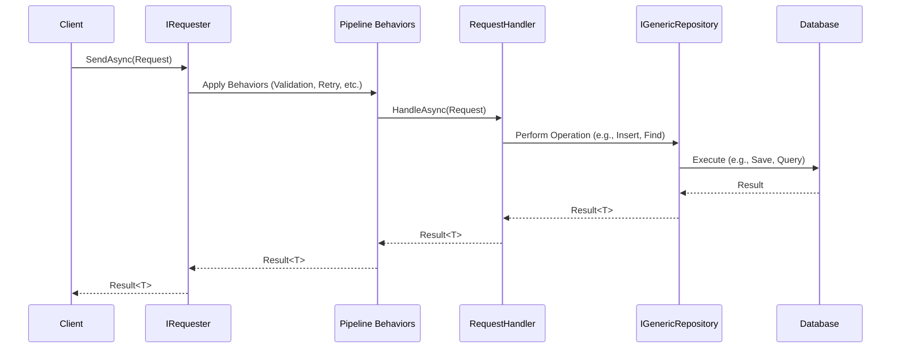

# Application Commands and Queries Feature Documentation

> Separate application writes and reads into focused handlers with shared behaviors and clear boundaries.

[TOC]

## Overview

### Background

The [Command Query Separation](https://en.wikipedia.org/wiki/Command%E2%80%93query_separation#:~:text=Command%2Dquery%20separation%20(CQS),the%20caller%2C%20but%20not%20both.) (CQS) principle, introduced by Bertrand Meyer, divides operations into commands, which modify system state, and queries, which retrieve data without side effects. This separation enhances code clarity, predictability and maintainability by ensuring methods have distinct roles. By moving away from bloated application services that centralize all logic, commands and queries encapsulate specific business operations in smaller, focused units. This reduces the number of dependencies injected into each handler, improves testability by allowing isolated testing and promotes a cleaner architecture.

- **Commands**: Perform state-changing actions such as creating or updating data. They typically return `Result<Unit>` for actions with no meaningful return or `Result<T>` for minimal data such as an identifier or summary model.
- **Queries**: Retrieve data without altering state. They return `Result<T>` with the requested data and are idempotent.

In Domain-Driven Design (DDD), commands and queries align with application services, encapsulating business logic and data access. The `Requester` feature in bITDevKit implements CQS using a mediator-like pattern, dispatching requests to handlers with type-safe `Result<T>` outcomes and extensible pipeline behaviors such as validation, retries, and timeouts. This reduces coupling, as callers are unaware of handler implementations, minimizes dependency injection in handlers, and enables consistent handling of cross-cutting concerns, making the codebase more modular and testable.

Many handlers also depend on the shared mapping abstraction to translate between request models, domain objects, and response DTOs; see [Common Mapping](./common-mapping.md).

### Challenges

- **Inconsistent Handling**: Ad hoc implementations lead to unpredictable behavior.
- **Mixed Concerns**: Combining state changes and data retrieval causes unintended side effects.
- **Extensibility**: Adding concerns like logging or validation requires modifying core logic.
- **Error Propagation**: Preserving error context across layers is complex.

### Solution

The `Requester` system provides:

- **Requests**: Source-generated command and query types authored as `partial` classes with `[Command]` or `[Query]`.
- **Handlers**: Business logic written inline with a single instance `[Handle]` method.
- **Dispatching**: Via `IRequester.SendAsync()`, routing requests through a pipeline of behaviors.

Behaviors such as `ValidationPipelineBehavior` and `RetryPipelineBehavior` handle concerns without altering business logic.

### Flow Diagram

The following Mermaid diagram illustrates the command/query flow:


```mermaid
sequenceDiagram
    participant Client
    participant Requester as IRequester
    participant Pipeline as Pipeline Behaviors
    participant Handler as RequestHandler
    participant Repository as IGenericRepository
    participant Database

    Client->>Requester: SendAsync(Request)
    Requester->>Pipeline: Apply Behaviors (Validation, Retry, etc.)
    Pipeline->>Handler: HandleAsync(Request)
    Handler->>Repository: Perform Operation (e.g., Insert, Find)
    Repository->>Database: Execute (e.g., Save, Query)
    Database-->>Repository: Result
    Repository-->>Handler: Result<T>
    Handler-->>Pipeline: Result<T>
    Pipeline-->>Requester: Result<T>
    Requester-->>Client: Result<T>
```

## Setup

Register the `Requester` in the dependency injection container:

```csharp
services.AddRequester()
    .AddHandlers()
    .WithBehavior<ValidationPipelineBehavior<,>>()
    .WithBehavior<RetryPipelineBehavior<,>>();
```

Add the code generation package to the project that contains the commands and queries:

```xml
<PackageReference Include="BridgingIT.DevKit.Common.Utilities.CodeGen"
                  Version="x.y.z"
                  PrivateAssets="all" />
```

## Basic Usage

### Defining a Command

Commands modify state and return `Result<Unit>` or `Result<T>`.

```csharp
[Command] // Marker attribute to indicate this is a command
public partial class CustomerCreateCommand
{
    public string FirstName { get; init; } // Properties are defined normally

    public string LastName { get; init; }

    public string Email { get; init; }

    [Handle]
    private async Task<Result<Customer>> HandleAsync(
        // DI services declared as parameters are resolved automatically
        IGenericRepository<Customer> repository,
        CancellationToken cancellationToken)
    {
        var customer = mapper.Map<CustomerCreateCommand, Customer>(this);
        await repository.InsertAsync(customer, cancellationToken);

        // Returning Success with a value, which will be the Result<Customer> type of the command
        return Success(customer);
    }
}
```

### Validating a Command

For simple cases, place validation directly on the properties:

```csharp
[Command]
public partial class CustomerRenameCommand
{
    [ValidateNotEmptyGuid("CustomerId is required.")]
    public string CustomerId { get; init; }

    [ValidateNotEmpty("Display name is required.")]
    [ValidateLength(3, 100, "Display name must be between 3 and 100 characters.")]
    public string DisplayName { get; init; }

    [Handle]
    private Result<Unit> Handle()
    {
        return Success();
    }
}
```

For more complex rules, the `[Validate]` marker can be used:

```csharp
[Command] // Marker attribute to indicate this is a command
public partial class CustomerImportCommand
{
    [ValidateNotEmpty("At least one email address is required.")]
    [ValidateEachNotEmpty("Email entries cannot be empty.")]
    public List<string> Emails { get; init; }

    [Validate]
    private static void Validate(InlineValidator<CustomerImportCommand> validator)
    {
        validator.RuleFor(x => x.Emails) // regular fluent validation
            .Must(x => x.Count <= 100).WithMessage("A maximum of 100 email addresses is allowed.");
    }

    [Handle]
    private Result<Unit> Handle()
    {
        return Success();
    }
}
```

### Defining a Query

Queries retrieve data and return `Result<T>`.

```csharp
[Query] // Marker attribute to indicate this is a query
public partial class CustomerFindOneQuery
{
    [ValidateNotEmptyGuid("CustomerId is required.")]
    public string CustomerId { get; }

    [Handle]
    private async Task<Result<Customer>> HandleAsync(
        IMapper mapper,
        IGenericRepository<Customer> repository,
        CancellationToken cancellationToken)
    {
        var customer = await repository.FindOneAsync(CustomerId, cancellationToken: cancellationToken);

        // Returning Success with a value, which will be the Result<Customer> type of the query
        return customer != null
            ? Success(customer)
            : Failure($"Customer with ID {CustomerId} was not found.");
    }
}
```

### Dispatching

Inject and use `IRequester`:

```csharp
// In a controller, service, or any class with DI
var requester = serviceProvider.GetRequiredService<IRequester>();

var command = new CustomerCreateCommand
{
    FirstName = "John",
    LastName = "Doe",
    Email = "john.doe@example.com"
};

var commandResult = await requester.SendAsync(command); // Returns Result<Customer>
if (commandResult.IsSuccess)
{
    Console.WriteLine($"Created customer: {commandResult.Value.Id}");
}
else
{
    Console.WriteLine($"Errors: {string.Join(", ", commandResult.Errors.Select(e => e.Message))}");
}

var query = new CustomerFindOneQuery("some-guid");
var queryResult = await requester.SendAsync(query); // Returns Result<Customer>
if (queryResult.IsSuccess)
{
    Console.WriteLine($"Found customer: {queryResult.Value.FirstName}");
}
```

### Notes

- The response type is inferred from the `Result<T>` returned by `[Handle]`.
- `Success(...)` and `Failure(...)` can be used directly inside `[Handle]`.
- DI services can be declared as parameters on `[Handle]` and are resolved automatically.
- `CancellationToken` and `SendOptions` can also be declared as `[Handle]` parameters when needed.
- Handler policy attributes such as retry, timeout, authorization, and transactions can be applied at the command or query definition.

See [features-requester-notifier.md](./features-requester-notifier.md) for more details (Appendix D: Source-Generated Commands and Queries).
