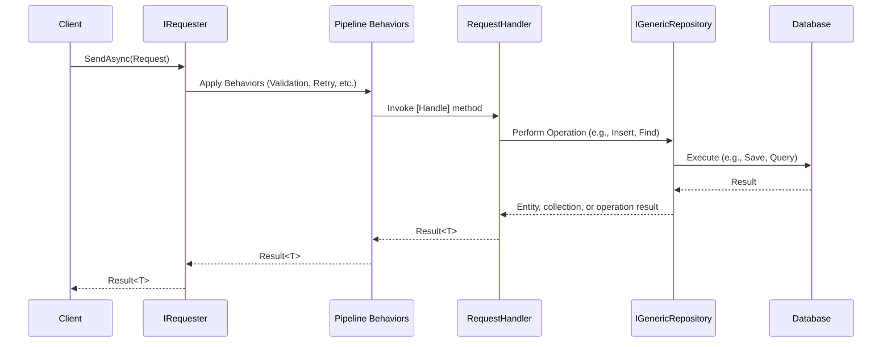

# Application Commands and Queries

> Separate application writes and reads into focused handlers with shared behaviors and clear boundaries.

[TOC]

## Overview

### Background

The [Command Query Separation](https://en.wikipedia.org/wiki/Command%E2%80%93query_separation) (CQS) principle divides operations into commands, which modify system state, and queries, which retrieve data without side effects. Commands and queries place individual application operations in focused handlers instead of one application service with every dependency. This makes each operation and its dependencies explicit and allows handlers to be tested separately.

- **Commands**: Perform state-changing actions such as creating or updating data. They typically return `Result<Unit>` for actions with no meaningful return or `Result<T>` for minimal data such as an identifier or summary model.
- **Queries**: Retrieve data without intentionally altering state. They return `Result<T>` with the requested data and should be idempotent.

In Domain-Driven Design (DDD), commands and queries act as focused application services. The
`Requester` feature dispatches requests to handlers with type-safe `Result<T>` outcomes and ordered
pipeline behaviors such as validation, retries, and timeouts. Callers depend on `IRequester` rather
than concrete handlers, while each generated handler resolves only the services declared by its
`[Handle]` method.

Many handlers also depend on the shared mapping abstraction to translate between request models, domain objects, and response DTOs; see [Common Mapping](./common-mapping.md).

For application-layer pub/sub workflows that do not fit a single request/response interaction, see [Application Events](./features-application-events.md).

## Challenges

- **Inconsistent Handling**: Ad hoc implementations lead to unpredictable behavior.
- **Mixed Concerns**: Combining state changes and data retrieval causes unintended side effects.
- **Extensibility**: Adding concerns like logging or validation requires modifying core logic.
- **Error Propagation**: Preserving error context across layers is complex.

## Solution

The `Requester` system provides:

- **Requests**: Source-generated command and query types authored as `partial` classes with `[Command]` or `[Query]`.
- **Handlers**: Business logic written inline with a single instance `[Handle]` method.
- **Dispatching**: Via `IRequester.SendAsync()`, routing requests through a pipeline of behaviors.

Behaviors such as `ValidationPipelineBehavior` and `RetryPipelineBehavior` handle concerns without altering business logic.

## Key Features

- Source-generated command and query request contracts
- Response-type inference from `Result<T>` returned by `[Handle]`
- Handler dependency injection through method parameters
- Generated FluentValidation validators from validation attributes and `[Validate]`
- Ordered request pipeline behaviors
- `Result<T>`-based success and failure handling
- Per-request retry, timeout, authorization, and transaction policies

## Architecture

The requester resolves the generated handler and registered behaviors for the concrete request type:


```mermaid
sequenceDiagram
    participant Client
    participant Requester as IRequester
    participant Pipeline as Pipeline Behaviors
    participant Handler as RequestHandler
    participant Repository as IGenericRepository
    participant Database

    Client->>Requester: SendAsync(Request)
    Requester->>Pipeline: Apply Behaviors (Validation, Retry, etc.)
    Pipeline->>Handler: Invoke [Handle] method
    Handler->>Repository: Perform Operation (e.g., Insert, Find)
    Repository->>Database: Execute (e.g., Save, Query)
    Database-->>Repository: Result
    Repository-->>Handler: Entity, collection, or operation result
    Handler-->>Pipeline: Result<T>
    Pipeline-->>Requester: Result<T>
    Requester-->>Client: Result<T>
```

## Use Cases

- Create, update, or delete an aggregate through a focused command
- Return a model or paged collection through a side-effect-free query
- Apply the same validation, retry, timeout, tracing, or transaction behavior to many handlers
- Keep endpoint and UI code independent from concrete handler types
- Test one application operation with only its declared dependencies

## Basic Usage

Register the `Requester` in the dependency injection container:

```csharp
services.AddRequester()
    .AddHandlers()
    .WithBehavior(typeof(ValidationPipelineBehavior<,>))
    .WithBehavior(typeof(RetryPipelineBehavior<,>));
```

Add the code generation package to the project that contains the commands and queries:

```xml
<PackageReference Include="BridgingIT.DevKit.Common.Utilities.CodeGen"
                  Version="x.y.z"
                  PrivateAssets="all" />
```

After defining `CustomerCreateCommand` as shown below, dispatch it and handle both outcomes:

```csharp
var result = await requester.SendAsync(
    new CustomerCreateCommand
    {
        FirstName = "Ada",
        LastName = "Lovelace",
        Email = "ada@example.test"
    },
    cancellationToken: cancellationToken);

if (result.IsFailure)
{
    Console.Error.WriteLine(string.Join(
        Environment.NewLine,
        result.Errors.Select(error => error.Message)));
    return;
}

Console.WriteLine($"Created customer {result.Value.Id}");
```

The success path prints the identifier returned by the handler, for example:

```text
Created customer 5f6b5ba2-85d5-44bb-87a7-f876a65cdb09
```

## Command and query reference

### Defining a command

Commands modify state and return `Result<Unit>` or `Result<T>`.

```csharp
[Command] // Marker attribute to indicate this is a command
public partial class CustomerCreateCommand
{
    public string FirstName { get; init; } // Properties are defined normally

    public string LastName { get; init; }

    public string Email { get; init; }

    [Handle]
    private async Task<Result<Customer>> HandleAsync(
        // DI services declared as parameters are resolved automatically
        IMapper mapper,
        IGenericRepository<Customer> repository,
        CancellationToken cancellationToken)
    {
        var customer = mapper.Map<CustomerCreateCommand, Customer>(this);
        await repository.InsertAsync(customer, cancellationToken);

        // Returning Success with a value, which will be the Result<Customer> type of the command
        return Success(customer);
    }
}
```

### Validating a command

For simple cases, place validation directly on the properties:

```csharp
[Command]
public partial class CustomerRenameCommand
{
    [ValidateNotEmptyGuid("CustomerId is required.")]
    public string CustomerId { get; init; }

    [ValidateNotEmpty("Display name is required.")]
    [ValidateLength(3, 100, "Display name must be between 3 and 100 characters.")]
    public string DisplayName { get; init; }

    [Handle]
    private Result<Unit> Handle()
    {
        return Success();
    }
}
```

For more complex rules, the `[Validate]` marker can be used:

```csharp
[Command] // Marker attribute to indicate this is a command
public partial class CustomerImportCommand
{
    [ValidateNotEmpty("At least one email address is required.")]
    [ValidateEachNotEmpty("Email entries cannot be empty.")]
    public List<string> Emails { get; init; }

    [Validate]
    private static void Validate(InlineValidator<CustomerImportCommand> validator)
    {
        validator.RuleFor(x => x.Emails) // regular fluent validation
            .Must(x => x.Count <= 100).WithMessage("A maximum of 100 email addresses is allowed.");
    }

    [Handle]
    private Result<Unit> Handle()
    {
        return Success();
    }
}
```

### Defining a query

Queries retrieve data and return `Result<T>`.

```csharp
[Query] // Marker attribute to indicate this is a query
public partial class CustomerFindOneQuery
{
    public CustomerFindOneQuery(string customerId)
    {
        this.CustomerId = customerId;
    }

    [ValidateNotEmptyGuid("CustomerId is required.")]
    public string CustomerId { get; }

    [Handle]
    private async Task<Result<Customer>> HandleAsync(
        IMapper mapper,
        IGenericRepository<Customer> repository,
        CancellationToken cancellationToken)
    {
        var customer = await repository.FindOneAsync(this.CustomerId, cancellationToken: cancellationToken);

        // Returning Success with a value, which will be the Result<Customer> type of the query
        return customer != null
            ? Success(customer)
            : Failure($"Customer with ID {this.CustomerId} was not found.");
    }
}
```

### Dispatching

Inject and use `IRequester`:

```csharp
// In a controller, service, or any class with DI
var requester = serviceProvider.GetRequiredService<IRequester>();

var command = new CustomerCreateCommand
{
    FirstName = "John",
    LastName = "Doe",
    Email = "john.doe@example.com"
};

var commandResult = await requester.SendAsync(command); // Returns Result<Customer>
if (commandResult.IsSuccess)
{
    Console.WriteLine($"Created customer: {commandResult.Value.Id}");
}
else
{
    Console.WriteLine($"Errors: {string.Join(", ", commandResult.Errors.Select(e => e.Message))}");
}

var query = new CustomerFindOneQuery("5f6b5ba2-85d5-44bb-87a7-f876a65cdb09");
var queryResult = await requester.SendAsync(query); // Returns Result<Customer>
if (queryResult.IsSuccess)
{
    Console.WriteLine($"Found customer: {queryResult.Value.FirstName}");
}
else
{
    Console.Error.WriteLine(string.Join(", ", queryResult.Errors.Select(e => e.Message)));
}
```

### Notes

- The response type is inferred from the `Result<T>` returned by `[Handle]`.
- `Success(...)` and `Failure(...)` can be used directly inside `[Handle]`.
- DI services can be declared as parameters on `[Handle]` and are resolved automatically.
- `CancellationToken` and `SendOptions` can also be declared as `[Handle]` parameters when needed.
- Handler policy attributes such as retry, timeout, authorization, and transactions can be applied at the command or query definition.

See [features-requester-notifier.md](./features-requester-notifier.md) for more details (Appendix D: Source-Generated Commands, Queries, and Events).
