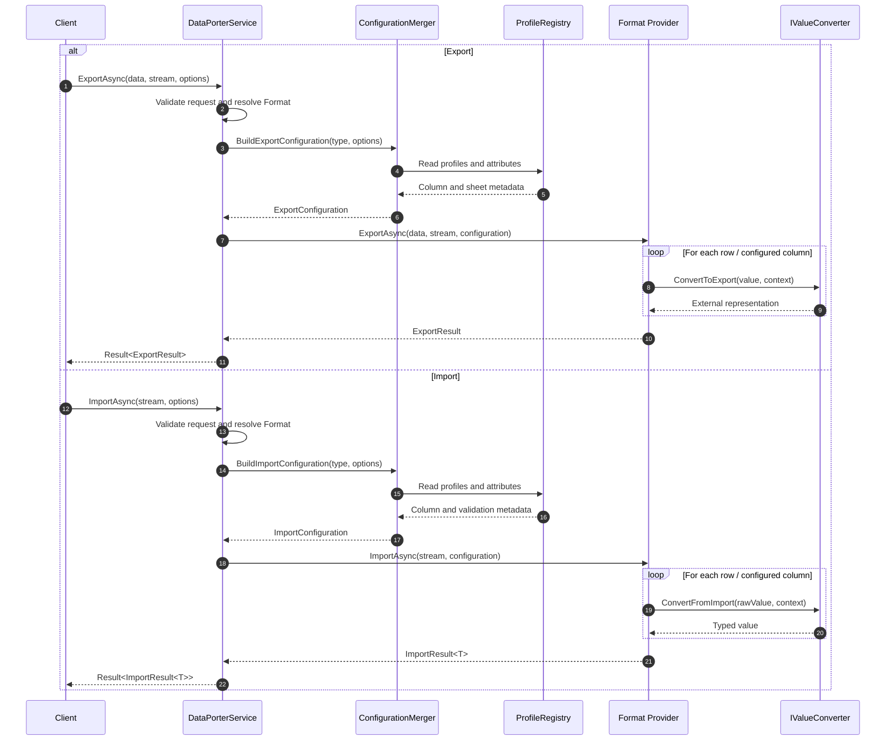

	# DataPorter

A flexible, extensible data export/import framework for .NET supporting multiple file formats with both profile-based and attribute-based configuration.

## Features

- **Multiple Format Support**: Excel (.xlsx), CSV, typed-row CSV, JSON, XML, and PDF (export only)
- **Dual Configuration Approaches**: Profile-based (similar to AutoMapper) or attribute-based
- **Streaming Support**: Memory-efficient import for large files using `IAsyncEnumerable`
- **Validation**: Built-in validation with customizable rules and error handling
- **Value Converters**: Transform values during import/export with custom converters
- **Result Pattern**: Integrated with bIT.bITdevKit Result pattern for consistent error handling
- **Conditional Styling**: Apply styles based on cell values (Excel)

## Installation

Add the package to your project:

```xml
<PackageReference Include="BridgingIT.DevKit.Application.DataPorter" />
```

## Quick Start

### Service Registration

```csharp
services.AddDataPorter(configuration)
    .WithExcel(c => c.UseTableFormatting = true)
    .WithCsv(c => c.Delimiter = ",")
    .WithCsvTyped(c => c.Delimiter = ",")
    .WithJson()
    .WithXml()
    .WithPdf();
```

### Basic Export

```csharp
public class MyService
{
    private readonly IDataExporter exporter;

    public MyService(IDataExporter exporter)
    {
        this.exporter = exporter;
    }

    public async Task ExportOrdersAsync(IEnumerable<Order> orders, Stream output)
    {
        var result = await this.exporter.ExportAsync(orders, output, new ExportOptions
        {
            Format = Format.Excel
        });

        if (result.IsSuccess)
        {
            Console.WriteLine($"Exported {result.Value.RowsExported} rows");
        }
    }
}
```

### Basic Import

```csharp
public async Task<IEnumerable<Order>> ImportOrdersAsync(Stream input)
{
    var result = await this.importer.ImportAsync<Order>(input, new ImportOptions
    {
        Format = Format.Csv
    });

    if (result.IsSuccess)
    {
        return result.Value.Data;
    }

    // Handle errors
    foreach (var error in result.Value.Errors)
    {
        Console.WriteLine($"Row {error.RowNumber}: {error.Message}");
    }

    return [];
}
```

## Configuration Approaches

### 1. Attribute-Based Configuration

Use attributes directly on your DTOs for simple scenarios:

```csharp
[DataPorterSheet("Products")]
public class ProductDto
{
    [DataPorterColumn("Product ID", Order = 0)]
    public string Id { get; set; }

    [DataPorterColumn("Name", Order = 1, Required = true)]
    public string Name { get; set; }

    [DataPorterColumn("Price", Format = "C2", HorizontalAlignment = HorizontalAlignment.Right)]
    public decimal Price { get; set; }

    [DataPorterColumn("In Stock", Order = 3)]
    public bool InStock { get; set; }

    [DataPorterIgnore]
    public string InternalCode { get; set; }
}
```

**Available Attributes:**

| Attribute | Target | Description |
|-----------|--------|-------------|
| `[DataPorterSheet]` | Class | Sets the sheet/section name |
| `[DataPorterColumn]` | Property | Configures column settings |
| `[DataPorterIgnore]` | Property | Excludes property from export/import |
| `[DataPorterConverter]` | Property | Specifies a custom value converter |
| `[DataPorterValidation]` | Property | Adds validation rules |

### 2. Profile-Based Configuration

Use profiles for complex scenarios with full control:

#### Export Profile

```csharp
public class OrderExportProfile : ExportProfileBase<Order>
{
    protected override void Configure()
    {
        ToSheet("Orders");

        ForColumn(o => o.Id)
            .HasName("Order ID")
            .HasOrder(0);

        ForColumn(o => o.CustomerName)
            .HasName("Customer")
            .HasOrder(1)
            .HasWidth(30);

        ForColumn(o => o.TotalAmount)
            .HasName("Total")
            .HasFormat("C2")
            .Align(HorizontalAlignment.Right)
            .StyleWhen(amount => amount > 1000, style => style
                .Bold()
                .WithBackgroundColor("#FFFF00"));

        ForColumn(o => o.OrderDate)
            .HasName("Date")
            .HasFormat("yyyy-MM-dd");

        ForColumn(o => o.IsShipped)
            .HasName("Shipped")
            .UseConverter(new BooleanYesNoConverter());

        Ignore(o => o.InternalNotes);

        AddHeader("Order Report");
        AddFooter(orders => $"Total Orders: {orders.Count()}");
    }
}
```

#### Import Profile

```csharp
public class OrderImportProfile : ImportProfileBase<Order>
{
    protected override void Configure()
    {
        FromSheet("Orders");
        HeaderRow(0);
        SkipDataRows(0);
        OnValidationFailure(ImportValidationBehavior.CollectErrors);

        ForColumn(o => o.Id)
            .FromHeader("Order ID")
            .IsRequired("Order ID is required");

        ForColumn(o => o.CustomerName)
            .FromHeader("Customer")
            .IsRequired()
            .Validate(name => name.Length <= 100, "Customer name too long");

        ForColumn(o => o.TotalAmount)
            .FromHeader("Total")
            .ParseWith(value => decimal.Parse(value, NumberStyles.Currency));

        ForColumn(o => o.OrderDate)
            .FromHeader("Date")
            .HasFormat("yyyy-MM-dd");

        Ignore(o => o.InternalNotes);

        UseFactory(() => new Order { CreatedAt = DateTime.UtcNow });
    }
}
```

### Registering Profiles

```csharp
services.AddDataPorter(configuration)
    .AddExportProfile<OrderExportProfile>()
    .AddImportProfile<OrderImportProfile>()
    // Or scan an assembly
    .AddProfilesFromAssembly<OrderExportProfile>();
```

## Format Providers

### Excel Provider

Uses ClosedXML for Excel file handling.

```csharp
services.AddDataPorter()
    .WithExcel(config =>
    {
        config.UseTableFormatting = true;
        config.DefaultTableStyleName = "TableStyleMedium2";
        config.AutoFitColumns = true;
        config.FreezeHeaderRow = true;
        config.DefaultFontName = "Calibri";
        config.DefaultFontSize = 11;
        config.MaxColumnWidth = 100;
    });
```

### Typed-Row CSV Provider

Uses CsvHelper with a typed-rows schema for hierarchical object graphs in a single CSV file.

```csharp
services.AddDataPorter()
    .WithCsvTyped(config =>
    {
        config.Delimiter = ",";
        config.Encoding = Encoding.UTF8;
        config.Culture = CultureInfo.InvariantCulture;
        config.TrimFields = true;
    });
```

**What the typed-rows pattern is:**
- one CSV row represents exactly one logical node in the object graph
- root entities, nested objects, and collection items each get their own row
- `RecordType` identifies what kind of node the row represents
- `RootId`, `RecordId`, and `ParentId` make the hierarchy explicit and round-trip friendly

This is preferable to flattening unbounded collections into `Item1`, `Item2`, `Item3` columns because the schema stays stable when collection sizes change. It is also preferable to embedding JSON in a cell because the file remains plain CSV, tabular, and easy to inspect with standard tools.

**Base columns:**
- `RecordType` - logical node kind such as `Person`, `Address`, `BillingAddress`, `PreviousAddress`
- `RootId` - identifier of the root aggregate row
- `RecordId` - identifier of the current row/node
- `ParentId` - identifier of the direct parent row/node
- `Collection` - relationship name for child rows when applicable
- `Index` - collection order for repeated child items

**Mapping rules for export:**
- the root `PersonEntity` is emitted as `RecordType = Person`
- the nested `Address` is emitted as a child row with `RecordType = Address`, `ParentId = <person id>`, `Collection = Address`
- the nested `BillingAddress` value object is emitted as a child row with `RecordType = BillingAddress`, `ParentId = <person id>`, `Collection = BillingAddress`
- each `PreviousAddresses` item is emitted as its own child row with `RecordType = PreviousAddress`, `ParentId = <person id>`, `Collection = PreviousAddresses`, and `Index = 0..n`
- value objects without their own persisted identifier should use a deterministic synthetic `RecordId`, for example `<RootId>:BillingAddress`

**Parsing and rehydration rules for import:**
- read all rows into a typed-row model first
- group rows by `RootId`
- materialize the root row first
- attach direct child rows by matching `ParentId`
- rebuild collections by grouping child rows by `Collection` and ordering by `Index`
- use invariant parsing for `Guid`, enum, integer, and nullable values

**Typed CSV example:**

```csv
RecordType,RootId,RecordId,ParentId,Collection,Index,FirstName,LastName,Age,ManagerId,Status,AddressName,Street,PostalCode,City,Country
Person,person-1,person-1,,,,Ada,Lovelace,36,manager-1,Active,,,,,
Address,person-1,address-1,person-1,Address,,,,,,,,Analytical Engine Way 1,,London,
BillingAddress,person-1,person-1:BillingAddress,person-1,BillingAddress,,,,,,,Ada Lovelace,Analytical Engine Way 1,A1 100,London,UK
PreviousAddress,person-1,prev-1,person-1,PreviousAddresses,0,,,,,,,,Byron Avenue 5,,London,
PreviousAddress,person-1,prev-2,person-1,PreviousAddresses,1,,,,,,,,Countess Road 9,,Oxford,
Person,person-2,person-2,,,,Grace,Hopper,85,,Inactive,,,,,
Address,person-2,address-2,person-2,Address,,,,,,,,Compiler Street 42,,Arlington,
BillingAddress,person-2,person-2:BillingAddress,person-2,BillingAddress,,,,,,,Grace Hopper,Compiler Street 42,C0 200,Arlington,US
PreviousAddress,person-2,prev-3,person-2,PreviousAddresses,0,,,,,,,,Cobol Lane 1,,New York,
```

**Features:**
- Table formatting with styles
- Auto-fit columns
- Freeze header row
- Conditional formatting
- Multi-sheet export/import

### CSV Provider

Uses CsvHelper for CSV file handling.

```csharp
services.AddDataPorter()
    .WithCsv(config =>
    {
        config.Delimiter = ",";
        config.Encoding = Encoding.UTF8;
        config.Culture = CultureInfo.InvariantCulture;
        config.TrimFields = true;
        config.UseNesting = true;
    });
```

**Features:**
- Standard flat CSV export/import
- Optional flattened nesting for structured properties
- Optional row expansion for a single nested collection
- Converter-based scalar representations for value objects or custom external formats

When `UseNesting` is enabled, the CSV provider can flatten nested object properties into regular CSV columns.
Flattened column names use underscore-separated segments, for example:

- `Address_Street`
- `Address_City`
- `PreviousAddresses_Street`
- `PreviousAddresses_City`

Single nested child objects are flattened into additional columns on the same row. A single child collection of objects is exported using repeated parent rows, with the parent values duplicated and the child item values written into the flattened collection columns.

Example export shape for a nested object:

```csv
Id,FirstName,LastName,Address_Street,Address_City,Status
1,Ada,Lovelace,Analytical Engine Way 1,London,Active
2,Grace,Hopper,Compiler Street 42,Arlington,Inactive
```

Example export shape for a nested collection:

```csv
Id,FirstName,LastName,Address_Street,Address_City,PreviousAddresses_Street,PreviousAddresses_City,Status
1,Ada,Lovelace,Analytical Engine Way 1,London,Byron Avenue 5,London,Active
1,Ada,Lovelace,Analytical Engine Way 1,London,Countess Road 9,Oxford,Active
2,Grace,Hopper,Compiler Street 42,Arlington,Cobol Lane 1,New York,Inactive
```

During import, repeated rows are grouped back into a single aggregate and the nested collection is hydrated again.

When `UseNesting` is disabled, nested structured properties without explicit converters are ignored for CSV export/import. This is useful when only scalar columns should participate.

### JSON Provider

Uses System.Text.Json for JSON handling.

```csharp
services.AddDataPorter()
    .WithJson(config =>
    {
        config.WriteIndented = true;
        config.PropertyNamingPolicy = JsonNamingPolicy.CamelCase;
        config.IgnoreNullValues = false;
    });
```

### XML Provider

Uses System.Xml for XML handling.

```csharp
services.AddDataPorter()
    .WithXml(config =>
    {
        config.RootElementName = "Data";
        config.ItemElementName = "Item";
        config.UseAttributes = false;
        config.WriteIndented = true;
        config.DateFormat = "yyyy-MM-dd";
    });
```

### PDF Provider (Export Only)

Uses PDFsharp-MigraDoc for PDF generation (MIT licensed).

```csharp
services.AddDataPorter()
    .WithPdf(config =>
    {
        config.PageSize = PdfPageSize.A4;
        config.Orientation = PdfPageOrientation.Landscape;
        config.Margin = 50;
        config.Title = "Report";
        config.HeaderText = "My Report";
        config.FooterText = "Confidential";
        config.ShowPageNumbers = true;
        config.ShowGenerationDate = true;
        config.FontFamily = "Helvetica";
        config.HeaderFontSize = 10;
        config.BodyFontSize = 9;
        config.TableHeaderBackgroundColor = "#4472C4";
        config.TableHeaderTextColor = "#FFFFFF";
        config.UseAlternatingRowColors = true;
        config.AlternateRowBackgroundColor = "#F2F2F2";
        config.UseNesting = true;
    });
```

When `UseNesting` is enabled, the PDF provider renders nested structured values into table cells using a readable textual representation. Child objects and collections are traversed recursively and formatted inline. Recursive back references are ignored during rendering so cyclical object graphs cannot cause endless export generation.

When `UseNesting` is disabled, nested structured properties without explicit converters are omitted from the PDF table output.

## Advanced Features

### Streaming Import

For large files, use async enumerables to avoid loading every result into memory:

```csharp
await foreach (var result in importer.ImportAsyncEnumerable<Order>(stream, options))
{
    if (result.IsSuccess)
    {
        await ProcessOrderAsync(result.Value);
    }
    else
    {
        LogError(result.Errors.First().Message);
    }
}
```

### Validation Without Import

Validate data without actually importing:

```csharp
var validationResult = await importer.ValidateAsync<Order>(stream, options);

if (validationResult.IsSuccess && validationResult.Value.IsValid)
{
    Console.WriteLine($"All {validationResult.Value.TotalRows} rows are valid");
}
else
{
    foreach (var error in validationResult.Value.Errors)
    {
        Console.WriteLine($"Row {error.RowNumber}, Column {error.Column}: {error.Message}");
    }
}
```

### Multi-Sheet Export

Export multiple data sets to different sheets (Excel) or sections (JSON/XML):

```csharp
var dataSets = new[]
{
    ExportDataSet.Create(orders, "Orders"),
    ExportDataSet.Create(products, "Products"),
    ExportDataSet.Create(customers, "Customers")
};

await exporter.ExportAsync(dataSets, stream, new ExportOptions
{
    Format = Format.Excel
});
```

### Custom Value Converters

Create custom converters for complex transformations:

```csharp
public class StatusConverter : IValueConverter<OrderStatus>
{
    public object ConvertToExport(OrderStatus value, ValueConversionContext context)
    {
        return value switch
        {
            OrderStatus.Pending => "Pending",
            OrderStatus.Processing => "In Progress",
            OrderStatus.Shipped => "Shipped",
            OrderStatus.Delivered => "Delivered",
            _ => "Unknown"
        };
    }

    public OrderStatus ConvertFromImport(object value, ValueConversionContext context)
    {
        var str = value?.ToString();
        return str switch
        {
            "Pending" => OrderStatus.Pending,
            "In Progress" => OrderStatus.Processing,
            "Shipped" => OrderStatus.Shipped,
            "Delivered" => OrderStatus.Delivered,
            _ => OrderStatus.Pending
        };
    }
}
```

Use in a profile:

```csharp
ForColumn(o => o.Status)
    .UseConverter(new StatusConverter());
```

Converters are responsible for translating a single property value between the domain model and the external representation used in CSV, Excel, PDF, or other providers.

- `ConvertToExport(...)` transforms the in-memory property value into the value written to the output.
- `ConvertFromImport(...)` transforms the incoming raw value into the property type used by the entity or DTO.
- `ValueConversionContext` provides additional metadata such as the property name, property type, owning entity type, `Format`, `Culture`, and optional `Parameters` so converters can stay reusable and profile-driven.

This is useful when the exported shape differs from the .NET type, for example:

- booleans as `"Yes"` / `"No"`
- enums as display names or external codes
- smart enumerations by identifier or value
- dates and times in culture-specific or ISO formats
- decimals using localized number separators
- strings that need trimming, normalization, or external value mapping

Converters can be configured per column, which allows different representations for the same .NET type in different import/export profiles.

### Built-in Converters

| Converter | Description |
|-----------|-------------|
| `BooleanYesNoConverter` | Converts `bool` values to and from configurable `"Yes"` / `"No"` strings |
| `DateOnlyFormatConverter` | Converts `DateOnly` values using custom culture-aware or ISO 8601 date formats |
| `DateTimeFormatConverter` | Converts `DateTime` values using custom culture-aware or ISO 8601 formats with optional UTC conversion |
| `DateTimeOffsetFormatConverter` | Converts `DateTimeOffset` values using custom culture-aware or ISO 8601 formats with optional UTC conversion |
| `DecimalFormatConverter` | Converts `decimal` values using configurable format strings, cultures, invariant culture, and number styles |
| `EnumDisplayNameConverter<T>` | Converts enums using their `[Display]` attribute names |
| `EnumerationConverter<T...>` | Converts smart enumerations (`Enumeration`, `Enumeration<TValue>`, `Enumeration<TId, TValue>`) using their `Id` or `Value` |
| `EnumValueConverter<T>` | Converts enums using enum names or underlying numeric values |
| `GuidFormatConverter` | Converts `Guid` values using standard GUID format specifiers such as `D` or `N` |
| `StringMapConverter<T>` | Maps external string values to typed values and back using configurable import/export mappings |
| `StringTrimConverter` | Trims and normalizes string values during import and export |
| `TimeOnlyFormatConverter` | Converts `TimeOnly` values using custom culture-aware or ISO 8601 time formats |

Example using format and culture-aware converters in a profile:

```csharp
ForColumn(o => o.OrderDate)
    .UseConverter(new DateTimeFormatConverter
    {
        Format = "dd.MM.yyyy HH:mm:ss",
        Culture = new CultureInfo("de-DE")
    });

ForColumn(o => o.TotalAmount)
    .UseConverter(new DecimalFormatConverter
    {
        Format = "N2",
        Culture = new CultureInfo("de-DE")
    });
```

Example using mapping-based converters for external codes:

```csharp
ForColumn(o => o.Status)
    .UseConverter(new StringMapConverter<OrderStatus>
    {
        ImportMappings = new Dictionary<string, OrderStatus>
        {
            ["P"] = OrderStatus.Pending,
            ["S"] = OrderStatus.Shipped
        },
        ExportMappings = new Dictionary<OrderStatus, string>
        {
            [OrderStatus.Pending] = "P",
            [OrderStatus.Shipped] = "S"
        }
    });
```

### Validation Behaviors

Control how validation errors are handled during import:

```csharp
public enum ImportValidationBehavior
{
    CollectErrors,  // Continue import, collect all errors
    SkipRow,        // Skip invalid rows, continue with valid ones
    StopImport      // Stop on first error
}
```

### Conditional Styling (Excel)

Apply styles based on values in Excel exports:

```csharp
ForColumn(o => o.Amount)
    .StyleWhen(
        amount => amount < 0,
        style => style
            .WithForegroundColor("#FF0000")
            .Bold())
    .StyleWhen(
        amount => amount > 10000,
        style => style
            .WithBackgroundColor("#00FF00"));
```

## Error Handling

The framework uses the Result pattern for consistent error handling:

```csharp
var result = await exporter.ExportAsync(data, stream, options);

if (result.IsFailure)
{
    foreach (var error in result.Errors)
    {
        if (error is FormatNotSupportedError)
        {
            Console.WriteLine("Format not supported");
        }
        else if (error is ExportError exportError)
        {
            Console.WriteLine($"Export failed: {exportError.Message}");
        }
    }
}
```

## Configuration via appsettings.json

Providers can be configured via configuration:

```json
{
  "DataPorter": {
    "Excel": {
      "UseTableFormatting": true,
      "AutoFitColumns": true
    },
    "Csv": {
      "Delimiter": ";",
      "TrimFields": true
    },
    "Pdf": {
      "PageSize": "A4",
      "Orientation": "Landscape"
    }
  }
}
```

```csharp
services.AddDataPorter(configuration)
    .WithExcel()  // Reads from DataPorter:Excel
    .WithCsv()    // Reads from DataPorter:Csv
    .WithPdf();   // Reads from DataPorter:Pdf
```

## Architecture

`Application.DataPorter` is built around a small orchestration core with pluggable format providers and column-level transformation/configuration.

At the center is `DataPorterService`, which implements both `IDataExporter` and `IDataImporter`. It does not know how to read or write CSV, Excel, JSON, XML, or PDF itself. Instead, it coordinates the workflow:

1. validate the request and selected `Format`
2. resolve the matching provider from the registered `IDataPorterProvider` implementations
3. build the effective import or export configuration for the requested type
4. delegate the actual read/write work to the selected provider
5. wrap the outcome in `Result`, `ExportResult`, `ImportResult<T>`, or `ValidationResult`

This separation keeps the public API stable while allowing each file format to have its own optimized implementation.

### Core building blocks

- **Service layer**
  - `DataPorterService` is the façade used by application code.
  - It selects providers by `Format`, applies logging, timing, cancellation, and error handling.

- **Provider model**
  - `IDataPorterProvider` describes provider capabilities such as supported format, file extensions, import/export support, and streaming support.
  - `IDataExportProvider` and `IDataImportProvider` add the actual export/import operations.
  - Concrete providers such as CSV, Excel, JSON, XML, and PDF encapsulate all format-specific logic.

- **Configuration model**
  - `ExportOptions` and `ImportOptions` define runtime choices like format, culture, sheet selection, validation behavior, and whether attributes should be used.
  - `ExportConfiguration` and `ImportConfiguration` represent the fully merged configuration that providers consume.
  - `ConfigurationMerger` combines configuration sources with this precedence: **Profile > Attributes > Options > Defaults**.

- **Metadata sources**
  - **Profiles** (`IExportProfile`, `IImportProfile`) provide explicit, code-based configuration for columns, formats, headers, sheet names, validation, and converters.
  - **Attributes** (`DataPorterSheet`, `DataPorterColumn`, `DataPorterConverter`, `DataPorterValidation`, `DataPorterIgnore`) provide declarative configuration directly on types and properties.
  - `ProfileRegistry` stores registered profiles.
  - `AttributeConfigurationReader` scans types and builds configuration from attributes.

- **Converter pipeline**
  - `IValueConverter` and `IValueConverter<T>` allow per-column transformation between domain values and external representations.
  - Providers call converters while reading or writing individual column values.
  - `ValueConversionContext` passes property metadata plus optional `Format`, `Culture`, and additional parameters into the converter.
  - This makes converters reusable across formats because the provider handles transport concerns while the converter handles value semantics.

- **Validation pipeline**
  - During import, column validators can be created from attributes or profiles.
  - Validation behavior is controlled through `ImportValidationBehavior`, allowing callers to collect errors, skip invalid rows, or stop the import.

### Provider responsibilities

Providers are intentionally responsible only for format-specific concerns, for example:

- **CSV provider**: delimiter handling, text encoding, row-by-row streaming, header writing/reading
- **Excel provider**: worksheets, styling, widths, header/footer rows, conditional formatting
- **JSON/XML providers**: document serialization shape and structured parsing
- **PDF provider**: tabular rendering and document layout for export-only scenarios

Because the configuration and converter pipeline are shared, the same domain type can be exported to multiple formats with consistent column naming, formatting, validation, and transformation rules.

### Runtime flow

Typical export flow:

```text
Application code
  -> DataPorterService
  -> ConfigurationMerger
  -> matching export provider
  -> per-column value access + converter execution
  -> format-specific writer
```

Typical import flow:

```text
Input stream
  -> DataPorterService
  -> ConfigurationMerger
  -> matching import provider
  -> raw field extraction
  -> converter execution
  -> validation
  -> object materialization
```

Mermaid sequence diagram:



The result is an architecture where:

- **formats are pluggable**
- **configuration is composable**
- **value transformation is isolated in converters**
- **domain models stay independent from file-format details**
- **import and export share the same conceptual model**

## Dependencies

| Package | Version | Purpose |
|---------|---------|---------|
| ClosedXML | Latest | Excel file handling |
| CsvHelper | Latest | CSV file handling |
| PDFsharp-MigraDoc | 6.2.0 | PDF generation (MIT licensed) |
| System.Text.Json | Built-in | JSON handling |
| System.Xml.Linq | Built-in | XML handling |