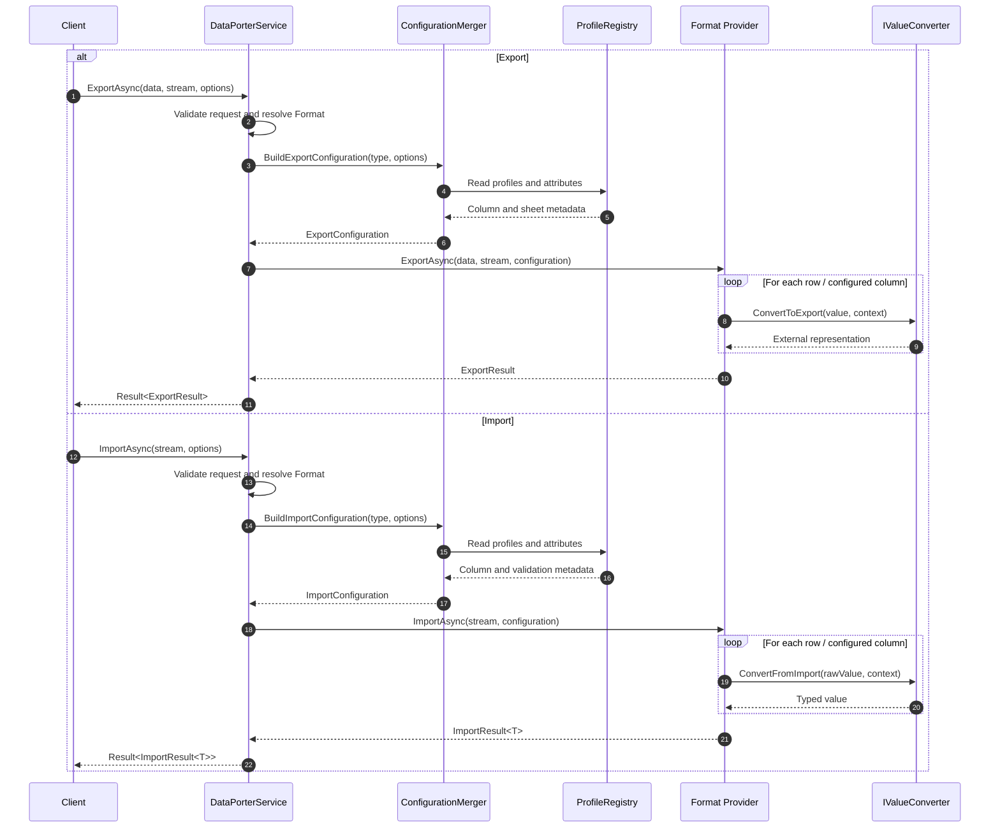

# DataPorter Feature Documentation

[TOC]

## Overview

A flexible, extensible data export/import framework for .NET supporting multiple file formats with both profile-based and attribute-based configuration.

## Features

- **Multiple Format Support**: Excel (.xlsx), CSV, typed-row CSV, JSON, XML, and PDF (export only)
- **Extensible Format Selection**: Built-in formats plus custom project-defined providers
- **Dual Configuration Approaches**: Profile-based (similar to AutoMapper) or attribute-based
- **Streaming Support**: Incremental import and export using `IAsyncEnumerable`
- **Validation**: Built-in validation with customizable rules and error handling
- **Value Converters**: Transform values during import/export with custom converters
- **Result Pattern**: Integrated with bIT.bITdevKit Result pattern for consistent error handling
- **Conditional Styling**: Apply styles based on cell values (Excel)

## Quick Start

### Service Registration

```csharp
services.AddDataPorter(configuration)
    .WithExcel(c => c.UseTableFormatting = true)
    .WithCsv(c => c.Delimiter = ",")
    .WithCsvTyped(c => c.Delimiter = ",")
    .WithJson()
    .WithXml()
    .WithPdf();
```

Custom providers can be registered through the same builder:

```csharp
services.AddDataPorter(configuration)
    .WithCsv()
    .AddProvider<EdiX12DataPorterProvider>();
```

For import and export calls, DataPorter supports both the regular options objects and a fluent builder lambda. The examples below prefer the fluent builder syntax.

### Basic Export

```csharp
public class MyService
{
    private readonly IDataExporter exporter;

    public MyService(IDataExporter exporter)
    {
        this.exporter = exporter;
    }

    public async Task ExportOrdersAsync(IEnumerable<Order> orders, Stream output)
    {
        var result = await this.exporter.ExportAsync(
            orders,
            output,
            o => o.AsExcel()
                .WithProgress(report =>
                {
                    Console.WriteLine($"Exported {report.ProcessedRows} rows");
                }));

        if (result.IsSuccess)
        {
            Console.WriteLine($"Exported {result.Value.TotalRows} rows");
        }
    }
}
```

### Basic Import

```csharp
public async Task<IEnumerable<Order>> ImportOrdersAsync(Stream input)
{
    var result = await this.importer.ImportAsync<Order>(
        input,
        o => o.AsCsv()
            .WithCulture(new CultureInfo("de-DE"))
            .WithProgress(report =>
            {
                Console.WriteLine($"Processed {report.ProcessedRows} rows");
            }));

    if (result.IsSuccess && !result.Value.HasErrors)
    {
        return result.Value.Data;
    }

    if (result.IsSuccess)
    {
        foreach (var error in result.Value.Errors)
        {
            Console.WriteLine($"Row {error.RowNumber}: {error.Message}");
        }
    }

    return [];
}
```

### Progress Reporting

`ExportOptions` and `ImportOptions` support optional runtime progress reporting through `IProgress<TReport>`.

- Export uses `IProgress<ExportProgressReport>`
- Import uses `IProgress<ImportProgressReport>`
- Progress is reported when the operation starts, every 25 processed rows, and when the operation completes successfully

```csharp
await exporter.ExportAsync(
    orders,
    output,
    o => o.AsJson()
        .WithProgress(report =>
        {
            Console.WriteLine(
                $"Rows={report.ProcessedRows}, Bytes={report.BytesWritten}, Percent={report.PercentageComplete}");
        }));

await importer.ImportAsync<Order>(
    input,
    o => o.AsCsv()
        .WithProgress(report =>
        {
            Console.WriteLine(
                $"Processed={report.ProcessedRows}, Success={report.SuccessfulRows}, Errors={report.ErrorCount}");
        }));
```

For true streaming operations, `TotalRows` and `PercentageComplete` can remain `null` until the final completion report because the total row count is not always known up front.

### Compression And Packaging

`ExportOptions` and `ImportOptions` support explicit payload compression or packaging through `PayloadCompressionOptions`.

- `PayloadCompressionKind.GZip` produces or consumes a compressed single payload stream such as `orders.csv.gz`
- `PayloadCompressionKind.Zip` produces or consumes a single-entry ZIP archive such as `orders.zip`
- `Format` still describes the inner payload format such as CSV, JSON, or XML

```csharp
var exportResult = await exporter.ExportAsync(
    orders,
    output,
    o => o.AsCsv().WithGZipCompression(),
    cancellationToken);

var importResult = await importer.ImportAsync<Order>(
    input,
    o => o.AsCsv().WithZipCompression("orders.csv"),
    cancellationToken);
```

For ZIP packaging, DataPorter currently supports one payload entry per archive.

HTTP transport compression is a separate concern:

- for normal HTTP APIs, use response/request compression middleware with `Content-Encoding: gzip`
- in that mode, DataPorter still reads and writes the plain CSV/JSON/XML stream
- use DataPorter compression only when the artifact itself should be downloadable or uploadable as `.gz` or `.zip`

### Row Interceptors

`ExportOptions` and `ImportOptions` can flow through typed row interceptors that are resolved from dependency injection.

- Register one or more `IExportRowInterceptor<T>` implementations to enrich, audit, skip, or abort exported rows.
- Register one or more `IImportRowInterceptor<T>` implementations to enrich, audit, skip, or abort imported rows after mapping produced a typed item.
- Interceptors are executed in registration order.
- Closed generic interceptors are type-specific. For example, `IExportRowInterceptor<Order>` only runs for `Order` exports, not for `Person` exports.
- A skip is tracked as a warning and increments `SkippedRows`.
- An abort returns `ExportInterceptionAbortedError` or `ImportInterceptionAbortedError`.
- Skip and abort decisions are logged as warnings by the interceptor executor pipeline.

```csharp
services.AddDataPorter()
    .AddRowInterceptor<OrderAuditInterceptor>()
    .AddExportRowInterceptor<SkipCancelledOrdersInterceptor>()
    .AddImportRowInterceptor<NormalizeCustomerNameInterceptor>();

public sealed class SkipCancelledOrdersInterceptor : IExportRowInterceptor<Order>
{
    public Task<RowInterceptionDecision> BeforeExportAsync(
        ExportRowContext<Order> context,
        CancellationToken cancellationToken = default)
    {
        if (context.Item.Status == OrderStatus.Cancelled)
        {
            return Task.FromResult(RowInterceptionDecision.Skip("Cancelled orders are not exported."));
        }

        context.Item.ExportTimestamp = DateTimeOffset.UtcNow;
        return Task.FromResult(RowInterceptionDecision.Continue());
    }
}

public sealed class NormalizeCustomerNameInterceptor : IImportRowInterceptor<Order>
{
    public Task<RowInterceptionDecision> BeforeImportAsync(
        ImportRowContext<Order> context,
        CancellationToken cancellationToken = default)
    {
        context.Item.CustomerName = context.Item.CustomerName?.Trim();

        if (string.IsNullOrWhiteSpace(context.Item.CustomerName))
        {
            return Task.FromResult(RowInterceptionDecision.Skip("CustomerName is empty after normalization."));
        }

        return Task.FromResult(RowInterceptionDecision.Continue());
    }
}
```

### Custom Formats

DataPorter format selection is not limited to the built-in CSV, CsvTyped, Excel, JSON, XML, and PDF providers. Projects can add their own import/export providers for domain-specific formats without changing the DataPorter pipeline.

- `Format` is an extensible identifier type rather than a closed enum.
- Built-in providers expose static values such as `Format.Csv` and `Format.Json`.
- Custom providers can return their own format identifiers such as `new Format("edi-x12")`.
- Provider selection stays explicit through `ExportOptions.Format` and `ImportOptions.Format`.

```csharp
public static class MyFormats
{
    public static readonly Format EdiX12 = new("edi-x12");
}

public sealed class EdiX12DataPorterProvider : IDataExportProvider, IDataImportProvider
{
    public Format Format => MyFormats.EdiX12;

    public IReadOnlyCollection<string> SupportedExtensions => [".edi"];

    public bool SupportsImport => true;

    public bool SupportsExport => true;

    public bool SupportsStreaming => false;

    // Implement IDataExportProvider / IDataImportProvider members
}
```

Register the provider and select it explicitly per operation:

```csharp
services.AddDataPorter()
    .AddProvider<EdiX12DataPorterProvider>();

var exportResult = await exporter.ExportAsync(
    orders,
    output,
    o => o.As(MyFormats.EdiX12));
```

When ZIP packaging is enabled, DataPorter derives the default payload entry name from the selected provider's first supported extension. A custom provider with `[".edi"]` therefore produces `export.edi` inside the archive unless `ZipEntryName` is set explicitly.

A very common import scenario is to process and store rows directly while they are being imported. `IImportRowInterceptor<T>` can be used for that too:

```csharp
services.AddDataPorter()
    .AddImportRowInterceptor<StoreOrderImportInterceptor>();

public sealed class StoreOrderImportInterceptor(IOrderRepository repository) : IImportRowInterceptor<Order>
{
    public async Task<RowInterceptionDecision> BeforeImportAsync(
        ImportRowContext<Order> context,
        CancellationToken cancellationToken = default)
    {
        await repository.UpsertAsync(context.Item, cancellationToken);
        return RowInterceptionDecision.Continue();
    }
}
```

This pattern works especially well with `ImportAsyncEnumerable(...)` for large uploads:

- DataPorter parses and maps one row into a typed item
- the interceptor can persist that item immediately
- the import continues with the next row without requiring the whole file to be held in memory

If database persistence fails for a row, the interceptor can either return `Skip(...)` or `Abort(...)`, depending on whether the import should continue or stop.

Both `ExportResult` and `ImportResult<T>` expose `SkippedRows` and `Warnings`, and the progress reports also include the current skipped-row count.

### Import Options

`ImportOptions` controls runtime parsing behavior for a specific import request:

- `ImportOptions.Culture` is used by the default import conversion pipeline, not only by custom converters.
- This means localized numbers and dates such as `1,23` or `31.12.2026` can be parsed without a custom `ParseWith(...)` handler when the target type is compatible.
- `HeaderRowIndex` selects the actual header row for providers that support row-oriented tabular imports such as CSV and Excel.
- `SkipRows` skips rows after the configured header row, not before it.

```csharp
var result = await importer.ImportAsync<Order>(
    input,
    o => o.AsCsv()
        .WithCulture(new CultureInfo("de-DE"))
        .WithHeaderRowIndex(1) // row 0 contains a title/preamble
        .WithSkipRows(0));
```

Example CSV with a preamble row:

```text
Order export generated on 2026-03-17
Order ID;Customer;Total
ORD-1001;Ada;1,23
```

In this example, `HeaderRowIndex = 1` tells the importer to use the second line as the header row, and `Culture = new CultureInfo("de-DE")` allows the default decimal parser to read `1,23` correctly.

## Configuration Approaches

### 1. Attribute-Based Configuration

Use attributes directly on your DTOs for simple scenarios:

```csharp
[DataPorterSheet("Products")]
public class ProductDto
{
    [DataPorterColumn("Product ID", Order = 0)]
    public string Id { get; set; }

    [DataPorterColumn("Name", Order = 1, Required = true)]
    public string Name { get; set; }

    [DataPorterColumn("Price", Format = "C2", HorizontalAlignment = HorizontalAlignment.Right)]
    public decimal Price { get; set; }

    [DataPorterColumn("In Stock", Order = 3)]
    public bool InStock { get; set; }

    [DataPorterIgnore]
    public string InternalCode { get; set; }
}
```

**Available Attributes:**

| Attribute                | Target   | Description                          |
| ------------------------ | -------- | ------------------------------------ |
| `[DataPorterSheet]`      | Class    | Sets the sheet/section name          |
| `[DataPorterColumn]`     | Property | Configures column settings           |
| `[DataPorterIgnore]`     | Property | Excludes property from export/import |
| `[DataPorterConverter]`  | Property | Specifies a custom value converter   |
| `[DataPorterValidation]` | Property | Adds validation rules                |

### 2. Profile-Based Configuration

Use profiles for complex scenarios with full control:

#### Export Profile

```csharp
public class OrderExportProfile : ExportProfileBase<Order>
{
    protected override void Configure()
    {
        ToSheet("Orders");

        ForColumn(o => o.Id)
            .HasName("Order ID")
            .HasOrder(0);

        ForColumn(o => o.CustomerName)
            .HasName("Customer")
            .HasOrder(1)
            .HasWidth(30);

        ForColumn(o => o.TotalAmount)
            .HasName("Total")
            .HasFormat("C2")
            .Align(HorizontalAlignment.Right)
            .StyleWhen(amount => amount > 1000, style => style
                .Bold()
                .WithBackgroundColor("#FFFF00"));

        ForColumn(o => o.OrderDate)
            .HasName("Date")
            .HasFormat("yyyy-MM-dd");

        ForColumn(o => o.IsShipped)
            .HasName("Shipped")
            .UseConverter(new BooleanYesNoConverter());

        Ignore(o => o.InternalNotes);

        AddHeader("Order Report");
        AddFooter(orders => $"Total Orders: {orders.Count()}");
    }
}
```

#### Import Profile

```csharp
public class OrderImportProfile : ImportProfileBase<Order>
{
    protected override void Configure()
    {
        FromSheet("Orders");
        HeaderRow(0);
        SkipDataRows(0);
        OnValidationFailure(ImportValidationBehavior.CollectErrors);

        ForColumn(o => o.Id)
            .FromHeader("Order ID")
            .IsRequired("Order ID is required");

        ForColumn(o => o.CustomerName)
            .FromHeader("Customer")
            .IsRequired()
            .Validate(name => name.Length <= 100, "Customer name too long");

        ForColumn(o => o.TotalAmount)
            .FromHeader("Total")
            .ParseWith(value => decimal.Parse(value, NumberStyles.Currency));

        ForColumn(o => o.OrderDate)
            .FromHeader("Date")
            .HasFormat("yyyy-MM-dd");

        Ignore(o => o.InternalNotes);

        UseFactory(() => new Order { CreatedAt = DateTime.UtcNow });
    }
}
```

### Registering Profiles

```csharp
services.AddDataPorter(configuration)
    .AddExportProfile<OrderExportProfile>()
    .AddImportProfile<OrderImportProfile>()
    // Or scan an assembly
    .AddProfilesFromAssembly<OrderExportProfile>();
```

## Format Providers

### Excel Provider

Uses [ClosedXML](https://github.com/ClosedXML/ClosedXML) for Excel file handling.

```csharp
services.AddDataPorter()
    .WithExcel(config =>
    {
        config.UseTableFormatting = true;
        config.DefaultTableStyleName = "TableStyleMedium2";
        config.AutoFitColumns = true;
        config.FreezeHeaderRow = true;
        config.MaxColumnWidth = 100;
    });
```

### Typed-Row CSV Provider

Uses [CsvHelper](https://joshclose.github.io/CsvHelper/) with a typed-rows schema for hierarchical object graphs in a single CSV file.

```csharp
services.AddDataPorter()
    .WithCsvTyped(config =>
    {
        config.Delimiter = ",";
        config.Encoding = Encoding.UTF8;
        config.Culture = CultureInfo.InvariantCulture;
        config.TrimFields = true;
    });
```

**What the typed-rows pattern is:**

- one CSV row represents exactly one logical node in the object graph
- root entities, nested objects, and collection items each get their own row
- `RecordType` identifies what kind of node the row represents
- `RootId`, `RecordId`, and `ParentId` make the hierarchy explicit and round-trip friendly

This is preferable to flattening unbounded collections into `Item1`, `Item2`, `Item3` columns because the schema stays stable when collection sizes change. It is also preferable to embedding JSON in a cell because the file remains plain CSV, tabular, and easy to inspect with standard tools.

**Base columns:**

- `RecordType` - logical node kind such as `Person`, `Address`, `BillingAddress`, `PreviousAddress`
- `RootId` - identifier of the root aggregate row
- `RecordId` - identifier of the current row/node
- `ParentId` - identifier of the direct parent row/node
- `Collection` - relationship name for child rows when applicable
- `Index` - collection order for repeated child items

**Validation behavior for typed-row CSV imports:**

- required fields and configured validators are enforced during import the same way as in the other import providers
- invalid aggregates are reported through import/validation errors and are excluded from the returned data set
- failed rows are not partially materialized into `ImportResult.Data`

**Mapping rules for export:**

- the root `PersonEntity` is emitted as `RecordType = Person`
- the nested `Address` is emitted as a child row with `RecordType = Address`, `ParentId = <person id>`, `Collection = Address`
- the nested `BillingAddress` value object is emitted as a child row with `RecordType = BillingAddress`, `ParentId = <person id>`, `Collection = BillingAddress`
- each `PreviousAddresses` item is emitted as its own child row with `RecordType = PreviousAddress`, `ParentId = <person id>`, `Collection = PreviousAddresses`, and `Index = 0..n`
- value objects without their own persisted identifier should use a deterministic synthetic `RecordId`, for example `<RootId>:BillingAddress`
- export computes the payload header schema up front from the configured root columns and reachable child types, then writes rows incrementally without buffering the full object graph

**Parsing and rehydration rules for import:**

- `ImportAsync(...)` reads the typed rows and reconstructs the object graph by grouping rows by `RootId`
- `ImportAsyncEnumerable(...)` buffers rows until the next `RootId` is seen, then emits one completed aggregate
- materialize the root row first
- attach direct child rows by matching `ParentId`
- rebuild collections by grouping child rows by `Collection` and ordering by `Index`
- use the configured import culture for culture-sensitive primitives, while still parsing stable identifiers such as `Guid` and enums consistently
- streaming assumes all rows for one `RootId` are contiguous; if a completed `RootId` appears again later, streaming import fails explicitly

**Typed CSV example:**

```csv
RecordType,RootId,RecordId,ParentId,Collection,Index,FirstName,LastName,Age,ManagerId,Status,AddressName,Street,PostalCode,City,Country
Person,person-1,person-1,,,,Ada,Lovelace,36,manager-1,Active,,,,,
Address,person-1,address-1,person-1,Address,,,,,,,,Analytical Engine Way 1,,London,
BillingAddress,person-1,person-1:BillingAddress,person-1,BillingAddress,,,,,,,Ada Lovelace,Analytical Engine Way 1,A1 100,London,UK
PreviousAddress,person-1,prev-1,person-1,PreviousAddresses,0,,,,,,,,Byron Avenue 5,,London,
PreviousAddress,person-1,prev-2,person-1,PreviousAddresses,1,,,,,,,,Countess Road 9,,Oxford,
Person,person-2,person-2,,,,Grace,Hopper,85,,Inactive,,,,,
Address,person-2,address-2,person-2,Address,,,,,,,,Compiler Street 42,,Arlington,
BillingAddress,person-2,person-2:BillingAddress,person-2,BillingAddress,,,,,,,Grace Hopper,Compiler Street 42,C0 200,Arlington,US
PreviousAddress,person-2,prev-3,person-2,PreviousAddresses,0,,,,,,,,Cobol Lane 1,,New York,
```

**Features:**

- Table formatting with styles
- Auto-fit columns
- Freeze header row
- Conditional formatting
- Multi-sheet export/import

### CSV Provider

Uses CsvHelper for CSV file handling.

```csharp
services.AddDataPorter()
    .WithCsv(config =>
    {
        config.Delimiter = ",";
        config.Encoding = Encoding.UTF8;
        config.Culture = CultureInfo.InvariantCulture;
        config.TrimFields = true;
        config.UseNesting = true;
    });
```

**Features:**

- Standard flat CSV export/import
- Optional flattened nesting for structured properties
- Optional row expansion for a single nested collection
- Converter-based scalar representations for value objects or custom external formats

When `UseNesting` is enabled, the CSV provider can flatten nested object properties into regular CSV columns.
Flattened column names use underscore-separated segments, for example:

- `Address_Street`
- `Address_City`
- `PreviousAddresses_Street`
- `PreviousAddresses_City`

Single nested child objects are flattened into additional columns on the same row. A single child collection of objects is exported using repeated parent rows, with the parent values duplicated and the child item values written into the flattened collection columns.

Example export shape for a nested object:

```csv
Id,FirstName,LastName,Address_Street,Address_City,Status
1,Ada,Lovelace,Analytical Engine Way 1,London,Active
2,Grace,Hopper,Compiler Street 42,Arlington,Inactive
```

Example export shape for a nested collection:

```csv
Id,FirstName,LastName,Address_Street,Address_City,PreviousAddresses_Street,PreviousAddresses_City,Status
1,Ada,Lovelace,Analytical Engine Way 1,London,Byron Avenue 5,London,Active
1,Ada,Lovelace,Analytical Engine Way 1,London,Countess Road 9,Oxford,Active
2,Grace,Hopper,Compiler Street 42,Arlington,Cobol Lane 1,New York,Inactive
```

During import, repeated rows are grouped back into a single aggregate and the nested collection is hydrated again.

Export behavior:

- `ExportAsync(IEnumerable<T> ...)` writes CSV rows directly as source items are enumerated
- `ExportAsync(IAsyncEnumerable<T> ...)` writes rows directly from the async source without materializing the full result set
- multi-dataset export writes each section sequentially to the target stream

`ImportAsyncEnumerable(...)` works incrementally:

- if there is no nested collection grouping, it yields one result per physical CSV row
- if a nested collection is being reconstructed, it buffers consecutive rows for the current aggregate and yields one completed aggregate when the grouping key changes
- streaming grouped import assumes rows for the same aggregate are contiguous; if a completed grouping key appears again later, the stream fails explicitly

When `UseNesting` is disabled, nested structured properties without explicit converters are ignored for CSV export/import. This is useful when only scalar columns should participate.

### JSON Provider

Uses [System.Text.Json](https://learn.microsoft.com/en-us/dotnet/api/system.text.json?view=net-10.0) for JSON handling.

```csharp
services.AddDataPorter()
    .WithJson(config =>
    {
        config.WriteIndented = true;
        config.PropertyNamingPolicy = JsonNamingPolicy.CamelCase;
        config.IgnoreNullValues = false;
    });
```

Behavior:

- `ExportAsync(IEnumerable<T> ...)` writes the top-level JSON array incrementally, one object at a time
- `ExportAsync(IAsyncEnumerable<T> ...)` writes the top-level JSON array incrementally from the async source
- multi-dataset export writes the top-level JSON object incrementally, one dataset array at a time
- `ImportAsyncEnumerable(...)` reads the top-level JSON array incrementally and processes one item at a time
- each array item is mapped and validated independently
- malformed JSON after earlier valid items produces earlier successes first and then a failed result
- `ImportAsync(...)` and `ValidateAsync(...)` use the same incremental item-processing pipeline

### XML Provider

Uses [System.Xml](https://learn.microsoft.com/en-us/dotnet/api/system.xml?view=net-10.0) for XML handling.

```csharp
services.AddDataPorter()
    .WithXml(config =>
    {
        config.RootElementName = "Data";
        config.ItemElementName = "Item";
        config.UseAttributes = false;
        config.WriteIndented = true;
        config.DateFormat = "yyyy-MM-dd";
    });
```

Behavior:

- `ExportAsync(IEnumerable<T> ...)` writes the XML document incrementally using `XmlWriter`
- `ExportAsync(IAsyncEnumerable<T> ...)` writes item elements incrementally from the async source
- multi-dataset export writes dataset sections sequentially within the output document
- `ImportAsyncEnumerable(...)` reads direct child elements under the configured root one item at a time using forward-only XML reading
- each item element is mapped and validated independently
- malformed XML after earlier valid items produces earlier successes first and then a failed result
- `ImportAsync(...)` and `ValidateAsync(...)` use the same incremental item-processing pipeline

### PDF Provider (Export Only)

Uses [PDFsharp-MigraDoc](https://www.pdfsharp.com/) for PDF generation (MIT licensed).

```csharp
services.AddDataPorter()
    .WithPdf(config =>
    {
        config.PageSize = PdfPageSize.A4;
        config.Orientation = PdfPageOrientation.Landscape;
        config.Margin = 50;
        config.Title = "Report";
        config.HeaderText = "My Report";
        config.FooterText = "Confidential";
        config.ShowPageNumbers = true;
        config.ShowSummaryHeader = true;
        config.ShowGenerationDate = true;
        config.FontFamily = "Helvetica";
        config.HeaderFontSize = 10;
        config.BodyFontSize = 9;
        config.TableHeaderBackgroundColor = "#4472C4";
        config.TableHeaderTextColor = "#FFFFFF";
        config.UseAlternatingRowColors = true;
        config.AlternateRowBackgroundColor = "#F2F2F2";
        config.UseNesting = true;
        config.RenderTemplate = PdfRenderTemplate.Table;
        // Optional: override PDFsharp font resolution
        // config.FontResolver = new MyPdfFontResolver();
        // config.FallbackFontResolver = new MyPdfFallbackFontResolver();
    });
```

`RenderTemplate` controls how the PDF is laid out:

- `PdfRenderTemplate.Table` keeps the existing tabular report layout
- `PdfRenderTemplate.Paragraph` renders each exported item as grouped paragraphs for a more human-readable document style

`ShowSummaryHeader` controls whether the PDF header metadata line is rendered. When enabled, the header shows the total number of exported items and, if `ShowGenerationDate` is also enabled, the generated timestamp.

When `UseNesting` is enabled, the PDF provider renders nested structured values in both templates using a readable textual representation. Child objects and collections are traversed recursively and formatted inline. Recursive back references are ignored during rendering so cyclical object graphs cannot cause endless export generation.

When `UseNesting` is disabled, nested structured properties without explicit converters are omitted from the PDF table output.

The PDF provider now uses a platform-aware font resolver so exports can work on Windows and Linux environments such as Ubuntu, provided common system fonts are installed. Clients can also override the primary and fallback PDFsharp font resolvers during setup when they need custom font resolution behavior.

## Advanced Features

### Streaming APIs

For large files or export sources produced asynchronously, use the async APIs to process items incrementally:

```csharp
await exporter.ExportAsync(GetOrdersAsync(), stream, o => o.AsXml());
```

For import, async enumerables avoid loading every result into memory:

```csharp
await foreach (var result in importer.ImportAsyncEnumerable<Order>(stream, options))
{
    if (result.IsSuccess)
    {
        await ProcessOrderAsync(result.Value);
    }
    else
    {
        LogError(result.Errors.First().Message);
    }
}
```

### Advanced Streaming Scenarios

Advanced usage samples such as HTTP streaming endpoints, background file processing, and scheduled partner-feed exports are collected in the appendix so the main flow can stay focused on the core dataporter concepts.

### Validation Without Import

Validate data without actually importing:

```csharp
var validationResult = await importer.ValidateAsync<Order>(stream, options);

if (validationResult.IsSuccess && validationResult.Value.IsValid)
{
    Console.WriteLine($"All {validationResult.Value.TotalRows} rows are valid");
}
else
{
    foreach (var error in validationResult.Value.Errors)
    {
        Console.WriteLine($"Row {error.RowNumber}, Column {error.Column}: {error.Message}");
    }
}
```

### Multi-Dataset Export

Export multiple data sets in a single operation. Depending on the provider this becomes worksheets, top-level sections, or sequential sections in the generated output:

```csharp
var dataSets = new[]
{
    ExportDataSet.Create(orders, "Orders"),
    ExportDataSet.Create(products, "Products"),
    ExportDataSet.Create(customers, "Customers")
};

await exporter.ExportAsync(dataSets, stream, o => o.AsExcel());
```

Async multi-dataset export is also supported:

```csharp
var dataSets = new[]
{
    AsyncExportDataSet.Create(GetOrdersAsync(), "Orders"),
    AsyncExportDataSet.Create(GetProductsAsync(), "Products")
};

await exporter.ExportAsync(dataSets, stream, o => o.AsJson());
```

### Custom Value Converters

Create custom converters for complex transformations:

```csharp
public class StatusConverter : IValueConverter<OrderStatus>
{
    public object ConvertToExport(OrderStatus value, ValueConversionContext context)
    {
        return value switch
        {
            OrderStatus.Pending => "Pending",
            OrderStatus.Processing => "In Progress",
            OrderStatus.Shipped => "Shipped",
            OrderStatus.Delivered => "Delivered",
            _ => "Unknown"
        };
    }

    public OrderStatus ConvertFromImport(object value, ValueConversionContext context)
    {
        var str = value?.ToString();
        return str switch
        {
            "Pending" => OrderStatus.Pending,
            "In Progress" => OrderStatus.Processing,
            "Shipped" => OrderStatus.Shipped,
            "Delivered" => OrderStatus.Delivered,
            _ => OrderStatus.Pending
        };
    }
}
```

Use in a profile:

```csharp
ForColumn(o => o.Status)
    .UseConverter(new StatusConverter());
```

Converters are responsible for translating a single property value between the domain model and the external representation used in CSV, Excel, PDF, or other providers.

- `ConvertToExport(...)` transforms the in-memory property value into the value written to the output.
- `ConvertFromImport(...)` transforms the incoming raw value into the property type used by the entity or DTO.
- `ValueConversionContext` provides additional metadata such as the property name, property type, owning entity type, `Format`, `Culture`, and optional `Parameters` so converters can stay reusable and profile-driven.

This is useful when the exported shape differs from the .NET type, for example:

- booleans as `"Yes"` / `"No"`
- enums as display names or external codes
- smart enumerations by identifier or value
- dates and times in culture-specific or ISO formats
- decimals using localized number separators
- strings that need trimming, normalization, or external value mapping

Converters can be configured per column, which allows different representations for the same .NET type in different import/export profiles.

### Built-in Converters

| Converter                       | Description                                                                                                                |
| ------------------------------- | -------------------------------------------------------------------------------------------------------------------------- |
| `BooleanYesNoConverter`         | Converts `bool` values to and from configurable `"Yes"` / `"No"` strings                                                   |
| `DateOnlyFormatConverter`       | Converts `DateOnly` values using custom culture-aware or ISO 8601 date formats                                             |
| `DateTimeFormatConverter`       | Converts `DateTime` values using custom culture-aware or ISO 8601 formats with optional UTC conversion                     |
| `DateTimeOffsetFormatConverter` | Converts `DateTimeOffset` values using custom culture-aware or ISO 8601 formats with optional UTC conversion               |
| `DecimalFormatConverter`        | Converts `decimal` values using configurable format strings, cultures, invariant culture, and number styles                |
| `EnumDisplayNameConverter<T>`   | Converts enums using their `[Display]` attribute names                                                                     |
| `EnumerationConverter<T...>`    | Converts smart enumerations (`Enumeration`, `Enumeration<TValue>`, `Enumeration<TId, TValue>`) using their `Id` or `Value` |
| `EnumValueConverter<T>`         | Converts enums using enum names or underlying numeric values                                                               |
| `GuidFormatConverter`           | Converts `Guid` values using standard GUID format specifiers such as `D` or `N`                                            |
| `StringMapConverter<T>`         | Maps external string values to typed values and back using configurable import/export mappings                             |
| `StringTrimConverter`           | Trims and normalizes string values during import and export                                                                |
| `TimeOnlyFormatConverter`       | Converts `TimeOnly` values using custom culture-aware or ISO 8601 time formats                                             |

Example using format and culture-aware converters in a profile:

```csharp
ForColumn(o => o.OrderDate)
    .UseConverter(new DateTimeFormatConverter
    {
        Format = "dd.MM.yyyy HH:mm:ss",
        Culture = new CultureInfo("de-DE")
    });

ForColumn(o => o.TotalAmount)
    .UseConverter(new DecimalFormatConverter
    {
        Format = "N2",
        Culture = new CultureInfo("de-DE")
    });
```

Runtime culture can also be set per import/export operation through `ImportOptions.Culture` and `ExportOptions.Culture`. Provider configuration and runtime options serve different purposes:

- provider `Culture` config controls format-specific behavior such as CSV reader/writer defaults
- `ImportOptions.Culture` controls default value parsing for imported numbers, dates, and other culture-sensitive primitives
- `ExportOptions.Culture` controls default formatting when exporting values without an explicit converter override

Example using mapping-based converters for external codes:

```csharp
ForColumn(o => o.Status)
    .UseConverter(new StringMapConverter<OrderStatus>
    {
        ImportMappings = new Dictionary<string, OrderStatus>
        {
            ["P"] = OrderStatus.Pending,
            ["S"] = OrderStatus.Shipped
        },
        ExportMappings = new Dictionary<OrderStatus, string>
        {
            [OrderStatus.Pending] = "P",
            [OrderStatus.Shipped] = "S"
        }
    });
```

### Validation Behaviors

Control how validation errors are handled during import:

```csharp
public enum ImportValidationBehavior
{
    CollectErrors,  // Continue processing, collect errors, return only valid rows
    SkipRow,        // Skip invalid rows, continue with valid ones
    StopImport      // Stop on first error
}
```

Streaming behavior depends on the provider:

- **CSV** exports rows directly as they are enumerated
- **Typed CSV** exports rows directly after computing the header schema from the configured type graph
- **JSON** exports top-level array items incrementally
- **XML** exports top-level item elements incrementally
- **JSON** streams top-level array items incrementally
- **XML** streams top-level item elements incrementally
- **CSV** streams flat rows directly, and streams nested-collection imports as completed aggregates once the grouping key changes
- **Typed CSV** streams one completed aggregate once the next `RootId` is seen

For grouped CSV and typed CSV streaming, rows for the same logical aggregate must be contiguous in the input. If an already completed aggregate key or `RootId` appears again later, streaming import fails explicitly because the stream can no longer be reconstructed with bounded buffering.

With `CollectErrors`, invalid rows are reported in `ImportResult.Errors` and excluded from `ImportResult.Data`. They are not partially materialized into the returned data set.

### Conditional Styling (Excel)

Apply styles based on values in Excel exports:

```csharp
ForColumn(o => o.Amount)
    .StyleWhen(
        amount => amount < 0,
        style => style
            .WithForegroundColor("#FF0000")
            .Bold())
    .StyleWhen(
        amount => amount > 10000,
        style => style
            .WithBackgroundColor("#00FF00"));
```

## Error Handling

The framework uses the Result pattern for consistent error handling:

```csharp
var result = await exporter.ExportAsync(data, stream, options);

if (result.IsFailure)
{
    foreach (var error in result.Errors)
    {
        if (error is FormatNotSupportedError)
        {
            Console.WriteLine("Format not supported");
        }
        else if (error is ExportError exportError)
        {
            Console.WriteLine($"Export failed: {exportError.Message}");
        }
    }
}
```

## Configuration via appsettings.json

Providers can be configured via configuration:

```json
{
  "DataPorter": {
    "Excel": {
      "UseTableFormatting": true,
      "AutoFitColumns": true
    },
    "Csv": {
      "Delimiter": ";",
      "Culture": "de-DE",
      "TrimFields": true
    },
    "CsvTyped": {
      "Delimiter": ";",
      "Culture": "de-DE",
      "TrimFields": true
    },
    "Pdf": {
      "PageSize": "A4",
      "Orientation": "Landscape"
    }
  }
}
```

```csharp
services.AddDataPorter(configuration)
    .WithExcel()  // Reads from DataPorter:Excel
    .WithCsv()    // Reads from DataPorter:Csv
    .WithCsvTyped() // Reads from DataPorter:CsvTyped
    .WithPdf();   // Reads from DataPorter:Pdf
```

Use provider configuration for application-wide defaults, and `ImportOptions`/`ExportOptions` when a specific import or export request needs a different culture, header row, or validation policy.

## Architecture

`Application.DataPorter` is built around a small orchestration core with pluggable format providers and column-level transformation/configuration.

At the center is `DataPorterService`, which implements both `IDataExporter` and `IDataImporter`. It does not know how to read or write CSV, Excel, JSON, XML, or PDF itself. Instead, it coordinates the workflow:

1. validate the request and selected `Format`
2. resolve the matching provider from the registered `IDataPorterProvider` implementations
3. build the effective import or export configuration for the requested type
4. delegate the actual read/write work to the selected provider
5. wrap the outcome in `Result`, `ExportResult`, `ImportResult<T>`, or `ValidationResult`

This separation keeps the public API stable while allowing each file format to have its own optimized implementation.

### Core building blocks

- **Service layer**
  - `DataPorterService` is the façade used by application code.
  - It selects providers by `Format`, applies logging, timing, cancellation, and error handling.
  - It supports both `IEnumerable<T>` and `IAsyncEnumerable<T>` export sources.

- **Provider model**
  - `IDataPorterProvider` describes provider capabilities such as supported format, file extensions, import/export support, and streaming support.
  - `IDataExportProvider` and `IDataImportProvider` add the actual export/import operations.
  - Concrete providers such as CSV, Excel, JSON, XML, and PDF encapsulate all format-specific logic.

- **Configuration model**
  - `ExportOptions` and `ImportOptions` define runtime choices like format, culture, sheet selection, validation behavior, and whether attributes should be used.
  - `ExportConfiguration` and `ImportConfiguration` represent the fully merged configuration that providers consume.
  - `ConfigurationMerger` combines configuration sources with this precedence: **Profile > Attributes > Options > Defaults**.

- **Metadata sources**
  - **Profiles** (`IExportProfile`, `IImportProfile`) provide explicit, code-based configuration for columns, formats, headers, sheet names, validation, and converters.
  - **Attributes** (`DataPorterSheet`, `DataPorterColumn`, `DataPorterConverter`, `DataPorterValidation`, `DataPorterIgnore`) provide declarative configuration directly on types and properties.
  - `ProfileRegistry` stores registered profiles.
  - `AttributeConfigurationReader` scans types and builds configuration from attributes.

- **Converter pipeline**
  - `IValueConverter` and `IValueConverter<T>` allow per-column transformation between domain values and external representations.
  - Providers call converters while reading or writing individual column values.
  - `ValueConversionContext` passes property metadata plus optional `Format`, `Culture`, and additional parameters into the converter.
  - This makes converters reusable across formats because the provider handles transport concerns while the converter handles value semantics.

- **Validation pipeline**
  - During import, column validators can be created from attributes or profiles.
  - Validation behavior is controlled through `ImportValidationBehavior`, allowing callers to collect errors, skip invalid rows, or stop the import.

### Provider responsibilities

Providers are intentionally responsible only for format-specific concerns, for example:

- **CSV provider**: delimiter handling, text encoding, row-by-row streaming, header writing/reading
- **Excel provider**: worksheets, styling, widths, header/footer rows, conditional formatting
- **JSON/XML providers**: document serialization shape and structured parsing
- **PDF provider**: tabular rendering and document layout for export-only scenarios

Because the configuration and converter pipeline are shared, the same domain type can be exported to multiple formats with consistent column naming, formatting, validation, and transformation rules.

### Runtime flow

Typical export flow:

```text
Application code
  -> DataPorterService
  -> ConfigurationMerger
  -> matching export provider
  -> per-column value access + converter execution
  -> format-specific writer
```

With async export, the source can stay incremental all the way into the provider writer:

```text
IAsyncEnumerable<T>
  -> DataPorterService
  -> matching export provider
  -> row/item transformation
  -> output stream
```

Typical import flow:

```text
Input stream
  -> DataPorterService
  -> ConfigurationMerger
  -> matching import provider
  -> raw field extraction
  -> converter execution
  -> validation
  -> object materialization
```

Mermaid sequence diagram:



The result is an architecture where:

- **formats are pluggable**
- **configuration is composable**
- **value transformation is isolated in converters**
- **domain models stay independent from file-format details**
- **import and export share the same conceptual model**

## Dependencies

| Package           | Version  | Purpose                       |
| ----------------- | -------- | ----------------------------- |
| ClosedXML         | Latest   | Excel file handling           |
| CsvHelper         | Latest   | CSV file handling             |
| PDFsharp-MigraDoc | 6.2.0    | PDF generation (MIT licensed) |
| System.Text.Json  | Built-in | JSON handling                 |
| System.Xml.Linq   | Built-in | XML handling                  |

## Appendix A: Advanced Usage Scenarios

### HTTP API Streaming

This scenario shows a modern ASP.NET Core Minimal API that streams export data directly into the HTTP response body and streams import data directly from the HTTP request body.

```csharp
using BridgingIT.DevKit.Application.DataPorter;
using BridgingIT.DevKit.Common;

app.MapGet("/api/orders/export", async Task<IResult> (
    HttpContext httpContext,
    IDataExporter exporter,
    OrderRepository repository,
    ILoggerFactory loggerFactory,
    CancellationToken cancellationToken) =>
{
    httpContext.Response.StatusCode = StatusCodes.Status200OK;
    httpContext.Response.ContentType = ContentType.CSV.MimeType();
    httpContext.Response.Headers.ContentDisposition = "attachment; filename=orders.csv";

    var result = await exporter.ExportAsync(
        repository.StreamOrdersAsync(cancellationToken),
        httpContext.Response.Body, // write directly in the response stream without buffering
        o => o.AsCsv().UseAttributes(false),
        cancellationToken);

    if (result.IsFailure)
    {
        var logger = loggerFactory.CreateLogger("OrdersExport");
        logger.LogError(
            "Order export failed: {Errors}",
            string.Join(", ", result.Errors.Select(e => e.Message)));

        if (!httpContext.Response.HasStarted)
        {
            return TypedResults.Problem(
                title: "Order export failed",
                detail: string.Join("; ", result.Errors.Select(e => e.Message)));
        }

        httpContext.Abort();
    }

    return Results.Empty;
})
.WithName("ExportOrders")
.Produces(StatusCodes.Status200OK, contentType: ContentType.CSV.MimeType())
.ProducesProblem(StatusCodes.Status500InternalServerError);

app.MapPost("/api/orders/import", async Task<IResult> (
    HttpRequest request,
    IDataImporter importer,
    OrderRepository repository,
    CancellationToken cancellationToken) =>
{
    var requestContentType = ContentTypeExtensions.FromMimeType(
        request.ContentType?.Split(';', 2)[0].Trim() ?? string.Empty);

    if (requestContentType != ContentType.CSV)
    {
        return TypedResults.BadRequest(new
        {
            error = $"Expected '{ContentType.CSV.MimeType()}' request content type."
        });
    }

    var imported = 0;
    var failed = 0;
    var errors = new List<string>();

    await foreach (var row in importer.ImportAsyncEnumerable<Order>(
        request.Body, // read directly from the request stream without buffering
        o => o.AsCsv().UseAttributes(false),
        cancellationToken))
    {
        if (row.IsSuccess)
        {
            var upsertResult = await repository.UpsertAsync(row.Value, cancellationToken);

            if (upsertResult.IsSuccess)
            {
                imported++;
            }
            else
            {
                failed++;
                errors.AddRange(upsertResult.Errors.Select(e => e.Message));
            }
        }
        else
        {
            failed++;
            errors.AddRange(row.Errors.Select(e => e.Message));
        }
    }

    return TypedResults.Ok(new
    {
        imported,
        failed,
        errors
    });
})
.WithName("ImportOrders")
.Accepts<Stream>(ContentType.CSV.MimeType())
.Produces(StatusCodes.Status200OK)
.Produces(StatusCodes.Status400BadRequest);
```

HTTP usage for the export endpoint:

- `GET /api/orders/export`
- response content type: `text/csv`
- response body: streamed CSV rows written incrementally by the dataporter

```http
GET /api/orders/export HTTP/1.1
Host: api.example.com
Accept: text/csv
```

HTTP usage for the import endpoint:

- `POST /api/orders/import`
- request content type: `text/csv`
- request body: streamed CSV rows of orders
- response body: import summary with success and failure counts

```http
POST /api/orders/import HTTP/1.1
Host: api.example.com
Content-Type: text/csv

Id,CustomerName,Total
ORD-1001,Ada,42.50
ORD-1002,Linus,18.25
```

What happens in this scenario:

- export streams `IAsyncEnumerable<Order>` directly into `Response.Body`
- import passes `Request.Body` directly into `ImportAsyncEnumerable<Order>(...)`
- the endpoint handles each imported row as soon as it is parsed
- the same pattern also works with `Format.Xml`, `Format.Csv`, and `Format.CsvTyped`

### Background File Import Pipeline

This scenario fits a worker service that watches a drop folder or object store and imports large partner files without loading the whole file into memory first.

```csharp
public sealed class PartnerOrderImportWorker : BackgroundService
{
    private readonly IDataImporter importer;
    private readonly PartnerInbox inbox;
    private readonly OrderImportService importService;
    private readonly ILogger<PartnerOrderImportWorker> logger;

    public PartnerOrderImportWorker(
        IDataImporter importer,
        PartnerInbox inbox,
        OrderImportService importService,
        ILogger<PartnerOrderImportWorker> logger)
    {
        this.importer = importer;
        this.inbox = inbox;
        this.importService = importService;
        this.logger = logger;
    }

    protected override async Task ExecuteAsync(CancellationToken stoppingToken)
    {
        await foreach (var file in this.inbox.StreamPendingFilesAsync(stoppingToken))
        {
            await using var input = await file.OpenReadAsync(stoppingToken);

            await foreach (var row in this.importer.ImportAsyncEnumerable<Order>(
                input, // read directly from the file stream without buffering
                o => o.AsCsvTyped().WithValidationBehavior(ImportValidationBehavior.CollectErrors),
                stoppingToken))
            {
                if (row.IsSuccess)
                {
                    await this.importService.UpsertAsync(row.Value, stoppingToken);
                }
                else
                {
                    this.logger.LogWarning(
                        "Import error in {FileName}: {Errors}",
                        file.Name,
                        string.Join("; ", row.Errors.Select(e => e.Message)));
                }
            }

            await file.MarkProcessedAsync(stoppingToken);
        }
    }
}
```

What happens in this scenario:

- each partner file is opened as a stream only when it is ready to process
- the dataporter reads rows or aggregates incrementally from the input stream
- successful rows are persisted immediately instead of waiting for the whole file
- invalid rows can be logged or dead-lettered while valid rows continue to flow through

### Scheduled Partner Feed Export

This scenario fits a scheduled job that produces a large outbound feed and writes it directly into storage without first creating a full in-memory document.

```csharp
using BridgingIT.DevKit.Application.Storage;
using BridgingIT.DevKit.Common;

public sealed class PartnerFeedJob
{
    private readonly IDataExporter exporter;
    private readonly OrderRepository repository;
    private readonly IFileStorageProvider fileStorageProvider;

    public PartnerFeedJob(
        IDataExporter exporter,
        OrderRepository repository,
        IFileStorageProvider fileStorageProvider)
    {
        this.exporter = exporter;
        this.repository = repository;
        this.fileStorageProvider = fileStorageProvider;
    }

    public async Task RunAsync(CancellationToken cancellationToken)
    {
        var path = $"feeds/orders-{DateTime.UtcNow:yyyyMMdd}.csv";
        var openResult = await this.fileStorageProvider.OpenWriteFileAsync(
            path,
            useTemporaryWrite: false,
            progress: null,
            cancellationToken);

        if (openResult.IsFailure)
        {
            throw new InvalidOperationException(
                $"Unable to open partner feed output '{path}': {string.Join("; ", openResult.Errors.Select(e => e.Message))}");
        }

        await using var output = openResult.Value; // write directly to the provider stream without buffering

        var result = await this.exporter.ExportAsync(
            this.repository.StreamPartnerOrdersAsync(cancellationToken), // stream directly from the repository without buffering
            output, // stream directly into the storage provider without buffering
            o => o.AsCsv().UseAttributes(false),
            cancellationToken);

        if (result.IsFailure)
        {
            throw new InvalidOperationException(
                $"Partner feed export failed: {string.Join("; ", result.Errors.Select(e => e.Message))}");
        }
    }
}
```

What happens in this scenario:

- the repository produces an `IAsyncEnumerable<Order>`
- the exporter writes each row directly into the destination stream
- the storage provider receives the feed incrementally as bytes are produced
- peak memory usage stays bounded by the provider writer and stream buffers instead of the full export size

### FileStorage Export/Import Roundtrip

This scenario fits a simpler buffered workflow where the exported payload is materialized once, persisted through `IFileStorageProvider.WriteFileAsync(...)`, and later read back through `IFileStorageProvider.ReadFileAsync(...)` for import.

```csharp
using BridgingIT.DevKit.Application.Storage;
using BridgingIT.DevKit.Common;

public sealed class OrderFeedRoundtripService
{
    private readonly IDataExporter exporter;
    private readonly IDataImporter importer;
    private readonly IFileStorageProvider fileStorageProvider;
    private readonly OrderRepository repository;

    public OrderFeedRoundtripService(
        IDataExporter exporter,
        IDataImporter importer,
        IFileStorageProvider fileStorageProvider,
        OrderRepository repository)
    {
        this.exporter = exporter;
        this.importer = importer;
        this.fileStorageProvider = fileStorageProvider;
        this.repository = repository;
    }

    public async Task ExportThenImportAsync(CancellationToken cancellationToken)
    {
        const string path = "roundtrip/orders.csv";

        await using (var buffer = new MemoryStream())
        {
            var exportResult = await this.exporter.ExportAsync(
                this.repository.StreamPartnerOrdersAsync(cancellationToken),
                buffer,
                o => o.AsCsv().UseAttributes(false),
                cancellationToken);

            if (exportResult.IsFailure)
            {
                throw new InvalidOperationException(
                    $"Export failed: {string.Join("; ", exportResult.Errors.Select(e => e.Message))}");
            }

            buffer.Position = 0;

            var writeResult = await this.fileStorageProvider.WriteFileAsync(
                path,
                buffer,
                progress: null,
                cancellationToken);

            if (writeResult.IsFailure)
            {
                throw new InvalidOperationException(
                    $"Persisting export failed: {string.Join("; ", writeResult.Errors.Select(e => e.Message))}");
            }
        }

        var readResult = await this.fileStorageProvider.ReadFileAsync(path, progress: null, cancellationToken);

        if (readResult.IsFailure)
        {
            throw new InvalidOperationException(
                $"Opening exported file failed: {string.Join("; ", readResult.Errors.Select(e => e.Message))}");
        }

        await using var input = readResult.Value;

        await foreach (var row in this.importer.ImportAsyncEnumerable<Order>(
            input,
            o => o.AsCsv().UseAttributes(false),
            cancellationToken))
        {
            if (row.IsFailure)
            {
                throw new InvalidOperationException(
                    $"Import failed: {string.Join("; ", row.Errors.Select(e => e.Message))}");
            }

            await this.repository.UpsertAsync(row.Value, cancellationToken);
        }
    }
}
```

What happens in this scenario:

- the exporter writes the feed into an intermediate `MemoryStream`
- `WriteFileAsync(...)` persists that buffered content through the storage abstraction
- `ReadFileAsync(...)` opens the persisted file again as a regular readable stream
- the importer consumes that stream row by row for the roundtrip back into the repository
