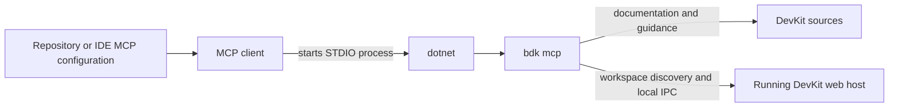

# BDK MCP Client Configuration

[TOC]

## Overview

This page documents how to configure common MCP clients. For day-to-day usage, prompts, runtime selection and troubleshooting, see [DevKit MCP](./features-cli-mcp.md).

## Challenges

MCP clients use different repository configuration files and JSON shapes. DevKit contributors must launch the CLI from the current source tree, while consuming applications should launch the version pinned in their local .NET tool manifest. User-specific IDE state should remain outside source control.

## Solution

Use a source-controlled STDIO server definition where the client supports one. Point DevKit repository configurations at `src/Presentation.Cli/Presentation.Cli.csproj`; point consuming repositories at `dotnet tool run bdk mcp`. Keep the application host separate because the MCP process discovers an already-running Development host.

## Key Features

- Repository-level configuration for Visual Studio through `.mcp.json`.
- Repository-level configuration for VS Code through `.vscode/mcp.json`.
- A documented Rider server definition without committing `.idea` user state.
- Separate source-run and packaged-tool command shapes.
- Diagnostics-only defaults for consuming applications, with optional toolset expansion.

## Architecture



The MCP client owns process startup and communicates with `bdk mcp` over STDIO. The CLI resolves the workspace and forwards runtime tools to a separately running host.

## Use Cases

- Let Visual Studio or VS Code discover a DevKit MCP server from source control.
- Configure Rider without committing its user-specific project settings.
- Test current CLI source while contributing to bITdevKit.
- Pin the packaged CLI version in a consuming application's tool manifest.
- Enable operations or admin tools only for repositories that need them.

## Basic Usage

In a consuming repository, create a local tool manifest if one does not exist, install the CLI and verify the command before configuring the MCP client:

```powershell
if (-not (Test-Path '.config/dotnet-tools.json')) {
    dotnet new tool-manifest
    if ($LASTEXITCODE -ne 0) {
        throw "Could not create the local tool manifest."
    }
}

$localTools = dotnet tool list --local
if ($localTools -match 'bridgingit\.devkit\.cli') {
    dotnet tool restore
} else {
    dotnet tool install BridgingIT.DevKit.Cli
}

if ($LASTEXITCODE -ne 0) {
    throw "Could not install or restore repository tools."
}

dotnet tool run bdk version --output json
if ($LASTEXITCODE -ne 0) {
    throw "The bdk tool did not start successfully."
}
```

Add this server definition to the client-specific file described below:

```json
{
  "servers": {
    "bdk": {
      "type": "stdio",
      "command": "dotnet",
      "args": ["tool", "run", "bdk", "mcp"]
    }
  }
}
```

Reload the MCP client and call `bdk_mcp_status`. Treat `available: false` as a handled unavailable result and use its `code`, `reason` and suggested next calls. An available response shows the resolved workspace and server status.

## Repository configurations

This repository is the `bdk` CLI source repository. The checked-in Visual Studio configuration starts the server from source, and the VS Code configuration offers both `bdk_local` (source) and `bdk` (the packaged local tool):

```json
{
  "servers": {
    "bdk": {
      "type": "stdio",
      "command": "dotnet",
      "args": [
        "run",
        "--project",
        "src/Presentation.Cli/Presentation.Cli.csproj",
        "--",
        "mcp",
        "--toolset",
        "diagnostics,operations,admin"
      ]
    }
  }
}
```

The relative project path requires the MCP process to start with the repository root as its working directory.

For applications that consume the packaged CLI as a local .NET tool, use this command after creating or locating a tool manifest:

```bash
dotnet tool install BridgingIT.DevKit.Cli
```

```json
{
  "servers": {
    "bdk": {
      "type": "stdio",
      "command": "dotnet",
      "args": ["tool", "run", "bdk", "mcp"]
    }
  }
}
```

## Visual Studio

Visual Studio discovers the repository-level `.mcp.json` file. In this repository it defines the `bdk` server and runs the CLI project from source.

## VS Code

VS Code discovers `.vscode/mcp.json`. The checked-in file defines `bdk_local` for the source project and `bdk` for the manifest-pinned packaged tool.

## Rider

Rider stores MCP server definitions through JetBrains AI Assistant settings rather than a documented source-controlled project file. Add this server in Rider's MCP settings:

```json
{
  "mcpServers": {
    "bdk": {
      "command": "dotnet",
      "args": [
        "run",
        "--project",
        "src/Presentation.Cli/Presentation.Cli.csproj",
        "--",
        "mcp",
        "--toolset",
        "diagnostics,operations,admin"
      ]
    }
  }
}
```

For consuming applications, replace the Rider `args` with:

```json
["tool", "run", "bdk", "mcp"]
```

## Verification

After reloading the client:

1. Confirm that the expected `bdk` or `bdk_local` server is connected.
2. Call `bdk_mcp_status`; this does not require a selected runtime.
3. Start a DevKit web host in Development for runtime tools.
4. Call `bdk_runtimes_list` and select a runtime when more than one is ready.
5. Call `bdk_mcp_self_test` to check IPC, protocol and capability discovery.

The source configurations enable `diagnostics`, `operations` and `admin` so contributors can test the full catalog. Admin tools still require operation-specific confirmation arguments. Consuming applications should keep the diagnostics-only command unless broader toolsets are needed.

## Related documentation

- [DevKit MCP](./features-cli-mcp.md)
- [DevKit CLI](./features-cli.md)
