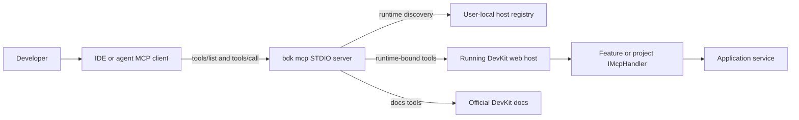
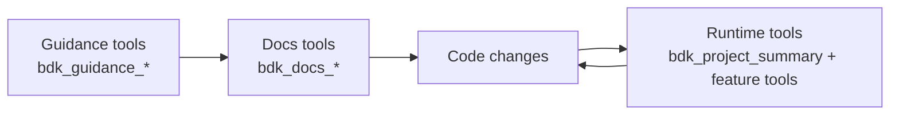
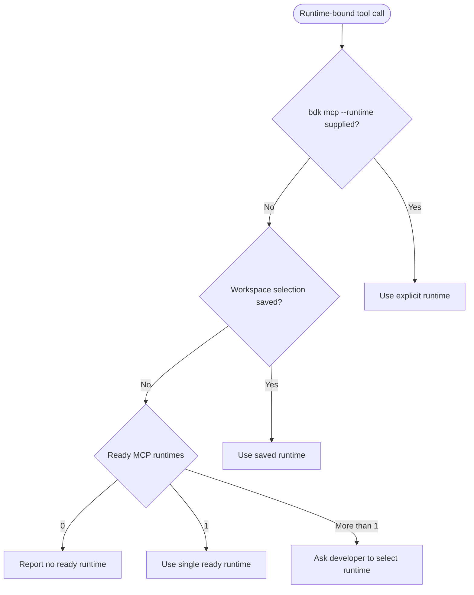

# DevKit MCP Feature Documentation

> Use `bdk mcp` to give local coding agents official DevKit documentation plus a safe, workspace-aware diagnostics and operations surface for running DevKit applications.

[TOC]

## Overview

The DevKit MCP feature exposes a local Model Context Protocol server through the `bdk` CLI. Developers configure their MCP-capable IDE or agent to start `bdk mcp` over STDIO. The CLI can return curated implementation guidance, search official DevKit documentation, discover running DevKit web hosts in the current workspace, and forward runtime-bound tool calls to the selected host over local IPC.

Use MCP when you want a coding agent to understand DevKit patterns and inspect a running application while it works on code:

- search official DevKit documentation before implementing a feature
- load bounded DevKit docs content into the coding session
- request curated DevKit guidance for common implementation tasks
- summarize the selected project runtime, modules and advertised MCP capabilities
- check local runtime availability and health
- inspect retained logs and errors
- follow a correlation id across logs, jobs, messaging, queueing and orchestrations
- inspect, retry, pause, resume, signal or trigger supported runtime features
- search official DevKit documentation from any consuming project
- call project-owned diagnostics exposed by the application

MCP is a local development feature. It is not an HTTP endpoint, not a production administration API and not a replacement for application authorization.

## Mental Model



The application must run separately. `bdk mcp` does not start the app. It only discovers hosts that already wrote a local descriptor through `DevKitWebApplication.CreateBuilder(args)`.

Guidance and documentation tools are available even before a runtime is selected. Runtime tools require a running DevKit host.

## Agent Context Model

MCP gives an agent three complementary angles while it codes:



Use guidance for compact task checklists, docs for official detail, and runtime tools to verify the selected application after changes.

## Prerequisites

- Install or restore the `bdk` CLI.
- Start a DevKit-aware web host in `Development`.
- Configure an MCP client to run `bdk mcp`.
- Keep the MCP client workspace aligned with the application workspace so runtime discovery filters correctly.

For client-specific setup, see [MCP Client Configuration](./features-cli-mcp-clients.md).

## Basic Setup

For applications that consume the packaged CLI through a local .NET tool manifest:

```bash
dotnet tool restore
dotnet tool run bdk mcp
```

MCP clients usually need the command split into executable and arguments:

```json
{
  "servers": {
    "bdk": {
      "type": "stdio",
      "command": "dotnet",
      "args": ["tool", "run", "bdk", "mcp"]
    }
  }
}
```

When developing the DevKit repository itself, run the CLI from source:

```json
{
  "servers": {
    "bdk": {
      "type": "stdio",
      "command": "dotnet",
      "args": [
        "run",
        "--project",
        "src/Presentation.Cli/Presentation.Cli.csproj",
        "--",
        "mcp"
      ]
    }
  }
}
```

## Toolsets

`bdk mcp` starts with read-only diagnostics by default.

| Toolset       | Enables                          | Example tools                                                         |
| ------------- | -------------------------------- | --------------------------------------------------------------------- |
| `diagnostics` | Read-only inspection.            | `bdk_health_snapshot`, `bdk_logs_query`, `bdk_jobs_runs`              |
| `operations`  | Non-destructive runtime actions. | `bdk_jobs_trigger`, `bdk_queueing_retry`, `bdk_orchestrations_signal` |
| `admin`       | Destructive maintenance actions. | `bdk_logs_purge`, `bdk_messages_purge`, `bdk_orchestrations_purge`    |

Enable additional toolsets explicitly:

```bash
bdk mcp --toolset diagnostics,operations
bdk mcp --toolset diagnostics,operations,admin
```

Admin tools also require operation-level confirmation arguments, such as `confirm=true` and an operation-specific `confirmation` phrase. This lets a client expose admin tools without allowing accidental purge calls.

## Runtime Selection

Runtime-bound tools need one selected running host.



Useful runtime tools:

| Tool                   | Purpose                                                                              |
| ---------------------- | ------------------------------------------------------------------------------------ |
| `bdk_mcp_status`       | Shows MCP server status, workspace, descriptors and selected runtime.                |
| `bdk_mcp_self_test`     | Checks runtime selection, IPC connectivity, protocol compatibility and capabilities. |
| `bdk_runtimes_list`    | Lists ready MCP runtimes in the workspace.                                           |
| `bdk_runtimes_select`  | Saves a selected runtime for the workspace.                                          |
| `bdk_capabilities_get` | Lists operations advertised by the selected runtime.                                 |
| `bdk_project_summary`  | Summarizes selected runtime metadata, registered modules and MCP capabilities.        |

## Common Developer Prompts

Use prompts that ask the agent to inspect first, then act only when necessary:

```text
Use the bdk MCP docs tools to read the DevKit Jobs documentation first. Summarize the expected job pattern, then inspect this project for matching conventions before editing code.
```

```text
Use bdk_guidance_get for queueing, then read the linked DevKit docs and inspect bdk_project_summary before changing code.
```

```text
Use bdk_docs_search to find the DevKit guidance for modules and endpoints. Use that guidance while adding this new endpoint, then run the relevant tests.
```

```text
Use the bdk MCP self-test and tell me whether the selected runtime is healthy.
```

```text
Use the bdk MCP to inspect the latest errors. For the newest error, follow the correlation id and summarize the related logs.
```

```text
Use the bdk MCP to check whether messaging, queueing, jobs and orchestrations are available in this runtime before changing code.
```

```text
Use the bdk MCP docs tools to find the DevKit queueing retry guidance and compare it with the code in this project.
```

```text
Use the bdk MCP to retry the failed queue message, then follow the logs for the resulting correlation id.
```

For destructive maintenance, be explicit:

```text
Use the bdk MCP admin tools to purge retained local test data older than yesterday. Show me what you will call first, and only proceed with the required confirmation arguments after I approve.
```

## Tool Areas

The MCP catalog is stable. Tools can return structured unavailable responses when the selected runtime does not expose the required feature.

| Area               | Tools                                                                                                                                   |
| ------------------ | --------------------------------------------------------------------------------------------------------------------------------------- |
| Runtime            | `bdk_mcp_status`, `bdk_mcp_self_test`, `bdk_runtimes_*`, `bdk_capabilities_get`                                                          |
| Health and metrics | `bdk_health_snapshot`, `bdk_metrics_snapshot`, `bdk_metrics_query`                                                                      |
| Logs and errors    | `bdk_logs_query`, `bdk_logs_tail`, `bdk_errors_recent`, `bdk_errors_details`, `bdk_correlation_inspect`                                 |
| Messaging          | `bdk_messages_summary`, `bdk_messages_list`, `bdk_messages_details`, `bdk_messages_retry`, `bdk_messages_archive`, `bdk_messages_purge` |
| Queueing           | `bdk_queueing_summary`, `bdk_queueing_messages`, `bdk_queueing_retry`, `bdk_queueing_pause_queue`, `bdk_queueing_purge`                  |
| Jobs               | `bdk_jobs_list`, `bdk_jobs_details`, `bdk_jobs_runs`, `bdk_jobs_trigger`, `bdk_jobs_purge_runs`                                          |
| Orchestrations     | `bdk_orchestrations_list`, `bdk_orchestrations_instance_details`, `bdk_orchestrations_signal`, `bdk_orchestrations_purge`                |
| Investigation      | `bdk_investigate_recent_errors`, `bdk_investigate_correlation`, `bdk_investigate_job_run`, `bdk_investigate_orchestration_instance`        |
| Guidance           | `bdk_guidance_list`, `bdk_guidance_get`                                                                                                   |
| Documentation      | `bdk_docs_search`, `bdk_docs_get`                                                                                                       |
| Project summary    | `bdk_project_summary`                                                                                                                    |
| Project operations | `bdk_project_operations`, `bdk_project_call`                                                                                            |

## Curated Guidance

`bdk_guidance_list` and `bdk_guidance_get` provide compact implementation guidance for agentic coding. Guidance is intentionally exposed through one generic operation to avoid tool explosion as more DevKit feature areas are added. Agents can call it with either an exact `topic` or a natural-language `query`.

When a user asks for "guidance", "how to implement", "add", "create" or "build" DevKit-specific code, the agent should call `bdk_guidance_get` first and pass the user's wording as `query`.

The current guidance topics cover the major DevKit feature areas:

- `jobs`
- `messaging`
- `queueing`
- `orchestration`
- `pipelines`
- `caching`
- `mapping`
- `serialization`
- `utilities`
- `commands_queries`
- `application_events`
- `activeentity`
- `domain_events`
- `repositories`
- `specifications`
- `domain`
- `filtering`
- `modules`
- `requester_notifier`
- `results`
- `rules`
- `startuptasks`
- `document_storage`
- `file_storage`
- `monitoring`
- `dashboard`
- `project_dashboard_page`

Each guidance response includes a summary, linked official docs, implementation steps, recommended MCP tools and a prompt the agent can use to continue. This sits between raw docs and live runtime diagnostics: it tells the agent how to approach the work before it edits files.

Example:

```json
{
  "topic": "jobs"
}
```

Natural-language example:

```json
{
  "query": "how to implement a new job that triggers an orchestration"
}
```

The generic guidance operation can infer multiple relevant topics from a query. For example, a job that triggers an orchestration returns both Jobs and Orchestration guidance, then points the agent to the linked docs and runtime verification tools.

Additional examples:

```json
{
  "query": "how do I add a reusable repository specification"
}
```

```json
{
  "query": "give me guidance for document storage and file monitoring"
}
```

## Documentation-Aware Development

`bdk_docs_search` and `bdk_docs_get` let an agent consult official DevKit documentation while it works in a consuming project. This is intentionally owned by the CLI MCP server rather than the selected runtime, so docs lookup works even when the app is not running yet.

Use this when the agent is implementing or refactoring DevKit-specific code:

- Jobs: read the Jobs docs before adding handlers, triggers, batches or run-history integration.
- Queueing and messaging: read retry, archive, pause and retained-message guidance before changing operational flows.
- Modules and endpoints: read module and endpoint conventions before adding presentation features.
- Project-owned MCP tools: read MCP handler guidance before exposing application diagnostics.
- Dashboards: read dashboard guidance before adding a developer page.

Typical flow:

```text
Docs -> Code -> Runtime
```

1. `bdk_docs_search` finds the relevant DevKit feature page.
2. `bdk_docs_get` loads the bounded markdown source.
3. The agent compares the documented pattern with the current code.
4. The agent implements the change.
5. Runtime tools such as `bdk_capabilities_get`, `bdk_jobs_list`, `bdk_queueing_summary` or project-owned operations verify the running app.

## Project Summary

`bdk_project_summary` is the quickest runtime orientation tool. It returns selected runtime metadata, registered modules, MCP operation counts grouped by feature/toolset/owner, and project-owned operations. Use it before feature work so an agent can understand the app shape without scanning unrelated files.

Typical prompts:

```text
Use bdk_project_summary to orient on this app before editing. Then choose the relevant guidance topic and docs.
```

```text
Use bdk_project_summary and tell me which DevKit capabilities this runtime advertises before adding a dashboard page.
```

## Project-Owned Operations

Applications can expose their own local diagnostics and controlled local operations through app-side `IMcpHandler` implementations. This is the supported extension point for customer and project-specific MCP tools: the CLI stays stable, while each consuming project can advertise its own operations from the running application.

Project-owned operations are not added as dynamic MCP tools by default. This keeps the public MCP tool catalog stable across projects and lets agents discover project capabilities at runtime.

Register a handler from the application presentation layer through the DevKit web application builder:

```csharp
public sealed class CommerceMcpHandler(IRequester requester) : IMcpHandler
{
    public IReadOnlyCollection<McpCapability> Capabilities { get; } =
    [
        new("commerce_inspect_customer", McpToolset.Diagnostics, "project", "Inspects customer profile, order activity and account state.")
        {
            Owner = "commerce",
            Category = "customers"
        }
    ];

    public ValueTask<McpResponse> HandleAsync(McpRequest request, CancellationToken cancellationToken)
    {
        // Resolve request.Operation, use application services and return bounded data.
    }
}

var builder = DevKitWebApplication.CreateBuilder(args)
    .AddConfiguration()
    .AddLogging()
    .AddModules(modules => modules
        .WithModule<CommerceModule>())
    .AddMcp(mcp => mcp
        .WithHandler<CommerceMcpHandler>());
```

Use assembly scanning when a module owns multiple MCP handlers:

```csharp
var builder = DevKitWebApplication.CreateBuilder(args)
    .AddConfiguration()
    .AddLogging()
    .AddModules(modules => modules
        .WithModule<CommerceModule>())
    .AddMcp(mcp => mcp
        .WithHandlersFromAssembly<CommerceModule>());
```

`AddMcp(...)` follows the host's evaluated local MCP tooling decision by default. In normal applications this keeps project MCP handlers local-development only and disabled when `DevKit:Cli:Mcp` or the equivalent builder option disables MCP. Use `.Enabled(true)` or `.Enabled(false)` only when a project needs to override handler registration explicitly.

Project-owned operation names must be client-safe: use lowercase letters, digits, underscores or hyphens. Avoid dots and camelCase even though the operation is passed as an argument to `bdk_project_call`, because MCP clients still surface and cache these names.

The operation is then discoverable through:

```json
{
  "name": "bdk_project_operations",
  "arguments": {}
}
```

Call it through `bdk_project_call`. Include the advertised toolset so future diagnostics, operations and admin project tools can be validated consistently:

```json
{
  "name": "bdk_project_call",
  "arguments": {
    "operation": "commerce_inspect_customer",
    "toolset": "diagnostics",
    "arguments": {
      "customerNumber": "CUST-10042",
      "includeRecentOrders": true
    }
  }
}
```

Project-owned operations can advertise `diagnostics`, `operations` or `admin`. The MCP server must be started with the matching toolset, and admin operations should still require explicit confirmation arguments inside `arguments`.

Example prompt:

```text
Use bdk_project_operations to inspect project-owned operations, then call the operation that checks whether customer CUST-10042 has recent failed orders or account warnings.
```

## Documentation Tools

`bdk_docs_search` and `bdk_docs_get` use official online DevKit documentation sources. They do not read the local repository docs.

This matters because most developers use `bdk mcp` from consuming application repositories, not from the DevKit source repository. The local repository may have no DevKit docs at all.

## Safety Model

- MCP is enabled only for local development hosts by default.
- The app does not host an MCP network endpoint.
- The CLI speaks MCP over STDIO to the client and local IPC to the app.
- Runtime descriptors and IPC endpoints are stored in OS user-local locations.
- IPC requests include a nonce from the host descriptor.
- Toolsets limit broad classes of actions.
- Admin operations require explicit confirmation arguments.
- MCP handlers should return bounded data and avoid secrets.

## Troubleshooting

### The Agent Says No Runtime Was Found

Start the application with `DevKitWebApplication.CreateBuilder(args)` in `Development`, then ask the agent to call `bdk_runtimes_list`.

You can also check manually:

```bash
bdk hosts list --feature mcp
```

### Multiple Runtimes Are Running

Ask the agent to call `bdk_runtimes_list`, then select one:

```text
Use bdk_runtimes_list and select the commerce-api runtime.
```

Or select manually:

```bash
bdk hosts select commerce-api-5001
```

### Operations Are Unauthorized

The MCP server may have been started with only `diagnostics`. Restart it with the needed toolset:

```bash
bdk mcp --toolset diagnostics,operations
```

For purge and other destructive maintenance, also provide the required confirmation arguments.

### A Feature Is Unavailable

The selected runtime may not register that DevKit feature or its presentation package. Ask the agent to call `bdk_capabilities_get` and compare the advertised operations with the tool you want to use.

### Docs Tools Work But Runtime Tools Do Not

Documentation tools do not require a running app. Runtime tools do. Start the app and run `bdk_mcp_self_test`.

## Related Documentation

- [DevKit CLI](./features-cli.md)
- [MCP Client Configuration](./features-cli-mcp-clients.md)
- [Presentation Host](./features-presentation.md)
- [DevKit STDIO MCP Specification](./specs/spec-presentation-web-mcp-diagnostics.md)
- [ADR-0023: STDIO MCP Server with SDK-Free App Handlers](./adr/0023-stdio-mcp-server-with-sdk-free-app-handlers.md)
