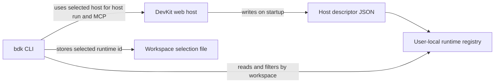
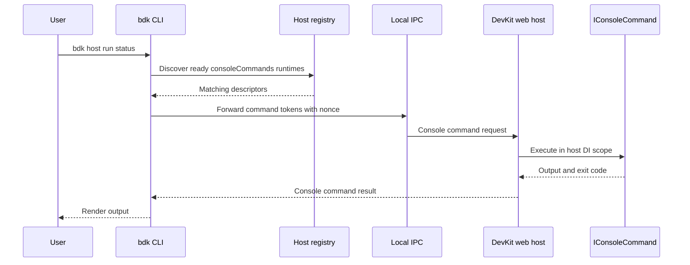
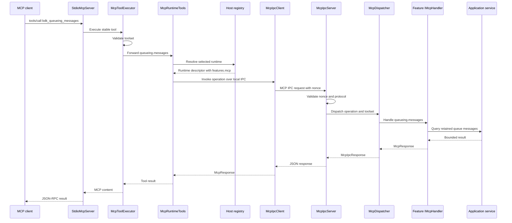
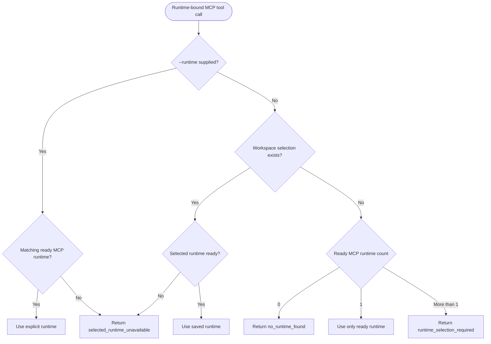

# DevKit CLI Feature Documentation

> Use `bdk` as the repository-local command-line surface for DevKit local-development workflows, host discovery, host Console Command forwarding and MCP diagnostics.

[TOC]

## Overview

The DevKit CLI provides a single local-development command entry point for DevKit workflows. It is packaged as the `BridgingIT.DevKit.Cli` .NET tool and exposes the `bdk` command.

The CLI foundation provides:

- local CLI commands registered through the existing Console Commands dispatcher
- workspace resolution
- host runtime descriptor discovery
- host selection storage
- shared host registry commands
- Console Command forwarding into a running DevKit web host
- STDIO MCP hosting through `bdk mcp`
- runtime diagnostics, operations and admin MCP tools
- official DevKit documentation tools for agents

## Packages

| Package | Responsibility |
| ---- | ---- |
| `BridgingIT.DevKit.Cli` | Provides the `bdk` .NET tool and local-development command surface. |
| `BridgingIT.DevKit.Common.Abstractions` | Provides shared host descriptor DTOs and MCP request/response abstractions used by the CLI and web hosts. |
| `BridgingIT.DevKit.Presentation.Web` | Writes local host descriptors, advertises endpoint metadata and provides built-in health, metrics and log MCP handlers. |
| `BridgingIT.DevKit.Presentation` | Provides the Console Commands model used for local CLI command binding/dispatch and host-side command execution. |

## Installation

Use a repository-local .NET tool manifest for normal development setup.

```bash
dotnet new tool-manifest
dotnet tool install BridgingIT.DevKit.Cli
```

Commit the generated manifest:

```text
.config/dotnet-tools.json
```

Developers restore tools with:

```bash
dotnet tool restore
```

Run the CLI through the local tool manifest:

```bash
dotnet tool run bdk version
```

During CLI development, run the project directly from the repository:

```bash
dotnet run --project src/Presentation.Cli/Presentation.Cli.csproj -- version
```

This path uses the same command host as the packaged tool. Only the process launch mechanism differs.

## Global Options

| Option | Description |
| ---- | ---- |
| `--help` | Shows root, group or command help. |
| `--version` | Shows CLI version information. |
| `--workspace <path>` | Overrides workspace resolution for host filtering and selection storage. |
| `--verbose` | Enables additional human-readable diagnostic output where supported. |
| `--quiet` | Suppresses non-essential human-readable output. |
| `--no-color` | Disables ANSI color output. |
| `--nologo` | Suppresses the startup banner. |
| `--banner` | Forces the startup banner when it would normally be suppressed. |
| `--non-interactive` | Disables interactive behavior and prompts. |
| `--output text\|json` | Selects human-readable text or structured JSON output. |

`--quiet` and `--verbose` cannot be used together. `--nologo` and `--banner` cannot be used together. JSON output implies no color and suppresses human-only output.

The CLI can render an animated startup banner to standard error for interactive text sessions. It is suppressed for JSON, quiet, CI and non-interactive invocations unless `--banner` is supplied.

## Workspace Resolution

Workspace-aware commands use a deterministic workspace path so host filtering and selected-host storage are stable.

Resolution order:

1. The explicit `--workspace <path>` value.
2. The nearest ancestor containing `.slnx`, `.sln` or `.git`.
3. The current directory.

The resolved path is normalized before the CLI computes the workspace hash used for selection files.

## Host Runtime Registry

Running DevKit web hosts created with `DevKitWebApplication.CreateBuilder(args)` can write host descriptors to an OS user-local registry.

Default locations:

| OS | Runtime descriptor location |
| ---- | ---- |
| Windows | `%LOCALAPPDATA%\bdk\hosts\runtimes` |
| Linux/macOS | `$XDG_RUNTIME_DIR/bdk/hosts/runtimes` |
| Fallback | `$TMPDIR/bdk/hosts/runtimes` |

Selected hosts are stored in the sibling `bdk/hosts/selections` directory, scoped by the workspace hash.

The CLI reads descriptors. It does not write host descriptors. Descriptor writing belongs to the Presentation Host feature.



## Host Descriptor Shape

Host descriptors use shared DTOs from `Common.Abstractions/HostDiscovery`.

Important fields:

| Field | Purpose |
| ---- | ---- |
| `schemaVersion` | Descriptor schema compatibility. |
| `runtimeId` | Stable id for the current host process. |
| `applicationName` | Display name for host lists. |
| `environmentName` | Host environment name. |
| `workspacePath` | Workspace used for default filtering. |
| `contentRootPath` | Host content root. |
| `projectPath` | Optional host project path. |
| `processId` | Local host process id. |
| `startedAt` | UTC host start timestamp. |
| `assembly` | Host entry assembly version metadata. |
| `features` | Host-advertised local endpoint capabilities. |

`features.consoleCommands` is required for `bdk host run`. `features.mcp` is required for runtime-bound tools exposed by `bdk mcp`.

## Commands

### `bdk version`

Shows the CLI version and registered command modules. This command does not require a running host.

```bash
bdk version
bdk version --output json
```

### `bdk help`

Shows command groups and shared global options.

```bash
bdk help
bdk --help
```

### `bdk docs`

Opens the official bITdevKit documentation in the default browser. Use `--url` to print the documentation URL without opening a browser. JSON output reports the URL and does not open a browser.

```bash
bdk docs
bdk docs --url
bdk docs --output json
```

### `bdk hosts list`

Lists ready host descriptors for the current workspace. Stale descriptors are hidden by default because local development processes are often killed or restarted. Use `--all` to include stale descriptors and descriptors outside the current workspace.

```bash
bdk hosts list
bdk hosts list --all
bdk hosts list --feature consoleCommands
bdk hosts list --output json
```

Statuses:

| Status | Meaning |
| ---- | ---- |
| `Ready` | Descriptor is valid and the process appears live. |
| `Stale` | The descriptor points to a process that is no longer running. |
| `Invalid` | The descriptor cannot be parsed or is missing required fields. |
| `VersionMismatch` | The descriptor schema is incompatible. |
| `FeatureUnavailable` | A requested endpoint capability is missing. |
| `Unreachable` | A descriptor is valid but its endpoint cannot be reached. |

### `bdk hosts current`

Shows the currently selected host for the workspace.

```bash
bdk hosts current
bdk hosts current --output json
```

### `bdk hosts select`

Stores the selected runtime id for the current workspace.

```bash
bdk hosts select commerce-api-5001
```

### `bdk hosts refresh`

Re-reads descriptors and reports current ready hosts. Stale descriptors remain hidden unless `--all` is supplied.

```bash
bdk hosts refresh
bdk hosts refresh --all
```

### `bdk hosts versions`

Shows entry assembly version metadata for ready hosts in the current workspace. Stale descriptors are hidden by default for the same reason as `bdk hosts list`; use `--all` to include stale descriptors and descriptors outside the current workspace.

```bash
bdk hosts versions
bdk hosts versions --all
bdk hosts versions --output json
```

This command reads descriptor metadata only. It does not enumerate all assemblies loaded inside the host process.

### `bdk hosts clean`

Removes stale or invalid descriptors when explicitly confirmed.

```bash
bdk hosts clean
bdk hosts clean --yes
bdk hosts clean --yes --output json
```

Without `--yes`, the command reports that confirmation is required.

### `bdk hosts kill`

Terminates ready host processes for the current workspace. The command never targets stale descriptors, because stale descriptor process ids may have been reused by unrelated processes. Specify either one runtime id or `--all`, and add `--yes` to actually terminate processes.

```bash
bdk hosts kill commerce-api-5001
bdk hosts kill commerce-api-5001 --yes
bdk hosts kill --all --yes
bdk hosts kill --all --yes --output json
```

Without `--yes`, the command reports candidate processes and marks them as confirmation-required. Use `bdk hosts clean --yes` afterwards if you want to remove descriptors that became stale after termination.

### `bdk host run`

Forwards a Console Command invocation to a selected running web host.

```bash
bdk host run status
bdk host run diag perf
bdk host run --host commerce-api-5001 -- seed products --count=50
```

The host must advertise `features.consoleCommands` in its descriptor. The command executes inside the selected host process through the host's registered `IConsoleCommand` services and returns the host command output to the CLI.

Forwarded command tokens after `bdk host run` are preserved. Use `--` to separate CLI forwarding options from host command tokens when needed.

### `bdk mcp`

Starts the CLI as a STDIO MCP server for local agents and IDEs.

```bash
bdk mcp
bdk mcp --toolset diagnostics,operations
bdk mcp --toolset diagnostics,operations,admin
bdk mcp --runtime commerce-api-5001
```

The command speaks JSON-RPC over standard input and output. Human logs and diagnostics must go to standard error so MCP clients can parse standard output safely.

Runtime-bound MCP tools select a running host from the same workspace-aware host registry used by `bdk hosts` and `bdk host run`. Documentation tools use official online DevKit documentation and do not require a running host.

Toolsets:

| Toolset | Purpose |
| ---- | ---- |
| `diagnostics` | Read-only inspection tools. Enabled by default. |
| `operations` | Runtime actions such as retry, pause, resume, signal or trigger. |
| `admin` | Destructive maintenance tools such as purge. Admin tools also require `confirm=true` and the operation-specific `confirmation` phrase. |

## Exit Codes

| Exit code | Category | Meaning |
| ----: | ---- | ---- |
| `0` | Success | Command completed successfully. |
| `1` | CommandFailed | Command ran but failed. |
| `2` | InvalidArguments | Arguments or options were invalid. |
| `3` | HostNotFound | No compatible running host was found. |
| `4` | HostSelectionRequired | Multiple compatible hosts require explicit selection. |
| `5` | SelectedHostUnavailable | Selected host is stale, unreachable or incompatible. |
| `6` | ProtocolVersionMismatch | CLI and host protocol versions are incompatible. |
| `7` | InternalError | Unexpected CLI error. |

## Local Trust Model

The CLI is a local-development tool. Host discovery and command forwarding use OS user-local descriptor and IPC locations.

Rules:

- Descriptors are stored outside the repository.
- Descriptor presence alone is not authorization to execute host commands.
- Host endpoint nonces are sent with local IPC requests.
- Non-development hosts should not advertise CLI-connectable endpoints by default.
- Destructive host commands remain responsible for their own confirmations and safeguards.

The nonce helps avoid accidental use of stale or spoofed descriptors in the same user-local registry. It is not production authentication.

## Relationship to Console Commands

The CLI aligns terminal behavior with the existing Console Commands feature. Local `bdk` commands use the same Spectre.Console style, while `bdk host run` executes the selected host's `IConsoleCommand` implementation in the host process.



## Relationship to MCP

MCP is implemented as a command module inside `bdk`. The CLI owns STDIO protocol handling, stable MCP tool names, runtime discovery and runtime selection. Running DevKit web hosts own application-specific execution through app-side MCP handlers.

The stable catalog includes runtime tools, investigation tools, logs/errors, health/metrics, messaging, queueing, jobs, orchestrations, documentation and project-owned operation dispatch. Project operations remain discoverable through capabilities and callable through `bdk_project_call`; they are not added as dynamic MCP tools by default.

## Appendix: How MCP Works Inside the CLI

`bdk mcp` is a local bridge between an MCP client and one or more running DevKit hosts in the same workspace.

```mermaid
flowchart LR
    subgraph ClientSide["Agent or IDE process"]
        Client["MCP client"]
    end

    subgraph CliSide["bdk CLI process"]
        Stdio["StdioMcpServer"]
        Catalog["McpToolCatalog"]
        Executor["McpToolExecutor"]
        RuntimeTools["McpRuntimeTools"]
        DocsTools["McpDocumentationTools"]
        IpcClient["McpIpcClient"]
    end

    subgraph HostSide["DevKit web host process"]
        IpcServer["McpIpcServer"]
        Dispatcher["McpDispatcher"]
        Handler["IMcpHandler"]
        AppService["Application service"]
    end

    Client -->|"JSON-RPC over STDIO"| Stdio
    Stdio --> Catalog
    Stdio --> Executor
    Executor -->|"docs tools"| DocsTools
    Executor -->|"runtime tools"| RuntimeTools
    RuntimeTools --> IpcClient
    IpcClient -->|"named pipe or Unix socket"| IpcServer
    IpcServer -->|"validated nonce and protocol"| Dispatcher
    Dispatcher --> Handler
    Handler --> AppService
    AppService --> Handler
    Handler --> Dispatcher
    Dispatcher --> IpcServer
    IpcServer --> IpcClient
    IpcClient --> RuntimeTools
    RuntimeTools --> Executor
    DocsTools --> Executor
    Executor --> Stdio
    Stdio --> Client
```



Runtime-bound tool calls follow this sequence:



Key components:

| Component | Responsibility |
| ---- | ---- |
| `StdioMcpServer` | Implements the MCP JSON-RPC loop over standard input/output. |
| `McpToolCatalog` | Defines the stable public `bdk_*` tool list shown to MCP clients. |
| `McpToolExecutor` | Maps stable tool names to runtime operations, docs operations or project operation dispatch. |
| `McpRuntimeTools` | Resolves workspaces, selected runtimes, capabilities and IPC forwarding. |
| `McpIpcClient` / `McpIpcServer` | Carry bounded MCP requests between the CLI process and the selected web host. |
| `McpDispatcher` | Finds the app-side handler that advertises the requested operation. |
| `IMcpHandler` | Feature-owned operation handler implemented by Presentation.Web packages or the application. |

Runtime selection follows the same rules as host commands:

1. `--runtime <id>` on `bdk mcp` wins.
2. A saved workspace selection from `bdk_runtimes_select` or `bdk hosts select` is used.
3. If exactly one ready MCP runtime exists, it is selected automatically.
4. If multiple ready runtimes exist, runtime-bound tools return `runtime_selection_required`.



The CLI enforces coarse toolset authorization before any IPC call. The host dispatcher also verifies that the requested toolset matches the advertised capability. This gives two safeguards: the MCP process must be started with the toolset, and the selected host must explicitly expose the operation under that toolset.

Feature packages contribute MCP handlers through their presentation registration extensions. For example, messaging, queueing, job scheduling and orchestration presentation packages register their handlers when their endpoints or console commands are registered. Built-in Presentation.Web handlers provide health, metrics and retained-log diagnostics when the corresponding services are available.

Documentation tools are different from runtime tools. `bdk_docs_search` and `bdk_docs_get` read official online DevKit documentation sources, not the local repository. This keeps the CLI useful when developers use it from another project whose repository is not the DevKit source tree.

MCP client configuration can be source-controlled for the repo:

- `.mcp.json` for clients that read repo-level MCP configuration.
- `.vscode/mcp.json` for VS Code.
- Rider and Visual Studio can be configured with the same command shape documented in [MCP Clients](./features-cli-mcp-clients.md).

## Appendix: Adding new MCP Tools

The MCP catalog is intentionally stable. Adding tools should be deliberate because every `bdk_*` tool becomes part of the agent-facing CLI surface.

Use this checklist for new DevKit-owned MCP tools:

1. Decide whether the operation should be a stable `bdk_*` tool or a project-owned operation.
2. Pick the least powerful toolset: `diagnostics`, `operations` or `admin`.
3. Define the app-side operation name, such as `queueing.messages` or `orchestrations.signal`.
4. Add or extend an app-side `IMcpHandler` in the owning presentation feature package.
5. Advertise a matching `McpCapability` with the correct operation name, feature and toolset.
6. Register the handler through the feature's presentation registration extension.
7. Add the stable tool definition to `McpToolCatalog` only when this is a DevKit-owned tool.
8. Add the tool-to-operation mapping in `McpToolExecutor`.
9. Add tests for catalog exposure, forwarding/toolset behavior and handler behavior.
10. Update this documentation and the MCP developer documentation when the tool changes how developers use MCP.

Use project-owned operations instead of stable tools when the behavior belongs to one application or module. This is the extension model for client projects that want to offer their own MCP tool platform on top of `bdk` without changing the CLI catalog:

```text
App IMcpHandler
  -> advertises owner/category/operation/toolset/schema

bdk_project_operations
  -> lists project-owned capabilities from the selected runtime

bdk_project_call
  -> invokes one project-owned operation by name and toolset
```

Register project handlers through the DevKit web application builder:

```csharp
var builder = DevKitWebApplication.CreateBuilder(args)
    .AddConfiguration()
    .AddLogging()
    .AddModules(modules => modules
        .WithModule<CommerceModule>())
    .AddMcp(mcp => mcp
        .WithHandler<CommerceMcpHandler>());
```

For several handlers in the same module assembly, use:

```csharp
.AddMcp(mcp => mcp
    .WithHandlersFromAssembly<CommerceModule>())
```

`AddMcp(...)` defaults to the host's evaluated local MCP tooling decision. It registers project handlers only when local MCP hosting is enabled for that host. Use `.Enabled(true)` or `.Enabled(false)` on the MCP registration builder only when an application needs an explicit override.

Project calls use the stable dispatcher shape:

```json
{
  "operation": "commerce_inspect_customer",
  "toolset": "diagnostics",
  "arguments": {
    "customerNumber": "CUST-10042",
    "includeRecentOrders": true
  }
}
```

`toolset` is optional for compatibility and defaults to `diagnostics`, but new project tools should supply it explicitly. The CLI validates that the value is one of `diagnostics`, `operations` or `admin` before forwarding to the selected runtime.

Project-owned operations must use client-safe names with lowercase letters, digits, underscores or hyphens. They must not use the reserved `bdk_` prefix and should usually use the `diagnostics` toolset unless they perform an explicit runtime action.

Safety requirements:

| Requirement | Guidance |
| ---- | ---- |
| Keep CLI logic thin | The CLI must not query application databases, call dashboard HTTP endpoints or load application configuration for runtime tools. |
| Keep handlers feature-owned | Put the handler next to the presentation feature that owns the application service contract. |
| Keep responses bounded | Return compact models, page large results and mark truncated responses when applicable. |
| Keep admin explicit | Purge or destructive cleanup tools must require `confirm=true` and a phrase-specific `confirmation` argument. |
| Keep docs remote | `bdk_docs_*` tools must use official online DevKit documentation, not local repository docs. |
| Keep protocols separate | App-side handlers use DevKit `IMcpHandler`; they do not depend on the MCP SDK or STDIO transport types. |

Typical file changes for a new stable runtime tool:

| File area | Change |
| ---- | ---- |
| `src/Common.Abstractions/Mcp` | Add shared request/response helpers only when the existing envelope is insufficient. |
| `src/Presentation.Cli/Mcp/McpToolCatalog.cs` | Add the public `bdk_*` tool definition and input schema. |
| `src/Presentation.Cli/Mcp/McpToolExecutor.cs` | Map the public tool to the internal operation and required toolset. |
| `src/Presentation.Web.<Feature>/Mcp/*` | Implement or extend the feature-owned handler. |
| `src/Presentation.Web.<Feature>/ServiceCollectionExtensions.cs` | Register the handler through feature setup. |
| `tests/Presentation.UnitTests` | Cover catalog/toolset behavior and handler success/failure paths. |
| `docs/features-cli-mcp.md` | Explain developer-facing usage if the tool adds a new workflow. |

## Troubleshooting

### No Hosts Are Listed

Start a DevKit web application that uses `DevKitWebApplication.CreateBuilder(args)` in `Development`. Raw `WebApplication.CreateBuilder(args)` applications do not write host descriptors by convention.

### Host Command Forwarding Is Unavailable

Check that the selected host advertises `features.consoleCommands`:

```bash
bdk hosts list --feature consoleCommands
```

Also verify local CLI integration is not disabled by configuration:

```json
{
  "DevKit": {
    "Cli": {
      "Enabled": false,
      "ConsoleCommands": false
    }
  }
}
```

### Multiple Hosts Match

Select a host once for the workspace:

```bash
bdk hosts select commerce-api-5001
```

Or pass an explicit selector:

```bash
bdk host run --host commerce-api-5001 -- status
```

## Related Documentation

- [Presentation Host](./features-presentation.md)
- [DevKit MCP](./features-cli-mcp.md)
- [MCP Client Configuration](./features-cli-mcp-clients.md)
- [Console Commands](./features-presentation-console-commands.md)
- [DevKit CLI Specification](./specs/spec-presentation-cli.md)
- [DevKit STDIO MCP Specification](./specs/spec-presentation-web-mcp-diagnostics.md)
