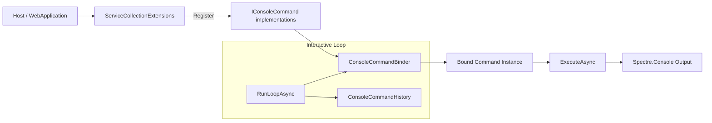
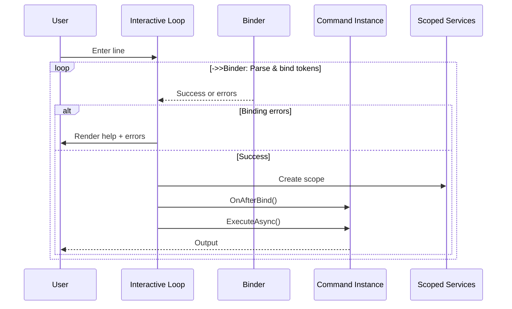

# Console Commands Feature Documentation

[TOC]

## Overview

The Console Commands feature provides an integrated, extensible command execution environment for applications built with the bITDevKit. It supports two complementary modes:

1. Non-interactive command execution ("single-shot") suitable for automation, scripting, diagnostics or administrative tasks at startup.
2. Interactive in-process console ("interactive shell") that runs alongside a locally hosted ASP.NET Core application using Kestrel.

Commands are lightweight classes derived from `ConsoleCommandBase` and discovered through dependency injection. They expose arguments and options via attributes, support grouped subcommand hierarchies, leverage Spectre.Console for rich terminal output and share a uniform binding & help system managed by the internal `ConsoleCommandBinder`.

### Challenges

Modern local development and operational workflows often face:
- Manual repetition of diagnostic and maintenance tasks (threads, memory, GC, environment info).
- Lack of a consistent, discoverable interface for custom runtime operations.
- Ad hoc scripts that duplicate logic scattered across multiple project areas.
- Difficulties in adding structured, option-rich commands without verbose parsing code.
- Need for both interactive exploration and automation-friendly single-run invocation.

### Solution

The feature addresses these challenges by supplying:
- A unified command abstraction (`IConsoleCommand`) with a lean base class (`ConsoleCommandBase`).
- Attribute-driven option & argument binding (`ConsoleCommandOptionAttribute`, `ConsoleCommandArgumentAttribute`).
- Grouped subcommands (`IGroupedConsoleCommand`) enabling hierarchical organization (e.g. `history list`, `diag perf`).
- Automatic help generation and validation errors through a central binder.
- Interactive loop with history persistence and restart support for local development.
- Consistent diagnostics commands (status, metrics, memory, threads, GC, env, diag group).
- Extensible registration via fluent builders (`AddConsoleCommands`, `AddConsoleCommandsInteractive`).
- Spectre.Console-based formatting (tables, markup, rules) for clear developer feedback.

### Use Cases

| Scenario | Description | Example |
|----------|-------------|---------|
| Local runtime diagnostics | Inspect memory, GC, thread pool, performance and environment info while developing | `diag perf` `gc --no-collect` `threads` |
| Operational introspection | Quick status snapshot / health indicator without external tools | `status` `metrics` |
| Automated task invocation | Trigger maintenance, job scheduling or batch operations via CLI | `jobs trigger --name=reindex` |
| Environment launch helpers | Open bound Kestrel addresses with optional filtering | `browse open --all` |
| GC experimentation | Force collections in development to validate memory patterns | `diag gc --force` |
| Extension via custom commands | Project-specific automation (seed data, cache warmup, export) | `seed data --count=50` |

## Architecture



### Core Components

| Component | Responsibility |
|-----------|----------------|
| `ConsoleCommandBase` | Base class offering name, alias, description and execution contract. |
| `IConsoleCommand` | Marker + contract for binding and execution. |
| `IGroupedConsoleCommand` | Adds `GroupName` + `GroupAliases` to nest subcommands. |
| `ConsoleCommandBinder` | Reflection-based binder parsing options/arguments, building help and caching metadata. |
| `ServiceCollectionExtensions` | Registers interactive or non-interactive command sets. |
| `ApplicationBuilderExtensions.UseConsoleCommandsInteractive` | Activates the input loop for local Kestrel hosting. |
| `ConsoleCommandHistory` | Persists and serves command history between sessions. |
| Diagnostic helpers (diag group) | Aggregated runtime tables (`DiagnosticTablesBuilder`). |

## Setup

### Register Non-Interactive Commands (Console)
Use when you need single-run invocation (e.g. hosted service executing a command supplied via args).
```csharp
var builder = Host.CreateApplicationBuilder(args);

builder.Services.AddConsoleCommands(cfg =>
{
    cfg.AddCommand<SampleConsoleCommand>(); // register commands
});

using var host = builder.Build();

return await ConsoleCommands.RunAsync(host.Services, args);
```

### Register Interactive Commands (Kestrel)
Enable the interactive loop for local development.
```csharp
builder.Services.AddConsoleCommandsInteractive(cfg =>
{
    cfg.AddCommand<SeedDataConsoleCommand>();
});

var app = builder.Build();
app.UseConsoleCommandsInteractive();
```

### Environment Constraints
The interactive loop is automatically bypassed in non-development environments (local checks).

## Command Definition

### Options & Arguments
Annotate public properties:
- `ConsoleCommandOptionAttribute`: Named option (`--name value` or short alias `-n value`) plus optional default.
- `ConsoleCommandArgumentAttribute`: Positional argument by index.

Binding Rules:
- Booleans are treated as flags (presence => true unless explicitly `false`).
- Missing required options/arguments produce binder errors and detailed help output.
- Unrecognized tokens yield validation feedback.

### Example: Simple Echo Command
```csharp
public class EchoConsoleCommand : ConsoleCommandBase
{
 [ConsoleCommandArgument(0, Description = "Text to echo", Required = true)] public string Text { get; set; }
 [ConsoleCommandOption("repeat", Alias = "r", Description = "Repeat count", Default =1)] public int Repeat { get; set; }
 [ConsoleCommandOption("upper", Alias = "u", Description = "Uppercase output")] public bool Upper { get; set; }
 public EchoConsoleCommand() : base("echo", "Echo text with optional repetition") { }
 public override Task ExecuteAsync(IAnsiConsole console, IServiceProvider services)
 {
 var output = Upper ? Text.ToUpperInvariant() : Text;
 for (var i =0; i < Repeat; i++) console.MarkupLine($"[green]{Markup.Escape(output)}[/]");
 return Task.CompletedTask;
 }
}
```
Usage:
```
echo "hello world" --repeat=3 --upper
```

### Example: Grouped Command (history)
Grouped commands share a `GroupName` token followed by subcommand names.
```
history list --max=25
history clear --keep-last=5
history search restart
```
Each subcommand class implements `IGroupedConsoleCommand` and supplies its own `Name` / `Description` while inheriting group metadata.

### Life Cycle Hook
`OnAfterBind(console, tokens)` allows post-binding adjustment / validation (e.g. deriving repeat count from another option).

## Interactive Mode

### Launch
When registered and running locally, a banner appears and the loop waits for user input. History is appended after each line. Control signals:
- Empty line: ignored.
- `quit` / `exit` / `q`: graceful shutdown.
- `restart`: development-only restart (spawns new process, sets environment marker).

### Help System
- `help` lists all commands and grouped subcommands.
- `help history` shows group subcommands.
- `help history list` shows detailed option/argument help for a specific subcommand.

### History Management
| Command | Purpose |
|---------|---------|
| `history list --max=50` | Show recent entries. |
| `history search cache` | Find entries containing a substring. |
| `history clear --keep-last=10` | Trim or fully clear persisted history file. |

### Restart Flow
`restart` (development only) sets a transient environment variable to prevent nested restarts, spawns a new instance then stops current process.

## Diagnostics (diag Group)
The `diag` group centralizes point-in-time runtime introspection.

| Subcommand | Description | Key Metrics |
|------------|-------------|-------------|
| `diag gc [--force]` | GC memory & collections; optional full collection. | Heap size, fragmented bytes, gen counts. |
| `diag threads` | Thread pool configuration & usage. | Min/max/available/used, pending work items. |
| `diag mem` | Detailed process & managed memory summary. | Working set, private bytes, heap, fragment. |
| `diag perf` | Aggregate performance snapshot. | CPU %, avg latency, request/failure counts. |
| `diag env` | Runtime & environment info. | Framework, OS, arch, GC mode, build config. |

All output is tabular via Spectre.Console for readability and consistent formatting.

## Non-Interactive Invocation

You can host commands in a console entry point to perform a single operation based on command-line args:
```csharp
var line = string.Join(' ', args);
var tokens = Split(line);
// Resolve registered IConsoleCommand services and execute matching command (reuse binder).
```
This approach enables automation (CI tasks, maintenance jobs) while reusing the exact same command implementations as interactive mode.

## Error Handling & Validation

- Binding errors enumerate missing or invalid tokens and automatically print detailed help.
- Execution exceptions are caught and rendered in red markup with the message only (stack framing left to external logging).
- History IO issues are surfaced as a single yellow warning line after `history list`.

## Extensibility

### Add Custom Commands
1. Create a class deriving `ConsoleCommandBase` (or implementing `IGroupedConsoleCommand` for groups).
2. Decorate properties with option / argument attributes.
3. Register via builder (`cfg.AddCommand<YourCommand>()`).
4. Implement `ExecuteAsync` producing Spectre.Console output (tables, markup, panels).

### Introduce New Groups
Group multiple related sub-operations (e.g. `cache warm`, `cache stats`). Provide a consistent `GroupName` and optional aliases. Each subcommand remains small and focused.

### Share Utilities
Refactor repeated metrics/data gathering into internal static helper classes (similar to `DiagnosticTablesBuilder`) to keep execution methods lean.

## Best Practices

| Practice | Recommendation |
|----------|---------------|
| Keep commands atomic | One responsibility per command/subcommand; compose externally rather than adding mode flags that diverge logic. |
| Validate early | Use `OnAfterBind` for inter-property checks and normalization. |
| Prefer descriptive names | Short primary name, optional aliases for ergonomics (e.g. `memory` + alias `mem`). |
| Restrict sensitive operations | Forceful GC, restarts, destructive clears limited to Development. |
| Use tables over plain text | Structured output improves readability and scripting parse potential. |
| Avoid blocking long tasks | For lengthy operations, print progress or consider asynchronous job dispatch. |
| Reuse DI services | Resolve repositories, evaluators, or runtime stats through scoped provider inside `ExecuteAsync`. |
| Document examples | Provide inline comments or README excerpts for complex commands. |
| Keep history manageable | Offer truncation defaults (`--max`) to avoid flooding output. |
| Fail fast | Stop on binding errors before executing heavy logic. |

## Troubleshooting

| Issue | Cause | Resolution |
|-------|-------|-----------|
| "Unknown command" | Typo or not registered | Run `help` to verify registration; ensure command added via builder. |
| No interactive loop | Environment not local/development | Check `IsDevelopment()`, ensure Kestrel addresses feature available. |
| `--force` ignored | Non-development environment | Run in Development or remove sensitive flag. |
| Restart does nothing | Already restarting or not development | Clear marker env var; verify environment name. |
| History empty | First run or file inaccessible | Execute multiple commands; check temp path permissions. |
| GC metrics static | `--no-collect` or insufficient allocations | Use commands that allocate or force collection where permitted. |
| High failure counts | Underlying app endpoints returning5xx | Investigate application logs; metrics only report counts. |
| CPU% shows0 | Very short uptime vs sampling | Wait a few seconds and re-run `diag perf`. |

## Advanced Topics

### Integrating With External Scripts
Non-interactive commands can be wrapped by shell scripts or scheduled tasks (e.g. Windows Task Scheduler) by passing the command tokens as part of process args. Consistent parsing semantics ensure parity with interactive usage.

### Custom Output Formats
While tables are recommended, commands may output JSON for machine consumption. Provide a `--json` option where appropriate and serialize with indentation for clarity.

### Security Considerations
Do not expose interactive console capabilities in production internet-facing environments. Group names or command names should not leak sensitive operational intentions. Restrict potentially destructive commands via environment checks and role guards if extended.

### Future Extensions (Suggested Roadmap)
- Latency distribution and percentiles in `diag perf`.
- Endpoint-specific HTTP statistics (per route breakdown).
- Snapshot diff & export (`diag diff`, `diag export`).
- Tracing capture (`diag trace`).
- Pluggable authorization for privileged commands.

## Appendix A: Command Lifecycle (Interactive)



## Appendix B: Key Interfaces & Base Class

| Type | Summary |
|------|---------|
| `IConsoleCommand` | Name, aliases, description, matching, lifecycle hook, async execution. |
| `IGroupedConsoleCommand` | Extends command with group identity & aliases for hierarchical invocation. |
| `ConsoleCommandBase` | Implements common plumbing; derived classes only override `ExecuteAsync`. |
| `ConsoleCommandBinder` | Discovers annotated properties, parses tokens, assigns values, emits help. |

## Appendix C: Example Group Design

```
Group: diag
Subcommands: gc, threads, mem, perf, env
Goal: Centralize diagnostics; each subcommand returns one cohesive table.
Additions (future): heap, latency, http, allocations, exceptions.
```

## Appendix D: Non-Interactive Pattern

Minimal bootstrap for executing a single command outside interactive mode:
```csharp
using var scope = host.Services.CreateScope();
var all = scope.ServiceProvider.GetServices<IConsoleCommand>();
var tokens = args; // already split
var primary = tokens.FirstOrDefault();
var cmd = all.FirstOrDefault(c => c.Matches(primary));
if (cmd == null) return;
var bindTokens = tokens.Skip(1).ToArray();
var (ok, errors) = ConsoleCommandBinder.TryBind(cmd, bindTokens);
if (!ok) { /* print help */ return; }

await cmd.ExecuteAsync(console, scope.ServiceProvider);
```

## Disclaimer

The Console Commands feature is designed primarily for development, diagnostics and controlled operational scenarios. It is **not** a replacement for full remote administration tooling, nor intended for production exposure without additional security measures.