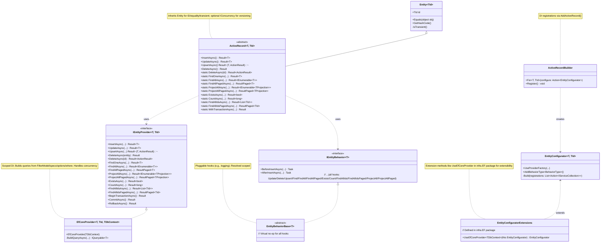
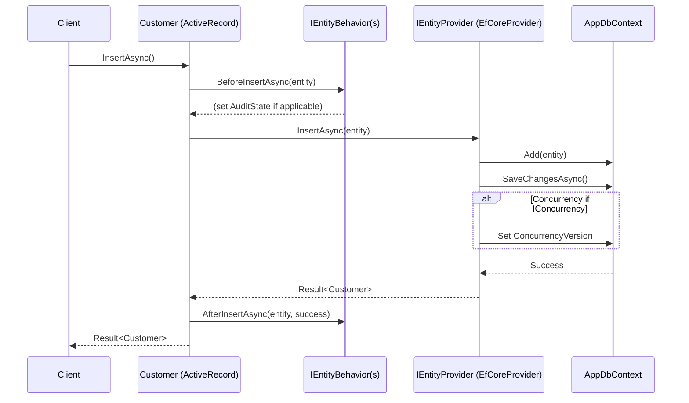

# Active Record Pattern Implementation Design Document

## Overview

This design implements the Active Record pattern in .NET, built on EF Core for persistence, with decoupling via providers, pluggable behaviors, DI integration, and consistent use of the `Result` pattern for all operations (success/failure with messages/errors). Entities inherit from `ActiveRecord<T, TId>`, which extends your framework's `Entity<TId>` for ID handling/equality/transient checks.

Key goals:
- Simplify data access: Embed CRUD/queries/domain logic in entities.
- Flexibility: Swap providers (e.g., EF to Mongo); add behaviors (e.g., logging/validation).
- Testability: Mock providers/behaviors; in-memory EF for tests.
- Consistency: All methods async, support cancellation; return `Result`/ `Result<T>`/`Result<IEnumerable<T>>`/`ResultPaged<T>` where applicable.
- Alignment with your repos: Match `IGenericRepository<TEntity>` functionality (CRUD with ActionResult for upsert/delete, queries with where expr/specs/FilterModel + FindOptions, projections, counts/exists, paged results via ResultPaged<T>).
- Decisions: Overloads prioritize FilterModel (converts to specs + options via builders) for simplicity; + where expr for basic; specs/options for advanced. Paged methods compute count + entities separately. Behaviors resolved scoped from DI. Config centralizes registrations. No batch ops (single entity focus). ID detection for upsert/transient. Concurrency: Optional (if entity implements IConcurrency); handle ConcurrencyVersion in insert/update (set new Guid; original on update for optimistic locking); catch DbUpdateConcurrencyException -> ConcurrencyError with Type/Id. AuditState: Optional (if entity implements IAuditable); handle AuditState/soft delete via behavior.

The pattern suits CRUD-heavy/domain-rich apps, but for complex queries, complement with repos if needed.

### Architecture Diagram



## Architectural Decision Records (ADRs)

### ADR-001: Adoption of Active Record Pattern
- **Context**: Need to simplify data access in domain-rich entities while aligning with existing repo patterns.
- **Decision**: Use Active Record for embedding CRUD/queries in entities; extend with providers/behaviors for decoupling/extensibility. Align with repo features (specs/options/FilterModel) via overloads/builders.
- **Status**: Accepted.
- **Consequences**: Entity-centric API; easier for simple CRUD; may need repos for complex queries. Reuses codebase builders/specs without repo dep.

### ADR-002: Result Pattern for All Operations
- **Context**: Consistent error handling/success indicators across methods.
- **Decision**: All methods return Result/Result<T>/Result<IEnumerable<T>>/ResultPaged<T>; failures include errors like ConcurrencyError/NotFoundError.
- **Status**: Accepted.
- **Consequences**: Transparent outcomes; aligns with repo extensions (e.g., InsertResultAsync). Adds overhead but improves robustness.

### ADR-003: Query Overloads and FilterModel Priority
- **Context**: Support flexible queries like repos (expr/specs/options/FilterModel).
- **Decision**: Prioritize FilterModel overloads (converts to specs/options via builders); add expr/specs/options for advanced. Reuse codebase builders.
- **Status**: Accepted.
- **Consequences**: Matches repo UX; builders handle conversion (e.g., CustomType specs). Ensures no repo dep.

### ADR-004: Paged Results with ResultPaged<T>
- **Context**: Support paging like repo extensions (FindAllResultPagedAsync).
- **Decision**: Add paged methods (FindAllPagedAsync/etc.); compute count separately + entities -> ResultPaged<T> (Success(entities, count, page, pageSize)).
- **Status**: Accepted.
- **Consequences**: Accurate paging; aligns with repo (use FilterModel.Page/PageSize).

### ADR-005: Optional Concurrency via IConcurrency Interface
- **Context**: Support optimistic locking as in repos, but optional.
- **Decision**: If entity implements IConcurrency, handle ConcurrencyVersion in provider (set new Guid on insert/update; original on update/delete; catch DbUpdateConcurrencyException -> ConcurrencyError with Type/Id). Configure IsConcurrencyToken in EF fluent API.
- **Status**: Accepted.
- **Consequences**: User opts-in by adding interface/property; aligns with repo handling. No overhead if not used.

### ADR-006: Reuse from Codebase Without Dependencies
- **Context**: Align with repo logic/builders without importing repo classes.
- **Decision**: Import/reuse specs/options/FilterModel/builders/enums/IConcurrency/ConcurrencyError; adapt repo query building (WhereExpressions/IncludeIf/OrderByIf/etc.) to provider; adapt TypedLogger for logging; adapt IsDefaultId for ID detection.
- **Status**: Accepted.
- **Consequences**: Code reuse for consistency; no repo dep (copy/adapt where needed).

### ADR-007: Extensible EntityConfigurator for Layered Packages
- **Context**: Provider extensions like UseEfCoreProvider in infra layers/packages, not core/domain; not known upfront.
- **Decision**: Define UseEfCoreProvider as extension method on EntityConfigurator<T, TId> in infra.EF package (users reference it to enable); similar for other providers (e.g., Mongo in infra.Mongo). Core has UseProviderFactory for custom.
- **Status**: Accepted.
- **Consequences**: Core package lightweight/no EF dep; extensibility via extensions in provider packages. Users add infra refs as needed.

### ADR-008: Behavior Execution Order
- **Context**: Multiple behaviors per entity; need predictable order (e.g., audit after validation).
- **Decision**: Behaviors resolved as IEnumerable<IEntityBehavior<T>> (DI preserves registration order); execute hooks in sequence (first registered first).
- **Status**: Accepted.
- **Consequences**: Users control order via AddBehaviorType calls; aligns with DI conventions.

### ADR-009: Optional AuditState/SoftDelete via IAuditable Interface
- **Context**: Support auditing/soft delete as in repos, but optional.
- **Decision**: If entity implements IAuditable, use EntityAuditStateBehavior<T> (set AuditState on insert/update/upsert; soft delete intercept as update if enabled; add notDeleted spec to query hooks). Configure via AddBehaviorType with AuditStateBehaviorOptions (ByType/SoftDeleteEnabled). Reuse AuditState/IAuditable/ICurrentUserAccessor.
- **Status**: Accepted.
- **Consequences**: User opts-in by adding interface/property; behavior handles transparently (queries auto-filter). Aligns with repo behavior pattern.

## Requirements and Decisions

### Requirements
- Active Record on EF Core: Persistence in entity classes.
- Result Pattern: All methods return `Result`/ `Result<T>`/`Result<IEnumerable<T>>`/`ResultPaged<T>` (paged for FindAllPaged/ProjectAllPaged/FindAllIdsPaged).
- Providers: Decouple DbContext (IEntityProvider; EfCoreProvider default).
- Behaviors: Hooks before/after ops (CRUD/queries/paged/projections); per-entity, resolved scoped.
- DI: Auto-register providers/behaviors (scoped); global SP post-build.
- Inherit Entity<TId>: For ID equality/transient/unproxied type.
- Queries: FindOne/FindAll/FindAllPaged/Exists/Count/FindAllIds/FindAllIdsPaged/ProjectAll/ProjectAllPaged; overloads (FilterModel + additionalSpecs, where expr + FindOptions, spec + options, specs + options, basic + options).
- Writes: Insert/Update/Delete (entity/ID), Upsert (returns (entity, RepositoryActionResult)).
- Transactions: WithTransactionAsync for atomicity/shared provider.
- Paging/Ordering/Includes/Distinct/NoTracking/Hierarchy: Via IFindOptions<T> (from FilterModel).
- Projections: ProjectAll/ProjectAllPaged<TProjection> with overloads.
- FilterModel: Convert to specs/options via SpecificationBuilder/FindOptionsBuilder; used in overloads for convenience (handles paging/ordering/filters/includes).
- Concurrency: Optional (if entity implements IConcurrency); handle ConcurrencyVersion in insert/update/upsert (set new Guid on insert/update; original on update/delete for optimistic locking); catch DbUpdateConcurrencyException -> ConcurrencyError with Type/Id.
- AuditState: Optional (if entity implements IAuditable); handle AuditState/soft delete via behavior (set on insert/update/upsert/delete; filter queries to exclude deleted).

### Decisions
- Overloads: Prioritize FilterModel (converts to specs + options) for simplicity; + where expr for basic; specs/options for advanced.
- Paged Methods: Separate FindAllPaged (computes count + entities); similar for Ids/Projections. Returns ResultPaged<T> on success.
- Builders: SpecificationBuilder/CustomSpecificationBuilder for FilterModel -> specs; FindOptionsBuilder/IncludeOptionBuilder/OrderOptionBuilder/HierarchyOptionBuilder for FilterModel -> options.
- Behaviors: Extend for paged/projections (new hooks with params); resolve instances scoped in hooks (for deps like ILogger); execute in registration order.
- ID Detection: IsDefaultId for upsert/transient (supports Guid/int/long/string/EntityId wrappers; adapted from repo).
- Exists/Count: No paging/order/includes (only where/specs/FilterModel).
- No Batch: Single entity focus (extend provider if needed).
- Config: AddActiveRecord for registrations; UseActiveRecord for global SP.
- Errors: Use ValidationError/NotFoundError/ExceptionError in providers; behaviors can add.
- Concurrency: Align with repo (set on insert/update/upsert; original on update/delete if not tracked; catch in provider -> ConcurrencyError).
- Reuse from Codebase: Import/reuse Specification/ISpecification (And/Or/Not/HasId); FindOptions/IFindOptions; FilterModel/FilterCriteria/enums; Builders (SpecificationBuilder/CustomSpecificationBuilder/FindOptionsBuilder/etc.); IConcurrency/ConcurrencyError; adapt repo query building (WhereExpressions/IncludeIf/OrderByIf/etc.) to provider's BuildQueryAsync; adapt repo TypedLogger for logging; adapt repo IsDefaultId for ID detection.

## Setup

### DI Registration (Program.cs)
```csharp
builder.Services.AddDbContext<AppDbContext>(options => options.UseSqlServer(connectionString), ServiceLifetime.Scoped);

builder.Services.AddActiveRecord(cfg =>
{
    cfg.For<Customer, Guid>()
        .UseEfCoreProvider<AppDbContext>()  // Extension from infra.EF package
        .AddBehaviorType<LoggingBehavior<Customer>>()
        .AddBehaviorType<EntityAuditStateBehavior<Customer>>(new AuditStateBehaviorOptions { SoftDeleteEnabled = true });

    cfg.For<Address, Guid>()
        .UseEfCoreProvider<AppDbContext>()
        .AddBehaviorType<LoggingBehavior<Address>>();
});

var app = builder.Build();
app.UseActiveRecord(app.Services);  // Sets global SP
app.Run();
```

### EF Configurations (AppDbContext.OnModelCreating)
```csharp
modelBuilder.Entity<Customer>().ToTable("Customers").HasKey(c => c.Id);
modelBuilder.Entity<Customer>().HasMany(c => c.Addresses).WithOne().HasForeignKey(a => a.CustomerId);
modelBuilder.Entity<Address>().ToTable("Addresses").HasKey(a => a.Id);

// For concurrency if IConcurrency
if (typeof(IConcurrency).IsAssignableFrom(typeof(T)))
{
    modelBuilder.Entity<T>().Property(nameof(IConcurrency.ConcurrencyVersion)).IsConcurrencyToken();
}
```

### Custom Behavior (LoggingBehavior<T>)
```csharp
public class LoggingBehavior<T> : EntityBehaviorBase<T> where T : class
{
    private readonly ILogger<LoggingBehavior<T>> logger;

    public LoggingBehavior(ILogger<LoggingBehavior<T>> logger)
    {
        this.logger = logger;
    }

    public override async Task BeforeInsertAsync(T entity, CancellationToken ct)
    {
        logger.LogInformation("Inserting {EntityType}", typeof(T).Name);
        await Task.CompletedTask;
    }

    public override async Task AfterInsertAsync(T entity, bool success, CancellationToken ct)
    {
        logger.LogInformation("Insert {SuccessStatus}", success ? "succeeded" : "failed");
        await Task.CompletedTask;
    }

    // Override other hooks (e.g., BeforeFindAllAsync for queries)
}
```

### Specification/FindOptions Impl (Reuse from Codebase)
Reuse your Specification<T>/ISpecification<T> (ToExpression/And/Or/Not/HasIdSpecification).
Reuse FindOptions<T>/IFindOptions<T> (Skip/Take/NoTracking/Distinct/Orders/Includes/Hierarchy/HasOrders/HasIncludes/HasHierarchy).
Reuse FilterModel/FilterCriteria/enums (FilterOperator/FilterLogicOperator/FilterCustomType/OrderDirection/PageSize).

### Builders (Reuse from Codebase)
Reuse SpecificationBuilder.Build (from FilterModel/Filters -> specs; handles CustomType via CustomSpecificationBuilder.Build).
Reuse FindOptionsBuilder.Build (from FilterModel -> FindOptions with Orders/Includes/Hierarchy/Skip/Take/NoTracking).
Reuse IncludeOptionBuilder.Build (from strings -> IncludeOption<T> expressions).
Reuse OrderOptionBuilder.Build (from FilterOrderCriteria -> OrderOption<T> expressions).
Reuse HierarchyOptionBuilder.Build (from string/maxDepth -> HierarchyOption<T> expression).

## Usage Examples

Assume entities (`Customer` with several `Addresses` as below); optional IConcurrency (add `public Guid ConcurrencyVersion { get; set; }`).

### Entity Examples
```csharp
public class Customer : ActiveRecord<Customer, Guid>, IAuditable
{
    public string FirstName { get; set; }
    public string LastName { get; set; }
    public string Email { get; set; }
    public DateTime DateOfBirth { get; set; }
    public List<Address> Addresses { get; set; } = new();
    public AuditState AuditState { get; set; }
}

public class Address : ActiveRecord<Address, Guid>
{
    public Guid CustomerId { get; set; }
    public string Street { get; set; }
    public string City { get; set; }
    public string ZipCode { get; set; }
    public string Country { get; set; }
    public string Type { get; set; }  // e.g., "Home", "Work"
}
```

### CRUD
```csharp
var customer = new Customer { FirstName = "John", LastName = "Doe", Email = "john.doe@example.com", DateOfBirth = new DateTime(1990, 1, 1) };
var insertResult = await customer.InsertAsync();  // Result<Customer>
if (insertResult.IsSuccess)
{
    Console.WriteLine($"Inserted: {insertResult.Value.Id}");
}

customer.Email = "new.john.doe@example.com";
var updateResult = await customer.UpdateAsync();  // Result<Customer>; fails with ConcurrencyError on mismatch

var upsertResult = await customer.UpsertAsync();  // Result<(Customer, RepositoryActionResult)>
Console.WriteLine(upsertResult.Value.Item2);  // Updated/Inserted

var deleteResult = await customer.DeleteAsync();  // Result
var deleteById = await Customer.DeleteAsync(customer.Id);  // Result<RepositoryActionResult>
```

### Queries
```csharp
// FindOne (overloads: id/options, where/options, spec/options, specs/options, FilterModel/additionalSpecs)
var found = await Customer.FindOneAsync(customer.Id);  // Result<Customer>
var foundWhere = await Customer.FindOneAsync(c => c.Email == "john.doe@example.com");  // Result<Customer>
var foundSpec = new Specification<Customer>(c => c.LastName == "Doe");  // Result<Customer>
var foundSpecs = await Customer.FindOneAsync(new[] { spec1, spec2 });  // Result<Customer>

// Updated FilterModel example using fluent builder
var filterModel = FilterModelBuilder.For<Customer>()
    .SetPaging(2, PageSize.Large) // Fluent paging setup
    .AddFilter(p => p.DateOfBirth.Year, FilterOperator.GreaterThan, 1990) // DateOfBirth.Year > 1990
    .AddFilter(p => p.FirstName, FilterOperator.Contains, "J") // FirstName contains "J"
    .AddFilter(p => p.Addresses,
        FilterOperator.Any, b => b
            .AddFilter(addr => addr.City, FilterOperator.Equal, "Berlin")
            .AddFilter(addr => addr.ZipCode, FilterOperator.StartsWith, "100")) // Any address with City = Berlin or ZipCode starts with "100"
    .AddCustomFilter(FilterCustomType.FullTextSearch)
        .AddParameter("searchTerm", "John")
        .AddParameter("fields", new[] { "FirstName", "LastName" }).Done()
    .AddOrdering(p => p.LastName, OrderDirection.Descending) // Order by LastName Descending
    .AddOrdering(p => p.FirstName, OrderDirection.Ascending) // Then order by FirstName Ascending
    .AddInclude(p => p.Addresses)
    .Build();
var foundFilter = await Customer.FindOneAsync(filterModel);  // Result<Customer>

// FindAll (overloads: options, where/options, spec/options, specs/options, FilterModel/additionalSpecs)
var all = await Customer.FindAllAsync();  // Result<IEnumerable<Customer>>
var allWhere = await Customer.FindAllAsync(c => c.LastName.Contains("Do"));  // With expr
var allSpec = await Customer.FindAllAsync(spec);  // ISpecification
var allSpecs = await Customer.FindAllAsync(specs);  // IEnumerable<ISpecification>
var allFilter = await Customer.FindAllAsync(filter);  // FilterModel + additionalSpecs

// FindAllPaged (returns ResultPaged<Customer>; overloads as above)
var paged = await Customer.FindAllPagedAsync();  // Basic
var pagedWhere = await Customer.FindAllPagedAsync(where, options);  // With paging from options
var pagedSpec = await Customer.FindAllPagedAsync(spec, options);
var pagedSpecs = await Customer.FindAllPagedAsync(specs, options);
var pagedFilter = await Customer.FindAllPagedAsync(filter, additionalSpecs);  // Converts to specs/options, computes count

// Projections (ProjectAllAsync: Result<IEnumerable<TProjection>>; ProjectAllPagedAsync: ResultPaged<TProjection>; overloads as above)
var names = await Customer.ProjectAllAsync(c => c.FullName, filter: filter);  // Paged overload
var pagedNames = await Customer.ProjectAllPagedAsync(c => c.FullName, filter: filter);

// Exists/Count (overloads: basic, where, spec, specs, FilterModel/additionalSpecs)
var exists = await Customer.ExistsAsync(filter);  // Result<bool> with FilterModel
var count = await Customer.CountAsync(filter);  // Result<long>

// FindAllIds/FindAllIdsPaged (overloads as above)
var ids = await Customer.FindAllIdsAsync(filter);  // Result<List<Guid>>
var pagedIds = await Customer.FindAllIdsPagedAsync(filter);  // ResultPaged<Guid>
```

### Transaction
```csharp
var transactionResult = await Customer.WithTransactionAsync(async provider =>
{
    var newCustomer = new Customer { FirstName = "Jane", LastName = "Smith", Email = "jane.smith@example.com", DateOfBirth = new DateTime(1995, 5, 5) };
    var insertCustomer = await newCustomer.InsertAsync(provider);
    if (insertCustomer.IsFailure) return insertCustomer.For<Customer>();

    var newAddress = new Address { CustomerId = newCustomer.Id, Street = "123 Main St", City = "Anytown", ZipCode = "12345", Country = "USA", Type = "Home" };
    var insertAddress = await newAddress.InsertAsync(provider);
    if (insertAddress.IsFailure) return insertAddress.For<Address>();

    return Result.Success();
});
```

### Behaviors
Behaviors run automatically; resolved scoped (e.g., ILogger injected). Extend for paged/projections if needed. Behaviors execute in registration order (first added first).

### Concurrency Example
For Customer implementing IConcurrency:
- On insert: Set ConcurrencyVersion = Guid.NewGuid().
- On update/upsert: Set originalVersion = entity.ConcurrencyVersion, new = Guid.NewGuid(); context.Entry.Property.OriginalValue = originalVersion if not tracked.
- On delete: Set original on loaded entity.
- EF throws DbUpdateConcurrencyException on mismatch (configure IsConcurrencyToken in fluent config) -> Result.Failure with ConcurrencyError (EntityType/Id set).

### AuditState Example
For Customer implementing IAuditable:
```csharp
public class Customer : ActiveRecord<Customer, Guid>, IAuditable
{
    // Properties as above
    public AuditState AuditState { get; set; }
}
```
- On insert: Set CreatedBy/Date/Description.
- On update/upsert: Set UpdatedBy/Date/Description/Reasons.
- On delete (if SoftDeleteEnabled): Set Deleted=true/By/Date/Reason/Description; call Update instead of Delete.
- Queries: Auto-filter !AuditState.Deleted ?? false.

### Test Helpers

#### ActiveRecordTestFixture
Helper class for xUnit tests: Creates test service provider with in-memory DbContext/providers; auto-sets global SP. Use as IClassFixture<ActiveRecordTestFixture> or per-test.

```csharp
public class ActiveRecordTestFixture : IDisposable
{
    public IServiceProvider ServiceProvider { get; private set; }

    public ActiveRecordTestFixture(Action<IServiceCollection> configureServices = null)
    {
        var services = new ServiceCollection();

        // Default in-memory DbContext
        services.AddDbContext<AppDbContext>(options => 
            options.UseInMemoryDatabase(Guid.NewGuid().ToString()), ServiceLifetime.Scoped);  // Unique DB per test

        // Allow custom service config (e.g., mocks)
        configureServices?.Invoke(services);

        this.ServiceProvider = services.BuildServiceProvider();
        ActiveRecordConfigurator.SetGlobalServiceProvider(this.ServiceProvider);  // Set test SP globally
    }

    public void Dispose()
    {
        ActiveRecordConfigurator.SetGlobalServiceProvider(null);  // Reset
    }
}
```

#### Usage in Test
```csharp
public class CustomerActiveRecordTests : IClassFixture<ActiveRecordTestFixture>
{
    private readonly ActiveRecordTestFixture _fixture;

    public CustomerActiveRecordTests(ActiveRecordTestFixture fixture)
    {
        _fixture = fixture;

        // Test-specific config (e.g., add behaviors/mocks)
        _fixture.ServiceProvider.GetRequiredService<IServiceCollection>()  // If needed, but usually in ctor param
            .AddActiveRecord(cfg => cfg.For<Customer, Guid>().UseEfCoreProvider<AppDbContext>());
    }

    [Fact]
    public async Task InsertAndFindCustomer_ShouldSucceed()
    {
        // Arrange
        var customer = new Customer { FirstName = "Test", LastName = "Customer", Email = "test.customer@example.com", DateOfBirth = new DateTime(1990, 1, 1) };

        // Act
        var insertResult = await customer.InsertAsync();
        insertResult.IsSuccess.ShouldBeTrue();

        var found = await Customer.FindOneAsync(customer.Id);
        found.IsSuccess.ShouldBeTrue();

        // Assert
        found.Value.FirstName.ShouldBe("Test");
    }
}
```

## Appendix: Comparison with Repository Pattern and Tradeoffs

### Overview
The Active Record (AR) pattern embeds data access and domain logic directly in entities, making them "active" objects responsible for their own persistence. In contrast, the Repository pattern abstracts persistence behind a repository interface, treating entities as plain data objects (anemic models) and keeping data access separate from domain logic.

The AR implementation mitigates many traditional AR downsides (e.g., tight coupling, bloat, testability) through providers (decouple persistence), behaviors (modularize concerns), and DI (extensibility/testability), while preserving AR's simplicity. It aligns closely with your existing Repository pattern features (e.g., specs/FilterModel/paging/concurrency), allowing hybrid use where needed.

### Pros and Cons of Each Pattern

#### Active Record Pattern (Standard)
- **Pros**:
  - Simplicity: Intuitive for CRUD-heavy apps; less boilerplate (no separate repos).
  - Cohesion: Domain logic and data access in one place; easier for small teams/domains.
  - Discoverability: Entities self-contained (e.g., User.Save()).
- **Cons** (Mitigated in The Design):
  - Tight coupling to persistence (e.g., DB deps in entities).
  - Bloat/god classes as logic grows (validation/auditing/soft delete).
  - Hard to maintain/test (DB mocks needed; side effects).
  - Inflexible for storage changes (e.g., SQL to NoSQL).
  - Violates SRP (entities handle too much).

#### Repository Pattern (Your Implementation)
- **Pros**:
  - Decoupling: Entities pure domain; repos handle persistence (easy swap/mock).
  - SRP: Clear separation (domain vs. infra); flexible for complex queries.
  - Testability: Mock repos easily; no DB in unit tests.
  - Scalability: Handles advanced features (specs/paging/transactions/concurrency).
- **Cons**:
  - Boilerplate: Extra layers (repos/interfaces); anemic entities (logic elsewhere).
  - Indirection: Less intuitive (e.g., repo.Save(user) vs. user.Save()).
  - Overhead: More classes/interfaces for simple CRUD.

### Tradeoffs and How The AR Mitigates AR Downsides
- **Simplicity vs. Flexibility**: AR simpler for basic ops; Repository more flexible for complex/evolving systems. **The AR Tradeoff**: Providers allow storage swap (e.g., EF to Mongo via config/extensions, ADR-007); behaviors modularize features (e.g., audit/soft delete in EntityAuditStateBehavior, ADR-009) without entity bloat.
- **Cohesion vs. Separation**: AR cohesive but risks god classes; Repository separates but can lead to anemic models. **The AR Tradeoff**: Behaviors offload cross-cutting logic (e.g., logging/audit); entities focus on core domain (mitigates bloat via ADR-001/009).
- **Testability**: AR hard to test (DB ties); Repository easy (mock repos). **The AR Tradeoff**: Mock providers/behaviors; in-memory EF via test DI (ActiveRecordTestFixture); global SP settable per test (mitigates via ADR-001).
- **Maintenance**: AR changes risk side effects; Repository isolates infra. **The AR Tradeoff**: Hooks/providers isolate changes (e.g., query logic in provider); behavior order explicit (ADR-008); Result pattern surfaces errors (ADR-002).
- **Performance/Scalability**: Both similar; AR may encourage direct ops. **The AR Tradeoff**: No batch (single focus); but aligns with repo (paging/projections/concurrency, ADR-004/005).
- **Hybrid Use**: For complex queries, use repos alongside AR (e.g., AR for simple CRUD, repos for joins/reports).

**Overall Tradeoff**: The AR offers AR simplicity with Repository-like robustness/flexibility, ideal for domain-centric apps. If domain grows too complex, migrate ops to repos (low friction due to alignment).

### Unmitigated Cons of Active Record
Based on the design's mitigations, all standard AR cons are addressed. No unmitigated cons remain.

### Insert Flow Sequence Diagram


## Appendix: Customer/Order/Book Sample Implementation

This appendix demonstrates how the Active Record design can implement a sample with models like Customer (has_many :orders), Order (belongs_to :customer, has_many :books via "OrdersBooks" join table), Book (has_many :orders via join, has_many :reviews, has_many :authors via "BookAuthors" join table, has_many :suppliers via "SupplierBooks" join table), Review (belongs_to :book), Supplier (has_many :books via join), and Author (has_many :books via join). Entities use GUID IDs, inherit from ActiveRecord<T, Guid>, and implement IAuditable and IConcurrency for auditing/soft delete and optimistic locking.

### Models
```csharp
public class Customer : ActiveRecord<Customer, Guid>, IAuditable, IConcurrency
{
    public string FirstName { get; set; }
    public string LastName { get; set; }
    public string Email { get; set; }
    public DateTime DateOfBirth { get; set; }
    public virtual ICollection<Order> Orders { get; set; } = new List<Order>();
    public AuditState AuditState { get; set; }
    public Guid ConcurrencyVersion { get; set; }
}

public class Order : ActiveRecord<Order, Guid>, IAuditable, IConcurrency
{
    public Guid CustomerId { get; set; }
    public virtual Customer Customer { get; set; }
    public DateTime OrderDate { get; set; }
    public string Status { get; set; }  // e.g., "shipped", "being_packed", "complete", "cancelled"
    public virtual ICollection<Book> Books { get; set; } = new List<Book>();
    public AuditState AuditState { get; set; }
    public Guid ConcurrencyVersion { get; set; }
}

public class Book : ActiveRecord<Book, Guid>, IAuditable, IConcurrency
{
    public string Title { get; set; }
    public bool OutOfPrint { get; set; }
    public decimal Price { get; set; }
    public virtual ICollection<Order> Orders { get; set; } = new List<Order>();
    public virtual ICollection<Review> Reviews { get; set; } = new List<Review>();
    public virtual ICollection<Author> Authors { get; set; } = new List<Author>();
    public virtual ICollection<Supplier> Suppliers { get; set; } = new List<Supplier>();
    public AuditState AuditState { get; set; }
    public Guid ConcurrencyVersion { get; set; }
}

public class Review : ActiveRecord<Review, Guid>, IAuditable, IConcurrency
{
    public Guid BookId { get; set; }
    public virtual Book Book { get; set; }
    public string Content { get; set; }
    public int Rating { get; set; }
    public AuditState AuditState { get; set; }
    public Guid ConcurrencyVersion { get; set; }
}

public class Supplier : ActiveRecord<Supplier, Guid>, IAuditable, IConcurrency
{
    public string Name { get; set; }
    public virtual ICollection<Book> Books { get; set; } = new List<Book>();
    public AuditState AuditState { get; set; }
    public Guid ConcurrencyVersion { get; set; }
}

public class Author : ActiveRecord<Author, Guid>, IAuditable, IConcurrency
{
    public string Name { get; set; }
    public virtual ICollection<Book> Books { get; set; } = new List<Book>();
    public AuditState AuditState { get; set; }
    public Guid ConcurrencyVersion { get; set; }
}
```

### EF Configurations (AppDbContext.OnModelCreating)
```csharp
modelBuilder.Entity<Customer>().ToTable("Customers").HasKey(c => c.Id);
modelBuilder.Entity<Customer>().OwnsOne(c => c.AuditState);  // Owned for AuditState
modelBuilder.Entity<Customer>().HasMany(c => c.Orders).WithOne(o => o.Customer).HasForeignKey(o => o.CustomerId);

modelBuilder.Entity<Order>().ToTable("Orders").HasKey(o => o.Id);
modelBuilder.Entity<Order>().OwnsOne(o => o.AuditState);

modelBuilder.Entity<Book>().ToTable("Books").HasKey(b => b.Id);
modelBuilder.Entity<Book>().OwnsOne(b => b.AuditState);
modelBuilder.Entity<Book>().HasMany(b => b.Reviews).WithOne(r => r.Book).HasForeignKey(r => r.BookId);

modelBuilder.Entity<Review>().ToTable("Reviews").HasKey(r => r.Id);
modelBuilder.Entity<Review>().OwnsOne(r => r.AuditState);

modelBuilder.Entity<Supplier>().ToTable("Suppliers").HasKey(s => s.Id);
modelBuilder.Entity<Supplier>().OwnsOne(s => s.AuditState);

modelBuilder.Entity<Author>().ToTable("Authors").HasKey(a => a.Id);
modelBuilder.Entity<Author>().OwnsOne(a => a.AuditState);

// Join tables
modelBuilder.Entity<Order>()
    .HasMany(o => o.Books)
    .WithMany(b => b.Orders)
    .UsingEntity(j => j.ToTable("OrdersBooks"));

modelBuilder.Entity<Book>()
    .HasMany(b => b.Authors)
    .WithMany(a => a.Books)
    .UsingEntity(j => j.ToTable("BookAuthors"));

modelBuilder.Entity<Book>()
    .HasMany(b => b.Suppliers)
    .WithMany(s => s.Books)
    .UsingEntity(j => j.ToTable("SupplierBooks"));

// For concurrency (all entities implement IConcurrency)
modelBuilder.Entity<Customer>().Property(c => c.ConcurrencyVersion).IsConcurrencyToken();
modelBuilder.Entity<Order>().Property(o => o.ConcurrencyVersion).IsConcurrencyToken();
modelBuilder.Entity<Book>().Property(b => b.ConcurrencyVersion).IsConcurrencyToken();
modelBuilder.Entity<Review>().Property(r => r.ConcurrencyVersion).IsConcurrencyToken();
modelBuilder.Entity<Supplier>().Property(s => s.ConcurrencyVersion).IsConcurrencyToken();
modelBuilder.Entity<Author>().Property(a => a.ConcurrencyVersion).IsConcurrencyToken();
```

### DI Setup (Program.cs - Excerpt)
```csharp
builder.Services.AddDbContext<AppDbContext>(options => options.UseSqlServer(connectionString), ServiceLifetime.Scoped);

builder.Services.AddActiveRecord(cfg =>
{
    cfg.For<Customer, Guid>()
        .UseEfCoreProvider<AppDbContext>()
        .AddBehaviorType<EntityAuditStateBehavior<Customer>>(new AuditStateBehaviorOptions { SoftDeleteEnabled = true });

    cfg.For<Order, Guid>()
        .UseEfCoreProvider<AppDbContext>()
        .AddBehaviorType<EntityAuditStateBehavior<Order>>(new AuditStateBehaviorOptions { SoftDeleteEnabled = true });

    cfg.For<Book, Guid>()
        .UseEfCoreProvider<AppDbContext>()
        .AddBehaviorType<EntityAuditStateBehavior<Book>>(new AuditStateBehaviorOptions { SoftDeleteEnabled = true });

    cfg.For<Review, Guid>()
        .UseEfCoreProvider<AppDbContext>()
        .AddBehaviorType<EntityAuditStateBehavior<Review>>(new AuditStateBehaviorOptions { SoftDeleteEnabled = true });

    cfg.For<Supplier, Guid>()
        .UseEfCoreProvider<AppDbContext>()
        .AddBehaviorType<EntityAuditStateBehavior<Supplier>>(new AuditStateBehaviorOptions { SoftDeleteEnabled = true });

    cfg.For<Author, Guid>()
        .UseEfCoreProvider<AppDbContext>()
        .AddBehaviorType<EntityAuditStateBehavior<Author>>(new AuditStateBehaviorOptions { SoftDeleteEnabled = true });
});
```

### Usage Examples (Mimicking Querying Guide)
These mimic retrieving/conditions/ordering/limiting/including examples using the design's query methods.

#### Retrieving Records
```csharp
// Find by ID
var customer = await Customer.FindOneAsync(guidId);  // Result<Customer>

// Find multiple by IDs
var filterModel = FilterModelBuilder.For<Customer>()
    .AddCustomFilter(FilterCustomType.NumericIn)
        .AddParameter("field", "Id")
        .AddParameter("values", new[] { guidId1, guidId2 }).Done()
    .Build();
var customers = await Customer.FindAllAsync(filterModel);  // Result<IEnumerable<Customer>>

// Take first record
var customer = await Customer.FindOneAsync();  // Result<Customer> (basic overload)

// First record with limit
var filterModel = FilterModelBuilder.For<Customer>()
    .SetPaging(1, 3)
    .Build();
var customers = await Customer.FindAllAsync(filterModel);  // Result<IEnumerable<Customer>>
```

#### Conditions
```csharp
// Equality conditions
var filterModel = FilterModelBuilder.For<Book>()
    .AddFilter(b => b.OutOfPrint, FilterOperator.Equal, true)
    .Build();
var books = await Book.FindAllAsync(filterModel);  // Result<IEnumerable<Book>>

// Parameterized
var filterModel = FilterModelBuilder.For<Book>()
    .AddFilter(b => b.Title, FilterOperator.Equal, "Introduction to Algorithms")
    .Build();
var books = await Book.FindAllAsync(filterModel);

// Range
var yesterday = DateTime.UtcNow.Date.AddDays(-1);
var today = DateTime.UtcNow.Date;
var filterModel = FilterModelBuilder.For<Book>()
    .AddFilter(b => b.CreatedAt, FilterOperator.GreaterThanOrEqual, yesterday)
    .AddFilter(b => b.CreatedAt, FilterOperator.LessThanOrEqual, today)
    .Build();
var books = await Book.FindAllAsync(filterModel);

// NOT
var filterModel = FilterModelBuilder.For<Customer>()
    .AddCustomFilter(FilterCustomType.NumericNotIn)
        .AddParameter("field", "Orders.Count")
        .AddParameter("values", new[] { 1, 3, 5 }).Done()
    .Build();
var customers = await Customer.FindAllAsync(filterModel);

// OR
var filterModel = FilterModelBuilder.For<Customer>()
    .AddFilter(c => c.LastName, FilterOperator.Equal, "Smith", logic: FilterLogicOperator.Or)
    .AddCustomFilter(FilterCustomType.NumericIn)
        .AddParameter("field", "Orders.Count")
        .AddParameter("values", new[] { 1, 3, 5 }).Done()
    .Build();
var customers = await Customer.FindAllAsync(filterModel);
```

#### Ordering
```csharp
// Single field
var filterModel = FilterModelBuilder.For<Book>()
    .AddOrdering(b => b.CreatedAt, OrderDirection.Ascending)
    .Build();
var books = await Book.FindAllAsync(filterModel);

// Multiple fields
var filterModel = FilterModelBuilder.For<Book>()
    .AddOrdering(b => b.Title, OrderDirection.Ascending)
    .AddOrdering(b => b.CreatedAt, OrderDirection.Descending)
    .Build();
var books = await Book.FindAllAsync(filterModel);
```

#### Limiting and Offset
```csharp
// Limit
var filterModel = FilterModelBuilder.For<Customer>()
    .SetPaging(1, 5)
    .Build();
var customers = await Customer.FindAllAsync(filterModel);

// Limit with offset (page 7, size 5 = skip 30)
var filterModel = FilterModelBuilder.For<Customer>()
    .SetPaging(7, 5)
    .Build();
var customers = await Customer.FindAllAsync(filterModel);
```

#### Including Associations
```csharp
// Eager load
var filterModel = FilterModelBuilder.For<Book>()
    .AddInclude(b => b.Authors)
    .SetPaging(1, 10)
    .Build();
var books = await Book.FindAllAsync(filterModel);

// Join/conditions on associated
var filterModel = FilterModelBuilder.For<Book>()
    .AddInclude(b => b.Authors)
    .Build();
var books = await Book.FindAllAsync(filterModel);
```

### Tests (xUnit + Shouldly)
Use in-memory EF for isolation; assume setup with ActiveRecordTestFixture or similar.

```csharp
using Xunit;
using Shouldly;
using Microsoft.EntityFrameworkCore;
using Microsoft.Extensions.DependencyInjection;

public class CustomerOrderBookActiveRecordTests : IClassFixture<ActiveRecordTestFixture>
{
    private readonly ActiveRecordTestFixture _fixture;

    public CustomerOrderBookActiveRecordTests(ActiveRecordTestFixture fixture)
    {
        _fixture = fixture;

        // Configure for sample entities
        _fixture.ServiceProvider.GetRequiredService<IServiceCollection>()
            .AddActiveRecord(cfg =>
            {
                cfg.For<Customer, Guid>().UseEfCoreProvider<AppDbContext>().AddBehaviorType<EntityAuditStateBehavior<Customer>>(new AuditStateBehaviorOptions { SoftDeleteEnabled = true });
                cfg.For<Order, Guid>().UseEfCoreProvider<AppDbContext>().AddBehaviorType<EntityAuditStateBehavior<Order>>(new AuditStateBehaviorOptions { SoftDeleteEnabled = true });
                cfg.For<Book, Guid>().UseEfCoreProvider<AppDbContext>().AddBehaviorType<EntityAuditStateBehavior<Book>>(new AuditStateBehaviorOptions { SoftDeleteEnabled = true });
                cfg.For<Review, Guid>().UseEfCoreProvider<AppDbContext>().AddBehaviorType<EntityAuditStateBehavior<Review>>(new AuditStateBehaviorOptions { SoftDeleteEnabled = true });
                cfg.For<Supplier, Guid>().UseEfCoreProvider<AppDbContext>().AddBehaviorType<EntityAuditStateBehavior<Supplier>>(new AuditStateBehaviorOptions { SoftDeleteEnabled = true });
                cfg.For<Author, Guid>().UseEfCoreProvider<AppDbContext>().AddBehaviorType<EntityAuditStateBehavior<Author>>(new AuditStateBehaviorOptions { SoftDeleteEnabled = true });
            });
    }

    [Fact]
    public async Task InsertCustomerWithOrderBookReviewSupplierAuthor_ShouldSucceed()
    {
        // Arrange
        var author = new Author { Name = "Cormen" };
        var supplier = new Supplier { Name = "Amazon" };
        var book = new Book { Title = "Introduction to Algorithms", OutOfPrint = false, Price = 50.00m };
        book.Authors.Add(author);
        book.Suppliers.Add(supplier);
        var customer = new Customer { FirstName = "John", LastName = "Doe", Email = "john.doe@example.com", DateOfBirth = DateTime.UtcNow };
        var order = new Order { Customer = customer, OrderDate = DateTime.UtcNow, Status = "shipped" };
        order.Books.Add(book);
        customer.Orders.Add(order);
        var review = new Review { Book = book, Content = "Great book!", Rating = 5 };
        book.Reviews.Add(review);

        // Act (in transaction for relations)
        var result = await Customer.WithTransactionAsync(async provider =>
        {
            await author.InsertAsync(provider);
            await supplier.InsertAsync(provider);
            await book.InsertAsync(provider);
            await customer.InsertAsync(provider);
            await order.InsertAsync(provider);
            await review.InsertAsync(provider);
            return Result.Success();
        });

        // Assert
        result.IsSuccess.ShouldBeTrue();
    }

    [Fact]
    public async Task QueryBookWithIncludes_ShouldReturnRelatedData()
    {
        // Arrange: Assume seeded data with Book -> Author/Supplier/Order/Review

        // Act
        var filterModel = FilterModelBuilder.For<Book>()
            .AddInclude(b => b.Authors)
            .AddInclude(b => b.Suppliers)
            .AddInclude(b => b.Orders)
            .AddInclude(b => b.Reviews)
            .Build();
        var books = await Book.FindAllAsync(filterModel);

        // Assert
        books.IsSuccess.ShouldBeTrue();
        books.Value.First().Authors.ShouldNotBeEmpty();
        books.Value.First().Suppliers.ShouldNotBeEmpty();
        books.Value.First().Orders.ShouldNotBeEmpty();
        books.Value.First().Reviews.ShouldNotBeEmpty();
    }

    [Fact]
    public async Task QueryWithEqualityCondition_ShouldFilterCorrectly()
    {
        // Arrange: Assume seeded data

        // Act
        var filterModel = FilterModelBuilder.For<Book>()
            .AddFilter(b => b.OutOfPrint, FilterOperator.Equal, false)
            .Build();
        var books = await Book.FindAllAsync(filterModel);

        // Assert
        books.IsSuccess.ShouldBeTrue();
        books.Value.ShouldAllBe(b => !b.OutOfPrint);
    }

    [Fact]
    public async Task QueryWithRangeCondition_ShouldFilterCorrectly()
    {
        // Arrange: Assume seeded data

        // Act
        var minPrice = 20.00m;
        var maxPrice = 100.00m;
        var filterModel = FilterModelBuilder.For<Book>()
            .AddFilter(b => b.Price, FilterOperator.GreaterThanOrEqual, minPrice)
            .AddFilter(b => b.Price, FilterOperator.LessThanOrEqual, maxPrice)
            .Build();
        var books = await Book.FindAllAsync(filterModel);

        // Assert
        books.IsSuccess.ShouldBeTrue();
        books.Value.ShouldAllBe(b => b.Price >= minPrice && b.Price <= maxPrice);
    }

    [Fact]
    public async Task QueryWithNotCondition_ShouldFilterCorrectly()
    {
        // Arrange: Assume seeded data

        // Act
        var filterModel = FilterModelBuilder.For<Customer>()
            .AddCustomFilter(FilterCustomType.NumericNotIn)
                .AddParameter("field", "Orders.Count")
                .AddParameter("values", new[] { 1, 3, 5 }).Done()
            .Build();
        var customers = await Customer.FindAllAsync(filterModel);

        // Assert
        customers.IsSuccess.ShouldBeTrue();
        customers.Value.ShouldAllBe(c => !new[] { 1, 3, 5 }.Contains(c.Orders.Count));
    }

    [Fact]
    public async Task QueryWithOrCondition_ShouldFilterCorrectly()
    {
        // Arrange: Assume seeded data

        // Act
        var filterModel = FilterModelBuilder.For<Customer>()
            .AddFilter(c => c.LastName, FilterOperator.Equal, "Smith", logic: FilterLogicOperator.Or)
            .AddCustomFilter(FilterCustomType.NumericIn)
                .AddParameter("field", "Orders.Count")
                .AddParameter("values", new[] { 1, 3, 5 }).Done()
            .Build();
        var customers = await Customer.FindAllAsync(filterModel);

        // Assert
        customers.IsSuccess.ShouldBeTrue();
        customers.Value.ShouldAllBe(c => c.LastName == "Smith" || new[] { 1, 3, 5 }.Contains(c.Orders.Count));
    }

    [Fact]
    public async Task QueryWithSingleOrdering_ShouldSortCorrectly()
    {
        // Arrange: Assume seeded data

        // Act
        var filterModel = FilterModelBuilder.For<Book>()
            .AddOrdering(b => b.CreatedAt, OrderDirection.Ascending)
            .Build();
        var books = await Book.FindAllAsync(filterModel);

        // Assert
        books.IsSuccess.ShouldBeTrue();
        books.Value.ShouldBeInOrder(SortDirection.Ascending, b => b.CreatedAt);
    }

    [Fact]
    public async Task QueryWithMultipleOrdering_ShouldSortCorrectly()
    {
        // Arrange: Assume seeded data

        // Act
        var filterModel = FilterModelBuilder.For<Book>()
            .AddOrdering(b => b.Price, OrderDirection.Ascending)
            .AddOrdering(b => b.Title, OrderDirection.Descending)
            .Build();
        var books = await Book.FindAllAsync(filterModel);

        // Assert
        books.IsSuccess.ShouldBeTrue();
        // Verify multi-sort: first ascending price, then descending title
        books.Value.ShouldBeOrderedBy(b => b.Price).ThenByDescending(b => b.Title);
    }

    [Fact]
    public async Task QueryWithLimiting_ShouldReturnLimitedResults()
    {
        // Arrange: Assume at least 10 seeded books

        // Act
        var filterModel = FilterModelBuilder.For<Book>()
            .SetPaging(1, 5)
            .Build();
        var books = await Book.FindAllAsync(filterModel);

        // Assert
        books.IsSuccess.ShouldBeTrue();
        books.Value.Count().ShouldBe(5);
    }

    [Fact]
    public async Task QueryWithOffsetAndLimiting_ShouldSkipAndLimit()
    {
        // Arrange: Assume at least 35 seeded books ordered by CreatedAt ascending

        // Act
        var filterModel = FilterModelBuilder.For<Book>()
            .SetPaging(7, 5)  // Skip 30, take 5
            .AddOrdering(b => b.CreatedAt, OrderDirection.Ascending)
            .Build();
        var books = await Book.FindAllAsync(filterModel);

        // Assert
        books.IsSuccess.ShouldBeTrue();
        books.Value.Count().ShouldBe(5);
        // Verify skip: compare to full list sliced [30:35]
    }

    [Fact]
    public async Task QueryWithContainsCondition_ShouldFilterCorrectly()
    {
        // Arrange: Assume seeded data

        // Act
        var filterModel = FilterModelBuilder.For<Book>()
            .AddFilter(b => b.Title, FilterOperator.Contains, "Algorithm")
            .Build();
        var books = await Book.FindAllAsync(filterModel);

        // Assert
        books.IsSuccess.ShouldBeTrue();
        books.Value.ShouldAllBe(b => b.Title.Contains("Algorithm"));
    }

    [Fact]
    public async Task QueryWithGreaterThanCondition_ShouldFilterCorrectly()
    {
        // Arrange: Assume seeded data

        // Act
        var filterModel = FilterModelBuilder.For<Review>()
            .AddFilter(r => r.Rating, FilterOperator.GreaterThan, 3)
            .Build();
        var reviews = await Review.FindAllAsync(filterModel);

        // Assert
        reviews.IsSuccess.ShouldBeTrue();
        reviews.Value.ShouldAllBe(r => r.Rating > 3);
    }

    [Fact]
    public async Task QueryWithAnyConditionOnCollection_ShouldFilterCorrectly()
    {
        // Arrange: Assume seeded data

        // Act
        var filterModel = FilterModelBuilder.For<Book>()
            .AddFilter(b => b.Authors,
                FilterOperator.Any, ab => ab
                    .AddFilter(a => a.Name, FilterOperator.Equal, "Cormen"))
            .Build();
        var books = await Book.FindAllAsync(filterModel);

        // Assert
        books.IsSuccess.ShouldBeTrue();
        books.Value.ShouldAllBe(b => b.Authors.Any(a => a.Name == "Cormen"));
    }

    [Fact]
    public async Task QueryWithAllConditionOnCollection_ShouldFilterCorrectly()
    {
        // Arrange: Assume seeded data

        // Act
        var filterModel = FilterModelBuilder.For<Book>()
            .AddFilter(b => b.Suppliers,
                FilterOperator.All, sb => sb
                    .AddFilter(s => s.Name, FilterOperator.Contains, "Am"))
            .Build();
        var books = await Book.FindAllAsync(filterModel);

        // Assert
        books.IsSuccess.ShouldBeTrue();
        books.Value.ShouldAllBe(b => b.Suppliers.All(s => s.Name.Contains("Am")));
    }

    [Fact]
    public async Task QueryWithNoneConditionOnCollection_ShouldFilterCorrectly()
    {
        // Arrange: Assume seeded data

        // Act
        var filterModel = FilterModelBuilder.For<Book>()
            .AddFilter(b => b.Reviews,
                FilterOperator.None, rb => rb
                    .AddFilter(r => r.Rating, FilterOperator.LessThan, 3))
            .Build();
        var books = await Book.FindAllAsync(filterModel);

        // Assert
        books.IsSuccess.ShouldBeTrue();
        books.Value.ShouldAllBe(b => !b.Reviews.Any(r => r.Rating < 3));
    }

    [Fact]
    public async Task QueryWithCustomFullTextSearch_ShouldFilterCorrectly()
    {
        // Arrange: Assume seeded data and FullTextSearch support

        // Act
        var filterModel = FilterModelBuilder.For<Book>()
            .AddCustomFilter(FilterCustomType.FullTextSearch)
                .AddParameter("searchTerm", "Algorithm")
                .AddParameter("fields", new[] { "Title", "Description" }).Done()
            .Build();
        var books = await Book.FindAllAsync(filterModel);

        // Assert
        books.IsSuccess.ShouldBeTrue();
        // Verify full-text match via assertions
    }

    [Fact]
    public async Task QueryWithOrderingAndConditions_ShouldFilterAndSort()
    {
        // Arrange: Assume seeded data

        // Act
        var filterModel = FilterModelBuilder.For<Order>()
            .AddFilter(o => o.Status, FilterOperator.Equal, "shipped")
            .AddOrdering(o => o.OrderDate, OrderDirection.Descending)
            .Build();
        var orders = await Order.FindAllAsync(filterModel);

        // Assert
        orders.IsSuccess.ShouldBeTrue();
        orders.Value.ShouldAllBe(o => o.Status == "shipped");
        orders.Value.ShouldBeInOrder(SortDirection.Descending, o => o.OrderDate);
    }

    [Fact]
    public async Task QueryWithPagingAndIncludes_ShouldPaginateAndEagerLoad()
    {
        // Arrange: Assume seeded data

        // Act
        var filterModel = FilterModelBuilder.For<Customer>()
            .SetPaging(1, 10)
            .AddInclude(c => c.Orders)
            .Build();
        var customers = await Customer.FindAllAsync(filterModel);

        // Assert
        customers.IsSuccess.ShouldBeTrue();
        customers.Value.Count().ShouldBeLessThanOrEqualTo(10);
        customers.Value.First().Orders.ShouldNotBeEmpty();
    }

    // More tests for conditions/ordering/limiting similar to querying patterns...
}
```