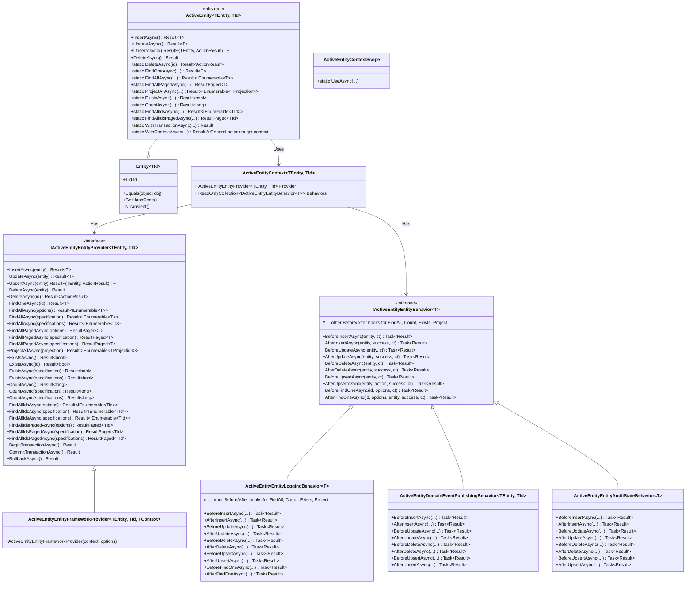
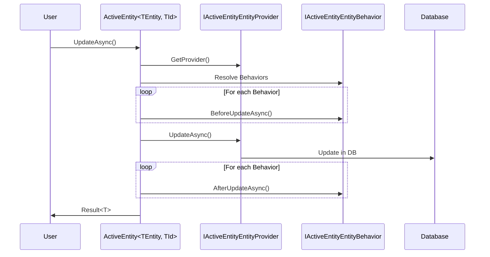
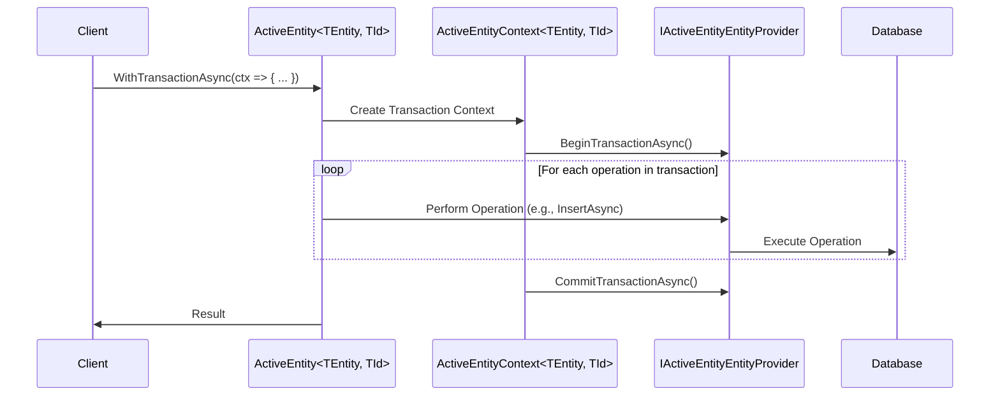

# ActiveEntity Feature Documentation

[TOC]

## Overview

The ActiveEntity feature in the bITDevKit reimagines the classic [Active Record pattern](https://en.wikipedia.org/wiki/Active_record_pattern), for .NET developers. This modern take embeds CRUD operations and queries directly into entity classes, providing a streamlined data access solution. Unlike its traditional form, it is persistence-neutral, relying on pluggable providers that can integrate with Entity Framework Core (EF Core), in-memory stores or custom data sources, configurable per entity. Entities inherit from `ActiveEntity<TEntity, TId>`, extending the `Entity<TId>` base class for ID handling, equality and transient checks, while employing the `Result` pattern for consistent operation outcomes (success/failure with messages and errors). Tailored for developers building CRUD-heavy or domain-rich applications, it complements complex query needs with repository patterns when necessary, aligning with the bITdevKit commitment to modular, effective solutions.

## Challenges

Managing data access in modern applications often involves repetitive CRUD code that obscures business logic, tight coupling to specific persistence technologies and difficulties in testing or extending functionality. Consistency in error handling across operations is elusive, while adding concerns like auditing or logging requires significant refactoring. The classic ActiveEntity pattern, while intuitive, traditionally struggles with inflexibility when switching data stores and poor separation of concerns, limiting its adaptability to evolving needs.

## Solution

This contemporary ActiveEntity implementation tackles these issues by embedding persistence logic within entities while decoupling data access through interchangeable providers, configurable per entity for multi-store support. It supports diverse persistence mechanisms, ensuring flexibility beyond EF Core to include in-memory or custom solutions. Pluggable behaviors manage cross-cutting concerns like logging and auditing, resolved via dependency injection (DI) for extensibility and testability. The `Result` pattern unifies operation outcomes, reducing boilerplate and enhancing robustness. This evolution retains the classic pattern's simplicity for CRUD operations while introducing modularity and neutrality, making it versatile for .NET applications.

## Key Features

-   **Persistence Neutrality**: Supports multiple providers (e.g., EF Core, InMemory) per entity without altering entity code.
-   **Embedded Operations**: Entities include CRUD and query methods, minimizing boilerplate.
-   **Pluggable Behaviors**: Extensible hooks for logging, auditing and domain event publishing.
-   **DI Integration**: Seamless integration with ASP.NET Core DI for provider and behavior resolution.
-   **Result Pattern**: Consistent success/failure handling with `Result`, `Result<T>` and `ResultPaged<T>`.
-   **Testability**: InMemory provider facilitates unit testing.
-   **Concurrency and Auditing**: Optional support via `IConcurrency` and `IAuditable` interfaces.

## Architecture

### Pattern

The [Active Record pattern is described by Martin Fowler](https://www.martinfowler.com/eaaCatalog/activeRecord.html) in the book Patterns of Enterprise Architecture as "an object that wraps a row in a database table, encapsulates the database access, and adds domain logic to that data." ActiveEntity objects carry both data and behavior.

### Components

The feature centers on `ActiveEntity<TEntity, TId>`, which embeds persistence logic and delegates to an `IActiveEntityEntityProvider<TEntity, TId>` for data access. Behaviors, implementing `IActiveEntityEntityBehavior<T>`, intercept operations to manage concerns like logging or auditing, executed in registration order. The global service provider, configured via `ActiveEntityConfigurator`, resolves these components at runtime, ensuring flexibility and testability.
The **`ActiveEntityContext<TEntity, TId>`** is a lightweight object that bundles the `IActiveEntityEntityProvider` and its associated `IActiveEntityEntityBehavior` instances, ensuring that all components within a given operation share the same underlying DI scope and transactional context, simplifying complex scenarios.



### Sequence Diagram for Update Operation



The architecture resolves providers and behaviors via the global service provider, executing hooks sequentially. Providers manage database interactions, while behaviors handle additional logic like auditing or event publishing, ensuring a modular and extensible design.

## Use Cases

This feature suits scenarios where simplicity is key or reducing dependencies on additional layers like repositories is beneficial. For example, an e-commerce platform can manage `Customer` and `Order` entities with minimal setup, avoiding repository overhead. It supports rapid prototyping with an InMemory provider, implements auditing for compliance and is ideal for test-driven development with isolated unit tests. It also supports Domain-Driven Design (DDD) scenarios with domain events and typed IDs, leveraging EF Core features for complete aggregates.

## Basic Usage

Begin by defining an entity class and setting up the DI configuration. The following example uses the `Customer` entity from the integration tests.

### Class Definition and Setup

```csharp
// Entity Definition
[TypedEntityId<Guid>] // Generates CustomerId
public class Customer : ActiveEntity<Customer, CustomerId>, IAuditable, IConcurrency
{
    public string FirstName { get; set; }
    public string LastName { get; set; }
    public string Title { get; set; }
    public EmailAddressStub Email { get; set; }
    public int Visits { get; set; } = 0;
}

// DI Setup
services.AddDbContext<DbContext>(options => options.UseSqlServer(connectionString)); // register dbContext
services.AddActiveEntity(cfg => // configure ActiveEntity
{
    cfg.For<Customer, CustomerId>()
        .UseEntityFrameworkProvider(o => o.UseContext<DbContext>())
        .AddLoggingBehavior()
        .AddAuditStateBehavior(new ActiveEntityEntityAuditStateBehaviorOptions { SoftDeleteEnabled = true });
});
ActiveEntityConfigurator.SetGlobalServiceProvider(services.BuildServiceProvider());
// or when using ASP.NET
app.UseActiveEntity(app.Services);
```

### Insert a new entity

```csharp
var customer = new Customer
{
    FirstName = "John",
    LastName = "Doe",
    Title = "Mr."
};
var insertResult = await customer.InsertAsync();

if (insertResult.IsSuccess)
{
    var insertedCustomer = insertResult.Value;
    Console.WriteLine($"Inserted customer ID: {insertedCustomer.Id}");
}
```

### Insert multiple entities

```csharp
var results = await Customer.InsertAsync(
[
    new() { FirstName = "John", LastName = "Doe", Email = EmailAddressStub.Create("john.doe@example.com"), Title = "Mr." },
    new() { FirstName = "Jane", LastName = "Doe", Email = EmailAddressStub.Create("jane.doe@example.com"), Title = "Ms." }
]);

foreach (var result in results)
{
    var customer = result.Value;
    Console.WriteLine($"Inserted customer ID: {customer.Id}");
}
```

### Update an existing entity

First, load the entity, modify it and then call `UpdateAsync`.

```csharp
var customer = (await Customer.FindOneAsync(customerId)).Value;
customer.FirstName = "Janet";
var updateResult = await customer.UpdateAsync();

if (updateResult.IsSuccess)
{
    var updatedCustomer = updateResult.Value;
    Console.WriteLine($"Updated customer ID: {updatedCustomer.Id}");
}
```

### Update multiple existing entities

First, load the entities, modify them and then call `UpdateAsync` with a collection.

```csharp
var customer1 = (await Customer.FindOneAsync(customerId1)).Value;
var customer2 = (await Customer.FindOneAsync(customerId2)).Value;
customer1.FirstName = "Janet";
customer2.FirstName = "Johnu";

await Customer.UpdateAsync([customer1, customer2]);
```

### Update existing entity properties directly

For an entity instance only specific properties are updated using a fluent syntax.

```csharp
var customer = (await Customer.FindOneAsync(customerId)).Value;
var updateResult = await customer.UpdateAsync(u => u
    .Set(c => c.FirstName, "Janet")              // constant assignment
    .Set(c => c.Visits, c => c.Visits + 1)       // computed assignment
    .Set(c => c.Title, _ => "Archived"));        // dynamic constant

if (updateResult.IsSuccess)
{
    Console.WriteLine($"Updated customer ID: {updateResult.Value.Id}");
}
```

### Update multiple entities their properties directly

Use `UpdateSetAsync` to update multiple entities in one operation without loading them individually.

```csharp
// update set: deactivate all customers with LastName = "Doe"
var updateResult = await Customer.UpdateSetAsync(
    c => c.LastName == "Doe",
    set => set
        .Set(c => c.IsActive, false)                 // constant assignment
        .Set(c => c.Visits, c => c.Visits + 1)       // computed assignment
        .Set(c => c.Title, _ => "Archived"));        // dynamic constant

if (updateResult.IsSuccess)
{
    Console.WriteLine($"Updated {updateResult.Value} customers");
}
```

### Delete an existing entity

First, load the entity and then call `DeleteAsync`.

```csharp
var customer = (await Customer.FindOneAsync(customerId)).Value;
var deleteResult = await customer.DeleteAsync();

if (deleteResult.IsSuccess)
{
    Console.WriteLine($"Deleted customer ID: {customer.Id}");
}
```

### Delete multiple existing entities

First, load the entities and then call `DeleteAsync` with a collection.

```csharp
var customer1 = (await Customer.FindOneAsync(customerId1)).Value;
var customer2 = (await Customer.FindOneAsync(customerId2)).Value;

await Customer.DeleteAsync([customer1, customer2]);
```

### Delete multiple existing entities by ID

First, load the entities and then call `DeleteAsync` with a collection of IDs.

```csharp
var customer1 = (await Customer.FindOneAsync(customerId1)).Value;
var customer2 = (await Customer.FindOneAsync(customerId2)).Value;

await Customer.DeleteAsync([customer1.Id, customer2.Id]);
```

### Delete a set of entities directly

Use `DeleteSetAsync` to delete multiple entities in one operation.

```csharp
// delete set: remove all customers with LastName = "Doe"
var deleteResult = await Customer.DeleteSetAsync(
    c => c.LastName == "Doe");

if (deleteResult.IsSuccess)
{
    Console.WriteLine($"Deleted {deleteResult.Value} customers");
}
```

### Find a single entity by ID

Find an entity by its ID.

```csharp
var findResult = await Customer.FindOneAsync(customerId);
if (findResult.IsSuccess)
{
    var customer = findResult.Value;
    Console.WriteLine($"Found customer: {customer.FirstName} {customer.LastName}");
}
```

### Find multiple entities (unfiltered)

```csharp
var findAllResult = await Customer.FindAllAsync();
if (findAllResult.IsSuccess)
{
    var customers = findAllResult.Value;
    foreach (var customer in customers)
    {
        Console.WriteLine(customer.FirstName);
    }
}
```

### Find multiple entities (filtered)

```csharp
var findAllResult = await Customer.FindAllAsync(e => e.LastName == "Doe");
if (findAllResult.IsSuccess)
{
    var customers = findAllResult.Value;
    foreach (var customer in customers)
    {
        Console.WriteLine(customer.LastName);
    }
}
```

### Find multiple entities with a specification as a paged result

```csharp
var options = new FindOptions<Customer> { Skip = 0, Take = 10 };
var pagedResult = await Customer.FindAllPagedAsync(options);
if (pagedResult.IsSuccess)
{
    var customers = pagedResult.Value.Items;
    var totalCount = pagedResult.Value.TotalCount;
    Console.WriteLine($"Total customers: {totalCount}");
}
```

### General Context Access (`WithContextAsync`)

For scenarios where you need to perform **multiple ActiveEntity actions within a single, consistent scope (provider)**, but *not* necessarily as part of a transaction, you can use the static `ActiveEntity.WithContextAsync` helpers. These methods ensure that all subsequent operations within your delegate use the same provider instance and set of behaviors, guaranteeing consistency and avoiding scope-related issues.

```csharp
// Example: Performing multiple operations with a guaranteed single provider instance
public static class CustomerService
{
    public static Task<Result> RegisterNewCustomerAndLogAsync(Customer newCustomer, CancellationToken ct = default)
    {
        return Customer.WithContextAsync(async ctx => // ctx contains provider and behaviors, scoped for this operation
        {
            var insertResult = await newCustomer.InsertAsync(ctx); // Use the provided ctx
            if (insertResult.IsFailure) return insertResult;

            // Perform another operation using the same provider instance (ctx.Provider)
            var updatedCustomer = (await ctx.Provider.FindOneAsync(newCustomer.Id, null, ct)).Value;
            if (updatedCustomer == null) return Result.Failure("Customer not found after insert.");

            updatedCustomer.Visits = 1;
            var updateResult = await updatedCustomer.UpdateAsync(ctx); // Use the same ctx for consistency
            if (updateResult.IsFailure) return updateResult;

            // Behaviors are automatically available in the context
            foreach (var behavior in ctx.Behaviors)
            {
                // Example: custom logging behavior specific to this service's logic
                // You might need to adjust the behavior interface to accept additional arguments
                // await behavior.LogSomethingAsync(updatedCustomer, ct);
            }

            return Result.Success();
        });
    }
}

// Usage:
var newCustomer = new Customer { FirstName = "Bob", LastName = "Builder" };
var serviceResult = await CustomerService.RegisterNewCustomerAndLogAsync(newCustomer);
if (serviceResult.IsSuccess) { /* ... */ }
```

### Transactions (`WithTransactionAsync`)

Use `WithTransactionAsync` to execute multiple operations **atomically** within a single database transaction, with automatic commit on success and rollback on failure. This helper manages a dedicated scope and creates an `ActiveEntityContext` for your transaction. All ActiveEntity operations within your delegate *must* use this provided context (`ctx`) to ensure they operate on the same provider instance and share the same `DbContext` (if using EF Core) for the duration of the transaction. If your action completes successfully, the transaction is committed; otherwise, it's rolled back.

```csharp
var customer = new Customer
{
    FirstName = "John",
    LastName = "Doe",
    Email = EmailAddressStub.Create("john.doe@example.com"),
    Title = "Mr."
};
var transactionResult = await Customer.WithTransactionAsync(async ctx => // ctx contains provider and behaviors
{
    // All CRUD operations within this block must use the provided 'ctx'
    var insertResult = await customer.InsertAsync(ctx);
    if (insertResult.IsFailure) return Result.Failure(insertResult.Errors); // propagate failure, will trigger rollback

    // Perform another operation in the same transaction
    var updatedCustomer = (await ctx.Provider.FindOneAsync(customer.Id)).Value;
    if (updatedCustomer == null) return Result.Failure("Customer not found in transaction.");

    updatedCustomer.Title = "Sir";
    var updateResult = await updatedCustomer.UpdateAsync(ctx); // use ctx to ensure it's part of the same transaction
    if (updateResult.IsFailure) return Result.Failure(updateResult.Errors); // propagate failure, will trigger rollback

    return Result.Success(); // If all operations succeed, transaction commits here
});

if (transactionResult.IsSuccess)
{
    Console.WriteLine($"Transaction committed for customer ID: {customer.Id}");
}
else
{
    Console.WriteLine($"Transaction failed and rolled back: {transactionResult.Errors}");
}
```

You can also return a value from a transaction using `WithTransactionAsync<T>`:

```csharp
var newCustomer = new Customer { FirstName = "Alice", LastName = "Wonder" };

var transactionResultWithReturn = await Customer.WithTransactionAsync<Customer>(async ctx =>
{
    var insertResult = await newCustomer.InsertAsync(ctx);
    if (insertResult.IsFailure) return Result<Customer>.Failure(insertResult.Errors);
    return Result.Success(insertResult.Value); // Return the inserted customer
});

if (transactionResultWithReturn.IsSuccess)
{
    Console.WriteLine($"Transaction committed. New customer ID: {transactionResultWithReturn.Value.Id}");
}
else
{
    Console.WriteLine($"Transaction failed: {transactionResultWithReturn.Errors}");
}
```

This diagram illustrates how multiple operations are executed within a single transaction using WithTransactionAsync.


## Behaviors

Behaviors enhance entities with cross-cutting concerns, executed in registration order within the ActiveEntity pipeline. Each behavior intercepts specific operations (e.g., insert, update, delete) to add functionality such as logging, event publishing, auditing, or validation, ensuring modularity and extensibility. Note that **behavior hooks no longer receive the `IActiveEntityEntityProvider` as a direct parameter**, as the provider is now encapsulated within the `ActiveEntityContext` which is made available to the CRUD method calling the behavior.

### LoggingBehavior

Logs all operations for debugging purposes.

-   **Example**:
    ```csharp
    services.AddActiveEntity(cfg =>
    {
        cfg.For<Customer, CustomerId>()
            .UseEntityFrameworkProvider(o => o.UseContext<ActiveEntityDbContext>())
            .AddLoggingBehavior();
    });
    ```

    This configuration logs details of CRUD operations (e.g., insert, update, delete) for `Customer` entities, including entity state and operation outcomes, using the configured logger.

### DomainEventPublishingBehavior

Publishes domain events before or after operations.

-   **Example**:
    ```csharp
    services.AddActiveEntity(cfg =>
    {
        cfg.For<Customer, CustomerId>()
            .UseEntityFrameworkProvider(o => o.UseContext<ActiveEntityDbContext>())
            .AddDomainEventPublishingBehavior(new ActiveEntityDomainEventPublishingBehaviorOptions { PublishBefore = false });
    });
    ```

    This setup ensures domain events (e.g., `CustomerCreatedDomainEvent`) are published after successful operations, such as after an insert or update, using the registered `IDomainEventPublisher`.

### AuditStateBehavior

Manages audit trails and optional soft deletes.

-   **Example**:
    ```csharp
    services.AddActiveEntity(cfg =>
    {
        cfg.For<Customer, CustomerId>()
            .UseEntityFrameworkProvider(o => o.UseContext<ActiveEntityDbContext>())
            .AddAuditStateBehavior(new ActiveEntityEntityAuditStateBehaviorOptions { SoftDeleteEnabled = false });
    });
    ```

    This configuration tracks audit information (e.g., `CreatedBy`, `UpdatedDate`) for `Customer` entities and optionally enables soft deletes, marking entities as deleted without removing them from the database.

### AnnotationsValidatorBehavior (DataAnnotations)

Validates entity properties using System.ComponentModel.DataAnnotations attributes before persistence operations. Supported annotations include:
-   [Required]: Ensures a property is not null or empty.
-   [MinLength], [MaxLength], [StringLength]: Enforce minimum and/or maximum length for strings.
-   [Range]: Ensures a numeric value falls within a specified range.
-   [RegularExpression]: Validates a string against a regex pattern.
-   [EmailAddress]: Checks for a valid email format.
-   [Compare]: Ensures two properties have the same value.
-   [Url], [Phone]: Validate URL or phone number formats.

-   **Example**:
    ```csharp
    services.AddActiveEntity(cfg =>
    {
        cfg.For<Supplier, Guid>()
            .UseEntityFrameworkProvider(o => o.Context<ActiveEntityDbContext>())
            .AddAnnotationsValidator();
    });
    ```

    ```csharp
    // Entity with DataAnnotations
    public class Supplier : ActiveEntity<Supplier, Guid>, IAuditable, IConcurrency
    {
        [Required]
        [MinLength(3)]
        [MaxLength(100)]
        public string Name { get; set; }

        [Required]
        [RegularExpression(@"^[^@\s]+@[^@\s]+\.[^@\s]+$")]
        public string Email { get; set; }

        [Range(1, 5)]
        public int Rating { get; set; }

        public ICollection<Book> Books { get; set; } = [];
        public AuditState AuditState { get; set; } = new AuditState();
        public Guid ConcurrencyVersion { get; set; }
    }

    // Usage
    var supplier = new Supplier
    {
        Name = "Penguin", // Valid
        Email = "contact@penguin.com", // Valid
        Rating = 4 // Valid
    };
    var insertResult = await supplier.InsertAsync(); // Succeeds

    var invalidSupplier = new Supplier
    {
        Name = "A", // Too short
        Email = "invalid-email", // Invalid format
        Rating = 6 // Out of range
    };
    var invalidInsertResult = await invalidSupplier.InsertAsync(); // Fails with ValidationError
    ```

    This behavior validates `Supplier` properties against their DataAnnotations before insert, update, or delete operations. If validation fails, a `Result` with a `ValidationError` is returned, detailing the specific issues (e.g., "Name must be at least 3 characters long").

### ValidatorBehavior<TValidator> (FluentValidation)

Enables custom validation logic using FluentValidation validators, allowing complex business rules to be applied selectively to insert, update, or delete operations.

-   **Example**:
    ```csharp
    // Custom FluentValidation validator
    public class BasicCustomerValidator : AbstractValidator<Customer>
    {
        public BasicCustomerValidator()
        {
            RuleFor(c => c.FirstName).NotEmpty().WithMessage("First name is required");
            RuleFor(c => c.LastName).NotEmpty().WithMessage("Last name is required");
        }
    }

    public class BusinessCustomerValidator : AbstractValidator<Customer>
    {
        public BusinessCustomerValidator()
        {
            RuleFor(c => c.Email).NotEmpty().EmailAddress().WithMessage("Valid email is required");
        }
    }

    public class DeleteCustomerValidator : AbstractValidator<Customer>
    {
        public DeleteCustomerValidator()
        {
            RuleFor(c => c.Id).MustAsync(async (id, ct) =>
            !(await Order.ExistsAsync(o => o.CustomerId == id && o.Status == OrderStatus.Pending, null, ct)).Value)
              .WithMessage("Cannot delete customer with pending orders.");
        }
    }

    // Configuration
    services.AddActiveEntity(cfg =>
    {
        cfg.For<Customer, CustomerId>()
            .UseEntityFrameworkProvider(o => o.Context<ActiveEntityDbContext>())
            .AddValidatorBehavior<Customer, CustomerId, BasicCustomerValidator>(o => o.ApplyOnInsert())
            .AddValidatorBehavior<Customer, CustomerId, BusinessCustomerValidator>(o => o.ApplyOnUpdate())
            .AddValidatorBehavior<Customer, CustomerId, DeleteCustomerValidator>(o => o.ApplyOnDelete());
    });

    // Usage
    var customer = new Customer
    {
        FirstName = "John",
        LastName = "Doe",
        Email = EmailAddressStub.Create("john.doe@example.com"),
        Title = "Mr."
    };
    var insertResult = await customer.InsertAsync(); // Succeeds if FirstName and LastName are valid

    customer.Email = EmailAddressStub.Create("invalid"); // Invalid email
    var updateResult = await customer.UpdateAsync(); // Fails with FluentValidationError in the result

    customer.Orders.Add(new Order { Status = OrderStatus.Pending });
    var deleteResult = await customer.DeleteAsync(); // Fails with FluentValidationError in the result, due to pending orders
    ```

    This behavior applies custom FluentValidation rules to `Customer` entities, with specific validators for insert, update, or delete operations. Failures return a `Result` with a `FluentValidationError`, listing validation errors (e.g., "Valid email is required"). The `ApplyOn*` methods allow fine-grained control over when each validator is executed.

### Custom Behaviors

Extend `ActiveEntityEntityBehaviorBase` to simplify custom logic implementation.

-   **Example**:
    ```csharp
    public class CustomBehavior<T> : ActiveEntityEntityBehaviorBase<T> where T : class, IEntity
    {
        protected override Task<Result> BeforeInsertAsync(T entity, CancellationToken ct)
        {
            // Custom logic before insert
            return Task.FromResult(Result.Success());
        }
        // Override other hooks as needed...
    }

    services.AddActiveEntity(cfg =>
    {
        cfg.For<Customer, CustomerId>()
            .UseEntityFrameworkProvider(o => o.UseContext<ActiveEntityDbContext>())
            .AddBehaviorType<CustomBehavior<Customer>>();
    });
    ```

    This custom behavior allows developers to implement specific logic, such as additional validation or preprocessing, by overriding pipeline hooks like `BeforeInsertAsync`.

## Advanced Usage

Beyond the basic functionality, the ActiveEntity implementation offers several powerful, optional features that can significantly enhance developer productivity and query capabilities. These features are enabled on a per-entity basis using the `[ActiveEntityFeatures]` attribute on the entity, allowing extra functionality for specific needs.

### Enabling Features with `[ActiveEntityFeatures]`

To unlock advanced features for an entity, decorate its class with the `[ActiveEntityFeatures]` attribute. You can specify which features to enable using the `ActiveEntityFeatures` enum.

```csharp
[Flags]
public enum ActiveEntityFeatures
{
    None = 0,
    Forwarders = 1 << 0,
    ConventionFinders = 1 << 1,
    Specifications = 1 << 2,
    QueryDsl = 1 << 3,
    All = ~0
}
```

**Example: Enabling Specific Features**

You can combine multiple features using the bitwise OR `|` operator.

```csharp
[TypedEntityId<Guid>]
[ActiveEntityFeatures(ActiveEntityFeatures.ConventionFinders | ActiveEntityFeatures.QueryDsl)]
public partial class Customer : ActiveEntity<Customer, CustomerId>
{
    // ... properties
}
```

If you omit the parameters, all available features are enabled by default (`ActiveEntityFeatures.All`).

#### Feature: Convention Finders

When enabled, this feature provides static "finder" methods on your entity for each supported property, following a simple naming convention. This is ideal for quick, common lookups without needing to write a full query.

-   **`FindAllBy<PropertyName>Async(value)`**: Returns all entities matching the property's value.
-   **`FindOneBy<PropertyName>Async(value)`**: Returns the first entity matching the property's value.

These methods are automatically available for primitives, `ValueObject`s, `Enumeration` types, and Typed IDs.

**Usage Example:**

```csharp
// Find all customers with the last name "Doe"
var doesResult = await Customer.FindAllByLastNameAsync("Doe");

// Find a single customer by their unique email address (a ValueObject)
var janeResult = await Customer.FindOneByEmailAsync(EmailAddressStub.Create("jane.doe@example.com"));

// Find all orders with a specific CustomerId (a TypedId)
var customerOrdersResult = await Order.FindAllByCustomerIdAsync(janeResult.Value.Id);
```

#### Feature: Specifications

This feature provides a nested static `Specifications` class inside your entity, providing a rich set of pre-built, reusable `ISpecification<T>` objects for each property. This promotes a clean, reusable, and type-safe way to define query criteria, fully aligned with the `FilterOperator` model.

**Usage Example:**

```csharp
// Find all active customers
var activeSpec = Customer.Specifications.IsActiveEquals(true);
var activeCustomers = await Customer.FindAllAsync(activeSpec);

// Find all customers with the last name "Doe" who have more than 5 visits
var complexSpec = Customer.Specifications.LastNameEquals("Doe")
    .And(Customer.Specifications.VisitsGreaterThan(5));
var frequentDoes = await Customer.FindAllAsync(complexSpec);

// Find customers named John or Jane
var johnOrJaneSpec = Customer.Specifications.FirstNameEquals("John")
    .Or(Customer.Specifications.FirstNameEquals("Jane"));
var johnsAndJanes = await Customer.FindAllAsync(johnOrJaneSpec);
```

#### Feature: Fluent Query DSL

For more complex queries, the Query feature provides a powerful, LINQ-like fluent API that starts with the `Query()` static method on your entity. It allows you to chain together filters, ordering, includes, and projections in a highly readable way, while still returning a `Result<T>`.

**Key Methods:**
-   `.Where(expression)` / `.Where(specification)`
-   `.And(specification)` / `.Or(specification)`
-   `.Include(navigationProperty)`
-   `.OrderBy(keySelector)` / `.OrderByDescending(keySelector)`
-   `.Skip(count)` / `.Take(count)`
-   **Execution Methods**: `.ToListAsync()`, `.ToPagedListAsync()`, `.FirstOrDefaultAsync()`, `.FirstAsync()`, `.AnyAsync()`, `.CountAsync()`, `.ProjectAllAsync(selector)`.

**Usage Example:**

```csharp
// Find the first 10 active customers with the last name "Doe",
// ordered by their first name, and include their orders.
var pagedDoesWithOrders = await Customer.Query()
    .Where(Customer.Specifications.IsActiveEquals(true))
    .And(Customer.Specifications.LastNameEquals("Doe"))
    .Include(c => c.Orders)
    .OrderBy(c => c.FirstName)
    .Skip(0)
    .Take(10)
    .ToPagedListAsync();

if (pagedDoesWithOrders.IsSuccess)
{
    foreach(var customer in pagedDoesWithOrders.Value.Items)
    {
        Console.WriteLine($"Customer: {customer.FirstName}, Orders: {customer.Orders.Count}");
    }
}
```

#### Feature: Seamless Integration of Custom Static Queries

This feature allows the definition of custom, reusable query logic as extension methods and have them appear as if they were native static methods on the entity itself. This is perfect for encapsulating complex, domain-specific queries.

**How it works:**
1.  Define a static extension method on `ActiveEntity<TEntity, TId>` in a seperate extension class.
2.  Enable the `Forwarders` feature.
3.  Call the method directly on the entity class.

**Usage Example:**

**1. Define a Custom Extension Method:**
```csharp
public static class CustomerQueryExtensions
{
    /// <summary>
    * Finds all customers who have placed an order in the last 30 days.
    /// </summary>
    public static Task<Result<IEnumerable<Customer>>> FindAllRecentCustomersAsync(
        this ActiveEntity<Customer, CustomerId> _, CancellationToken ct = default)
    {
        var thirtyDaysAgo = DateTimeOffset.UtcNow.AddDays(-30);
        var spec = new Specification<Customer>(c => c.Orders.Any(o => o.DateSubmitted >= thirtyDaysAgo));
        return Customer.FindAllAsync(spec, null, ct);
    }
}
```

**2. Call it Directly on the Entity:**
```csharp
// No need for awkward extension method syntax. It feels like a built-in method.
var recentCustomersResult = await Customer.FindAllRecentCustomersAsync();
```

---

### Lifecycle Callbacks

Lifecycle callbacks are methods in `ActiveEntity` that hook directly into the persistence pipeline (e.g., `OnBeforeInsertAsync`, `OnAfterUpdateAsync`). They allow an entity to enforce rules or trigger actions related to its own state.

By returning a `Result.Failure`, such a callback can immediately halt the entire operation (e.g., prevent a `DeleteAsync` from proceeding), making them ideal for simple, entity-specific business rules.

#### Usage Example

Override the desired `On...Async` method in the entity class to implement custom logic. Note that **callbacks now receive an `ActiveEntityContext<TEntity, TId>` as a parameter**, which provides access to the `IActiveEntityEntityProvider` for internal queries within the same scope.

```csharp
public partial class Order : ActiveEntity<Order, OrderId>
{
    // ... properties ...

    protected override async Task<Result> OnBeforeInsertAsync(ActiveEntityContext<Order, OrderId> context, CancellationToken ct)
    {   // Rule: An order can only be placed by an active customer.
        var customerId = this.Customer?.Id ?? this.CustomerId;
        var customerResult = await Customer.FindOneAsync(context, e => e.Id == customerId && e.IsActive, null, ct);
        if (customerResult.IsFailure)
        {
            // Halts the InsertAsync operation by returning a failure.
            return Result.Failure("Order cannot be placed for an inactive or non-existent customer.");
        }

        return Result.Success();
    }
}
```

#### A Word of Caution

While powerful, callbacks should be used sparingly for logic that is truly intrinsic to the entity. For reusable, cross-cutting concerns (like auditing, logging, or generic validation), prefer **Behaviors**. For more complex business processes that orchestrate multiple entities or external services, use a dedicated **Application Service** or **Command** to keep your entities clean and maintainable.

---

## Appendix A: Disclaimer

The ActiveEntity feature provides a modern, entity-embedded approach to data access, ideal for CRUD-heavy applications within the bITDevKit ecosystem. It is not a replacement for comprehensive ORM frameworks or repository patterns in scenarios requiring complex queries, high-performance batch operations or multi-database support. Entity configurations are standard EF Core configurations, defined in `OnModelCreating` using the fluent API, ensuring compatibility with existing EF Core workflows. For advanced use cases, consider integrating with repositories or using EF Core directly. This feature prioritizes simplicity and alignment with bITdevKit principles, allowing developers to choose the simplest tool that meets their needs.

## Appendix B: Comparison with Repository Pattern

### Overview

The Active Record (AR) pattern embeds data access and domain logic directly into entities, making them responsible for their own persistence. The Repository pattern, a common alternative in the bITDevKit, abstracts persistence behind a repository interface, treating entities as plain data objects and separating data access from domain logic. Both patterns are supported within the bITdevKit, with AR offering a modern twist through per-entity providers and behaviors, while Repository provides a traditional abstraction layer.

### Characteristics of Each Pattern

#### Active Record Pattern
-   **Approach**: Entities manage their own persistence via embedded methods, supported by pluggable providers configurable per entity.
-   **Strengths**: Simplifies development with fewer layers, enhances cohesion by uniting domain and persistence logic and supports rapid setup with discoverable methods (e.g., `customer.InsertAsync()`).
-   **Considerations**: Requires providers for flexibility, may grow complex with extensive behaviors and relies on DI for testability.

#### Repository Pattern
-   **Approach**: A separate interface (e.g., `IGenericRepository<TEntity>`) handles persistence, keeping entities free of data access code.
-   **Strengths**: Offers clear separation of concerns, facilitates mocking for unit tests and scales well for complex queries or multiple data stores.
-   **Considerations**: Introduces additional layers, potentially leading to anemic models and requires more setup for simple CRUD operations.

### Tradeoffs

-   **Simplicity vs. Abstraction**: AR reduces setup complexity by embedding logic, ideal for straightforward scenarios, while Repository adds abstraction for better isolation, suited for layered architectures.
-   **Cohesion vs. Separation**: AR fosters cohesive entities but may mix concerns without careful behavior design; Repository separates concerns but can fragment domain logic across layers.
-   **Testability**: AR leverages providers (e.g., InMemory) for testing, requiring DI setup, whereas Repository allows easy mocking without database ties (or re-configure repository implementation).
-   **Extensibility**: Both AR and Repository offer extensibility through behaviors.
-   **Domain-Driven Design (DDD)**: Both support DDD with typed IDs, domain events and aggregates. They leverages EF Core features like owned entities and auto-includes for complete aggregates, matching Repository�s capability for complex domain models.

### Practical Considerations

AR�s design mitigates classic limitations through per-entity providers and behaviors, aligning with Repository features like specifications and paging. It handles complete aggregates (e.g., `Order` with `OrderBooks`) using EF Core�s owned entities and auto-includes, making it suitable for DDD scenarios alongside Repository. Developers can choose AR for simplicity and reduced dependencies or Repository for strict separation, with the option to use both in hybrid setups for maximum flexibility.

---

## Appendix C: Technical Details: `ActiveEntityContext` and `ActiveEntityContextScope`

The robustness and predictability of ActiveEntity operations in bITDevKit are rooted in a carefully designed system for managing DI scopes and operation contexts.

### The Problem of Scope Mismatch

When combining domain logic with persistence, ensuring that all related components (like a database provider and associated behaviors) operate within the same "unit of work" (e.g., an EF Core `DbContext` or a database transaction) is critical. Without proper management, components might inadvertently resolve their dependencies from different DI scopes. This can lead to:
-   Inconsistent `DbContext` instances being used for a single logical operation, causing data integrity issues.
-   `ObjectDisposedException` if a parent scope is disposed while a child operation is still attempting to use its resources.
-   Complex, error-prone manual transaction management across different layers.

### The Solution: Consistent Context and Scoping

To resolve these, `ActiveEntityContext` and `ActiveEntityContextScope` work together to guarantee a consistent execution environment for all ActiveEntity operations.

#### `ActiveEntityContext<TEntity, TId>`

This sealed, immutable container bundles the essential services for an ActiveEntity operation within a consistent DI scope:
-   **`Provider`**: The `IActiveEntityEntityProvider<TEntity, TId>` instance, acting as the transactional anchor.
-   **`Behaviors`**: A collection of `IActiveEntityEntityBehavior<TEntity>` instances, representing the lifecycle hooks.

Crucially, both `Provider` and `Behaviors` are always resolved **from the *same* underlying `IServiceProvider` instance**. This guarantees they share the same scoped dependencies (e.g., a single `DbContext` instance) and are valid for the same duration.

**Lifetime Warning**: An `ActiveEntityContext<TEntity, TId>` instance is bound to the DI scope from which its components were resolved. It is a transient object valid only for the duration of that specific scope. **Do not cache it** or pass it beyond the immediate execution of its originating scope (e.g., storing it in a long-lived service or passing it across disconnected asynchronous operations). Misusing the context after its scope has been disposed will result in an `ObjectDisposedException`. Always use it within the `action` delegate where it was provided.

#### `ActiveEntityContextScope`

This static helper centralizes and abstracts DI scope management. Its primary public method is `UseAsync`:

```csharp
public static Task<TResult> UseAsync<TEntity, TId, TResult>(
    ActiveEntityContext<TEntity, TId>? context, // Can be null
    Func<ActiveEntityContext<TEntity, TId>, Task<TResult>> action)
    where TEntity : ActiveEntity<TEntity, TId>
```

`UseAsync` dynamicaly provides an `ActiveEntityContext` to your operations:
-   **If `context` is provided (not null)**: It directly passes this existing context to the `action`. This is vital for scenarios like transactions, where a context is already managing an active scope and must be reused. The `ActiveEntityContextScope` does *not* create or dispose a new scope in this case.
-   **If `context` is `null`**: It automatically creates a new, dedicated DI scope, resolves the `Provider` and `Behaviors` from it, constructs an `ActiveEntityContext`, and invokes the `action`. It then reliably disposes this new scope after the `action` completes, even if errors occur, using `await using` and `try/finally` semantics.

This abstraction frees individual ActiveEntity CRUD methods from managing DI plumbing. They simply require an `ActiveEntityContext` (which can be null), and `ActiveEntityContextScope` ensures the environment is correctly set up—either by reusing an existing context/scope or by safely creating and managing a new one. This design guarantees consistent, scope-safe operations across the entire ActiveEntity feature.

