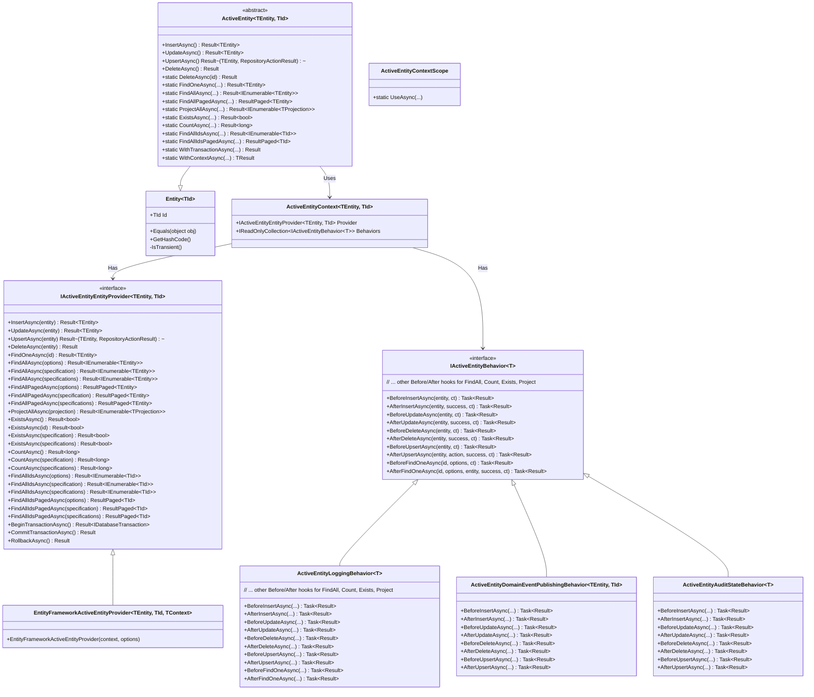
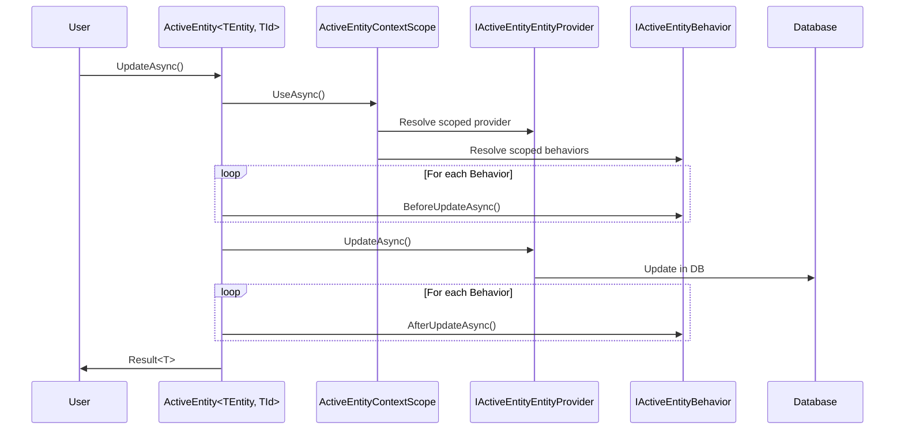
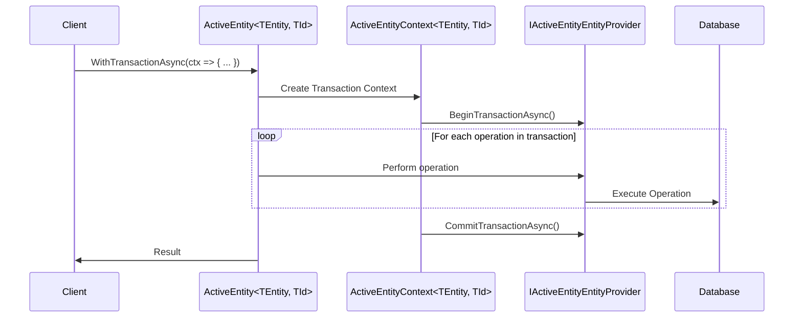

# ActiveEntity

> Add CRUD and query operations to an entity while a configured provider handles persistence.

[TOC]

## Overview

ActiveEntity is bITdevKit's provider-based implementation of the [Active Record pattern](https://www.martinfowler.com/eaaCatalog/activeRecord.html). An entity inherits from `ActiveEntity<TEntity, TId>` and gains CRUD and query methods. A provider configured for that entity type performs the persistence work. Operations return `Result`, `Result<T>`, or `ResultPaged<T>` so callers handle failures without depending on provider exceptions.

## Challenges

CRUD-focused features often repeat repository methods that only forward insert, update, delete, and lookup calls. If those calls depend directly on EF Core, changing the data store or testing the entity requires different infrastructure code. Logging, auditing, validation, and domain-event publishing can also become mixed into each operation. Different failure conventions then force callers to handle the same class of error in several ways.

## Solution

`ActiveEntity<TEntity, TId>` exposes the operations on the entity type and delegates each operation to one configured `IActiveEntityEntityProvider<TEntity, TId>`. You can select a different provider for each entity type. `IActiveEntityBehavior<TEntity>` implementations add logging, auditing, validation, metrics, or domain-event publishing in registration order. The operation and behavior results merge into one `Result` value for the caller.

## Key Features

- **Provider selection.** Configure one EF Core, in-memory, or custom provider for each entity type without changing the entity's operations.
- **Entity operations.** Call CRUD and query methods on the entity instance or entity type.
- **Behaviors.** Add logging, metrics, auditing, validation, or domain-event publishing in the operation pipeline.
- **Dependency injection.** Resolve the provider and behaviors from the same dependency injection scope.
- **Results.** Receive failures and values through `Result`, `Result<T>`, and `ResultPaged<T>`.
- **Generated queries.** Opt in to convention finders, specifications, a query DSL, and static query forwarders.
- **Audit and concurrency state.** Add `IAuditable` or `IConcurrency` to entities that need those behaviors.

## Architecture

### Pattern

The [Active Record pattern is described by Martin Fowler](https://www.martinfowler.com/eaaCatalog/activeRecord.html) in the book Patterns of Enterprise Architecture as "an object that wraps a row in a database table, encapsulates the database access, and adds domain logic to that data." ActiveEntity objects carry both data and behavior.

### Components

`ActiveEntity<TEntity, TId>` delegates persistence to `IActiveEntityEntityProvider<TEntity, TId>`. The pipeline runs registered `IActiveEntityBehavior<TEntity>` instances in registration order. `ActiveEntityConfigurator` stores the application's service provider so an operation can create a dependency injection scope when the caller does not supply a context.

`ActiveEntityContext<TEntity, TId>` contains the provider and behaviors resolved from one scope. Reusing a context keeps those services in the same scope. A context shares a transaction only when the provider has started one, such as inside `WithTransactionAsync`.


```mermaid
classDiagram
    class Entity~TId~ {
        +TId Id
        +Equals(object obj)
        +GetHashCode()
        -IsTransient()
    }

    class ActiveEntity~TEntity, TId~ {
        <<abstract>>
        +InsertAsync() Result~TEntity~
        +UpdateAsync() Result~TEntity~
        +UpsertAsync() Result~(TEntity, RepositoryActionResult)~
        +DeleteAsync() Result
        +static DeleteAsync(id) Result
        +static FindOneAsync(...) Result~TEntity~
        +static FindAllAsync(...) Result~IEnumerable~TEntity~~
        +static FindAllPagedAsync(...) ResultPaged~TEntity~
        +static ProjectAllAsync(...) Result~IEnumerable~TProjection~~
        +static ExistsAsync(...) Result~bool~
        +static CountAsync(...) Result~long~
        +static FindAllIdsAsync(...) Result~IEnumerable~TId~~
        +static FindAllIdsPagedAsync(...) ResultPaged~TId~
        +static WithTransactionAsync(...) Result
        +static WithContextAsync(...) TResult
    }

    class IActiveEntityEntityProvider~TEntity, TId~ {
        <<interface>>
        +InsertAsync(entity) Result~TEntity~
        +UpdateAsync(entity) Result~TEntity~
        +UpsertAsync(entity) Result~(TEntity, RepositoryActionResult)~
        +DeleteAsync(entity) Result
        +FindOneAsync(id) Result~TEntity~
        +FindAllAsync(options) Result~IEnumerable~TEntity~~
        +FindAllAsync(specification) Result~IEnumerable~TEntity~~
        +FindAllAsync(specifications) Result~IEnumerable~TEntity~~
        +FindAllPagedAsync(options) ResultPaged~TEntity~
        +FindAllPagedAsync(specification) ResultPaged~TEntity~
        +FindAllPagedAsync(specifications) ResultPaged~TEntity~
        +ProjectAllAsync(projection) Result~IEnumerable~TProjection~~
        +ExistsAsync() Result~bool~
        +ExistsAsync(id) Result~bool~
        +ExistsAsync(specification) Result~bool~
        +ExistsAsync(specifications) Result~bool~
        +CountAsync() Result~long~
        +CountAsync(specification) Result~long~
        +CountAsync(specifications) Result~long~
        +FindAllIdsAsync(options) Result~IEnumerable~TId~~
        +FindAllIdsAsync(specification) Result~IEnumerable~TId~~
        +FindAllIdsAsync(specifications) Result~IEnumerable~TId~~
        +FindAllIdsPagedAsync(options) ResultPaged~TId~
        +FindAllIdsPagedAsync(specification) ResultPaged~TId~
        +FindAllIdsPagedAsync(specifications) ResultPaged~TId~
        +BeginTransactionAsync() Result~IDatabaseTransaction~
        +CommitTransactionAsync() Result
        +RollbackAsync() Result
    }

    class EntityFrameworkActiveEntityProvider~TEntity, TId, TContext~ {
        +EntityFrameworkActiveEntityProvider(context, options)
    }

    class IActiveEntityBehavior~T~ {
        <<interface>>
        +BeforeInsertAsync(entity, ct) Task~Result~
        +AfterInsertAsync(entity, success, ct) Task~Result~
        +BeforeUpdateAsync(entity, ct) Task~Result~
        +AfterUpdateAsync(entity, success, ct) Task~Result~
        +BeforeDeleteAsync(entity, ct) Task~Result~
        +AfterDeleteAsync(entity, success, ct) Task~Result~
        +BeforeUpsertAsync(entity, ct) Task~Result~
        +AfterUpsertAsync(entity, action, success, ct) Task~Result~
        +BeforeFindOneAsync(id, options, ct) Task~Result~
        +AfterFindOneAsync(id, options, entity, success, ct) Task~Result~
        // ... other Before/After hooks for FindAll, Count, Exists, Project
    }

    class ActiveEntityContext~TEntity, TId~ {
        +IActiveEntityEntityProvider~TEntity, TId~ Provider
        +IReadOnlyCollection~IActiveEntityBehavior~T~~ Behaviors
    }

    class ActiveEntityContextScope {
        +static UseAsync(...)
    }

    class ActiveEntityLoggingBehavior~T~ {
        +BeforeInsertAsync(...) Task~Result~
        +AfterInsertAsync(...) Task~Result~
        +BeforeUpdateAsync(...) Task~Result~
        +AfterUpdateAsync(...) Task~Result~
        +BeforeDeleteAsync(...) Task~Result~
        +AfterDeleteAsync(...) Task~Result~
        +BeforeUpsertAsync(...) Task~Result~
        +AfterUpsertAsync(...) Task~Result~
        +BeforeFindOneAsync(...) Task~Result~
        +AfterFindOneAsync(...) Task~Result~
        // ... other Before/After hooks for FindAll, Count, Exists, Project
    }

    class ActiveEntityDomainEventPublishingBehavior~TEntity, TId~ {
        +BeforeInsertAsync(...) Task~Result~
        +AfterInsertAsync(...) Task~Result~
        +BeforeUpdateAsync(...) Task~Result~
        +AfterUpdateAsync(...) Task~Result~
        +BeforeDeleteAsync(...) Task~Result~
        +AfterDeleteAsync(...) Task~Result~
        +BeforeUpsertAsync(...) Task~Result~
        +AfterUpsertAsync(...) Task~Result~
    }

    class ActiveEntityAuditStateBehavior~T~ {
        +BeforeInsertAsync(...) Task~Result~
        +AfterInsertAsync(...) Task~Result~
        +BeforeUpdateAsync(...) Task~Result~
        +AfterUpdateAsync(...) Task~Result~
        +BeforeDeleteAsync(...) Task~Result~
        +AfterDeleteAsync(...) Task~Result~
        +BeforeUpsertAsync(...) Task~Result~
        +AfterUpsertAsync(...) Task~Result~
    }

    ActiveEntity --|> Entity
    ActiveEntity --> ActiveEntityContext : Uses
    ActiveEntityContext --> IActiveEntityEntityProvider : Has
    ActiveEntityContext --> IActiveEntityBehavior : Has
    IActiveEntityEntityProvider <|-- EntityFrameworkActiveEntityProvider
    IActiveEntityBehavior <|-- ActiveEntityLoggingBehavior
    IActiveEntityBehavior <|-- ActiveEntityDomainEventPublishingBehavior
    IActiveEntityBehavior <|-- ActiveEntityAuditStateBehavior
```

### Update operation sequence


```mermaid
sequenceDiagram
    participant User
    participant Entity as ActiveEntity<TEntity, TId>
    participant Scope as ActiveEntityContextScope
    participant Provider as IActiveEntityEntityProvider
    participant Behavior as IActiveEntityBehavior
    participant DB as Database

    User->>Entity: UpdateAsync()
    Entity->>Scope: UseAsync()
    Scope->>Provider: Resolve scoped provider
    Scope->>Behavior: Resolve scoped behaviors
    loop For each Behavior
        Entity->>Behavior: BeforeUpdateAsync()
    end
    Entity->>Provider: UpdateAsync()
    Provider->>DB: Update in DB
    loop For each Behavior
        Entity->>Behavior: AfterUpdateAsync()
    end
    Entity->>User: Result<T>
```

When an operation has no context, `ActiveEntityContextScope` creates a dependency injection scope and resolves the provider and behaviors from it. The operation runs behavior hooks in sequence and delegates the database call to the provider. The context scope disposes the dependency injection scope after the operation completes.

## Use Cases

Use ActiveEntity when most persistence work consists of CRUD operations and queries that belong near the entity type. It fits small modules, prototypes that use the in-memory provider, and domain models that use typed IDs or domain events.

Use a repository or an application service when a use case coordinates several aggregate types, external services, or database-specific queries. One entity type has one configured provider. If the same entity must write to several data stores, keep that coordination outside the entity.

## Basic Usage

The following example configures an in-memory `Customer` entity, inserts one customer, and prints its generated ID.

### Define the entity

```csharp
[TypedEntityId<Guid>]
[ActiveEntityFeatures]
public partial class Customer : ActiveEntity<Customer, CustomerId>, IAuditable, IConcurrency
{
    public string FirstName { get; set; }
    public string LastName { get; set; }
    public string Title { get; set; }
    public string Email { get; set; }
    public bool IsActive { get; set; } = true;
    public int Visits { get; set; }
    public DateTime? LastVisited { get; set; }
    public AuditState AuditState { get; set; } = new();
    public Guid ConcurrencyVersion { get; set; }
}
```

`[TypedEntityId<Guid>]` generates `CustomerId`. `[ActiveEntityFeatures]` enables all optional generated query features. The entity is `partial` because those features add generated members to `Customer`.

### Configure the provider

```csharp
var services = new ServiceCollection();
services.AddLogging();
services.AddActiveEntity(cfg =>
{
    cfg.For<Customer, CustomerId>()
        .UseInMemoryProvider()
        .AddLoggingBehavior()
        .AddAuditStateBehavior(o => o.EnableSoftDelete());
});

await using var serviceProvider = services.BuildServiceProvider();
ActiveEntityConfigurator.SetGlobalServiceProvider(serviceProvider);
```

In ASP.NET Core, register ActiveEntity on `builder.Services`. After you build the application, call `app.UseActiveEntity()` instead of `ActiveEntityConfigurator.SetGlobalServiceProvider(...)`.

### Insert an entity

```csharp
var customer = new Customer
{
    FirstName = "John",
    LastName = "Doe",
    Email = "john.doe@example.com",
    Title = "Mr."
};

var insertResult = await customer.InsertAsync();
if (insertResult.IsFailure)
{
    Console.Error.WriteLine(string.Join(Environment.NewLine, insertResult.Errors.Select(e => e.Message)));
    return;
}

Console.WriteLine($"Inserted customer ID: {insertResult.Value.Id}");
```

The final line prints the generated `CustomerId`.

## Operation reference

The following examples use the `Customer` entity and provider configuration from `Basic Usage`.

### Insert multiple entities

```csharp
var results = await Customer.InsertAsync(
[
    new() { FirstName = "John", LastName = "Doe", Email = "john.doe@example.com", Title = "Mr." },
    new() { FirstName = "Jane", LastName = "Doe", Email = "jane.doe@example.com", Title = "Ms." }
]);

foreach (var result in results)
{
    if (result.IsSuccess)
    {
        Console.WriteLine($"Inserted customer ID: {result.Value.Id}");
    }
    else
    {
        Console.Error.WriteLine(string.Join(Environment.NewLine, result.Errors.Select(e => e.Message)));
    }
}
```

### Update an existing entity

Load the entity, handle a lookup failure, and then call `UpdateAsync`.

```csharp
var findResult = await Customer.FindOneAsync(customerId);
if (findResult.IsFailure)
{
    Console.Error.WriteLine(string.Join(Environment.NewLine, findResult.Errors.Select(e => e.Message)));
    return;
}

var customer = findResult.Value;
customer.FirstName = "Janet";
var updateResult = await customer.UpdateAsync();

if (updateResult.IsFailure)
{
    Console.Error.WriteLine(string.Join(Environment.NewLine, updateResult.Errors.Select(e => e.Message)));
    return;
}

Console.WriteLine($"Updated customer ID: {updateResult.Value.Id}");
```

### Update multiple existing entities

Load the entities, modify them, and pass the collection to `UpdateAsync`.

```csharp
var customerIds = new[] { customerId1, customerId2 };
var findResult = await Customer.FindAllAsync(c => customerIds.Contains(c.Id));
if (findResult.IsFailure)
{
    Console.Error.WriteLine(string.Join(Environment.NewLine, findResult.Errors.Select(e => e.Message)));
    return;
}

foreach (var customer in findResult.Value)
{
    customer.IsActive = false;
}

var updateResults = await Customer.UpdateAsync(findResult.Value);
foreach (var failure in updateResults.Where(r => r.IsFailure))
{
    Console.Error.WriteLine(string.Join(Environment.NewLine, failure.Errors.Select(e => e.Message)));
}
```

### Update selected properties

Use the update-set builder to change selected properties on one entity.

```csharp
var findResult = await Customer.FindOneAsync(customerId);
if (findResult.IsFailure)
{
    Console.Error.WriteLine(string.Join(Environment.NewLine, findResult.Errors.Select(e => e.Message)));
    return;
}

var customer = findResult.Value;
var updateResult = await customer.UpdateAsync(u => u
    .Set(c => c.FirstName, "Janet")              // constant assignment
    .Set(c => c.Visits, c => c.Visits + 1)       // computed assignment
    .Set(c => c.Title, _ => "Archived"));        // dynamic constant

if (updateResult.IsSuccess)
{
    Console.WriteLine($"Updated customer ID: {updateResult.Value.Id}");
}
```

### Update a set of entities

Use `UpdateSetAsync` to update multiple entities in one operation without loading them individually.

```csharp
// update set: deactivate all customers with LastName = "Doe"
var updateResult = await Customer.UpdateSetAsync(
    c => c.LastName == "Doe",
    set => set
        .Set(c => c.IsActive, false)                 // constant assignment
        .Set(c => c.Visits, c => c.Visits + 1)       // computed assignment
        .Set(c => c.Title, _ => "Archived"));        // dynamic constant

if (updateResult.IsSuccess)
{
    Console.WriteLine($"Updated {updateResult.Value} customers");
}
```

### Delete an entity

Load the entity, handle a lookup failure, and then call `DeleteAsync`.

```csharp
var findResult = await Customer.FindOneAsync(customerId);
if (findResult.IsFailure)
{
    Console.Error.WriteLine(string.Join(Environment.NewLine, findResult.Errors.Select(e => e.Message)));
    return;
}

var customer = findResult.Value;
var deleteResult = await customer.DeleteAsync();

if (deleteResult.IsSuccess)
{
    Console.WriteLine($"Deleted customer ID: {customer.Id}");
}
```

### Delete multiple existing entities

Load the entities and pass the collection to `DeleteAsync`.

```csharp
var customerIds = new[] { customerId1, customerId2 };
var findResult = await Customer.FindAllAsync(c => customerIds.Contains(c.Id));
if (findResult.IsFailure)
{
    Console.Error.WriteLine(string.Join(Environment.NewLine, findResult.Errors.Select(e => e.Message)));
    return;
}

var deleteResults = await Customer.DeleteAsync(findResult.Value);
foreach (var failure in deleteResults.Where(r => r.IsFailure))
{
    Console.Error.WriteLine(string.Join(Environment.NewLine, failure.Errors.Select(e => e.Message)));
}
```

### Delete multiple existing entities by ID

Pass the IDs directly when you do not need the entity values.

```csharp
var deleteResults = await Customer.DeleteAsync([customerId1, customerId2]);
foreach (var failure in deleteResults.Where(r => r.IsFailure))
{
    Console.Error.WriteLine(string.Join(Environment.NewLine, failure.Errors.Select(e => e.Message)));
}
```

### Delete a set of entities

Use `DeleteSetAsync` to delete multiple entities in one operation.

```csharp
// delete set: remove all customers with LastName = "Doe"
var deleteResult = await Customer.DeleteSetAsync(
    c => c.LastName == "Doe");

if (deleteResult.IsSuccess)
{
    Console.WriteLine($"Deleted {deleteResult.Value} customers");
}
```

### Find an entity by ID

Find an entity by its ID.

```csharp
var findResult = await Customer.FindOneAsync(customerId);
if (findResult.IsSuccess)
{
    var customer = findResult.Value;
    Console.WriteLine($"Found customer: {customer.FirstName} {customer.LastName}");
}
```

### Find all entities

```csharp
var findAllResult = await Customer.FindAllAsync();
if (findAllResult.IsSuccess)
{
    var customers = findAllResult.Value;
    foreach (var customer in customers)
    {
        Console.WriteLine(customer.FirstName);
    }
}
```

### Find filtered entities

```csharp
var findAllResult = await Customer.FindAllAsync(e => e.LastName == "Doe");
if (findAllResult.IsSuccess)
{
    var customers = findAllResult.Value;
    foreach (var customer in customers)
    {
        Console.WriteLine(customer.LastName);
    }
}
```

### Find a page of entities

```csharp
var options = new FindOptions<Customer> { Skip = 0, Take = 10 };
var pagedResult = await Customer.FindAllPagedAsync(options);
if (pagedResult.IsSuccess)
{
    foreach (var customer in pagedResult.Value)
    {
        Console.WriteLine(customer.FirstName);
    }

    Console.WriteLine($"Total customers: {pagedResult.TotalCount}");
}
```

### Reuse a context with `WithContextAsync`

Use `WithContextAsync` when several operations on one entity type must use the same provider and behavior instances. The helper creates one dependency injection scope for the delegate. It does not start a transaction.

```csharp
public static class CustomerService
{
    public static Task<Result> RegisterNewCustomerAndLogAsync(Customer newCustomer, CancellationToken ct = default)
    {
        return Customer.WithContextAsync(async context =>
        {
            var insertResult = await newCustomer.InsertAsync(context);
            if (insertResult.IsFailure)
            {
                return insertResult;
            }

            var findResult = await context.Provider.FindOneAsync(newCustomer.Id, null, ct);
            if (findResult.IsFailure)
            {
                return findResult;
            }

            var updatedCustomer = findResult.Value;
            updatedCustomer.Visits = 1;
            return await updatedCustomer.UpdateAsync(context);
        });
    }
}

var newCustomer = new Customer
{
    FirstName = "Bob",
    LastName = "Builder",
    Email = "bob.builder@example.com"
};
var serviceResult = await CustomerService.RegisterNewCustomerAndLogAsync(newCustomer);
if (serviceResult.IsFailure)
{
    Console.Error.WriteLine(string.Join(Environment.NewLine, serviceResult.Errors.Select(e => e.Message)));
}
```

### Run a transaction with `WithTransactionAsync`

Use `WithTransactionAsync` when the configured provider returns an `IDatabaseTransaction` and several operations must succeed or fail together. The helper commits when the delegate returns success and rolls back when the delegate returns failure. Pass the supplied context to every ActiveEntity operation in the delegate.

The following examples assume that `Customer` uses `UseEntityFrameworkProvider<ActiveEntityDbContext>()`. The in-memory provider does not provide transaction isolation.

```csharp
var customer = new Customer
{
    FirstName = "John",
    LastName = "Doe",
    Email = "john.doe@example.com",
    Title = "Mr."
};
var transactionResult = await Customer.WithTransactionAsync(async context =>
{
    var insertResult = await customer.InsertAsync(context);
    if (insertResult.IsFailure)
    {
        return Result.Failure(insertResult.Errors);
    }

    var findResult = await context.Provider.FindOneAsync(customer.Id);
    if (findResult.IsFailure)
    {
        return Result.Failure(findResult.Errors);
    }

    var updatedCustomer = findResult.Value;
    updatedCustomer.Title = "Sir";
    var updateResult = await updatedCustomer.UpdateAsync(context);
    if (updateResult.IsFailure)
    {
        return Result.Failure(updateResult.Errors);
    }

    return Result.Success();
});

if (transactionResult.IsSuccess)
{
    Console.WriteLine($"Transaction committed for customer ID: {customer.Id}");
}
else
{
    Console.WriteLine($"Transaction failed and rolled back: {transactionResult.Errors}");
}
```

You can also return a value from a transaction using `WithTransactionAsync<T>`:

```csharp
var newCustomer = new Customer
{
    FirstName = "Alice",
    LastName = "Wonder",
    Email = "alice.wonder@example.com"
};

var transactionResultWithReturn = await Customer.WithTransactionAsync<Customer>(async ctx =>
{
    var insertResult = await newCustomer.InsertAsync(ctx);
    if (insertResult.IsFailure)
    {
        return Result<Customer>.Failure(insertResult.Errors);
    }

    return Result.Success(insertResult.Value);
});

if (transactionResultWithReturn.IsSuccess)
{
    Console.WriteLine($"Transaction committed. New customer ID: {transactionResultWithReturn.Value.Id}");
}
else
{
    Console.WriteLine($"Transaction failed: {transactionResultWithReturn.Errors}");
}
```

The following sequence shows the successful `WithTransactionAsync` path.


```mermaid
sequenceDiagram
    participant Client
    participant Entity as ActiveEntity<TEntity, TId>
    participant Context as ActiveEntityContext<TEntity, TId>
    participant Provider as IActiveEntityEntityProvider
    participant DB as Database

    Client->>Entity: WithTransactionAsync(ctx => { ... })
    Entity->>Context: Create Transaction Context
    Context->>Provider: BeginTransactionAsync()
    loop For each operation in transaction
        Entity->>Provider: Perform operation
        Provider->>DB: Execute Operation
    end
    Context->>Provider: CommitTransactionAsync()
    Entity->>Client: Result
```

## Behaviors

ActiveEntity runs behaviors in registration order before and after supported operations. A behavior receives the entity or query arguments, the operation result where applicable, and the cancellation token. Behavior hooks do not receive the provider or `ActiveEntityContext`.

### Logging behavior

`AddLoggingBehavior` registers `ActiveEntityLoggingBehavior<TEntity>` for the entity type.

```csharp
services.AddActiveEntity(cfg =>
{
    cfg.For<Customer, CustomerId>()
        .UseEntityFrameworkProvider<ActiveEntityDbContext>()
        .AddLoggingBehavior();
});
```

### Domain-event publishing behavior

`AddDomainEventPublishingBehavior` publishes registered domain events before or after a successful operation. Set `PublishBefore` to select the position.

For the aggregate event model and the repository-based domain-event outbox, see [Domain Events](./features-domain-events.md).

```csharp
services.AddActiveEntity(cfg =>
{
    cfg.For<Customer, CustomerId>()
        .UseEntityFrameworkProvider<ActiveEntityDbContext>()
        .AddDomainEventPublishingBehavior(
            new ActiveEntityDomainEventPublishingBehaviorOptions { PublishBefore = false });
});
```

### Audit-state behavior

`AddAuditStateBehavior` updates the `AuditState` of an `IAuditable` entity. Soft delete records the deletion in `AuditState` instead of removing the entity.

```csharp
services.AddActiveEntity(cfg =>
{
    cfg.For<Customer, CustomerId>()
        .UseEntityFrameworkProvider<ActiveEntityDbContext>()
        .AddAuditStateBehavior(o => o.EnableSoftDelete(false));
});
```

### Data-annotation validation behavior

`AddAnnotationsValidator` validates entity properties before persistence operations. Supported `System.ComponentModel.DataAnnotations` attributes include:

- `[Required]` rejects a null or empty value.
- `[MinLength]`, `[MaxLength]`, and `[StringLength]` constrain string length.
- `[Range]` constrains a numeric value.
- `[RegularExpression]` matches a string against a regular expression.
- `[EmailAddress]`, `[Url]`, and `[Phone]` validate common text formats.
- `[Compare]` compares two property values.

Register the behavior for an entity:

```csharp
services.AddActiveEntity(cfg =>
{
    cfg.For<Supplier, Guid>()
        .UseEntityFrameworkProvider<ActiveEntityDbContext>()
        .AddAnnotationsValidator();
});
```

The entity declares its constraints with data-annotation attributes:

```csharp
public class Supplier : ActiveEntity<Supplier, Guid>, IAuditable, IConcurrency
{
    [Required]
    [MinLength(3)]
    [MaxLength(100)]
    public string Name { get; set; }

    [Required]
    [RegularExpression(@"^[^@\s]+@[^@\s]+\.[^@\s]+$")]
    public string Email { get; set; }

    [Range(1, 5)]
    public int Rating { get; set; }

    public AuditState AuditState { get; set; } = new();
    public Guid ConcurrencyVersion { get; set; }
}
```

An invalid entity returns a failed result:

```csharp
var supplier = new Supplier
{
    Name = "A",
    Email = "invalid-email",
    Rating = 6
};

var insertResult = await supplier.InsertAsync();
if (insertResult.IsFailure)
{
    Console.Error.WriteLine(string.Join(Environment.NewLine, insertResult.Errors.Select(e => e.Message)));
}
```

Validation failures contain a `FluentValidationError`.

### FluentValidation behavior

`AddValidatorBehavior` registers a FluentValidation validator for selected operations. The delete validator below assumes that `Order` also has a configured provider.

```csharp
public class BasicCustomerValidator : AbstractValidator<Customer>
{
    public BasicCustomerValidator()
    {
        RuleFor(c => c.FirstName).NotEmpty().WithMessage("First name is required");
        RuleFor(c => c.LastName).NotEmpty().WithMessage("Last name is required");
    }
}

public class BusinessCustomerValidator : AbstractValidator<Customer>
{
    public BusinessCustomerValidator()
    {
        RuleFor(c => c.Email).NotEmpty().EmailAddress().WithMessage("A valid email address is required");
    }
}

public class DeleteCustomerValidator : AbstractValidator<Customer>
{
    public DeleteCustomerValidator()
    {
        RuleFor(c => c.Id)
            .MustAsync(async (id, ct) =>
            {
                var existsResult = await Order.ExistsAsync(
                    o => o.CustomerId == id && o.Status == OrderStatus.Pending,
                    null,
                    ct);

                return existsResult.IsSuccess && !existsResult.Value;
            })
            .WithMessage("Cannot delete a customer with pending orders.");
    }
}

services.AddActiveEntity(cfg =>
{
    cfg.For<Customer, CustomerId>()
        .UseEntityFrameworkProvider<ActiveEntityDbContext>()
        .AddValidatorBehavior<Customer, CustomerId, BasicCustomerValidator>(o => o.ApplyOnInsert())
        .AddValidatorBehavior<Customer, CustomerId, BusinessCustomerValidator>(o => o.ApplyOnUpdate())
        .AddValidatorBehavior<Customer, CustomerId, DeleteCustomerValidator>(o => o.ApplyOnDelete());
});

var customer = new Customer
{
    FirstName = "John",
    LastName = "Doe",
    Email = "john.doe@example.com",
    Title = "Mr."
};
var insertResult = await customer.InsertAsync();

customer.Email = "invalid";
var updateResult = await customer.UpdateAsync();

// Assume a pending order exists for customer.Id.
var deleteResult = await customer.DeleteAsync();
```

Each `ApplyOn*` method limits its validator to the selected operation. Validation failures contain a `FluentValidationError`.

### Custom behaviors

Extend `ActiveEntityBehaviorBase<TEntity>` and override the hooks that the behavior needs.

```csharp
public sealed class CustomBehavior<TEntity> : ActiveEntityBehaviorBase<TEntity>
    where TEntity : class, IEntity
{
    public override Task<Result> BeforeInsertAsync(
        TEntity entity,
        CancellationToken cancellationToken = default)
    {
        return Task.FromResult(Result.Success());
    }
}

services.AddActiveEntity(cfg =>
{
    cfg.For<Customer, CustomerId>()
        .UseEntityFrameworkProvider<ActiveEntityDbContext>()
        .AddBehaviorType(typeof(CustomBehavior<Customer>));
});
```

## Advanced usage

`[ActiveEntityFeatures]` enables source-generated query members on a `partial` entity class. With no argument, the attribute enables `ActiveEntityFeatures.All`. Pass one or more enum values to limit generation.

### Enable generated features

The available values are `Forwarders`, `ConventionFinders`, `Specifications`, and `QueryDsl`.

```csharp
[TypedEntityId<Guid>]
[ActiveEntityFeatures(
    ActiveEntityFeatures.Forwarders |
    ActiveEntityFeatures.ConventionFinders |
    ActiveEntityFeatures.Specifications |
    ActiveEntityFeatures.QueryDsl)]
public partial class Customer : ActiveEntity<Customer, CustomerId>
{
    public string FirstName { get; set; }
    public string LastName { get; set; }
    public bool IsActive { get; set; }
    public int Visits { get; set; }
    public DateTime? LastVisited { get; set; }
}
```

### Convention finders

`ConventionFinders` generates two methods for each supported property:

- `FindAllBy<PropertyName>Async(value)` returns all matching entities.
- `FindOneBy<PropertyName>Async(value)` returns the first matching entity.

The generator supports primitive values, value objects, enumerations, and typed IDs.

```csharp
var customersResult = await Customer.FindAllByLastNameAsync("Doe");
if (customersResult.IsSuccess)
{
    foreach (var customer in customersResult.Value)
    {
        Console.WriteLine(customer.FirstName);
    }
}
```

### Generated specifications

`Specifications` generates a nested `Customer.Specifications` class. The generated methods cover equality and the comparisons supported by each property type.

```csharp
var specification = Customer.Specifications.LastNameEquals("Doe")
    .And(Customer.Specifications.VisitsGreaterThan(5));

var customersResult = await Customer.FindAllAsync(specification);
```

For the underlying specification model, see [Domain Specifications](./features-domain-specifications.md).

### Fluent query DSL

`QueryDsl` generates `Query()` and a typed query builder. The builder supports filters, specifications, includes, ordering, paging, counts, existence checks, and projections.

```csharp
var pagedResult = await Customer.Query()
    .Where(Customer.Specifications.IsActiveEquals(true))
    .And(Customer.Specifications.LastNameEquals("Doe"))
    .OrderBy(c => c.FirstName)
    .Skip(0)
    .Take(10)
    .ToPagedListAsync();

if (pagedResult.IsSuccess)
{
    foreach (var customer in pagedResult.Value)
    {
        Console.WriteLine(customer.FirstName);
    }

    Console.WriteLine($"Total customers: {pagedResult.TotalCount}");
}
```

### Static query forwarders

`Forwarders` exposes compatible extension methods as static methods on the entity class. Define the extension on `ActiveEntity<TEntity, TId>`, enable `Forwarders`, and keep the entity class `partial`.

```csharp
public static class CustomerQueryExtensions
{
    /// <summary>
    /// Finds customers who visited in the last 30 days.
    /// </summary>
    public static Task<Result<IEnumerable<Customer>>> FindAllRecentlyVisitedAsync(
        this ActiveEntity<Customer, CustomerId> _,
        CancellationToken cancellationToken = default)
    {
        var since = DateTime.UtcNow.AddDays(-30);
        return Customer.FindAllAsync(
            customer => customer.LastVisited >= since,
            null,
            cancellationToken);
    }
}

var customersResult = await Customer.FindAllRecentlyVisitedAsync();
```

### Lifecycle callbacks

`ActiveEntity<TEntity, TId>` defines callbacks such as `OnBeforeInsertAsync` and `OnAfterUpdateAsync`. Each callback receives the configured `IActiveEntityEntityProvider<TEntity, TId>` and a cancellation token. A failed result from a `Before` callback stops the operation.

```csharp
[TypedEntityId<Guid>]
public partial class Order : ActiveEntity<Order, OrderId>
{
    public decimal Subtotal { get; set; }
    public decimal Shipping { get; set; }
    public decimal Tax { get; set; }
    public decimal Total => this.Subtotal + this.Shipping + this.Tax;

    protected override Task<Result> OnBeforeInsertAsync(
        IActiveEntityEntityProvider<Order, OrderId> _,
        CancellationToken cancellationToken)
    {
        return Task.FromResult(this.Total < 0
            ? Result.Failure("The order total cannot be negative.")
            : Result.Success());
    }
}
```

Use callbacks for rules that depend on the entity's own state. Use behaviors for concerns shared by several entity types. Use an application service or command when a process coordinates several entities or external services.

## Appendix A: limits

ActiveEntity has these boundaries:

- One provider is configured for each entity type.
- The EF Core provider still requires normal EF Core entity and relationship configuration.
- Provider capabilities determine transaction and batch-operation behavior.
- Cross-entity workflows belong in an application service, command, or orchestration.
- Database-specific queries can use a repository or the database API directly.

## Appendix B: Repository comparison

ActiveEntity places persistence methods on the entity type. This keeps common CRUD calls close to the model and makes those calls easy to discover. The provider and behavior abstractions keep the entity methods independent of one persistence implementation.

A repository keeps persistence behind a separate dependency. Prefer it when the application layer must control query composition, when several implementations need different contracts, or when a use case depends on database-specific operations.

Both patterns support typed IDs, domain events, specifications, paging, and EF Core aggregate mapping. A module can use ActiveEntity for one aggregate and repositories for another. For a longer design comparison, see [Repository versus ActiveEntity](./site/decisions-repository-vs-activeentity.md).

## Appendix C: `ActiveEntityContext` and `ActiveEntityContextScope`

### Scope ownership

`ActiveEntityContext<TEntity, TId>` exposes two read-only properties:

- `Provider` is the `IActiveEntityEntityProvider<TEntity, TId>` for the operation.
- `Behaviors` is the collection of `IActiveEntityBehavior<TEntity>` instances for the operation.

When `ActiveEntityContextScope` creates the context, it resolves both properties from the same dependency injection scope. Scoped dependencies such as an EF Core `DbContext` are therefore shared for the lifetime of that context.

Do not cache a context or use it after its delegate completes. The helper disposes a scope that it creates, and later access to services from that scope can throw `ObjectDisposedException`.

### Context reuse

`ActiveEntityContextScope.UseAsync` accepts an existing context or `null`:

```csharp
public static Task<TResult> UseAsync<TEntity, TId, TResult>(
    ActiveEntityContext<TEntity, TId> context,
    Func<ActiveEntityContext<TEntity, TId>, Task<TResult>> action)
    where TEntity : ActiveEntity<TEntity, TId>
```

If `context` is not null, `UseAsync` passes it to the action and does not create or dispose a scope. If `context` is null, `UseAsync` creates an asynchronous dependency injection scope, resolves the provider and behaviors, invokes the action, and disposes the scope in a `finally` block.
