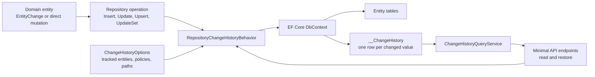
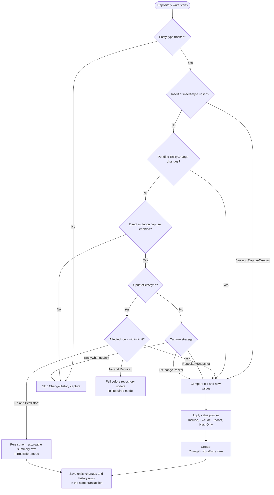
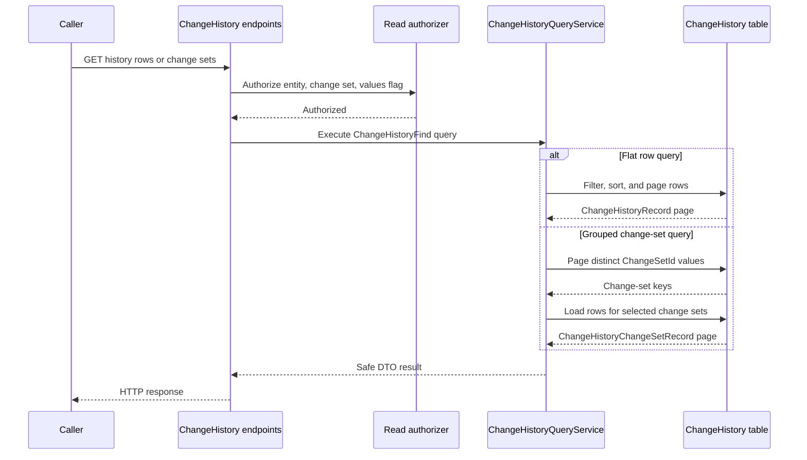
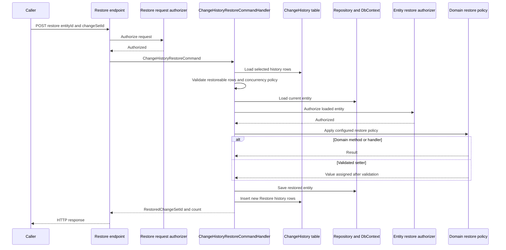

# Change History

> Record property-level entity changes, query grouped change sets, and restore selected values through explicit domain-safe policies.

[TOC]

## Overview

ChangeHistory fills the space between simple audit metadata and full event sourcing. `AuditState` can tell you that an entity was updated, while ChangeHistory records which persisted values changed, what the old and new serialized values were, who changed them, and which values were changed together.

The feature is designed for regular repository-backed aggregates and entities. It stores one row per changed value in an EF Core managed `__ChangeHistory` table and keeps the Domain and Application layers persistence-ignorant.

ChangeHistory can capture:

- fluent `EntityChange` updates created through `.Change().Set(...).Apply()`
- direct property mutations saved through repository `UpdateAsync(...)` or update-style `UpsertAsync(...)`
- optional create snapshots from repository `InsertAsync(...)` or insert-style `UpsertAsync(...)`
- optional summary or detailed capture from explicitly decorated native `IEntityBulkInserter<TEntity>` operations
- repository `UpdateSetAsync(...)` bulk updates, with safety limits
- owned values, identifiable collections, and configured object graphs
- restore operations as new history rows

For a design-level view of the implemented requirements, see [ChangeHistory Specification](./specs/change-history.md).

## Challenges

Audit timestamps show that a record changed, but they do not identify the changed values or group
related changes. A general-purpose history mechanism must also protect sensitive values, preserve
transaction boundaries, limit the cost of bulk capture, and restore data through domain rules.

## Solution

ChangeHistory decorates repository and native bulk-insert operations. It converts configured changes
into property-level rows, groups those rows into change sets, applies value-protection policies, and
provides query and opt-in restore services without making domain entities depend on EF Core.

## Key Features

- Property-level create, update, bulk-update, native bulk-insert, and restore records
- Change-set and bulk-operation grouping
- Repository snapshot, EF change-tracker, and explicit `EntityChange` capture strategies
- Include, exclude, redact, hash-only, and oversized-value policies
- Configured owned-value, collection, and graph capture
- Paged queries, minimal API endpoints, authorization hooks, and domain-safe restore policies

## Architecture

At runtime, ChangeHistory sits beside repository persistence. Domain and Application code stay persistence-ignorant, while the EF repository behavior translates configured entity changes into rows in the `__ChangeHistory` table.



### Capture flow

The repository behavior chooses the capture source from the configured operation and strategy. Every captured property row belongs to a `ChangeSetId`; bulk updates also share a `BulkOperationId`.



### Query flow

Read APIs use the query service over stored history rows. Grouped change-set queries first page distinct change sets and then load the rows for those selected groups.



### Restore flow

Restore is an explicit write operation. It is allowed only for rows with stored values and configured restore policies. The original history stays unchanged; the restore itself is recorded as a new `Restore` change set.



## Use Cases

Use ChangeHistory when a module needs inspectable and optionally restoreable value history for regular entities:

- support staff need to answer "what changed and when?"
- administrative screens need grouped change sets for one entity
- sensitive values must be protected while still proving that a value changed
- selected properties need an undo path without adopting event sourcing
- set-based maintenance operations need auditable before/after values

Use [Event Sourcing](./features-event-sourcing.md) instead when the event stream is the aggregate source of truth and the aggregate is rebuilt by replaying domain events.

## Basic Usage

Register capture for the entity, add the repository behavior, and register query services:

```csharp
services.AddChangeHistory(options => options
    .Track<Customer>()
    .CaptureChanges());

services.AddEntityFrameworkRepository<Customer, AppDbContext>()
    .WithTransactions()
    .WithBehavior<RepositoryChangeHistoryBehavior<Customer, AppDbContext>>();

services.AddChangeHistoryServices<AppDbContext>();
```

Apply an explicit change, persist it, and inspect the recorded values:

```csharp
var changeResult = customer.Change()
    .Set(e => e.Name, "Ada Lovelace")
    .Apply();

if (changeResult.IsFailure)
{
    Console.Error.WriteLine(string.Join(
        Environment.NewLine,
        changeResult.Errors.Select(error => error.Message)));
    return;
}

await repository.UpdateAsync(customer, cancellationToken);

var historyResult = await queryService.FindAllAsync(
    new ChangeHistoryFindAllQuery
    {
        EntityType = nameof(Customer),
        EntityId = customer.Id.ToString(),
        PropertyName = nameof(Customer.Name),
        IncludeValues = true
    },
    cancellationToken);

if (historyResult.IsFailure)
{
    Console.Error.WriteLine(string.Join(
        Environment.NewLine,
        historyResult.Errors.Select(error => error.Message)));
    return;
}

foreach (var row in historyResult.Value)
{
    Console.WriteLine($"{row.PropertyName}: {row.OldValue} -> {row.NewValue}");
}
```

For a customer renamed from `Ada` to `Ada Lovelace`, the output is:

```text
Name: "Ada" -> "Ada Lovelace"
```

## Core concepts

### Change rows

Each persisted row represents one captured value change. Rows include the entity type and id, property name/path, old value, new value, operation, capture source, status, user/request metadata, and grouping ids.

The default table name is `__ChangeHistory`.

### Change sets

`ChangeSetId` groups values changed together. For example, one `.Change().Apply()` call that updates a title and due date produces one change set with two rows.

Bulk updates use one `BulkOperationId` for the overall set-based operation and one change set per affected entity.

### Capture sources

ChangeHistory distinguishes where a row came from:

- `EntityChange`: a successful fluent `EntityChange` transaction
- `RepositorySnapshot`: comparison between the submitted entity and a persisted baseline
- `EfChangeTracker`: EF Core original/current value comparison for tracked entities
- `Create`: an explicit initial-value snapshot during insert
- `UpdateSet`: repository set-based update capture
- `Restore`: a restore command writing the undo operation as new history

### Value policies

Captured values are serialized through the devkit JSON conventions. Per-property policies control whether values are stored, redacted, hashed, or excluded.

Common sensitive property names are hash-only by default unless automatic protection is disabled. Redacted or hash-only values are not restoreable because the original value is not stored.

## Setup

### 1. Expose the EF set

Expose the ChangeHistory set on the DbContext. `ChangeHistoryEntry` carries the EF table, column, and index mapping through annotations.

```csharp
public sealed class AppDbContext : DbContext, IChangeHistoryContext
{
    public DbSet<ChangeHistoryEntry> ChangeHistory { get; set; }
}
```

### 2. Configure tracked entities

Register global options and opt in each entity that should produce history:

```csharp
services.AddChangeHistory(options =>
{
    options.UseOversizedValuePolicy(
        ChangeHistoryOversizedValuePolicy.Truncate,
        maxStoredValueLength: 4000);

    options.Track<TodoItem>()
        .CaptureChanges()
        .CaptureBulkInserts()
        .CaptureCollection<TodoStep, TodoStepId>(e => e.Steps, e => e.Id)
        .HashOnly(e => e.UserId)
        .Redact(e => e.Assignee)
        .Exclude(e => e.Properties);
});
```

Only tracked entity types are captured. This keeps the feature explicit and avoids recording history for every repository by accident.
For entities implementing `IConcurrency`, `ConcurrencyVersion` is excluded automatically; an explicit property policy can override the convention.

### 3. Add the repository behavior

ChangeHistory is persisted through the repository behavior pipeline:

```csharp
services.AddEntityFrameworkRepository<TodoItem, CoreDbContext>()
    .WithTransactions()
    .WithBehavior<RepositoryAuditStateBehavior<TodoItem>>()
    .WithBehavior<RepositoryChangeHistoryBehavior<TodoItem, CoreDbContext>>()
    .WithBehavior<RepositoryOutboxDomainEventBehavior<TodoItem, CoreDbContext>>();
```

Place the behavior inside the same transactional repository pipeline as the entity update. If the entity update fails, the history rows are not committed.

### 4. Add native bulk-insert capture when needed

Native `IEntityBulkInserter<TEntity>` operations are deliberately independent from repository behaviors. `CaptureCreates()` therefore covers repository inserts and insert-style upserts only. To capture native inserts, opt in separately and add the bulk behavior explicitly:

```csharp
services.AddChangeHistory(options => options
    .Track<TodoItem>()
        .CaptureChanges()
        .CaptureBulkInserts()); // Summary is the default

services.AddEntityFrameworkBulkInserter<TodoItem, CoreDbContext>()
    .WithBehavior<EntityBulkInserterOutboxDomainEventBehavior<TodoItem, CoreDbContext>>()
    .WithBehavior<EntityBulkInserterChangeHistoryBehavior<TodoItem, CoreDbContext>>()
    .WithBehavior<EntityBulkInserterAuditStateBehavior<TodoItem>>();
```

The summary mode stores one non-restoreable `BulkInsert` row with a shared `BulkOperationId` and the inserted count. Detailed mode stores initial scalar property values for every inserted entity while applying the normal exclude, redact, hash-only, sensitive-name, and oversized-value policies:

```csharp
options.Track<TodoItem>()
    .CaptureBulkInserts(
        ChangeHistoryBulkInsertCaptureMode.Detailed,
        maxDetailedEntities: 500);
```

Detailed mode fails before the native write when the batch exceeds its configured limit. It also requires stable client-assigned identifiers; native database-generated identifiers are not hydrated back into input entities. When an outbox behavior is present, register it before the ChangeHistory behavior so the outbox remains the outer transaction owner.

## Options reference

### Global options

Configure global defaults through `services.AddChangeHistory(options => ...)`.

| Option or method | Default | Purpose |
| --- | --- | --- |
| `DefaultCaptureStrategy` / `UseCaptureStrategy(strategy)` | `RepositorySnapshot` | Sets the capture strategy used by tracked entities that do not override it. |
| `DefaultUpdateSetMaxAffectedRows` / `UseDefaultUpdateSetMaxAffectedRows(value)` | `1000` | Sets the default safety limit for `UpdateSetAsync(...)` capture. Values below `1` are normalized to `1`. |
| `MaxStoredValueLength` | `null` | Optional maximum serialized old/new value length. `null` means unbounded. |
| `OversizedValuePolicy` / `UseOversizedValuePolicy(policy, maxLength)` | `Include` | Controls how serialized values longer than `MaxStoredValueLength` are handled. |
| `SensitiveValuePolicy` / `UseSensitiveValuePolicy(policy)` | `HashOnly` | Controls the default value policy for common sensitive property names. |
| `ProtectSensitivePropertyNames` | `true` | Enables automatic protection for names such as token, password, secret, or similar sensitive fields. |
| `DisableSensitivePropertyNameProtection()` | `false` after call | Turns off automatic sensitive-name protection. Explicit property policies still apply. |
| `ReadAuthorizationPolicy` / `UseReadAuthorizationPolicy(policy)` | `null` | Global policy name used by endpoints when no endpoint-specific read policy is supplied. Blank values clear the policy. |
| `RestoreAuthorizationPolicy` / `UseRestoreAuthorizationPolicy(policy)` | `null` | Global policy name used by endpoints when no endpoint-specific restore policy is supplied. Blank values clear the policy. |
| `TrackedEntities` / `Track<TEntity>()` | empty | Registers or returns per-entity ChangeHistory configuration. Only tracked entities are captured. |
| `GetEntityOptions(type)` | n/a | Returns entity-specific options for runtime code, or `null` when the entity is not tracked. |
| `Validate()` | n/a | Throws when a restore policy is incomplete or detailed bulk-insert capture has no positive safety limit. `AddChangeHistory(...)` calls this after configuration. |

### Tracked entity options

`Track<TEntity>()` returns `ChangeHistoryEntityOptionsBuilder<TEntity>`. These options apply only to that entity type.

| Builder method or option | Default | Purpose |
| --- | --- | --- |
| `UseCaptureStrategy(strategy)` | global default | Overrides the global capture strategy for this entity. |
| `CaptureDirectMutations(strategy, mode)` | disabled | Enables direct mutation capture for repository updates and update-style upserts. Also sets the entity capture strategy. |
| `CaptureCreates()` | disabled | Captures initial values during repository insert and insert-style upsert. It does not capture native `IEntityBulkInserter<TEntity>` operations. Create rows are not restoreable by default. |
| `CaptureBulkInserts(mode, maxDetailedEntities)` | disabled; `Summary` and `1000` after opt-in | Captures explicitly decorated native bulk inserts. Summary mode writes one row per batch; detailed mode writes initial scalar values and enforces the safety limit. |
| `CaptureUpdateSet(mode, maxAffectedRows)` | disabled | Captures repository `UpdateSetAsync(...)` operations. `maxAffectedRows` overrides the global safety limit for this entity. |
| `CaptureChanges(directMutationMode, updateSetMode, updateSetMaxAffectedRows)` | required direct mutations, best-effort update sets | Enables create, direct-mutation, and set-based update capture as one explicit preset. |
| `Exclude(property)` | `ConcurrencyVersion` for `IConcurrency` entities | Does not persist a row for the selected property. |
| `Redact(property)` | none | Persists a row but stores `***REDACTED***` instead of serialized old/new values and stores value hashes. |
| `HashOnly(property)` | sensitive names only | Persists a row with old/new hashes but no serialized values. |
| `CaptureOwned(path, includePath)` | none | Captures scalar changes below an owned value-object path. `includePath` overrides the EF include path used to load baselines. |
| `CaptureOwned(path, configure, includePath)` | none | Captures an owned path and configures path restore metadata. |
| `CaptureCollection(path, identity, includePath)` | none | Captures scalar changes and membership changes for identifiable collection items using an explicit identity expression. |
| `CaptureCollection<TItem>(path, includePath)` | none | Captures collection changes and asks EF Core key metadata to infer item identity. |
| `CaptureCollection(path, identity, configure, includePath)` | none | Captures an explicitly identified collection and configures path restore metadata. |
| `CaptureCollection<TItem>(path, configure, includePath)` | none | Captures an EF-key-identified collection and configures path restore metadata. |
| `CaptureGraph(path, includePath)` | none | Captures scalar changes inside a configured graph include path. |
| `CaptureGraph(path, configure, includePath)` | none | Captures a graph and configures graph identities and restore metadata. |
| `UseRestoreConcurrencyPolicy(policy)` | `ExpectedVersion` | Controls restore concurrency behavior for this entity. |
| `UseRestoreAuthorizer<TAuthorizer>()` | none | Adds an entity-level restore authorizer invoked after the current entity is loaded. |
| `AllowRestore(property)` | none | Starts restore configuration for one property/path. A property is not restoreable until explicitly allowed. |
| `AllowRestoreUsingValidatedSetters(projection)` | none | Allows restore through validated setters for one property or all properties in an anonymous-object projection. |

`ChangeHistoryEntityOptions` stores these configured values:

| Stored option | Meaning |
| --- | --- |
| `EntityType` | The tracked CLR entity type. |
| `CaptureStrategy` | Optional per-entity strategy override. |
| `CaptureDirectMutations` | Whether direct mutation capture is enabled. |
| `DirectMutationMode` | `BestEffort`, `Required`, or `Disabled` for direct mutation capture. |
| `CaptureCreates` | Whether create snapshots are enabled. |
| `BulkInsertCaptureMode` | `Disabled`, `Summary`, or `Detailed` for explicitly decorated native bulk inserts. |
| `BulkInsertMaxDetailedEntities` | Maximum accepted batch size for detailed native bulk-insert capture. |
| `CaptureUpdateSet` | Whether set-based update capture is enabled. |
| `UpdateSetMode` | `BestEffort`, `Required`, or `Disabled` for `UpdateSetAsync(...)`. |
| `UpdateSetMaxAffectedRows` | Optional per-entity bulk safety limit. |
| `PropertyPolicies` | Per-property value policy map. |
| `RestorePolicies` | Per-property restore policy map. |
| `CapturePaths` | Configured owned, collection, and graph capture paths. |
| `RestoreConcurrencyPolicy` | Concurrency policy used by restore commands. |
| `RestoreAuthorizerType` | Optional `IChangeHistoryRestoreAuthorizer<TEntity>` implementation type. |

### Value policies

Value policies determine whether stored rows contain serialized values and whether those rows can be restored.

| Policy | Stored row? | Stored value | Hashes | Restoreable |
| --- | --- | --- | --- | --- |
| `Include` | yes | serialized old/new values | may be present for oversized/truncated values | yes when restore is explicitly allowed |
| `Exclude` | no | none | none | no |
| `Redact` | yes | redaction marker | yes | no |
| `HashOnly` | yes | none | yes | no |

### Oversized value policies

`UseOversizedValuePolicy(policy, maxStoredValueLength)` applies after serialization.

| Policy | Behavior |
| --- | --- |
| `Include` | Keeps the full serialized value. |
| `Truncate` | Truncates serialized values to the configured maximum length and stores hashes. Truncated rows are not restoreable because the full value is unavailable. |
| `HashOnly` | Stores only hashes for oversized values. |
| `Reject` | Rejects capture when a serialized value exceeds the configured maximum. In `Required` capture paths this aborts the repository operation. |

### Capture modes

Capture modes describe what happens when a configured source cannot capture safely.

| Mode | Behavior |
| --- | --- |
| `BestEffort` | Logs/skips failed capture or records a summary row when supported. The repository operation may continue. |
| `Required` | Fails before the repository operation is saved when capture cannot be completed safely. |
| `Disabled` | Disables that capture source. Builder methods set the corresponding enabled flag to `false`. |

### Capture paths

`ChangeHistoryCapturePathOptions` is created by `CaptureOwned(...)`, `CaptureCollection(...)`, and `CaptureGraph(...)`.

| Option | Meaning |
| --- | --- |
| `Path` | Property or graph path used in history metadata, such as `BillingAddress` or `Orders`. |
| `IncludePath` | EF include path used to load repository baselines. Defaults to `Path`. |
| `Kind` | `Owned`, `Collection`, or `Graph`. |
| `CollectionItemType` | CLR type for collection items. |
| `CollectionItemIdentity` | Optional identity accessor for collection items. |
| `GraphIdentities` | Per-collection identity rules inside a graph. |
| `RestorePlanName` | Name recorded for path/graph restore metadata. |
| `RestorePlanType` | Typed restore plan implementing `IChangeHistoryGraphRestorePlan<TEntity>`. |
| `RequireExplicitGraphIdentities` | Defaults to `true`; graph collection identity must be declared unless identity can be inferred safely. |

Path builders provide:

| Builder | Method | Purpose |
| --- | --- | --- |
| `ChangeHistoryPathOptionsBuilder<TEntity>` | `UseRestorePlan(name)` | Records a named restore plan for an owned or collection path. |
| `ChangeHistoryPathOptionsBuilder<TEntity>` | `UseRestorePlan<TRestorePlan>()` | Records a typed graph restore plan. |
| `ChangeHistoryPathOptionsBuilder<TEntity>` | `Done()` | Returns to the entity builder. |
| `ChangeHistoryGraphOptionsBuilder<TEntity>` | `UseIdentity<TItem, TKey>(path, identity)` | Declares stable identity for a collection path inside the graph. |
| `ChangeHistoryGraphOptionsBuilder<TEntity>` | `UseRestorePlan(name)` | Records a named graph restore plan. |
| `ChangeHistoryGraphOptionsBuilder<TEntity>` | `UseRestorePlan<TRestorePlan>()` | Records a typed graph restore plan. |
| `ChangeHistoryGraphOptionsBuilder<TEntity>` | `Done()` | Returns to the entity builder. |

### Restore options

`AllowRestore(property)` returns `ChangeHistoryRestorePropertyOptionsBuilder<TEntity, TProperty>`.

| Builder method | Execution mode | Purpose |
| --- | --- | --- |
| `UseDomainMethod(Func<TEntity, TProperty, Result>)` | `DomainLogic` | Restores by calling synchronous domain logic. |
| `UseDomainMethod(Func<TEntity, TProperty, CancellationToken, Task<Result>>)` | `DomainLogic` | Restores by calling asynchronous domain logic. |
| `UseDomainHandler<THandler>()` | `DomainLogic` | Restores through a registered `IChangeHistoryRestoreHandler<TEntity>`. |
| `UseValidatedSetter()` | `ValidatedSetter` | Allows direct public setter restore after ChangeHistory validation. |

`ChangeHistoryRestorePropertyOptions` stores:

| Option | Meaning |
| --- | --- |
| `PropertyName` | Property/path being restored. |
| `ExecutionMode` | `DomainLogic`, `RestorePlan`, or `ValidatedSetter`. |
| `DomainMethod` | Delegate used for domain-method restore. |
| `HandlerType` | Typed restore handler. |
| `HandlerName` | Diagnostic name stored on restore rows. |

Restore concurrency options:

| Policy | Behavior |
| --- | --- |
| `None` | Does not require or validate an expected concurrency version. |
| `ExpectedVersion` | Validates an expected version only when one is supplied. |
| `RequireExpectedVersion` | Requires and validates an expected version for concurrency-enabled entities. |

Restore selection modes:

| Mode | Behavior |
| --- | --- |
| `ChangeSet` | Restores only values captured by the selected change set. |
| `PointInTime` | Restores values from the selected change set plus earlier rows needed to rebuild the entity state at that point. |

### Endpoint options

`AddChangeHistoryEndpoints<TEntity, TContext>(...)` accepts `ChangeHistoryEndpointsOptions` or `ChangeHistoryEndpointsOptionsBuilder`.

ChangeHistory-specific options:

| Option or builder method | Default | Purpose |
| --- | --- | --- |
| `ReadPolicy` / `RequireReadPolicy(policy)` | global `ReadAuthorizationPolicy` when available | Authorization policy applied to read endpoints. |
| `RestorePolicy` / `RequireRestorePolicy(policy)` | global `RestoreAuthorizationPolicy` when available | Authorization policy applied to restore endpoint. |
| `IncludeValues` / `IncludeValues(enabled)` | `false` for endpoints | Controls whether query endpoints include serialized old/new values in returned DTOs. |

Inherited endpoint group options from `EndpointsOptionsBase` also apply:

| Option | Purpose |
| --- | --- |
| `Enabled` | Enables/disables endpoint registration. |
| `GroupPath` | Base route group path. ChangeHistory defaults to `/_bdk/api/change-history`. |
| `NormalizeGroupPath` | Normalizes separators and leading/trailing slashes before mapping. |
| `GroupTag`, `GroupTags`, `GroupName` | OpenAPI grouping metadata. |
| `Summary`, `Description`, `Deprecated` | OpenAPI description metadata for the group. |
| `RouteNamePrefix` | Prefix used to build endpoint route names. ChangeHistory defaults to `_bdk.ChangeHistory`. |
| `RequireAuthorization`, `AllowAnonymous` | Group-level authorization behavior. |
| `ExcludeFromDescription` | Hides the group from endpoint descriptions/OpenAPI. |
| `RequireRoles`, `RequireAuthenticationSchemes`, `RequirePolicy` | Group-level authorization metadata. |
| `RequireCorsPolicy`, `DisableCors` | CORS metadata for the group. |
| `RequireRateLimitingPolicy`, `DisableRateLimiting` | Rate limiting metadata for the group. |
| `Metadata` | Additional metadata objects added to the endpoint group. |

### Query contract

`ChangeHistoryFindAllQuery` drives row and grouped change-set queries.

| Property | Meaning |
| --- | --- |
| `EntityType` | Entity type filter. Endpoint registrations set this to the configured `TEntity` automatically. |
| `EntityId` | Entity id filter. |
| `PropertyName` | Property name/path filter. |
| `ChangeSetId` | Change set id filter. |
| `BulkOperationId` | Bulk operation id filter. |
| `ChangedByUserId` | User id filter. |
| `ChangedDateFrom`, `ChangedDateTo` | Inclusive changed-date range filters. |
| `Operation` | Operation filter, such as `Update` or `Restore`. |
| `CaptureSource` | Capture source filter, such as `RepositorySnapshot`. |
| `CaptureStrategy` | Capture strategy filter, such as `RepositorySnapshot` or `EfChangeTracker`. |
| `CaptureStatus` | Capture outcome filter, such as `Captured`, `Skipped`, `Failed`, or `Summary`. |
| `Page`, `PageSize` | Paging values. Values below `1` are normalized by query services. |
| `OrderAscending` | `true` sorts oldest first; `false` sorts newest first. |
| `IncludeValues` | Controls whether serialized `OldValue` and `NewValue` are included in DTOs. |

`ChangeHistoryFindOneChangeSetQuery` contains `ChangeSetId`, optional `EntityType`, optional `EntityId`, and `IncludeValues`.

`ChangeHistoryRestoreCommand<TEntity>` contains `EntityId`, `ChangeSetId`, optional `Reason`, optional `ExpectedConcurrencyVersion`, and `RestoreMode`.

`ChangeHistoryRecord` projects every persisted `ChangeHistoryEntry` field. `OldValue` and `NewValue` remain conditional on `IncludeValues`; all capture and restore diagnostics are always available.

### Service registration reference

| Method | Registers |
| --- | --- |
| `AddChangeHistory(configure)` | Singleton `ChangeHistoryOptions` for repository behaviors, query services, endpoint registration, and restore services. Calls `Validate()`, registers configured entity-level restore authorizers, and returns `ChangeHistoryBuilderContext`. |
| `WithReadAuthorizer<TContext, TAuthorizer>()` | Scoped `IChangeHistoryReadAuthorizer<TContext>` implementation. |
| `WithRestoreRequestAuthorizer<TEntity, TContext, TAuthorizer>()` | Scoped `IChangeHistoryRestoreRequestAuthorizer<TEntity, TContext>` implementation. |
| `AddChangeHistoryServices<TContext>()` | `ChangeHistoryQueryService<TContext>` for querying rows and grouped change sets. |
| `AddChangeHistoryServices<TEntity, TContext>()` | Query service plus `ChangeHistoryRestoreCommandHandler<TEntity, TContext>` and `IChangeHistoryService<TEntity, TContext>`. |
| `AddChangeHistoryRequesterHandlers<TContext>()` | Requester handlers for flat row queries, grouped change-set queries, and single change-set queries. |
| `AddChangeHistoryRequesterHandlers<TEntity, TContext>()` | Requester handler for restore commands for one entity/context pair. |
| `AddChangeHistoryEndpoints<TEntity, TContext>(options, enabled)` | ChangeHistory services and HTTP endpoint registration for one entity/context pair. |
| `DbSet<ChangeHistoryEntry> ChangeHistory` | Adds the annotated EF Core `ChangeHistoryEntry` mapping to the DbContext model. Defaults to `__ChangeHistory`. |
| `AddEntityFrameworkRepository<TEntity, TContext>().WithBehavior<RepositoryChangeHistoryBehavior<TEntity, TContext>>()` | Repository capture behavior for inserts, updates, upserts, and set-based updates. |

### Extension points

| Extension point | Method/context | Purpose |
| --- | --- | --- |
| `IChangeHistoryRestoreHandler<TEntity>` | `RestoreAsync(TEntity entity, ChangeHistoryRestoreContext context, CancellationToken)` | Applies one restore value through module-owned domain logic. |
| `ChangeHistoryRestoreContext` | `PropertyName`, `Value`, `ValueType`, `ChangeSetId`, `Reason` | Context passed to typed restore handlers. |
| `IChangeHistoryGraphRestorePlan<TEntity>` | `RestoreAsync(TEntity entity, IReadOnlyList<ChangeHistoryGraphRestoreValue> values, CancellationToken)` | Applies graph/path restore values through module-owned logic. |
| `ChangeHistoryGraphRestoreValue` | `PropertyPath`, `Value`, `ValueType` | One graph value passed to a graph restore plan. |
| `IChangeHistoryRestoreAuthorizer<TEntity>` | `AuthorizeAsync(TEntity entity, ChangeHistoryRestoreAuthorizationContext context, CancellationToken)` | Authorizes restore after the current entity is loaded. |
| `ChangeHistoryRestoreAuthorizationContext` | `ChangeSetId`, `Reason` | Context passed to entity-level restore authorizers. |
| `IChangeHistoryReadAuthorizer<TContext>` | `AuthorizeAsync(ChangeHistoryReadAuthorizationContext context, CancellationToken)` | Authorizes query/read access outside endpoint policy checks. |
| `ChangeHistoryReadAuthorizationContext` | `Policy`, `EntityType`, `EntityId`, `ChangeSetId`, `IncludeValues` | Context passed to read authorizers. |
| `IChangeHistoryRestoreRequestAuthorizer<TEntity, TContext>` | `AuthorizeAsync(ChangeHistoryRestoreRequestAuthorizationContext context, CancellationToken)` | Authorizes restore before command execution. |
| `ChangeHistoryRestoreRequestAuthorizationContext` | `Policy`, `EntityType`, `EntityId`, `ChangeSetId` | Context passed to restore request authorizers. |

### Result models

| Model | Purpose |
| --- | --- |
| `ChangeHistoryRecord` | One safe row DTO for property-level history. |
| `ChangeHistoryChangeSetRecord` | One grouped change set with its rows. |
| `ChangeHistoryFindAllResult` | Paged row query result. |
| `ChangeHistoryFindAllChangeSetsResult` | Paged grouped change-set query result. |
| `ChangeHistoryRestoreResult` | Restore command result containing `RestoredChangeSetId` and `RestoredPropertyCount`. |
| `ChangeHistoryRestoreRequestModel` | HTTP restore body with `Reason`, `ExpectedConcurrencyVersion`, and `RestoreMode`. |
| `ChangeHistoryRestoreResponseModel` | HTTP restore response with restored change set id and restored property count. |

### Stored row schema

`ChangeHistoryEntry` is the EF Core row type. The recommended mapping indexes the fields used for entity, change-set, user, time, operation, capture source, and bulk queries.

| Column/property | Purpose |
| --- | --- |
| `Id` | Row id. |
| `ChangeSetId` | Groups rows captured together. |
| `ChangeSetSequence` | Property order inside the change set. |
| `EntityType`, `EntityClrType` | Short entity type and CLR diagnostic token. |
| `EntityId`, `EntityIdType` | String entity id and CLR id type token. |
| `PropertyName`, `PropertyPath` | Captured property name and full path. |
| `PathKind` | `Owned`, `Collection`, or `Graph` for advanced paths. |
| `CollectionAction`, `CollectionItemId` | Collection membership action and item identity. |
| `ValueClrType` | CLR type token for the value. |
| `OldValue`, `NewValue` | Serialized old/new values when policy permits storage. |
| `OldValueHash`, `NewValueHash` | Value hashes for redaction, hash-only, truncation, or integrity comparisons. |
| `Operation` | Logical operation. |
| `CaptureStrategy`, `CaptureSource`, `CaptureStatus`, `CaptureMessage` | Capture diagnostics. |
| `BulkOperationId`, `AffectedEntityCount` | Bulk update grouping and count metadata. |
| `IsRestoreable` | Whether this row can participate in restore. |
| `RestorePlanName`, `RestoreExecutionMode`, `DomainRestoreHandlerName` | Restore metadata. |
| `ChangedByUserId`, `ChangedByUserName`, `ChangedByEmail` | Current-user metadata. |
| `ChangedDate`, `ChangedDateTicks` | Timestamp and provider-friendly ordering value. |
| `Reason` | Optional reason, especially for restore. |
| `CorrelationId`, `FlowId`, `ModuleName`, `ActivityParentId` | Request/activity/module diagnostics. |
| `Properties` | Optional metadata JSON. |

### Enum reference

| Enum | Values |
| --- | --- |
| `ChangeHistoryCaptureStrategy` | `EntityChangeOnly`, `RepositorySnapshot`, `EfChangeTracker` |
| `ChangeHistoryCaptureMode` | `BestEffort`, `Required`, `Disabled` |
| `ChangeHistoryBulkInsertCaptureMode` | `Disabled`, `Summary`, `Detailed` |
| `ChangeHistoryCapturePathKind` | `Owned`, `Collection`, `Graph` |
| `ChangeHistoryCaptureSource` | `EntityChange`, `RepositorySnapshot`, `EfChangeTracker`, `Create`, `UpdateSet`, `NativeBulkInsert`, `Restore` |
| `ChangeHistoryCaptureStatus` | `Captured`, `Skipped`, `Failed`, `Summary` |
| `ChangeHistoryOperation` | `Update`, `Create`, `Restore`, `BulkUpdate`, `BulkInsert`, `CollectionChanged`, `GraphChanged` |
| `ChangeHistoryOversizedValuePolicy` | `Include`, `Truncate`, `HashOnly`, `Reject` |
| `ChangeHistoryValuePolicy` | `Include`, `Exclude`, `Redact`, `HashOnly` |
| `ChangeHistoryRestoreConcurrencyPolicy` | `None`, `ExpectedVersion`, `RequireExpectedVersion` |
| `ChangeHistoryRestoreExecutionMode` | `DomainLogic`, `RestorePlan`, `ValidatedSetter` |
| `ChangeHistoryRestoreMode` | `ChangeSet`, `PointInTime` |

## Capture strategies

### EntityChangeOnly

`EntityChangeOnly` records only pending change sets produced by `.Change().Set(...).Apply()`. Direct property mutation is ignored.

```csharp
options.Track<Customer>()
    .CaptureDirectMutations(ChangeHistoryCaptureStrategy.EntityChangeOnly);
```

This is the strictest option when a module wants history only for explicit domain change transactions.

### RepositorySnapshot

`RepositorySnapshot` loads a persisted baseline before update and compares it with the submitted entity. This is the recommended default for modules that commonly work with untracked entities.

```csharp
options.Track<Customer>()
    .CaptureDirectMutations(ChangeHistoryCaptureStrategy.RepositorySnapshot, ChangeHistoryCaptureMode.Required);
```

With `Required`, a missing or unsafe baseline fails before the update. With `BestEffort`, capture can be skipped or summarized when safe detailed capture is not possible.

### EfChangeTracker

`EfChangeTracker` uses EF Core tracked original/current values. Use it only for modules that intentionally keep entities tracked through the update flow.

```csharp
options.Track<Customer>()
    .CaptureDirectMutations(ChangeHistoryCaptureStrategy.EfChangeTracker, ChangeHistoryCaptureMode.Required);
```

## Owned values, collections, and graphs

Scalar properties are captured automatically when the entity is tracked. More complex paths must be declared so the baseline and restore metadata are clear.

```csharp
options.Track<Customer>()
    .CaptureDirectMutations(ChangeHistoryCaptureStrategy.RepositorySnapshot, ChangeHistoryCaptureMode.Required)
    .CaptureOwned(e => e.BillingAddress)
    .CaptureCollection(e => e.Tags, tag => tag.Id)
    .CaptureGraph("Orders", graph => graph
        .UseIdentity<Order, Guid>("Orders", order => order.Id)
        .UseIdentity<OrderItem, Guid>("Orders.Items", item => item.Id)
        .UseRestorePlan("OrderItemsRestore"));
```

Collection and graph capture needs stable item identity. EF key metadata can infer simple identities in some cases, but explicit identity configuration is the clearest option for application code.

## Bulk update capture

`UpdateSetAsync(...)` capture records per-entity history for set-based updates when the affected row count stays inside the configured safety limit.

```csharp
options.Track<Customer>()
    .CaptureUpdateSet(ChangeHistoryCaptureMode.Required, maxAffectedRows: 500);
```

In `Required` mode, exceeding the limit fails before the update. In `BestEffort` mode, the operation can continue and persist a non-restoreable summary row instead of detailed per-entity rows.

## Querying history

Register services directly when application code needs query and restore APIs:

```csharp
services.AddChangeHistoryServices<Customer, AppDbContext>();
```

Or register requester handlers when the module uses the devkit requester pipeline:

```csharp
services.AddRequester();
services.AddChangeHistoryRequesterHandlers<AppDbContext>();
services.AddChangeHistoryRequesterHandlers<Customer, AppDbContext>();
```

The query model supports filters such as:

- entity type and entity id
- property name
- change set id
- bulk operation id
- changed-by user id
- changed date range
- operation and capture source
- paging and sort direction

Grouped change-set queries load change-set keys first and then load the rows for the selected page.

## HTTP endpoints

`Presentation.Web.EntityFramework` can expose minimal API endpoints for one entity/context pair:

```csharp
services.AddChangeHistoryEndpoints<Customer, AppDbContext>(options => options
    .GroupPath("/_bdk/api/customers/history")
    .RequireReadPolicy("Customers.History.Read")
    .RequireRestorePolicy("Customers.History.Restore")
    .IncludeValues());

app.MapEndpoints();
```

Default endpoint routes are grouped under `/_bdk/api/change-history`:

| Method | Route | Purpose |
| --- | --- | --- |
| `GET` | `/` | Query ChangeHistory rows. |
| `GET` | `/change-sets` | Query grouped change sets. |
| `GET` | `/change-sets/{changeSetId}` | Query one grouped change set. |
| `GET` | `/{entityId}` | Query rows for one entity id. |
| `POST` | `/{entityId}/change-sets/{changeSetId}/restore` | Restore the entity to values captured before the selected change set. |

Read and restore policies can be configured globally through `ChangeHistoryOptions` or per endpoint registration through `ChangeHistoryEndpointsOptions`.

## Restore

Restore is explicit opt-in per property. A captured value is restoreable only when the property has a restore policy and the stored values are available.

```csharp
options.Track<TodoItem>()
    .UseRestoreAuthorizer<TodoItemChangeHistoryRestoreAuthorizer>()
    .AllowRestoreUsingValidatedSetters(e => new
    {
        e.Title,
        e.Description,
        e.Priority
    })
    .AllowRestore(e => e.Status).UseDomainMethod((todoItem, value) =>
    {
        todoItem.SetStatus(value);

        return Result.Success();
    });
```

Prefer domain methods or typed restore handlers when restoring a property must run business logic. `UseValidatedSetter()` handles one property, while `AllowRestoreUsingValidatedSetters(...)` groups properties for which the configured setter path is acceptable.

Restore writes a new `Restore` change set. It does not mutate or delete the original history rows.

## Authorization

There are three authorization hooks:

- `IChangeHistoryReadAuthorizer<TContext>` checks query access.
- `IChangeHistoryRestoreRequestAuthorizer<TEntity, TContext>` checks a restore request before command execution.
- `IChangeHistoryRestoreAuthorizer<TEntity>` checks restore execution after the current entity has been loaded.

DoFiesta uses these hooks to connect ChangeHistory read and restore operations to entity permissions.

Register context- and request-level authorizers through the ChangeHistory builder:

```csharp
services.AddChangeHistory(options => options
        .Track<TodoItem>()
        .UseRestoreAuthorizer<TodoItemChangeHistoryRestoreAuthorizer>())
    .WithReadAuthorizer<CoreDbContext, CoreChangeHistoryReadAuthorizer>()
    .WithRestoreRequestAuthorizer<
        TodoItem,
        CoreDbContext,
        TodoItemChangeHistoryRestoreRequestAuthorizer>();
```

`UseRestoreAuthorizer<TAuthorizer>()` also registers the concrete entity-level authorizer as scoped unless an explicit registration already exists.

## Operational notes

- Capture is transactional with repository persistence when the behavior participates in the same repository transaction.
- Create rows are not restoreable by default because "before create" would imply delete or deactivate semantics.
- Hash-only, redacted, truncated, and summary rows are not restoreable unless a module supplies a safe domain-specific path.
- Direct mutation capture is a completeness tool, not a replacement for domain methods.
- `RepositorySnapshot` can require additional include/capture path configuration for owned values, collections, and graphs.
- Bulk capture trades performance for auditability; keep safety limits conservative and raise them deliberately.

## Relationship to other features

- [Domain](./features-domain.md) owns entity modeling and fluent `EntityChange` patterns.
- [Domain Repositories](./features-domain-repositories.md) provide the repository operations that ChangeHistory decorates.
- [Entity Permissions](./features-entitypermissions.md) can authorize ChangeHistory read and restore access.
- [Presentation Endpoints](./features-presentation-endpoints.md) maps registered ChangeHistory endpoints through `app.MapEndpoints()`.
- [Common Serialization](./common-serialization.md) supplies the JSON conventions used for stored old/new values.
