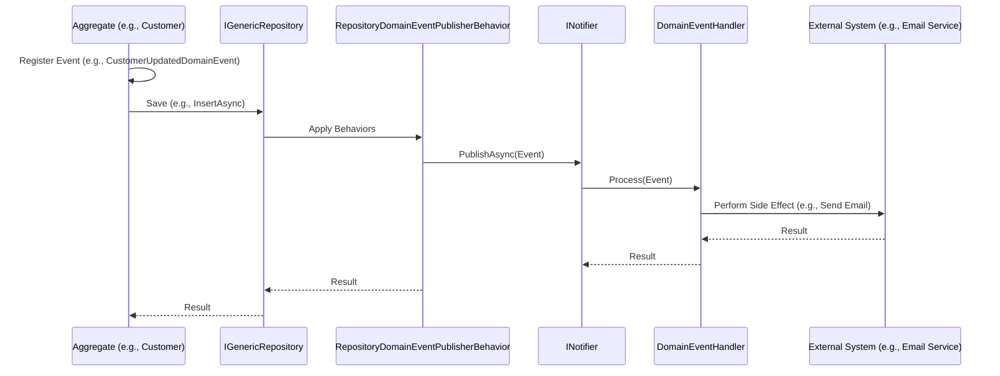

# Domain Events Feature Documentation

[TOC]

## Overview

### Background

Domain Events, as defined by Eric Evans in Domain-Driven Design (DDD), represent significant domain occurrences that other system components may react to. They are immutable, past-tense records (e.g., `PersonCreatedDomainEvent`) capturing "what happened" and carrying relevant data.

- **Purpose**: Events decouple producers (e.g., aggregates like `Customer` or `Person`) from consumers (handlers), promoting loose coupling and scalability. They support eventual consistency in distributed systems and enable auditability.
- **Handlers**: React to events for side effects like updating projections, sending notifications or triggering workflows.
- **Pub/Sub Model**: Events are published to multiple handlers, processed sequentially, concurrently or in fire-and-forget mode.

In bITDevKit, domain events inherit from `DomainEventBase` and are handled by `DomainEventHandlerBase<TEvent>`. The `Notifier` system dispatches events, with automatic publishing via repository behaviors (e.g., `RepositoryDomainEventPublisherBehavior`). Events are registered in aggregates using `DomainEvents.Register()`.

### Challenges

- **Coupling**: Direct component calls increase system rigidity.
- **Coordination**: Reacting to state changes across contexts is complex.
- **Reliability**: Ensuring events are published reliably, especially with persistence.
- **Scalability**: Efficiently handling multiple reactions to an event.

### Solution

The `Notifier` system provides:
- **Events**: Inherit from `DomainEventBase`, carrying domain data.
- **Handlers**: Implement `DomainEventHandlerBase<TEvent>`, defining reaction logic.
- **Publishing**: Via `INotifier.PublishAsync()` or repository behaviors.
- **Behaviors**: Support validation, retries or other logic.

### Flow Diagram

The following diagram illustrates the domain event flow:



## Setup

Register the `Notifier` in the DI container (e.g., in `CoreModule.cs`):

```csharp
services.AddNotifier()
    .AddHandlers()                                   // Scans for DomainEventHandlerBase<T>
    .WithBehavior<ValidationPipelineBehavior<,>>();  // Optional
```

Configure repositories for automatic event publishing:

```csharp
services.AddEntityFrameworkRepository<Customer, CoreDbContext>()
    .WithBehavior<RepositoryDomainEventPublisherBehavior<Customer>>();
```

## Basic Usage

### Defining a Domain Event
Events capture domain occurrences.

```csharp
public class PersonCreatedDomainEvent(Person person) : DomainEventBase
{
    public Person Person { get; } = person;
}
```

### Raising Events
Aggregates can register events during state changes.

```csharp
// Customer Aggregate

public static Customer Create(string firstName, string lastName, string email)
{
    var customer = new Customer(firstName, string lastName, EmailAddress.Create(email));
    customer.DomainEvents.Register(new CustomerCreatedDomainEvent(customer));
    return customer;
}

public Customer ChangeName(string firstName, string lastName)
{
    if (string.IsNullOrEmpty(firstName) && string.IsNullOrEmpty(lastName))
    {
        return this;
    }

    this.ApplyChange(this.FirstName, firstName, v => this.FirstName = v);
    this.ApplyChange(this.LastName, lastName, v => this.LastName = v);
    return this;
}

private Customer ApplyChange<T>(T currentValue, T newValue, Action<T> action)
{
    if (EqualityComparer<T>.Default.Equals(currentValue, newValue))
    {
        return this;
    }

    action(newValue);
    this.DomainEvents.Register(new CustomerUpdatedDomainEvent(this), true);
    return this;
}
```

### Publishing Events
**Automatic Publishing**:
The behavior handles publishing on repository operations.
```csharp
services.AddEntityFrameworkRepository<Customer, CoreDbContext>()
    .WithBehavior<RepositoryDomainEventPublisherBehavior<Customer>>();
```

**Manual Publishing**:
```csharp
var notifier = serviceProvider.GetRequiredService<INotifier>(); // or inject via constructor
var event = new PersonCreatedDomainEvent(new Person());
await notifier.PublishAsync(event);
```

### Event Handler
Handlers implement `DomainEventHandlerBase<TEvent>`.

```csharp
public class CustomerCreatedHandler(ILoggerFactory loggerFactory) : DomainEventHandlerBase<PersonCreatedDomainEvent>(loggerFactory)
{
    public override bool CanHandle(PersonCreatedDomainEvent notification)
    {
        return true;
    }

    public override async Task Process(PersonCreatedDomainEvent notification, CancellationToken cancellationToken)
    {
        await Task.Delay(100, cancellationToken); // Simulate work
        // this.Logger.LogInformation($"Person Created ================= {notification.Person.LastName}");
    }
}
```

See [features-requester-notifier.md](./features-requester-notifier.md) for more details.