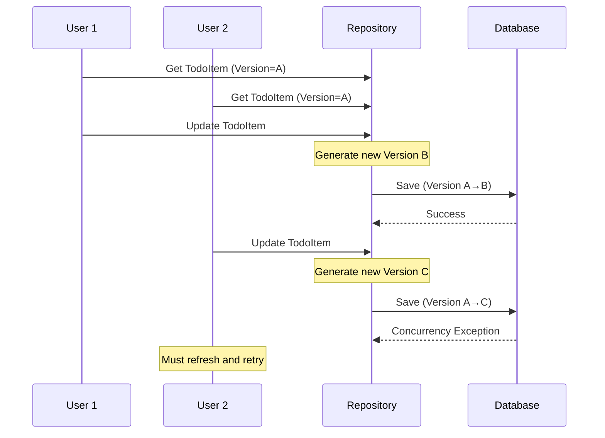

# Domain Repositories Feature Documentation

[TOC]

## Overview

### Challenges

### Solution

### Use Cases

## Usage

## Appendix A: Optimistic Concurrency Support

### Overview
The repository implementation provides built-in optimistic concurrency control to handle scenarios where multiple users might attempt to modify the same entity simultaneously. This feature helps prevent the "lost update" problem, where one user's changes could accidentally overwrite another user's modifications.



### Implementation

### 1. Enable Concurrency Support
To enable concurrency control for an entity, implement the `IConcurrency` interface:

```csharp
public class TodoItem : AuditableAggregateRoot<TodoItemId>, IConcurrency
{
    // Entity properties
    public string Title { get; set; }
    public TodoStatus Status { get; set; }
    
    // Concurrency token
    public Guid ConcurrencyVersion { get; set; }
}
```

#### 2. Configure Entity Framework Mapping
Configure the concurrency token in your entity configuration:

```csharp
public class TodoItemEntityTypeConfiguration : IEntityTypeConfiguration<TodoItem>
{
    public void Configure(EntityTypeBuilder<TodoItem> builder)
    {
        // Configure concurrency token
        builder.Property(e => e.ConcurrencyVersion)
            .IsConcurrencyToken()
            .ValueGeneratedOnAddOrUpdate();
            
        // Other configuration...
    }
}
```

### How It Prevents Data Conflicts (Repository)

1. When an entity is retrieved, its current `ConcurrencyVersion` is tracked
2. During updates, the repository:
   - Generates a new version GUID
   - Includes the original version in the update condition
   - Only updates if the database version matches the original version

### Example Usage

```csharp
public async Task UpdateTodoItemAsync(TodoItem item)
{
    try 
    {
        await _repository.UpdateAsync(item);
    }
    catch (DbUpdateConcurrencyException)
    {
        // Handle the conflict - typically by:
        // 1. Informing the user
        // 2. Reloading the latest data
        // 3. Allowing the user to merge changes
    }
}
```

### Benefits

- Database-agnostic implementation using GUIDs
- Automatic version management
- No additional database locks required
- Transparent to application code
- Works with disconnected entities

### Limitations

- Only available with Entity Framework repositories
- May require additional application logic to handle conflict resolution

The concurrency support provides a robust way to handle simultaneous updates while maintaining data integrity in your application. It's particularly useful in scenarios with multiple users working on the same data simultaneously.