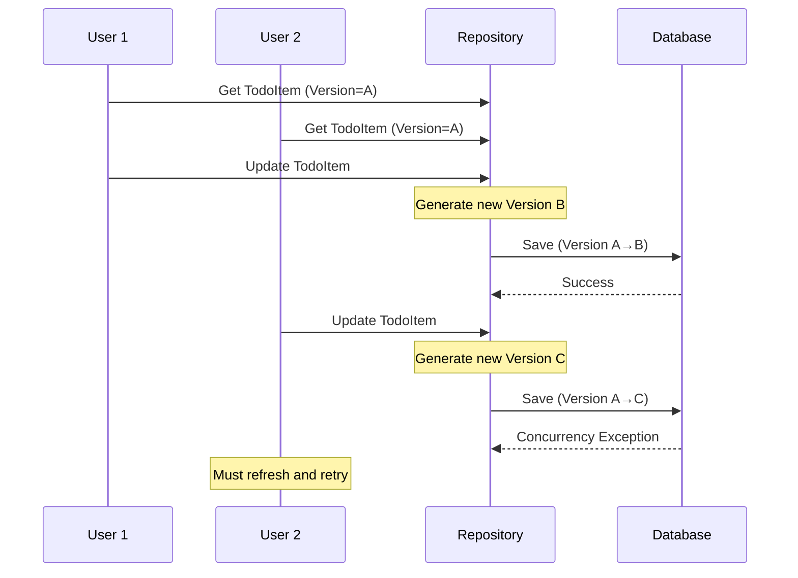
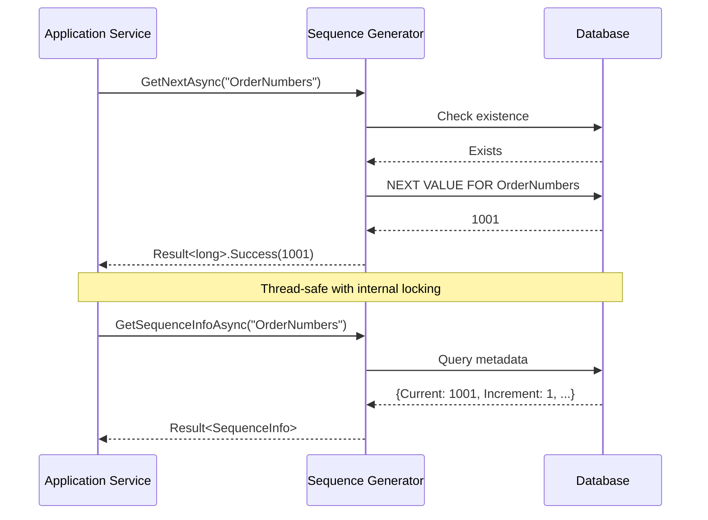

# Domain Repositories Feature Documentation

[TOC]

## Overview

The Domain Repositories feature provides a generic repository pattern implementation with powerful query capabilities. It enables efficient data access with type-safe filtering, ordering, paging, and eager loading of related entities through a fluent API.

### Challenges

When working with data access layers in domain-driven applications, developers face several challenges:

- **Repetitive CRUD Operations**: Writing the same create, read, update, delete operations for each entity type
- **Complex Include Paths**: Loading nested related entities requires verbose and error-prone string-based paths
- **Type Safety**: Lack of compile-time checking when specifying navigation properties to include
- **Query Composition**: Difficulty in building reusable, composable queries across different contexts
- **Abstraction Leakage**: Data access concerns bleeding into domain logic

### Solution

The repository pattern implementation provides:

- **Generic Repository Interface**: `IGenericRepository<TEntity>` for common CRUD operations
- **FindOptions**: A fluent API for building complex queries with filtering, ordering, paging, and includes
- **Type-Safe Includes**: `IncludeOption<TEntity, TProperty>` with `ThenInclude` support for nested navigation properties
- **Multiple Implementations**: EntityFramework, Cosmos, Azure Storage, and in-memory implementations
- **Specification Pattern**: Reusable query specifications for complex business rules

### Use Cases

- Loading entities with deeply nested navigation properties (e.g., Customer → Orders → OrderItems → Product)
- Building reusable query options across different handlers
- Implementing eager loading strategies to avoid N+1 query problems
- Creating type-safe data access layers that prevent runtime errors

## Usage

### Basic Repository Operations

```csharp
public class CustomerService
{
    private readonly IGenericRepository<Customer> repository;

    public async Task<Customer> GetCustomerAsync(Guid id, CancellationToken ct)
    {
        return await repository.FindOneAsync(id, cancellationToken: ct);
    }

    public async Task<IEnumerable<Customer>> GetAllCustomersAsync(CancellationToken ct)
    {
        return await repository.FindAllAsync(cancellationToken: ct);
    }
}
```

### Including Related Entities

Use `IncludeOption` to eagerly load related entities:

```csharp
// Simple include
var options = new FindOptions<Customer>()
    .AddInclude(new IncludeOption<Customer, Address>(c => c.BillingAddress));

var customers = await repository.FindAllAsync(options, cancellationToken);
```

### Nested Includes with ThenInclude

The `ThenInclude` feature enables fluent, type-safe chaining of navigation properties for loading deeply nested entity graphs. This is particularly useful when you need to load multiple levels of related entities in a single query.

#### Reference Navigation Properties

For single-reference navigation properties (e.g., Customer → Address → City → Country):

```csharp
var options = new FindOptions<Customer>()
    .AddInclude(new IncludeOption<Customer, Address>(c => c.BillingAddress)
        .ThenInclude(a => a.City)
        .ThenInclude(c => c.Country));

var customers = await repository.FindAllAsync(options, cancellationToken);
// Loads: Customer → BillingAddress → City → Country
```

#### Collection Navigation Properties

For collection navigation properties (e.g., Customer → Orders → OrderItems → Product):

```csharp
var options = new FindOptions<Customer>()
    .AddInclude(new IncludeOption<Customer, ICollection<Order>>(c => c.Orders)
        .ThenInclude(o => o.OrderItems)
        .ThenInclude(i => i.Product));

var customers = await repository.FindAllAsync(options, cancellationToken);
// Loads: Customer → Orders → OrderItems → Product
```

#### Multiple Include Chains

You can add multiple include chains to load different navigation paths:

```csharp
var options = new FindOptions<Order>()
    .AddInclude(new IncludeOption<Order, Address>(o => o.ShippingAddress)
        .ThenInclude(a => a.City)
        .ThenInclude(c => c.Country))
    .AddInclude(new IncludeOption<Order, ICollection<OrderItem>>(o => o.OrderItems)
        .ThenInclude(i => i.Product)
        .ThenInclude(p => p.Category));

var orders = await repository.FindAllAsync(options, cancellationToken);
// Loads both: Order → ShippingAddress → City → Country
//         and: Order → OrderItems → Product → Category
```

#### Real-World Example: E-Commerce Order Query

```csharp
public class OrderQueryHandler
{
    private readonly IGenericRepository<Order> orderRepository;

    public async Task<IEnumerable<Order>> GetOrdersWithFullDetailsAsync(
        CancellationToken cancellationToken)
    {
        var options = new FindOptions<Order>()
            // Include customer and their billing address details
            .AddInclude(new IncludeOption<Order, Customer>(o => o.Customer)
                .ThenInclude(c => c.BillingAddress)
                .ThenInclude(a => a.City))
            // Include order items and product details
            .AddInclude(new IncludeOption<Order, ICollection<OrderItem>>(o => o.OrderItems)
                .ThenInclude(i => i.Product)
                .ThenInclude(p => p.Supplier))
            // Include payment information
            .AddInclude(new IncludeOption<Order, Payment>(o => o.Payment)
                .ThenInclude(p => p.PaymentMethod));

        return await orderRepository.FindAllAsync(options, cancellationToken);
    }
}
```

#### Key Points

- **Type Safety**: All navigation properties are validated at compile-time
- **Fluent API**: Chain multiple `ThenInclude` calls for deep nesting
- **Generic Type Parameters**: Always specify both `TEntity` and `TProperty` types explicitly in `IncludeOption<TEntity, TProperty>`
- **Collection Support**: Works with both reference properties (`Address`, `Customer`) and collection properties (`ICollection<Order>`, `IEnumerable<OrderItem>`)
- **Multiple Chains**: Combine multiple include chains in a single `FindOptions` instance
- **Performance**: Reduces database round-trips by loading all related data in a single query

### Combining with Other Options

You can combine includes with filtering, ordering, and paging:

```csharp
var options = new FindOptions<Customer>()
    .AddInclude(new IncludeOption<Customer, ICollection<Order>>(c => c.Orders)
        .ThenInclude(o => o.OrderItems))
    .WithOrder(new OrderOption<Customer>(c => c.Name))
    .WithFilter(new FilterOption<Customer>(c => c.IsActive))
    .WithPage(1, 20)
    .WithDistinct();

var pagedCustomers = await repository.FindAllAsync(options, cancellationToken);
```

### Projection with Includes

Use includes with projection to load related data before projecting:

```csharp
var options = new FindOptions<Order>()
    .AddInclude(new IncludeOption<Order, Customer>(o => o.Customer)
        .ThenInclude(c => c.BillingAddress));

var customerNames = await repository.ProjectAllAsync(
    o => o.Customer.Name,
    options,
    cancellationToken);
```

## Appendix A: Optimistic Concurrency Support

### Overview
The repository implementation provides built-in optimistic concurrency control to handle scenarios where multiple users might attempt to modify the same entity simultaneously. This feature helps prevent the "lost update" problem, where one user's changes could accidentally overwrite another user's modifications.



### Implementation

### 1. Enable Concurrency Support
To enable concurrency control for an entity, implement the `IConcurrency` interface:

```csharp
public class TodoItem : AuditableAggregateRoot<TodoItemId>, IConcurrency
{
    // Entity properties
    public string Title { get; set; }
    public TodoStatus Status { get; set; }
    
    // Concurrency token
    public Guid ConcurrencyVersion { get; set; }
}
```

#### 2. Configure Entity Framework Mapping
Configure the concurrency token in your entity configuration:

```csharp
public class TodoItemEntityTypeConfiguration : IEntityTypeConfiguration<TodoItem>
{
    public void Configure(EntityTypeBuilder<TodoItem> builder)
    {
        // Configure concurrency token
        builder.Property(e => e.ConcurrencyVersion)
            .IsConcurrencyToken()
            .ValueGeneratedOnAddOrUpdate();
            
        // Other configuration...
    }
}
```

### How It Prevents Data Conflicts (Repository)

1. When an entity is retrieved, its current `ConcurrencyVersion` is tracked
2. During updates, the repository:
   - Generates a new version GUID
   - Includes the original version in the update condition
   - Only updates if the database version matches the original version

### Example Usage

```csharp
public async Task UpdateTodoItemAsync(TodoItem item)
{
    try 
    {
        await _repository.UpdateAsync(item);
    }
    catch (DbUpdateConcurrencyException)
    {
        // Handle the conflict - typically by:
        // 1. Informing the user
        // 2. Reloading the latest data
        // 3. Allowing the user to merge changes
    }
}
```

### Benefits

- Database-agnostic implementation using GUIDs as versions
- Automatic version management
- No additional database locks required
- Transparent to application code
- Works with disconnected entities

### Limitations

- Only available with Entity Framework repositories
- May require additional application logic to handle conflict resolution

The concurrency support provides a robust way to handle simultaneous updates while maintaining data integrity in your application. It's particularly useful in scenarios with multiple users working on the same data simultaneously.

---

## Appendix B: Sequence Number Generation Support

### Overview
The sequence number generation feature allows developers to generate unique, auto-incrementing numbers for business identifiers (such as order numbers or invoice IDs) directly from the database. This is particularly useful when you need reliable, thread-safe sequencing that integrates with the DbContext. The implementation supports SQL Server, PostgreSQL, SQLite (with emulation) and an in-memory option for testing.



### Setup
To use sequence generation, first define sequences in your DbContext and register the generator in dependency injection (DI).

#### 1. Define Sequences in DbContext
Configure sequences in the `OnModelCreating` method of your DbContext. This step is provider-specific.

```csharp
protected override void OnModelCreating(ModelBuilder modelBuilder)
{
    modelBuilder.HasSequence<int>("OrderNumbers", "CoreSchema")
        .StartsAt(1000)
        .IncrementsBy(5);
    // Add more sequences as needed

    base.OnModelCreating(modelBuilder);
}
```
Apply database migrations to create the sequences (e.g., `dotnet ef migrations add AddSequences` and `dotnet ef database update`).

#### 2. Register in DI
Register the appropriate generator for your database provider using the provided extensions. The generator is typically scoped to match the DbContext lifetime.

```csharp
// In ConfigureServices
services.AddDbContext<YourDbContext>(options => options.UseSqlServer(connectionString))
    .WithSequenceNumberGenerator(new SequenceNumberGeneratorOptions 
    {
        LockTimeout = TimeSpan.FromSeconds(60)
    });

// For PostgreSQL
services.AddDbContext<YourDbContext>(options => options.UseNpgsql(connectionString))
    .WithSequenceNumberGenerator();

// For SQLite
services.AddDbContext<YourDbContext>(options => options.UseSqlite(connectionString))
    .WithSequenceNumberGenerator();

// For in-memory testing (no DbContext dependency)
services.AddScoped<ISequenceNumberGenerator, InMemorySequenceNumberGenerator>();
```

#### Provider-Specific Notes
SQL Server and PostgreSQL use native sequences for full support, including increment steps and bounds. SQLite emulates basic sequencing via a system table, while the in-memory option is ideal for unit tests and requires manual configuration in test setup.

### Usage
Inject `ISequenceNumberGenerator` into your services and use it to generate numbers. Operations return `Result<T>` for safe error handling.

#### Basic Generation
```csharp
public class OrderService
{
    private readonly ISequenceNumberGenerator generator;
    private readonly YourDbContext context;

    public OrderService(ISequenceNumberGenerator generator, YourDbContext context)
    {
        generator = generator;
        context = context;
    }

    public async Task<Result<Order>> CreateOrderAsync(Order order, CancellationToken ct = default)
    {
        var numberResult = await generator.GetNextAsync("OrderNumbers", "CoreSchema", ct);
        if (numberResult.IsFailure)
        {
            return Result<Order>.Failure().WithErrors(numberResult.Errors);
        }

        order.OrderNumber = numberResult.Value;
        context.Orders.Add(order);
        await context.SaveChangesAsync(ct);

        return Result<Order>.Success(order);
    }
}
```

#### Additional Operations
- **Metadata Query**: Retrieve details like current value.
  ```csharp
  var infoResult = await generator.GetSequenceInfoAsync("OrderNumbers");
  if (infoResult.IsSuccess)
  {
      Console.WriteLine($"Current: {infoResult.Value.CurrentValue}");
  }
  ```
- **Reset**: Restart the sequence (e.g., for administrative tasks).
  ```csharp
  await generator.ResetSequenceAsync("OrderNumbers", 1000);
  ```
- **Batch Generation**: Get multiple sequences in one call.
  ```csharp
  var results = await generator.GetNextMultipleAsync(new[] { "OrderNumbers", "InvoiceNumbers" });
  if (results.IsSuccess)
  {
      order.OrderNumber = results.Value["OrderNumbers"];
  }
  ```
- **Entity Convention**: Generate based on entity type (e.g., "OrderSequence").
  ```csharp
  var numberResult = await generator.GetNextForEntityAsync<Order>("CoreSchema");
  ```

The generator ensures thread-safety with internal locking and supports Result-based error handling for issues like missing sequences or timeouts.

### Benefits and Limitations
This feature provides reliable sequencing integrated with your DbContext, making it easy to generate business IDs without relying on entity primaries. It's thread-safe and works across providers, though SQLite has limited emulation (basic increment only). For high-volume use, consider batch operations to minimize database calls. In tests, the in-memory generator allows fast, isolated verification without a real database.