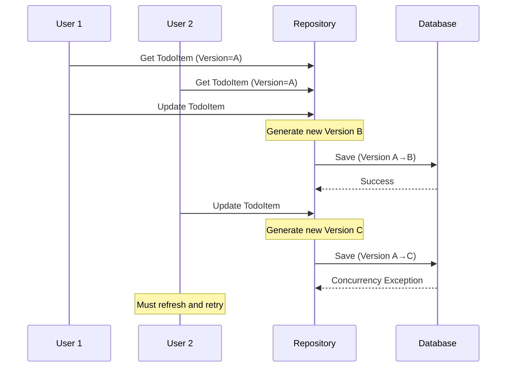
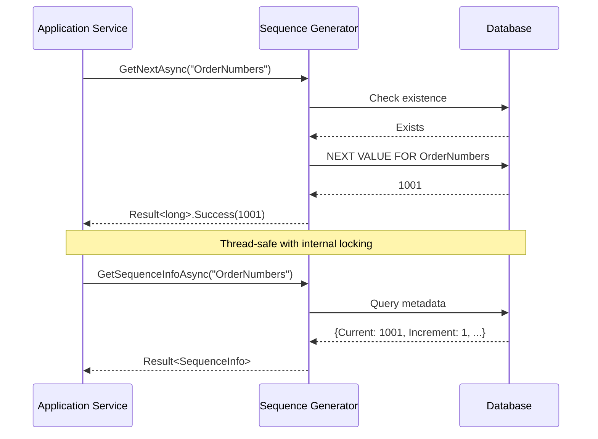

# Domain Repositories Feature Documentation

> Access aggregates through type-safe repositories with rich querying, paging, and loading options.

[TOC]

## Overview

The Domain Repositories feature provides a generic repository pattern implementation with powerful query capabilities. It enables efficient data access with type-safe filtering, ordering, paging, and eager loading of related entities through a fluent API.

### Challenges

When working with data access layers in domain-driven applications, developers face several challenges:

- **Repetitive CRUD Operations**: Writing the same create, read, update, delete operations for each entity type
- **Complex Include Paths**: Loading nested related entities requires verbose and error-prone string-based paths
- **Type Safety**: Lack of compile-time checking when specifying navigation properties to include
- **Query Composition**: Difficulty in building reusable, composable queries across different contexts
- **Abstraction Leakage**: Data access concerns bleeding into domain logic

### Solution

The repository pattern implementation provides:

- **Generic Repository Interface**: `IGenericRepository<TEntity>` for common CRUD operations
- **FindOptions**: A fluent API for building complex queries with filtering, ordering, paging, and includes
- **Type-Safe Includes**: `IncludeOption<TEntity, TProperty>` with `ThenInclude` support for nested navigation properties
- **Multiple Implementations**: EntityFramework, Cosmos, Azure Storage, and in-memory implementations
- **Specification Pattern**: Reusable query specifications for complex business rules

This page focuses on how repositories consume specifications. For the specification model itself, see [Domain Specifications](./features-domain-specifications.md).

### Use Cases

- Loading entities with deeply nested navigation properties (e.g., Customer → Orders → OrderItems → Product)
- Building reusable query options across different handlers
- Implementing eager loading strategies to avoid N+1 query problems
- Creating type-safe data access layers that prevent runtime errors

## Usage

### Basic Repository Operations

```csharp
public class CustomerService
{
    private readonly IGenericRepository<Customer> repository;

    public async Task<Customer> GetCustomerAsync(Guid id, CancellationToken ct)
    {
        return await repository.FindOneAsync(id, cancellationToken: ct);
    }

    public async Task<IEnumerable<Customer>> GetAllCustomersAsync(CancellationToken ct)
    {
        return await repository.FindAllAsync(cancellationToken: ct);
    }
}
```

### Including Related Entities

Use `IncludeOption` to eagerly load related entities:

```csharp
// Simple include
var options = new FindOptions<Customer>()
    .AddInclude(new IncludeOption<Customer, Address>(c => c.BillingAddress));

var customers = await repository.FindAllAsync(options, cancellationToken);
```

### Nested Includes with ThenInclude

The `ThenInclude` feature enables fluent, type-safe chaining of navigation properties for loading deeply nested entity graphs. This is particularly useful when you need to load multiple levels of related entities in a single query.

#### Reference Navigation Properties

For single-reference navigation properties (e.g., Customer → Address → City → Country):

```csharp
var options = new FindOptions<Customer>()
    .AddInclude(new IncludeOption<Customer, Address>(c => c.BillingAddress)
        .ThenInclude(a => a.City)
        .ThenInclude(c => c.Country));

var customers = await repository.FindAllAsync(options, cancellationToken);
// Loads: Customer → BillingAddress → City → Country
```

#### Collection Navigation Properties

For collection navigation properties (e.g., Customer → Orders → OrderItems → Product):

```csharp
var options = new FindOptions<Customer>()
    .AddInclude(new IncludeOption<Customer, ICollection<Order>>(c => c.Orders)
        .ThenInclude(o => o.OrderItems)
        .ThenInclude(i => i.Product));

var customers = await repository.FindAllAsync(options, cancellationToken);
// Loads: Customer → Orders → OrderItems → Product
```

#### Multiple Include Chains

You can add multiple include chains to load different navigation paths:

```csharp
var options = new FindOptions<Order>()
    .AddInclude(new IncludeOption<Order, Address>(o => o.ShippingAddress)
        .ThenInclude(a => a.City)
        .ThenInclude(c => c.Country))
    .AddInclude(new IncludeOption<Order, ICollection<OrderItem>>(o => o.OrderItems)
        .ThenInclude(i => i.Product)
        .ThenInclude(p => p.Category));

var orders = await repository.FindAllAsync(options, cancellationToken);
// Loads both: Order → ShippingAddress → City → Country
//         and: Order → OrderItems → Product → Category
```

#### Real-World Example: E-Commerce Order Query

```csharp
public class OrderQueryHandler
{
    private readonly IGenericRepository<Order> orderRepository;

    public async Task<IEnumerable<Order>> GetOrdersWithFullDetailsAsync(
        CancellationToken cancellationToken)
    {
        var options = new FindOptions<Order>()
            // Include customer and their billing address details
            .AddInclude(new IncludeOption<Order, Customer>(o => o.Customer)
                .ThenInclude(c => c.BillingAddress)
                .ThenInclude(a => a.City))
            // Include order items and product details
            .AddInclude(new IncludeOption<Order, ICollection<OrderItem>>(o => o.OrderItems)
                .ThenInclude(i => i.Product)
                .ThenInclude(p => p.Supplier))
            // Include payment information
            .AddInclude(new IncludeOption<Order, Payment>(o => o.Payment)
                .ThenInclude(p => p.PaymentMethod));

        return await orderRepository.FindAllAsync(options, cancellationToken);
    }
}
```

#### Key Points

- **Type Safety**: All navigation properties are validated at compile-time
- **Fluent API**: Chain multiple `ThenInclude` calls for deep nesting
- **Generic Type Parameters**: Always specify both `TEntity` and `TProperty` types explicitly in `IncludeOption<TEntity, TProperty>`
- **Collection Support**: Works with both reference properties (`Address`, `Customer`) and collection properties (`ICollection<Order>`, `IEnumerable<OrderItem>`)
- **Multiple Chains**: Combine multiple include chains in a single `FindOptions` instance
- **Performance**: Reduces database round-trips by loading all related data in a single query

### Combining with Other Options

You can combine includes with filtering, ordering, and paging:

```csharp
var options = new FindOptions<Customer>()
    .AddInclude(new IncludeOption<Customer, ICollection<Order>>(c => c.Orders)
        .ThenInclude(o => o.OrderItems))
    .WithOrder(new OrderOption<Customer>(c => c.Name))
    .WithFilter(new FilterOption<Customer>(c => c.IsActive))
    .WithPage(1, 20)
    .WithDistinct();

var pagedCustomers = await repository.FindAllAsync(options, cancellationToken);
```

### Projection with Includes

Use includes with projection to load related data before projecting:

```csharp
var options = new FindOptions<Order>()
    .AddInclude(new IncludeOption<Order, Customer>(o => o.Customer)
        .ThenInclude(c => c.BillingAddress));

var customerNames = await repository.ProjectAllAsync(
    o => o.Customer.Name,
    options,
    cancellationToken);
```

### Bulk Updates And Deletes

Use `UpdateSetAsync` and `DeleteSetAsync` for set-based operations that run directly in the repository provider without loading each entity instance first.

> Bulk operations are ideal for administrative tasks or background jobs that need to update or delete large numbers of entities without loading them into memory.

```csharp
var affected = await repository.UpdateSetAsync(
    set => set
        .Set(c => c.IsActive, false)
        .Set(c => c.LastName, "Archived")
        .Set(c => c.LoginCount, c => c.LoginCount + 1),
    cancellationToken: cancellationToken);

var deleted = await repository.DeleteSetAsync(cancellationToken: cancellationToken);
```

You can limit the affected rows with one or more specifications:

```csharp
var affected = await repository.UpdateSetAsync(
    new CustomerIsInactiveSpecification(),
    set => set
        .Set(c => c.IsActive, false)
        .Set(c => c.LoginCount, c => c.LoginCount + 1),
    cancellationToken: cancellationToken);

var deleted = await repository.DeleteSetAsync(
[
    new CustomerCountrySpecification("DE"),
    new CustomerIsInactiveSpecification()
], cancellationToken: cancellationToken);
```

Expression-based forwarding overloads are also available through `RepositoryExtensions`:

```csharp
var affected = await repository.UpdateSetAsync(
    c => c.IsActive,
    set => set
        .Set(c => c.LastName, "Archived")
        .Set(c => c.LoginCount, c => c.LoginCount + 1),
    cancellationToken: cancellationToken);

var deleted = await repository.DeleteSetAsync(
    c => !c.IsActive,
    cancellationToken: cancellationToken);
```

`FilterModel`-based extension overloads translate the query filters into specifications before forwarding them to the repository:

```csharp
var filter = new FilterModel
{
    Filters =
    [
        new FilterCriteria
        {
            Field = nameof(Customer.IsActive),
            Operator = FilterOperator.Equal,
            Value = false
        }
    ]
};

var affected = await repository.UpdateSetAsync(
    filter,
    set => set
        .Set(c => c.LastName, "Archived")
        .Set(c => c.LoginCount, c => c.LoginCount + 1),
    cancellationToken: cancellationToken);

var deleted = await repository.DeleteSetAsync(filter, cancellationToken: cancellationToken);
```

#### Key Points For Bulk Set Operations

- Filtering for `UpdateSetAsync` and `DeleteSetAsync` comes from specification instances, including specifications generated from a `FilterModel`.
- `FindOptions` continue to shape the query only; they do not define the `WHERE` clause.
- `UpdateSetAsync` supports both constant assignments such as `.Set(c => c.IsActive, false)` and computed assignments such as `.Set(c => c.LoginCount, c => c.LoginCount + 1)`.
- Only `EntityFrameworkGenericRepository<TEntity>` and `InMemoryRepository<TEntity>` currently provides a real implementation for repository bulk updates and deletes.
- Other repository implementations expose the same API for consistency but currently throw `NotImplementedException`.
- With Entity Framework, set-based operations execute directly in the database and do not synchronize already tracked entities in the current `DbContext`. If you need the updated database state immediately afterwards, re-query using `NoTracking` or use a fresh context/repository instance.

### Explicit Provider Bulk Inserts

`IEntityBulkInserter<TEntity>` is a Domain-owned, infrastructure-implemented preview capability for high-volume root-row ingestion. It is deliberately independent of `IGenericRepository<TEntity>.InsertSetAsync`: normal repository insertion remains the right choice when callers need EF tracking, graph cascades, or database-generated values returned to input objects.

For a compatible native operation, bulk insert guarantees:

- mapping preflight before database work;
- one provider invocation, with provider batches contained inside one operation transaction;
- root-table-only writes, including same-table non-JSON owned references;
- an exact `Result<long>` inserted-row count and cancellation propagation;
- detached input entities with no identity, default, computed, or rowversion hydration; and
- explicitly selected behavior semantics only; repository decorators and EF interceptors are not inspected or copied.

Register the repository and bulk inserter independently:

- `AddSqlServerDbContext<TContext>()` registers the stateless SQL Server native strategy automatically.
- `AddEntityFrameworkBulkInserter<TEntity, TContext>()` registers the typed terminal operation and its explicitly selected decorators.

```csharp
services.AddSqlServerDbContext<CoreDbContext>(options => options
    .UseConnectionString(connectionString));

services.AddEntityFrameworkRepository<TodoItem, CoreDbContext>()
    .WithTransactions();

services.AddEntityFrameworkBulkInserter<TodoItem, CoreDbContext>(
    new SqlServerEntityBulkInsertOptions
    {
        BatchSize = 5_000,
        SqlBulkCopyOptions = SqlBulkCopyOptions.TableLock
    })
    .WithBehavior<EntityBulkInserterCancellationBehavior<TodoItem>>()
    .WithBehavior<EntityBulkInserterTracingBehavior<TodoItem>>()
    .WithBehavior<EntityBulkInserterLoggingBehavior<TodoItem>>()
    .WithBehavior<EntityBulkInserterMetricsBehavior<TodoItem>>()
    .WithBehavior<EntityBulkInserterOutboxDomainEventBehavior<TodoItem, CoreDbContext>>()
    .WithBehavior<EntityBulkInserterAuditStateBehavior<TodoItem>>()
    .WithBehavior<EntityBulkInserterConcurrencyBehavior<TodoItem>>()
    .WithBehavior<EntityBulkInserterDomainEventBehavior<TodoItem>>()
    .WithBehavior<EntityBulkInserterDomainEventMetricsBehavior<TodoItem>>();
```

`WithBehavior` calls are ordered from outermost to innermost. Register the outbox decorator before mutation and event decorators so it owns the transaction enclosing both the native write and the outbox save. Do not combine the outbox decorator with `EntityBulkInserterDomainEventPublisherBehavior<TEntity>`: direct publication is intentionally non-atomic with the native write.

| Decorator | Entity requirement | Main dependency |
| --- | --- | --- |
| Cancellation, tracing, logging, metrics | None | Cancellation token, `ActivitySource`, `ILoggerFactory`, or `IMeterFactory` |
| Audit state | `IAuditable` | Optional `ICurrentUserAccessor` |
| Concurrency | `IConcurrency` | None |
| Created domain event and event metrics | `IAggregateRoot` | Optional `IMeterFactory` for metrics |
| Outbox domain events | `IAggregateRoot` | `TContext : IOutboxDomainEventContext`, optional queue/options |
| Direct domain-event publisher | `IAggregateRoot` | `IDomainEventPublisher` |

Then inject `IEntityBulkInserter<TEntity>` directly into application or presentation orchestration code, for example a DataPorter completion interceptor. The consumer needs only the Domain repository namespace for the contract:

```csharp
public sealed class TodoItemBulkImportInterceptor(
    IMapper mapper,
    ICurrentUserAccessor currentUserAccessor,
    IEntityBulkInserter<TodoItem> bulkInserter)
    : IImportRowInterceptor<TodoItemModel>
{
    public Task<RowInterceptionDecision> BeforeImportAsync(
        ImportRowContext<TodoItemModel> context,
        CancellationToken cancellationToken = default)
    {
        return Task.FromResult(RowInterceptionDecision.Continue());
    }

    public async Task<Result> AfterImportCompletedAsync(
        ImportCompletionContext<TodoItemModel> context,
        CancellationToken cancellationToken = default)
    {
        if (context.Result.HasErrors || context.Result.SuccessfulRows == 0)
        {
            return Result.Success();
        }

        var entities = context.Result.Data
            .Select(model =>
            {
                var entity = mapper.Map<TodoItemModel, TodoItem>(model);
                entity.UserId = currentUserAccessor.UserId;
                // Native bulk insert writes the TodoItem root table only.
                entity.Steps.Clear();
                return entity;
            })
            .ToList();

        var bulkResult = await bulkInserter.InsertAsync(entities, cancellationToken);

        return bulkResult.IsSuccess
            ? Result.Success()
            : Result.Failure().WithErrors(bulkResult.Errors);
    }
}
```

The DoFiesta sample uses this pattern in a DataPorter `AfterImportCompletedAsync` interceptor: the file is parsed and validated first, then the successful todo rows are mapped to `TodoItem` entities and written with `IEntityBulkInserter<TodoItem>`.

#### Options and unsupported providers

`EntityBulkInsertOptions` is provider-neutral and applies to every current or future strategy:

- `BatchSize`
- `CommandTimeout`
- `AssignSequentialGuidKeys`
- `AssignConcurrencyVersions`
- `KeepGeneratedIdentityValues`

For SQL Server, pass the optional derived `SqlServerEntityBulkInsertOptions` to `AddEntityFrameworkBulkInserter`. Its `SqlBulkCopyOptions` keeps SQL Server-specific flags such as `TableLock`. Do not configure `KeepIdentity` or `UseInternalTransaction`: `KeepGeneratedIdentityValues` controls identity preservation and the SQL Server strategy uses the active EF transaction.

The DevKit provider setup method is required for automatic native-provider registration. This raw EF setup intentionally has no native fallback:

```csharp
services.AddDbContext<CoreDbContext>(options => options.UseSqlServer(connectionString));
services.AddEntityFrameworkBulkInserter<TodoItem, CoreDbContext>();
```

When `IEntityBulkInserter<TodoItem>.InsertAsync(...)` runs, it returns a failed `Result<long>` with a typed provider error naming the entity, active EF provider, and registered providers. PostgreSQL and SQLite provider packages currently register typed unsupported inserters, which return `EntityBulkInsertPreconditionError` instead of silently falling back to row-by-row insertion.

Native mapping rejects populated owned or non-owned navigations, owned collections with rows, separate-table or JSON ownership, multi-table inheritance, tracked inputs, duplicate object references, and required shadow properties without an explicit shadow-value provider. Null or empty navigations are allowed because they preserve the root-only contract.

#### Transactions, Cancellation, And Outbox

The terminal opens an EF transaction when no caller transaction exists. All native batches commit or roll back together. The outbox decorator follows the same rule and encloses its root write plus outbox persistence in one transaction. If `DbContext.Database.CurrentTransaction` is already active, both participate without committing or rolling it back; the caller owns the final outcome.

Cancellation is rethrown as `OperationCanceledException` and an owned transaction is rolled back. In immediate outbox mode, events are queued only after an outbox-owned commit. With a caller-owned transaction, use interval polling because the decorator cannot know when the caller commits; aggregate events are not cleared early.

#### Key Points For Explicit Bulk Inserts

- The current SQL Server strategy uses `Microsoft.Data.SqlClient.SqlBulkCopy`; no commercial bulk-insert package is required.
- Bulk insert is opt-in and provider-native. It does not replace `IGenericRepository<TEntity>.InsertSetAsync`.
- Only explicitly registered decorators execute; repository decorators and EF interceptors are not inspected or copied.
- The shared mapper writes aggregate-root table columns, flattens same-table owned reference values, and generates primitive or typed GUID ids when needed.
- The shared orchestrator dispatches by exact `DbContext.Database.ProviderName`; it never infers a provider from a connection string.
- Native inputs stay detached. Store-generated identity, default, computed, and rowversion values are not copied back.
- Prefer this API for imports, seed data, generated records, queue/log batches, or other large inserts where the caller owns the trade-off.

#### Create A New Provider

To add PostgreSQL, SQLite, or another relational provider without modifying the shared orchestrator:

1. Create or update the provider assembly so it references `Infrastructure.EntityFramework` and its EF Core/ADO.NET provider packages.
2. Implement the stateless non-generic `IEntityBulkInsertProvider`. Set `ProviderName` to the provider's exact `DbContext.Database.ProviderName` value and implement native writing from `EntityBulkInsertBatch<TEntity>`.
3. Keep provider-native connections, transactions, identifier quoting, wire formats, and provider-specific option enums in that provider assembly. Do not duplicate EF metadata mapping, generated-value assignment, or `Result<long>` conversion from the shared layer.
4. Update every DevKit `Add*DbContext<TContext>` overload for that provider to use `TryAddEnumerable` and register one singleton `IEntityBulkInsertProvider` implementation.
5. Add a derived options type only when native options are needed; derive it from `EntityBulkInsertOptions` and keep the shared options provider-neutral.
6. Add terminal contract tests plus provider integration tests for mappings, value conversion, generated values, transactions, identities, native options, and registration.

## Appendix A: Optimistic Concurrency Support

### Overview
The repository implementation provides built-in optimistic concurrency control to handle scenarios where multiple users might attempt to modify the same entity simultaneously. This feature helps prevent the "lost update" problem, where one user's changes could accidentally overwrite another user's modifications.


```mermaid
sequenceDiagram
    participant User1 as User 1
    participant User2 as User 2
    participant Repo as Repository
    participant DB as Database

    User1->>Repo: Get TodoItem (Version=A)
    User2->>Repo: Get TodoItem (Version=A)

    User1->>Repo: Update TodoItem
    Note over Repo: Generate new Version B
    Repo->>DB: Save (Version A→B)
    DB-->>Repo: Success

    User2->>Repo: Update TodoItem
    Note over Repo: Generate new Version C
    Repo->>DB: Save (Version A→C)
    DB-->>Repo: Concurrency Exception
    Note over User2: Must refresh and retry
```

### Implementation

### 1. Enable Concurrency Support
To enable concurrency control for an entity, implement the `IConcurrency` interface:

```csharp
public class TodoItem : AuditableAggregateRoot<TodoItemId>, IConcurrency
{
    // Entity properties
    public string Title { get; set; }
    public TodoStatus Status { get; set; }

    // Concurrency token
    public Guid ConcurrencyVersion { get; set; }
}
```

#### 2. Configure Entity Framework Mapping
Configure the concurrency token in your entity configuration:

```csharp
public class TodoItemEntityTypeConfiguration : IEntityTypeConfiguration<TodoItem>
{
    public void Configure(EntityTypeBuilder<TodoItem> builder)
    {
        // Configure concurrency token
        builder.Property(e => e.ConcurrencyVersion)
            .IsConcurrencyToken()
            .ValueGeneratedOnAddOrUpdate();

        // Other configuration...
    }
}
```

### How It Prevents Data Conflicts (Repository)

1. When an entity is retrieved, its current `ConcurrencyVersion` is tracked
2. During updates, the repository:
   - Generates a new version GUID
   - Includes the original version in the update condition
   - Only updates if the database version matches the original version

### Example Usage

```csharp
public async Task UpdateTodoItemAsync(TodoItem item)
{
    try
    {
        await _repository.UpdateAsync(item);
    }
    catch (DbUpdateConcurrencyException)
    {
        // Handle the conflict - typically by:
        // 1. Informing the user
        // 2. Reloading the latest data
        // 3. Allowing the user to merge changes
    }
}
```

### Benefits

- Database-agnostic implementation using GUIDs as versions
- Automatic version management
- No additional database locks required
- Transparent to application code
- Works with disconnected entities

### Limitations

- Only available with Entity Framework repositories
- May require additional application logic to handle conflict resolution

The concurrency support provides a robust way to handle simultaneous updates while maintaining data integrity in your application. It's particularly useful in scenarios with multiple users working on the same data simultaneously.

---

## Appendix B: Sequence Number Generation Support

### Overview
The sequence number generation feature allows developers to generate unique, auto-incrementing numbers for business identifiers (such as order numbers or invoice IDs) directly from the database. This is particularly useful when you need reliable, thread-safe sequencing that integrates with the DbContext. The implementation supports SQL Server, PostgreSQL, SQLite (with emulation) and an in-memory option for testing.


```mermaid
sequenceDiagram
    participant App as Application Service
    participant Gen as Sequence Generator
    participant DB as Database

    App->>Gen: GetNextAsync("OrderNumbers")
    Gen->>DB: Check existence
    DB-->>Gen: Exists
    Gen->>DB: NEXT VALUE FOR OrderNumbers
    DB-->>Gen: 1001
    Gen-->>App: Result<long>.Success(1001)

    Note over App,DB: Thread-safe with internal locking

    App->>Gen: GetSequenceInfoAsync("OrderNumbers")
    Gen->>DB: Query metadata
    DB-->>Gen: {Current: 1001, Increment: 1, ...}
    Gen-->>App: Result<SequenceInfo>
```

### Setup
To use sequence generation, first define sequences in your DbContext and register the generator in dependency injection (DI).

#### 1. Define Sequences in DbContext
Configure sequences in the `OnModelCreating` method of your DbContext. This step is provider-specific.

```csharp
protected override void OnModelCreating(ModelBuilder modelBuilder)
{
    modelBuilder.HasSequence<int>("OrderNumbers", "CoreSchema")
        .StartsAt(1000)
        .IncrementsBy(5);
    // Add more sequences as needed

    base.OnModelCreating(modelBuilder);
}
```
Apply database migrations to create the sequences (e.g., `dotnet ef migrations add AddSequences` and `dotnet ef database update`).

#### 2. Register in DI
Register the appropriate generator for your database provider using the provided extensions. The generator is typically scoped to match the DbContext lifetime.

```csharp
// In ConfigureServices
services.AddDbContext<YourDbContext>(options => options.UseSqlServer(connectionString))
    .WithSequenceNumberGenerator(new SequenceNumberGeneratorOptions
    {
        LockTimeout = TimeSpan.FromSeconds(60)
    });

// For PostgreSQL
services.AddDbContext<YourDbContext>(options => options.UseNpgsql(connectionString))
    .WithSequenceNumberGenerator();

// For SQLite
services.AddDbContext<YourDbContext>(options => options.UseSqlite(connectionString))
    .WithSequenceNumberGenerator();

// For in-memory testing (no DbContext dependency)
services.AddScoped<ISequenceNumberGenerator, InMemorySequenceNumberGenerator>();
```

#### Provider-Specific Notes
SQL Server and PostgreSQL use native sequences for full support, including increment steps and bounds. SQLite emulates basic sequencing via a system table, while the in-memory option is ideal for unit tests and requires manual configuration in test setup.

### Usage
Inject `ISequenceNumberGenerator` into your services and use it to generate numbers. Operations return `Result<T>` for safe error handling.

#### Basic Generation
```csharp
public class OrderService
{
    private readonly ISequenceNumberGenerator generator;
    private readonly YourDbContext context;

    public OrderService(ISequenceNumberGenerator generator, YourDbContext context)
    {
        generator = generator;
        context = context;
    }

    public async Task<Result<Order>> CreateOrderAsync(Order order, CancellationToken ct = default)
    {
        var numberResult = await generator.GetNextAsync("OrderNumbers", "CoreSchema", ct);
        if (numberResult.IsFailure)
        {
            return Result<Order>.Failure().WithErrors(numberResult.Errors);
        }

        order.OrderNumber = numberResult.Value;
        context.Orders.Add(order);
        await context.SaveChangesAsync(ct);

        return Result<Order>.Success(order);
    }
}
```

#### Additional Operations
- **Metadata Query**: Retrieve details like current value.
  ```csharp
  var infoResult = await generator.GetSequenceInfoAsync("OrderNumbers");
  if (infoResult.IsSuccess)
  {
      Console.WriteLine($"Current: {infoResult.Value.CurrentValue}");
  }
  ```
- **Reset**: Restart the sequence (e.g., for administrative tasks).
  ```csharp
  await generator.ResetSequenceAsync("OrderNumbers", 1000);
  ```
- **Batch Generation**: Get multiple sequences in one call.
  ```csharp
  var results = await generator.GetNextMultipleAsync(new[] { "OrderNumbers", "InvoiceNumbers" });
  if (results.IsSuccess)
  {
      order.OrderNumber = results.Value["OrderNumbers"];
  }
  ```
- **Entity Convention**: Generate based on entity type (e.g., "OrderSequence").
  ```csharp
  var numberResult = await generator.GetNextForEntityAsync<Order>("CoreSchema");
  ```

The generator ensures thread-safety with internal locking and supports Result-based error handling for issues like missing sequences or timeouts.

### Benefits and Limitations
This feature provides reliable sequencing integrated with your DbContext, making it easy to generate business IDs without relying on entity primaries. It's thread-safe and works across providers, though SQLite has limited emulation (basic increment only). For high-volume use, consider batch operations to minimize database calls. In tests, the in-memory generator allows fast, isolated verification without a real database.
