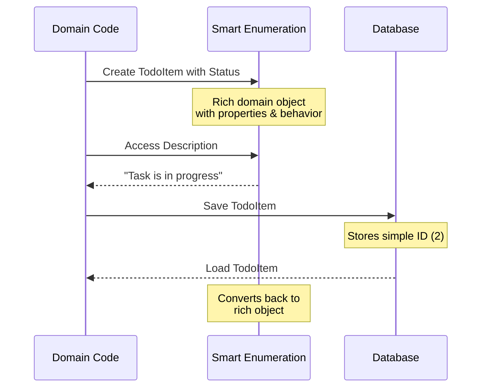
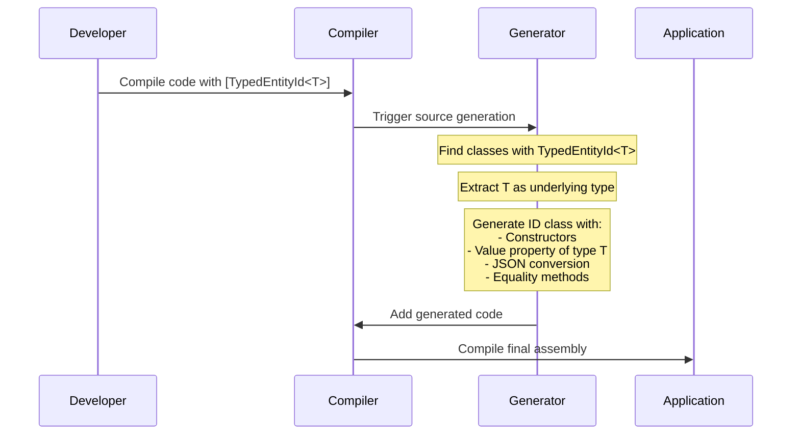
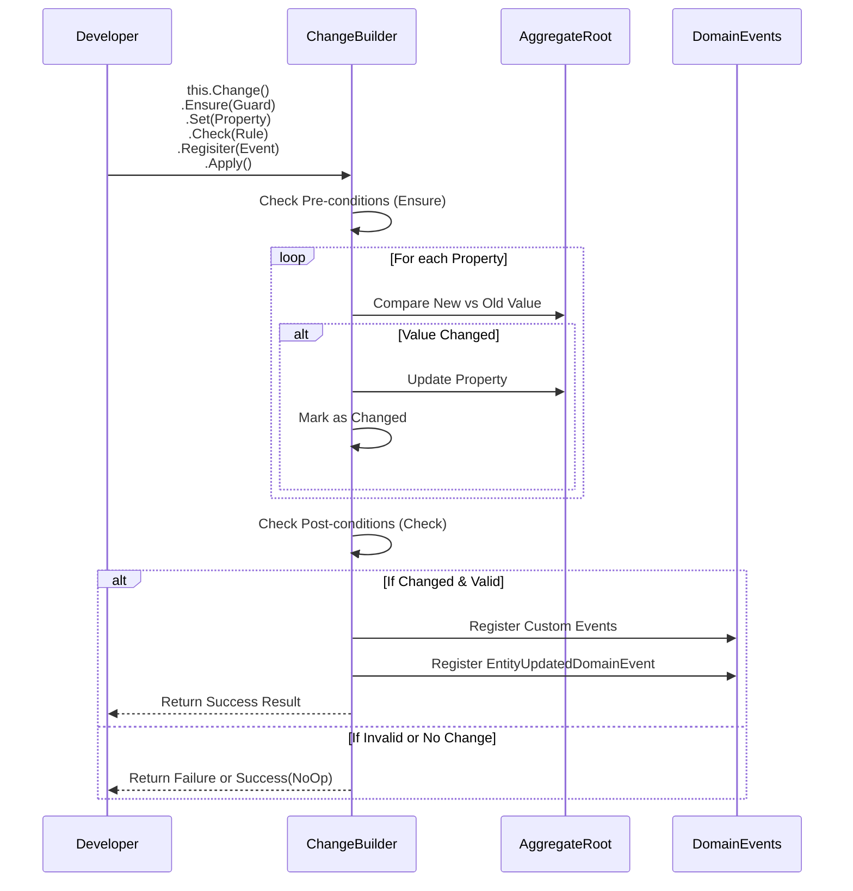

# Domain Feature Documentation

[TOC]

## Overview

## Challenges

## Solution

## Use Cases

## Appendix A: Smart Enumerations

### Overview
In domain modeling, representing a fixed set of options or states is a common requirement. While C# provides the enum type for this purpose, it often proves too limiting for real-world domain models. The Smart Enumeration pattern offers a more powerful alternative that combines the simplicity of enums with the flexibility of full-fledged objects.

### Challenge
Traditional C# enums work well for simple flags or states but fall short when requirements grow:
- Cannot include additional data like descriptions or metadata
- No support for business rules or behavior
- Limited to numeric values
- Hard to extend or version
- No validation beyond basic type checking

### Solution: Smart Enumerations


```mermaid
sequenceDiagram
    participant Code as Domain Code
    participant Enum as Smart Enumeration
    participant DB as Database

    Code->>Enum: Create TodoItem with Status
    Note over Enum: Rich domain object<br/>with properties & behavior
    Code->>Enum: Access Description
    Enum-->>Code: "Task is in progress"
    Code->>DB: Save TodoItem
    Note over DB: Stores simple ID (2)
    DB-->>Code: Load TodoItem
    Note over Enum: Converts back to<br/>rich object
```

### Usage

```csharp
public class TodoStatus : Enumeration
{
    public static readonly TodoStatus New = new(1, nameof(New), "Newly created task");
    public static readonly TodoStatus InProgress = new(2, nameof(InProgress), "Task is being worked on");
    public static readonly TodoStatus Completed = new(3, nameof(Completed), "Task has been completed");

    private TodoStatus(int id, string value, string description)
        : base(id, value)
    {
        this.Description = description;
    }

    public string Description { get; }

    public static IEnumerable<TodoStatus> GetAll() => GetAll<TodoStatus>();
}
```

#### Entity Framework Configuration
```csharp
public class TodoItemEntityTypeConfiguration : IEntityTypeConfiguration<TodoItem>
{
    public void Configure(EntityTypeBuilder<TodoItem> builder)
    {
        builder.Property(x => x.Status)
            .HasConversion(new EnumerationConverter<TodoStatus>())
            .IsRequired();
    }
}
```

### Benefits

Smart Enumerations transform enumerated values from simple flags into rich domain concepts. They shine in real applications by providing:

- **Rich Domain Expression** - Instead of bare numbers, enumerations carry meaning through additional properties and behavior. When a developer looks at a todo item's status, they see not just a value but also its description, business rules, and any metadata.

- **Natural Evolution** - As applications grow, enumerations often need additional properties or behaviors. Smart Enumerations accommodate this growth naturally - adding a new status property or validation rule doesn't break existing code.

- **Safety with Simplicity** - While providing rich domain features, they maintain the simplicity of traditional enums in usage. The type system prevents errors like assigning a priority to a status field, while Entity Framework Core's value converters ensure clean persistence.

The result is code that better expresses business concepts while remaining maintainable and safe - a perfect fit for domain-driven applications that need to evolve over time.

## Appendix B: Strongly-Typed Entity IDs

### Overview

In domain-driven design and clean architecture, entity identifiers play a crucial role. However, using primitive types like `Guid` or `int` as identifiers can lead to subtle bugs and unclear code. Consider a system managing both `Todo`s and `TodoStep`s, each using GUIDs as identifiers. A method that accidentally accepts a `TodoStep` ID when it should work with `Todo` IDs will compile successfully because both are GUIDs.

This common anti-pattern is known as "[primitive obsession](https://wiki.c2.com/?PrimitiveObsession)" - using primitive types where a dedicated type would better express domain concepts and prevent errors.

### Solution

The TypedEntityId source generator automatically creates strongly-typed ID classes during compilation. It scans for classes marked with the `[TypedEntityId<T>]` attribute and generates corresponding ID wrapper classes that provide type safety and domain semantics.


```mermaid
sequenceDiagram
    participant Dev as Developer
    participant CS as Compiler
    participant Gen as Generator
    participant App as Application

    Dev->>CS: Compile code with [TypedEntityId<T>]
    CS->>Gen: Trigger source generation
    Note over Gen: Find classes with TypedEntityId<T>
    Note over Gen: Extract T as underlying type
    Note over Gen: Generate ID class with:<br/>- Constructors<br/>- Value property of type T<br/>- JSON conversion<br/>- Equality methods
    Gen->>CS: Add generated code
    CS->>App: Compile final assembly
```

### Features (Generator)

The source generator creates ID classes with:

- Value wrapping and access
- Type conversions
- JSON serialization support
- Equality comparison
- Debug visualization
- Factory methods for creation
- Null handling

### Usage

#### Domain Entity
```csharp
[TypedEntityId<Guid>] // triggers the generator
public class TodoItem : Entity<TodoId> // generated id
{
    public string Title { get; set; }
    //...
}
```

#### Application Code
```csharp
// Type safety prevents mixing different ID types
public async Task<Todo> GetTodo(TodoId id) // ✅
public async Task<Todo> GetTodo(TodoStepId id) // ❌ Won't compile

// Convenient implicit conversions
TodoItemId id = Guid.NewGuid();  // Guid to TodoItemId
Guid guid = id;                  // TodoItemId to Guid
```

#### Entity Framework Configuration

The strongly-typed IDs require proper Entity Framework configuration to map between domain types and database primitives:

```csharp
public class TodoItemEntityTypeConfiguration : IEntityTypeConfiguration<Todo>
{
    public void Configure(EntityTypeBuilder<TodoItem> builder)
    {
        builder.Property(e => e.Id).ValueGeneratedOnAdd()
            .HasConversion(
                id => id.Value,                      // To database: TodoId -> Guid
                value => TodoItemId.Create(value));  // From database: Guid -> TodoId

        // Navigation property configuration
        builder.OwnsMany(x => x.Steps, sb =>
        {
            sb.Property(s => s.Id).ValueGeneratedOnAdd()
                .HasConversion(id => id.Value, value => TodoStepId.Create(value));
        });
    }
}
```

### Benefits

- **Type Safety**: Compiler catches ID type mismatches
- **Domain Clarity**: IDs carry semantic meaning
- **Convenience**: Implicit conversions to/from primitive types
- **Debugging**: Meaningful string representation
- **JSON Support**: Built-in serialization handling
- **Persistence**: Seamless Entity Framework integration
- **Value Semantics**: Proper equality comparison

The TypedEntityId pattern transforms primitive identifiers into first-class domain concepts, making code both safer and more expressive. It prevents a whole class of bugs while better communicating domain intent through the type system.

## Appendix C: Fluent Aggregate Updates

### Overview

In Domain-Driven Design, Aggregate Roots are responsible for maintaining consistency boundaries. Modifying state often involves complex logic:
1.  **Change Tracking**: Only applying updates if the value actually changed.
2.  **Event Sourcing**: Raising Domain Events when specific state changes occur.
3.  **Invariants**: Ensuring business rules (guards) are met before and after changes.
4.  **Side Effects**: Handling interactions with child entities.

Implementing this logic manually in every setter or update method leads to repetitive, error-prone boilerplate code (the "check-change-notify" pattern).

### Challenge

Writing consistent update logic for every property is tedious. Developers often forget to check if the value actually changed before raising an event, or they duplicate validation logic.

**Anti-Pattern (Manual Implementation):**
```csharp
public void ChangeEmail(string newEmail)
{
    if (string.IsNullOrEmpty(newEmail)) throw new ArgumentException(...); // Guard
    
    if (this.Email != newEmail) // Check difference
    {
        var oldEmail = this.Email;
        this.Email = newEmail; // Set
        
        // Notify
        this.DomainEvents.Register(new EmailChangedEvent(oldEmail, newEmail));
        this.DomainEvents.Register(new CustomerUpdatedEvent(this));
    }
}
```

### Solution: Fluent Change Builder

The `AggregateRoot` extensions provide a fluent, transactional builder pattern (`this.Change()`) to handle state mutations declaratively. It encapsulates the complexity of change detection, validation, and event registration into a clean, readable API.


```mermaid
sequenceDiagram
    participant Dev as Developer
    participant Builder as ChangeBuilder
    participant Agg as AggregateRoot
    participant Events as DomainEvents

    Dev->>Builder: this.Change()<br/>.Ensure(Guard)<br/>.Set(Property)<br/>.Check(Rule)<br/>.Regisiter(Event)<br/>.Apply()
    
    Builder->>Builder: Check Pre-conditions (Ensure)
    
    loop For each Property
        Builder->>Agg: Compare New vs Old Value
        alt Value Changed
            Builder->>Agg: Update Property
            Builder->>Builder: Mark as Changed
        end
    end

    Builder->>Builder: Check Post-conditions (Check)
    
    alt If Changed & Valid
        Builder->>Events: Register Custom Events
        Builder->>Events: Register EntityUpdatedDomainEvent
        Builder-->>Dev: Return Success Result
    else If Invalid or No Change
        Builder-->>Dev: Return Failure or Success(NoOp)
    end
```

### Usage

#### Basic Property Update
```csharp
public Result<Customer> ChangeName(string firstName, string lastName)
{
    return this.Change()
        .Set(c => c.FirstName, firstName)
        .Set(c => c.LastName, lastName)
        .Regisiter(c => new CustomerNameChangedEvent(c.Id))
        .Apply();
}
```

#### Conditional Logic & Validation
```csharp
public Result<Customer> PromoteToVIP()
{
    return this.Change()
        .When(c => c.TotalSpend > 1000) // Only apply if condition met
        .Set(c => c.Status, CustomerStatus.VIP)
        .Check(c => c.HasValidEmail(), "VIPs must have valid email") // Post-check
        .Regisiter(c => new CustomerPromotedEvent(c.Id))
        .Apply();
}
```

#### Using Result-Returning Factories (Fail Fast)
If the value generation itself can fail (e.g., creating a Value Object), the builder handles the `Result` automatically. If `EmailAddress.Create` returns a Failure, the chain stops, and `Apply()` returns that failure.

```csharp
public Result<Customer> ChangeEmail(string emailString)
{
    return this.Change()
        // If Create returns Failure, the chain aborts here
        .Set(c => c.Email, EmailAddress.Create(emailString))
        .Regisiter((c, ctx) => new EmailChangedEvent(
             ctx.GetOldValue<EmailAddress>(nameof(Email)), 
             c.Email))
        .Apply();
}
```

#### Collection Management
```csharp
public Result<Customer> AddTag(string tag)
{
    return this.Change()
        .Add(c => c.Tags, tag)
        .Ensure(c => c.Tags.Count < 10, "Tag limit reached") // Pre-check
        .Apply();
}
```

#### Executing Methods with Result Propagation
When you need to call other domain methods that return `Result`, use `Set` to chain them. If any method fails, the entire chain stops and returns that failure.

```csharp
public Result<Customer> UpdateContactInfo(string firstName, string lastName, int age, string email)
{
    return this.Change()
        .Set(c => c.ChangeName(firstName, lastName))  // If fails, chain stops
        .Set(c => c.ChangeAge(age))                   // Only runs if previous succeeded
        .Set(c => c.ChangeEmail(email))               // Only runs if previous succeeded
        .Apply();
}

// Individual methods that return Results
public Result<Customer> ChangeName(string firstName, string lastName)
{
    return this.Change()
        .Set(c => c.FirstName, firstName)
        .Set(c => c.LastName, lastName)
        .Check(c => !string.IsNullOrEmpty(c.FirstName), "First name required")
        .Apply();
}
```

For void actions (like clearing collections), use `Execute`. If the action throws an exception, it's automatically caught and the chain stops with a failure:

```csharp
public Result<Customer> ResetData()
{
    return this.Change()
        .Execute(c => c.Tags.Clear())  // If throws exception, chain stops with failure
        .Execute(c => c.Notes.Clear())
        .Apply();
}
```

### Features

| Operation | Description |
|-----------|-------------|
| **`Set`** | Updates a property. Supports direct values, computed factories, `Result<T>` factories (fail-fast), and Result-returning methods for chaining domain logic. |
| **`Add` / `Remove` / `Clear`** | Manages collection properties with automatic change detection. |
| **`Ensure`** | Pre-condition guard. If false, aborts transaction immediately without applying changes. |
| **`Check`** | Post-condition check. Runs *after* changes. If false, returns a Failure result (leaves entity dirty in memory, intended for unit-of-work rollbacks). |
| **`When`** | Conditional execution for the whole operation. |
| **`Execute`** | Runs arbitrary actions (void methods). Automatically catches and converts exceptions to Result failures. |
| **`Regisiter`** | Registers a Domain Event if changes occurred. Provides access to `ChangeContext` for old values. |
| **`Apply`** | Commits the transaction, registers generic `EntityUpdatedDomainEvent`, and returns a `Result`. |

### Benefits

1.  **Declarative Syntax**: Reads like a sentence describing the business transaction.
2.  **Automatic Change Detection**: Properties are only updated if values actually differ; events are only raised if updates occurred.
3.  **Consistency**: Enforces a standard pattern for all aggregate updates.
4.  **Reduced Boilerplate**: Removes repetitive `if (old != new)` checks and event registration code.
5.  **Fail-Fast Safety**: Integrates seamlessly with the `Result` pattern to abort operations on validation errors.
6.  **Context Awareness**: Easy access to "Old Value" vs "New Value" when creating domain events.