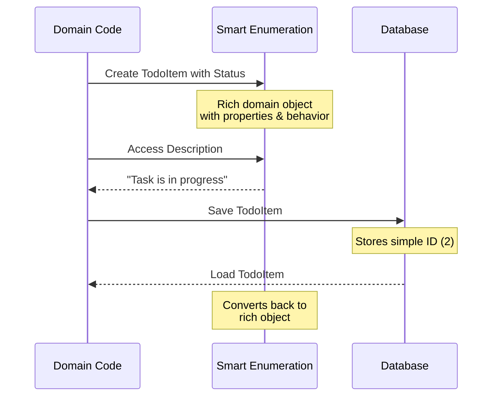
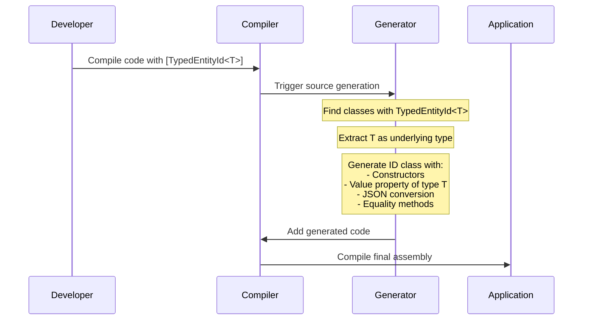

# Domain Feature Documentation

[TOC]

## Overview

## Challenges

## Solution

## Use Cases

## Appendix A: Smart Enumerations

### Overview
In domain modeling, representing a fixed set of options or states is a common requirement. While C# provides the enum type for this purpose, it often proves too limiting for real-world domain models. The Smart Enumeration pattern offers a more powerful alternative that combines the simplicity of enums with the flexibility of full-fledged objects.

### Challenge
Traditional C# enums work well for simple flags or states but fall short when requirements grow:
- Cannot include additional data like descriptions or metadata
- No support for business rules or behavior
- Limited to numeric values
- Hard to extend or version
- No validation beyond basic type checking

### Solution: Smart Enumerations


```mermaid
sequenceDiagram
    participant Code as Domain Code
    participant Enum as Smart Enumeration
    participant DB as Database

    Code->>Enum: Create TodoItem with Status
    Note over Enum: Rich domain object<br/>with properties & behavior
    Code->>Enum: Access Description
    Enum-->>Code: "Task is in progress"
    Code->>DB: Save TodoItem
    Note over DB: Stores simple ID (2)
    DB-->>Code: Load TodoItem
    Note over Enum: Converts back to<br/>rich object
```

### Usage

```csharp
public class TodoStatus : Enumeration
{
    public static readonly TodoStatus New = new(1, nameof(New), "Newly created task");
    public static readonly TodoStatus InProgress = new(2, nameof(InProgress), "Task is being worked on");
    public static readonly TodoStatus Completed = new(3, nameof(Completed), "Task has been completed");

    private TodoStatus(int id, string value, string description)
        : base(id, value)
    {
        this.Description = description;
    }

    public string Description { get; }

    public static IEnumerable<TodoStatus> GetAll() => GetAll<TodoStatus>();
}
```

#### Entity Framework Configuration
```csharp
public class TodoItemEntityTypeConfiguration : IEntityTypeConfiguration<TodoItem>
{
    public void Configure(EntityTypeBuilder<TodoItem> builder)
    {
        builder.Property(x => x.Status)
            .HasConversion(new EnumerationConverter<TodoStatus>())
            .IsRequired();
    }
}
```

### Benefits

Smart Enumerations transform enumerated values from simple flags into rich domain concepts. They shine in real applications by providing:

- **Rich Domain Expression** - Instead of bare numbers, enumerations carry meaning through additional properties and behavior. When a developer looks at a todo item's status, they see not just a value but also its description, business rules, and any metadata.

- **Natural Evolution** - As applications grow, enumerations often need additional properties or behaviors. Smart Enumerations accommodate this growth naturally - adding a new status property or validation rule doesn't break existing code.

- **Safety with Simplicity** - While providing rich domain features, they maintain the simplicity of traditional enums in usage. The type system prevents errors like assigning a priority to a status field, while Entity Framework Core's value converters ensure clean persistence.

The result is code that better expresses business concepts while remaining maintainable and safe - a perfect fit for domain-driven applications that need to evolve over time.

## Appendix B: Strongly-Typed Entity IDs

### Overview

In domain-driven design and clean architecture, entity identifiers play a crucial role. However, using primitive types like `Guid` or `int` as identifiers can lead to subtle bugs and unclear code. Consider a system managing both `Todo`s and `TodoStep`s, each using GUIDs as identifiers. A method that accidentally accepts a `TodoStep` ID when it should work with `Todo` IDs will compile successfully because both are GUIDs.

This common anti-pattern is known as "[primitive obsession](https://wiki.c2.com/?PrimitiveObsession)" - using primitive types where a dedicated type would better express domain concepts and prevent errors.

### Solution

The TypedEntityId source generator automatically creates strongly-typed ID classes during compilation. It scans for classes marked with the `[TypedEntityId<T>]` attribute and generates corresponding ID wrapper classes that provide type safety and domain semantics.


```mermaid
sequenceDiagram
    participant Dev as Developer
    participant CS as Compiler
    participant Gen as Generator
    participant App as Application

    Dev->>CS: Compile code with [TypedEntityId<T>]
    CS->>Gen: Trigger source generation
    Note over Gen: Find classes with TypedEntityId<T>
    Note over Gen: Extract T as underlying type
    Note over Gen: Generate ID class with:<br/>- Constructors<br/>- Value property of type T<br/>- JSON conversion<br/>- Equality methods
    Gen->>CS: Add generated code
    CS->>App: Compile final assembly
```

### Features (Generator)

The source generator creates ID classes with:

- Value wrapping and access
- Type conversions
- JSON serialization support
- Equality comparison
- Debug visualization
- Factory methods for creation
- Null handling

### Usage

#### Domain Entity
```csharp
[TypedEntityId<Guid>] // triggers the generator
public class TodoItem : Entity<TodoId> // generated id
{
    public string Title { get; set; }
    //...
}
```

#### Application Code
```csharp
// Type safety prevents mixing different ID types
public async Task<Todo> GetTodo(TodoId id) // ✅
public async Task<Todo> GetTodo(TodoStepId id) // ❌ Won't compile

// Convenient implicit conversions
TodoItemId id = Guid.NewGuid();  // Guid to TodoItemId
Guid guid = id;                  // TodoItemId to Guid
```

#### Entity Framework Configuration

The strongly-typed IDs require proper Entity Framework configuration to map between domain types and database primitives:

```csharp
public class TodoItemEntityTypeConfiguration : IEntityTypeConfiguration<Todo>
{
    public void Configure(EntityTypeBuilder<TodoItem> builder)
    {
        builder.Property(e => e.Id).ValueGeneratedOnAdd()
            .HasConversion(
                id => id.Value,                      // To database: TodoId -> Guid
                value => TodoItemId.Create(value));  // From database: Guid -> TodoId

        // Navigation property configuration
        builder.OwnsMany(x => x.Steps, sb =>
        {
            sb.Property(s => s.Id).ValueGeneratedOnAdd()
                .HasConversion(id => id.Value, value => TodoStepId.Create(value));
        });
    }
}
```

### Benefits

- **Type Safety**: Compiler catches ID type mismatches
- **Domain Clarity**: IDs carry semantic meaning
- **Convenience**: Implicit conversions to/from primitive types
- **Debugging**: Meaningful string representation
- **JSON Support**: Built-in serialization handling
- **Persistence**: Seamless Entity Framework integration
- **Value Semantics**: Proper equality comparison

The TypedEntityId pattern transforms primitive identifiers into first-class domain concepts, making code both safer and more expressive. It prevents a whole class of bugs while better communicating domain intent through the type system.

## Appendix C: Fluent Aggregate Updates

### Overview

In Domain-Driven Design, Aggregate Roots are responsible for maintaining consistency boundaries. Modifying state often involves complex logic:
1.  **Change Tracking**: Only applying updates if the value actually changed.
2.  **Event Sourcing**: Raising Domain Events when specific state changes occur.
3.  **Invariants**: Ensuring business rules (guards) are met before and after changes.
4.  **Side Effects**: Handling interactions with child entities.

Implementing this logic manually in every setter or update method leads to repetitive, error-prone boilerplate code (the "check-change-notify" pattern).

### Challenge

Writing consistent update logic for every property is tedious. Developers often forget to check if the value actually changed before raising an event, or they duplicate validation logic.

**Anti-Pattern (Manual Implementation):**
```csharp
public void ChangeEmail(string newEmail)
{
    if (string.IsNullOrEmpty(newEmail)) throw new ArgumentException(...); // Guard
    
    if (this.Email != newEmail) // Check difference
    {
        var oldEmail = this.Email;
        this.Email = newEmail; // Set
        
        // Notify
        this.DomainEvents.Register(new EmailChangedEvent(oldEmail, newEmail));
        this.DomainEvents.Register(new CustomerUpdatedEvent(this));
    }
}
```

### Solution: Fluent Change Builder

The `AggregateRoot` extensions provide a fluent, transactional builder pattern (`this.Change()`) to handle state mutations declaratively. It encapsulates the complexity of change detection, validation, and event registration into a clean, readable API.

**Key Feature: Declaration-Order Execution**

All operations execute **in the exact order they are declared**. This makes the code intuitive and predictable - "what you see is what executes":

```csharp
return this.Change()
    .Set(c => c.Name, "John")       // 1. Executes first
    .Check(c => c.Name != null, "") // 2. Validates immediately after Set
    .When(c => c.Age >= 18)         // 3. Circuit breaker - cancels remaining if false
    .Set(c => c.Status, Adult)      // 4. Only executes if When succeeded
    .Register(c => new Event())     // 5. Queues event if changes occurred
    .Apply();
```

```mermaid
sequenceDiagram
    participant Dev as Developer
    participant Builder as ChangeBuilder
    participant Agg as AggregateRoot
    participant Events as DomainEvents

    Dev->>Builder: this.Change()<br/>.Set(Property1)<br/>.Check(Rule1)<br/>.When(Guard)<br/>.Set(Property2)<br/>.Register(Event)<br/>.Apply()

    Note over Builder: Execute in declaration order

    Builder->>Agg: Set Property1
    Builder->>Builder: Check Rule1 (immediate)

    alt When Guard Passes
        Builder->>Agg: Set Property2
        Builder->>Builder: Queue Event
        Builder->>Events: Register Events at Apply() end
        Builder-->>Dev: Success Result
    else When Guard Fails (Circuit Breaker)
        Note over Builder: Skip remaining operations<br/>Property1 changed, Property2 unchanged
        Builder->>Events: Register events for changes before When
        Builder-->>Dev: Success Result (partial changes)
    end
        Builder-->>Dev: Return Success Result
    else If Invalid or No Change
        Builder-->>Dev: Return Failure or Success(NoOp)
    end
```

### Usage

#### Basic Property Update
```csharp
public Result<Customer> ChangeName(string firstName, string lastName)
{
    return this.Change()
        .Set(c => c.FirstName, firstName)
        .Set(c => c.LastName, lastName)
        .Regisiter(c => new CustomerNameChangedEvent(c.Id))
        .Apply();
}
```

#### Conditional Logic with When (Circuit Breaker)
The `When` method acts as a circuit breaker at its declared position. Operations **before** When execute normally, operations **after** When only execute if the condition is true.

```csharp
public Result<Customer> PromoteToVIP()
{
    return this.Change()
        .Set(c => c.LastReviewed, DateTime.UtcNow)  // Always executes
        .When(c => c.TotalSpend > 1000)             // Circuit breaker - only proceed if true
        .Set(c => c.Status, CustomerStatus.VIP)     // Only if When passed
        .Check(c => c.HasValidEmail(), "VIPs must have valid email")  // Immediate validation
        .Register(c => new CustomerPromotedEvent(c.Id))
        .Apply();
}
```

**Important:** If When fails, `LastReviewed` is still updated, but `Status` remains unchanged and no promotion event is registered. This allows for partial updates with conditional logic.

#### Side Effects with OnChanged

The `OnChanged` method queues actions that execute only if changes occurred, useful for side effects like audit updates or logging.

```csharp
public Result<Customer> ChangeStatus(CustomerStatus status)
{
    return this.Change()
        .When(_ => status != null)
        .Set(e => e.Status, status)
        .Register(e => new CustomerUpdatedDomainEvent(e))
        .OnChanged(e => e.AuditState.SetUpdated()) // Executes only if changes occurred
        .Apply();
}
```

#### Validation with Check and Ensure
- **`Ensure`**: Pre-condition check - aborts **before** making changes if false
- **`Check`**: Post-condition validation - executes **immediately** at its position, after changes

```csharp
public Result<Customer> UpdateProfile(string name, int age)
{
    return this.Change()
        .Ensure(c => c.IsActive, "Cannot update inactive customer")  // Pre-check
        .Set(c => c.Name, name)
        .Check(c => !string.IsNullOrEmpty(c.Name), "Name required")  // Validates immediately
        .Set(c => c.Age, age)
        .Check(c => c.Age >= 0, "Age must be positive")              // Validates immediately
        .Apply();
}
```

#### Using Result-Returning Factories (Fail Fast)
If the value generation itself can fail (e.g., creating a Value Object), the builder handles the `Result` automatically. If `EmailAddress.Create` returns a Failure, the chain stops, and `Apply()` returns that failure.

```csharp
public Result<Customer> ChangeEmail(string emailString)
{
    return this.Change()
        // If Create returns Failure, the chain aborts here
        .Set(c => c.Email, EmailAddress.Create(emailString))
        .Regisiter((c, ctx) => new EmailChangedEvent(
             ctx.GetOldValue<EmailAddress>(nameof(Email)), 
             c.Email))
        .Apply();
}
```

#### Collection Management
```csharp
// Add/Remove items
public Result<Customer> AddTag(string tag)
{
    return this.Change()
        .Add(c => c.Tags, tag)
        .Ensure(c => c.Tags.Count < 10, "Tag limit reached")
        .Apply();
}

// Remove by ID (fails with NotFoundError if not found)
public Result<Customer> RemoveAddress(AddressId addressId)
{
    return this.Change()
        .Remove(c => c.Addresses, addressId, errorMessage: "Address not found")
        .Register(c => new CustomerUpdatedEvent(c.Id))
        .Apply();
}

// Apply action to all collection items
public Result<Customer> ClearAllPrimaryFlags()
{
    return this.Change()
        .Set(c => c.Addresses, a => a.ClearPrimary())  // Applies to all
        .Apply();
}

// Apply action to filtered items
public Result<Customer> ActivateExpiredSubscriptions()
{
    return this.Change()
        .Set(c => c.Subscriptions, s => s.IsExpired, s => s.Renew())  // Filter + action
        .Apply();
}

// Apply action to single item by ID (fails with NotFoundError if not found)
public Result<Customer> SetPrimaryAddress(AddressId addressId)
{
    return this.Change()
        .Set(c => c.Addresses, a => a.ClearPrimary())                               // Clear all
        .Set(c => c.Addresses, addressId, a => a.SetPrimary(), "Address not found") // Set one
        .Register(c => new CustomerUpdatedEvent(c.Id))
        .Apply();
}
```

#### Executing Methods with Result Propagation
When you need to call other domain methods that return `Result`, use `Set` to chain them. If any method fails, the entire chain stops and returns that failure.

```csharp
public Result<Customer> UpdateContactInfo(string firstName, string lastName, int age, string email)
{
    return this.Change()
        .Set(c => c.ChangeName(firstName, lastName))  // If fails, chain stops
        .Set(c => c.ChangeAge(age))                   // Only runs if previous succeeded
        .Set(c => c.ChangeEmail(email))               // Only runs if previous succeeded
        .Apply();
}

// Individual methods that return Results
public Result<Customer> ChangeName(string firstName, string lastName)
{
    return this.Change()
        .Set(c => c.FirstName, firstName)
        .Set(c => c.LastName, lastName)
        .Check(c => !string.IsNullOrEmpty(c.FirstName), "First name required")
        .Apply();
}
```

For void actions (like clearing collections), use `Execute`. If the action throws an exception, it's automatically caught and the chain stops with a failure:

```csharp
public Result<Customer> ResetData()
{
    return this.Change()
        .Execute(c => c.Tags.Clear())  // If throws exception, chain stops with failure
        .Execute(c => c.Notes.Clear())
        .Apply();
}
```

#### Result Transformations with Execute

The `Execute` method can also be used to apply Result functional extensions (Map, Bind, Tap, Ensure, Filter, etc.) after all operations complete. This enables powerful post-processing, validation, and side effects while maintaining the Result pattern:

```csharp
public Result<Customer> PromoteToAdult()
{
    return this.Change()
        .When(c => c.Age >= 18)  // Only proceed if eligible
        .Set(c => c.Status, CustomerStatus.Adult)
        .Execute(r => r.Map(c => { c.PromotedDate = DateTime.UtcNow; return c; }))  // Additional field update
        .Execute(r => r.Ensure(
            c => !string.IsNullOrEmpty(c.Email), 
            new ValidationError("Adults must have an email")))  // Post-operation validation
        .Execute(r => r.Tap(c => logger.LogInformation($"Promoted {c.Name} to Adult")))  // Logging
        .Apply();
}
```

**Key behaviors:**
- `Execute` transformations execute **at their declared position** in the operation chain
- Multiple `Execute` calls execute sequentially in declaration order
- If any `Execute` transformation returns a failure Result, remaining operations are **short-circuited**
- `Execute` transformations **skip** when a preceding `When` circuit breaker cancels remaining operations
- Can be used standalone without any Set/Add operations: `.Change().Execute(r => r.Tap(...)).Apply()`

**Execution order example:**
```csharp
return this.Change()
    .Set(c => c.Field1, "A")               // 1. Executes
    .Execute(r => r.Tap(c => Log("A")))    // 2. Logs "A"
    .Set(c => c.Field2, "B")               // 3. Executes
    .Execute(r => r.Tap(c => Log("B")))    // 4. Logs "B"
    .Apply();
```

**Common use cases:**
- **Logging**: Use `.Execute(r => r.Tap(...))` for side effects without changing the value
- **Additional validation**: Use `.Execute(r => r.Ensure(...))` for complex post-operation checks
- **Transformations**: Use `.Execute(r => r.Map(...))` to modify additional fields based on the final state
- **Conditional logic**: Use `.Execute(r => r.Filter(...))` to convert success to failure based on conditions

```csharp
// Standalone usage - no Set required
public Result<Customer> LogActivity()
{
    return this.Change()
        .Execute(r => r.Tap(c => activityLogger.Log($"Activity for {c.Name}")))
        .Execute(r => r.Ensure(c => c.IsActive, new Error("Customer is not active")))
        .Apply();
}

// Multiple Execute calls with validation
public Result<Customer> ComplexUpdate(string name, int age)
{
    return this.Change()
        .Set(c => c.Name, name)
        .Set(c => c.Age, age)
        .Execute(r => r.Ensure(c => c.Age >= 18, new ValidationError("Must be adult")))
        .Execute(r => r.Map(c => { c.LastModified = DateTime.UtcNow; return c; }))
        .Execute(r => r.Tap(c => auditLog.Record($"Updated {c.Name}")))
        .Apply();
}
```

### Features

| Operation | Description |
|-----------|-------------|
| **`Set`** | Updates a property at its declaration position. Supports direct values, computed factories, `Result<T>` factories (fail-fast), and Result-returning methods for chaining domain logic. Only updates if value differs (automatic change detection). **Also applies actions to collection items:** all items, filtered items, or single item by ID. |
| **`Add` / `Remove` / `Clear`** | Manages collection properties with automatic change detection. `Remove` fails with `NotFoundError` if item not found. Executes at declaration position. |
| **`Ensure`** | Pre-condition guard that executes **before** making changes. If false, aborts transaction immediately. Executes at declaration position. |
| **`Check`** | Post-condition validation that executes **immediately at its position** after preceding operations. If false, returns Failure result. Use for immediate validation after specific changes. |
| **`When`** | **Circuit breaker** that executes at its declaration position. If condition is false, **cancels all remaining operations** after it. Operations before When execute normally. Enables conditional operation chains. |
| **`Execute`** | Two overloads: (1) Runs arbitrary void actions at declaration position with automatic exception handling. (2) Applies Result transformations (Map, Bind, Tap, Ensure) at declaration position. Both short-circuit on failure. |
| **`Register`** | Queues a Domain Event at declaration position to be registered at Apply() end if changes occurred. Provides access to `ChangeContext` for old values. Events only register if changes made and no cancellation. |
| **`OnChanged`** | Queues an action at declaration position to be executed at Apply() end if changes occurred. Actions run on the entity in declaration order. Exceptions in actions cause Apply() to return failure. |
| **`Apply`** | Executes all queued operations in declaration order, registers queued events and executes OnChanged actions (if changes occurred), and returns a `Result`. |

### Execution Model

**Declaration Order Guarantee:**
- All operations execute in the **exact order they are declared**
- No batching or phase-based execution
- "What you see is what executes"

**When as Circuit Breaker:**
```csharp
.Set(prop1)       // Always executes
.Register(event1) // Always queues
.OnChanged(action1) // Always queues
.When(condition)  // Decision point
.Set(prop2)       // Skips if When false
.Register(event2) // Skips if When false
.OnChanged(action2) // Skips if When false
```

**Check Executes Immediately:**
```csharp
.Set(c => c.Age, 25)
.Check(c => c.Age > 0, "Age must be positive")  // Validates immediately after Set
.Set(c => c.Name, "John")                       // Only executes if Check passed
```

### Benefits

1.  **Declarative Syntax**: Reads like a sentence describing the business transaction.
2.  **Automatic Change Detection**: Properties are only updated if values actually differ; events are only raised if updates occurred.
3.  **Consistency**: Enforces a standard pattern for all aggregate updates.
4.  **Reduced Boilerplate**: Removes repetitive `if (old != new)` checks and event registration code.
5.  **Fail-Fast Safety**: Integrates seamlessly with the `Result` pattern to abort operations on validation errors.
6.  **Context Awareness**: Easy access to "Old Value" vs "New Value" when creating domain events.