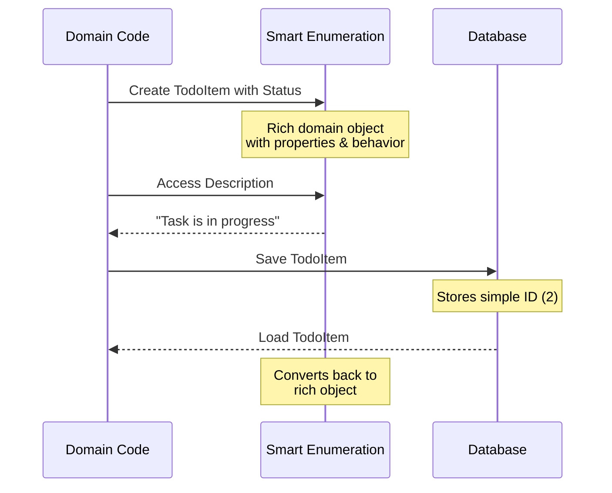
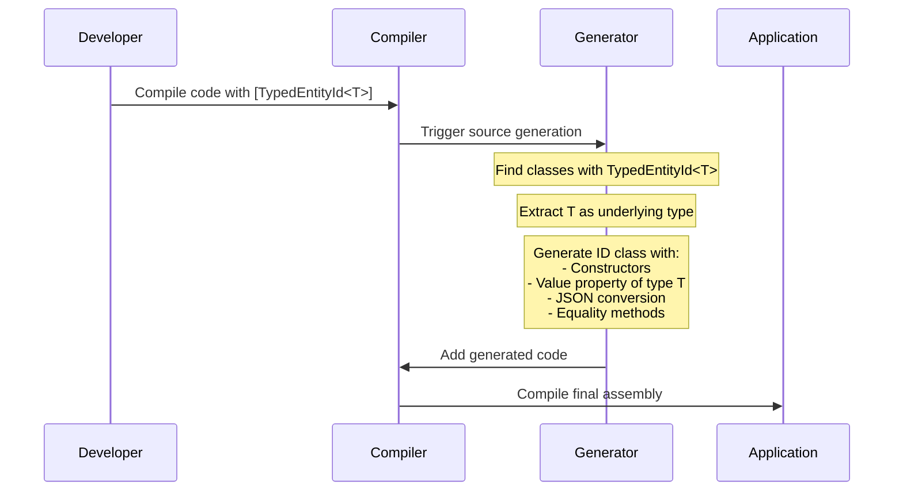
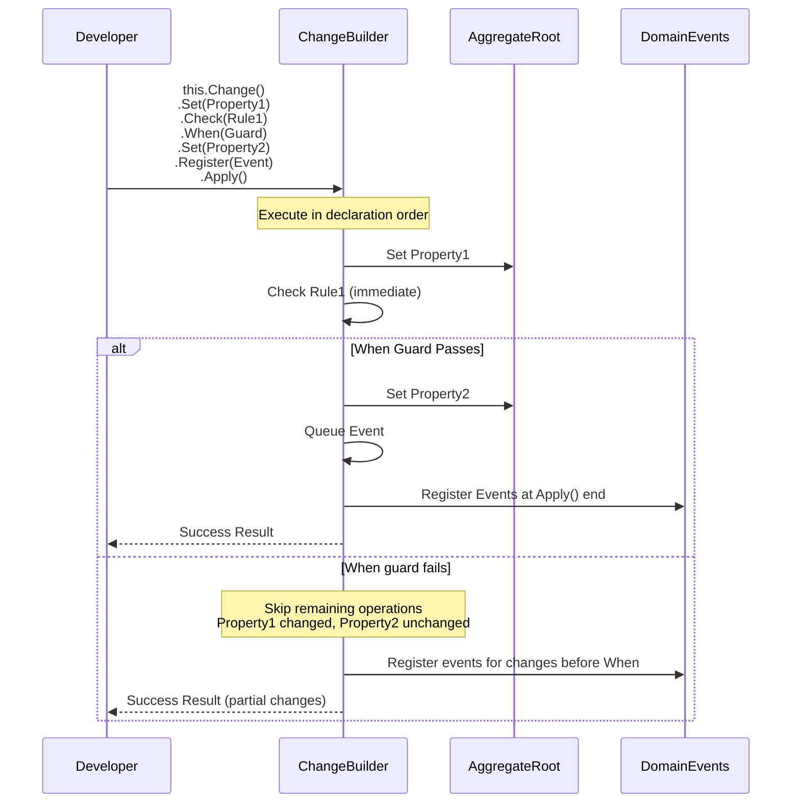

# Domain Model

> Build domain models with the core tactical patterns of DDD, from aggregates to typed ids and value objects.

[TOC]

## Overview

The `Domain` feature is the foundation for the devkit's domain model. It covers the core tactical building blocks used to express business concepts in code, such as aggregates, value objects, typed ids, enumerations, and fluent aggregate state changes.

This page focuses on those core primitives. Related domain concepts have their own dedicated feature pages:

- [Domain Events](./features-domain-events.md) for aggregate-raised events and the domain-event outbox
- [Event Sourcing](./features-event-sourcing.md) for aggregate-event streams and event-store-based modeling
- [Domain Specifications](./features-domain-specifications.md) for reusable query and selection criteria
- [Domain Policies](./features-domain-policies.md) for contextual business decisions over a domain context
- [Domain Repositories](./features-domain-repositories.md) for repository abstractions, find options, includes, and behaviors
- [ActiveEntity](./features-domain-activeentity.md) for the optional active-record-style alternative

Typed ids and smart enumerations from the domain layer also integrate with the shared serializer infrastructure described in [Common Serialization](./common-serialization.md).

## Challenges

Domain models need stable identity, equality semantics, consistency boundaries, domain events, and
types that express business meaning. Primitive identifiers, repeated mutation checks, and plain C#
enums can make invalid combinations easier to construct and state transitions harder to audit.

## Solution

The Domain packages provide entity and aggregate-root base classes, value objects, typed entity IDs,
enumerations, domain events, and an ordered change builder. These types are infrastructure-neutral
and can be composed without exposing persistence concerns to the domain model.

## Key Features

- Identity-based equality through `Entity<TId>`
- Aggregate boundaries and event registration through `AggregateRoot<TId>`
- Structural equality through `ValueObject`
- Enumeration base types with optional partial-class source generation
- Typed entity ID generation for `Guid`, `int`, `long`, and `string` values
- Ordered entity changes with change detection, guards, result propagation, and event registration

## Architecture

`Entity<TId>` supplies identity and equality behavior. `AggregateRoot<TId>` adds a `DomainEvents`
collection. Value objects and enumerations model concepts without entity identity. The
`[TypedEntityId<T>]` generator creates an `EntityId<T>` subclass for an attributed class. The
`Change()` extension creates an `EntityChangeBuilder<TEntity>` that applies queued operations in
declaration order.

## Use Cases

- Model entities and aggregate roots with explicit identity semantics.
- Prevent identifiers for different entity types from being mixed accidentally.
- Represent domain states that need data or behavior beyond a C# `enum`.
- Apply several aggregate mutations and raise events only when values change.
- Propagate recoverable validation failures through `Result<TEntity>`.

## Basic Usage

This aggregate validates a new name before applying the change and then prints the updated value:

```csharp
public sealed class Customer : AggregateRoot<Guid>
{
	public Customer(Guid id, string name)
	{
		this.Id = id;
		this.Name = name;
	}

	public string Name { get; set; }

	public Result<Customer> Rename(string name)
	{
		return this.Change()
			.Ensure(_ => !string.IsNullOrWhiteSpace(name), "A name is required.")
			.Set(customer => customer.Name, name.Trim())
			.Apply();
	}
}

var customer = new Customer(Guid.NewGuid(), "Ada Lovelace");
var result = customer.Rename(" Grace Hopper ");

if (result.IsFailure)
{
	Console.Error.WriteLine(
		string.Join(Environment.NewLine, result.Errors.Select(error => error.Message)));
	return;
}

Console.WriteLine(result.Value.Name);
```

Output:

```text
Grace Hopper
```

## Appendix A: Smart enumerations

### Overview

In domain modeling, a fixed set of options or states often needs more data or behavior than a C#
enum can provide. The Enumeration pattern represents those options as typed objects.

### Challenge

Traditional C# enums work well for simple flags or states but fall short when requirements grow:

- Cannot include additional data like descriptions or metadata
- No support for business rules or behavior
- Limited to numeric values
- Hard to extend or version
- No validation beyond basic type checking

### Solution: Smart enumerations


```mermaid
sequenceDiagram
    participant Code as Domain Code
    participant Enum as Smart Enumeration
    participant DB as Database

    Code->>Enum: Create TodoItem with Status
    Note over Enum: Rich domain object<br/>with properties & behavior
    Code->>Enum: Access Description
    Enum-->>Code: "Task is in progress"
    Code->>DB: Save TodoItem
    Note over DB: Stores simple ID (2)
    DB-->>Code: Load TodoItem
    Note over Enum: Converts back to<br/>rich object
```

### Usage

```csharp
public partial class TodoStatus : Enumeration
{
    public static readonly TodoStatus New = new(1, nameof(New), "Newly created task");
    public static readonly TodoStatus InProgress = new(2, nameof(InProgress), "Task is being worked on");
    public static readonly TodoStatus Completed = new(3, nameof(Completed), "Task has been completed");

    public string Description { get; private set; }
}
```

For a non-generic `partial` class derived from `Enumeration`, the source generator adds the private
constructors, `GetAll`, `GetById`, and conversions from `int` and `string`. A non-partial class can
define those members manually instead.

#### Entity Framework configuration

```csharp
public class TodoItemEntityTypeConfiguration : IEntityTypeConfiguration<TodoItem>
{
    public void Configure(EntityTypeBuilder<TodoItem> builder)
    {
        builder.Property(x => x.Status)
            .HasConversion(new EnumerationConverter<TodoStatus>())
            .IsRequired();
    }
}
```

### Benefits

Smart Enumerations turn enumerated values into domain types with data and behavior:

- **Rich domain expression** - Instead of bare numbers, enumerations carry a value, description, business rules, and metadata.

- **Natural Evolution** - As applications grow, enumerations often need additional properties or behaviors. Smart Enumerations accommodate this growth naturally - adding a new status property or validation rule doesn't break existing code.

- **Safety with Simplicity** - While providing rich domain features, they maintain the simplicity of traditional enums in usage. The type system prevents errors like assigning a priority to a status field, while Entity Framework Core's value converters ensure clean persistence.

This approach keeps enumeration-specific data and behavior with the domain concept it describes.

## Appendix B: Strongly typed entity IDs

### Overview

Entity identifiers define identity, but primitive types such as `Guid` or `int` do not identify the
entity type they belong to. In a system with `Todo` and `TodoStep` entities, a method can accept the
wrong identifier and still compile when both identifiers are GUIDs.

This common anti-pattern is known as "[primitive obsession](https://wiki.c2.com/?PrimitiveObsession)" - using primitive types where a dedicated type would better express domain concepts and prevent errors.

### Solution

The TypedEntityId source generator automatically creates strongly-typed ID classes during compilation. It scans for classes marked with the `[TypedEntityId<T>]` attribute and generates corresponding ID wrapper classes that provide type safety and domain semantics.


```mermaid
sequenceDiagram
    participant Dev as Developer
    participant CS as Compiler
    participant Gen as Generator
    participant App as Application

    Dev->>CS: Compile code with [TypedEntityId<T>]
    CS->>Gen: Trigger source generation
    Note over Gen: Find classes with TypedEntityId<T>
    Note over Gen: Extract T as underlying type
    Note over Gen: Generate ID class with:<br/>- Constructors<br/>- Value property of type T<br/>- JSON conversion<br/>- Equality methods
    Gen->>CS: Add generated code
    CS->>App: Compile final assembly
```

### Generated features

The source generator creates ID classes with:

- Value wrapping and access
- Type conversions
- JSON serialization support
- Equality comparison
- Debug visualization
- Factory methods for creation
- Null handling

Calling the parameterless `Create()` generates a new value only for `Guid` IDs. The generated
parameterless method throws `NotImplementedException` for `int`, `long`, `string`, and unsupported
ID types; supply a value through `Create(value)` or provide an application-specific generation
strategy.

### Usage

#### Domain entity

```csharp
[TypedEntityId<Guid>] // triggers the generator
public class TodoItem : Entity<TodoItemId> // generated id
{
    public string Title { get; set; }
    //...
}
```

#### Application code

```csharp
// Type safety prevents mixing different ID types
TodoItemId todoId = Guid.NewGuid();
TodoStepId stepId = Guid.NewGuid();

await todoService.GetTodo(todoId);
// await todoService.GetTodo(stepId); // Does not compile: TodoStepId is not TodoItemId.

// Convenient implicit conversions
TodoItemId id = Guid.NewGuid();  // Guid to TodoItemId
Guid guid = id;                  // TodoItemId to Guid
```

#### Entity Framework configuration

The strongly-typed IDs require proper Entity Framework configuration to map between domain types and database primitives:

```csharp
public class TodoItemEntityTypeConfiguration : IEntityTypeConfiguration<TodoItem>
{
    public void Configure(EntityTypeBuilder<TodoItem> builder)
    {
        builder.Property(e => e.Id).ValueGeneratedOnAdd()
            .HasConversion(
                id => id.Value,                      // To database: TodoItemId -> Guid
                value => TodoItemId.Create(value));  // From database: Guid -> TodoItemId

        // Navigation property configuration
        builder.OwnsMany(x => x.Steps, sb =>
        {
            sb.Property(s => s.Id).ValueGeneratedOnAdd()
                .HasConversion(id => id.Value, value => TodoStepId.Create(value));
        });
    }
}
```

### Benefits

- **Type Safety**: Compiler catches ID type mismatches
- **Domain Clarity**: IDs carry semantic meaning
- **Convenience**: Implicit conversions to/from primitive types
- **Debugging**: Meaningful string representation
- **JSON Support**: Built-in serialization handling
- **Persistence**: Entity Framework conversion to the underlying value
- **Value Semantics**: Proper equality comparison

The TypedEntityId pattern transforms primitive identifiers into first-class domain concepts, making code both safer and more expressive. It prevents a whole class of bugs while better communicating domain intent through the type system.

## Appendix C: Fluent aggregate updates

### Overview

In Domain-Driven Design, Aggregate Roots are responsible for maintaining consistency boundaries. Modifying state often involves complex logic:

1. **Change Tracking**: Only applying updates if the value actually changed.
2. **Event Sourcing**: Raising Domain Events when specific state changes occur.
3. **Invariants**: Ensuring business rules (guards) are met before and after changes.
4. **Side Effects**: Handling interactions with child entities.

Implementing this logic manually in every setter or update method leads to repetitive, error-prone boilerplate code (the "check-change-notify" pattern).

### Challenge

Writing consistent update logic for every property is tedious. Developers often forget to check if the value actually changed before raising an event, or they duplicate validation logic.

**Anti-Pattern (Manual Implementation):**

```csharp
public void ChangeEmail(string newEmail)
{
    if (string.IsNullOrEmpty(newEmail)) throw new ArgumentException(...); // Guard

    if (this.Email != newEmail) // Check difference
    {
        var oldEmail = this.Email;
        this.Email = newEmail; // Set

        // Notify
        this.DomainEvents.Register(new EmailChangedEvent(oldEmail, newEmail));
        this.DomainEvents.Register(new CustomerUpdatedEvent(this));
    }
}
```

### Solution: Fluent change builder

The `Change()` extension provides an ordered builder for state mutations, change detection,
validation, and event registration.

The builder is not a rollback mechanism. If an operation fails, mutations made by earlier
operations remain on the in-memory entity. A false `When` also preserves earlier mutations and
registers events queued before the circuit breaker. Apply changes to a detached or otherwise safe
instance when the caller requires all-or-nothing state.

#### Declaration-order execution

All operations execute **in the exact order they are declared**. This makes the code intuitive and predictable - "what you see is what executes":

```csharp
return this.Change()
    .Set(c => c.Name, "John")       // 1. Executes first
    .Check(c => c.Name != null, "") // 2. Validates immediately after Set
    .When(c => c.Age >= 18)         // 3. Circuit breaker - cancels remaining if false
    .Set(c => c.Status, Adult)      // 4. Only executes if When succeeded
    .Register(c => new Event())     // 5. Queues event if changes occurred
    .Apply();
```


```mermaid
sequenceDiagram
    participant Dev as Developer
    participant Builder as ChangeBuilder
    participant Agg as AggregateRoot
    participant Events as DomainEvents

    Dev->>Builder: this.Change()<br/>.Set(Property1)<br/>.Check(Rule1)<br/>.When(Guard)<br/>.Set(Property2)<br/>.Register(Event)<br/>.Apply()

    Note over Builder: Execute in declaration order

    Builder->>Agg: Set Property1
    Builder->>Builder: Check Rule1 (immediate)

    alt When Guard Passes
        Builder->>Agg: Set Property2
        Builder->>Builder: Queue Event
        Builder->>Events: Register Events at Apply() end
        Builder-->>Dev: Success Result
    else When guard fails
        Note over Builder: Skip remaining operations<br/>Property1 changed, Property2 unchanged
        Builder->>Events: Register events for changes before When
        Builder-->>Dev: Success Result (partial changes)
    end
```

### Usage

#### Basic property update

```csharp
public Result<Customer> ChangeName(string firstName, string lastName)
{
    return this.Change()
        .Set(c => c.FirstName, firstName)
        .Set(c => c.LastName, lastName)
        .Register(c => new CustomerNameChangedEvent(c.Id))
        .Apply();
}
```

#### Conditional logic with `When`

The `When` method acts as a circuit breaker at its declared position. Operations **before** When execute normally, operations **after** When only execute if the condition is true.

```csharp
public Result<Customer> PromoteToVIP()
{
    return this.Change()
        .Set(c => c.LastReviewed, DateTime.UtcNow)  // Always executes
        .When(c => c.TotalSpend > 1000)             // Circuit breaker - only proceed if true
        .Set(c => c.Status, CustomerStatus.VIP)     // Only if When passed
        .Check(c => c.HasValidEmail(), "VIPs must have valid email")  // Immediate validation
        .Register(c => new CustomerPromotedEvent(c.Id))
        .Apply();
}
```

**Important:** If When fails, `LastReviewed` is still updated, but `Status` remains unchanged and no promotion event is registered. This allows for partial updates with conditional logic.

#### Side effects with `OnChanged`

The `OnChanged` method queues actions that execute only if changes occurred, useful for side effects like audit updates or logging.

```csharp
public Result<Customer> ChangeStatus(CustomerStatus status)
{
    return this.Change()
        .When(_ => status != null)
        .Set(e => e.Status, status)
        .Register(e => new CustomerUpdatedDomainEvent(e))
        .OnChanged(e => e.AuditState.SetUpdated()) // Executes only if changes occurred
        .Apply();
}
```

#### Validation with `Check` and `Ensure`

- **`Ensure`**: Guard that runs at its declared position. Place it before mutations when it must be
  a precondition.
- **`Check`**: Validation that runs immediately at its declared position.

Both methods return a failure and skip later operations when their predicate is false. Neither
method rolls back mutations made by earlier operations.

```csharp
public Result<Customer> UpdateProfile(string name, int age)
{
    return this.Change()
        .Ensure(c => c.IsActive, "Cannot update inactive customer")  // Pre-check
        .Set(c => c.Name, name)
        .Check(c => !string.IsNullOrEmpty(c.Name), "Name required")  // Validates immediately
        .Set(c => c.Age, age)
        .Check(c => c.Age >= 0, "Age must be positive")              // Validates immediately
        .Apply();
}
```

#### Using Result-returning factories

If the value generation itself can fail (e.g., creating a Value Object), the builder handles the `Result` automatically. If `EmailAddress.Create` returns a Failure, the chain stops, and `Apply()` returns that failure.

```csharp
public Result<Customer> ChangeEmail(string emailString)
{
    return this.Change()
        // If Create returns Failure, the chain aborts here
        .Set(c => c.Email, EmailAddress.Create(emailString))
        .Register((c, ctx) => new EmailChangedEvent(
             ctx.GetOldValue<EmailAddress>(nameof(Email)),
             c.Email))
        .Apply();
}
```

#### Collection management

```csharp
// Add/Remove items
public Result<Customer> AddTag(string tag)
{
    return this.Change()
        .Ensure(c => c.Tags.Count < 10, "Tag limit reached")
        .Add(c => c.Tags, tag)
        .Apply();
}

// Remove by ID (fails with NotFoundError if not found)
public Result<Customer> RemoveAddress(AddressId addressId)
{
    return this.Change()
        .Remove(c => c.Addresses, addressId, errorMessage: "Address not found")
        .Register(c => new CustomerUpdatedEvent(c.Id))
        .Apply();
}

// Apply action to all collection items
public Result<Customer> ClearAllPrimaryFlags()
{
    return this.Change()
        .Set(c => c.Addresses, a => a.ClearPrimary())  // Applies to all
        .Apply();
}

// Apply action to filtered items
public Result<Customer> ActivateExpiredSubscriptions()
{
    return this.Change()
        .Set(c => c.Subscriptions, s => s.IsExpired, s => s.Renew())  // Filter + action
        .Apply();
}

// Apply action to single item by ID (fails with NotFoundError if not found)
public Result<Customer> SetPrimaryAddress(AddressId addressId)
{
    return this.Change()
        .Set(c => c.Addresses, a => a.ClearPrimary())                               // Clear all
        .Set(c => c.Addresses, addressId, a => a.SetPrimary(), "Address not found") // Set one
        .Register(c => new CustomerUpdatedEvent(c.Id))
        .Apply();
}
```

#### Executing methods with Result propagation

When you need to call other domain methods that return `Result`, use `Set` to chain them. If any method fails, the entire chain stops and returns that failure.

```csharp
public Result<Customer> UpdateContactInfo(string firstName, string lastName, int age, string email)
{
    return this.Change()
        .Set(c => c.ChangeName(firstName, lastName))  // If fails, chain stops
        .Set(c => c.ChangeAge(age))                   // Only runs if previous succeeded
        .Set(c => c.ChangeEmail(email))               // Only runs if previous succeeded
        .Apply();
}

// Individual methods that return Results
public Result<Customer> ChangeName(string firstName, string lastName)
{
    return this.Change()
        .Set(c => c.FirstName, firstName)
        .Set(c => c.LastName, lastName)
        .Check(c => !string.IsNullOrEmpty(c.FirstName), "First name required")
        .Apply();
}
```

For void actions (like clearing collections), use `Execute`. If the action throws an exception, it's automatically caught and the chain stops with a failure:

```csharp
public Result<Customer> ResetData()
{
    return this.Change()
        .Execute(c => c.Tags.Clear())  // If throws exception, chain stops with failure
        .Execute(c => c.Notes.Clear())
        .Apply();
}
```

#### Result transformations with `Execute`

The `Execute` method can also apply Result functional extensions (`Map`, `Bind`, `Tap`, `Ensure`,
`Filter`, and others) at its declared position:

```csharp
public Result<Customer> PromoteToAdult()
{
    return this.Change()
        .When(c => c.Age >= 18)  // Only proceed if eligible
        .Set(c => c.Status, CustomerStatus.Adult)
        .Execute(r => r.Map(c => { c.PromotedDate = DateTime.UtcNow; return c; }))  // Additional field update
        .Execute(r => r.Ensure(
            c => !string.IsNullOrEmpty(c.Email),
            new ValidationError("Adults must have an email")))  // Post-operation validation
        .Execute(r => r.Tap(c => logger.LogInformation($"Promoted {c.Name} to Adult")))  // Logging
        .Apply();
}
```

**Key behaviors:**

- `Execute` transformations execute **at their declared position** in the operation chain
- Multiple `Execute` calls execute sequentially in declaration order
- If any `Execute` transformation returns a failure Result, remaining operations are **short-circuited**
- `Execute` transformations **skip** when a preceding `When` circuit breaker cancels remaining operations
- Can be used standalone without any Set/Add operations: `.Change().Execute(r => r.Tap(...)).Apply()`

**Execution order example:**

```csharp
return this.Change()
    .Set(c => c.Field1, "A")               // 1. Executes
    .Execute(r => r.Tap(c => Log("A")))    // 2. Logs "A"
    .Set(c => c.Field2, "B")               // 3. Executes
    .Execute(r => r.Tap(c => Log("B")))    // 4. Logs "B"
    .Apply();
```

**Common use cases:**

- **Logging**: Use `.Execute(r => r.Tap(...))` for side effects without changing the value
- **Additional validation**: Use `.Execute(r => r.Ensure(...))` for complex post-operation checks
- **Transformations**: Use `.Execute(r => r.Map(...))` to modify additional fields based on the final state
- **Conditional logic**: Use `.Execute(r => r.Filter(...))` to convert success to failure based on conditions

```csharp
// Standalone usage - no Set required
public Result<Customer> LogActivity()
{
    return this.Change()
        .Execute(r => r.Tap(c => activityLogger.Log($"Activity for {c.Name}")))
        .Execute(r => r.Ensure(c => c.IsActive, new Error("Customer is not active")))
        .Apply();
}

// Multiple Execute calls with validation
public Result<Customer> ComplexUpdate(string name, int age)
{
    return this.Change()
        .Set(c => c.Name, name)
        .Set(c => c.Age, age)
        .Execute(r => r.Ensure(c => c.Age >= 18, new ValidationError("Must be adult")))
        .Execute(r => r.Map(c => { c.LastModified = DateTime.UtcNow; return c; }))
        .Execute(r => r.Tap(c => auditLog.Record($"Updated {c.Name}")))
        .Apply();
}
```

### Features

| Operation | Description |
| ----------- | ------------- |
| **`Set`** | Updates a property at its declaration position. Supports direct values, computed factories, `Result<T>` factories (fail-fast), and Result-returning methods for chaining domain logic. Only updates if value differs (automatic change detection). **Also applies actions to collection items:** all items, filtered items, or single item by ID. |
| **`Add` / `Remove` / `Clear`** | Manages collection properties with automatic change detection. `Remove` fails with `NotFoundError` if item not found. Executes at declaration position. |
| **`Ensure`** | Runs a guard at its declaration position. A false predicate returns a failure and skips later operations; earlier mutations remain. |
| **`Check`** | Post-condition validation that executes **immediately at its position** after preceding operations. If false, returns Failure result. Use for immediate validation after specific changes. |
| **`When`** | **Circuit breaker** that executes at its declaration position. If condition is false, **cancels all remaining operations** after it. Operations before When execute normally. Enables conditional operation chains. |
| **`Execute`** | Two overloads: (1) Runs arbitrary void actions at declaration position with automatic exception handling. (2) Applies Result transformations (Map, Bind, Tap, Ensure) at declaration position. Both short-circuit on failure. |
| **`Register`** | Queues a Domain Event at declaration position for registration at the end of `Apply` when changes occurred. Events queued before a false `When` are still registered. Provides `EntityChangeContext` access to old values. |
| **`OnChanged`** | Queues an action for the end of `Apply` when changes occurred. Actions run after event registration. An exception returns a failure but does not undo state or registered events. |
| **`Apply`** | Executes operations in declaration order, registers queued events, runs `OnChanged` actions when changes occurred, and returns a `Result<TEntity>`. |

### Execution model

**Declaration Order Guarantee:**

- All operations execute in the **exact order they are declared**
- No batching or phase-based execution
- "What you see is what executes"

**When as Circuit Breaker:**

```csharp
.Set(prop1)       // Always executes
.Register(event1) // Always queues
.OnChanged(action1) // Always queues
.When(condition)  // Decision point
.Set(prop2)       // Skips if When false
.Register(event2) // Skips if When false
.OnChanged(action2) // Skips if When false
```

**Check Executes Immediately:**

```csharp
.Set(c => c.Age, 25)
.Check(c => c.Age > 0, "Age must be positive")  // Validates immediately after Set
.Set(c => c.Name, "John")                       // Only executes if Check passed
```

### Benefits

1. **Declarative Syntax**: Reads like a sentence describing the business transaction.
2. **Automatic Change Detection**: Properties are only updated if values actually differ; events are only raised if updates occurred.
3. **Consistency**: Enforces a standard pattern for all aggregate updates.
4. **Reduced Boilerplate**: Removes repetitive `if (old != new)` checks and event registration code.
5. **Failure Propagation**: Uses the `Result` pattern to skip remaining operations after a failure.
6. **Context Awareness**: Easy access to "Old Value" vs "New Value" when creating domain events.
