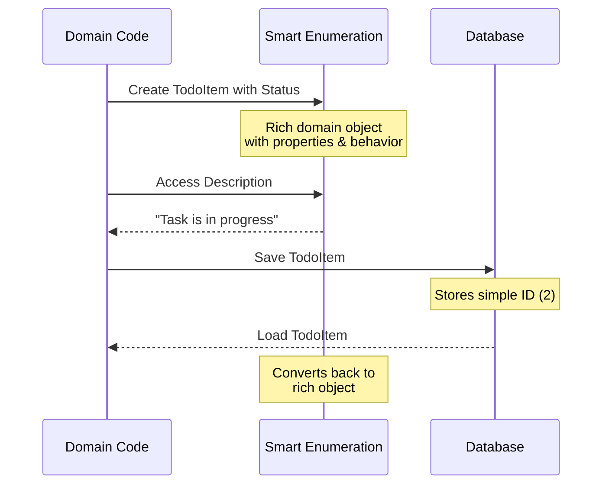
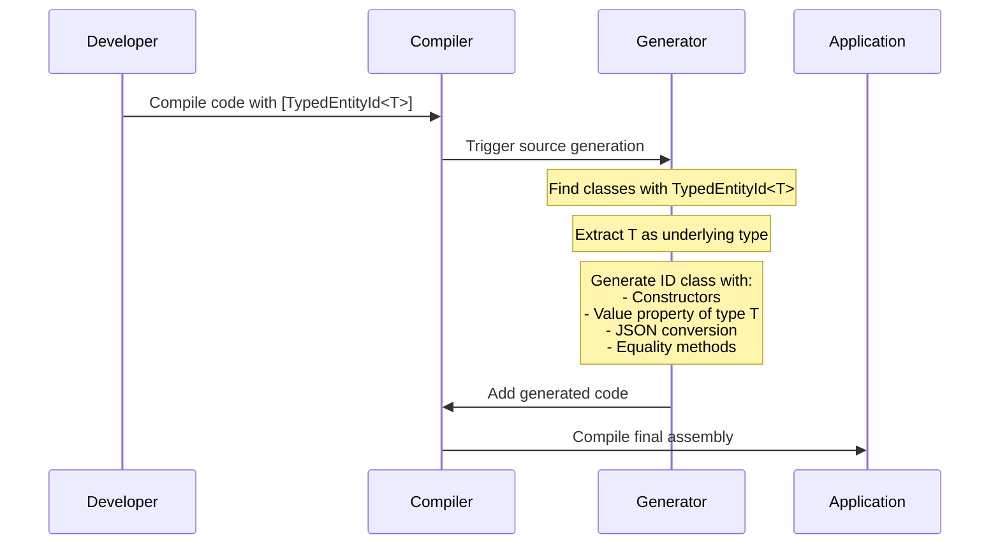

# Domain Feature Documentation

[TOC]

## Overview

## Challenges

## Solution

## Use Cases

## Appendix A: Smart Enumerations

### Overview
In domain modeling, representing a fixed set of options or states is a common requirement. While C# provides the enum type for this purpose, it often proves too limiting for real-world domain models. The Smart Enumeration pattern offers a more powerful alternative that combines the simplicity of enums with the flexibility of full-fledged objects.

### Challenge
Traditional C# enums work well for simple flags or states but fall short when requirements grow:
- Cannot include additional data like descriptions or metadata
- No support for business rules or behavior
- Limited to numeric values
- Hard to extend or version
- No validation beyond basic type checking

### Solution: Smart Enumerations



### Usage

```csharp
public class TodoStatus : Enumeration
{
    public static readonly TodoStatus New = new(1, nameof(New), "Newly created task");
    public static readonly TodoStatus InProgress = new(2, nameof(InProgress), "Task is being worked on");
    public static readonly TodoStatus Completed = new(3, nameof(Completed), "Task has been completed");

    private TodoStatus(int id, string value, string description)
        : base(id, value)
    {
        this.Description = description;
    }

    public string Description { get; }

    public static IEnumerable<TodoStatus> GetAll() => GetAll<TodoStatus>();
}
```

#### Entity Framework Configuration
```csharp
public class TodoItemEntityTypeConfiguration : IEntityTypeConfiguration<TodoItem>
{
    public void Configure(EntityTypeBuilder<TodoItem> builder)
    {
        builder.Property(x => x.Status)
            .HasConversion(new EnumerationConverter<TodoStatus>())
            .IsRequired();
    }
}
```

### Benefits

Smart Enumerations transform enumerated values from simple flags into rich domain concepts. They shine in real applications by providing:

- **Rich Domain Expression** - Instead of bare numbers, enumerations carry meaning through additional properties and behavior. When a developer looks at a todo item's status, they see not just a value but also its description, business rules, and any metadata.

- **Natural Evolution** - As applications grow, enumerations often need additional properties or behaviors. Smart Enumerations accommodate this growth naturally - adding a new status property or validation rule doesn't break existing code.

- **Safety with Simplicity** - While providing rich domain features, they maintain the simplicity of traditional enums in usage. The type system prevents errors like assigning a priority to a status field, while Entity Framework Core's value converters ensure clean persistence.

The result is code that better expresses business concepts while remaining maintainable and safe - a perfect fit for domain-driven applications that need to evolve over time.

## Appendix B: Strongly-Typed Entity IDs

### Overview

In domain-driven design and clean architecture, entity identifiers play a crucial role. However, using primitive types like `Guid` or `int` as identifiers can lead to subtle bugs and unclear code. Consider a system managing both `Todo`s and `TodoStep`s, each using GUIDs as identifiers. A method that accidentally accepts a `TodoStep` ID when it should work with `Todo` IDs will compile successfully because both are GUIDs.

This common anti-pattern is known as "[primitive obsession](https://wiki.c2.com/?PrimitiveObsession)" - using primitive types where a dedicated type would better express domain concepts and prevent errors.

### Solution

The TypedEntityId source generator automatically creates strongly-typed ID classes during compilation. It scans for classes marked with the `[TypedEntityId<T>]` attribute and generates corresponding ID wrapper classes that provide type safety and domain semantics.



### Features (Generator)

The source generator creates ID classes with:

- Value wrapping and access
- Type conversions
- JSON serialization support
- Equality comparison
- Debug visualization
- Factory methods for creation
- Null handling

### Usage

#### Domain Entity
```csharp
[TypedEntityId<Guid>] // triggers the generator
public class TodoItem : Entity<TodoId> // generated id
{
    public string Title { get; set; }
    //...
}
```

#### Application Code
```csharp
// Type safety prevents mixing different ID types
public async Task<Todo> GetTodo(TodoId id) // ✅
public async Task<Todo> GetTodo(TodoStepId id) // ❌ Won't compile

// Convenient implicit conversions
TodoItemId id = Guid.NewGuid();  // Guid to TodoItemId
Guid guid = id;                  // TodoItemId to Guid
```

#### Entity Framework Configuration

The strongly-typed IDs require proper Entity Framework configuration to map between domain types and database primitives:

```csharp
public class TodoItemEntityTypeConfiguration : IEntityTypeConfiguration<Todo>
{
    public void Configure(EntityTypeBuilder<TodoItem> builder)
    {
        builder.Property(e => e.Id).ValueGeneratedOnAdd()
            .HasConversion(
                id => id.Value,                      // To database: TodoId -> Guid
                value => TodoItemId.Create(value));  // From database: Guid -> TodoId

        // Navigation property configuration
        builder.OwnsMany(x => x.Steps, sb =>
        {
            sb.Property(s => s.Id).ValueGeneratedOnAdd()
                .HasConversion(id => id.Value, value => TodoStepId.Create(value));
        });
    }
}
```

### Benefits

- **Type Safety**: Compiler catches ID type mismatches
- **Domain Clarity**: IDs carry semantic meaning
- **Convenience**: Implicit conversions to/from primitive types
- **Debugging**: Meaningful string representation
- **JSON Support**: Built-in serialization handling
- **Persistence**: Seamless Entity Framework integration
- **Value Semantics**: Proper equality comparison

The TypedEntityId pattern transforms primitive identifiers into first-class domain concepts, making code both safer and more expressive. It prevents a whole class of bugs while better communicating domain intent through the type system.