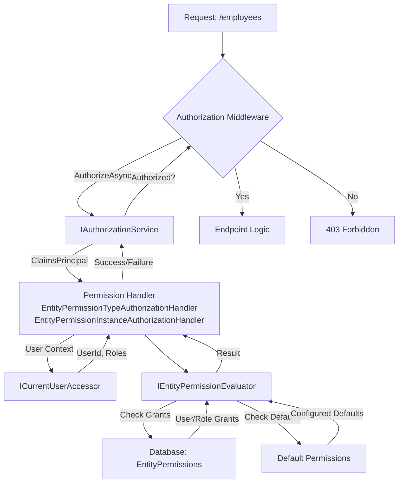
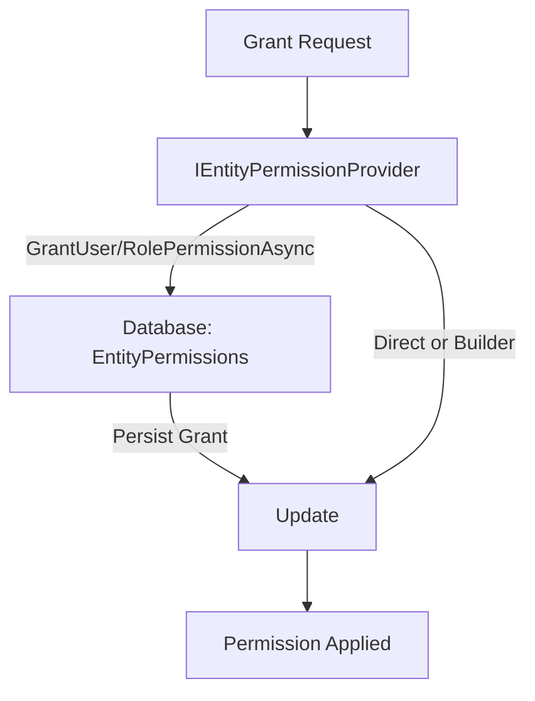

# Entity Permissions Feature Documentation

## Overview
The `Application.Identity` feature within the `bITDevKit` provides a robust framework for managing entity-level permissions in ASP.NET Core applications. Designed to enforce precise access control on entities such as `Employee`, it supports a range of permissions, including predefined constants like `Permission.Read` and custom strings such as `"Review"`. Configured through a fluent `AddEntityAuthorization` syntax in `Program.cs`, this feature seamlessly integrates with controllers, Minimal APIs, and RESTful endpoints for runtime permission management and evaluation. Leveraging Entity Framework Core for persistence, it also accommodates hierarchical permission inheritance, making it particularly suitable for organizational scenarios.

## Challenges
- **Granular Access Control**: Traditional role-based access control (RBAC) lacks the precision to restrict access to specific entity instances, such as an individual employee record.
- **Configuration Complexity**: Establishing permissions across multiple entities and endpoints can be intricate without a centralized approach.
- **Hierarchical Permissions**: Managing permissions that cascade through parent-child relationships (e.g., from manager to employee) requires a structured and efficient solution.
- **Runtime Management**: Developers need effective tools to grant, revoke, and evaluate permissions dynamically during application execution.

## Solution
The `Application.Identity` feature addresses these challenges by delivering a unified and developer-friendly system for entity-level permissions. It centralizes configuration within `AddEntityAuthorization`, supporting predefined `Permission` constants (e.g., `Permission.Read`) and custom strings (e.g., `"Review"`), and integrates with ASP.NET Core’s authorization pipeline. Permissions can be applied at the entity type level (wildcard permissions, affecting all instances of an entity type) or restricted to specific entity instances (entity-specific permissions, identified by an ID). Key components include:

- **Entity Permissions**: Defined for specific entities or type-wide using wildcard permissions (e.g., all `Employee` entities) or entity-specific permissions (e.g., a single `Employee` with a given ID), persisted in a database.
- **Fluent Configuration**: Managed within `Program.cs` for simplicity and consistency across the application.
- **Permission Evaluation**: Facilitated by `IEntityPermissionEvaluator<Employee>` for programmatic checks and `IAuthorizationService` for integration with ASP.NET Core’s authorization framework.
- **Management Tools**: Provided through `IEntityPermissionProvider` for granting and revoking permissions, complemented by RESTful APIs for runtime management.
- **Hierarchy Support**: Enables permissions to propagate from parent to child entities, enhancing flexibility in hierarchical structures.

### Permission Evaluation Flow Diagram
This diagram illustrates the process of evaluating permissions for a request:



- **Evaluation Flow Explanation**:
  1. A request (e.g., `/employees`) is received and processed by ASP.NET Core’s authorization middleware.
  2. The middleware invokes `IAuthorizationService`, passing the `ClaimsPrincipal` from the HTTP context.
  3. `AuthorizeAsync` delegates to permission handlers (`EntityPermissionTypeAuthorizationHandler` or `EntityPermissionInstanceAuthorizationHandler`).
  4. The handlers use `ICurrentUserAccessor` to retrieve the current user’s ID and roles, then delegate to `IEntityPermissionEvaluator<Employee>`.
  5. The evaluator checks explicit grants in the `EntityPermissions` database and configured defaults.
  6. The result determines whether the endpoint executes or a 403 Forbidden response is returned.

### Permission Granting Flow Diagram
This diagram depicts the process of granting permissions:



- **Granting Flow Explanation**:
  1. A grant request is initiated programmatically via `IEntityPermissionProvider`.
  2. Methods like `GrantUserPermissionAsync` or `GrantRolePermissionAsync` (called directly or via `EntityPermissionProviderBuilder`) update the `EntityPermissions` database.
  3. The database persists the new grant (wildcard or entity-specific).
  4. The permission is applied, ready for evaluation in subsequent requests.

### Getting Started
#### Prerequisites
- An ASP.NET Core application with dependency injection configured.
- Entity Framework Core with a database context implementing `IEntityPermissionContext`.

#### Basic Setup
Configure in `Program.cs`:
```csharp
using BridgingIT.DevKit.Common;

services.AddEntityAuthorization(o =>
{
    o.WithEntityPermissions<CoreDbContext>(o =>
    {
        o.AddEntity<Employee>(Permission.Read, Permission.Write, Permission.Delete);
    });
});
services.AddDbContext<CoreDbContext>(options => options.UseSqlServer("Server=.;Database=YourDb;Trusted_Connection=True;"));
```

#### First Secured Endpoint
Secure a Minimal API endpoint:
```csharp
using BridgingIT.DevKit.Common;

app.MapGet("/employees", async (IMediator mediator) =>
{
    var response = await mediator.Send(new EmployeeFindAllQuery());
    return Results.Ok(response);
}).RequireEntityPermission<Employee>(Permission.List);
```

---

## Setup and Configuration

### Fluent Configuration
Define permissions using the fluent syntax:
```csharp
using BridgingIT.DevKit.Common;

services.AddEntityAuthorization(o =>
{
    o.WithEntityPermissions<CoreDbContext>(o =>
    {
        o.AddEntity<Employee>(Permission.Read, Permission.Write, Permission.Delete, Permission.For("Review"))
            .AddDefaultPermissions<Employee>(Permission.Read)
            .UseDefaultPermissionProvider<Employee>();

        o.EnableEvaluationEndpoints();
        o.EnableManagementEndpoints(c => c.RequireRoles = [Role.Administrators]);
    });
});
```
- **`AddEntity`**: Specifies allowed permissions, supporting `Permission` constants and custom strings.

### Database
Define the persistence context:
```csharp
public class CoreDbContext : DbContext, IEntityPermissionContext
{
    public CoreDbContext(DbContextOptions<CoreDbContext> options) : base(options) { }
    public DbSet<EntityPermission> EntityPermissions { get; set; }
}
```

### Securing Controllers
Use `EntityPermissionRequirementAttribute`:
```csharp
using BridgingIT.DevKit.Common;

[Authorize]
[Route("api/employees")]
[ApiController]
public class EmployeeController : ControllerBase
{
    [EntityPermissionRequirement(typeof(Employee), nameof(Permission.List))]
    [HttpGet]
    public IActionResult GetAll() { /* Implementation */ }
}
```
- **Note**: The `EntityPermissionTypeAuthorizationHandler` and `EntityPermissionInstanceAuthorizationHandler` require `ICurrentUserAccessor` to retrieve the current user ID for permission checks. This interface must be registered in the dependency injection container. Add the following to `Program.cs`:
  ```csharp
  services.AddScoped<ICurrentUserAccessor, HttpCurrentUserAccessor>();
  services.AddHttpContextAccessor(); // Required for HttpCurrentUserAccessor
  ```

### Securing Minimal APIs
Use `RequireEntityPermission`:
```csharp
using BridgingIT.DevKit.Common;

app.MapGet("/employees", () => { /* Implementation */ }).RequireEntityPermission<Employee>(Permission.List);
```

---

## Managing Permissions

Permissions can be managed programmatically using `IEntityPermissionProvider` or `EntityPermissionProviderBuilder`.

### Using `IEntityPermissionProvider` Directly
#### Example
```csharp
using BridgingIT.DevKit.Common;

var provider = services.GetRequiredService<IEntityPermissionProvider>();
await provider.GrantUserPermissionAsync("user123", typeof(Employee).FullName, "emp1", Permission.Write);
await provider.GrantRolePermissionAsync("Admins", typeof(Employee).FullName, null, "Review");
```

### Using `EntityPermissionProviderBuilder`
#### Example
```csharp
using BridgingIT.DevKit.Common;

var provider = new EntityPermissionProviderBuilder(
    services.GetRequiredService<IEntityPermissionProvider>())
    .ForUser("user123")
    .WithPermission(typeof(Employee).FullName, "emp1", Permission.Write)
    .WithPermission(typeof(Employee).FullName, "emp1", "Review")
    .ForRole("Admins")
    .WithPermission(typeof(Employee).FullName, null, Permission.List)
    .Build();
```

### Via API
See **API Reference** for RESTful management endpoints.

---

## Checking Permissions

Permissions can be verified using `IEntityPermissionEvaluator<Employee>` or ASP.NET Core’s `IAuthorizationService`.

### Using `IEntityPermissionEvaluator<Employee>`
#### Example
```csharp
using BridgingIT.DevKit.Common;

var evaluator = services.GetRequiredService<IEntityPermissionEvaluator<Employee>>();
var canWrite = await evaluator.HasPermissionAsync("user123", ["Admins"], "emp1", Permission.Write);
var canReview = await evaluator.HasPermissionAsync("user123", [], "emp1", "Review");
```

### Using `IAuthorizationService`
The ASP.NET Core `IAuthorizationService` evaluates authorization requirements, integrating with the feature’s permission handlers (`EntityPermissionTypeAuthorizationHandler` and `EntityPermissionInstanceAuthorizationHandler`). When `AuthorizeAsync` is invoked, it uses the `ClaimsPrincipal` from the HTTP context to assess user identity and roles, delegating to these handlers. The handlers rely on `ICurrentUserAccessor` to retrieve the current user ID, ensuring accurate permission checks within the ASP.NET Core pipeline.

#### Example
```csharp
using BridgingIT.DevKit.Common;

[Authorize]
[Route("api/employees")]
[ApiController]
public class EmployeeController : ControllerBase
{
    private readonly IMediator mediator;
    private readonly IMapper<EmployeeQueryResponse, EmployeeModel> mapper;
    private readonly IAuthorizationService authorizationService;

    public EmployeeController(IMediator mediator, IMapper<EmployeeQueryResponse, EmployeeModel> mapper, IAuthorizationService authorizationService)
    {
        this.mediator = mediator;
        this.mapper = mapper;
        this.authorizationService = authorizationService;
    }

    [EntityPermissionRequirement(typeof(Employee), nameof(Permission.List))]
    [HttpGet]
    public async Task<ActionResult<IEnumerable<EmployeeModel>>> GetAll()
    {
        var result = await this.authorizationService.AuthorizeAsync(
            User,
            typeof(Employee),
            new EntityPermissionRequirement(Permission.List));
        if (!result.Succeeded) return Unauthorized();

        var response = await this.mediator.Send(new EmployeeFindAllQuery());
        return this.Ok(this.mapper.Map(response.Result));
    }
}
```

### Via API
See **API Reference** for evaluation endpoints.

---

## Examples

### Scenario: Employee Management Application
#### Setup Configuration
```csharp
using BridgingIT.DevKit.Common;

services.AddEntityAuthorization(o =>
{
    o.WithEntityPermissions<CoreDbContext>(o =>
    {
        o.AddEntity<Employee>(Permission.Read, Permission.Write, Permission.List, Permission.Delete, Permission.For("Review"))
            .AddDefaultPermissions<Employee>(Permission.Read)
            .EnableEvaluationEndpoints()
            .EnableManagementEndpoints(c => c.RequireRoles = [Role.Administrators]);
    }));
services.AddScoped<ICurrentUserAccessor, HttpCurrentUserAccessor>();
services.AddHttpContextAccessor();
services.AddDbContext<CoreDbContext>(options => options.UseSqlServer("Server=.;Database=EmployeeDb;Trusted_Connection=True;"));
```

#### Secure Endpoints
**Controller**: (As above)
**Minimal API**:
```csharp
using BridgingIT.DevKit.Common;

app.MapGet("/employees", async (IMediator mediator) =>
{
    var response = await mediator.Send(new EmployeeFindAllQuery());
    return Results.Ok(response.Result);
}).RequireEntityPermission<Employee>(Permission.List);
```

#### Grant and Check Permissions
**Direct Grant**:
```csharp
using BridgingIT.DevKit.Common;

var provider = services.GetRequiredService<IEntityPermissionProvider>();
await provider.GrantUserPermissionAsync("user123", typeof(Employee).FullName, "emp1", Permission.Write);
await provider.GrantRolePermissionAsync("Admins", typeof(Employee).FullName, null, Permission.List);
```

**Check with Evaluator**:
```csharp
using BridgingIT.DevKit.Common;

var evaluator = services.GetRequiredService<IEntityPermissionEvaluator<Employee>>;
var canWrite = await evaluator.HasPermissionAsync("user123", ["Admins"], "emp1", Permission.Write);
```

---

## API Reference

### Management Endpoints
| Endpoint                                          | Method | Purpose                     | Example Request                                              |
| ------------------------------------------------- | ------ | --------------------------- | ------------------------------------------------------------ |
| `/users/{userId}`                                 | POST   | Grant user permission       | `curl -X POST ... -d '{"entityType": "EmployeeType", "entityId": "emp1", "permission": "Write"}'` |
| `/users/{userId}`                                 | DELETE | Revoke user permission      | Same as above                                                |
| `/users/{userId}/all`                             | DELETE | Revoke all user permissions | `curl -X DELETE .../users/user123/all`                       |
| `/users/{userId}?entityType={type}&entityId={id}` | GET    | Get user permissions        | `curl .../users/user123?entityType=EmployeeType&entityId=emp1` |
| `/roles/{role}` (same sub-paths as users)         | *      | Role-based equivalents      | Replace `users/user123` with `roles/Admins`                  |

### Evaluation Endpoints
| Endpoint                                        | Method | Purpose                       | Example Response                                             |
| ----------------------------------------------- | ------ | ----------------------------- | ------------------------------------------------------------ |
| `/{permission}?entityType={type}&entityId={id}` | GET    | Check specific permission     | `{"entityType": "EmployeeType", "permission": "Read", "hasAccess": true}` |
| `?entityType={type}&entityId={id}`              | GET    | Get all effective permissions | `[{"permission": "Read", "source": "Direct", "hasAccess": true}]` |

---

## Best Practices
- Define minimal permissions in `AddEntity` to enforce least privilege.
- Use wildcard permissions (`entityId = null`) judiciously for type-wide access.
- Restrict management endpoints to administrative roles via `RequireRoles`.
- Validate permission logic during development using the evaluator or API.

---

## Troubleshooting
- **403 Forbidden**: Verify user roles or explicit grants in `__Identity_EntityPermissions`. Ensure `ICurrentUserAccessor` is registered.
- **Endpoint 404**: Confirm `EnableEvaluationEndpoints` or `EnableManagementEndpoints` is included.
- **No Access Granted**: Verify `entityType` uses the full type name (e.g., `BridgingIT.DevKit.Examples.Employee`).

---

## Appendix: Working with Hierarchical Entities
### Example: Employee Hierarchy
#### Structure
```
CEO (ceo1)       <- "Read"
  └─ Manager (mgr1)  <- "Write", "Delete" (Admins role)
       └─ Employee (emp1)
```

#### Step 1: Configure
```csharp
using BridgingIT.DevKit.Common;

services.AddEntityAuthorization(o =>
{
    o.WithEntityPermissions<CoreDbContext>(o =>
    {
        o.AddHierarchicalEntity<Employee>(e => e.ManagerId, Permission.Read, Permission.Write, Permission.Delete);
    }));
);
```

#### Step 2: Grant Permissions
```csharp
using BridgingIT.DevKit.Common;

var provider = services.GetRequiredService<IEntityPermissionProvider>();
await provider.GrantUserPermissionAsync("user123", typeof(Employee).FullName, "ceo1", Permission.Read);
await provider.GrantUserPermissionAsync("user123", typeof(Employee).FullName, "mgr1", Permission.Write);
await provider.GrantRolePermissionAsync("Admins", typeof(Employee).FullName, "mgr1", Permission.Delete);
```

#### Step 3: Check Effective Permissions
```csharp
using BridgingIT.DevKit.Common;

var evaluator = services.GetRequiredService<IEntityPermissionEvaluator<Employee>>;
var permissions = await evaluator.GetPermissionsAsync("user123", ["Admins"], "emp1");
permissions.ForEach(p => Console.WriteLine($"{p.Permission} from {p.Source}"));
```

**Output**:
- `Read from Parent:ceo1`
- `Write from Parent:mgr1`
- `Delete from Parent:Role:Admins`

**Flow Diagram**:
```
[CEO: Read] --> [Manager: Write, Delete(Admins)] --> [Employee: Read, Write, Delete(Admins)]
```
