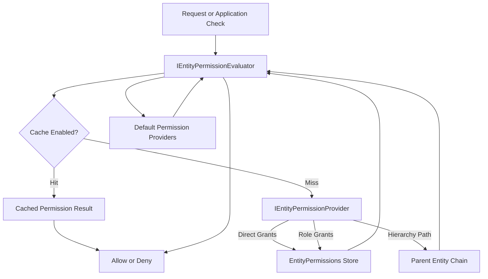
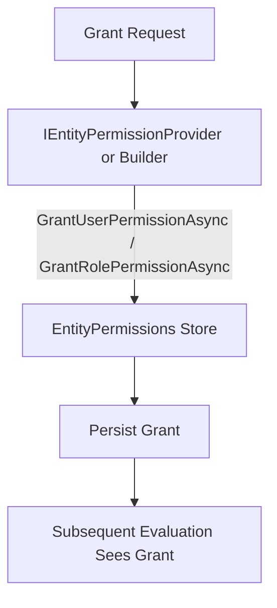

# Entity Permissions Feature Documentation

> Enforce fine-grained, entity-level authorization with fluent configuration and runtime evaluation.

[TOC]

## Overview

The `Application.Identity` feature within the `bITDevKit` provides a robust framework for managing entity-level permissions in ASP.NET Core applications. Designed to enforce precise access control on entities such as `Employee`, it supports a range of permissions, including predefined constants like `Permission.Read` and custom strings such as `"Review"`. Configured through a fluent `AddEntityAuthorization` syntax in `Program.cs`, this feature integrates with application code, ASP.NET Core authorization, Minimal APIs, and optional runtime management endpoints. Leveraging Entity Framework Core for persistence, it also supports hierarchical permission inheritance, making it well-suited for organizational or tree-shaped data models.

## Challenges

- **Granular Access Control**: Traditional role-based access control is often too coarse when access must be restricted to specific entity instances.
- **Configuration Complexity**: Setting up permissions across multiple entities and endpoints becomes hard to maintain without a central model.
- **Hierarchical Permissions**: Parent-child structures often need inherited access, such as a manager's access flowing to subordinate entities.
- **Runtime Management**: Applications need programmatic and operational ways to grant, revoke, inspect, and validate permissions.
- **Cross-Layer Consistency**: The same permission logic should be reusable in endpoints, application services, and rules without duplicating checks.

## Solution

The `Application.Identity` feature addresses these challenges by delivering a unified and developer-friendly system for entity-level permissions. It centralizes configuration within `AddEntityAuthorization`, supports predefined `Permission` constants and custom permission strings, and integrates with ASP.NET Core's authorization pipeline.

Permissions can be applied at two levels:

- **Type-wide permissions**: wildcard permissions that apply to all instances of an entity type
- **Entity-specific permissions**: permissions granted for a single entity instance identified by an id

Key components include:

- **Entity Permissions**: persisted or defaulted rights for a specific entity type or entity instance
- **Fluent Configuration**: centralized setup through `AddEntityAuthorization(...)` and `WithEntityPermissions<TContext>(...)`
- **Permission Evaluation**: `IEntityPermissionEvaluator<TEntity>` for application-layer permission checks
- **Management Tools**: `IEntityPermissionProvider` plus `EntityPermissionProviderBuilder` for granting and revoking permissions
- **Hierarchy Support**: optional parent inheritance for entities configured through `AddHierarchicalEntity(...)`
- **Rules Integration**: `HasPermissionRule<TEntity>` and `HasNotPermissionRule<TEntity>` for rule-based authorization checks

### Permission Evaluation Flow Diagram

This diagram illustrates the effective permission evaluation process:


```mermaid
graph TD
    A[Request or Application Check] --> B[IEntityPermissionEvaluator<TEntity>]
    B --> C{Cache Enabled?}
    C -->|Hit| D[Cached Permission Result]
    C -->|Miss| E[IEntityPermissionProvider]
    E -->|Direct Grants| F[EntityPermissions Store]
    E -->|Role Grants| F
    E -->|Hierarchy Path| G[Parent Entity Chain]
    B --> H[Default Permission Providers]
    F --> B
    G --> B
    H --> B
    D --> I[Allow or Deny]
    B --> I
```

- **Evaluation Flow Explanation**:
  1. Application code or ASP.NET Core authorization triggers a permission check.
  2. `IEntityPermissionEvaluator<TEntity>` optionally checks the cache first.
  3. If needed, it asks `IEntityPermissionProvider` for direct user and role grants.
  4. If the entity type is configured as hierarchical, parent ids are resolved and checked as inherited permission sources.
  5. Configured default permission providers are evaluated.
  6. The evaluator returns an allow/deny result and may cache successful resolutions.

### Permission Granting Flow Diagram

This diagram depicts how permissions are granted:


```mermaid
graph TD
    L[Grant Request] --> M[IEntityPermissionProvider or Builder]
    M -->|GrantUserPermissionAsync / GrantRolePermissionAsync| N[EntityPermissions Store]
    N --> O[Persist Grant]
    O --> P[Subsequent Evaluation Sees Grant]
```

- **Granting Flow Explanation**:
  1. A grant request is initiated programmatically through `IEntityPermissionProvider` or the fluent `EntityPermissionProviderBuilder`.
  2. User- or role-based grants are persisted for an entity type or a concrete entity id.
  3. Later permission checks resolve those grants directly or via inherited or cached results.

## Getting Started

### Prerequisites

- An ASP.NET Core application with dependency injection configured
- Entity Framework Core with a database context implementing `IEntityPermissionContext`
- An `ICurrentUserAccessor` implementation for user-aware evaluation in web requests

### Basic Setup

Configure entity permissions in `Program.cs`:

```csharp
using BridgingIT.DevKit.Application.Identity;
using BridgingIT.DevKit.Common;

services.AddEntityAuthorization(identity =>
{
    identity.WithEntityPermissions<CoreDbContext>(permissions =>
    {
        permissions.AddEntity<Employee>(
            Permission.Read,
            Permission.Write,
            Permission.Delete,
            Permission.List);
    });
});

services.AddHttpContextAccessor();
services.AddScoped<ICurrentUserAccessor, HttpCurrentUserAccessor>();
services.AddDbContext<CoreDbContext>(options =>
    options.UseSqlServer("Server=.;Database=YourDb;Trusted_Connection=True;"));
```

### First Secured Endpoint

Secure a Minimal API endpoint:

```csharp
app.MapGet("/employees", () => Results.Ok())
    .RequireEntityPermission<Employee>(Permission.List);
```

This keeps the example focused on authorization itself. Application-specific request handling can be plugged into the endpoint however the host prefers.

---

## Setup and Configuration

### Fluent Configuration

Define permissions using the fluent syntax:

```csharp
using BridgingIT.DevKit.Application.Identity;
using BridgingIT.DevKit.Common;

services.AddEntityAuthorization(identity =>
{
    identity.WithEntityPermissions<CoreDbContext>(permissions =>
    {
        permissions
            .AddEntity<Employee>(
                Permission.Read,
                Permission.Write,
                Permission.Delete,
                Permission.List,
                Permission.For("Review"))
            .AddDefaultPermissions<Employee>(Permission.Read)
            .UseDefaultPermissionProvider<Employee>()
            .EnableCaching()
            .WithCacheLifetime(TimeSpan.FromMinutes(5));
    })
    .EnableEvaluationEndpoints()
    .EnableManagementEndpoints(options =>
    {
        options.RequireAuthorization = true;
    });
});
```

- **`AddEntity`** registers a regular entity type and the permission names that should be available for it.
- **`AddHierarchicalEntity`** registers a parent-link expression for inherited permissions.
- **`AddDefaultPermissions`** defines baseline permissions for an entity type.
- **`UseDefaultPermissionProvider`** activates either the built-in or a custom default provider.
- **`EnableCaching`** and **`WithCacheLifetime`** control evaluator caching.

### Hierarchical Entities

For entities with parent-child relationships, use `AddHierarchicalEntity(...)`:

```csharp
permissions.AddHierarchicalEntity<Department>(
    d => d.ParentId,
    Permission.Read,
    Permission.Write,
    Permission.List);
```

This tells the evaluator how to walk the hierarchy when direct grants are absent.

### Database Context

Define the persistence context:

```csharp
public class CoreDbContext : DbContext, IEntityPermissionContext
{
    public CoreDbContext(DbContextOptions<CoreDbContext> options)
        : base(options)
    {
    }

    public DbSet<EntityPermission> EntityPermissions { get; set; }
}
```

### Securing Controllers

For controller-based scenarios, use `EntityPermissionRequirementAttribute` from the presentation layer:

```csharp
[Authorize]
[Route("api/employees")]
[ApiController]
public class EmployeeController : ControllerBase
{
    [EntityPermissionRequirement(typeof(Employee), nameof(Permission.List))]
    [HttpGet]
    public IActionResult GetAll() => this.Ok();
}
```

### Securing Minimal APIs

Use `RequireEntityPermission(...)`:

```csharp
app.MapGet("/employees", () => Results.Ok())
    .RequireEntityPermission<Employee>(Permission.List);
```

For route groups:

```csharp
app.MapGroup("/employees")
    .RequireEntityPermission<Employee>(Permission.Read);
```

### Important Boundary Note

The feature spans multiple packages:

- `Application.Identity` defines the permission model, evaluator, provider abstractions, and rules
- `Infrastructure.EntityFramework` provides `WithEntityPermissions<TContext>(...)` and the EF-backed provider wiring
- `Presentation.Web` adds endpoint helpers and the optional evaluation/management endpoints

That split matters because some APIs that feel like part of the feature actually live outside the core application package.

---

## Managing Permissions

Permissions can be managed programmatically using `IEntityPermissionProvider` or `EntityPermissionProviderBuilder`.

### Using `IEntityPermissionProvider` Directly

```csharp
var provider = services.GetRequiredService<IEntityPermissionProvider>();

await provider.GrantUserPermissionAsync(
    "user123",
    typeof(Employee).FullName,
    "emp1",
    Permission.Write);

await provider.GrantRolePermissionAsync(
    "Admins",
    typeof(Employee).FullName,
    null,
    "Review");
```

The provider also supports:

- revoking single user or role permissions
- revoking all permissions for one user or role
- listing permissions for users, roles, or a concrete entity
- retrieving the hierarchy path for configured hierarchical entities

### Using `EntityPermissionProviderBuilder`

```csharp
var provider = new EntityPermissionProviderBuilder(
    services.GetRequiredService<IEntityPermissionProvider>())
    .ForUser("user123")
        .WithPermission<Employee>("emp1", Permission.Write)
        .WithPermission<Employee>("emp1", "Review")
    .ForRole("Admins")
        .WithPermission<Employee>(Permission.List)
    .Build();
```

This builder is useful for seeding or setup code where a fluent style reads better than calling the provider directly.

### Default Permission Providers

Default providers supply permissions even when no explicit persisted grant exists.

Use cases include:

- public read access
- baseline permissions for specific modules
- environment- or tenant-dependent defaults

The core contract is `IDefaultEntityPermissionProvider<TEntity>`, which exposes `GetDefaultPermissions()`.

### Cache Invalidation

If caching is enabled, permission cache entries may need invalidation after administrative changes. The cache extension helpers support broad invalidation patterns such as:

- invalidating all permissions for a specific user
- invalidating all permissions for an entity type

See also [Common Caching](./common-caching.md).

---

## Checking Permissions

Permissions can be verified using `IEntityPermissionEvaluator<TEntity>` or ASP.NET Core authorization.

### Using `IEntityPermissionEvaluator<TEntity>`

```csharp
var evaluator = services.GetRequiredService<IEntityPermissionEvaluator<Employee>>();

var canWrite = await evaluator.HasPermissionAsync(
    "user123",
    ["Admins"],
    "emp1",
    Permission.Write);

var canReview = await evaluator.HasPermissionAsync(
    "user123",
    [],
    "emp1",
    "Review");
```

The evaluator supports several shapes:

- checks against a concrete entity instance
- checks against an entity id
- wildcard checks against the entity type
- checks for a single permission or any permission in a set
- permission inspection through `GetPermissionsAsync(...)`

### Using `ICurrentUserAccessor`

For application services or handlers already running in a user-aware context:

```csharp
var canRead = await evaluator.HasPermissionAsync(
    currentUserAccessor,
    employeeId,
    Permission.Read,
    cancellationToken: cancellationToken);
```

### Using ASP.NET Core Authorization

ASP.NET Core authorization flows into the same permission system through authorization handlers. For Minimal APIs, `RequireEntityPermission(...)` adds an `EntityPermissionAuthorizationRequirement`. For controller-based scenarios, the feature can also participate through policy-based authorization and the attribute helper shown earlier.

### Via Runtime Evaluation Endpoints

If enabled, the evaluation endpoints expose the evaluator over HTTP for operational inspection and debugging.

---

## Rules Integration

`Application.Identity` integrates with the Rules feature through:

- `HasPermissionRule<TEntity>`
- `HasNotPermissionRule<TEntity>`

Example:

```csharp
var result = await Rule.CheckAsync(
    new HasPermissionRule<Employee>(
        currentUserAccessor,
        permissionEvaluator,
        employeeId,
        Permission.Write),
    cancellationToken: cancellationToken);
```

This is useful when permission failures should become structured `Result` failures instead of ad hoc branching.

For the broader rule style, see [Rules](./features-rules.md).

---

## API Reference

The runtime API surface is optional and lives in `Presentation.Web`.

### Management Endpoints

Default group path:

`/api/_system/identity/management/entities/permissions`

| Endpoint | Method | Purpose |
| --- | --- | --- |
| `/users/{userId}/grant` | `POST` | Grant a permission to a user for an entity type or entity id |
| `/users/{userId}/revoke` | `POST` | Revoke one permission from a user |
| `/users/{userId}/revoke/all` | `POST` | Revoke all permissions from a user |
| `/users/{userId}` | `GET` | Get granted permissions for one user and entity target |
| `/users` | `GET` | Get granted permissions for all users for an entity target |
| `/roles/{role}/grant` | `POST` | Grant a permission to a role |
| `/roles/{role}/revoke` | `POST` | Revoke one permission from a role |
| `/roles/{role}/revoke/all` | `POST` | Revoke all permissions from a role |
| `/roles/{role}` | `GET` | Get granted permissions for one role and entity target |
| `/roles` | `GET` | Get granted permissions for all roles for an entity target |

Request body for grant/revoke:

```json
{
  "entityType": "MyApp.Domain.Model.Employee",
  "entityId": "emp1",
  "permission": "Write"
}
```

### Evaluation Endpoints

Default group path:

`/api/_system/identity/evaluate/entities/permissions`

| Endpoint | Method | Purpose |
| --- | --- | --- |
| `/{permission}?entityType={type}&entityId={id}` | `GET` | Check whether the current user has a specific permission |
| `?entityType={type}&entityId={id}` | `GET` | Get the current user's effective permissions |

Example response:

```json
{
  "entityType": "MyApp.Domain.Model.Employee",
  "entityId": "emp1",
  "permission": "Read",
  "source": "Direct",
  "hasAccess": true
}
```

Notes:

- `entityType` must be the full CLR type name
- `entityId` is optional for type-wide checks
- evaluation endpoints can be configured to bypass the cache through `IdentityEntityPermissionEvaluationEndpointsOptions`

---

## Best Practices

- Define the smallest permission set that reflects real business needs.
- Use wildcard permissions sparingly for administrative or cross-cutting access.
- Prefer `IEntityPermissionEvaluator<TEntity>` in application code and reserve raw provider access for administration and seeding.
- Use hierarchical entities only when inheritance is a true domain rule.
- Enable caching for read-heavy systems, but understand when freshly granted or revoked permissions should bypass cached results.
- Protect management endpoints with strong authorization and operational access controls.
- Keep permission names consistent across endpoint protection, evaluator checks, and seeded grants.

---

## Troubleshooting

- **403 Forbidden**: Verify the current user is available through `ICurrentUserAccessor`, and check that the permission was granted for the correct full entity type name.
- **Permission Missing After Grant**: Check whether the evaluation path is hitting a cached result and whether the check should bypass the cache.
- **Hierarchy Not Applied**: Confirm the entity type was registered with `AddHierarchicalEntity(...)` and that the parent-id expression matches the entity id type.
- **Endpoints Not Available**: Confirm `EnableEvaluationEndpoints(...)` or `EnableManagementEndpoints(...)` was configured in the identity setup.
- **Entity Type Not Valid**: The runtime endpoints expect the full entity type name, not a short display name.

---

## Appendix: Working with Hierarchical Entities

### Example: Employee Hierarchy

#### Structure

```text
CEO (ceo1)       <- "Read"
  Manager (mgr1) <- "Write", "Delete" (Admins role)
    Employee (emp1)
```

#### Step 1: Configure

```csharp
services.AddEntityAuthorization(identity =>
{
    identity.WithEntityPermissions<CoreDbContext>(permissions =>
    {
        permissions.AddHierarchicalEntity<Employee>(
            e => e.ManagerId,
            Permission.Read,
            Permission.Write,
            Permission.Delete);
    });
});
```

#### Step 2: Grant Permissions

```csharp
var provider = services.GetRequiredService<IEntityPermissionProvider>();

await provider.GrantUserPermissionAsync(
    "user123",
    typeof(Employee).FullName,
    "ceo1",
    Permission.Read);

await provider.GrantUserPermissionAsync(
    "user123",
    typeof(Employee).FullName,
    "mgr1",
    Permission.Write);

await provider.GrantRolePermissionAsync(
    "Admins",
    typeof(Employee).FullName,
    "mgr1",
    Permission.Delete);
```

#### Step 3: Check Effective Permissions

```csharp
var evaluator = services.GetRequiredService<IEntityPermissionEvaluator<Employee>>();

var permissions = await evaluator.GetPermissionsAsync(
    "user123",
    ["Admins"],
    "emp1");

foreach (var permission in permissions)
{
    Console.WriteLine($"{permission.Permission} from {permission.Source}");
}
```

Possible output:

- `Read from Parent:ceo1`
- `Write from Parent:mgr1`
- `Delete from Parent:Role:Admins`

### Related Documentation

- [Rules](./features-rules.md)
- [Common Caching](./common-caching.md)
- [Presentation Endpoints](./features-presentation-endpoints.md)
