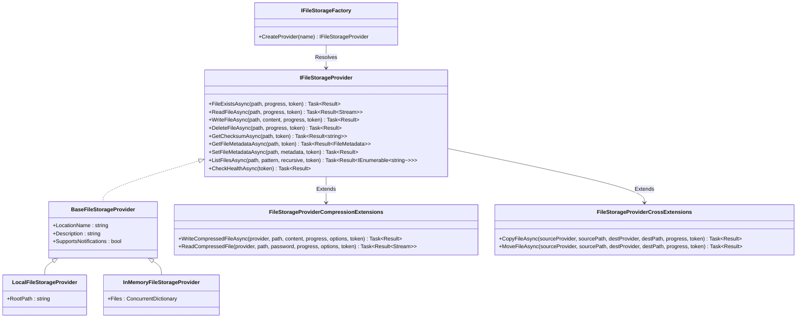
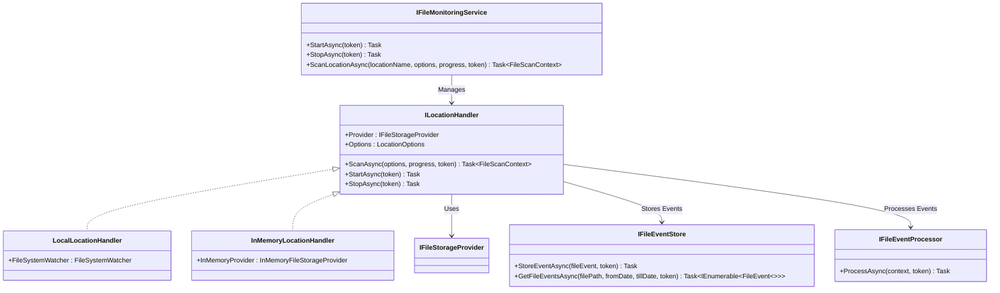

# FileStorage Feature Documentation

[TOC]

## Overview

Managing file storage presents challenges due to inconsistent APIs across storage systems, complex requirements for secure file handling, the need for progress reporting during long operations, robust error handling, thread safety concerns, and the demand for extensibility to support new providers or custom functionality.

The BridgingIT DevKit’s `FileStorage` feature addresses these through the `IFileStorageProvider` interface for abstracting file operations, a fluent DI setup with `AddFileStorage`, and the `Result` pattern for error handling and messaging. It supports progress reporting via `IProgress<FileProgress>` and metadata management with `FileMetadata`. The feature is designed to be extensible, allowing developers to implement custom providers or extend functionality with behaviors. Additionally, it supports notifications for real-time monitoring (used by `FileMonitoring`) through the `SupportsNotifications` property.

### Architecture

The `FileStorage` subsystem is built around the `IFileStorageProvider` interface, which defines core file operations. Providers like `LocalFileStorageProvider`, `InMemoryFileStorageProvider`, and others implement this interface. The `IFileStorageFactory` resolves providers by name, and extensions like `FileStorageProviderCompressionExtensions` and `FileStorageProviderCrossExtensions` add advanced functionality such as compression and cross-provider operations. Behaviors can be applied to providers to add cross-cutting concerns like logging or retry logic.

Below is a high-level architecture diagram:



### Use Cases
- **Basic File Operations**: Read, write, delete, and check file existence across different storage systems.
- **Metadata Management**: Retrieve and update file metadata for indexing or auditing purposes.
- **Bulk Operations**: Copy, move, or delete multiple files within or across providers with progress reporting.
- **Compression**: Compress files or directories into archives (e.g., ZIP) and decompress them, supporting password protection for decompression.
- **Cross-Provider Transfers**: Copy or move files between different storage providers (e.g., from local to cloud storage).
- **Health Monitoring**: Check the health of storage providers to ensure availability.

## Usage

### Setting Up a Provider with Dependency Injection (DI)

Configure `FileStorage` using `Microsoft.Extensions.DependencyInjection` with the `AddFileStorage` method, which supports a fluent API for registering named providers, applying behaviors, and setting lifetimes. Providers are resolved via `IFileStorageFactory`.

```csharp
services.AddFileStorage(c => c
    .RegisterProvider("inMemory", builder =>
    {
        builder.UseInMemory("TestInMemory")
               .WithLogging()
               .WithLifetime(ServiceLifetime.Transient);
    })
    .RegisterProvider("local", builder =>
    {
        builder.UseLocal(Path.Combine(Path.GetTempPath(), "TestStorage_" + Guid.NewGuid().ToString()), "TestLocal")
               .WithLogging()
               .WithLifetime(ServiceLifetime.Singleton);
    })
    .RegisterProvider("network", builder =>
    {
        builder.UseWindowsNetwork(@"\\server\docs", "NetworkStorage", "username", "password", "domain")
               .WithLogging()
               .WithRetry(new RetryOptions { MaxRetries = 3 })
               .WithLifetime(ServiceLifetime.Singleton);
    })
    .RegisterProvider("azureBlob", builder =>
    {
        builder.UseAzureBlob("connection-string", "container-name", "AzureBlobStorage")
               .WithCaching(new CachingOptions { CacheDuration = TimeSpan.FromMinutes(10) })
               .WithLifetime(ServiceLifetime.Scoped);
    }));

// Use the factory to resolve providers
public class FileService
{
    private readonly IFileStorageFactory factory;

    public FileService(IFileStorageFactory factory)
    {
        this.factory = factory;
    }

    public async Task<Result> ProcessFileAsync(string path)
    {
        var provider = this.factory.CreateProvider("local");
        return await provider.WriteFileAsync(path, new MemoryStream(Encoding.UTF8.GetBytes("Test content")), null, CancellationToken.None);
    }
}
```

This registers "inMemory", "local", "network", and "azureBlob" providers with behaviors and lifetimes, resolved by `IFileStorageFactory`.

### Using Providers

The `IFileStorageProvider` interface defines core file operations, returning `Result` or `Result<T>` for error handling and messaging. Use the factory-resolved provider to perform operations.

#### Core Methods

- **FileExistsAsync(string path, IProgress<FileProgress> progress, CancellationToken token)**: Checks if a file exists at `path`. Returns `Task<Result>` indicating success or failure with errors (e.g., `FileSystemError` for missing files).
  ```csharp
  var provider = factory.CreateProvider("local");
  var existsResult = await provider.FileExistsAsync("data.txt", null, CancellationToken.None);
  existsResult.ShouldBeSuccess("File should exist");
  ```

- **ReadFileAsync(string path, IProgress<FileProgress> progress, CancellationToken token)**: Reads a file as a `Stream`. Returns `Task<Result<Stream>>` with the stream or errors (e.g., `PermissionError`).
  ```csharp
  var readResult = await provider.ReadFileAsync("data.txt", null, CancellationToken.None);
  readResult.ShouldBeSuccess("Read should succeed");
  await using var stream = readResult.Value;
  new StreamReader(stream).ReadToEnd().ShouldBe("Test content");
  ```

- **WriteFileAsync(string path, Stream content, IProgress<FileProgress> progress, CancellationToken token)**: Writes `content` to `path`. Returns `Task<Result>` with success or errors (e.g., `FileSystemError`).
  ```csharp
  var writeResult = await provider.WriteFileAsync("data.txt", new MemoryStream(Encoding.UTF8.GetBytes("Test content")), null, CancellationToken.None);
  writeResult.ShouldBeSuccess("Write should succeed");
  ```

- **DeleteFileAsync(string path, IProgress<FileProgress> progress, CancellationToken token)**: Deletes a file at `path`. Returns `Task<Result>` with success or errors (e.g., `PermissionError`).
  ```csharp
  var deleteResult = await provider.DeleteFileAsync("data.txt", null, CancellationToken.None);
  deleteResult.ShouldBeSuccess("Delete should succeed");
  ```

- **GetChecksumAsync(string path, CancellationToken token)**: Computes a checksum for a file. Returns `Task<Result<string>>` with the checksum or errors (e.g., `FileSystemError`).
  ```csharp
  var checksumResult = await provider.GetChecksumAsync("data.txt", CancellationToken.None);
  checksumResult.ShouldBeSuccess("Checksum should succeed");
  ```

- **GetFileMetadataAsync(string path, CancellationToken token)**: Retrieves metadata for a file. Returns `Task<Result<FileMetadata>>` with `FileMetadata` or errors (e.g., `FileSystemError`).
  ```csharp
  var metadataResult = await provider.GetFileMetadataAsync("data.txt", CancellationToken.None);
  metadataResult.ShouldBeSuccess("Metadata retrieval should succeed");
  var metadata = metadataResult.Value;
  metadata.Path.ShouldBe("data.txt");
  metadata.Length.ShouldBeGreaterThan(0);
  ```

- **SetFileMetadataAsync(string path, FileMetadata metadata, CancellationToken token)**: Sets metadata for a file. Returns `Task<Result>` with success or errors (e.g., `FileSystemError`).
  ```csharp
  var metadata = new FileMetadata { Path = "data.txt", Length = 100, LastModified = DateTime.UtcNow };
  var setResult = await provider.SetFileMetadataAsync("data.txt", metadata, CancellationToken.None);
  setResult.ShouldBeSuccess("Metadata set should succeed");
  ```

- **UpdateFileMetadataAsync(string path, Func<FileMetadata, FileMetadata> metadataUpdate, CancellationToken token)**: Updates metadata for a file using a transformation function. Returns `Task<Result<FileMetadata>>` with updated metadata or errors.
  ```csharp
  var updateResult = await provider.UpdateFileMetadataAsync("data.txt", m => { m.Length = 200; return m; }, CancellationToken.None);
  updateResult.ShouldBeSuccess("Metadata update should succeed");
  updateResult.Value.Length.ShouldBe(200);
  ```

- **ListFilesAsync(string path, string searchPattern, bool recursive, string continuationToken, CancellationToken token)**: Lists files matching `searchPattern` under `path`. Returns `Task<Result<(IEnumerable<string> Files, string NextContinuationToken)>>` with files and pagination token or errors (e.g., `PermissionError`).
  ```csharp
  var listResult = await provider.ListFilesAsync("/", "*.txt", true, null, CancellationToken.None);
  listResult.ShouldBeSuccess("Listing should succeed");
  var files = listResult.Value.Files;
  files.ShouldContain("data.txt");
  ```

- **CopyFileAsync(string sourcePath, string destinationPath, IProgress<FileProgress> progress, CancellationToken token)**: Copies a file from `sourcePath` to `destinationPath` within the same provider. Returns `Task<Result>` with success or errors.
  ```csharp
  var copyResult = await provider.CopyFileAsync("data.txt", "data_copy.txt", null, CancellationToken.None);
  copyResult.ShouldBeSuccess("Copy should succeed");
  ```

- **RenameFileAsync(string path, string destinationPath, IProgress<FileProgress> progress, CancellationToken token)**: Renames a file from `path` to `destinationPath` within the same provider. Returns `Task<Result>` with success or errors.
  ```csharp
  var renameResult = await provider.RenameFileAsync("data.txt", "renamed.txt", null, CancellationToken.None);
  renameResult.ShouldBeSuccess("Rename should succeed");
  ```

- **MoveFileAsync(string path, string destinationPath, IProgress<FileProgress> progress, CancellationToken token)**: Moves a file from `path` to `destinationPath` within the same provider. Returns `Task<Result>` with success or errors.
  ```csharp
  var moveResult = await provider.MoveFileAsync("data.txt", "moved.txt", null, CancellationToken.None);
  moveResult.ShouldBeSuccess("Move should succeed");
  ```

- **CopyFilesAsync(IEnumerable<(string SourcePath, string DestinationPath)> filePairs, IProgress<FileProgress> progress, CancellationToken token)**: Copies multiple files within the same provider. Returns `Task<Result>` with success or partial failure (e.g., `PartialOperationError`).
  ```csharp
  var filePairs = new[] { ("data1.txt", "copy1.txt"), ("data2.txt", "copy2.txt") };
  var copyFilesResult = await provider.CopyFilesAsync(filePairs, null, CancellationToken.None);
  copyFilesResult.ShouldBeSuccess("Bulk copy should succeed");
  ```

- **DeleteFilesAsync(IEnumerable<string> paths, IProgress<FileProgress> progress, CancellationToken token)**: Deletes multiple files. Returns `Task<Result>` with success or partial failure.
  ```csharp
  var paths = new[] { "data1.txt", "data2.txt" };
  var deleteFilesResult = await provider.DeleteFilesAsync(paths, null, CancellationToken.None);
  deleteFilesResult.ShouldBeSuccess("Bulk delete should succeed");
  ```

- **MoveFilesAsync(IEnumerable<(string SourcePath, string DestinationPath)> filePairs, IProgress<FileProgress> progress, CancellationToken token)**: Moves multiple files within the same provider. Returns `Task<Result>` with success or partial failure.
  ```csharp
  var moveFilesResult = await provider.MoveFilesAsync(filePairs, null, CancellationToken.None);
  moveFilesResult.ShouldBeSuccess("Bulk move should succeed");
  ```

- **DirectoryExistsAsync(string path, CancellationToken token)**: Checks if `path` is a directory. Returns `Task<Result>` with success or errors (e.g., `FileSystemError`).
  ```csharp
  var dirExistsResult = await provider.DirectoryExistsAsync("new_dir", CancellationToken.None);
  dirExistsResult.ShouldBeSuccess("Directory should exist");
  ```

- **CreateDirectoryAsync(string path, CancellationToken token)**: Creates a directory at `path`. Returns `Task<Result>` with success or errors (e.g., `PermissionError`).
  ```csharp
  var createDirResult = await provider.CreateDirectoryAsync("new_dir", CancellationToken.None);
  createDirResult.ShouldBeSuccess("Directory creation should succeed");
  ```

- **DeleteDirectoryAsync(string path, bool recursive, CancellationToken token)**: Deletes a directory at `path`. Returns `Task<Result>` with success or errors (e.g., `PermissionError`).
  ```csharp
  var deleteDirResult = await provider.DeleteDirectoryAsync("new_dir", true, CancellationToken.None);
  deleteDirResult.ShouldBeSuccess("Directory deletion should succeed");
  ```

- **ListDirectoriesAsync(string path, string searchPattern, bool recursive, CancellationToken token)**: Lists directories matching `searchPattern` under `path`. Returns `Task<Result<IEnumerable<string>>>` with directories or errors (e.g., `PermissionError`).
  ```csharp
  var dirsResult = await provider.ListDirectoriesAsync("/", null, true, CancellationToken.None);
  dirsResult.ShouldBeSuccess("Directory listing should succeed");
  var directories = dirsResult.Value;
  directories.ShouldContain("new_dir");
  ```

- **CheckHealthAsync(CancellationToken token)**: Verifies storage provider health. Returns `Task<Result>` with success or errors (e.g., `FileSystemError`).
  ```csharp
  var healthResult = await provider.CheckHealthAsync(CancellationToken.None);
  healthResult.ShouldBeSuccess("Health check should succeed");
  ```

#### Implementing a Custom Provider

For custom storage systems (e.g., a proprietary cloud storage API), implement the `IFileStorageProvider` interface by inheriting from `BaseFileStorageProvider` and overriding the necessary methods. Below is a minimal example:

```csharp
public class CustomFileStorageProvider : BaseFileStorageProvider
{
    public CustomFileStorageProvider(string locationName) : base(locationName) { }

    public override async Task<Result> FileExistsAsync(string path, IProgress<FileProgress> progress = null, CancellationToken token = default)
    {
        try
        {
            // Custom logic to check file existence (e.g., API call)
            bool exists = await Task.FromResult(true); // Simulate existence check
            return Result.Success();
        }
        catch (Exception ex)
        {
            return Result.Failure()
                .WithError(new ExceptionError(ex))
                .WithMessage($"Failed to check existence of file at '{path}'");
        }
    }

    public override async Task<Result<Stream>> ReadFileAsync(string path, IProgress<FileProgress> progress = null, CancellationToken token = default)
    {
        try
        {
            // Custom logic to read file (e.g., API call)
            var stream = new MemoryStream(Encoding.UTF8.GetBytes("Custom content"));
            return Result<Stream>.Success(stream);
        }
        catch (Exception ex)
        {
            return Result<Stream>.Failure()
                .WithError(new ExceptionError(ex))
                .WithMessage($"Failed to read file at '{path}'");
        }
    }

    // Implement other required methods...
}
```

Register the custom provider using `AddFileStorage`:

```csharp
services.AddFileStorage(c => c
    .RegisterProvider("custom", builder =>
    {
        builder.UseCustom<CustomFileStorageProvider>("CustomStorage")
               .WithLifetime(ServiceLifetime.Singleton);
    }));
```

### Using Extensions

The `FileStorage` subsystem provides extension methods to enhance `IFileStorageProvider` with advanced functionality, returning `Result` or `Result<T>`. These extensions support progress reporting and handle errors gracefully, covering scenarios like compression and cross-provider operations.

#### Compressing and Decompressing Files

Compress a file or directory into an archive (e.g., ZIP, GZip, Tar), optionally configuring compression options:

```csharp
var provider = factory.CreateProvider("local");
var content = new MemoryStream(Encoding.UTF8.GetBytes("Test content"));
var options = new FileCompressionOptions { ArchiveType = FileCompressionArchiveType.Zip };
var compressResult = await provider.WriteCompressedFileAsync("archive.zip", content, null, options, CancellationToken.None);
compressResult.ShouldBeSuccess("Compression should succeed");

var readResult = await provider.ReadCompressedFile("archive.zip", null, null, options, CancellationToken.None);
readResult.ShouldBeSuccess("Decompression should succeed");
await using var decompressedStream = readResult.Value;
new StreamReader(decompressedStream).ReadToEnd().ShouldBe("Test content");
```

Compress a directory:

```csharp
var compressDirResult = await provider.CompressAsync("archive.zip", "input_dir", null, options, CancellationToken.None);
compressDirResult.ShouldBeSuccess("Directory compression should succeed");

var uncompressResult = await provider.UncompressAsync("archive.zip", "output_dir", null, null, options, CancellationToken.None);
uncompressResult.ShouldBeSuccess("Directory decompression should succeed");
```

#### Cross-Provider Operations

The `FileStorageProviderCrossExtensions` class provides methods to perform operations across different `IFileStorageProvider` instances, such as copying or moving files between providers (e.g., from a local file system to an in-memory provider). These methods support progress reporting and handle errors using the `Result` pattern.

- **CopyFileAsync(IFileStorageProvider sourceProvider, string sourcePath, IFileStorageProvider destinationProvider, string destinationPath, IProgress<FileProgress> progress, CancellationToken token)**: Copies a file from the source provider to the destination provider. Returns `Task<Result>` with success or errors (e.g., `FileSystemError`, `PermissionError`).
  ```csharp
  var sourceProvider = factory.CreateProvider("local");
  var destProvider = factory.CreateProvider("inMemory");

  // Write a file to the source provider
  await sourceProvider.WriteFileAsync("source.txt", new MemoryStream(Encoding.UTF8.GetBytes("Cross-provider content")), null, CancellationToken.None);

  var copyResult = await sourceProvider.CopyFileAsync("source.txt", destProvider, "dest.txt", null, CancellationToken.None);
  copyResult.ShouldBeSuccess("Cross-provider copy should succeed");

  // Verify the file exists in the destination provider
  var existsResult = await destProvider.FileExistsAsync("dest.txt", null, CancellationToken.None);
  existsResult.ShouldBeSuccess("File should exist in destination provider");
  ```

- **CopyFilesAsync(IFileStorageProvider sourceProvider, IFileStorageProvider destinationProvider, IEnumerable<(string SourcePath, string DestinationPath)> filePairs, IProgress<FileProgress> progress, CancellationToken token)**: Copies multiple files between providers in a batch. Returns `Task<Result>` with success or partial failure (e.g., `PartialOperationError`).
  ```csharp
  var filePairs = new[]
  {
      ("source1.txt", "dest1.txt"),
      ("source2.txt", "dest2.txt")
  };

  // Write files to the source provider
  foreach (var (sourcePath, _) in filePairs)
  {
      await sourceProvider.WriteFileAsync(sourcePath, new MemoryStream(Encoding.UTF8.GetBytes($"Content for {sourcePath}")), null, CancellationToken.None);
  }

  var progress = new Progress<FileProgress>(p => Console.WriteLine($"Copied {p.FilesProcessed}/{p.TotalFiles} files"));
  var copyFilesResult = await sourceProvider.CopyFilesAsync(destProvider, filePairs, progress, CancellationToken.None);
  copyFilesResult.ShouldBeSuccess("Cross-provider bulk copy should succeed");

  // Verify files in the destination provider
  foreach (var (_, destPath) in filePairs)
  {
      var exists = await destProvider.FileExistsAsync(destPath, null, CancellationToken.None);
      exists.ShouldBeSuccess($"File {destPath} should exist in destination provider");
  }
  ```

- **MoveFileAsync(IFileStorageProvider sourceProvider, string sourcePath, IFileStorageProvider destinationProvider, string destinationPath, IProgress<FileProgress> progress, CancellationToken token)**: Moves a file by copying it to the destination provider and deleting it from the source provider. Returns `Task<Result>` with success or errors.
  ```csharp
  await sourceProvider.WriteFileAsync("move.txt", new MemoryStream(Encoding.UTF8.GetBytes("Move content")), null, CancellationToken.None);

  var moveResult = await sourceProvider.MoveFileAsync("move.txt", destProvider, "moved.txt", null, CancellationToken.None);
  moveResult.ShouldBeSuccess("Cross-provider move should succeed");

  // Verify the file exists in the destination and not in the source
  var destExists = await destProvider.FileExistsAsync("moved.txt", null, CancellationToken.None);
  destExists.ShouldBeSuccess("File should exist in destination provider");
  var sourceExists = await sourceProvider.FileExistsAsync("move.txt", null, CancellationToken.None);
  sourceExists.ShouldBeFailure("File should not exist in source provider");
  ```

- **MoveFilesAsync(IFileStorageProvider sourceProvider, IFileStorageProvider destinationProvider, IEnumerable<(string SourcePath, string DestinationPath)> filePairs, IProgress<FileProgress> progress, CancellationToken token)**: Moves multiple files between providers in a batch. Returns `Task<Result>` with success or partial failure.
  ```csharp
  var moveFilesResult = await sourceProvider.MoveFilesAsync(destProvider, filePairs, progress, CancellationToken.None);
  moveFilesResult.ShouldBeSuccess("Cross-provider bulk move should succeed");

  // Verify files in the destination provider and not in the source
  foreach (var (sourcePath, destPath) in filePairs)
  {
      var destExists = await destProvider.FileExistsAsync(destPath, null, CancellationToken.None);
      destExists.ShouldBeSuccess($"File {destPath} should exist in destination provider");
      var sourceExists = await sourceProvider.FileExistsAsync(sourcePath, null, CancellationToken.None);
      sourceExists.ShouldBeFailure($"File {sourcePath} should not exist in source provider");
  }
  ```

#### Handling Errors and Progress

Use `Result` for error handling and `IProgress<FileProgress>` for progress reporting in both compression and cross-provider operations:

```csharp
// Compression error handling
var progress = new Progress<FileProgress>(p => Console.WriteLine($"Processed {p.FilesProcessed}/{p.TotalFiles} files"));
var errorResult = await provider.CompressAsync("archive.zip", "non_existent_dir", progress, null, CancellationToken.None);
errorResult.ShouldBeFailure("Should fail with non-existent directory");
errorResult.Messages.ShouldContain(m => m.Contains("Directory path (content) cannot be null or empty"));

// Cross-provider error handling
var invalidFilePairs = new[] { ("non_existent.txt", "dest.txt") };
var copyErrorResult = await sourceProvider.CopyFilesAsync(destProvider, invalidFilePairs, progress, CancellationToken.None);
copyErrorResult.ShouldBeFailure("Should fail with non-existent source file");
copyErrorResult.Messages.ShouldContain(m => m.Contains("Copied 0/1 files, 1 failed"));
```

### Best Practices

- **Configure via DI**: Register providers with `AddFileStorage` for loose coupling and easy provider switching.
- **Leverage Extensions**: Use `FileStorageProviderCompressionExtensions` for compression and `FileStorageProviderCrossExtensions` for cross-provider operations like copying or moving files between storage systems.
- **Handle Results**: Always check `Result.IsSuccess` and inspect `Messages` or `Errors` for detailed feedback.
- **Report Progress**: Use `IProgress<FileProgress>` to provide feedback during long-running operations, such as bulk cross-provider copies or compression tasks.
- **Test Across Providers**: Verify functionality with `InMemoryFileStorageProvider`, `LocalFileStorageProvider`, and custom providers to ensure compatibility, especially for cross-provider operations.

## Appendix A: FileMonitoring

### Overview

The `FileMonitoring` feature builds on `FileStorage` to provide real-time and on-demand monitoring of file changes in specified locations. It uses `IFileStorageProvider` to access files and detect changes, generating `FileEvent` instances (e.g., Added, Changed, Deleted) that are processed by a chain of `IFileEventProcessor` implementations. The `IFileMonitoringService` orchestrates monitoring across multiple locations, each managed by an `ILocationHandler`. Event processing rates can be controlled using a `RateLimiter`, configured via `LocationOptions.RateLimit`.

#### FileEvent Structure

The `FileEvent` class represents a detected file change, with the following key properties:
- **EventType**: The type of change (e.g., `Added`, `Changed`, `Deleted`, `Unchanged`).
- **FilePath**: The relative path of the file.
- **Checksum**: The file's checksum for change detection.
- **DetectedDate**: The timestamp of the event detection.
- **LocationName**: The name of the monitored location.
- **FileSize**: The size of the file in bytes.
- **LastModifiedDate**: The last modification date of the file.

### Architecture

The `FileMonitoring` subsystem integrates with `FileStorage` providers to monitor file changes. The `IFileMonitoringService` manages multiple `ILocationHandler` instances, each responsible for a specific location. Handlers like `LocalLocationHandler` use `FileSystemWatcher` for real-time monitoring, while `InMemoryLocationHandler` supports in-memory providers. Events are stored in an `IFileEventStore` and processed by a chain of `IFileEventProcessor` instances.



### Usage

#### Setting Up FileMonitoring

Configure `FileMonitoring` using `AddFileMonitoring` with a fluent API to specify locations, providers, and processors:

```csharp
services.AddFileMonitoring(monitoring =>
{
    monitoring
        .UseLocal("Docs", Path.Combine(Path.GetTempPath(), "Docs"), options =>
        {
            options.FilePattern = "*.txt";
            options.RateLimit = RateLimitOptions.HighSpeed; // Configure event processing rate
            options.UseProcessor<FileLoggerProcessor>();
            options.UseProcessor<FileMoverProcessor>(config =>
                config.WithConfiguration(p => ((FileMoverProcessor)p).DestinationRoot = Path.Combine(Path.GetTempPath(), "MovedDocs")));
        });
});

var monitoringService = serviceProvider.GetRequiredService<IFileMonitoringService>();
await monitoringService.StartAsync(CancellationToken.None);
```

#### On-Demand Scanning

Perform an on-demand scan to detect changes:

```csharp
var progress = new Progress<FileScanProgress>(report =>
    Console.WriteLine($"Scanned {report.FilesScanned}/{report.TotalFiles} files ({report.PercentageComplete:F2}%)"));
var scanOptions = FileScanOptionsBuilder.Create()
    .WithEventFilter(FileEventType.Added)
    .WithFilePathFilter(@".*\.txt$")
    .WithProgressIntervalPercentage(5)
    .Build();
var scanContext = await monitoringService.ScanLocationAsync("Docs", scanOptions, progress, CancellationToken.None);
Console.WriteLine($"Detected {scanContext.Events.Count} events");
```

#### Real-Time Monitoring

Real-time monitoring is enabled by default (unless `UseOnDemandOnly` is set). The `LocalLocationHandler` uses `FileSystemWatcher` to detect changes:

```csharp
// File changes are automatically detected and processed
File.WriteAllText(Path.Combine(Path.GetTempPath(), "Docs", "test.txt"), "Test content");
await Task.Delay(500); // Allow processing
var store = serviceProvider.GetRequiredService<IFileEventStore>();
var events = await store.GetFileEventsAsync("test.txt");
events.ShouldNotBeEmpty();
```

#### Pausing and Resuming Monitoring

Control real-time monitoring by pausing and resuming the `ILocationHandler`:

```csharp
await monitoringService.PauseLocationAsync("Docs");
File.WriteAllText(Path.Combine(Path.GetTempPath(), "Docs", "test.txt"), "Test content");
await Task.Delay(500); // No events during pause
var eventsDuringPause = await store.GetFileEventsAsync("test.txt");
eventsDuringPause.ShouldBeEmpty();

await monitoringService.ResumeLocationAsync("Docs");
File.WriteAllText(Path.Combine(Path.GetTempPath(), "Docs", "test.txt"), "Updated content");
await Task.Delay(500); // Event detected after resume
var eventsAfterResume = await store.GetFileEventsAsync("test.txt");
eventsAfterResume.ShouldNotBeEmpty();
eventsAfterResume.First().EventType.ShouldBe(FileEventType.Changed);
```

### Best Practices

- **Use Appropriate Providers**: Ensure the `IFileStorageProvider` supports notifications for real-time monitoring (e.g., `LocalFileStorageProvider` with `SupportsNotifications = true`).
- **Configure Processors**: Chain multiple `IFileEventProcessor` instances to handle events (e.g., logging, moving files).
- **Control Event Processing**: Use `LocationOptions.RateLimit` to manage the rate of event processing, preventing overload in high-frequency scenarios.
- **Handle Progress**: Use `IProgress<FileScanProgress>` to monitor scan progress.
- **Test with InMemory**: Use `InMemoryFileStorageProvider` and `InMemoryLocationHandler` for unit testing.

## Appendix B: FileMonitoringLocationScanJob

### Overview

The `FileMonitoringLocationScanJob` is a scheduled job that triggers on-demand scans for a specified location using the `IFileMonitoringService`. It integrates with the `JobScheduling` feature to run scans at defined intervals, supporting retry logic and configurable scan options. The job is annotated with `[DisallowConcurrentExecution]`, ensuring that only one instance runs at a time to prevent overlapping scans.

### Usage

#### Registering the Job

Register the `FileMonitoringLocationScanJob` using the `AddJobScheduling` extension, specifying the location name and scan options via job data:

```csharp
services.AddJobScheduling(c => c.StartupDelay(5000), configuration)
        .WithJob<FileMonitoringLocationScanJob>()
            .Cron(CronExpressions.EveryMinute)
            .Named("scan_inbound")
            .WithData(DataKeys.LocationName, "inbound")     // mandatory
            .WithData(DataKeys.DelayPerFile, "00:00:01")    // optional
            .WithData(DataKeys.WaitForProcessing, "true")   // optional
            .WithData(DataKeys.BatchSize, "10")             // optional
            .WithData(DataKeys.ProgressIntervalPercentage, "5") // optional
            .WithData(DataKeys.FilePathFilter, @".*\.txt$") // optional
            .WithData(DataKeys.MaxFilesToScan, "100")       // optional
            .WithData(DataKeys.Timeout, "00:01:00")         // optional
            .RegisterScoped();
});
```

- **Cron Schedule**: `CronExpressions.EveryMinute` runs the job every minute.
- **Job Data**: `DataKeys` define the location name and scan options (e.g., `DelayPerFile`, `BatchSize`).
- **Retry Logic**: The job implements `IRetryJobScheduling` with 3 retry attempts and a 1-second backoff.

#### How It Works

1. The job retrieves the location name from the job data (`DataKeys.LocationName`).
2. It constructs a `FileScanOptions` object based on the job data, setting properties like `DelayPerFile`, `BatchSize`, and `Timeout`.
3. It calls `IFileMonitoringService.ScanLocationAsync` to perform the scan, logging progress and events.
4. Events are logged using structured logging (`TypedLogger`), capturing details like files scanned, events detected, and elapsed time.

#### Example Log Output

```
STR job: scan started (location=inbound)
STR job: progress (location=inbound, filesScanned=10, totalFiles=100, percentageComplete=10.00) -> took 1000.0000 ms
STR job: scan completed (location=inbound, eventCount=5)
STR job: event processed (location=inbound, eventType=Added, filePath=file1.txt, size=1024, detected=2025-03-28T12:00:00Z)
```

#### Retry Handling

The job implements `IRetryJobScheduling` with 3 attempts and a 1-second backoff. If a scan fails (e.g., due to a transient error), the job will retry up to 3 times:

```
STR job: scan started (location=inbound)
STR job: scan failed (location=inbound, attempt=1)
STR job: scan started (location=inbound)
STR job: scan completed (location=inbound, eventCount=5)
```

### Best Practices

- **Set Appropriate Options**: Configure `DelayPerFile` and `BatchSize` to manage load during scans.
- **Monitor Logs**: Use the structured logs to track scan progress and events.
- **Handle Retries**: Leverage the built-in retry mechanism for transient failures, monitoring retry logs for issues.
- **Test Scheduling**: Verify the cron schedule and job data in a test environment to ensure expected behavior.