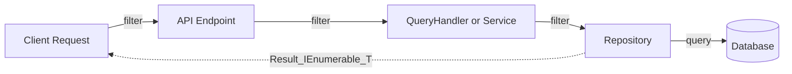
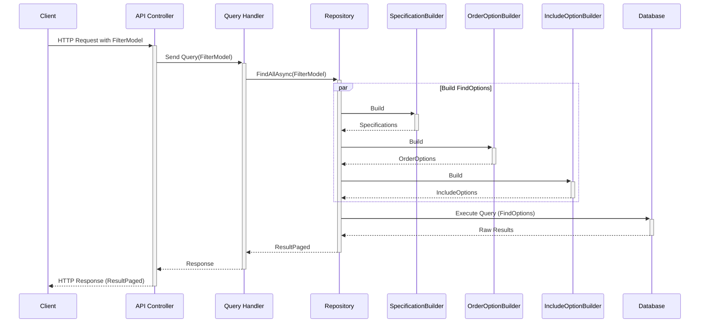
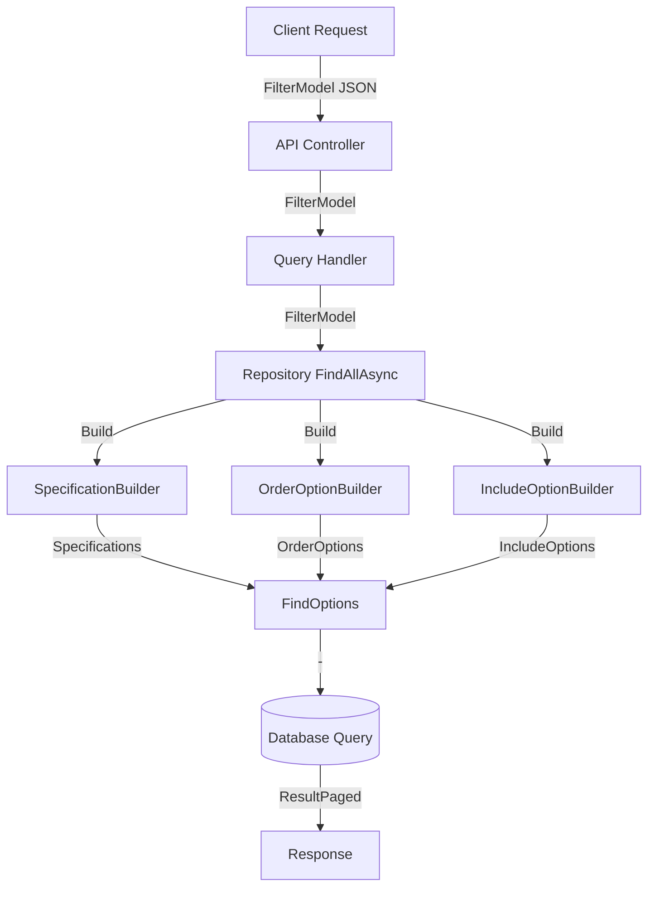

# Filtering Feature Documentation

> Simplify complex entity queries with a unified filtering solution.

[TOC]

## Overview

The Filtering feature provides a flexible and powerful way to filter, sort, and paginate data through API requests. It allows clients to construct complex queries using a JSON-based filter model that gets translated into domain specifications and FindOptions on the server side. The translated filter model can easily be handled by the bITdevKit repositories.



### Challenges

> Modern applications require complex data querying capabilities where clients need to:

- Filter data based on multiple conditions
- Combine different filter types (equality, ranges, text search, etc.)
- Sort results by multiple fields
- Include related entities (eager loading)
- Paginate results for better performance
- Handle nested entity relationships
- Support dynamic query building

> Traditional REST APIs often struggle with these requirements, leading to:

- Multiple specialized endpoints for different query scenarios
- Complex URL parameters that are hard to maintain
- Limited query capabilities
- Poor reusability across different entity types

### Solution

> The Filtering feature solves these challenges by providing:

1. **Unified Query Interface**

- Single, consistent way to express complex queries
- Works across different entity types
- Supports both simple and complex filtering scenarios
- No need to create custom endpoints for each query scenario╬

2. **Type-Safe Implementation**

- Strongly-typed models for both client and server (Swagger)
- Compile-time validation of filter structures
- Clear contract between frontend and backend (FilterModel)

3. **Flexible Architecture**

- Extensible design for more custom filter types [TODO]
- Support for additional domain-specific specifications
- Easy integration with existing repositories (FindOptions)

4. **Performance Optimization**

- Built-in pagination support
- Efficient query building (Expressions)
- Optimized database access through specifications

### Use Cases

1. **Data Grids, Tables and Lists**

- Dynamic column filtering
- Multi-column sorting
- Server-side pagination

2. **Search Interfaces**

- Full-text search across multiple fields
- Combined filters (date ranges, categories, status)
- Related entity filtering

3. **Lookup lists**

- Dynamic data loading for select components
- Type-ahead/autocomplete requests

## Request Flow Diagram



The following sections detail the implementation and usage of the Filtering feature, providing
comprehensive examples and best practices for common scenarios.

## Filter Model Structure

```json
{
  "page": 1,
  "pageSize": 10,
  "filters": [
    {
      "field": "name",
      "operator": "eq|neq|isnull|isnotnull|isempty|isnotempty|gt|gte|lt|lte|contains|doesnotcontain|startswith|doesnotstartwith|endswith|doesnotendwith|any|all|none",
      "value": "any",
      "logic": "and|or",
      "customType": "none|fulltextsearch|daterange|daterelative|timerange|timerelative|numericrange|isnull|isnotnull|enumvalues|textin|textnotin|numericin|numericnotin|namedspecification|compositespecification",
      "customParameters": {
        "key": "value"
      },
      "specificationName": "name",
      "specificationArguments": [],
      "compositeSpecification": {
        "nodes": []
      }
    }
  ],
  "orderings": [
    {
      "field": "name",
      "direction": "asc|desc"
    }
  ],
  "includes": [
    "name"
  ]
}
```

## API Implementation

### ASP.NET Controller Example

```csharp
[ApiController][Route("api/[controller]")]
public class UsersController : ControllerBase
{
    [HttpGet]
    public async Task<ActionResult<ResultPaged<User>>> GetAll(
        [FromQueryFilter] FilterModel filter)
    {
        // or: var filter await this.HttpContext.FromQueryFilterAsync();
        var response = await mediator.Send(new UserFindAllQuery(filter)); // handler calls repository.FindAllResultPagedAsync(filter)

        return Ok(response); // should ideally return a ResultPaged<UserModel> (mapped)
    }

    [HttpPost("search")]
    public async Task<ActionResult<ResultPaged<User>>> Search(
        [FromBodyFilter] FilterModel filter)
    {
        // or: var filter await this.HttpContext.FromBodyFilterAsync();
        var response = await mediator.Send(new UserSearchQuery(filter)); // handler calls repository.FindAllResultPagedAsync(filter)

        return Ok(response); // should ideally return a ResultPaged<UserModel> (mapped)
    }
}
```

### ASP.NET Minimal API Example

```csharp
app.MapGet("/api/users/search", async Task<Results<Ok<ResultPaged<User>>, NotFound>>
  (HttpContext context, IMediator mediator, CancellationToken cancellationToken) =>
{
    var filter = await context.FromQueryFilterAsync();
    var response = await mediator.Send(
        new UserSearchQuery(filter), cancellationToken); // handler calls repository.FindAllResultPagedAsync(filter)

    return TypedResults.Ok(response); // should ideally return a ResultPaged<UserModel> (mapped)
}).WithFilterSchema(); // adds openapi schema for the filter model
```

```csharp
app.MapPost("/api/users/search", async Task<Results<Ok<ResultPaged<User>>, NotFound>>
  (HttpContext context, IMediator mediator, CancellationToken cancellationToken) =>
{
    var filter = await context.FromQueryFilterAsync();
    var response = await mediator.Send(
        new UserSearchQuery(filter), cancellationToken); // handler calls repository.FindAllResultPagedAsync(filter)

    return TypedResults.Ok(response); // should ideally return a ResultPaged<UserModel> (mapped)
}).WithFilterSchema(true); // adds openapi schema for the filter model
```

### Repository Usage (QueryHandler)

```csharp
public class UserQueryHandler : IRequestHandler<UserFindAllQuery, ResultPaged<User>>
{
    private readonly IGenericReadOnlyRepository<User> repository;

    public UserQueryHandler(IGenericReadOnlyRepository<User> repository)
    {
        this.repository = repository;
    }

    public async Task<ResultPaged<User>> Handle(
        UserFindAllQuery query,
        CancellationToken cancellationToken)
    {
        return await repository.FindAllResultAsync(
            query.Filter,
            cancellationToken: cancellationToken);
    }
}
```

## HTTP Request Examples

### GET Request

Simple filter as URL parameters:

```http
GET /api/core/cities?filter={"page":1,"pageSize":10,"filters":[{"field":"Name","operator":"eq","value":"Berlin"}]} HTTP/1.1
Accept: application/json
```

URL-encoded for more complex filters:

[URL-encode](https://en.wikipedia.org/wiki/Percent-encoding) the filter JSON and put it into a
single query string parameter named `filter`.:

```json
{
  "page": 1,
  "pageSize": 10,
  "filters": [
    {
      "field": "name",
      "operator": "eq",
      "value": "John"
    }
  ]
} // encoded to %7B%22page%22%3A1%2C%22pageSize%2....
```

```http
GET /api/users?filter=api/users?filter=%7B%22page%22%3A1%2C%22pageSize%22%3A10%2C%22filters%22%3A%5B%7B%22field%22%3A%22name%22%2C%22operator%22%3A%22eq%22%2C%22value%22%3A%22John%22%7D%5D%7D HTTP/1.1
Accept: application/json
```

The following considerations apply to HTTP GET requests:

- HTTP GET requests should be URL-encoded to prevent issues with special characters.
- HTTP GET requests size limits may apply, consider using POST for large filter models.
- HTTP GET requests parameters are visible in logs and browser history.
- HTTP GET requests should be kept short and readable for maintainability.

### POST Request

```http
POST /api/users/search HTTP/1.1
Host: api.example.com
Content-Type: application/json
Accept: application/json

{
    "page": 1,
    "pageSize": 20,
    "filters": [
        {
            "customType": "daterange",
            "customParameters": {
                "field": "createdAt",
                "startDate": "2024-01-01T00:00:00Z",
                "endDate": "2024-12-31T23:59:59Z",
                "inclusive": true
            }
        },
        {
            "field": "department.name",
            "operator": "eq",
            "value": "Engineering",
            "logic": "and"
        }
    ],
    "orderings": [
        {
            "field": "lastName",
            "direction": "asc"
        }
    ],
    "includes": [
        "department",
        "assignments"
    ]
}
```

The following considerations apply to HTTP POST requests:

- HTTP POST requests can handle larger payloads than GET requests.
- HTTP POST requests are more secure for sensitive data.
- HTTP POST requests can be used for complex filter models.
- HTTP POST requests are not cached by browsers.

## HTTP Response Format

### Successful Response

```json
{
  "success": true,
  "messages": [
    "Data retrieved successfully"
  ],
  "errors": [],
  "value": [
    {
      "id": 1,
      "firstName": "John",
      "lastName": "Doe",
      "email": "john.doe@example.com",
      "department": {
        "id": 1,
        "name": "Engineering"
      }
    }
  ],
  "currentPage": 1,
  "totalPages": 5,
  "totalCount": 100,
  "pageSize": 20,
  "hasPreviousPage": false,
  "hasNextPage": true
}
```

### Error Response

```json
{
  "success": false,
  "messages": [
    "Failed to retrieve data"
  ],
  "errors": [
    {
      "code": "INVALID_FILTER",
      "message": "Invalid filter parameters provided"
    }
  ],
  "value": null,
  "currentPage": 0,
  "totalPages": 0,
  "totalCount": 0,
  "pageSize": 0,
  "hasPreviousPage": false,
  "hasNextPage": false
}
```

### Response Properties

#### Base Result Properties

- `success`: Indicates if the request was successful
- `messages`: Array of informational or error messages
- `errors`: Array of structured error objects when success is false
- `value`: Collection of items for the current page

#### Pagination Metadata

- `currentPage`: Current page number (1-based)
- `totalPages`: Total number of pages available
- `totalCount`: Total number of items across all pages
- `pageSize`: Number of items per page
- `hasPreviousPage`: Indicates if a previous page exists
- `hasNextPage`: Indicates if a next page exists

## Best Practices

1. **Request Method Selection**

- Use GET for simple queries and basic filtering
- Use POST for complex filters or when URL length might be an issue
- Consider using POST when sending sensitive filter data

2. **Performance Considerations**

- Keep page sizes reasonable (recommended: 10-50 items)
- Use includes selectively to prevent excessive data loading
- Consider adding indexes for commonly filtered fields

3. **Error Handling**

- Always check the `success` property in responses
- Handle error messages appropriately in your client application
- Log error details for debugging purposes

4. **Security**

- Validate all filter inputs server-side
- Implement appropriate rate limiting
- Consider adding pagination limits to prevent DOS attacks

# Standard Filter Operators

## Comparison Operators

### Equal (eq)

Matches exact values

```json
{
  "field": "status",
  "operator": "eq",
  "value": "active"
}
```

### Not Equal (neq)

Matches values that are not equal

```json
{
  "field": "status",
  "operator": "neq",
  "value": "deleted"
}
```

### Greater Than (gt)

```json
{
  "field": "age",
  "operator": "gt",
  "value": 18
}
```

### Greater Than or Equal (gte)

```json
{
  "field": "price",
  "operator": "gte",
  "value": 100.00
}
```

### Less Than (lt)

```json
{
  "field": "stock",
  "operator": "lt",
  "value": 10
}
```

### Less Than or Equal (lte)

```json
{
  "field": "temperature",
  "operator": "lte",
  "value": 25.5
}
```

## String Operators

### Contains

```json
{
  "field": "description",
  "operator": "contains",
  "value": "premium"
}
```

### Does Not Contain

```json
{
  "field": "title",
  "operator": "doesnotcontain",
  "value": "test"
}
```

### Starts With

```json
{
  "field": "email",
  "operator": "startswith",
  "value": "admin"
}
```

### Does Not Start With

```json
{
  "field": "code",
  "operator": "doesnotstartwith",
  "value": "TMP"
}
```

### Ends With

```json
{
  "field": "filename",
  "operator": "endswith",
  "value": ".pdf"
}
```

### Does Not End With

```json
{
  "field": "url",
  "operator": "doesnotendwith",
  "value": "/temp"
}
```

## Null Checks

### Is Null

```json
{
  "field": "deletedAt",
  "operator": "isnull"
}
```

### Is Not Null

```json
{
  "field": "email",
  "operator": "isnotnull"
}
```

## Empty Checks

### Is Empty

```json
{
  "field": "notes",
  "operator": "isempty"
}
```

### Is Not Empty

```json
{
  "field": "phoneNumber",
  "operator": "isnotempty"
}
```

## Collection Operators

### Any

Matches if any child element satisfies the condition

```json
{
  "field": "orders",
  "operator": "any",
  "value": {
    "field": "total",
    "operator": "gt",
    "value": 1000
  }
}
```

### All

Matches if all child elements satisfy the condition

```json
{
  "field": "orderItems",
  "operator": "all",
  "value": {
    "field": "quantity",
    "operator": "gt",
    "value": 0
  }
}
```

### None

Matches if no child elements satisfy the condition

```json
{
  "field": "reviews",
  "operator": "none",
  "value": {
    "field": "rating",
    "operator": "lt",
    "value": 3
  }
}
```

# Custom Filter Types

> Custom filter types provide more specialized filtering capabilities. They are used by setting the
`customType` property instead of using the standard `operator`.

## Date and Time Filters

### Date Range

Filter entries within a specific date range

```json
{
  "customType": "daterange",
  "customParameters": {
    "field": "createdAt",
    "startDate": "2024-01-01T00:00:00Z",
    "endDate": "2024-12-31T23:59:59Z",
    "inclusive": true
  }
}
```

### Date Relative

Filter based on relative date periods

```json
{
  "customType": "daterelative",
  "customParameters": {
    "field": "lastLogin",
    "unit": "day",
    "amount": 7,
    "direction": "past"
  }
}
```

### Time Range

Filter entries within a specific time range

```json
{
  "customType": "timerange",
  "customParameters": {
    "field": "shiftStart",
    "startTime": "09:00:00",
    "endTime": "17:00:00",
    "inclusive": true
  }
}
```

### Time Relative

Filter based on relative time periods

```json
{
  "customType": "timerelative",
  "customParameters": {
    "field": "lastActivity",
    "unit": "hour",
    "amount": 2,
    "direction": "past"
  }
}
```

## Text Search Filters

### Full Text Search

Search across multiple fields

```json
{
  "customType": "fulltextsearch",
  "customParameters": {
    "searchTerm": "important document",
    "fields": [
      "title",
      "description",
      "content"
    ]
  }
}
```

### Text In

Match against a list of possible values

```json
{
  "customType": "textin",
  "customParameters": {
    "field": "status",
    "values": "active;pending;review"
  }
}
```

### Text Not In

Exclude matches from a list of values

```json
{
  "customType": "textnotin",
  "customParameters": {
    "field": "category",
    "values": "archived;deleted;draft"
  }
}
```

## Numeric Filters

### Numeric Range

Filter numbers within a range

```json
{
  "customType": "numericrange",
  "customParameters": {
    "field": "price",
    "min": 10.00,
    "max": 50.00,
    "inclusive": true
  }
}
```

### Numeric In

Match against a list of numeric values

```json
{
  "customType": "numericin",
  "customParameters": {
    "field": "priority",
    "values": "1;2;3"
  }
}
```

### Numeric Not In

Exclude specific numeric values

```json
{
  "customType": "numericnotin",
  "customParameters": {
    "field": "errorCode",
    "values": "404;500;503"
  }
}
```

## Enum Filters

### Enum Values

Filter by enum values using names or integers

```json
{
  "customType": "enumvalues",
  "customParameters": {
    "field": "status",
    "values": "Active;Pending"
  }
}
```

## Null Check Filters

### Is Null

Explicit null check filter

```json
{
  "customType": "isnull",
  "customParameters": {
    "field": "canceledAt"
  }
}
```

### Is Not Null

Explicit non-null check filter

```json
{
  "customType": "isnotnull",
  "customParameters": {
    "field": "completedAt"
  }
}
```

## Specification Filters

### Named Specification

Use pre-registered domain specifications

```json
{
  "customType": "namedspecification",
  "specificationName": "IsActive",
  "specificationArguments": []
}
```

### Composite Specification

Combine multiple specifications with logical operators

```json
{
  "customType": "compositespecification",
  "compositeSpecification": {
    "nodes": [
      {
        "name": "IsActive",
        "arguments": []
      },
      {
        "logic": "and",
        "nodes": [
          {
            "name": "HasValidLicense",
            "arguments": []
          },
          {
            "name": "IsInRegion",
            "arguments": [
              "EU"
            ]
          }
        ]
      }
    ]
  }
}
```

# Complex Filter Examples

## Overview

> Complex filters allow you to create sophisticated queries by combining different filter types,
> using nested conditions, and applying custom filter types. They are particularly useful when
> simple
> equality or comparison filters aren't sufficient.

## Use Cases and Examples

### 1. Date Range with Status Filter

Useful for finding records within a specific date range that match certain status criteria.

```json
{
  "page": 1,
  "pageSize": 20,
  "filters": [
    {
      "customType": "daterange",
      "customParameters": {
        "field": "createdAt",
        "startDate": "2024-01-01T00:00:00Z",
        "endDate": "2024-12-31T23:59:59Z",
        "inclusive": true
      }
    },
    {
      "field": "status",
      "operator": "eq",
      "value": "active",
      "logic": "and"
    }
  ]
}
```

**Use Case:** Finding all active users who registered during 2024.

### 2. Full-Text Search with Multiple Fields

Perfect for implementing search functionality across multiple text fields.

```json
{
  "filters": [
    {
      "customType": "fulltextsearch",
      "customParameters": {
        "searchTerm": "project management",
        "fields": [
          "title",
          "description",
          "skills",
          "notes"
        ]
      }
    }
  ]
}
```

**Use Case:** Searching for employees with specific skills or experience across their profile data.

### 3. Nested Entity Filtering

Useful when you need to filter based on related entity properties.

```json
{
  "filters": [
    {
      "field": "department.name",
      "operator": "eq",
      "value": "Engineering",
      "logic": "and"
    },
    {
      "field": "projects",
      "operator": "any",
      "value": {
        "field": "status",
        "operator": "eq",
        "value": "Active"
      }
    }
  ],
  "includes": [
    "department",
    "projects"
  ]
}
```

**Use Case:** Finding engineers who are assigned to active projects.

### 4. Multiple Date-Related Conditions

Combines multiple date-based filters for temporal analysis.

```json
{
  "filters": [
    {
      "customType": "daterange",
      "customParameters": {
        "field": "hireDate",
        "startDate": "2023-01-01T00:00:00Z",
        "endDate": "2023-12-31T23:59:59Z",
        "inclusive": true
      }
    },
    {
      "customType": "daterelative",
      "customParameters": {
        "field": "lastActivity",
        "unit": "day",
        "amount": 30,
        "direction": "past"
      },
      "logic": "and"
    }
  ]
}
```

**Use Case:** Finding employees hired in 2023 who have been active in the last 30 days.

### 5. Complex Numeric Conditions

Useful for financial or metric-based filtering.

```json
{
  "filters": [
    {
      "customType": "numericrange",
      "customParameters": {
        "field": "salary",
        "min": 50000,
        "max": 100000
      }
    },
    {
      "field": "performance.rating",
      "operator": "gte",
      "value": 4,
      "logic": "and"
    },
    {
      "field": "projects",
      "operator": "any",
      "value": {
        "field": "budget",
        "operator": "gt",
        "value": 100000
      },
      "logic": "and"
    }
  ]
}
```

**Use Case:** Finding high-performing employees within a specific salary range working on
high-budget projects.

### 6. Time-Based Working Hours Filter

Useful for scheduling and availability queries.

```json
{
  "filters": [
    {
      "customType": "timerange",
      "customParameters": {
        "field": "workingHours.start",
        "startTime": "09:00:00",
        "endTime": "17:00:00",
        "inclusive": true
      }
    },
    {
      "field": "timezone",
      "operator": "eq",
      "value": "UTC+1",
      "logic": "and"
    }
  ]
}
```

**Use Case:** Finding employees working during specific hours in a particular timezone.

### 7. Enum and Collection Filtering

Combines enum values with collection checks.

```json
{
  "filters": [
    {
      "customType": "enumvalues",
      "customParameters": {
        "field": "employmentType",
        "values": "FullTime;PartTime"
      }
    },
    {
      "field": "skills",
      "operator": "all",
      "value": {
        "customType": "enumvalues",
        "customParameters": {
          "field": "level",
          "values": "Expert;Advanced"
        }
      },
      "logic": "and"
    }
  ]
}
```

**Use Case:** Finding full-time or part-time employees who are experts in all their listed skills.

### 8. Complex Text Pattern Matching

Useful for advanced text search scenarios.

```json
{
  "filters": [
    {
      "field": "email",
      "operator": "endswith",
      "value": "@company.com"
    },
    {
      "customType": "textin",
      "customParameters": {
        "field": "department",
        "values": "Engineering;Research;Development"
      },
      "logic": "and"
    },
    {
      "field": "notes",
      "operator": "contains",
      "value": "leadership",
      "logic": "and"
    }
  ]
}
```

**Use Case:** Finding internal employees from specific departments with leadership mentions in their
notes.

## Advanced Combinations

### Combined Project and Team Filter

```json
{
  "filters": [
    {
      "field": "teams",
      "operator": "any",
      "value": {
        "field": "members",
        "operator": "all",
        "value": {
          "field": "skills",
          "operator": "any",
          "value": {
            "field": "level",
            "operator": "gte",
            "value": 3
          }
        }
      }
    },
    {
      "customType": "daterange",
      "customParameters": {
        "field": "projects.deadline",
        "startDate": "2024-01-01T00:00:00Z",
        "endDate": "2024-12-31T23:59:59Z",
        "inclusive": true
      },
      "logic": "and"
    }
  ],
  "includes": [
    "teams",
    "teams.members",
    "teams.members.skills",
    "projects"
  ]
}
```

**Use Case:** Finding teams where all members have advanced skills (level ≥ 3) and are working on
projects due in 2024.

# Appendix A: Angular Usage Guide

> This appendix provides detailed information about using the Filtering feature in an
> Angular application.

This implementation provides a complete Angular solution including:

- Type-safe interfaces
- Reusable service layer
- Component implementation with pagination
- Error handling
- HTTP parameter building

## Type Definitions

### Core Filter Model Interfaces

```typescript
// models/filter.model.ts
export interface FilterCriteria {
  field: string;
  operator: string;
  value?: any;
  logic?: 'and' | 'or';
  customType?: string;
  customParameters?: Record<string, any>;
}

export interface FilterModel {
  page: number;
  pageSize: number;
  filters: FilterCriteria[];
  orderings?: Array<{
    field: string;
    direction: 'asc' | 'desc';
  }>;
  includes?: string[];
}

export interface ResultPaged<T> {
  items: T[];
  totalCount: number;
  pageNumber: number;
  pageSize: number;
  totalPages: number;
}
```

## Service Implementation

### API Service

```typescript
// services/api.service.ts
import {Injectable} from '@angular/core';
import {HttpClient, HttpParams} from '@angular/common/http';
import {Observable} from 'rxjs';
import {environment} from '../environments/environment';
import {FilterModel, ResultPaged} from '../models';

@Injectable({
  providedIn: 'root'
})
export class ApiService<T> {
  constructor(
    private http: HttpClient,
    private baseUrl: string
  ) {
  }

  // POST (body)
  searchFiltered(filterModel: FilterModel): Observable<ResultPaged<T>> {
    return this.http.post<ResultPaged<T>>(`${this.baseUrl}/search`, filterModel);
  }

  // GET (querystring)
  getFiltered(filterModel: FilterModel): Observable<ResultPaged<T>> {
    let params = new HttpParams()
      .set('page', filterModel.page.toString())
      .set('pageSize', filterModel.pageSize.toString());

    filterModel.filters.forEach((filter, index) => {
      params = params
        .set(`filters[${index}].field`, filter.field)
        .set(`filters[${index}].operator`, filter.operator);

      if (filter.value !== undefined) {
        params = params.set(`filters[${index}].value`, filter.value.toString());
      }

      if (filter.logic) {
        params = params.set(`filters[${index}].logic`, filter.logic);
      }

      if (filter.customType) {
        params = params.set(`filters[${index}].customType`, filter.customType);
        if (filter.customParameters) {
          Object.entries(filter.customParameters).forEach(([key, value]) => {
            params = params.set(
              `filters[${index}].customParameters.${key}`,
              value.toString()
            );
          });
        }
      }
    });

    filterModel.orderings?.forEach((order, index) => {
      params = params
        .set(`orderings[${index}].field`, order.field)
        .set(`orderings[${index}].direction`, order.direction);
    });

    filterModel.includes?.forEach((include, index) => {
      params = params.set(`includes[${index}]`, include);
    });

    return this.http.get<ResultPaged<T>>(this.baseUrl, {params});
  }
}
```

### Entity-Specific Service

```typescript
// services/user.service.ts
import {Injectable} from '@angular/core';
import {HttpClient} from '@angular/common/http';
import {environment} from '../environments/environment';
import {User} from '../models';
import {ApiService} from './api.service';

@Injectable({
  providedIn: 'root'
})
export class UserService extends ApiService<User> {
  constructor(http: HttpClient) {
    super(http, `${environment.apiBaseUrl}/api/users`);
  }
}
```

## Component Implementation

### List Component Example

```typescript
// components/user-list/user-list.component.ts
import {Component, OnInit} from '@angular/core';
import {UserService} from '../../services/user.service';
import {User, FilterModel, ResultPaged} from '../../models';
import {finalize} from 'rxjs/operators';

@Component({
  selector: 'app-user-list',
  template: `
        <div class="filters">
            <button (click)="applyDepartmentFilter('Engineering')">
                Engineering Only
            </button>
            <button (click)="applyDateRangeFilter()">
                Last 30 Days
            </button>
        </div>

        <div *ngIf="loading">Loading...</div>

        <div *ngIf="error" class="error">
            {{ error }}
        </div>

        <table *ngIf="users">
            <thead>
                <tr>
                    <th>Name</th>
                    <th>Email</th>
                    <th>Department</th>
                </tr>
            </thead>
            <tbody>
                <tr *ngFor="let user of users.items">
                    <td>{{ user.firstName }} {{ user.lastName }}</td>
                    <td>{{ user.email }}</td>
                    <td>{{ user.department }}</td>
                </tr>
            </tbody>
        </table>

        <div class="pagination" *ngIf="users">
            <button (click)="previousPage()" [disabled]="users.pageNumber === 1">
                Previous
            </button>
            <span>Page {{ users.pageNumber }} of {{ users.totalPages }}</span>
            <button (click)="nextPage()" [disabled]="users.pageNumber === users.totalPages">
                Next
            </button>
        </div>
    `
})
export class UserListComponent implements OnInit {
  users: ResultPaged<User> | null = null;
  loading = false;
  error: string | null = null;

  private currentFilter: FilterModel = {
    page: 1,
    pageSize: 10,
    filters: []
  };

  constructor(private userService: UserService) {
  }

  ngOnInit() {
    this.loadUsers();
  }

  loadUsers() {
    this.loading = true;
    this.error = null;

    this.userService.getFiltered|searchFiltered(this.currentFilter)
      .pipe(
        finalize(() => this.loading = false)
      )
      .subscribe({
        next: (result) => {
          this.users = result;
        },
        error: (error) => {
          this.error = 'Failed to load users. Please try again.';
          console.error('Error loading users:', error);
        }
      });
  }

  applyDepartmentFilter(department: string) {
    this.currentFilter = {
      ...this.currentFilter,
      filters: [
        {
          field: 'department',
          operator: 'eq',
          value: department
        }
      ]
    };
    this.loadUsers();
  }

  applyDateRangeFilter() {
    const endDate = new Date();
    const startDate = new Date();
    startDate.setDate(startDate.getDate() - 30);

    this.currentFilter = {
      ...this.currentFilter,
      filters: [
        {
          customType: 'daterange',
          customParameters: {
            field: 'createdAt',
            startDate: startDate.toISOString(),
            endDate: endDate.toISOString(),
            inclusive: true
          }
        }
      ]
    };
    this.loadUsers();
  }

  nextPage() {
    if (this.users && this.currentFilter.page < this.users.totalPages) {
      this.currentFilter.page++;
      this.loadUsers();
    }
  }

  previousPage() {
    if (this.currentFilter.page > 1) {
      this.currentFilter.page--;
      this.loadUsers();
    }
  }
}
```

# Appendix B: Flow Diagram



# Appendix C: Filter Model Builder

> Build a Filter Model using Fluent C# syntax.

Can be used in a Blazor or server side environment to construct complex filters.

```csharp
var filterModel = FilterModelBuilder.For<PersonStub>()
      .SetPaging(2, PageSize.Large) // Fluent paging setup
      .AddFilter(p => p.Age, FilterOperator.GreaterThan, 25) // Age > 25
      .AddFilter(p => p.FirstName, FilterOperator.Contains, "A") // FirstName contains "A"
      .AddFilter(p => p.Locations,
          FilterOperator.Any, b => b
              .AddFilter(loc => loc.City, FilterOperator.Equal, "Berlin")
              .AddFilter(loc => loc.PostalCode, FilterOperator.StartsWith, "100")) // Any location with City = New York or ZipCode starts with "100"
      .AddCustomFilter(FilterCustomType.FullTextSearch)
      .AddParameter("searchTerm", "John")
      .AddParameter("fields", new[] { "FirstName", "LastName" }).Done()
      .AddOrdering(p => p.LastName, OrderDirection.Descending) // Order by LastName Descending
      .AddOrdering(p => p.FirstName, OrderDirection.Ascending) // Then order by FirstName Ascending
      .AddInclude(p => p.Locations)
      .Build();

filterModel.Page.ShouldBe(2);
filterModel.PageSize.ShouldBe((int)PageSize.Large);
// etc.
```

# Appendix D: Disclaimer

> This Filtering feature described here is designed to provide a pragmatic, flexible filtering
> solution for REST APIs and Repositories.

It is not intended to replace or compete with comprehensive query technologies like:

- **GraphQL**: A complete query language that provides a type system and allows clients to specify
  exactly what data they need
- **OData**: A standardized protocol for building and consuming RESTful APIs with rich query
  capabilities

## When to Use the Filtering Feature

- When already using the bITdevKit ecosystem, providing seamless integration with its repository
  and specification patterns
- For REST APIs needing structured filtering
- When requiring a balance between flexibility and simplicity
- Need for a typed, maintainable filtering solution without the overhead of implementing larger
  query frameworks

If the application requires complex schema definitions, introspection, or full query language
capabilities, consider using GraphQL or OData instead. The Filtering feature focuses on providing a
straightforward, typed approach to common filtering scenarios while maintaining REST principles and
leveraging DevbITdevKitKit features.

Remember: Choose the simplest tool that meets your requirements. The feature provides a
lightweight, code-based approach to handle filtering, while staying consistent with
the bITdevKit philosophy of simple, effective solutions to common development problems.