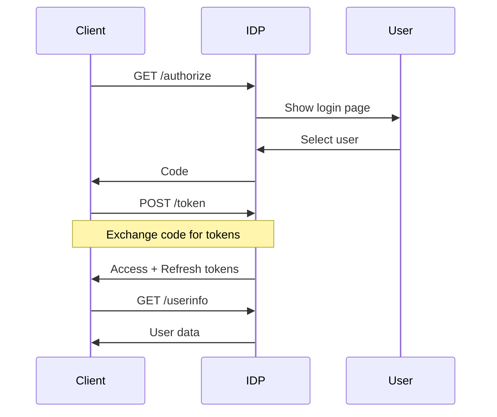
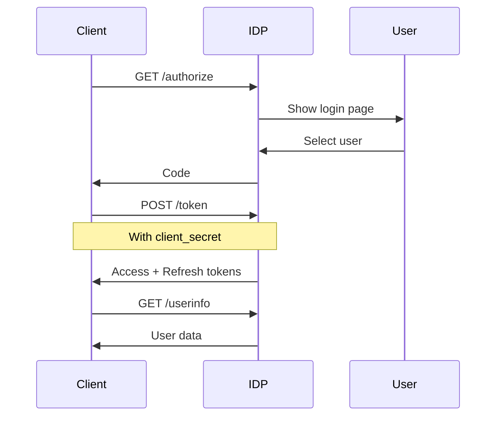
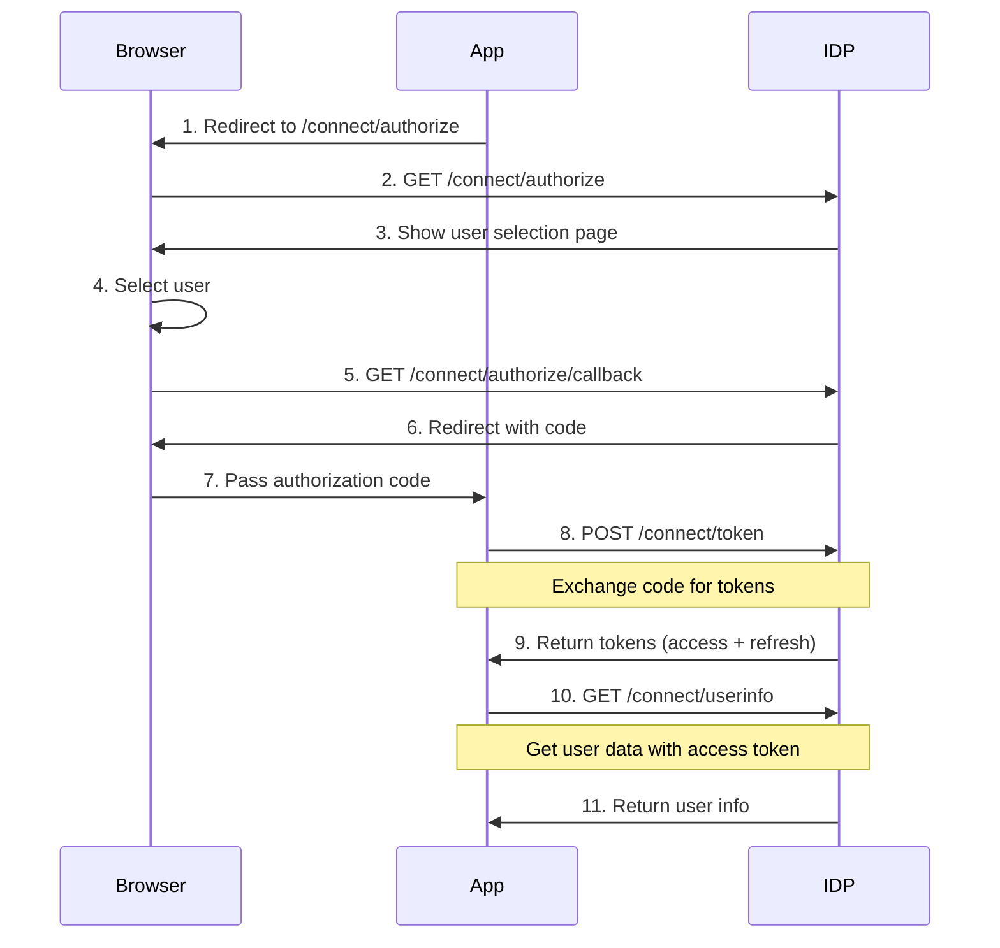

# Fake Identity Provider Feature Documentation

> A lightweight OAuth2/OpenID Connect identity provider supporting multiple grant types and hardcoded users, designed for development and testing scenarios.

[TOC]

## Features
- OAuth2 and OpenID Connect support
- Public and confidential client support
- Multiple grant types (authorization code, password, client credentials, refresh token)
- JWT token generation
- Debug endpoints for development
- No database required
- Built-in user selection interface
- CORS support
- Client redirect URI validation
- Support for SPA, server, and API tool clients

## Setup

### 1. Install Package
```xml
<PackageReference Include="BridgingIT.DevKit.Presentation.Web" Version="x.y.z" />
```

builder.Services.AddFakeIdentityProvider(options => {
   options.Enabled(builder.Environment.IsDevelopment())
          .WithIssuer("https://localhost:5001")
          .WithUsers(Fakes.Users)
          .WithTokenLifetimes(
              accessToken: TimeSpan.FromMinutes(30),
              refreshToken: TimeSpan.FromDays(1))
          // Public Client (SPA)
          .WithClient(
              "spa-client",
              "Angular SPA",
              "http://localhost:4200/callback")
          // Blazor WASM (Public Client)
          .WithClient(
              "blazor-wasm",
              "Blazor WASM Frontend", 
              "https://localhost:5001/authentication/login-callback",
              "https://localhost:5001/authentication/logout-callback")
          // Confidential Client (Server)
          .WithConfidentalClient(
              "mvc-app",
              "MVC Server",
              "mvc-secret",
              ["https://localhost:5002/signin-oidc"])
          // Blazor Server (Confidential Client)
          .WithConfidentalClient(
              "blazor-server",
              "Blazor Server Frontend",
              "server-secret", 
              ["https://localhost:5003/signin-oidc"])
          // WebAPI Backend
          .WithConfidentalClient(
              "api-backend",
              "API Backend",
              "api-secret",
              ["https://localhost:5001"])
          // API Tools
          .WithClient(
              "swagger",
              "Swagger UI",
              "https://localhost:5001/swagger/oauth2-redirect.html");
});

### 3. Define Users
```csharp
public static class Fakes 
{
    public static readonly FakeUser[] Users = [
        new("luke.skywalker@starwars.com", "Luke Skywalker", 
            [Role.Administrators, Role.Users], isDefault: true),
        new("yoda@starwars.com", "Yoda", 
            [Role.Administrators])
        // ...... Add more users
    ];
}
```

## Token Types

### Access Token
JSON Web Token (JWT) containing:
- User identity (sub, email)
- User info (name, roles)
- Token metadata (iss, aud, exp)
- Scope permissions

### ID Token
OpenID Connect token with:
- Required claims (iss, sub, aud, exp)
- Profile data (name, email)
- Role information

### Refresh Token
Long-lived token for obtaining new access tokens.

## Authentication Flows

### Public Client Flow (SPA, Mobile)


Key points:
- No client secret
- State parameter required
- Access token in Authorization header
- Refresh token for token renewal

### Confidential Client Flow (Server Apps)


Key points:
- Client secret required
- Secure token storage
- Server-side token management
- Valid redirect URIs enforced

## Client Integration Examples

### 1. Angular (Public Client)
```typescript
import { AuthConfig } from 'angular-oauth2-oidc';

export const authConfig: AuthConfig = {
  issuer: 'http://localhost:5000',
  redirectUri: window.location.origin + '/callback',
  clientId: 'spa-client',
  scope: 'openid profile email roles'
};
```

### 2. ASP.NET Core MVC (Confidential Client)
```csharp
builder.Services.AddAuthentication(options => {
    options.DefaultScheme = CookieAuthenticationDefaults.AuthenticationScheme;
    options.DefaultChallengeScheme = OpenIdConnectDefaults.AuthenticationScheme;
})
.AddCookie()
.AddOpenIdConnect(options => {
    options.Authority = "http://localhost:5000";
    options.ClientId = "mvc-app";
    options.ClientSecret = "mvc-secret";
    options.ResponseType = "code";
    options.SaveTokens = true;
});
```

### 3. Blazor WebAssembly
```csharp
// Client Program.cs
builder.Services.AddOidcAuthentication(options =>
{
    options.ProviderOptions.Authority = "https://localhost:5001";
    options.ProviderOptions.ClientId = "blazor-wasm";
    options.ProviderOptions.DefaultScopes.Add("roles");
    options.ProviderOptions.ResponseType = "code";
    options.ProviderOptions.PostLogoutRedirectUri = "authentication/logout-callback";
    options.ProviderOptions.RedirectUri = "authentication/login-callback";
});

// Client App.razor
<CascadingAuthenticationState>
    <Router AppAssembly="@typeof(App).Assembly">
        <Found Context="routeData">
            <AuthorizeRouteView RouteData="@routeData" DefaultLayout="@typeof(MainLayout)">
                <NotAuthorized>
                    <RedirectToLogin />
                </NotAuthorized>
            </AuthorizeRouteView>
        </Found>
    </Router>
</CascadingAuthenticationState>
```

### 4. WebAPI Backend
```csharp
// Program.cs
builder.Services.AddAuthentication(JwtBearerDefaults.AuthenticationScheme)
    .AddJwtBearer(options =>
    {
        options.Authority = "https://localhost:5001";
        options.TokenValidationParameters = new TokenValidationParameters
        {
            ValidateAudience = true,
            ValidAudience = "api",
            ValidateIssuer = true,
            ValidIssuer = "https://localhost:5001"
        };
    });

builder.Services.AddAuthorization(options =>
{
    options.AddPolicy("RequireAdminRole", policy =>
        policy.RequireRole("Administrators"));
});

// WeatherForecastController.cs
[ApiController]
[Route("[controller]")]
[Authorize]
public class WeatherForecastController : ControllerBase
{
    [HttpGet]
    public IEnumerable<WeatherForecast> Get()
    {
        var user = User.Identity.Name;
        // Implementation
    }

    [HttpPost]
    [Authorize(Policy = "RequireAdminRole")]
    public IActionResult Create(WeatherForecast forecast)
    {
        // Implementation
    }
}
```

## API Reference

### Authorization Endpoint
Start OAuth2 flow and user selection.

```http
GET /api/_system/identity/connect/authorize
```

Parameters:
- `response_type`: "code"
- `client_id`: Client identifier
- `redirect_uri`: Return URL
- `scope`: Requested permissions
- `state`: Security token

### Token Endpoint
Issue tokens using various grant types.

```http
POST /api/_system/identity/connect/token
Content-Type: application/x-www-form-urlencoded
```

Grant Types:
1. Authorization Code
```http
grant_type=authorization_code
&client_id=client_id
&code=auth_code
&redirect_uri=callback_url
```

2. Password Grant
```http
grant_type=password
&client_id=client_id
&username=user@example.com
&scope=openid profile
```

3. Client Credentials
```http
grant_type=client_credentials
&client_id=client_id
&scope=api
```

4. Refresh Token
```http
grant_type=refresh_token
&client_id=client_id
&refresh_token=token
```

Response:
```json
{
  "access_token": "eyJhbGci...",
  "expires_in": 1800,
  "refresh_token": "eyJhbGci...",
  "token_type": "Bearer",
  "scope": "openid profile",
  "id_token": "eyJhbGci..."
}
```

### UserInfo Endpoint
Get authenticated user data.

```http
GET /api/_system/identity/connect/userinfo
Authorization: Bearer token
```

Response:
```json
{
  "sub": "user_id",
  "name": "User Name",
  "email": "user@example.com",
  "roles": ["Admin", "User"]
}
```

### Debug Endpoint
Development information about configuration.

```http
GET /api/_system/identity/connect/debuginfo
```

Response:
```json
{
  "tokenIssuer": "https://localhost:5001",
  "configuredClients": [
    {
      "clientId": "spa-client",
      "name": "SPA App",
      "redirectUris": ["http://localhost:4200/callback"]
    }
  ],
  "configuredUsers": [
    {
      "email": "user@example.com",
      "name": "User Name",
      "roles": ["Admin"]
    }
  ]
}
```

### Well-Known Configuration
OpenID Connect discovery document.

```http
GET /api/_system/identity/.well-known/openid-configuration
```

Response:
```json
{
  "issuer": "https://localhost:5001",
  "authorization_endpoint": "https://localhost:5001/api/_system/identity/connect/authorize",
  "token_endpoint": "https://localhost:5001/api/_system/identity/connect/token",
  "userinfo_endpoint": "https://localhost:5001/api/_system/identity/connect/userinfo",
  "end_session_endpoint": "https://localhost:5001/api/_system/identity/connect/logout"
}
```

## Error Handling

Standard OAuth2 error responses:

```json
{
  "error": "invalid_request",
  "error_description": "Error details"
}
```

Common error codes:
- invalid_request
- invalid_client
- invalid_grant
- unauthorized_client
- unsupported_grant_type

## Security Considerations

### Development Use Only
- Designed for development and testing
- No production security measures
- Hardcoded users and clients
- No token encryption requirements

### Default Behaviors
- Client secrets not validated
- Access tokens never expire by default
- No real user authentication
- CORS enabled for all origins
- Debug endpoints exposed

## Development Tips

### Custom Client Setup
```csharp
// Multiple redirect URIs
.WithClient(
    "angular-app",
    "Angular Frontend",
    ["http://localhost:4200/callback", 
     "http://localhost:4200/silent-refresh"])

// API documentation tools
.WithClient(
    "swagger",
    "Swagger UI",
    "https://localhost:5001/swagger/oauth2-redirect.html")
```

### Testing Scenarios
- Multiple users
- Role-based access
- Token validation
- Authentication flows
- Client registrations

## Related Resources
- OAuth 2.0 RFC 
- OpenID Connect Specification
- JWT Documentation


# Bare-Bones Identity Provider Documentation

A lightweight OAuth2/OpenID Connect identity provider supporting multiple grant types and hardcoded users. Perfect for development and testing scenarios where a full-fledged identity provider would be overkill.

## Features
- OAuth2 and OpenID Connect support
- Multiple grant types (authorization code, password, client credentials, refresh token)
- Hardcoded user management
- JWT token generation
- No database required
- Minimal setup

## Setup

### 1. Install Package
```xml
<PackageReference Include="BridgingIT.DevKit.Presentation.Web" Version="1.0.0" />
```

### 2. Configure Services
In your `Program.cs`:
```csharp
builder.Services.AddFakeIdentityProvider(options =>
{
    options.Users = Fakes.Users;  // Your hardcoded users
    options.TokenIssuer = "http://localhost:5000";  // Your IDP base URL
    options.GroupPrefix = "/api/_system/identity";  // Base route for all endpoints
});
```

### 3. Define Users
```csharp
public static class Fakes
{
    public static readonly FakeUser[] Users =
    [
        new("luke.skywalker@starwars.com", "Luke Skywalker", 
            [Role.Administrators, Role.Users], isDefault: true),
        new("yoda@starwars.com", "Yoda", 
            [Role.Administrators])
    ];
}
```

## Client Integration Examples

### 1. Angular Application (Authorization Code Flow)

Configure your Angular application with OIDC client library:
```typescript
import { AuthConfig } from 'angular-oauth2-oidc';

export const authConfig: AuthConfig = {
  issuer: 'http://localhost:5000',
  redirectUri: window.location.origin + '/callback',
  clientId: 'any_client_id',
  scope: 'openid profile email roles',
  responseType: 'code'
};
```
#### Authorization Code Flow


### 2. Direct API Access (Password Grant)

```http
POST /api/_system/identity/connect/token
Content-Type: application/x-www-form-urlencoded

grant_type=password
&client_id=any_client_id
&username=luke.skywalker@starwars.com
&scope=openid profile email roles
```

### 3. Service-to-Service (Client Credentials)

```http
POST /api/_system/identity/connect/token
Content-Type: application/x-www-form-urlencoded

grant_type=client_credentials
&client_id=any_client_id
&scope=api
```

Note: This IDP implementation does not validate client_ids.
Any string can be used as client_id in the requests.

## API Reference

### Authorization Endpoint
Starts the OAuth2 authorization flow with user selection.

```http
GET /api/_system/identity/connect/authorize?
    response_type=code
    &client_id=any_client_id
    &redirect_uri=http://localhost:4200/callback
    &scope=openid profile email roles
    &state=abc123
```

### Token Endpoint
Issues tokens using various grant types.

#### Authorization Code Grant
```http
POST /api/_system/identity/connect/token
Content-Type: application/x-www-form-urlencoded

grant_type=authorization_code
&client_id=any_client_id
&code=xyz789
&redirect_uri=http://localhost:4200/callback
```

Sample Response:
```json
{
  "access_token": "eyJhbGci...",
  "expires_in": 1800,
  "refresh_expires_in": 1800,
  "refresh_token": "eyJhbGci...",
  "token_type": "Bearer",
  "scope": "openid email profile roles",
  "session_state": "5adfe176-2f18-4803-a0b3-21c678c49b5b"
}
```

### UserInfo Endpoint
Returns information about the authenticated user.

```http
GET /api/_system/identity/connect/userinfo
Authorization: Bearer eyJhbGci...
```

Response:
```json
{
  "sub": "749ecbc50c2364add0caa40f9afc2bbf",
  "name": "Luke Skywalker",
  "given_name": "Luke",
  "family_name": "Skywalker",
  "preferred_username": "luke.skywalker@starwars.com",
  "email": "luke.skywalker@starwars.com",
  "email_verified": true,
  "roles": ["Administrators", "Users"]
}
```

### OpenID Configuration
Returns the OpenID Connect discovery document.

```http
GET /api/_system/identity/.well-known/openid-configuration
```

Response:
```json
{
  "issuer": "http://localhost:5000",
  "authorization_endpoint": "http://localhost:5000/api/_system/identity/connect/authorize",
  "token_endpoint": "http://localhost:5000/api/_system/identity/connect/token",
  "userinfo_endpoint": "http://localhost:5000/api/_system/identity/connect/userinfo",
  "end_session_endpoint": "http://localhost:5000/api/_system/identity/connect/logout",
  "grant_types_supported": [
    "authorization_code",
    "password",
    "client_credentials",
    "refresh_token"
  ],
  "response_types_supported": ["code"],
  "scopes_supported": ["openid", "profile", "email", "roles"],
  "claims_supported": [
    "sub",
    "name",
    "family_name",
    "given_name",
    "preferred_username",
    "email",
    "email_verified"
  ]
}
```

### Logout Endpoint
Handles user logout with optional redirect.

```http
POST /api/_system/identity/connect/logout?
    post_logout_redirect_uri=http://localhost:4200
    &state=abc123
```

## Error Handling
All endpoints return OAuth2 compliant error responses:

```json
{
  "error": "invalid_request",
  "error_description": "The request is missing a required parameter"
}
```

Common error codes:
- invalid_request
- invalid_client
- invalid_grant
- unauthorized_client
- unsupported_grant_type
- invalid_scope

## Disclaimer

This Identity Provider is designed exclusively for development and testing environments, with intentionally simplified security measures that make it unsuitable for production use. It provides basic OAuth2 and OpenID Connect flows without rigorous security validation. User credentials are stored in plaintext, authentication is simplified, and token validation is minimal. Security features like rate limiting, audit logging, and proper session management are omitted for development convenience.

The provider includes development-friendly features like debug endpoints and permissive CORS policies that would pose security risks in production. Use this provider only in controlled development environments, ideally on localhost or protected development networks. Never expose it to public networks, use it with production data, or connect it to production services. For production deployments, always use a properly secured identity provider.

- This IDP is designed for development and testing
- Uses symmetric key signing (HS256)
- No real user authentication
- No real client secret validation