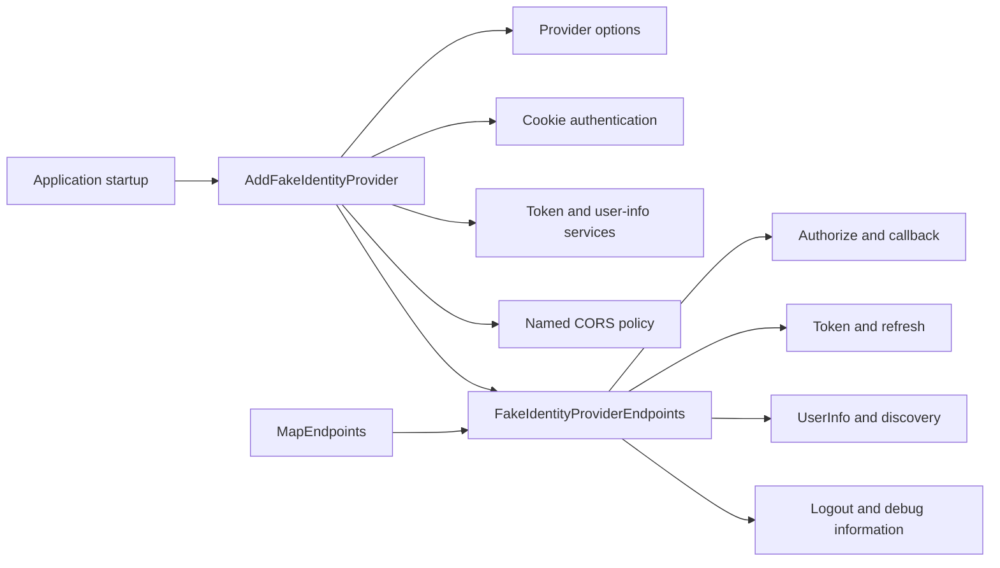
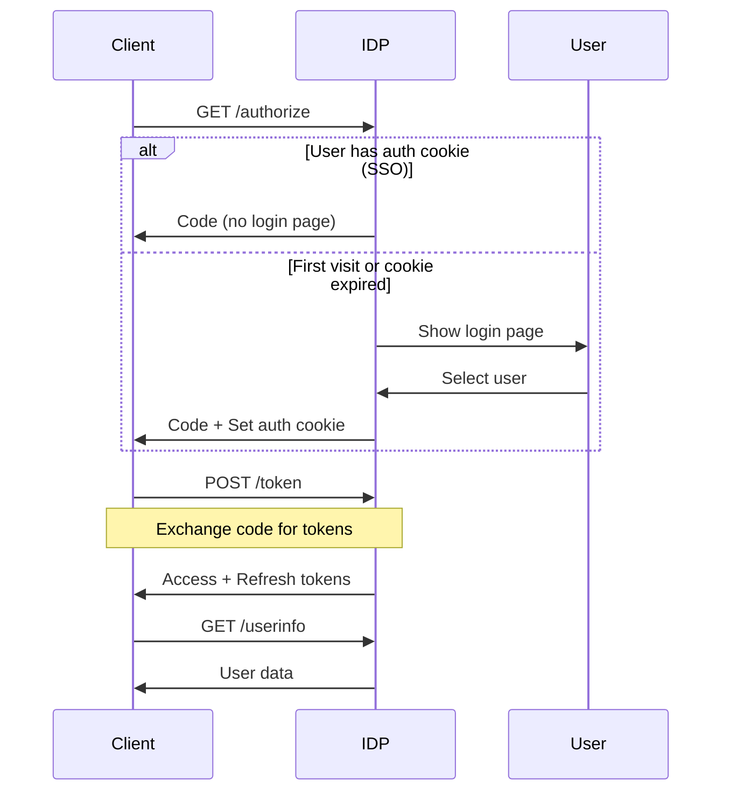
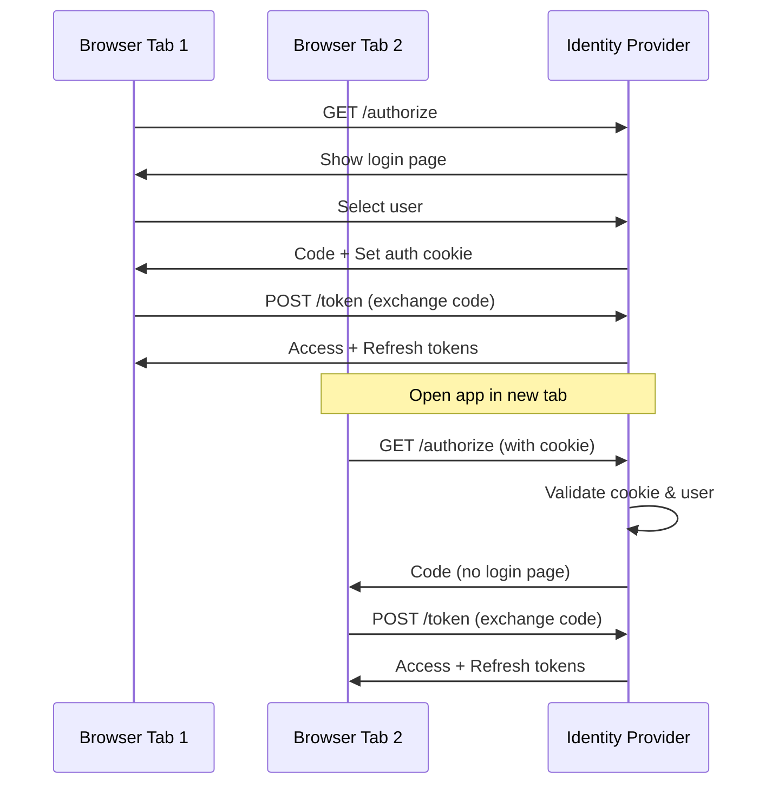
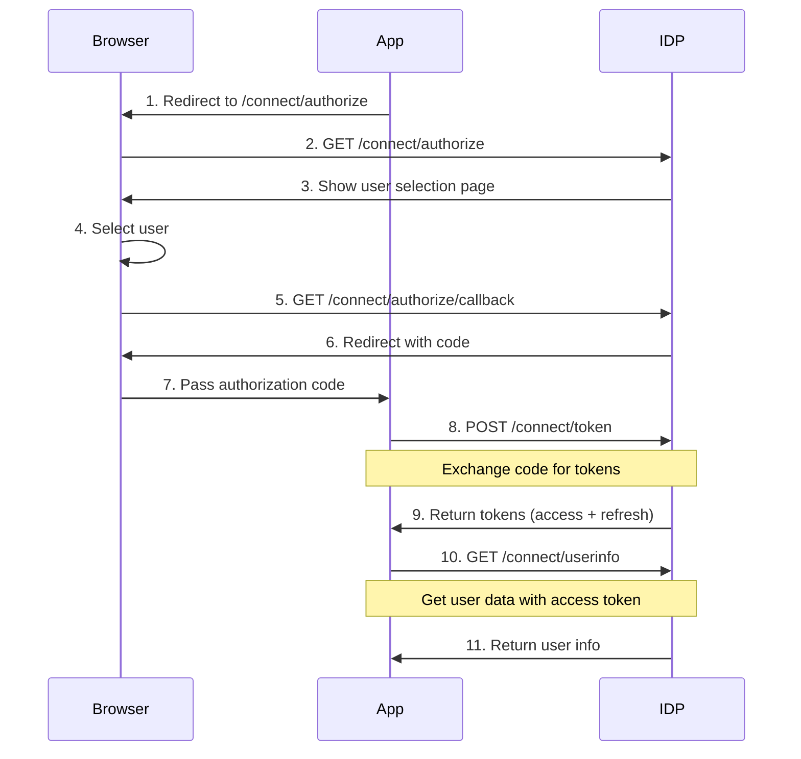

# Fake Identity Provider

> A lightweight OAuth 2.0 and OpenID Connect identity provider with configured users and clients for development and testing.

[TOC]

## Overview

The Fake Identity Provider supplies local OAuth 2.0 and OpenID Connect endpoints for development and automated tests. It uses configured in-memory users and clients, issues signed JWTs and provides a browser-based user selection page. It is not a production identity system.

## Challenges

Applications that use OAuth or OpenID Connect need realistic local flows, redirect validation and token claims. Connecting every developer machine and test run to an external identity service adds setup, network and test-data dependencies. A simplistic token stub does not exercise authorization-code redirects, refresh tokens, client credentials or user-info requests.

## Solution

`AddFakeIdentityProvider(...)` registers a development provider, its endpoint group, token services, cookie authentication and a named CORS policy. Fluent options configure users, public or confidential clients, issuer, endpoint paths, token lifetimes and token shape. `MapEndpoints()` exposes the configured endpoints with the other DevKit endpoint groups.

## Key Features

- OAuth 2.0 and OpenID Connect support
- Public and confidential client support
- Multiple grant types (authorization code, password, client credentials, refresh token)
- JWT token generation
- Debug endpoints for development
- No database required
- Built-in user selection interface
- CORS support
- Client redirect URI validation
- Support for SPA, server, and API tool clients
- Cookie-based single sign-on (SSO) across browser tabs

## Architecture


```mermaid
flowchart LR
    A[Application startup] --> B[AddFakeIdentityProvider]
    B --> C[Provider options]
    B --> D[Cookie authentication]
    B --> E[Token and user-info services]
    B --> F[Named CORS policy]
    B --> G[FakeIdentityProviderEndpoints]
    H[MapEndpoints] --> G
    G --> I[Authorize and callback]
    G --> J[Token and refresh]
    G --> K[UserInfo and discovery]
    G --> L[Logout and debug information]
```

`FakeIdentityProviderEndpoints` validates authorization requests and delegates token work to `IFakeIdentityProvider`, `ITokenService`, `IAuthorizationCodeService` and `IUserInfoService`. The default provider signs JWTs locally; optional token providers adjust the token shape for Entra ID v2, Keycloak or ADFS test scenarios.

## Use Cases

- Run authorization-code flows for SPAs, Blazor clients and server-rendered applications during local development.
- Test password, client-credentials and refresh-token requests without an external identity system.
- Exercise role and claim handling with deterministic fake users.
- Test registered redirect URIs and confidential-client secrets.
- Use browser-cookie SSO across local application tabs.
- Inspect discovery and debug endpoints while configuring a client.

## Basic Usage

Register the provider only for Development, configure at least one user and client, add the authentication middleware and map DevKit endpoints.

```csharp
using BridgingIT.DevKit.Common;
using BridgingIT.DevKit.Presentation.Web;

var builder = WebApplication.CreateBuilder(args);

builder.Services.AddAuthorization();
builder.Services.AddFakeIdentityProvider(options => options
    .Enabled(builder.Environment.IsDevelopment())
    .WithIssuer("https://localhost:5001")
    .WithUsers([
        new FakeUser(
            "luke.skywalker@starwars.com",
            "Luke Skywalker",
            ["Administrators", "Users"],
            password: "development-only",
            isDefault: true)
    ])
    .WithClient(
        "Local SPA",
        "spa-client",
        "https://localhost:5001/authentication/login-callback"));

var app = builder.Build();

app.UseHttpsRedirection();
app.UseCors();
app.UseAuthentication();
app.UseAuthorization();
app.MapEndpoints();

app.Run();
```

After the application starts, request the discovery document and check the HTTP result before reading it:

```csharp
using var client = new HttpClient();
using var response = await client.GetAsync(
    "https://localhost:5001/_bdk/api/identity/connect/.well-known/openid-configuration");

if (!response.IsSuccessStatusCode)
{
    Console.Error.WriteLine($"Identity discovery failed: {(int)response.StatusCode}");
    return;
}

Console.WriteLine(await response.Content.ReadAsStringAsync());
```

A successful response contains the configured issuer and URLs for the authorize, token, user-info and logout endpoints.

## Detailed setup

### Install the package

```xml
<PackageReference Include="BridgingIT.DevKit.Presentation.Web" Version="x.y.z" />
```

```csharp
builder.Services.AddFakeIdentityProvider(options =>
{
    options.Enabled(builder.Environment.IsDevelopment())
        .WithIssuer("https://localhost:5001")
        .WithUsers(Fakes.Users)
        .WithTokenLifetimes(
            accessToken: TimeSpan.FromMinutes(30),
            refreshToken: TimeSpan.FromDays(1))
        .EnableCookieSingleSignOn() // Optional; enabled by default
        .EnablePersistentRefreshTokens() // Required for cookie SSO; enabled by default
        // Public client (SPA)
        .WithClient(
            "Angular SPA",
            "spa-client",
            "http://localhost:4200/callback")
        // Blazor WebAssembly public client
        .WithClient(
            "Blazor WebAssembly frontend",
            "blazor-wasm",
            "https://localhost:5001/authentication/login-callback",
            "https://localhost:5001/authentication/logout-callback")
        // Confidential server client
        .WithConfidentalClient(
            "MVC server",
            "mvc-app",
            "mvc-secret",
            ["https://localhost:5002/signin-oidc"])
        .WithConfidentalClient(
            "Blazor Server frontend",
            "blazor-server",
            "server-secret",
            ["https://localhost:5003/signin-oidc"])
        // Web API backend
        .WithConfidentalClient(
            "API backend",
            "api-backend",
            "api-secret",
            ["https://localhost:5001"])
        // API documentation client
        .WithClient(
            "Swagger UI",
            "swagger",
            "https://localhost:5001/swagger/oauth2-redirect.html");
});
```

The `WithClient` and `WithConfidentalClient` methods take the display name first and the client ID second. `WithConfidentalClient` retains its current misspelling for API compatibility.

Complete the ASP.NET Core pipeline with `UseCors()`, `UseAuthentication()`, `UseAuthorization()` and `MapEndpoints()` as shown in [Basic Usage](#basic-usage).

### Define users

```csharp
public static class Fakes
{
    public static readonly FakeUser[] Users = [
        new("luke.skywalker@starwars.com", "Luke Skywalker",
            [Role.Administrators, Role.Users],
            password: "development-only",
            isDefault: true),
        new("yoda@starwars.com", "Yoda",
            [Role.Administrators])
        // ...... Add more users
    ];
}
```

## Token types

### Access token

JSON Web Token (JWT) containing:

- User identity (sub, email)
- User info (name, roles)
- Token metadata (iss, aud, exp)
- Scope permissions

### ID token

OpenID Connect token with:

- Required claims (iss, sub, aud, exp)
- Profile data (name, email)
- Role information

### Refresh token

Long-lived token for obtaining new access tokens.

## Authentication flows

### Public client flow (SPA or mobile)


```mermaid
sequenceDiagram
    participant Client
    participant IDP
    participant User

    Client->>IDP: GET /authorize
    alt User has auth cookie (SSO)
        IDP->>Client: Code (no login page)
    else First visit or cookie expired
        IDP->>User: Show login page
        User->>IDP: Select user
        IDP->>Client: Code + Set auth cookie
    end
    Client->>IDP: POST /token
    Note over Client,IDP: Exchange code for tokens
    IDP->>Client: Access + Refresh tokens
    Client->>IDP: GET /userinfo
    IDP->>Client: User data
```

Key points:

- Public clients do not send a client secret.
- Clients should send and verify `state` to correlate the authorization response.
- Send the access token in the `Authorization` header when calling user-info or protected APIs.
- Use the refresh token to obtain replacement tokens.

### Confidential client flow (server applications)


```mermaid
sequenceDiagram
    participant Client
    participant IDP
    participant User

    Client->>IDP: GET /authorize
    alt User has auth cookie (SSO)
        IDP->>Client: Code (no login page)
    else First visit or cookie expired
        IDP->>User: Show login page
        User->>IDP: Select user
        IDP->>Client: Code + Set auth cookie
    end
    Client->>IDP: POST /token
    Note over Client,IDP: With client_secret
    IDP->>Client: Access + Refresh tokens
    Client->>IDP: GET /userinfo
    IDP->>Client: User data
```

Key points:

- A configured confidential client must send its client secret when exchanging an authorization code or using client credentials.
- Keep tokens and the client secret on the server.
- The authorize and callback endpoints validate the redirect URI against the configured client.

## Cookie single sign-on

When enabled (default), the fake identity provider sets an HTTP-only authentication cookie during the first authorization code flow. On subsequent `/authorize` requests, the provider checks this cookie and immediately redirects with a new authorization code if the user is still authenticated, skipping the user selection page.

### How it works


```mermaid
sequenceDiagram
    participant Tab1 as Browser Tab 1
    participant Tab2 as Browser Tab 2
    participant IDP as Identity Provider

    Tab1->>IDP: GET /authorize
    IDP->>Tab1: Show login page
    Tab1->>IDP: Select user
    IDP->>Tab1: Code + Set auth cookie
    Tab1->>IDP: POST /token (exchange code)
    IDP->>Tab1: Access + Refresh tokens

    Note over Tab2,IDP: Open app in new tab
    Tab2->>IDP: GET /authorize (with cookie)
    IDP->>IDP: Validate cookie & user
    IDP->>Tab2: Code (no login page)
    Tab2->>IDP: POST /token (exchange code)
    IDP->>Tab2: Access + Refresh tokens
```

### Configuration

| Option | Default | Description |
| -------- | --------- | ------------- |
| `EnableCookieSingleSignOn` | `true` | When `true`, the authorize endpoint checks for an existing auth cookie and skips the login page for already-authenticated users. |
| `EnablePersistentRefreshTokens` | `true` | Controls cookie sign-in during authorization-code and refresh-token exchange. Keep it enabled when using cookie SSO. |

### Opting out

To disable cookie SSO and always show the login page:

```csharp
builder.Services.AddFakeIdentityProvider(options =>
{
    options.Enabled(builder.Environment.IsDevelopment())
           .EnableCookieSingleSignOn(false)
           .WithUsers(Fakes.Users)
           // ...
});
```

### Security notes

- The authorize endpoint still validates `client_id` and `redirect_uri` before the SSO redirect, even when a valid cookie is present.
- The cookie is HTTP-only (`options.Cookie.HttpOnly = true`) and Secure (`options.Cookie.SecurePolicy = CookieSecurePolicy.Always`).
- The cookie uses the refresh-token lifetime, which defaults to 7 days.

## Client integration examples

### Angular public client

```typescript
import { AuthConfig } from 'angular-oauth2-oidc';

export const authConfig: AuthConfig = {
  issuer: 'https://localhost:5001',
  redirectUri: window.location.origin + '/callback',
  clientId: 'spa-client',
  scope: 'openid profile email roles'
};
```

### ASP.NET Core MVC confidential client

```csharp
builder.Services.AddAuthentication(options => {
    options.DefaultScheme = CookieAuthenticationDefaults.AuthenticationScheme;
    options.DefaultChallengeScheme = OpenIdConnectDefaults.AuthenticationScheme;
})
.AddCookie()
.AddOpenIdConnect(options => {
    options.Authority = "https://localhost:5001";
    options.ClientId = "mvc-app";
    options.ClientSecret = "mvc-secret";
    options.ResponseType = "code";
    options.SaveTokens = true;
});
```

### Blazor WebAssembly

```csharp
// Client Program.cs
builder.Services.AddOidcAuthentication(options =>
{
    options.ProviderOptions.Authority = "https://localhost:5001";
    options.ProviderOptions.ClientId = "blazor-wasm";
    options.ProviderOptions.DefaultScopes.Add("roles");
    options.ProviderOptions.ResponseType = "code";
    options.ProviderOptions.PostLogoutRedirectUri = "authentication/logout-callback";
    options.ProviderOptions.RedirectUri = "authentication/login-callback";
});

// Client App.razor
<CascadingAuthenticationState>
    <Router AppAssembly="@typeof(App).Assembly">
        <Found Context="routeData">
            <AuthorizeRouteView RouteData="@routeData" DefaultLayout="@typeof(MainLayout)">
                <NotAuthorized>
                    <RedirectToLogin />
                </NotAuthorized>
            </AuthorizeRouteView>
        </Found>
    </Router>
</CascadingAuthenticationState>
```

### Web API backend

```csharp
// Program.cs
builder.Services.AddAuthentication(JwtBearerDefaults.AuthenticationScheme)
    .AddJwtBearer(options =>
    {
        options.Authority = "https://localhost:5001";
        options.TokenValidationParameters = new TokenValidationParameters
        {
            ValidateAudience = true,
            ValidAudience = "api-backend",
            ValidateIssuer = true,
            ValidIssuer = "https://localhost:5001"
        };
    });

builder.Services.AddAuthorization(options =>
{
    options.AddPolicy("RequireAdminRole", policy =>
        policy.RequireRole("Administrators"));
});

// WeatherForecastController.cs
[ApiController]
[Route("[controller]")]
[Authorize]
public class WeatherForecastController : ControllerBase
{
    [HttpGet]
    public IEnumerable<WeatherForecast> Get()
    {
        var user = User.Identity.Name;
        // Implementation
    }

    [HttpPost]
    [Authorize(Policy = "RequireAdminRole")]
    public IActionResult Create(WeatherForecast forecast)
    {
        // Implementation
    }
}
```

## API reference

### Authorization endpoint

Start the OAuth 2.0 authorization flow and user selection.

```http
GET /_bdk/api/identity/connect/authorize
```

Parameters:

- `response_type`: "code"
- `client_id`: Client identifier
- `redirect_uri`: Return URL
- `scope`: Requested permissions
- `state`: Client-generated correlation value that the provider returns unchanged
- `nonce`: Optional value included in the ID token

### Token endpoint

Issue tokens using various grant types.

```http
POST /_bdk/api/identity/connect/token
Content-Type: application/x-www-form-urlencoded
```

Grant types:

1. Authorization code

```http
grant_type=authorization_code
&client_id=client_id
&client_secret=secret_for_confidential_clients
&code=auth_code
&redirect_uri=callback_url
```

1. Password Grant

```http
grant_type=password
&client_id=client_id
&username=user@example.com
&password=configured_development_password
&scope=openid profile
```

1. Client Credentials

```http
grant_type=client_credentials
&client_id=client_id
&client_secret=secret_for_confidential_clients
&scope=api
```

1. Refresh token

```http
grant_type=refresh_token
&client_id=client_id
&refresh_token=token
```

Response:

```json
{
  "access_token": "eyJhbGci...",
  "expires_in": 1800,
  "refresh_expires_in": 86400,
  "refresh_token": "eyJhbGci...",
  "token_type": "Bearer",
  "scope": "openid profile",
  "id_token": "eyJhbGci...",
  "session_state": "5adfe1762f184803a0b321c678c49b5b"
}
```

The ID token is present only when the requested scope contains `openid`. Client-credentials responses contain an access token but no refresh token or ID token.

The discovery response advertises `client_secret_basic`, but the current token endpoint reads `client_secret` from form data. Use `client_secret_post` in clients that require a secret.

### User-info endpoint

Get authenticated user data.

```http
GET /_bdk/api/identity/connect/userinfo
Authorization: Bearer token
```

Response:

```json
{
  "sub": "user_id",
  "name": "User Name",
  "given_name": "User",
  "family_name": "Name",
  "preferred_username": "user@example.com",
  "email": "user@example.com",
  "email_verified": true,
  "roles": ["Admin", "User"]
}
```

### Debug endpoint

Development information about configuration.

```http
GET /_bdk/api/identity/connect/debuginfo
```

Response:

```json
{
  "tokenIssuer": "https://localhost:5001",
  "tokenProvider": "Default",
  "configuredClients": [
    {
      "clientId": "spa-client",
      "name": "SPA App",
      "redirectUris": ["http://localhost:4200/callback"],
      "allowedScopes": ["openid", "profile", "email", "roles", "offline_access"]
    }
  ],
  "configuredUsers": [
    {
      "email": "user@example.com",
      "name": "User Name",
      "roles": ["Admin"]
    }
  ]
}
```

### Discovery endpoints

OpenID Connect discovery document.

```http
GET /_bdk/api/identity/connect/.well-known/openid-configuration
GET /.well-known/openid-configuration
```

Response:

```json
{
  "issuer": "https://localhost:5001",
  "authorization_endpoint": "https://localhost:5001/_bdk/api/identity/connect/authorize",
  "token_endpoint": "https://localhost:5001/_bdk/api/identity/connect/token",
  "userinfo_endpoint": "https://localhost:5001/_bdk/api/identity/connect/userinfo",
  "end_session_endpoint": "https://localhost:5001/_bdk/api/identity/connect/logout",
  "grant_types_supported": ["authorization_code", "password", "client_credentials", "refresh_token"],
  "response_types_supported": ["code"],
  "response_modes_supported": ["query", "form_post"],
  "scopes_supported": ["openid", "profile", "email", "roles", "offline_access"],
  "token_endpoint_auth_methods_supported": ["client_secret_post", "client_secret_basic", "none"]
}
```

### Logout endpoint

Sign out of the provider cookie and optionally redirect back to a client:

```http
GET /_bdk/api/identity/connect/logout?post_logout_redirect_uri=https%3A%2F%2Flocalhost%3A5001&state=abc123
```

The current implementation accepts the redirect URI directly; it does not validate it against the registered client redirect URIs. Use this endpoint only in the intended local development environment.

## Error handling

OAuth 2.0 failures use responses such as:

```json
{
  "error": "invalid_request",
  "error_description": "Error details"
}
```

Common error codes include `invalid_request`, `invalid_client`, `invalid_grant`, `unsupported_response_type` and `unsupported_grant_type`.

## Security considerations

### Development use only

- The provider is designed for development and testing.
- Users, passwords and client secrets are configured in application code.
- The provider does not implement the controls expected from a production identity service.

### Default behaviors

- Access tokens expire after 24 hours and refresh tokens after 7 days unless configured otherwise.
- JWT signing is disabled when `SigningKey` is empty. `WithSigningKey(...)` enables HS256 signing.
- Configured confidential-client secrets are validated for authorization-code and client-credentials grants.
- Client and redirect-URI validation applies when at least one client is configured.
- The named identity-provider CORS policy allows any origin, header and method.
- The debug endpoint exposes configured clients, users and endpoint URLs.

### Cookie single sign-on

- Cookie SSO is enabled by default for development convenience
- The auth cookie is scoped to the IDP origin and shared across browser tabs
- Client validation (`client_id`, `redirect_uri`) still applies to SSO redirects
- For testing scenarios where each request should show the login page, disable with `EnableCookieSingleSignOn(false)`

## Development tips

### Custom client setup

```csharp
// Multiple redirect URIs
.WithClient(
    "Angular Frontend",
    "angular-app",
    ["http://localhost:4200/callback",
     "http://localhost:4200/silent-refresh"])

// API documentation tools
.WithClient(
    "Swagger UI",
    "swagger",
    "https://localhost:5001/swagger/oauth2-redirect.html")
```

### Testing scenarios

- Multiple users
- Role-based access
- Token validation
- Authentication flows
- Client registrations

## Related resources

- [OAuth 2.0 (RFC 6749)](https://www.rfc-editor.org/rfc/rfc6749)
- [OpenID Connect Core 1.0](https://openid.net/specs/openid-connect-core-1_0.html)
- [JSON Web Token (RFC 7519)](https://www.rfc-editor.org/rfc/rfc7519)

## Additional request examples

This section retains expanded request and response examples for the same provider configuration described above.

### Minimal-host characteristics

- OAuth 2.0 and OpenID Connect endpoints
- Authorization code, password, client credentials and refresh-token grants
- Configured users and clients without a database
- Local JWT generation

### Minimal setup

#### Install the package

```xml
<PackageReference Include="BridgingIT.DevKit.Presentation.Web" Version="x.y.z" />
```

#### Configure services

In `Program.cs`:

```csharp
builder.Services.AddFakeIdentityProvider(options => options
    .Enabled(builder.Environment.IsDevelopment())
    .WithIssuer("https://localhost:5001")
    .WithUsers(Fakes.Users)
    .WithGroupPath("/_bdk/api/identity/connect")
    .WithClient("Angular application", "spa-client", "http://localhost:4200/callback"));
```

#### Define users

```csharp
public static class Fakes
{
    public static readonly FakeUser[] Users =
    [
        new("luke.skywalker@starwars.com", "Luke Skywalker",
            [Role.Administrators, Role.Users],
            password: "development-only",
            isDefault: true),
        new("yoda@starwars.com", "Yoda",
            [Role.Administrators])
    ];
}
```

### Client integration examples

#### Angular application (authorization-code flow)

Configure your Angular application with OIDC client library:

```typescript
import { AuthConfig } from 'angular-oauth2-oidc';

export const authConfig: AuthConfig = {
  issuer: 'https://localhost:5001',
  redirectUri: window.location.origin + '/callback',
  clientId: 'spa-client',
  scope: 'openid profile email roles',
  responseType: 'code'
};
```

##### Authorization-code flow


``` mermaid
sequenceDiagram
    participant Browser
    participant App
    participant IDP

    App->>Browser: 1. Redirect to /connect/authorize
    Browser->>IDP: 2. GET /connect/authorize
    IDP->>Browser: 3. Show user selection page
    Browser->>Browser: 4. Select user
    Browser->>IDP: 5. GET /connect/authorize/callback
    IDP->>Browser: 6. Redirect with code
    Browser->>App: 7. Pass authorization code
    App->>IDP: 8. POST /connect/token
    Note over App,IDP: Exchange code for tokens
    IDP->>App: 9. Return tokens (access + refresh)
    App->>IDP: 10. GET /connect/userinfo
    Note over App,IDP: Get user data with access token
    IDP->>App: 11. Return user info
```

#### Direct API access (password grant)

```http
POST /_bdk/api/identity/connect/token
Content-Type: application/x-www-form-urlencoded

grant_type=password
&client_id=spa-client
&username=luke.skywalker@starwars.com
&password=development-only
&scope=openid profile email roles
```

#### Service-to-service access (client credentials)

```http
POST /_bdk/api/identity/connect/token
Content-Type: application/x-www-form-urlencoded

grant_type=client_credentials
&client_id=api-backend
&client_secret=api-secret
&scope=api
```

When clients are configured, the provider validates the client ID. It also validates the secret for configured confidential clients during authorization-code and client-credentials grants. If no clients are configured, the current implementation accepts an arbitrary non-empty client ID; configure clients when testing client validation.

### Expanded API reference

#### Authorization endpoint

Starts the OAuth 2.0 authorization flow with user selection.

```http
GET /_bdk/api/identity/connect/authorize?
    response_type=code
    &client_id=spa-client
    &redirect_uri=http://localhost:4200/callback
    &scope=openid profile email roles
    &state=abc123
```

#### Token endpoint

Issues tokens using various grant types.

##### Authorization-code grant

```http
POST /_bdk/api/identity/connect/token
Content-Type: application/x-www-form-urlencoded

grant_type=authorization_code
&client_id=spa-client
&code=xyz789
&redirect_uri=http://localhost:4200/callback
```

Sample response:

```json
{
  "access_token": "eyJhbGci...",
  "expires_in": 1800,
  "refresh_expires_in": 1800,
  "refresh_token": "eyJhbGci...",
  "token_type": "Bearer",
  "scope": "openid email profile roles",
  "session_state": "5adfe176-2f18-4803-a0b3-21c678c49b5b"
}
```

#### User-info endpoint

Returns information about the authenticated user.

```http
GET /_bdk/api/identity/connect/userinfo
Authorization: Bearer eyJhbGci...
```

Response:

```json
{
  "sub": "749ecbc50c2364add0caa40f9afc2bbf",
  "name": "Luke Skywalker",
  "given_name": "Luke",
  "family_name": "Skywalker",
  "preferred_username": "luke.skywalker@starwars.com",
  "email": "luke.skywalker@starwars.com",
  "email_verified": true,
  "roles": ["Administrators", "Users"]
}
```

#### OpenID Connect configuration

Returns the OpenID Connect discovery document.

```http
GET /_bdk/api/identity/connect/.well-known/openid-configuration
```

Response:

```json
{
  "issuer": "https://localhost:5001",
  "authorization_endpoint": "https://localhost:5001/_bdk/api/identity/connect/authorize",
  "token_endpoint": "https://localhost:5001/_bdk/api/identity/connect/token",
  "userinfo_endpoint": "https://localhost:5001/_bdk/api/identity/connect/userinfo",
  "end_session_endpoint": "https://localhost:5001/_bdk/api/identity/connect/logout",
  "grant_types_supported": [
    "authorization_code",
    "password",
    "client_credentials",
    "refresh_token"
  ],
  "response_types_supported": ["code"],
  "response_modes_supported": ["query", "form_post"],
  "scopes_supported": ["openid", "profile", "email", "roles", "offline_access"],
  "claims_supported": [
    "sub",
    "name",
    "family_name",
    "given_name",
    "preferred_username",
    "email",
    "email_verified",
    "nonce"
  ],
  "token_endpoint_auth_methods_supported": ["client_secret_post", "client_secret_basic", "none"]
}
```

#### Logout endpoint

Handles user logout with optional redirect.

```http
GET /_bdk/api/identity/connect/logout?
    post_logout_redirect_uri=http://localhost:4200
    &state=abc123
```

### Error response example

OAuth-related endpoint failures use an `OAuth2Error` response such as:

```json
{
  "error": "invalid_request",
  "error_description": "The request is missing a required parameter"
}
```

The exact error codes depend on the endpoint and validation branch. See [Error handling](#error-handling) for the implemented common cases.

### Development-only disclaimer

This identity provider is designed exclusively for development and testing environments, with intentionally simplified security measures that make it unsuitable for production use. It provides basic OAuth 2.0 and OpenID Connect flows without rigorous security validation. User credentials are stored in application configuration, authentication is simplified, and token validation is minimal. Security features such as rate limiting, audit logging and production session management are omitted.

The provider includes development-friendly features like debug endpoints and permissive CORS policies that would pose security risks in production. Use this provider only in controlled development environments, ideally on localhost or protected development networks. Never expose it to public networks, use it with production data, or connect it to production services. For production deployments, always use a properly secured identity provider.

- This provider is designed for development and testing.
- `WithSigningKey(...)` enables symmetric HS256 signing; tokens are unsigned when the signing key is empty.
- User authentication is intentionally simplified.
- Configured confidential-client secrets are validated only in the grant paths described above.
