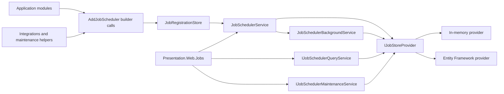
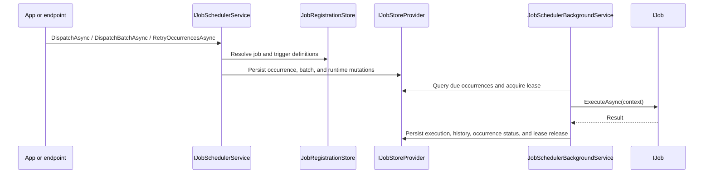
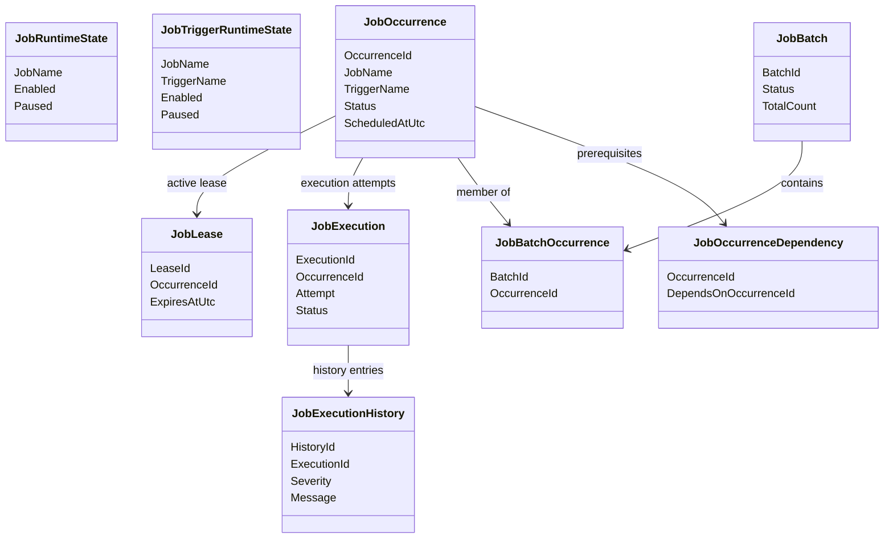
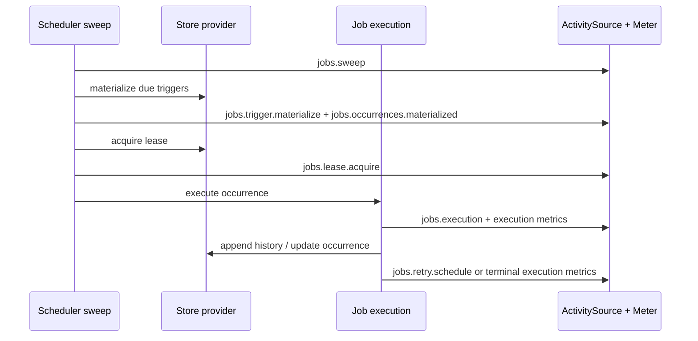

# Jobs Feature Documentation

> Schedule durable background work through devkit-owned jobs, triggers, batches, leases, history, and source-level integrations.

[TOC]

## Overview

`Application.Jobs` is the devkit-native scheduling feature for recurring, delayed, one-time, manual, chained, batched, calendar-driven, and event-triggered work.

It is a standalone feature with its own authoring model, runtime, persistence abstractions, operational APIs, and HTTP surface.

The feature is split across three projects:

- `Application.Jobs`: authoring model, runtime services, query contracts, maintenance APIs, in-memory persistence, and test harnesses
- `Infrastructure.EntityFramework`: durable Entity Framework Jobs provider
- `Presentation.Web.Jobs`: operational HTTP endpoints for dashboards, support tooling, and controlled runtime mutations

Key characteristics:

- code-first job and trigger registration through `AddJobScheduler(...)`
- durable occurrences and execution history through provider-neutral stores
- inline dispatch APIs for application code and background execution for hosted scheduling
- batch and chaining support without turning the scheduler into a workflow engine
- optional outbound and event-trigger adapters for Requester, Notifier, Messaging, Queueing, Pipelines, and Orchestrations
- built-in maintenance jobs for archive, purge, and repair operations

## Glossary

| Term | Meaning |
| --- | --- |
| Job scheduler | The runtime registered by `AddJobScheduler(...)`; it owns registration resolution, dispatch, trigger materialization, execution, persistence, querying, and maintenance. |
| Job definition | The code-first registration that names a job, its data contract, trigger definitions, retry behavior, concurrency limits, properties, and chaining rules. |
| Job name | The stable public identifier for a job definition. It is used for dispatch, persisted occurrences, filters, metrics, endpoints, and logs. |
| Inline job | A job definition backed by a registration-time delegate instead of a dedicated `IJob` class. It still uses the normal occurrence, lease, retry, and history pipeline. |
| Trigger | A named schedule or activation mode that materializes occurrences for a job. |
| Trigger name | The stable identifier for a trigger within one job. Trigger names must be unique per job. |
| Trigger type | The trigger category, such as manual, cron, calendar, one-time, delayed, startup-delay, event, or custom. |
| Manual trigger | A trigger that does not materialize work on its own and is used by explicit dispatch calls. |
| Cron trigger | A trigger based on a cron expression and optional time zone. |
| Calendar trigger | A trigger based on business-calendar rules such as dates, weekdays, exclusions, or month-end behavior. |
| One-time trigger | A trigger that creates work for one configured instant. |
| Delayed trigger | A trigger that creates work after a configured delay. |
| Startup-delay trigger | A trigger evaluated after a scheduler instance starts and the configured startup delay elapses. |
| Occurrence | One durable unit of work created by dispatch or trigger materialization. An occurrence may have zero or more execution attempts. |
| Due occurrence | An occurrence whose due time has arrived and can be acquired by an eligible scheduler instance. |
| Missed occurrence | An occurrence that should have been pending or executed while the scheduler was stopped, unavailable, or unable to acquire work. |
| Manual dispatch | An explicit application or operator request to create an occurrence from a manual trigger. |
| Accepted asynchronous dispatch | `DispatchAsync(...)` accepts and persists an occurrence, then returns without running it inline. Background execution later acquires and runs the occurrence. |
| Inline dispatch | `DispatchAndWaitAsync(...)` creates an occurrence and waits for the current execution attempt to reach a terminal result. |
| Background execution | Hosted scheduler processing that pending due triggers, acquires leases, and runs eligible occurrences through the worker pool. |
| Execution | One attempt to run an occurrence. Retries create additional executions for the same occurrence. |
| Execution history | Append-only lifecycle records for occurrences, executions, retries, leases, operator actions, batch operations, and diagnostics. |
| Job execution context | The `IJobExecutionContext` passed to a job execution. It exposes identity, typed data, properties, items, previous execution snapshots, messages, and cancellation. |
| Previous execution | The immediately preceding execution attempt for the same occurrence, mainly useful during retries. |
| Previous successful execution | The latest successful execution for the same job and trigger before the current occurrence, used for delta-style processing. |
| Scheduler instance | One running scheduler host identified by `InstanceId(...)`; target lists created with `TargetInstances(...)` refer to these ids. |
| Worker pool | The bounded execution slots inside a scheduler instance that acquire leases and run occurrences concurrently. |
| Lease | The provider-backed ownership record that allows one scheduler instance to execute an occurrence safely. |
| Runtime state | Persisted enable, disable, pause, resume, and materialization overlays applied to jobs or triggers without changing source code. |
| Data | The durable typed payload supplied by a trigger or dispatch call and exposed through `IJobExecutionContext<TData>.Data`. |
| Properties | Immutable string key/value values that travel with dispatch, occurrences, and integration flows for filtering, diagnostics, and runtime decisions. |
| Items | The mutable `context.Items` dictionary used only during the active execution attempt. Items are not the durable payload. |
| Correlation id | A stable id used to connect dispatches, events, occurrences, executions, logs, and telemetry for one business operation. |
| Idempotency key | A stable key used to avoid creating duplicate occurrences for the same logical operation or accepted event. |
| Batch | A durable grouping of multiple occurrences for parallel fan-out, monitoring, bulk control, and selective retry. |
| Batch child occurrence | An occurrence attached to a batch and counted in the batch's pending, processing, succeeded, failed, cancelled, and finished totals. |
| Dependency | An occurrence-to-occurrence prerequisite created by job chaining. The dependent occurrence waits until its prerequisite reaches the required terminal state. |
| Chaining | The `.Then(...)` authoring model that creates dependent occurrences after a source occurrence completes successfully. |
| Retry policy | The rules that decide whether a failed execution should create another attempt and when that attempt becomes due. |
| Concurrency limit | A job-level execution cap that limits how many occurrences for the same job may run at the same time. |
| Behavior | A pipeline component that wraps a concrete execution attempt for cross-cutting concerns such as metrics, module scope, validation, or test fault injection. |
| Maintenance operation | A provider-neutral purge, archive, repair, lease recovery, or runtime-state cleanup action over retained scheduler data. |
| Maintenance service | `IJobSchedulerMaintenanceService`, the service that exposes provider-neutral purge and repair operations. |
| Durable provider | A store provider that persists runtime state, occurrences, executions, history, batches, dependencies, accepted events, and leases across restarts. |
| In-memory provider | The default lightweight provider for tests, local development, and transient workloads. It does not provide recovery across process restarts. |
| Entity Framework provider | The durable provider that stores Jobs data in an application `DbContext` through `IJobsContext` and annotated Jobs entities. |
| `IJobsContext` | The Entity Framework capability interface implemented by an application `DbContext` to host Jobs persistence sets. |
| Accepted event | A persisted event captured from Notifier, Messaging, Queueing, or a custom source and later materialized into a normal occurrence. |
| Event trigger | A trigger that materializes occurrences from accepted events instead of time-based schedules or manual dispatch. |
| Custom trigger | A trigger backed by an application-provided trigger provider when cron, calendar, manual, one-time, delayed, startup, and event triggers are not enough. |
| Query service | The read side exposed by `IJobSchedulerQueryService` for dashboards, support tooling, and operational endpoints. |
| Operational endpoints | The HTTP surface from `Presentation.Web.Jobs` for dashboards, support tooling, runtime control, batch operations, and maintenance actions. |
| Test harness | The Jobs testing helpers that execute jobs or scheduler flows with in-memory persistence and controlled runtime state. |

## Core Service Surface

At runtime, Jobs exposes three service layers with distinct responsibilities:

- `IJobSchedulerService`: dispatch, pause/resume, enable/disable, occurrence control, lease release, and batch operations
- `IJobSchedulerQueryService`: dashboard-ready read models for jobs, triggers, occurrences, retries, executions, batches, leases, servers, metrics, and dashboard summaries
- `IJobSchedulerMaintenanceService`: provider-neutral purge and repair operations over retained scheduler state

These services all use the devkit `Result` pattern for runtime or query outcomes where business/runtime validation can fail without throwing exceptions.

## Basic Setup

Register jobs and triggers in code during application startup:

```csharp
builder.Services.AddJobScheduler()
    .WithJob<CleanupCustomersJob>("cleanup-customers", job => job
        .Description("Removes stale customer records.")
        .AddTrigger("nightly", trigger => trigger.Cron("0 0 2 * * *")));
```

Jobs includes small cron convenience helpers for code-first registrations:

```csharp
builder.Services.AddJobScheduler()
    .WithJob<CleanupCustomersJob>("cleanup-customers", job => job
        .Description("Removes stale customer records.")
        .AddTrigger("nightly", trigger => trigger.Cron(CronExpressions.DailyAt2AM))
        .AddTrigger("recheck", trigger => trigger.Cron(
            new CronExpressionBuilder()
                .EveryMinutes(30)
                .Build())));
```

Cron helper notes:

- `CronExpressions` contains common Jobs cron constants such as `Every30Minutes`, `DailyAt2AM`, and `WeeklyOnMondayAtMidnight`.
- `CronExpressionBuilder` builds standard five-field Jobs cron expressions by default.
- Seconds-based builder methods such as `EverySeconds(...)` emit the supported six-field Jobs format.
- `IJobCronEngine` is registered by `AddJobScheduler()` and can be injected into validators or services that need cron validation or occurrence calculation.

For lightweight function-oriented logic, use the inline delegate overload. Inline jobs are still normal job definitions: they create occurrences, hydrate `IJobExecutionContext`, honor triggers and runtime state, and write execution history through the same pipeline as class-based jobs.

```csharp
builder.Services.AddScoped<CustomerCleanupProcessor>();

builder.Services.AddJobScheduler()
    .WithJob("cleanup-customers-inline", job => job
        .Description("Runs the customer cleanup processor inline for the caller.")
        .Execute((context, serviceProvider, cancellationToken) =>
            serviceProvider.GetRequiredService<CustomerCleanupProcessor>()
                .RunAsync(cancellationToken))
        .AddTrigger("manual", trigger => trigger.Manual()));
```

Manual dispatch uses the scheduler service directly:

```csharp
var scheduler = app.Services.GetRequiredService<IJobSchedulerService>();

var result = await scheduler.DispatchAndWaitAsync<CleanupCustomersJob>(
    cancellationToken: cancellationToken);

if (result.IsSuccess)
{
    Console.WriteLine(result.Value.Status);
}
```

Named inline jobs can also be dispatched and awaited directly by job name:

```csharp
var result = await scheduler.DispatchAndWaitAsync(
    "cleanup-customers-inline",
    cancellationToken: cancellationToken);
```

That `DispatchAndWaitAsync(...)` path is the feature's inline execution mode: the scheduler still creates the occurrence and execution records, but the caller waits for the terminal result of the current attempt.

### Composing Registrations Across Modules

You can call `AddJobScheduler()` multiple times from different feature modules or startup slices. Each call reuses the same scheduler singletons and the same `JobRegistrationStore`, so the registrations compose into one scheduler runtime.

```csharp
services.AddJobScheduler()
    .WithBackgroundExecution(options => options.EnableBackgroundExecution = true);

services.AddJobScheduler()
    .WithJob<CleanupCustomersJob>("cleanup-customers", job => job
        .Description("Removes stale customer records.")
        .AddTrigger("nightly", trigger => trigger.Cron("0 0 2 * * *")));

services.AddJobScheduler()
    .WithBuiltInMaintenanceJobs();
```

This pattern is useful when a host, a shared module, and an integration feature all need to contribute jobs without centralizing every registration in one file.

### Scheduler Instance And Worker Pool

Hosted background execution can be aligned explicitly to a stable scheduler instance id and tuned through the top-level builder.

```csharp
builder.Services.AddJobScheduler()
        .InstanceId(context => $"{context.Environment.ApplicationName}:{context.Environment.MachineName}")
        .StartupDelay(TimeSpan.FromSeconds(10))
        .WorkerPool(pool => pool
                .MaxConcurrency(4)
                .BatchSize(32)
                .PollInterval(TimeSpan.FromSeconds(5)))
        .WithJob<CleanupCustomersJob>("cleanup-customers", job => job
                .Description("Removes stale customer records.")
                .AddTrigger("nightly", trigger => trigger.Cron("0 0 2 * * *")));
```

Use `InstanceId(...)` when several hosts share the same jobs store and you need stable scheduler instance targeting, diagnostics, or lease ownership labels across restarts.

### Exception Handling

Unhandled scheduler failures can be observed centrally through `WithExceptionHandler<THandler>()`.

```csharp
builder.Services.AddJobScheduler()
    .WithExceptionHandler<OpsAlertingJobExceptionHandler>()
    .WithJob<CleanupCustomersJob>("cleanup-customers", job => job
        .Description("Removes stale customer records.")
        .AddTrigger("nightly", trigger => trigger.Cron("0 0 2 * * *")));
```

Implement `IJobSchedulerExceptionHandler` when you need last-chance telemetry, alerting, or operational diagnostics for exceptions that escape the normal scheduler pipeline:

```csharp
public sealed class OpsAlertingJobExceptionHandler : IJobSchedulerExceptionHandler
{
    public Task HandleAsync(JobSchedulerExceptionContext context, CancellationToken cancellationToken = default)
    {
        Console.WriteLine($"[{context.Source}] {context.SchedulerInstanceId}: {context.Exception.Message}");
        return Task.CompletedTask;
    }
}
```

Handler notes:

- handlers receive the scheduler instance id, exception source, exception, and when available the resolved job definition, trigger, occurrence id, and execution id
- execution failures raised from a concrete job attempt use `JobSchedulerExceptionSource.Execution`
- failures raised by the hosted scheduler loop use `JobSchedulerExceptionSource.BackgroundService`
- normal `Result` failures, validation errors, retries, and other handled scheduler outcomes do not flow through this last-chance exception surface

### Scheduler Instance Targeting

Jobs can constrain execution to specific scheduler instances. Set a default target list on the job or override it on an individual trigger.

```csharp
builder.Services.AddJobScheduler()
        .InstanceId("node-a")
        .WithJob<CleanupCustomersJob>("cleanup-customers", job => job
                .Description("Removes stale customer records.")
                .TargetInstances("node-a", "node-b") // job level
                .AddTrigger("manual", trigger => trigger.Manual())
                .AddTrigger("nightly", trigger => trigger.Cron("0 0 2 * * *").TargetInstances("node-b"))); // trigger level
```

Targeting rules:

- job-level `TargetInstances(...)` applies to all triggers that do not declare their own targets
- trigger-level `TargetInstances(...)` overrides the job-level targets for that trigger only
- background sweeps due work as usual, but only eligible scheduler instances pick targeted occurrences for execution
- direct inline dispatch fails clearly when the current scheduler instance is not one of the trigger's effective targets

Appsettings can override the same targeting properties for code-registered jobs:

```json
{
    "Jobs": {
        "cleanup-customers": {
            "TargetInstances": ["node-a", "node-b"],
            "Triggers": {
                "nightly": {
                    "TargetInstances": ["node-b"]
                }
            }
        }
    }
}
```

## Durable Persistence And Endpoints

The default registration uses the in-memory provider. To make occurrences, leases, batches, history, and runtime state durable, wire the Entity Framework provider and optionally add the operational endpoint package.

```csharp
builder.Services.AddJobScheduler()
    .WithJob<CleanupCustomersJob>("cleanup-customers", job => job
        .Description("Removes stale customer records.")
        .AddTrigger("nightly", trigger => trigger.Cron("0 0 2 * * *")))
    .WithEntityFramework<AppDbContext>()
    .AddEndpoints(options => options
        .RequireAuthorization());
```

The default Jobs endpoint group is `/_bdk/api/jobs`.

## Entity Framework DbContext Setup

To persist occurrences, executions, history, leases, batches, and runtime state in your application database, the host `DbContext` only needs to implement `IJobsContext` and expose the Jobs sets. The Jobs entities carry their EF mapping through attributes and conventions, so no Jobs-specific `ModelBuilder` call is required.

```csharp
public sealed class AppDbContext(DbContextOptions<AppDbContext> options)
    : ModuleDbContextBase(options), IJobsContext
{
    public DbSet<Order> Orders { get; set; }

    public DbSet<JobRuntimeStateEntity> JobRuntimeStates { get; set; }

    public DbSet<JobTriggerRuntimeStateEntity> JobTriggerRuntimeStates { get; set; }

    public DbSet<JobOccurrenceEntity> JobOccurrences { get; set; }

    public DbSet<JobOccurrenceDependencyEntity> JobOccurrenceDependencies { get; set; }

    public DbSet<JobBatchEntity> JobBatches { get; set; }

    public DbSet<JobBatchOccurrenceEntity> JobBatchOccurrences { get; set; }

    public DbSet<JobExecutionEntity> JobExecutions { get; set; }

    public DbSet<JobExecutionHistoryEntity> JobExecutionHistory { get; set; }

    public DbSet<JobBatchHistoryEntity> JobBatchHistory { get; set; }

    public DbSet<JobAcceptedEventEntity> JobAcceptedEvents { get; set; }

    public DbSet<JobLeaseEntity> JobLeases { get; set; }
}
```

Register the DbContext first, then switch the Jobs feature to the EF-backed provider:

```csharp
builder.Services.AddDbContext<AppDbContext>(options =>
    options.UseSqlServer(builder.Configuration.GetConnectionString("Default")));

builder.Services.AddJobScheduler()
    .WithJob<CleanupCustomersJob>("cleanup-customers", job => job
        .Description("Removes stale customer records.")
        .AddTrigger("nightly", trigger => trigger.Cron("0 0 2 * * *")))
    .WithEntityFramework<AppDbContext>();
```

Setup notes:

- The same application DbContext can own both business tables and Jobs tables.
- Provider selection stays on `AddDbContext(...)`; `WithEntityFramework<TContext>()` only tells Jobs which registered context implements `IJobsContext`.
- Include the Jobs entities in your normal EF migration flow when the application manages schema through migrations.
- `Database.EnsureCreated()` is appropriate for tests and isolated prototypes; production hosts should use their normal migration/deployment path.
- The EF provider replaces only the persistence implementation. Dispatch, query, maintenance, and endpoint APIs stay the same.

If the host already has several module DbContexts, the Jobs provider can attach to whichever one should own scheduler state. The important part is that the chosen context implements `IJobsContext`; migrations for that context will include the annotated Jobs entities.

## Authoring Notes

- Jobs and triggers remain code-first definitions. Durable storage never becomes the source of truth for registrations.
- Runtime state can override a registered job or trigger to enable, disable, pause, or resume it without mutating source code.
- Manual dispatch, recurring materialization, retries, chaining, and batch grouping all converge on the same durable occurrence model.
- Cron and calendar triggers default to `JobMissedOccurrencePolicy.RunOnce`, so each scheduler sweep creates one occurrence for the latest due time in the covered window. Use `.WithMissedOccurrencePolicy(JobMissedOccurrencePolicy.Skip)` only when missed windows should advance without creating work.
- Batches are grouping and bulk-control constructs, not workflow definitions. If you need durable business state transitions, use [Orchestrations](./features-orchestrations.md).

### Lifetime And Resolved Properties

Job registrations can control the DI lifetime for the job type and can set the module explicitly.

```csharp
builder.Services.AddJobScheduler()
    .WithJob<ExportCustomerJob>("export-customer", job => job
        .Name("Export Customer Projection")
        .Description("Exports one customer projection.")
        .Module("Reporting")
        .UseLifetime(ServiceLifetime.Scoped)
        .AddTrigger("manual", trigger => trigger.Manual()));
```

Resolution rules:

- the default job lifetime is transient
- `UseLifetime(ServiceLifetime.Scoped)` creates one job instance per execution scope
- `UseLifetime(ServiceLifetime.Singleton)` reuses the container singleton for every execution
- if `.Module(...)` is not configured and `IModuleContextAccessor` is registered, Jobs resolves the module from the job type through `IModuleContextAccessor.Find(jobType)`
- an explicit `.Module(...)` value wins over module resolution from `IModuleContextAccessor`
- if `.Name(...)` is omitted, Jobs derives the display name from the optional resolved module name plus the dashified job type name
- query APIs and dashboard views expose the resolved module name and resolved display name, not only the raw fluent input

## Advanced Usage

### Typed Data, Properties, And Execution Context

Use a typed `JobBase<TData>` when the job contract needs a durable payload. The execution context then gives you strongly typed input, immutable properties, previous execution snapshots, mutable messages, and a mutable item bag.

```csharp
public sealed record ExportCustomerJobData(string CustomerId, bool FullRebuild);

public sealed class ExportCustomerJob(ICustomerExporter exporter) : JobBase<ExportCustomerJobData>
{
    public override async Task<Result> ExecuteAsync(
        IJobExecutionContext<ExportCustomerJobData> context,
        CancellationToken cancellationToken = default)
    {
        var tenant = context.Properties.Get("tenant", "default");
        var previousCompletedUtc = context.PreviousSuccessfulExecution?.CompletedUtc;

        var exportedCount = await exporter.ExportAsync(
            context.Data.CustomerId,
            context.Data.FullRebuild,
            tenant,
            previousCompletedUtc,
            cancellationToken);

        context.Messages.Add($"Exported {exportedCount} records for {context.Data.CustomerId}.");
        context.Items["exportedCount"] = exportedCount;
        context.Items["tenant"] = tenant;

        return Result.Success();
    }
}
```

Dispatch the job with payload and properties:

```csharp
var scheduler = app.Services.GetRequiredService<IJobSchedulerService>();

var result = await scheduler.DispatchAndWaitAsync<ExportCustomerJob>(
    new ExportCustomerJobData("cust-42", FullRebuild: false),
    new JobDispatchOptions
    {
        TriggerName = "manual",
        CorrelationId = "ops-export-42",
        IdempotencyKey = "export:cust-42:2026-05-26",
        Properties = new PropertyBag
        {
            ["tenant"] = "alpha",
            ["requestedBy"] = "support-tool",
        },
    },
    cancellationToken: cancellationToken);
```

Context guidance:

- `context.Data` is the durable typed payload for the occurrence
- `context.Properties` is immutable for the active execution and is persisted with the occurrence
- `context.Messages` is suitable for human-readable execution notes that should be returned with the result
- `context.Items` is an in-memory item bag for the active attempt only; it is not the durable properties store
- `context.PreviousExecution` and `context.PreviousSuccessfulExecution` let jobs implement incremental or compensating behavior without querying storage manually

### Inline Delegate Jobs

Inline delegate jobs are useful when the registration site already owns the behavior and a separate class would add little value. They still execute through the normal definition, trigger, context, retry, timeout, lease, and history pipeline.

```csharp
builder.Services.AddJobScheduler()
    .WithJob("export-customer-inline", job => job
        .Description("Exports one customer through an inline delegate.")
        .Execute<ExportCustomerJobData>(async (context, serviceProvider, cancellationToken) =>
        {
            var tenant = context.Properties.Get("tenant", "default");
            var exporter = serviceProvider.GetRequiredService<ICustomerExporter>();

            await exporter.ExportAsync(
                context.Data.CustomerId,
                context.Data.FullRebuild,
                tenant,
                context.PreviousSuccessfulExecution?.CompletedUtc,
                cancellationToken);

            context.Messages.Add($"Inline export finished for {context.Data.CustomerId}.");
            context.Items["tenant"] = tenant;
            context.Items["mode"] = "inline-delegate";
            return Result.Success();
        })
        .AddTrigger("manual", trigger => trigger.Manual()));
```

Use inline delegates for small, registration-local behavior. Prefer a dedicated job class when the logic is shared, grows beyond a compact lambda, or deserves its own explicit test seam and constructor dependency graph.

### Behaviors

Jobs supports execution behaviors that wrap the scheduler's execution pipeline for a concrete attempt. Use them for cross-cutting concerns such as metrics, module scoping, validation, or deliberate fault injection in tests.

Register a global behavior when it should apply to every job:

```csharp
builder.Services.AddJobScheduler()
    .WithBehavior<ModuleScopeBehavior>()
    .WithJob<ExportCustomerJob>("export-customer", job => job
        .Description("Exports a customer projection.")
        .AddTrigger("manual", trigger => trigger.Manual()));
```

Register a job-specific behavior when only one job needs it:

```csharp
builder.Services.AddJobScheduler()
    .WithJob<ExportCustomerJob>("export-customer", job => job
        .Description("Exports a customer projection.")
        .WithBehavior<ModuleScopeBehavior>()
        .AddTrigger("manual", trigger => trigger.Manual()));
```

Declare a behavior on the job type when the behavior is part of the job's contract:

```csharp
[WithBehavior(typeof(ModuleScopeBehavior))]
public sealed class ExportCustomerJob(ICustomerExporter exporter) : JobBase<ExportCustomerJobData>
{
    public override Task<Result> ExecuteAsync(
        IJobExecutionContext<ExportCustomerJobData> context,
        CancellationToken cancellationToken = default)
    {
        return Task.FromResult(Result.Success());
    }
}
```

Behavior notes:

- `JobMetricsBehavior` is registered by default so execution spans and execution-level metrics continue to flow without extra setup
- global behaviors run before job-specific fluent behaviors and attribute-declared behaviors
- attribute-declared behaviors run before fluent job-specific behaviors on the same job
- behaviors should wrap `next()` and let the scheduler keep ownership of leases, retries, timeout handling, and durable state transitions

`ModuleScopeBehavior` captures the resolved module name in the log scope and current activity. If `IModuleContextAccessor` resolves the job into a disabled module, the behavior fails the attempt before the job body runs.

`ChaosExceptionJobBehavior` mirrors the repo's other chaos behaviors and is intended for failure-path testing. Implement `IChaosExceptionJob` on a job and register the behavior where you want chaos injection to apply:

```csharp
builder.Services.AddJobScheduler()
    .WithBehavior<ChaosExceptionJobBehavior>()
    .WithJob<ImportOrdersJob>("import-orders", job => job
        .Description("Imports orders with chaos injection enabled for tests.")
        .AddTrigger("manual", trigger => trigger.Manual()));

public sealed class ImportOrdersJob : JobBase, IChaosExceptionJob
{
    ChaosExceptionJobBehaviorOptions IChaosExceptionJob.Options => new()
    {
        InjectionRate = 1.0,
        Fault = new ChaosException("Injected failure for resilience tests."),
    };

    public override Task<Result> ExecuteAsync(
        IJobExecutionContext<Unit> context,
        CancellationToken cancellationToken = default)
    {
        return Task.FromResult(Result.Success());
    }
}
```

### Trigger Properties Versus Dispatch Properties

Trigger properties are registration-time defaults. Dispatch properties are operation-time overlays. The scheduler merges them when materializing the occurrence, with explicit dispatch properties taking precedence.

```csharp
builder.Services.AddJobScheduler()
    .WithJob<ExportCustomerJob>("export-customer", job => job
        .Description("Exports a customer projection.")
        .AddTrigger("nightly", trigger => trigger
            .Cron("0 30 1 * * *")
            .WithProperty("tenant", "alpha")
            .WithProperty("channel", "scheduled")));

await scheduler.DispatchAsync(
    "export-customer",
    new ExportCustomerJobData("cust-42", FullRebuild: true),
    new JobDispatchOptions
    {
        TriggerName = "nightly",
        Properties = new PropertyBag
        {
            ["channel"] = "manual-repair",
            ["requestedBy"] = "operations",
        },
    },
    cancellationToken);
```

### Advanced Use Cases

Use the same core runtime for different operational patterns:

- immediate inline execution with `DispatchAndWaitAsync(...)` when the caller must observe the terminal result
- accepted asynchronous dispatch with `DispatchAsync(...)` when the caller only needs an occurrence identifier and status tracking
- `DispatchAsync(...)` only accepts and persists the occurrence; the background scheduler executes it on an eligible scheduler instance
- time-based recurring work through cron triggers
- business-calendar recurring work through calendar triggers and exclusions
- manual support workflows through manual triggers and property-enriched dispatch options
- incremental jobs that use `PreviousSuccessfulExecution` for watermarks or delta windows
- chained handoffs through `.Then(...)` when one occurrence must wait for another
- grouped fan-out and selective reprocessing through batches
- outbound integration jobs through `WithRequestSendJob(...)` or `WithRequesterJob(...)`, `WithNotificationPublishJob(...)` or `WithNotifierJob(...)`, `WithMessagingPublishJob(...)` or `WithMessagePublishJob(...)`, `WithQueueingSendJob(...)` or `WithQueueSendJob(...)`, `WithPipelineExecuteJob(...)`, and `WithOrchestrationExecuteJob(...)`
- event-triggered jobs through accepted-event ingress and scheduler sweeps

### Calendar Triggers

Use calendar triggers when cron syntax is the wrong abstraction and the business schedule is expressed in dates, weekdays, exclusions, or month-end rules.

```csharp
builder.Services.AddJobScheduler()
    .WithJob<ExportCustomerJob>("export-customer", job => job
        .Description("Exports customer data on business-operational dates.")
        .AddTrigger("calendar", trigger => trigger
            .Calendar(calendar => calendar
                .At(new TimeOnly(8, 30))
                .OnBusinessDays()
                .OnDaysOfMonth(1, 15)
                .LastDayOfMonth()
                .ExcludeDates(
                    new DateOnly(2026, 12, 25),
                    new DateOnly(2026, 12, 26)))));
```

Calendar trigger guidance:

- use `.OnBusinessDays()` when weekends should never materialize work
- use `.OnWeekdays(...)` when only selected weekdays are valid
- use `.OnDaysOfMonth(...)` or `.LastDayOfMonth()` for month-boundary work
- use `.ExcludeDates(...)` for holidays or maintenance freezes
- use `.TimeZone(...)` or `.InTimeZone(...)` when the recurring local time is not UTC
- combine calendar rules with normal trigger properties, retry policy, timeout, and chaining rules

### Event Triggers

Event triggers let accepted outbound or messaging activity materialize normal scheduler occurrences. The trigger definition stays code-first, while the adapter converts a published notification, broker message, or queue message into a durable accepted-event row that the scheduler sweep turns into an occurrence.

```csharp
builder.Services.AddJobScheduler()
    .WithJob<ProcessExportCompletedJob>("process-export-completed", job => job
        .Description("Handles accepted export-completed notifications.")
        .WithData<CustomerExportCompletedNotification>()
        .AddTrigger("accepted", trigger => trigger
            .Event<CustomerExportCompletedNotification>(JobEventSourceNames.Notifier)));

builder.Services.AddNotifier()
    .AddHandler<CustomerExportCompletedNotification, CustomerExportCompletedHandler>()
    .UseJobSchedulerEventTriggers();
```

Accepted events should carry stable identity when possible. Use `JobEventContextPropertyNames.IdempotencyKey`, `JobEventContextPropertyNames.SourceId`, and `JobEventContextPropertyNames.CorrelationId` so duplicate published events do not materialize duplicate occurrences and support tooling can correlate the resulting work.

```csharp
await notifier.PublishAsync(
    new CustomerExportCompletedNotification(exportId),
    new PublishOptions
    {
        Context = new RequestContext
        {
            Properties =
            {
                [JobEventContextPropertyNames.IdempotencyKey] = $"export:{exportId}",
                [JobEventContextPropertyNames.CorrelationId] = correlationId,
            },
        },
    },
    cancellationToken);
```

Adapter notes:

- Notifier event triggers are enabled with `AddNotifier().UseJobSchedulerEventTriggers()`
- Messaging event triggers are enabled with `AddMessaging().UseJobSchedulerEventTriggers()`
- Queueing event triggers are enabled with `AddQueueing().UseJobSchedulerEventTriggers()`
- Messaging and Queueing adapters require `AddJobScheduler()` to be configured before `UseJobSchedulerEventTriggers()` so the event-source registry exists
- Accepted events are materialized during scheduler sweeps, not inline with the publishing call

### Custom Triggers

Use a custom trigger when the schedule source is neither cron, calendar, manual, nor accepted events. A custom trigger provider keeps the scheduler core provider-neutral while still letting a job materialize occurrences from an external rule or state source.

```csharp
builder.Services.AddSingleton<CustomerWindowTriggerProvider>();

builder.Services.AddJobScheduler()
    .WithJob<RefreshCustomerWindowJob>("refresh-customer-window", job => job
        .Description("Refreshes customer windows from an external planning source.")
        .WithData<RefreshCustomerWindowData>()
        .AddTrigger("external-window", trigger => trigger.Custom<CustomerWindowTriggerProvider>()));
```

```csharp
public sealed class CustomerWindowTriggerProvider : IJobCustomTriggerProvider
{
    public Result<JobTriggerEvaluationResult> Materialize(JobTriggerEvaluationContext context)
    {
        if (context.RuntimeState.HasMaterializedOccurrence)
        {
            return Result<JobTriggerEvaluationResult>.Success(new JobTriggerEvaluationResult(
                context.RuntimeState,
                []));
        }

        var dueUtc = context.NowUtc.AddMinutes(15);
        var data = new RefreshCustomerWindowData("alpha");

        return Result<JobTriggerEvaluationResult>.Success(new JobTriggerEvaluationResult(
            context.RuntimeState with { HasMaterializedOccurrence = true, UpdatedDate = context.NowUtc },
            [
                new JobOccurrenceMaterialization(
                    $"{context.Job.JobName}:{context.Trigger.TriggerName}:alpha",
                    context.Job.JobName,
                    context.Trigger.TriggerName,
                    JobTriggerType.Custom,
                    dueUtc,
                    null,
                    data,
                    typeof(RefreshCustomerWindowData),
                    new Dictionary<string, string> { ["tenant"] = "alpha" },
                    "alpha")
            ]));
    }
}
```

Custom trigger guidance:

- register the provider type itself in DI; the scheduler resolves the concrete `Custom<TProvider>()` type directly
- return deterministic `OccurrenceKey` and `IdempotencyKey` values so repeated sweeps do not create duplicate work
- update `JobTriggerRuntimeState` when the provider needs one-shot or watermark behavior
- prefer properties for durable correlation and `context.Items` only for attempt-local execution details

## Testing Jobs

The Jobs feature ships xUnit-oriented testing utilities directly from `Application.Jobs`. You can use the same public helper types that the feature itself uses in its unit tests.

Use two testing styles:

- direct job tests with a synthetic `IJobExecutionContext<TData>` when you only want to verify job logic
- direct runtime tests with `JobTestHarness` when you want DI activation plus a synthetic execution context without running scheduler sweeps
- scheduler tests with `JobSchedulerTestHarness` when you want to verify trigger materialization, retries, time, batches, dependencies, history, or control behavior

`JobSchedulerTestHarness` is also the right tool for event-trigger and custom-trigger coverage because it can materialize triggers, execute due work, and assert retained occurrence/history state without booting a full host.

### Direct Job Tests With A Synthetic Execution Context

Use `JobExecutionContextBuilder<TData>` when you want a deterministic context without starting the scheduler runtime.

```csharp
public class ExportCustomerJobTests
{
    [Fact]
    public async Task ExecuteAsync_UsesPreviousSuccessfulExecutionForDeltaWork()
    {
        var exporter = Substitute.For<ICustomerExporter>();
        var sut = new ExportCustomerJob(exporter);
        var context = new JobExecutionContextBuilder<ExportCustomerJobData>()
            .WithJobName("export-customer")
            .WithTriggerName("manual")
            .WithData(new ExportCustomerJobData("cust-42", FullRebuild: false))
            .WithProperties(new PropertyBag { ["tenant"] = "alpha" })
            .WithPreviousSuccessfulExecution(new JobExecutionContextSnapshot(
                ExecutionId: Guid.NewGuid(),
                AttemptNumber: 1,
                Status: JobExecutionStatus.Completed,
                StartedUtc: new DateTimeOffset(2026, 05, 25, 09, 00, 00, TimeSpan.Zero),
                CompletedUtc: new DateTimeOffset(2026, 05, 25, 09, 05, 00, TimeSpan.Zero),
                Message: "previous export completed"))
            .Build();

        var result = await sut.ExecuteAsync(context);

        result.IsSuccess.ShouldBeTrue();
        context.Properties.Get("tenant", string.Empty).ShouldBe("alpha");
    }
}
```

This path is useful for:

- typed payload handling
- property-dependent logic
- `context.Messages` and `context.Items`
- previous-attempt and previous-success logic
- cancellation-token propagation into the job method

### Direct Runtime Tests With JobTestHarness

Use `JobTestHarness.Create()` when you want the real DI activation path for one job, but still want a fully synthetic execution context.

```csharp
public class ExportCustomerJobHarnessTests
{
    [Fact]
    public async Task ExecuteAsync_UsesRegisteredDependenciesAndPreviousState()
    {
        var exporter = Substitute.For<ICustomerExporter>();

        using var harness = JobTestHarness.Create()
            .WithJob<ExportCustomerJob>("export-customer")
            .WithService(exporter)
            .WithData(new ExportCustomerJobData("cust-42", FullRebuild: false))
            .WithPreviousSuccessfulExecution(previous => previous
                .Status(JobExecutionStatus.Completed)
                .StartedUtc(new DateTimeOffset(2026, 05, 25, 09, 00, 00, TimeSpan.Zero))
                .CompletedUtc(new DateTimeOffset(2026, 05, 25, 09, 05, 00, TimeSpan.Zero)))
            .Build();

        var result = await harness.ExecuteAsync();

        result.IsSuccess.ShouldBeTrue();
    }
}
```

Use this style when you want constructor-injected collaborators, typed payload validation, or previous-execution snapshots without materializing occurrences and leases.

### Scheduler Tests With In-Memory Persistence

Use `JobSchedulerTestHarness.Create(...)` when you want to test scheduler behavior rather than only the job body.

```csharp
public class ExportCustomerScheduleTests
{
    [Fact]
    public async Task CronTrigger_MaterializesAndExecutesDueOccurrence()
    {
        using var harness = JobSchedulerTestHarness.Create(jobs =>
            jobs.WithJob<ExportCustomerJob>("export-customer", job => job
                .Description("Exports customer data.")
                .AddTrigger("cron", trigger => trigger.Cron("*/5 * * * *"))));

        await harness.MaterializeAsync();
        harness.Advance(TimeSpan.FromMinutes(5));
        await harness.MaterializeAsync();

        var occurrence = await harness.FindOccurrenceAsync("export-customer", "cron");
        var result = await harness.ExecuteOccurrenceAsync(occurrence.OccurrenceId);

        result.IsSuccess.ShouldBeTrue();
        await harness.AssertHistoryContainsAsync(occurrence.OccurrenceId, "ExecutionCompleted");
    }
}
```

The scheduler harness gives you:

- in-memory persistence for occurrences, batches, leases, dependencies, and history
- a fake clock through `harness.Clock` and `harness.Advance(...)`
- deterministic trigger materialization through `MaterializeAsync(...)`
- a fluent public builder through `JobSchedulerTestHarness.Create().WithClock(...).WithJob(...).Build()`
- direct dispatch and dispatch-and-wait helpers
- assertions for retry attempts, blocked dependencies, batch roll-up, and history entries
- DI customization for fake outbound dependencies through `configureServices`

Typical cases to test with the harness:

- cron, one-time, delayed, startup-delay, manual, and event-trigger materialization
- retries, timeout handling, cancellation, and lease recovery
- previous-run state hydration for later executions
- batch roll-up and bulk-control behavior
- dependency blocking and chained successor materialization

If you need a durable-provider test, keep the same job/trigger authoring model and swap the in-memory setup for the Entity Framework provider in a higher-level integration test.

## Architecture

The Jobs feature is intentionally split between registration-time definitions, a durable runtime model, and operational services that work against the same persisted state.

### Architectural Responsibilities

- authoring defines stable job names, trigger names, data contracts, concurrency, retries, and chaining rules
- runtime services create and mutate occurrences, batches, leases, runtime overrides, executions, and history
- query services shape persisted state into dashboard and support views without exposing raw storage concerns to callers
- maintenance services repair or purge retained scheduler data through provider-neutral contracts
- optional web endpoints expose the same operational model over HTTP for support tooling and dashboards



### Dispatch And Execution Flow

Every trigger materialization, manual dispatch, retry, and batch item becomes a durable occurrence. The background service then turns due occurrences into executions by acquiring leases, invoking the job type, and recording execution history.



### Durable Data Shape

The persisted model is occurrence-centered. Jobs and triggers stay code-first definitions, while the database stores operational state and history around those definitions.



### Entity Framework Tables

When the Entity Framework provider is enabled, the durable scheduler state is stored in a small set of operational tables using the `__Jobs_` prefix. These tables do not replace the code-first registration model. They only persist runtime overlays, materialized work, coordination state, and retained history around the registered jobs and triggers.

Core runtime-state tables:

- `__Jobs_RuntimeStates`: one row per registered job when durable runtime overrides exist. Stores operational enable/disable and pause/resume state without changing the source registration.
- `__Jobs_TriggerRuntimeStates`: one row per registered trigger when trigger-specific runtime overrides exist. Stores trigger-level enable/disable and pause/resume state, plus the persisted timing/event watermark fields needed for deterministic materialization.

Core work-execution tables:

- `__Jobs_Occurrences`: the central durable work table. Each row is one materialized or manually accepted occurrence with job name, trigger name, trigger type, status, scheduling timestamps, correlation/idempotency data, properties, and serialized payload.
- `__Jobs_Executions`: one row per execution attempt for an occurrence. Stores attempt number, scheduler instance, timing, result status, message, and exception details for the specific run.
- `__Jobs_ExecutionHistory`: append-only retained history for support and diagnostics. Captures lifecycle events such as accepted, materialized, retried, cancelled, archived, recovered, or lease-related transitions.
- `__Jobs_Leases`: active lease ownership rows used to coordinate execution across multiple scheduler nodes. A lease row indicates which scheduler instance currently owns an occurrence and until when that ownership is valid.

Batching and dependency tables:

- `__Jobs_Batches`: the durable batch aggregate row. Stores the external/public batch id, completion policy, aggregate status, counters, correlation information, and completion/archive timestamps.
- `__Jobs_BatchOccurrences`: the batch membership join table linking a batch to its child occurrences. Also stores the child sequence and the last known child status so batch rollups can be recomputed efficiently.
- `__Jobs_OccurrenceDependencies`: prerequisite links between occurrences created by chaining or dependency-aware dispatch. These rows let one occurrence remain blocked until the prerequisite occurrence reaches a required terminal status.

Event-ingress table:

- `__Jobs_AcceptedEvents`: accepted external events waiting to be materialized into occurrences. Event-trigger adapters write here first, and scheduler sweeps later convert those rows into durable occurrences using the registered event-trigger definitions.

Operationally, the most important relationships are:

- one job occurrence can have many execution attempts and many retained history entries
- one job batch can have many batch-membership rows, each pointing to one occurrence
- one occurrence can participate in dependency rows as either the prerequisite or the dependent side
- one occurrence can have at most one active lease row at a time during execution ownership

That split keeps the physical model aligned with runtime responsibilities: runtime-state tables govern whether registered definitions may run, occurrence/execution tables govern actual work, lease tables govern distributed coordination, and history/event tables preserve the support trail around that work.

### Runtime Semantics

- Registrations define what can run; persisted runtime state defines how a registration is currently allowed to run.
- Trigger evaluation is stateless with respect to source code but stateful with respect to persisted runtime overrides and accepted external events.
- Execution is lease-based so multiple hosts can cooperate without intentionally running the same occurrence concurrently.
- Batches aggregate multiple ordinary occurrences; chaining links ordinary occurrences through dependency rows.
- Maintenance operations work on retained state only and do not mutate the source registration model.

## Observability And Telemetry

Jobs emits runtime telemetry through `ActivitySource` and `Meter` using the shared source name `BridgingIT.DevKit.Application.Jobs`.

Execution-level telemetry is emitted through the default `JobMetricsBehavior`, which wraps the job execution pipeline. Sweep, materialization, lease, accepted-event, management, and maintenance telemetry remain runtime-owned because they are not job-body concerns.

Tracing creates spans for:

- scheduler sweep cycles
- trigger materialization
- lease acquisition and renewal
- job execution
- retry scheduling
- accepted-event ingress
- management and maintenance operations

Metrics cover:

- execution starts, completions, failures, retries, timeouts, cancellations, and interruptions
- execution duration
- occurrence age at execution start
- materialized occurrence counts
- event acceptance counts
- lease acquisition, renewal, and recovery counts
- worker-pool utilization snapshots during sweeps and execution starts
- management and maintenance operation counts

Common telemetry tags include job name, trigger name, trigger type, occurrence id, execution id, scheduler instance id, correlation id, and lease owner when that information exists.



If you pass `JobDispatchOptions.CorrelationId` or an accepted-event correlation id, that identifier flows into `IJobExecutionContext`, durable history, and telemetry tags for the resulting execution path.

## Operational Services

### Runtime Control

Use `IJobSchedulerService` when application code or support tooling needs to mutate scheduler state.

```csharp
var scheduler = app.Services.GetRequiredService<IJobSchedulerService>();

await scheduler.DisableJobAsync("cleanup-customers", "Freeze scheduled cleanup", cancellationToken);
await scheduler.EnableJobAsync("cleanup-customers", "Re-enable after maintenance", cancellationToken);

await scheduler.PauseTriggerAsync("cleanup-customers", "nightly", "Pause nightly trigger", cancellationToken);
await scheduler.ResumeTriggerAsync("cleanup-customers", "nightly", "Resume nightly trigger", cancellationToken);

await scheduler.RetryOccurrencesAsync([occurrenceId1, occurrenceId2], "Retry failed export occurrences", cancellationToken);
```

The control surface covers:

- dispatch and dispatch-and-wait
- enable, disable, pause, and resume for jobs and triggers
- pause, resume, cancel, interrupt, retry, archive, and lease release for occurrences
- batch creation, dispatch, attach, retry, cancel, pause, resume, and archive
- bulk occurrence retry, cancel, and archive

### Query Models

Use `IJobSchedulerQueryService` when a UI, dashboard, or support endpoint needs shaped operational views rather than raw persistence rows.

```csharp
var query = app.Services.GetRequiredService<IJobSchedulerQueryService>();

var retries = await query.QueryRetriesAsync(new JobSchedulerRetryQueryRequest
{
    JobName = "cleanup-customers",
    Take = 25,
}, cancellationToken);

var metrics = await query.GetMetricsAsync(new JobSchedulerMetricsRequest(), cancellationToken);
```

Common operational query parameters:

- `GET /_bdk/api/jobs` supports `jobName`, `group`, `module`, `enabled`, `includeOrphanedRuntimeState`, `skip`, `take`, `sortBy`, and `sortDescending`
- `GET /_bdk/api/jobs/occurrences` and `GET /_bdk/api/jobs/executions` support `jobName`, `triggerName`, `triggerType`, `statuses`, `schedulerInstanceId`, `correlationId`, `idempotencyKey`, `dueFrom`, `dueTo`, `startedFrom`, `startedTo`, `completedFrom`, `completedTo`, `skip`, `take`, `sortBy`, and `sortDescending`
- `GET /_bdk/api/jobs/dashboard/timeline` supports `from`, `to`, `bucket`, `mode`, `jobName`, `triggerName`, `schedulerInstanceId`, and `statuses`

When `includeOrphanedRuntimeState=true`, the jobs list also returns synthetic support rows for persisted runtime-state records whose job registration no longer exists. Registered jobs with removed trigger runtime-state rows expose that condition through the same query surface so support tooling can spot cleanup work without reading provider tables directly.

### Maintenance APIs

Use `IJobSchedulerMaintenanceService` for provider-neutral support operations that work across in-memory and durable providers.

```csharp
var maintenance = app.Services.GetRequiredService<IJobSchedulerMaintenanceService>();

var purge = await maintenance.PurgeOccurrencesAsync(new JobPurgeOccurrencesRequest
{
    OlderThan = DateTimeOffset.UtcNow.AddDays(-30),
    Statuses = [JobOccurrenceStatus.Archived, JobOccurrenceStatus.Completed],
    JobName = "cleanup-customers",
    BatchSize = 500,
}, cancellationToken);
```

The maintenance surface covers:

- retained occurrence archive
- retained occurrence purge
- archived history purge
- expired lease release
- stuck-occurrence recovery
- orphaned runtime-state detection

## Examples

### Database Cleanup

Built-in maintenance jobs are normal jobs. Register them once and dispatch them explicitly when needed:

```csharp
builder.Services.AddJobScheduler()
    .WithBuiltInMaintenanceJobs();

var scheduler = app.Services.GetRequiredService<IJobSchedulerService>();

await scheduler.DispatchAndWaitAsync<JobsArchiveOccurrencesJob>(
    new JobArchiveOccurrencesJobData
    {
        RetentionWindow = TimeSpan.FromDays(14),
        BatchSize = 250,
        DryRun = false,
    },
    cancellationToken: cancellationToken);

await scheduler.DispatchAndWaitAsync<JobsPurgeHistoryJob>(
    new JobPurgeHistoryJobData
    {
        RetentionWindow = TimeSpan.FromDays(14),
        BatchSize = 250,
        DryRun = false,
    },
    cancellationToken: cancellationToken);
```

Maintenance job options such as retention windows, batch sizes, dry-run mode, and target filters are passed as typed dispatch data. They are not read from appsettings; code remains the source of truth for what a maintenance run is allowed to do.

### Purging Retained Occurrences

Use the maintenance service when you want provider-neutral purge behavior from application code or support tooling.

```csharp
var maintenance = app.Services.GetRequiredService<IJobSchedulerMaintenanceService>();

var result = await maintenance.PurgeOccurrencesAsync(new JobPurgeOccurrencesRequest
{
    OlderThan = DateTimeOffset.UtcNow.AddDays(-14),
    Statuses = [JobOccurrenceStatus.Archived],
    JobName = "cleanup-customers",
    TriggerName = "nightly",
    IsArchived = true,
    BatchSize = 250,
}, cancellationToken);

Console.WriteLine($"Purged {result.ProcessedCount} occurrence(s).");
```

### Batch Processing

Use batch APIs for grouped dispatch and targeted retry of failed children:

```csharp
var scheduler = app.Services.GetRequiredService<IJobSchedulerService>();

var batch = await scheduler.DispatchBatchAsync(new JobBatchDispatchRequest
{
    BatchId = "customer-reprocess-2026-05-26",
    Description = "Reprocess failed customer exports.",
    Items =
    [
        new JobBatchDispatchItem { JobName = "export-customer", Data = new ExportCustomerJobData("cust-1") },
        new JobBatchDispatchItem { JobName = "export-customer", Data = new ExportCustomerJobData("cust-2") },
    ],
}, cancellationToken);

if (batch.IsSuccess)
{
    await scheduler.RetryBatchAsync(batch.Value.BatchId, "Reprocess failed exports", cancellationToken);
}
```

### Chaining

Use `.Then(...)` to express occurrence prerequisites while keeping each step as a normal job occurrence:

```csharp
builder.Services.AddJobScheduler()
    .WithJob<ImportOrdersJob>("import-orders", job => job
        .Description("Imports orders from the upstream system.")
        .AddTrigger("manual", trigger => trigger.Manual())
        .Then("index-orders", chain => chain.WithTrigger("manual")))
    .WithJob<IndexOrdersJob>("index-orders", job => job
        .Description("Rebuilds the order search index.")
        .AddTrigger("manual", trigger => trigger.Manual()));
```

The successor still has its own trigger, lease, retry, timeout, and execution history. Chaining adds a dependency between occurrences; it does not create a workflow engine or dynamic trigger definition store.

### Migrating From Application.JobScheduling

The old `Application.JobScheduling` feature and the new `Application.Jobs` feature can exist during a source migration, but a single job should be owned by only one scheduler at a time.

1. Move the job body into an `IJob` or `JobBase<TData>` implementation.
2. Register the job with `AddJobScheduler().WithJob<TJob>("stable-job-name", ...)`.
3. Replace old delay, startup, and cron registrations with manual, startup-delay, one-time, or cron triggers.
4. Replace inline execution calls with `DispatchAndWaitAsync(...)` only when the caller must observe the terminal result.
5. Replace fire-and-forget scheduling with `DispatchAsync(...)`; it persists an occurrence and returns its id for tracking.
6. Move cleanup and repair work to built-in maintenance jobs or `IJobSchedulerMaintenanceService`.
7. Add the Jobs EF entities to the owning DbContext migration before enabling durable execution in production.
8. Disable the old registration for each migrated job after the new registration and operational checks are in place.

```csharp
builder.Services.AddJobScheduler()
    .WithJob<CleanupCustomersJob>("cleanup-customers", job => job
        .Description("Removes stale customers.")
        .AddTrigger("nightly", trigger => trigger.Cron("0 0 2 * * *")));

await scheduler.DispatchAsync(
    "cleanup-customers",
    new CleanupCustomersJobData(RetentionDays: 90),
    cancellationToken: cancellationToken);
```

Keep stable names intentionally. A changed job name or trigger name creates a new scheduler identity and will not automatically inherit old occurrence history.

### Optional Integrations

Requester, Notifier, and Pipeline integrations remain ordinary jobs registered through the core Jobs package because they depend only on Common abstractions. Messaging, Queueing, and Orchestrations expose their job builders from their own feature packages and depend only on Common.Abstractions job integration contracts, not on the Jobs runtime package. Consumers opt into those feature packages only when they already use the corresponding feature.

| Package | Builder API | Purpose |
| --- | --- | --- |
| `Application.Jobs` | `WithRequestSendJob(...)` or `WithRequesterJob(...)` | Send a request through the devkit requester runtime. |
| `Application.Jobs` | `WithCommandJob(...)` | Semantic alias for requester-backed jobs that dispatch commands returning `Result`. |
| `Application.Jobs` | `WithNotificationPublishJob(...)` or `WithNotifierJob(...)` | Publish a notification through the devkit notifier runtime. |
| `Application.Messaging` | `WithMessagingPublishJob(...)` or `WithMessagePublishJob(...)` | Publish a broker message through `IMessageBroker` through Common.Abstractions job contracts. |
| `Application.Queueing` | `WithQueueingSendJob(...)` or `WithQueueSendJob(...)` | Enqueue a queue message through `IQueueBroker` through Common.Abstractions job contracts. |
| `Application.Jobs` | `WithPipelineExecuteJob(...)` | Execute a packaged pipeline through `IPipelineFactory`. |
| `Application.Orchestrations` | `WithOrchestrationExecuteJob(...)` | Execute or dispatch a code-first orchestration through `IOrchestrationService` through Common.Abstractions job contracts. |

The paired names are equivalent. The spec-shaped aliases exist for readability and migration clarity; the scheduler runtime and stored job definitions are the same either way.

Notifier jobs look like this:

```csharp
builder.Services.AddNotifier()
    .AddHandler<CustomerExportCompletedNotification, CustomerExportCompletedHandler>();

builder.Services.AddJobScheduler()
    .WithNotifierJob<CustomerExportCompletedData, CustomerExportCompletedNotification>("notify-export-complete", job => job
        .Description("Publishes a customer export completion notification.")
        .WithNotification(context => new CustomerExportCompletedNotification(context.Data.ExportId))
        .MapCorrelationId()
        .MapContextProperty("tenant")
        .AddTrigger("manual", trigger => trigger.Manual()));
```

Messaging-backed jobs publish normal broker messages and can map job properties or correlation values into message properties:

```csharp
builder.Services.AddJobScheduler()
    .WithMessagePublishJob<CustomerExportCompletedData, CustomerExportCompletedMessage>("publish-export-message", job => job
        .Description("Publishes a broker message for a completed export.")
        .WithMessage(context => new CustomerExportCompletedMessage
        {
            ExportId = context.Data.ExportId,
        })
        .MapCorrelationId()
        .MapContextProperty("tenant")
        .AddTrigger("manual", trigger => trigger.Manual()));
```

Queueing-backed jobs enqueue normal queue messages and can optionally wait for provider-specific persistence confirmation:

```csharp
builder.Services.AddJobScheduler()
    .WithQueueSendJob<CustomerExportCompletedData, CustomerExportQueueMessage>("queue-export-message", job => job
        .Description("Enqueues a follow-up export work item.")
        .WithMessage(context => new CustomerExportQueueMessage
        {
            ExportId = context.Data.ExportId,
        })
        .MapCorrelationId()
        .MapContextProperty("tenant")
        .WaitForPersistence()
        .AddTrigger("manual", trigger => trigger.Manual()));
```

Pipeline-backed jobs are useful when a recurring or manual scheduler entry should start a packaged processing pipeline instead of a standalone job class:

```csharp
builder.Services.AddJobScheduler()
    .WithPipelineExecuteJob<GenerateInvoiceJobData, GenerateInvoicePipeline, GenerateInvoicePipelineContext>("generate-invoice-pipeline", job => job
        .Description("Starts the invoice generation pipeline.")
        .WithContext(context => new GenerateInvoicePipelineContext
        {
            InvoiceId = context.Data.InvoiceId,
            CorrelationId = context.CorrelationId,
        })
        .AddTrigger("manual", trigger => trigger.Manual()));
```

Orchestration-backed jobs can execute inline or dispatch durably, depending on whether the scheduler should wait for orchestration completion or only start the orchestration instance:

```csharp
builder.Services.AddJobScheduler()
    .WithOrchestrationExecuteJob<ClosePeriodJobData, ClosePeriodOrchestration, ClosePeriodOrchestrationData>("close-period", job => job
        .Description("Starts the close-period orchestration.")
        .WithInput(context => new ClosePeriodOrchestrationData
        {
            PeriodId = context.Data.PeriodId,
        })
        .Dispatch()
        .AddTrigger("manual", trigger => trigger.Manual()));
```

## Operational Notes

### Endpoint Surface

`Presentation.Web.Jobs` exposes the same scheduler/query/maintenance surface over HTTP. The default route group is `/_bdk/api/jobs`.

#### Read Endpoints

| Method | Route | Description |
| --- | --- | --- |
| `GET` | `/_bdk/api/jobs` | List registered jobs with runtime overlay, paging, filtering, and sorting. |
| `GET` | `/_bdk/api/jobs/{jobName}` | Get one job definition with operational state. |
| `GET` | `/_bdk/api/jobs/definitions/{jobName}` | Canonical definition route for one job definition. |
| `GET` | `/_bdk/api/jobs/triggers` | List triggers across all jobs. |
| `GET` | `/_bdk/api/jobs/triggers/recurring` | List recurring triggers across all jobs. |
| `GET` | `/_bdk/api/jobs/recurring` | Spec-shaped alias for recurring triggers. |
| `GET` | `/_bdk/api/jobs/recurring/{jobName}/{triggerName}` | Get one recurring trigger projection. |
| `GET` | `/_bdk/api/jobs/{jobName}/triggers` | List triggers for one job. |
| `GET` | `/_bdk/api/jobs/{jobName}/triggers/{triggerName}` | Get one trigger using the spec-shaped route. |
| `GET` | `/_bdk/api/jobs/definitions/{jobName}/triggers/{triggerName}` | Canonical definition route for one trigger. |
| `GET` | `/_bdk/api/jobs/occurrences` | List materialized occurrences. |
| `GET` | `/_bdk/api/jobs/occurrences/{occurrenceId}` | Get one occurrence by internal identifier. |
| `GET` | `/_bdk/api/jobs/occurrences/{occurrenceId}/history` | Get retained history for one occurrence. |
| `GET` | `/_bdk/api/jobs/retries` | List retry-scheduled or retryable occurrences. |
| `GET` | `/_bdk/api/jobs/dependencies` | List persisted occurrence dependency links with dependent and prerequisite state. |
| `GET` | `/_bdk/api/jobs/batches` | List durable batches. |
| `GET` | `/_bdk/api/jobs/batches/{batchId}` | Get one batch. |
| `GET` | `/_bdk/api/jobs/batches/{batchId}/occurrences` | List child occurrences for one batch. |
| `GET` | `/_bdk/api/jobs/batches/{batchId}/history` | List append-only batch history for one batch. |
| `GET` | `/_bdk/api/jobs/executions` | List execution attempts. |
| `GET` | `/_bdk/api/jobs/history` | List retained execution history. |
| `GET` | `/_bdk/api/jobs/leases` | List active and expired lease diagnostics. |
| `GET` | `/_bdk/api/jobs/servers` | List observed scheduler server instances. |
| `GET` | `/_bdk/api/jobs/metrics` | Get aggregate operational metrics. |

#### Dashboard Endpoints

| Method | Route | Description |
| --- | --- | --- |
| `GET` | `/_bdk/api/jobs/dashboard` | Primary dashboard summary projection. |
| `GET` | `/_bdk/api/jobs/dashboard/summary` | Aggregate counts and diagnostics for the dashboard. |
| `GET` | `/_bdk/api/jobs/dashboard/timeline` | Timeline buckets for occurrences or executions. |
| `GET` | `/_bdk/api/jobs/dashboard/navigation` | Navigation projection derived from dashboard summary data. |
| `GET` | `/_bdk/api/jobs/dashboard/overview` | Overview projection derived from dashboard summary data. |

Dashboard projections:

- `/_bdk/api/jobs/dashboard/navigation` returns job facet counts plus link descriptors that support tools can use to build a navigation shell without private provider access
- `/_bdk/api/jobs/dashboard/overview` returns headline counts for enabled triggers, due/running/failed work, retries, leases, batches, servers, and the oldest due occurrence

#### Job And Trigger Control Endpoints

| Method | Route | Description |
| --- | --- | --- |
| `POST` | `/_bdk/api/jobs/{jobName}/dispatch` | Dispatch a registered job using the spec-shaped route. |
| `POST` | `/_bdk/api/jobs/definitions/{jobName}/dispatch` | Dispatch a registered job using the canonical definition route. |
| `POST` | `/_bdk/api/jobs/{jobName}/enable` | Enable a job through durable runtime state. |
| `POST` | `/_bdk/api/jobs/definitions/{jobName}/enable` | Canonical route for enabling a job. |
| `POST` | `/_bdk/api/jobs/{jobName}/disable` | Disable a job through durable runtime state. |
| `POST` | `/_bdk/api/jobs/definitions/{jobName}/disable` | Canonical route for disabling a job. |
| `POST` | `/_bdk/api/jobs/{jobName}/pause` | Pause a job without mutating its code-first definition. |
| `POST` | `/_bdk/api/jobs/definitions/{jobName}/pause` | Canonical route for pausing a job. |
| `POST` | `/_bdk/api/jobs/{jobName}/resume` | Resume a paused job. |
| `POST` | `/_bdk/api/jobs/definitions/{jobName}/resume` | Canonical route for resuming a job. |
| `POST` | `/_bdk/api/jobs/{jobName}/triggers/{triggerName}/enable` | Enable a trigger through durable runtime state. |
| `POST` | `/_bdk/api/jobs/definitions/{jobName}/triggers/{triggerName}/enable` | Canonical route for enabling a trigger. |
| `POST` | `/_bdk/api/jobs/{jobName}/triggers/{triggerName}/disable` | Disable a trigger through durable runtime state. |
| `POST` | `/_bdk/api/jobs/definitions/{jobName}/triggers/{triggerName}/disable` | Canonical route for disabling a trigger. |
| `POST` | `/_bdk/api/jobs/{jobName}/triggers/{triggerName}/pause` | Pause a trigger without changing source registration. |
| `POST` | `/_bdk/api/jobs/definitions/{jobName}/triggers/{triggerName}/pause` | Canonical route for pausing a trigger. |
| `POST` | `/_bdk/api/jobs/{jobName}/triggers/{triggerName}/resume` | Resume a paused trigger. |
| `POST` | `/_bdk/api/jobs/definitions/{jobName}/triggers/{triggerName}/resume` | Canonical route for resuming a trigger. |

#### Occurrence Control Endpoints

| Method | Route | Description |
| --- | --- | --- |
| `POST` | `/_bdk/api/jobs/occurrences/{occurrenceId}/pause` | Pause an eligible occurrence before another attempt starts. |
| `POST` | `/_bdk/api/jobs/occurrences/{occurrenceId}/resume` | Resume a paused occurrence. |
| `POST` | `/_bdk/api/jobs/occurrences/{occurrenceId}/cancel` | Request cancellation of an occurrence. |
| `POST` | `/_bdk/api/jobs/occurrences/{occurrenceId}/interrupt` | Request interruption of a running occurrence. |
| `POST` | `/_bdk/api/jobs/occurrences/{occurrenceId}/retry` | Retry an eligible failed occurrence. |
| `POST` | `/_bdk/api/jobs/occurrences/{occurrenceId}/archive` | Archive a terminal occurrence. |
| `POST` | `/_bdk/api/jobs/occurrences/{occurrenceId}/repair/release-lease` | Release an active lease for repair or recovery. |
| `POST` | `/_bdk/api/jobs/occurrences/bulk/retry` | Retry selected eligible failed occurrences as one bulk operation. |
| `POST` | `/_bdk/api/jobs/occurrences/bulk/cancel` | Cancel selected eligible occurrences as one bulk operation. |
| `POST` | `/_bdk/api/jobs/occurrences/bulk/archive` | Archive selected eligible retained occurrences as one bulk operation. |
| `DELETE` | `/_bdk/api/jobs/occurrences` | Purge retained terminal occurrences by age and optional filters. |

#### Batch Endpoints

| Method | Route | Description |
| --- | --- | --- |
| `POST` | `/_bdk/api/jobs/batches` | Create an empty or described durable batch record. |
| `POST` | `/_bdk/api/jobs/batches/dispatch` | Create a batch and dispatch its child occurrences in one operation. |
| `POST` | `/_bdk/api/jobs/batches/{batchId}/attach` | Attach additional occurrences to an existing batch. |
| `POST` | `/_bdk/api/jobs/batches/{batchId}/retry` | Retry eligible failed child occurrences for a batch. |
| `POST` | `/_bdk/api/jobs/batches/{batchId}/cancel` | Cancel eligible child occurrences for a batch. |
| `POST` | `/_bdk/api/jobs/batches/{batchId}/pause` | Pause eligible child occurrences for a batch. |
| `POST` | `/_bdk/api/jobs/batches/{batchId}/resume` | Resume eligible child occurrences for a batch. |
| `POST` | `/_bdk/api/jobs/batches/{batchId}/archive` | Archive a batch and eligible retained child occurrences. |

#### Maintenance Endpoints

| Method | Route | Description |
| --- | --- | --- |
| `POST` | `/_bdk/api/jobs/maintenance/purge-history` | Purge archived execution history older than the retention window. |
| `POST` | `/_bdk/api/jobs/maintenance/release-expired-leases` | Release expired leases and repair affected occurrences. |
| `POST` | `/_bdk/api/jobs/maintenance/recover-stuck-occurrences` | Recover stale occurrences without a valid active lease. |
| `POST` | `/_bdk/api/jobs/maintenance/detect-orphaned-runtime-state` | Detect runtime-state rows that no longer match active registrations. |

The occurrence purge endpoint accepts query parameters comparable to other retained operational endpoints:

```http
DELETE /_bdk/api/jobs/occurrences?olderThan=2026-04-01T00:00:00Z&statuses=Archived&jobName=cleanup-customers&triggerName=nightly&isArchived=true&batchSize=250
```

### Operational Semantics

- Event-trigger adapters accept external events and materialize occurrences asynchronously during scheduler sweeps.
- Event-trigger idempotency is based on source identity or an explicit idempotency key.
- Custom triggers are resolved from DI and can materialize provider-neutral occurrences without persisting provider-specific scheduler state.
- Maintenance jobs run through the same scheduler pipeline as application jobs and can be dispatched in dry-run mode.
- The built-in maintenance catalog includes `jobs-archive-occurrences`, `jobs-purge-history`, `jobs-release-expired-leases`, `jobs-recover-stuck-occurrences`, and `jobs-detect-orphaned-runtime-state`.
- Maintenance service purge operations remove dependent executions, history, dependencies, leases, and batch memberships, then refresh affected batch rollups.
- Batch membership uses `JobBatchOccurrence`; chaining uses `JobOccurrenceDependency`.
- Persisted runtime state augments active registrations, but it never becomes the source of truth for job or trigger definitions.

## See Also

- [Application Commands and Queries](./features-application-commands-queries.md)
- [Entity Framework](./features-entityframework.md)
- [Requester and Notifier](./features-requester-notifier.md)
- [Orchestrations](./features-orchestrations.md)
- [Messaging](./features-messaging.md)
- [Queueing](./features-queueing.md)
