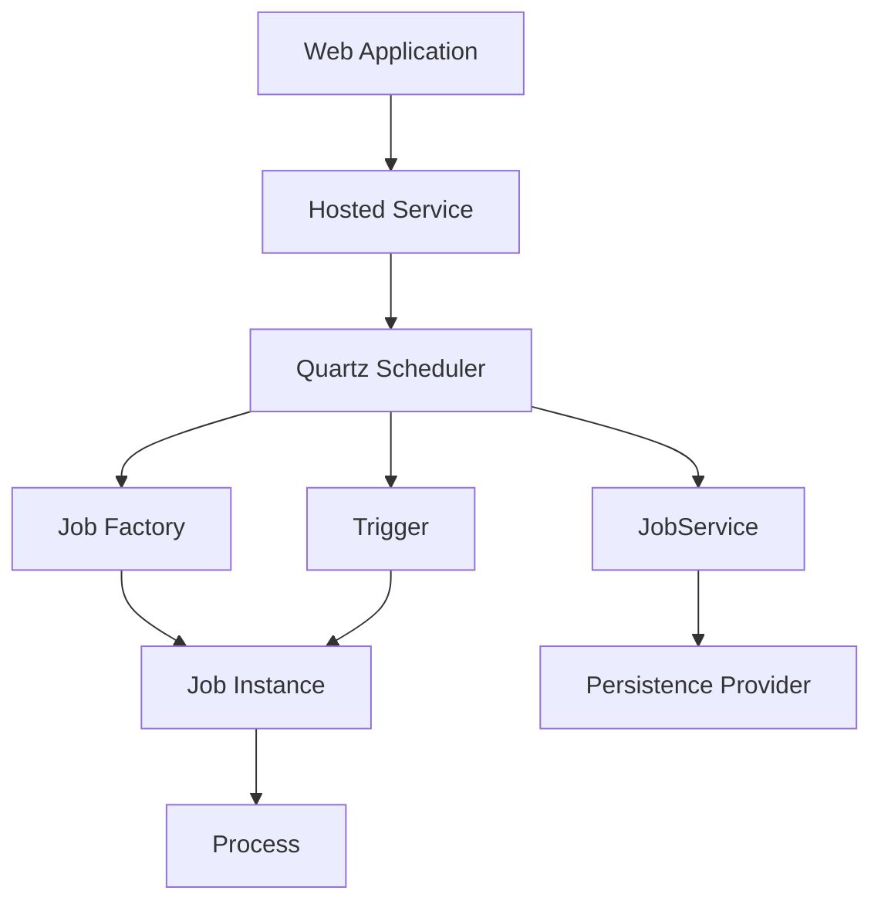

# JobScheduling Feature Documentation

[TOC]

## Overview

### Challenges

Implementing a reliable scheduling system within a web application often involves navigating a maze of technical hurdles. Developers must contend with creating background tasks that execute on precise schedules—whether for data aggregation, notifications, or system upkeep—without disrupting the application’s core functionality. Crafting custom threading mechanisms or integrating external schedulers can lead to brittle solutions prone to errors, especially when scaling to handle increased loads or ensuring compatibility with dependency injection frameworks. Flexibility in defining schedules, from simple intervals to complex cron-based patterns, demands an abstraction that remains both powerful and intuitive, while also providing visibility into execution history and status for monitoring and debugging purposes.

### Solution

The JobScheduling feature offers a robust resolution to these challenges by building atop Quartz.NET, a mature and widely respected scheduling library, and tailoring it for seamless integration into ASP.NET Core applications. This feature embeds Quartz.NET’s scheduling engine within a hosted service, managed through the ASP.NET Core dependency injection system, eliminating the need for ad-hoc threading or external tools. A fluent registration API streamlines the process of defining jobs, allowing developers to specify schedules, metadata, and execution scopes with clarity and minimal effort. Enhanced by the `JobBase` class, which provides properties like `LastProcessedDate` for tracking execution history, and the `JobService` interface for runtime job management, this solution ensures that scheduled tasks are both manageable and observable, delivering reliability and flexibility in equal measure.

### Use Cases

This scheduling system adapts effortlessly to a range of practical needs within web applications. Imagine an online platform requiring hourly inventory updates: a job can be scheduled to fetch stock levels and persist them to a database, triggered by a cron expression. In a content management system, a nightly task might archive outdated articles, maintaining performance without manual oversight. For real-time monitoring, a singleton job could poll system metrics every few minutes, leveraging its persistent state to detect anomalies over time. Even error-prone operations, like retrying failed API calls, benefit from the feature’s ability to track execution status and timing, enabling developers to build resilient workflows tailored to their application’s demands. Long-running tasks, such as file processing or data imports, can be designed with cancellation support for graceful interruption.

## Usage

Designed to empower developers with a Quartz.NET-backed scheduling solution, the JobScheduling feature integrates smoothly into ASP.NET Core web applications. By combining a fluent API for job registration with the enriched capabilities of the `JobBase` class, it provides a cohesive framework for defining and executing scheduled tasks. This section walks through the setup process, illustrates job creation with the updated `JobBase` (including cancellable long-running jobs), introduces runtime management via `JobService`, and explains the architectural flow that underpins the system.

### Basic Setup

To enable scheduling, the feature must be registered within the application’s service collection, typically in the `Program.cs` file, with the application’s configuration passed to load Quartz.NET settings. The following example demonstrates a basic setup:

```csharp
var builder = WebApplication.CreateBuilder(args);

builder.Services.AddJobScheduling(c => c.StartupDelay(5000))
    .WithJob<EchoJob>()
        .Cron("0 * * * * ?") // Every minute
        .Named("firstecho")
        .WithData("message", "First echo")
        .RegisterScoped()
    .WithJob<EchoJob>()
        .Cron("0/5 * * * * ?") // Every 5 seconds
        .Named("secondecho")
        .WithData("message", "Second echo")
        .Enabled(builder.Environment?.IsDevelopment() == true)
        .RegisterScoped();

var app = builder.Build();
app.Run();
```

Here, `AddJobScheduling` initializes the Quartz.NET scheduler, using the provided `IConfiguration` to load settings from `appsettings.json` (e.g., persistence configuration). The `StartupDelay(5000)` option delays scheduler startup by 5 seconds, allowing other services to initialize. The fluent chain begins with `WithJob<T>()`, specifying the job type (`EchoJob`), followed by `Cron()` for scheduling, `Named()` for a unique identifier, and `WithData()` for custom metadata. The `RegisterScoped()` method ensures each execution uses a new scoped instance, ideal for transient dependencies, while `RegisterSingleton()` can be used for persistent state:

```csharp
builder.Services.AddJobScheduling(c => c.StartupDelay(5000))
    .WithJob<MetricsMonitorJob>()
        .Cron("0 */5 * * * ?") // Every 5 minutes
        .Named("MetricsMonitor")
        .WithData("threshold", "95")
        .RegisterSingleton();
```

### Comprehensive Setup with SQL Server Persistence

For production-ready applications, you can configure multiple jobs with SQL Server persistence and behaviors for enhanced control:

```csharp
var builder = WebApplication.CreateBuilder(args);

builder.Services.AddJobScheduling(o => o
        .Enabled()
        .StartupDelay(builder.Configuration["JobScheduling:StartupDelay"]), builder.Configuration)
    .WithBehavior<ModuleScopeJobSchedulingBehavior>() // Module-specific scoping
    .WithBehavior<ChaosExceptionJobSchedulingBehavior>() // Fault injection for testing
    .WithBehavior<TimeoutJobSchedulingBehavior>() // Enforces timeouts
    .WithSqlServerStore(builder.Configuration["Modules:Core:ConnectionStrings:Default"]) // SQL Server persistence
    .WithJob<FileMonitoringLocationScanJob>()
        .Cron(CronExpressions.Every5Minutes)
        .Named("scan_sftp")
        .WithData(FileMonitoringLocationScanJob.DataKeys.LocationName, "SFTP")
        .WithData(FileMonitoringLocationScanJob.DataKeys.DelayPerFile, "00:00:01")
        .WithData(FileMonitoringLocationScanJob.DataKeys.FileFilter, "*.*")
        .WithData(FileMonitoringLocationScanJob.DataKeys.FileBlackListFilter, "*.tmp;*.log")
        .RegisterScoped()
    .WithJob<EchoJob>()
        .Cron(CronExpressions.EveryMinute)
        .Named("firstecho")
        .WithData("message", "First echo")
        .RegisterScoped()
    .WithJob<FailOftenJob>()
        .Cron(b => b.EveryMinutes(3).Build())
        .Named("failing")
        .WithData("Message", "Fail often")
        .RegisterScoped()
    .WithJob<LongRunningJob>()
        .Cron(CronExpressions.Every30Minutes)
        .Named("longrunning")
        .RegisterScoped()
    .WithJob<EchoJob>()
        .Cron(b => b.DayOfMonth(1).AtTime(23, 59).Build()) // "0 59 23 1 * ?"
        .Named("thirdecho")
        .WithData("message", "Third echo")
        .Enabled(builder.Environment?.IsDevelopment() == true)
        .RegisterScoped();

var app = builder.Build();
app.Run();
```

**Configuration Details:**
- **Persistence**: `WithSqlServerStore` enables durable storage using a connection string from configuration (see `Appendix: Configuring Persistence`).
- **Behaviors**: Adds scoping, fault injection, and timeouts for robustness.
- **Jobs**: Registers diverse jobs with custom schedules and metadata, showcasing flexibility.

**Configuration in `appsettings.json`:**
```json
{
  "JobScheduling": {
    "StartupDelay": "5000",
    "Quartz": {
      "quartz.scheduler.instanceName": "Scheduler",
      "quartz.jobStore.type": "Quartz.Impl.AdoJobStore.JobStoreTX, Quartz",
      "quartz.jobStore.driverDelegateType": "Quartz.Impl.AdoJobStore.SqlServerDelegate, Quartz",
      "quartz.dataSource.default.connectionString": "Server=localhost;Database=QuartzDb;Trusted_Connection=True;"
    }
  },
  "Modules": {
    "Core": {
      "ConnectionStrings": {
        "Default": "Server=localhost;Database=QuartzDb;Trusted_Connection=True;"
      }
    }
  }
}
```

Jobs are implemented by inheriting from `JobBase`, an abstract class that integrates with Quartz.NET and exposes a rich set of properties to streamline development. Developers override the `Process` method to define the job’s behavior. Consider this example of an echo job:

```csharp
public class EchoJob(ILoggerFactory loggerFactory) : JobBase(loggerFactory)
{
    public override async Task Process(IJobExecutionContext context, CancellationToken cancellationToken = default)
    {
        var logger = this.Logger.CreateLogger<EchoJob>();
        logger.LogInformation(
            "Job {JobName} echoing {Message} at {CurrentTime}, last run at {LastProcessedDate}",
            this.Name, this.Data["message"], DateTimeOffset.UtcNow, this.LastProcessedDate);

        await Task.Delay(1000, cancellationToken); // Simulate work
    }
}
```

### Implementing a Cancellable Long-Running Job

For long-running tasks, cancellation support is critical. Here’s an example of `LongRunningJob`:

```csharp
public class LongRunningJob(ILoggerFactory loggerFactory) : JobBase(loggerFactory)
{
    public override async Task Process(IJobExecutionContext context, CancellationToken cancellationToken = default)
    {
        for (var i = 0; i < 100; i++)
        {
            context.CancellationToken.ThrowIfCancellationRequested(); // causes job interruption

            this.Logger.LogInformation("{LogKey} processing step {Step} (jobKey={JobKey})", Constants.LogKey, i, context.JobDetail.Key);
            await Task.Delay(5000, context.CancellationToken);
        }
    }
}
```

**Registration:**
```csharp
.WithJob<LongRunningJob>()
    .Cron(CronExpressions.Every30Minutes)
    .Named("longrunning")
    .RegisterScoped();
```

**Notes**: Use `cancellationToken` to handle interruptions (e.g., shutdowns or manual stops via `JobService.InterruptJobAsync`).

### Managing Jobs with JobService

The `IJobService` interface enables runtime job management:

```csharp
public interface IJobService
{
    Task<IEnumerable<JobInfo>> GetJobsAsync(CancellationToken cancellationToken);
    Task<JobInfo> GetJobAsync(string jobName, string jobGroup, CancellationToken cancellationToken);
    Task TriggerJobAsync(string jobName, string jobGroup, IDictionary<string, object> data, CancellationToken cancellationToken);
    Task InterruptJobAsync(string jobName, string jobGroup, CancellationToken cancellationToken);
    Task PauseJobAsync(string jobName, string jobGroup, CancellationToken cancellationToken);
    Task ResumeJobAsync(string jobName, string jobGroup, CancellationToken cancellationToken);
    Task<IEnumerable<JobRun>> GetJobRunsAsync(string jobName, string jobGroup, /* filters */, CancellationToken cancellationToken);
    Task<JobRunStats> GetJobRunStatsAsync(string jobName, string jobGroup, /* date range */, CancellationToken cancellationToken);
}
```

**Example: Triggering a Job**
```csharp
var jobService = app.Services.GetRequiredService<IJobService>();
await jobService.TriggerJobAsync("longrunning", "DEFAULT", new Dictionary<string, object> { { "extra", "data" } }, CancellationToken.None);
```

**Example: Pausing a Job**
```csharp
await jobService.PauseJobAsync("scan_sftp", "DEFAULT", CancellationToken.None);
```

### Key Properties of JobBase

The `Name` property provides a consistent identifier for the job, derived from its description or key name as defined during registration. This eliminates the need to manually extract it from the `IJobExecutionContext`, ensuring it’s always available within the `Process` method. Similarly, the `Data` property delivers a dictionary of strings populated from the `JobDataMap`, reflecting metadata specified via `WithData` (e.g., `"message" = "First echo"`). This makes job-specific configuration readily accessible, simplifying logic that depends on runtime parameters.

A standout feature, the `LastProcessedDate` property captures the timestamp of the previous successful execution as a `DateTimeOffset`. Persisted across runs thanks to the `[PersistJobDataAfterExecution]` attribute, it starts as `DateTimeOffset.MinValue` on the first run and updates to the completion time of each subsequent execution. This historical context allows jobs to calculate intervals, detect delays, or process incremental data—such as changes since the last run—enhancing their utility in time-sensitive scenarios.

Complementing these, `ElapsedMilliseconds` tracks the duration of the current execution in milliseconds, updated post-run for performance monitoring. The `Status` property, an enum reflecting success or failure, pairs with `ErrorMessage` to log execution outcomes or capture exceptions, providing insight into job health. Finally, the `Logger` property, pre-initialized with the job’s type via the injected `ILoggerFactory`, facilitates consistent logging without additional setup.

### Leveraging LastProcessedDate

The `LastProcessedDate` property proves particularly valuable for jobs requiring awareness of their execution history. For example, a job might compare `LastProcessedDate` to the current time to identify scheduling lags or use it to filter data processed since the last run, such as new records in a database. This persistence is handled internally by `JobBase`, which updates the `JobDataMap` after each execution. The `[PersistJobDataAfterExecution]` attribute ensures this value carries forward, maintaining continuity across runs without developer intervention.

### Controlling Job Execution

For jobs intended to remain inactive until explicitly enabled, the `Enabled` method in the fluent API allows registration without immediate execution. This is useful for staging jobs during development or deployment, as shown in the second `EchoJob` example above, where it’s enabled only in development:

```csharp
.WithJob<EchoJob>()
    .Cron("0/5 * * * * ?")
    .Named("secondecho")
    .WithData("message", "Second echo")
    .Enabled(builder.Environment?.IsDevelopment() == true)
    .RegisterScoped();
```

An older, more verbose syntax is retained for compatibility, though the fluent API is recommended for its elegance:

```csharp
builder.Services.AddJobScheduling(c => c.StartupDelay(5000))
    .WithJob<LegacyJob>("0 0 * * * ?", "HourlyTask", new Dictionary<string, string> { { "key", "value" } }, true);
```

The architecture hinges on a hosted service that drives the Quartz.NET scheduler, now extended with `JobService` and persistence providers:



The web application launches a hosted service that initializes the Quartz scheduler. This scheduler collaborates with a job factory, tied to ASP.NET Core’s dependency injection, to instantiate job classes derived from `JobBase`. Triggers, governed by cron expressions, prompt the scheduler to execute the `Process` method at designated times. `JobService` provides runtime control and integrates with persistence providers (e.g., SQL Server, in-memory) for history and state management. Within `JobBase`, properties like `Name`, `Data`, `LastProcessedDate`, and `Logger` enrich the job’s capabilities, providing identity, configuration, history, and logging without additional setup. The `[DisallowConcurrentExecution]` attribute ensures thread safety by preventing overlapping runs, while `[PersistJobDataAfterExecution]` guarantees that properties like `LastProcessedDate` persist across executions.

To prevent concurrent execution explicitly, developers can apply the `[DisallowConcurrentExecution]` attribute directly to a job class:

```csharp
[DisallowConcurrentExecution]
public class NonConcurrentJob(ILoggerFactory loggerFactory) : JobBase(loggerFactory)
{
    public override async Task Process(IJobExecutionContext context, CancellationToken cancellationToken = default)
    {
        this.Logger.LogInformation(
            "Non-concurrent job {JobName} started, last run at {LastProcessedDate}",
            this.Name, this.LastProcessedDate);
        await Task.Delay(2000, cancellationToken); // Simulate long task
    }
}
```

This job, when scheduled frequently (e.g., every second), ensures only one instance runs at a time, queuing subsequent triggers until completion—a feature inherited from Quartz.NET and enforced by `JobBase`.

By leveraging this JobScheduling feature, developers gain a sophisticated yet accessible toolset for managing scheduled tasks. The fluent API simplifies configuration, `JobBase` delivers essential properties, and `JobService` adds runtime management, ensuring web applications can execute recurring tasks efficiently and reliably.

## Appendix: Configuring Quartz.NET Persistence with SQL Server

For applications requiring durable job storage—such as preserving schedules and execution history across restarts—Quartz.NET supports persistence with SQL Server via its ADO.NET job store. This appendix explains how to configure this persistence using JSON settings in `appsettings.json` and a startup task to initialize the necessary SQL Server tables, as demonstrated in the comprehensive setup example.

### Configuration Steps

1. **Install Required Packages**:
   Ensure the project includes the `Quartz` and `Quartz.Extensions.Hosting` NuGet packages, which provide the core Quartz.NET functionality and hosted service integration, including SQL Server support.

2. **Define JSON Configuration**:
   Add the following Quartz.NET settings to `appsettings.json` to enable SQL Server persistence. These settings are loaded by `AddJobScheduling` when the configuration is passed (see the comprehensive setup example):

   ```json
   {
     "JobScheduling": {
       "Quartz": {
         "quartz.scheduler.instanceName": "Scheduler",
         "quartz.scheduler.instanceId": "AUTO",
         "quartz.jobStore.type": "Quartz.Impl.AdoJobStore.JobStoreTX, Quartz",
         "quartz.jobStore.driverDelegateType": "Quartz.Impl.AdoJobStore.SqlServerDelegate, Quartz",
         "quartz.jobStore.dataSource": "default",
         "quartz.dataSource.default.provider": "SqlServer",
         "quartz.dataSource.default.connectionString": "Server=localhost;Database=QuartzDb;Trusted_Connection=True;",
         "quartz.jobStore.useProperties": "false",
         "quartz.jobStore.clustered": "false",
         "quartz.serializer.type": "json"
       }
     }
   }
   ```

   - `quartz.jobStore.type`: Specifies the transactional ADO.NET job store (`JobStoreTX`).
   - `quartz.jobStore.driverDelegateType`: Uses `SqlServerDelegate` for SQL Server-specific operations.
   - `quartz.jobStore.dataSource` and `quartz.dataSource.default.provider`: Define the data source and SQL Server provider.
   - `quartz.dataSource.default.connectionString`: Sets the connection string (adjust for your environment).
   - `quartz.jobStore.useProperties`: Enables string-based property storage.
   - `quartz.jobStore.clustered`: Set to `true` for clustered deployments (optional).
   - `quartz.serializer.type`: Uses JSON serialization for job data (optional).

3. **Register the Feature and Startup Task**:
   In `Program.cs`, register the JobScheduling feature with the configuration and add a startup task to create the SQL tables, as shown in the comprehensive setup:

   ```csharp
   builder.Services.AddJobScheduling(o => o
           .Enabled()
           .StartupDelay(builder.Configuration["JobScheduling:StartupDelay"]), builder.Configuration)
       .WithSqlServerStore(builder.Configuration["Modules:Core:ConnectionStrings:Default"])
       .WithJob<EchoJob>()
           .Cron("0 * * * * ?")
           .Named("firstecho")
           .RegisterScoped();

   builder.Services.AddStartupTasks()
       .WithTask<JobSchedulingSqlServerSeederStartupTask>();
   ```

   The `JobSchedulingSqlServerSeederStartupTask` initializes Quartz.NET tables if persistence is enabled.

### Generated SQL Tables

The `JobSchedulingSqlServerSeederStartupTask` creates tables like `QRTZ_JOB_DETAILS`, `QRTZ_TRIGGERS`, and `QRTZ_JOURNAL_TRIGGERS` for job and trigger data persistence (full list in original).

### Validation

Verify table creation in the specified database (`QuartzDb`) and test job persistence across restarts.

## Appendix: Additional Persistence Options

Beyond SQL Server, the feature supports other persistence providers:

### PostgreSQL Persistence

```csharp
.WithPostgresStore("Host=localhost;Database=QuartzDb;Username=postgres;Password=secret", "[public].[QRTZ_")
```

**Notes**: Uses `JobSchedulingSqlServerSeederStartupTask` (adapts to Postgres) for table creation.

### SQLite Persistence

```csharp
.WithSqliteStore("Data Source=quartz.db", "QRTZ_")
```

**Notes**: `JobSchedulingSqliteSeederStartupTask` creates the database file and tables.

### In-Memory Persistence

```csharp
.WithInMemoryStore(TimeSpan.FromHours(1)) // Retains history for 1 hour
```

**Notes**: No durability; ideal for testing.

### Null Persistence

Default if no store is specified; no history retained.

## Appendix: Constructing Cron Expressions

Scheduling jobs in the JobScheduling feature hinges on Quartz.NET’s 6-field cron expressions, defining execution times in the format: `[Seconds] [Minutes] [Hours] [Day of Month] [Month] [Day of Week]`. Developers have two powerful tools at their disposal: the `CronExpressions` struct, offering a library of predefined constants for common schedules, and the `CronExpressionBuilder`, a fluent API for crafting custom expressions. This appendix guides developers through both approaches, showcasing their strengths with practical examples, including how to schedule a job for the first day of every month at 11:59 PM, ensuring clarity and versatility in job configuration.

### Using Fixed Cron Expressions

The `CronExpressions` struct provides a rich set of static constants for frequently used schedules, making it an efficient choice for standard patterns. These predefined expressions are readily available in the `BridgingIT.DevKit.Application` namespace and can be applied directly to the `Cron` method in `JobScheduleBuilder`. Here are some examples:

- **Every 5 Seconds**: `CronExpressions.Every5Seconds` ("0/5 * * * * ?") runs a job every 5 seconds, ideal for frequent tasks like health checks:
  ```csharp
  builder.Services
      .AddJobScheduling(builder.Configuration)
      .WithJob<HeartbeatJob>()
          .Cron(CronExpressions.Every5Seconds)
          .RegisterScoped();
  ```

- **Daily at Midnight**: `CronExpressions.DailyAtMidnight` ("0 0 0 * * ?") triggers a job at 00:00:00 daily, perfect for nightly maintenance:
  ```csharp
  builder.Services
      .AddJobScheduling(builder.Configuration)
      .WithJob<CleanupJob>()
          .Cron(CronExpressions.DailyAtMidnight)
          .RegisterScoped();
  ```

- **First Day of Every Month at 11:59 PM**: While `CronExpressions` doesn’t have an exact match, `CronExpressions.MonthlyAtMidnightOnFirstDay` ("0 0 0 1 * ?") is close. To adjust to 11:59 PM, developers can tweak it manually or use the builder (shown later), but here’s a direct string approach inspired by the struct:
  ```csharp
  builder.Services
      .AddJobScheduling(builder.Configuration)
      .WithJob<MonthlyReportJob>()
          .Cron("0 59 23 1 * ?") // Derived from MonthlyAtMidnightOnFirstDay, adjusted to 23:59
          .RegisterScoped();
  ```

These constants, like `CronExpressions.EveryMinute` ("0 0/1 * * * ?") or `CronExpressions.WeeklyOnWednesdayAtMidnight` ("0 0 0 * * WED"), offer a quick, reliable way to apply tested schedules. They’re ideal for static, well-known patterns but require manual string manipulation for slight variations, such as shifting midnight to 11:59 PM.

### Using the CronExpressionBuilder

For greater flexibility or custom schedules, the `CronExpressionBuilder` provides a fluent, programmatic interface integrated into the `JobScheduleBuilder`’s `Cron` method. It allows developers to construct expressions step-by-step, leveraging type-safe enums and integer inputs. Below are examples mirroring the fixed expressions and your specific request:

- **Every 5 Seconds**: Use `EverySeconds` to match `CronExpressions.Every5Seconds`:
  ```csharp
  builder.Services
      .AddJobScheduling(builder.Configuration)
      .WithJob<HeartbeatJob>()
          .Cron(b => b.EverySeconds(5).Build())
          .RegisterScoped();
  ```
  This builds `"0/5 * * * * ?"`, identical to the fixed constant but expressed fluently.

- **Daily at Midnight**: Replicate `CronExpressions.DailyAtMidnight` with `AtTime`:
  ```csharp
  builder.Services
      .AddJobScheduling(builder.Configuration)
      .WithJob<CleanupJob>()
          .Cron(b => b.AtTime(0, 0, 0).Build())
          .RegisterScoped();
  ```
  This produces `"0 0 0 * * ?"`, matching the predefined expression with explicit time settings.

- **First Day of Every Month at 11:59 PM**: Construct this precise schedule directly:
  ```csharp
  builder.Services
      .AddJobScheduling(builder.Configuration)
      .WithJob<MonthlyReportJob>()
          .Cron(b => b
              .DayOfMonth(1)
              .AtTime(23, 59, 0)
              .Build())
          .Named("monthlyReport")
          .RegisterScoped();
  ```
  The result, `"0 59 23 1 * ?"`, schedules the job at 23:59:00 on the 1st of each month, aligning with your requirement. Here, `DayOfMonth(1)` sets the day, and `AtTime(23, 59, 0)` specifies 11:59 PM.

- **Every Wednesday at 9:30 AM**: Match `CronExpressions.WeeklyOnWednesdayAtMidnight` with adjustments:
  ```csharp
  builder.Services
      .AddJobScheduling(builder.Configuration)
      .WithJob<WeeklyMeetingJob>()
          .Cron(b => b
              .DayOfWeek(CronDayOfWeek.Wednesday)
              .AtTime(9, 30)
              .Build())
          .RegisterScoped();
  ```
  This yields `"0 30 9 ? * WED"`, shifting the midnight timing to 9:30 AM.

- **Specific Date and Time (e.g., March 27, 2025, 2:30 PM)**: Use `AtDateTime` for one-time triggers:
  ```csharp
  builder.Services
      .AddJobScheduling(builder.Configuration)
      .WithJob<OneTimeJob>()
          .Cron(b => b
              .AtDateTime(new DateTimeOffset(2025, 3, 27, 14, 30, 0, TimeSpan.Zero))
              .Build())
          .RegisterScoped();
  ```
  This generates `"0 30 14 27 3 ?"`, targeting a single execution.

The builder’s methods, such as `EveryMinutes(15)` ("0 0/15 * * * ?") or `HoursRange(8, 17)` ("0 * 8-17 * * ?"), offer granular control. Enums like `CronDayOfWeek` and `CronMonth` ensure type safety, mapping to Quartz’s three-letter abbreviations (e.g., "WED", "JAN"), while integer inputs (e.g., `Minutes(59)`) simplify numeric fields.