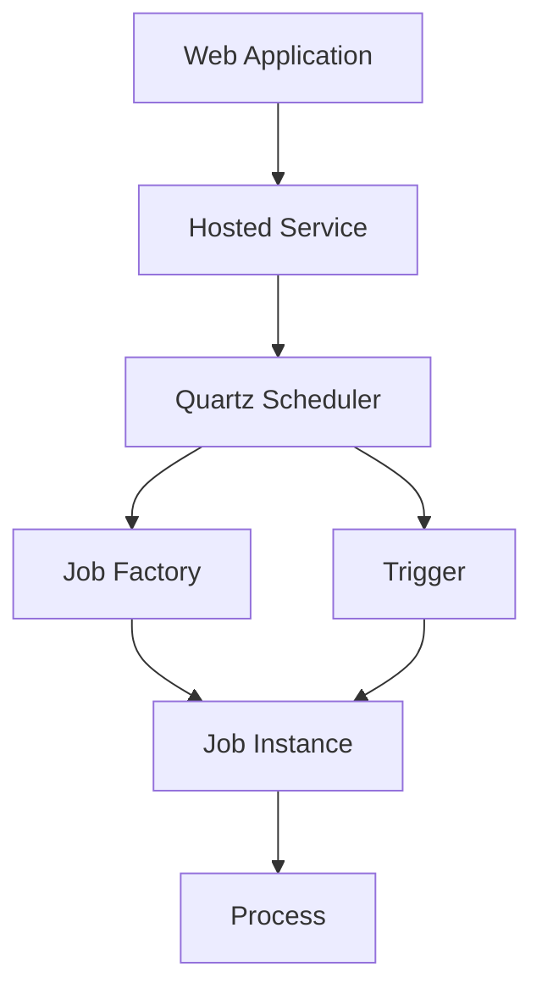

# JobScheduling Feature Documentation

[TOC]

## Overview

### Challenges

Implementing a reliable scheduling system within a web application often involves navigating a maze of technical hurdles. Developers must contend with creating background tasks that execute on precise schedules—whether for data aggregation, notifications, or system upkeep—without disrupting the application’s core functionality. Crafting custom threading mechanisms or integrating external schedulers can lead to brittle solutions prone to errors, especially when scaling to handle increased loads or ensuring compatibility with dependency injection frameworks. Flexibility in defining schedules, from simple intervals to complex cron-based patterns, demands an abstraction that remains both powerful and intuitive, while also providing visibility into execution history and status for monitoring and debugging purposes.

### Solution

The JobScheduling feature offers a robust resolution to these challenges by building atop Quartz.NET, a mature and widely respected scheduling library, and tailoring it for seamless integration into ASP.NET Core applications. This feature embeds Quartz.NET’s scheduling engine within a hosted service, managed through the ASP.NET Core dependency injection system, eliminating the need for ad-hoc threading or external tools. A fluent registration API streamlines the process of defining jobs, allowing developers to specify schedules, metadata, and execution scopes with clarity and minimal effort. Enhanced by the `JobBase` class, which provides properties like `LastProcessedDate` for tracking execution history, this solution ensures that scheduled tasks are both manageable and observable, delivering reliability and flexibility in equal measure.

### Use Cases

This scheduling system adapts effortlessly to a range of practical needs within web applications. Imagine an online platform requiring hourly inventory updates: a job can be scheduled to fetch stock levels and persist them to a database, triggered by a cron expression. In a content management system, a nightly task might archive outdated articles, maintaining performance without manual oversight. For real-time monitoring, a singleton job could poll system metrics every few minutes, leveraging its persistent state to detect anomalies over time. Even error-prone operations, like retrying failed API calls, benefit from the feature’s ability to track execution status and timing, enabling developers to build resilient workflows tailored to their application’s demands.

## Usage

Designed to empower developers with a Quartz.NET-backed scheduling solution, the JobScheduling feature integrates smoothly into ASP.NET Core web applications. By combining a fluent API for job registration with the enriched capabilities of the `JobBase` class, it provides a cohesive framework for defining and executing scheduled tasks. This section walks through the setup process, illustrates job creation with the updated `JobBase`, and explains the architectural flow that underpins the system.

To enable scheduling, the feature must be registered within the application’s service collection, typically in the `Program.cs` file, with the application’s configuration passed to load Quartz.NET settings. The following example demonstrates this setup:

```csharp
var builder = WebApplication.CreateBuilder(args);

builder.Services.AddJobScheduling(c => c.StartupDelay(5000))
    .WithJob<EchoJob>()
        .Cron("0 * * * * ?") // Every minute
        .Named("firstecho")
        .WithData("message", "First echo")
        .RegisterScoped()
    .WithJob<EchoJob>()
        .Cron("0/5 * * * * ?") // Every 5 seconds
        .Named("secondecho")
        .WithData("message", "Second echo")
        .Enabled(builder.Environment?.IsDevelopment() == true)
        .RegisterScoped();

var app = builder.Build();
app.Run();
```

Here, `AddJobScheduling` initializes the Quartz.NET scheduler, using the provided `IConfiguration` to load settings from `appsettings.json` (e.g., persistence configuration). The `StartupDelay(5000)` option delays scheduler startup by 5 seconds, allowing other services to initialize. The fluent chain begins with `WithJob<T>()`, specifying the job type (`EchoJob`), followed by `Cron()` for scheduling, `Named()` for a unique identifier, and `WithData()` for custom metadata. The `RegisterScoped()` method ensures each execution uses a new scoped instance, ideal for transient dependencies, while `RegisterSingleton()` can be used for persistent state:

```csharp
builder.Services.AddJobScheduling(c => c.StartupDelay(5000))
    .WithJob<MetricsMonitorJob>()
        .Cron("0 */5 * * * ?") // Every 5 minutes
        .Named("MetricsMonitor")
        .WithData("threshold", "95")
        .RegisterSingleton();
```

Jobs are implemented by inheriting from `JobBase`, an abstract class that integrates with Quartz.NET and exposes a rich set of properties to streamline development. Developers override the `Process` method to define the job’s behavior. Consider this example of an echo job:

```csharp
public class EchoJob(ILoggerFactory loggerFactory) : JobBase(loggerFactory)
{
    public override async Task Process(IJobExecutionContext context, CancellationToken cancellationToken = default)
    {
        var logger = this.Logger.CreateLogger<EchoJob>();
        logger.LogInformation(
            "Job {JobName} echoing {Message} at {CurrentTime}, last run at {LastProcessedDate}",
            this.Name, this.Data["message"], DateTimeOffset.UtcNow, this.LastProcessedDate);

        await Task.Delay(1000, cancellationToken); // Simulate work
    }
}
```

In this implementation, `JobBase` equips developers with a suite of properties that streamline job development, offering immediate access to essential information and execution context. These properties, set automatically by the base class, reduce boilerplate and enhance the robustness of job logic.

#### Key Properties of JobBase

The `Name` property provides a consistent identifier for the job, derived from its description or key name as defined during registration. This eliminates the need to manually extract it from the `IJobExecutionContext`, ensuring it’s always available within the `Process` method. Similarly, the `Data` property delivers a dictionary of strings populated from the `JobDataMap`, reflecting metadata specified via `WithData` (e.g., `"message" = "First echo"`). This makes job-specific configuration readily accessible, simplifying logic that depends on runtime parameters.

A standout feature, the `LastProcessedDate` property captures the timestamp of the previous successful execution as a `DateTimeOffset`. Persisted across runs thanks to the `[PersistJobDataAfterExecution]` attribute, it starts as `DateTimeOffset.MinValue` on the first run and updates to the completion time of each subsequent execution. This historical context allows jobs to calculate intervals, detect delays, or process incremental data—such as changes since the last run—enhancing their utility in time-sensitive scenarios.

Complementing these, `ElapsedMilliseconds` tracks the duration of the current execution in milliseconds, updated post-run for performance monitoring. The `Status` property, an enum reflecting success or failure, pairs with `ErrorMessage` to log execution outcomes or capture exceptions, providing insight into job health. Finally, the `Logger` property, pre-initialized with the job’s type via the injected `ILoggerFactory`, facilitates consistent logging without additional setup.

#### Leveraging LastProcessedDate

The `LastProcessedDate` property proves particularly valuable for jobs requiring awareness of their execution history. For example, a job might compare `LastProcessedDate` to the current time to identify scheduling lags or use it to filter data processed since the last run, such as new records in a database. This persistence is handled internally by `JobBase`, which updates the `JobDataMap` after each execution. The `[PersistJobDataAfterExecution]` attribute ensures this value carries forward, maintaining continuity across runs without developer intervention.

#### Controlling Job Execution

For jobs intended to remain inactive until explicitly enabled, the `Enabled` method in the fluent API allows registration without immediate execution. This is useful for staging jobs during development or deployment, as shown in the second `EchoJob` example above, where it’s enabled only in development:

```csharp
.WithJob<EchoJob>()
    .Cron("0/5 * * * * ?")
    .Named("secondecho")
    .WithData("message", "Second echo")
    .Enabled(builder.Environment?.IsDevelopment() == true)
    .RegisterScoped();
```

An older, more verbose syntax is retained for compatibility, though the fluent API is recommended for its elegance:

```csharp
builder.Services.AddJobScheduling(c => c.StartupDelay(5000))
    .WithJob<LegacyJob>("0 0 * * * ?", "HourlyTask", new Dictionary<string, string> { { "key", "value" } }, true);
```

The architecture hinges on a hosted service that drives the Quartz.NET scheduler, as depicted in this Mermaid diagram:



The web application launches a hosted service that initializes the Quartz scheduler. This scheduler collaborates with a job factory, tied to ASP.NET Core’s dependency injection, to instantiate job classes derived from `JobBase`. Triggers, governed by cron expressions, prompt the scheduler to execute the `Process` method at designated times. Within `JobBase`, properties like `Name`, `Data`, `LastProcessedDate`, and `Logger` enrich the job’s capabilities, providing identity, configuration, history, and logging without additional setup. The `[DisallowConcurrentExecution]` attribute ensures thread safety by preventing overlapping runs, while `[PersistJobDataAfterExecution]` guarantees that properties like `LastProcessedDate` persist across executions.

To prevent concurrent execution explicitly, developers can apply the `[DisallowConcurrentExecution]` attribute directly to a job class:

```csharp
[DisallowConcurrentExecution]
public class NonConcurrentJob(ILoggerFactory loggerFactory) : JobBase(loggerFactory)
{
    public override async Task Process(IJobExecutionContext context, CancellationToken cancellationToken = default)
    {
        this.Logger.LogInformation(
            "Non-concurrent job {JobName} started, last run at {LastProcessedDate}",
            this.Name, this.LastProcessedDate);
        await Task.Delay(2000, cancellationToken); // Simulate long task
    }
}
```

This job, when scheduled frequently (e.g., every second), ensures only one instance runs at a time, queuing subsequent triggers until completion—a feature inherited from Quartz.NET and enforced by `JobBase`.

By leveraging this JobScheduling feature, developers gain a sophisticated yet accessible toolset for managing scheduled tasks. The fluent API simplifies configuration, while `JobBase` delivers essential properties like `Name`, `Data`, and `LastProcessedDate`, enabling robust job implementations with minimal overhead. Rooted in Quartz.NET, the system balances ease of use with advanced scheduling capabilities, ensuring web applications can execute recurring tasks efficiently and reliably.

## Appendix: Configuring Quartz.NET Persistence with SQL Server

For applications requiring durable job storage—such as preserving schedules and execution history across restarts—Quartz.NET supports persistence with SQL Server via its ADO.NET job store. This appendix explains how to configure this persistence using JSON settings in `appsettings.json` and a startup task to initialize the necessary SQL Server tables.

### Configuration Steps

1. **Install Required Packages**:
   Ensure the project includes the `Quartz` and `Quartz.Extensions.Hosting` NuGet packages, which provide the core Quartz.NET functionality and hosted service integration, including SQL Server support.

2. **Define JSON Configuration**:
   Add the following Quartz.NET settings to `appsettings.json` to enable SQL Server persistence. These settings are loaded by `AddJobScheduling` when the configuration is passed:

   ```json
   {
     "JobScheduling": {
       "Quartz": {
         "quartz.scheduler.instanceName": "Scheduler",
         "quartz.scheduler.instanceId": "AUTO",
         "quartz.jobStore.type": "Quartz.Impl.AdoJobStore.JobStoreTX, Quartz",
         "quartz.jobStore.driverDelegateType": "Quartz.Impl.AdoJobStore.SqlServerDelegate, Quartz",
         "quartz.jobStore.dataSource": "default",
         "quartz.dataSource.default.provider": "SqlServer",
         "quartz.dataSource.default.connectionString": "Server=localhost;Database=QuartzDb;Trusted_Connection=True;",
         "quartz.jobStore.useProperties": "true",
         "quartz.jobStore.clustered": "false",
         "quartz.serializer.type": "json"
       }
     }
   }
   ```

   - `quartz.jobStore.type`: Specifies the transactional ADO.NET job store (`JobStoreTX`).
   - `quartz.jobStore.driverDelegateType`: Uses `SqlServerDelegate` for SQL Server-specific operations.
   - `quartz.jobStore.dataSource` and `quartz.dataSource.default.provider`: Define the data source and SQL Server provider.
   - `quartz.dataSource.default.connectionString`: Sets the connection string (adjust for your environment).
   - `quartz.jobStore.useProperties`: Enables string-based property storage.
   - `quartz.jobStore.clustered`: Set to `true` for clustered deployments (optional).
   - `quartz.serializer.type`: Uses JSON serialization for job data (optional).

3. **Register the Feature and Startup Task**:
   In `Program.cs`, register the JobScheduling feature with the configuration and, if persistence is needed, add a startup task to create the SQL tables:

   ```csharp
   var builder = WebApplication.CreateBuilder(args);

   builder.Services.AddJobScheduling(c => c.StartupDelay(5000), builder.Configuration)
       .WithJob<EchoJob>()
           .Cron("0 * * * * ?") // Every minute
           .Named("firstecho")
           .WithData("message", "First echo")
           .RegisterScoped()
       .WithJob<EchoJob>()
           .Cron("0/5 * * * * ?") // Every 5 seconds
           .Named("secondecho")
           .WithData("message", "Second echo")
           .RegisterScoped();

   // Add startup task for SQL Server persistence (if configured)
   builder.Services.AddStartupTasks()
       .WithTask<JobSchedulingSqlServerSeederStartupTask>();

   var app = builder.Build();
   app.Run();
   ```

   The `JobSchedulingSqlServerSeederStartupTask`, available in the system, uses the configuration from `JobScheduling:Quartz` to initialize the Quartz.NET tables in SQL Server if persistence is enabled (e.g., when `quartz.jobStore.type` is set).

### Generated SQL Tables

The `JobSchedulingSqlServerSeederStartupTask` creates the following tables in SQL Server, as defined in `SqlStatements.QuartzTables`. These tables store job and trigger data for persistence:

| Table Name                  | Purpose                                                                 |
|-----------------------------|-------------------------------------------------------------------------|
| `QRTZ_CALENDARS`            | Stores calendar definitions for scheduling exclusions                  |
| `QRTZ_CRON_TRIGGERS`        | Holds cron expression data for cron-based triggers                     |
| `QRTZ_FIRED_TRIGGERS`       | Tracks currently executing triggers                                    |
| `QRTZ_PAUSED_TRIGGER_GRPS`  | Lists paused trigger groups                                            |
| `QRTZ_SCHEDULER_STATE`      | Maintains scheduler instance state for clustering                      |
| `QRTZ_LOCKS`                | Manages locks for scheduler coordination                               |
| `QRTZ_JOB_DETAILS`          | Stores job definitions and metadata                                    |
| `QRTZ_SIMPLE_TRIGGERS`      | Contains data for simple (interval-based) triggers                     |
| `QRTZ_SIMPROP_TRIGGERS`     | Stores properties for simple triggers with additional parameters       |
| `QRTZ_BLOB_TRIGGERS`        | Holds binary data for custom trigger types                             |
| `QRTZ_TRIGGERS`             | Central table for all trigger definitions and states                   |
| `QRTZ_JOURNAL_TRIGGERS`     | Custom table for trigger execution history (non-standard Quartz table) |

These tables, prefixed with `QRTZ_` by default (configurable via `tablePrefix`), ensure that job schedules, states, and history persist across application restarts when SQL Server persistence is configured.

### Validation

After startup, verify that the Quartz.NET tables exist in the specified SQL Server database (`QuartzDb` in the example) if persistence is enabled. Schedule a job, restart the application, and confirm that the job’s schedule and `LastProcessedDate` persist. This approach leverages the JSON configuration for persistence settings and automates table creation via the startup task, simplifying deployment while ensuring durability.

This persistence layer enhances the JobScheduling feature’s reliability, making it ideal for production environments where job continuity is critical.

