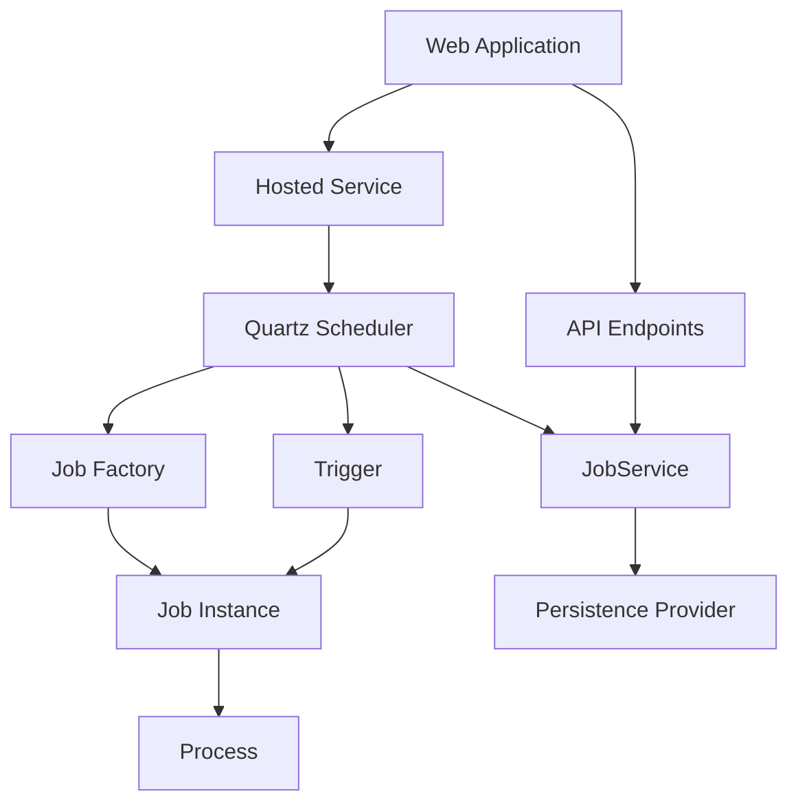

# JobScheduling

> Legacy Quartz-backed scheduler. For new development, prefer [Jobs](./features-jobs.md). Migration is source-level only; Quartz tables and trigger records are not reused by `Application.Jobs`.
> Schedule and run background jobs through the legacy Quartz.NET integration.

[TOC]

## Overview

JobScheduling is the legacy Quartz.NET-backed scheduling feature. It registers Quartz as an ASP.NET Core hosted service, resolves jobs through dependency injection, and provides optional run-history stores and operational endpoints. For new development, use [Jobs](./features-jobs.md); the two runtimes do not share schedules or persistence records.

## Challenges

Applications often need recurring or manually triggered work without managing threads inside request handlers. A scheduler must resolve scoped dependencies, apply predictable timing, support cancellation, and expose enough state for operators to inspect or control registered jobs.

## Solution

`AddJobScheduling(...)` hosts Quartz.NET and returns a fluent builder for job definitions. Jobs can derive from `JobBase`, which records the previous run state in the Quartz job data map. `IJobService` provides runtime control, while optional stores retain execution history and optional endpoints expose those operations over HTTP.

## Key Features

- Quartz.NET six-field cron schedules
- scoped or singleton job activation through dependency injection
- reusable execution behaviors for module scope, timeout, retry, metrics, and fault injection
- manual trigger, pause, resume, interrupt, history, and statistics operations through `IJobService`
- null, in-memory, SQL Server, PostgreSQL, and SQLite run-history providers
- optional minimal API endpoints and console commands

## Architecture

`JobSchedulingService` starts the Quartz scheduler and registers the configured `JobSchedule` instances. `ScopedJobFactory` creates jobs from the application service provider. `JobBase` wraps the job body with state capture and configured `IJobSchedulingBehavior` instances. `JobService` combines Quartz control operations with the selected `IJobStoreProvider`; endpoint and console-command adapters call that service.

## Use Cases

- Run periodic cleanup, synchronization, reporting, or monitoring tasks in an existing Quartz-based application.
- Trigger a registered job on demand from application code or an operational endpoint.
- Retain and query execution history through a supported store.
- Pause, resume, or interrupt long-running jobs during operations.

## Basic Usage

The following example registers the built-in `EchoJob`, retains one hour of run history in memory, and exposes an application endpoint that triggers the job safely. A successful request returns `202 Accepted`; a Quartz scheduling error returns a problem response.

```csharp
using BridgingIT.DevKit.Application;
using BridgingIT.DevKit.Application.JobScheduling;
using Quartz;

var builder = WebApplication.CreateBuilder(args);

builder.Services
    .AddJobScheduling(options => options.StartupDelay(TimeSpan.Zero))
    .WithInMemoryStore(TimeSpan.FromHours(1))
    .WithJob<EchoJob>()
        .Cron(CronExpressions.EveryMinute)
        .Named("echo", "DEFAULT")
        .WithData("message", "Scheduler is running")
        .RegisterScoped();

var app = builder.Build();

app.MapPost("/jobs/echo/run", async (
    IJobService jobs,
    CancellationToken cancellationToken) =>
{
    try
    {
        await jobs.TriggerJobAsync(
            "echo",
            "DEFAULT",
            new Dictionary<string, object>(),
            cancellationToken);

        return Results.Accepted(value: new { Job = "echo", Status = "Triggered" });
    }
    catch (SchedulerException exception)
    {
        return Results.Problem(
            title: "The job could not be triggered.",
            detail: exception.Message);
    }
});

app.Run();
```

After the host starts, `POST /jobs/echo/run` returns the accepted response and the job writes `Scheduler is running` through its logger.

## Registration and operation

JobScheduling integrates Quartz.NET with ASP.NET Core dependency injection and hosted services. The sections below cover job registration, `JobBase`, cancellation, runtime control through `JobService`, operational endpoints, and the execution flow.

### Basic setup

Register scheduling in the application's service collection. Pass the application configuration when the scheduler must load Quartz.NET settings. The following example shows the basic setup:

```csharp
var builder = WebApplication.CreateBuilder(args);

builder.Services.AddJobScheduling(c => c.StartupDelay(5000))
    .WithJob<EchoJob>()
        .Cron("0 * * * * ?") // Every minute
        .Named("firstecho")
        .WithData("message", "First echo")
        .RegisterScoped()
    .WithJob<EchoJob>()
        .Cron("0/5 * * * * ?") // Every 5 seconds
        .Named("secondecho")
        .WithData("message", "Second echo")
        .Enabled(builder.Environment?.IsDevelopment() == true)
        .RegisterScoped();

var app = builder.Build();
app.Run();
```

Here, `AddJobScheduling` initializes the Quartz.NET scheduler. No `IConfiguration` is passed in this example; pass `builder.Configuration` when Quartz settings must be loaded from `JobScheduling:Quartz`. `StartupDelay(5000)` delays scheduler startup by 5 seconds. The fluent chain begins with `WithJob<T>()`, followed by `Cron()` for scheduling, `Named()` for a unique identifier, and `WithData()` for custom metadata. `RegisterScoped()` creates a scoped job instance for each activation. `RegisterSingleton()` reuses one job instance, but durable state still depends on the configured Quartz store:

```csharp
builder.Services.AddJobScheduling(c => c.StartupDelay(5000))
    .WithJob<MetricsMonitorJob>()
        .Cron("0 */5 * * * ?") // Every 5 minutes
        .Named("MetricsMonitor")
        .WithData("threshold", "95")
        .RegisterSingleton();
```

### Comprehensive setup with SQL Server history and API endpoints

The following configuration combines Quartz persistence settings, SQL Server run-history access, behaviors, and operational endpoints:

```csharp
var builder = WebApplication.CreateBuilder(args);

builder.Services.AddJobScheduling(o => o.StartupDelay("00:00:10"), builder.Configuration)
    .WithBehavior<ModuleScopeJobSchedulingBehavior>() // Module-specific scoping
    .WithBehavior<TimeoutJobSchedulingBehavior>() // Enforces timeouts
    .WithSqlServerStore(builder.Configuration["Modules:Core:ConnectionStrings:Default"]) // SQL Server run history
    .AddEndpoints(builder.Environment.IsDevelopment()) // Enables API endpoints in development
    .WithJob<HealthCheckJob>()
        .Cron(CronExpressions.Every5Minutes)
        .Named("healthcheck")
        .RegisterScoped()
    .WithJob<LongRunningJob>()
        .Cron(CronExpressions.Every5Minutes)
        .Named("longrunning")
        .RegisterScoped()
    .WithJob<EchoJob>()
        .Cron(CronExpressions.EveryMinute)
        .Named("firstecho")
        .WithData("message", "First echo")
        .RegisterScoped()
    .WithJob<FailOftenJob>()
        .Cron(b => b.EveryMinutes(3).Build())
        .Named("failing")
        .WithData("Message", "Fail often")
        .RegisterScoped()
    .WithJob<LongRunningJob>()
        .Cron(CronExpressions.Every30Minutes)
        .Named("longrunning")
        .RegisterScoped()
    .WithJob<EchoJob>()
        .Cron(CronExpressions.Every15Seconds)
        .Named("secondecho")
        .WithData("message", "Second echo")
        .Enabled(builder.Environment?.IsDevelopment() == true)
        .RegisterScoped()
    .WithJob<EchoJob>()
        .Cron(b => b.DayOfMonth(1).AtTime(23, 59).Build()) // "0 59 23 1 * ?"
        .Named("thirdecho")
        .WithData("message", "Third echo")
        .Enabled(builder.Environment?.IsDevelopment() == true)
        .RegisterScoped();

var app = builder.Build();
app.MapEndpoints();
app.Run();
```

Configuration details:

- `JobScheduling:Quartz` configures Quartz persistence and scheduler behavior.
- `WithSqlServerStore` selects the provider used by `IJobService` for run history; it does not configure Quartz itself.
- `WithBehavior` adds execution behaviors such as module scope and timeout.
- `AddEndpoints(builder.Environment.IsDevelopment())` registers job management endpoints under `/_bdk/api/jobs` only in development.
- Each `WithJob` chain registers one job definition with its schedule and metadata.

**Configuration in `appsettings.json`:**

```json
{
  "JobScheduling": {
    "StartupDelay": "00:00:10",
    "Quartz": {
      "quartz.scheduler.instanceName": "Scheduler",
      "quartz.jobStore.type": "Quartz.Impl.AdoJobStore.JobStoreTX, Quartz",
      "quartz.jobStore.driverDelegateType": "Quartz.Impl.AdoJobStore.SqlServerDelegate, Quartz",
      "quartz.dataSource.default.connectionString": "Server=localhost;Database=QuartzDb;Trusted_Connection=True;"
    }
  },
  "Modules": {
    "Core": {
      "ConnectionStrings": {
        "Default": "Server=localhost;Database=QuartzDb;Trusted_Connection=True;"
      }
    }
  }
}
```

Implement a job by inheriting from `JobBase`, which integrates with Quartz.NET and exposes execution state. Override `Process` to define the job's behavior. The following example defines an echo job:

```csharp
public class EchoJob(ILoggerFactory loggerFactory) : JobBase(loggerFactory)
{
    public override async Task Process(IJobExecutionContext context, CancellationToken cancellationToken = default)
    {
        this.Logger.LogInformation(
            "Job {JobName} echoing {Message} at {CurrentTime}, last successful run at {RunSuccessDate}",
            this.Name, this.Data["message"], DateTimeOffset.UtcNow, this.RunSuccessDate);

        await Task.Delay(1000, cancellationToken); // Simulate work
    }
}
```

### Implementing a cancellable long-running job

Long-running tasks must observe cancellation. The following example defines `LongRunningJob`:

```csharp
public class LongRunningJob(ILoggerFactory loggerFactory) : JobBase(loggerFactory)
{
    public override async Task Process(IJobExecutionContext context, CancellationToken cancellationToken = default)
    {
        for (var i = 0; i < 100; i++)
        {
            context.CancellationToken.ThrowIfCancellationRequested(); // causes job interruption

            this.Logger.LogInformation("[{LogKey}] processing step {Step} (jobKey={JobKey})", Constants.LogKey, i, context.JobDetail.Key);
            await Task.Delay(5000, context.CancellationToken);
        }
    }
}
```

**Registration:**

```csharp
.WithJob<LongRunningJob>()
    .Cron(CronExpressions.Every30Minutes)
    .Named("longrunning")
    .RegisterScoped();
```

Use the supplied `cancellationToken` to handle interruption. `POST /_bdk/api/jobs/longrunning/DEFAULT/interrupt` requests interruption of a running job; pausing a job affects future triggers.

### Managing jobs with `IJobService` and API endpoints

`IJobService` enables runtime job management programmatically. The following excerpt shows the most commonly used members; the interface also includes trigger queries, run persistence, and wait-for-completion operations:

```csharp
public interface IJobService
{
    Task<IEnumerable<JobInfo>> GetJobsAsync(CancellationToken cancellationToken);
    Task<JobInfo> GetJobAsync(string jobName, string jobGroup, CancellationToken cancellationToken);
    Task TriggerJobAsync(string jobName, string jobGroup, IDictionary<string, object> data, CancellationToken cancellationToken);
    Task InterruptJobAsync(string jobName, string jobGroup, CancellationToken cancellationToken);
    Task PauseJobAsync(string jobName, string jobGroup, CancellationToken cancellationToken);
    Task ResumeJobAsync(string jobName, string jobGroup, CancellationToken cancellationToken);
    Task<IEnumerable<JobRun>> GetJobRunsAsync(string jobName, string jobGroup, /* filters */, CancellationToken cancellationToken);
    Task<JobRunStats> GetJobRunStatsAsync(string jobName, string jobGroup, /* date range */, CancellationToken cancellationToken);
}
```

Example: triggering a job

```csharp
var jobService = app.Services.GetRequiredService<IJobService>();
await jobService.TriggerJobAsync("longrunning", "DEFAULT", new Dictionary<string, object> { { "extra", "data" } }, CancellationToken.None);
```

Alternatively, enable API endpoints with `AddEndpoints()` for HTTP-based management (e.g., in development):

```csharp
builder.Services.AddJobScheduling(o => o.StartupDelay("00:00:10"), builder.Configuration)
    .AddEndpoints(options => options.RequireAuthorization(), builder.Environment.IsDevelopment());
```

These endpoints, mapped under `/_bdk/api/jobs`, provide RESTful access to job operations (see `Appendix: Job Scheduling API Endpoints` for details). For example, to trigger a job via HTTP:

- **Request**: `POST /_bdk/api/jobs/longrunning/DEFAULT/trigger`
- **Body**: `{"extra": "data"}`
- **Response**: `202 Accepted` with message "Job longrunning in group DEFAULT triggered successfully."

### Key properties of `JobBase`

The `Name` property contains the description or key name assigned during registration. Jobs can use it without reading the value from `IJobExecutionContext`. The `Data` property contains the string values from `JobDataMap`, including metadata configured through `WithData`, such as `"message" = "First echo"`.

`RunDate` captures the completion time of the previous execution, while `RunSuccessDate` captures the completion time of the previous successful execution. Both default to `DateTimeOffset.MinValue`. `JobBase` writes these values to the Quartz job data map after execution, and `[PersistJobDataAfterExecution]` tells Quartz to retain the updated job data according to the configured Quartz store.

`ElapsedMilliseconds` contains the duration of the current execution and is updated after the run. `Status` records success or failure, and `ErrorMessage` contains the captured exception message. `Logger` is created for the job type through the injected `ILoggerFactory`.

### Using previous-run timestamps

Use `RunDate` to inspect the previous attempt or `RunSuccessDate` to process data since the previous successful run. `JobBase` restores values from the merged job data map before `Process(...)` and writes updated values after execution.

### Controlling job execution

Use `Enabled` to register a job without running it in every environment. The second `EchoJob` example runs only in development:

```csharp
.WithJob<EchoJob>()
    .Cron("0/5 * * * * ?")
    .Named("secondecho")
    .WithData("message", "Second echo")
    .Enabled(builder.Environment?.IsDevelopment() == true)
    .RegisterScoped();
```

An older, more verbose syntax is retained for compatibility, though the fluent API is recommended for its elegance:

```csharp
builder.Services.AddJobScheduling(c => c.StartupDelay(5000))
    .WithJob<LegacyJob>("0 0 * * * ?", "HourlyTask", new Dictionary<string, string> { { "key", "value" } }, true);
```

The architecture hinges on a hosted service that drives the Quartz.NET scheduler, now extended with `JobService` and API endpoints:


```mermaid
graph TD
    A[Web Application] --> B[Hosted Service]
    B --> C[Quartz Scheduler]
    C --> D[Job Factory]
    D --> E[Job Instance]
    E --> F[Process]
    C --> H[Trigger]
    H --> E
    C --> I[JobService]
    I --> J[Persistence Provider]
    A --> K[API Endpoints]
    K --> I
```

The web application launches a hosted service that initializes the Quartz scheduler. The DI-backed job factory creates job classes derived from `JobBase`, and cron triggers invoke `Process(...)`. `JobService` provides runtime control and combines Quartz state with run history from the selected provider. `JobBase` exposes `Name`, `Data`, `RunDate`, `RunSuccessDate`, and `Logger`. `[DisallowConcurrentExecution]` prevents overlapping executions for the same job definition, and `[PersistJobDataAfterExecution]` lets Quartz retain the updated job data map.

To prevent concurrent execution explicitly, developers can apply the `[DisallowConcurrentExecution]` attribute directly to a job class:

```csharp
[DisallowConcurrentExecution]
public class NonConcurrentJob(ILoggerFactory loggerFactory) : JobBase(loggerFactory)
{
    public override async Task Process(IJobExecutionContext context, CancellationToken cancellationToken = default)
    {
        this.Logger.LogInformation(
            "Non-concurrent job {JobName} started, last run at {RunDate}",
            this.Name, this.RunDate);
        await Task.Delay(2000, cancellationToken); // Simulate long task
    }
}
```

When this job is scheduled frequently, Quartz prevents concurrent executions for the same job definition. Misfire handling determines what happens to triggers that cannot run at their scheduled time.

The sections below retain the detailed persistence, cron, and endpoint reference for applications that still use JobScheduling.

## Appendix: configuring Quartz.NET persistence with SQL Server

Quartz.NET can preserve schedules and execution history across restarts in its SQL Server ADO.NET job store. This appendix configures that store through `appsettings.json` and creates the required tables with a startup task.

### Configuration steps

1. **Install Required Packages**:
   Ensure the project includes the `Quartz` and `Quartz.Extensions.Hosting` NuGet packages, which provide the core Quartz.NET functionality and hosted service integration, including SQL Server support.

2. **Define JSON Configuration**:
   Add the following Quartz.NET settings to `appsettings.json` to enable SQL Server persistence. These settings are loaded by `AddJobScheduling` when the configuration is passed (see the comprehensive setup example):

   ```json
   {
     "JobScheduling": {
       "Quartz": {
         "quartz.scheduler.instanceName": "Scheduler",
         "quartz.scheduler.instanceId": "AUTO",
         "quartz.jobStore.type": "Quartz.Impl.AdoJobStore.JobStoreTX, Quartz",
         "quartz.jobStore.driverDelegateType": "Quartz.Impl.AdoJobStore.SqlServerDelegate, Quartz",
         "quartz.jobStore.dataSource": "default",
         "quartz.dataSource.default.provider": "SqlServer",
         "quartz.dataSource.default.connectionString": "Server=localhost;Database=QuartzDb;Trusted_Connection=True;",
         "quartz.jobStore.useProperties": "false",
         "quartz.jobStore.clustered": "false",
         "quartz.serializer.type": "json"
       }
     }
   }
   ```

   - `quartz.jobStore.type`: Specifies the transactional ADO.NET job store (`JobStoreTX`).
   - `quartz.jobStore.driverDelegateType`: Uses `SqlServerDelegate` for SQL Server-specific operations.
   - `quartz.jobStore.dataSource` and `quartz.dataSource.default.provider`: Define the data source and SQL Server provider.
   - `quartz.dataSource.default.connectionString`: Sets the connection string (adjust for your environment).
   - `quartz.jobStore.useProperties`: `false` allows Quartz to serialize non-string values in the job data map.
   - `quartz.jobStore.clustered`: Set to `true` for clustered deployments (optional).
   - `quartz.serializer.type`: Uses JSON serialization for job data (optional).

3. **Register the Feature and Startup Task**:
   In `Program.cs`, register the JobScheduling feature with the configuration and add a startup task to create the SQL tables, as shown in the comprehensive setup:

   ```csharp
   builder.Services.AddJobScheduling(o => o
           .StartupDelay("00:00:10"), builder.Configuration)
       .WithSqlServerStore(builder.Configuration["Modules:Core:ConnectionStrings:Default"])
       .WithJob<EchoJob>()
           .Cron("0 * * * * ?")
           .Named("firstecho")
           .RegisterScoped();

   builder.Services.AddStartupTasks()
       .WithTask<JobSchedulingSqlServerSeederStartupTask>();
   ```

   `JobSchedulingSqlServerSeederStartupTask` initializes the SQL Server Quartz and journal tables.

### Generate Quartz tables

`JobSchedulingSqlServerSeederStartupTask` creates tables such as `QRTZ_JOB_DETAILS`, `QRTZ_TRIGGERS`, and `QRTZ_JOURNAL_TRIGGERS`. An EF Core migration is an alternative when the application manages schema changes through migrations.

Steps:

1. Add a new empty migration (e.g., dotnet ef migrations add AddQuartzTables).
2. Replace the generated migration body with:

   ```csharp
   public partial class AddQuartzTables : Migration
   {
       protected override void Up(MigrationBuilder migrationBuilder)
       {
           SqlServerJobStoreMigrationHelper.CreateQuartzTables(migrationBuilder);
           //SqliteJobStoreMigrationHelper.CreateQuartzTables(migrationBuilder);
           //PostgresJobStoreMigrationHelper.CreateQuartzTables(migrationBuilder);
       }

       protected override void Down(MigrationBuilder migrationBuilder)
       {
           SqlServerJobStoreMigrationHelper.DropQuartzTables(migrationBuilder);
           //SqliteJobStoreMigrationHelper.DropQuartzTables(migrationBuilder);
           //PostgresJobStoreMigrationHelper.DropQuartzTables(migrationBuilder);
       }
   }
   ```

3. Apply it (dotnet ef database update) to create all required Quartz persistence tables or use the `DatabaseMigratorService` or `DatabaseCreatorService` during application startup.

### Validation

Verify table creation in the specified database (`QuartzDb`) and test job persistence across restarts.

## Appendix: additional persistence options

Beyond SQL Server, the feature supports other persistence providers:

### PostgreSQL persistence

```csharp
.WithPostgresStore("Host=localhost;Database=QuartzDb;Username=postgres;Password=secret", "[public].[QRTZ_")
```

Use `JobSchedulingPostgresSeederStartupTask` or `PostgresJobStoreMigrationHelper` to create the PostgreSQL tables. `WithPostgresStore` selects the run-history provider; configure Quartz persistence separately through `JobScheduling:Quartz`.

### SQLite persistence

```csharp
.WithSqliteStore("Data Source=quartz.db", "QRTZ_")
```

`JobSchedulingSqliteSeederStartupTask` or `SqliteJobStoreMigrationHelper` creates the SQLite tables. `WithSqliteStore` selects the run-history provider; configure Quartz persistence separately.

### In-memory persistence

```csharp
.WithInMemoryStore(TimeSpan.FromHours(1)) // Retains history for 1 hour
```

This provider retains run history only for the current process and is suitable for development and tests.

### Null persistence

Default if no store is specified; no history retained.

## Appendix: constructing cron expressions

JobScheduling uses Quartz.NET six-field cron expressions in this order: `[Seconds] [Minutes] [Hours] [Day of Month] [Month] [Day of Week]`. Use the predefined constants in `CronExpressions` for fixed schedules. Use `CronExpressionBuilder` to construct a schedule from typed values. The examples include a schedule for 11:59 PM on the first day of each month.

### Using fixed cron expressions

The `CronExpressions` struct provides a rich set of static constants for frequently used schedules, making it an efficient choice for standard patterns. These predefined expressions are readily available in the `BridgingIT.DevKit.Application` namespace and can be applied directly to the `Cron` method in `JobScheduleBuilder`. Here are some examples:

- **Every 5 Seconds**: `CronExpressions.Every5Seconds` (`0/5 * * * * ?`) runs a job every 5 seconds, ideal for frequent tasks like health checks:

  ```csharp
  builder.Services
      .AddJobScheduling(builder.Configuration)
      .WithJob<HeartbeatJob>()
          .Cron(CronExpressions.Every5Seconds)
          .RegisterScoped();
  ```

- **Daily at Midnight**: `CronExpressions.DailyAtMidnight` (`0 0 0 * * ?`) triggers a job at 00:00:00 daily, perfect for nightly maintenance:

  ```csharp
  builder.Services
      .AddJobScheduling(builder.Configuration)
      .WithJob<CleanupJob>()
          .Cron(CronExpressions.DailyAtMidnight)
          .RegisterScoped();
  ```

- **First day of every month at 11:59 PM**: `CronExpressions` does not have an exact match. Use a direct expression or the builder shown later:

  ```csharp
  builder.Services
      .AddJobScheduling(builder.Configuration)
      .WithJob<MonthlyReportJob>()
          .Cron("0 59 23 1 * ?") // Derived from MonthlyAtMidnightOnFirstDay, adjusted to 23:59
          .RegisterScoped();
  ```

Constants such as `CronExpressions.EveryMinute` (`0 0/1 * * * ?`) and `CronExpressions.WeeklyOnWednesdayAtMidnight` (`0 0 0 * * WED`) define common fixed schedules. For a variation that has no constant, supply the cron expression directly or use the builder.

### Using `CronExpressionBuilder`

`CronExpressionBuilder` integrates with the `Cron` method on `JobScheduleBuilder`. It builds expressions from integer values and the `CronDayOfWeek` and `CronMonth` enums. The following examples match the fixed expressions above:

- **Every 5 Seconds**: Use `EverySeconds` to match `CronExpressions.Every5Seconds`:

  ```csharp
  builder.Services
      .AddJobScheduling(builder.Configuration)
      .WithJob<HeartbeatJob>()
          .Cron(b => b.EverySeconds(5).Build())
          .RegisterScoped();
  ```

  This builds `"0/5 * * * * ?"`, identical to the fixed constant but expressed fluently.

- **Daily at Midnight**: Replicate `CronExpressions.DailyAtMidnight` with `AtTime`:

  ```csharp
  builder.Services
      .AddJobScheduling(builder.Configuration)
      .WithJob<CleanupJob>()
          .Cron(b => b.AtTime(0, 0, 0).Build())
          .RegisterScoped();
  ```

  This produces `"0 0 0 * * ?"`, matching the predefined expression with explicit time settings.

- **First Day of Every Month at 11:59 PM**: Construct this precise schedule directly:

  ```csharp
  builder.Services
      .AddJobScheduling(builder.Configuration)
      .WithJob<MonthlyReportJob>()
          .Cron(b => b
              .DayOfMonth(1)
              .AtTime(23, 59, 0)
              .Build())
          .Named("monthlyReport")
          .RegisterScoped();
  ```

  The result, `"0 59 23 1 * ?"`, schedules the job at 23:59:00 on the 1st of each month, aligning with your requirement. Here, `DayOfMonth(1)` sets the day, and `AtTime(23, 59, 0)` specifies 11:59 PM.

- **Every Wednesday at 9:30 AM**: Match `CronExpressions.WeeklyOnWednesdayAtMidnight` with adjustments:

  ```csharp
  builder.Services
      .AddJobScheduling(builder.Configuration)
      .WithJob<WeeklyMeetingJob>()
          .Cron(b => b
              .DayOfWeek(CronDayOfWeek.Wednesday)
              .AtTime(9, 30)
              .Build())
          .RegisterScoped();
  ```

  This yields `"0 30 9 ? * WED"`, shifting the midnight timing to 9:30 AM.

- **Specific Date and Time (e.g., March 27, 2025, 2:30 PM)**: Use `AtDateTime` for one-time triggers:

  ```csharp
  builder.Services
      .AddJobScheduling(builder.Configuration)
      .WithJob<OneTimeJob>()
          .Cron(b => b
              .AtDateTime(new DateTimeOffset(2025, 3, 27, 14, 30, 0, TimeSpan.Zero))
              .Build())
          .RegisterScoped();
  ```

  This generates `"0 30 14 27 3 ?"`, targeting a single execution.

Methods such as `EveryMinutes(15)` (`0 0/15 * * * ?`) and `HoursRange(8, 17)` (`0 * 8-17 * * ?`) configure individual fields. `CronDayOfWeek` and `CronMonth` map to Quartz three-letter abbreviations such as `WED` and `JAN`. Methods such as `Minutes(59)` set numeric fields.

## Appendix: JobScheduling API endpoints

The JobScheduling feature supports optional RESTful API endpoints for managing jobs via HTTP, enabled by calling `AddEndpoints()` in the `AddJobScheduling` builder chain. These endpoints, implemented in `JobSchedulingEndpoints`, provide a convenient interface for querying and controlling jobs, especially useful in development or monitoring scenarios. By default, they are mapped under the `/_bdk/api/jobs` prefix, configurable via `JobSchedulingEndpointsOptions`.

### Enabling endpoints

Enable endpoints with a condition (e.g., development-only):

```csharp
builder.Services.AddJobScheduling(o => o.StartupDelay("00:00:10"), builder.Configuration)
    .AddEndpoints(options => options.RequireAuthorization(), builder.Environment.IsDevelopment());
```

Map all registered endpoint sets after building the application:

```csharp
app.MapEndpoints();
```

### Available endpoints

Below is a comprehensive list of endpoints, their HTTP methods, paths, parameters, responses, and descriptions, derived from `JobSchedulingEndpoints.cs`:

| **Endpoint** | **Method** | **Path** | **Parameters** | **Responses** | **Description** |
| ------------------------------------- | ------------ | -------------------------------------------- | -------------------------------------------------------------------------------- | ------------------------------------------------------------------------------------------------- | ---------------------------------------------------- |
| **Get All Jobs** | GET | `/_bdk/api/jobs` | None | `200 OK` (`IEnumerable<JobInfo>`), `500 Internal Server Error` (ProblemDetails) | Retrieves a list of all scheduled jobs. |
| **Get Job Details** | GET | `/_bdk/api/jobs/{jobName}/{jobGroup}` | `jobName` (string), `jobGroup` (string) | `200 OK` (JobInfo), `404 Not Found` (string), `500 Internal Server Error` (ProblemDetails) | Retrieves details for a specific job. |
| **Get Job Runs** | GET | `/_bdk/api/jobs/{jobName}/{jobGroup}/runs` | `jobName` (string), `jobGroup` (string), Query: `startDate`, `endDate`, `status`, `priority`, `instanceName`, `resultContains`, `take` (optional) | `200 OK` (`IEnumerable<JobRun>`), `500 Internal Server Error` (ProblemDetails) | Retrieves execution history with optional filters. |
| **Get Job Run Stats** | GET | `/_bdk/api/jobs/{jobName}/{jobGroup}/stats` | `jobName` (string), `jobGroup` (string), Query: `startDate`, `endDate` (optional) | `200 OK` (JobRunStats), `500 Internal Server Error` (ProblemDetails) | Retrieves aggregated statistics for job runs. |
| **Get Job Triggers** | GET | `/_bdk/api/jobs/{jobName}/{jobGroup}/triggers` | `jobName` (string), `jobGroup` (string) | `200 OK` (`IEnumerable<TriggerInfo>`), `500 Internal Server Error` (ProblemDetails) | Retrieves all triggers for a specific job. |
| **Trigger Job** | POST | `/_bdk/api/jobs/{jobName}/{jobGroup}/trigger` | `jobName` (string), `jobGroup` (string), Body: `data` (Dictionary<string, object>, optional) | `202 Accepted` (string), `400 Bad Request` (ProblemDetails), `500 Internal Server Error` (ProblemDetails) | Triggers a job to run immediately with optional data. |
| **Pause Job** | POST | `/_bdk/api/jobs/{jobName}/{jobGroup}/pause` | `jobName` (string), `jobGroup` (string) | `200 OK` (string), `400 Bad Request` (ProblemDetails), `500 Internal Server Error` (ProblemDetails) | Pauses the execution of a specific job. |
| **Resume Job** | POST | `/_bdk/api/jobs/{jobName}/{jobGroup}/resume` | `jobName` (string), `jobGroup` (string) | `200 OK` (string), `400 Bad Request` (ProblemDetails), `500 Internal Server Error` (ProblemDetails) | Resumes a paused job. |
| **Interrupt Job** | POST | `/_bdk/api/jobs/{jobName}/{jobGroup}/interrupt` | `jobName` (string), `jobGroup` (string) | `200 OK` (string), `400 Bad Request` (ProblemDetails), `500 Internal Server Error` (ProblemDetails) | Interrupt a started job. |
| **Purge Job Runs** | DELETE | `/_bdk/api/jobs/{jobName}/{jobGroup}/runs` | `jobName` (string), `jobGroup` (string), Query: `olderThan` (DateTimeOffset) | `200 OK` (string), `500 Internal Server Error` (ProblemDetails) | Purges job run history older than a specified date. |

### Endpoint details

1. **GET /_bdk/api/jobs**
   - **Description**: Lists all scheduled jobs with their current status and trigger details.
   - **Response Example**:

     ```json
     [
       {"Name": "firstecho", "Group": "DEFAULT", "Type": "EchoJob", "Status": "Active", "TriggerCount": 1},
       {"Name": "longrunning", "Group": "DEFAULT", "Type": "LongRunningJob", "Status": "Active", "TriggerCount": 1}
     ]
     ```

2. **GET /_bdk/api/jobs/{jobName}/{jobGroup}**
   - **Description**: Retrieves detailed information for a specific job, including last run and triggers.
   - **Response Example**:

     ```json
     {"Name": "firstecho", "Group": "DEFAULT", "Type": "EchoJob", "LastRun": {"Status": "Success", "StartTime": "2025-04-01T12:00:00Z"}}
     ```

3. **GET /_bdk/api/jobs/{jobName}/{jobGroup}/runs**
   - **Description**: Fetches execution history with filters (e.g., date range, status).
   - **Query Parameters**:
     - `startDate`: Start of range (e.g., `2025-04-01T00:00:00Z`)
     - `endDate`: End of range
     - `status`: Filter by status (e.g., "Success")
     - `take`: Limit results (e.g., 10)
   - **Response Example**:

     ```json
     [
       {"Id": "run1", "JobName": "firstecho", "StartTime": "2025-04-01T12:00:00Z", "Status": "Success", "DurationMs": 1000}
     ]
     ```

4. **GET /_bdk/api/jobs/{jobName}/{jobGroup}/stats**
   - **Description**: Provides aggregated stats (e.g., success/failure counts, average duration).
   - **Response Example**:

     ```json
     {"TotalRuns": 5, "SuccessCount": 4, "FailureCount": 1, "AvgRunDurationMs": 950}
     ```

5. **GET /_bdk/api/jobs/{jobName}/{jobGroup}/triggers**
   - **Description**: Lists all triggers associated with the job.
   - **Response Example**:

     ```json
     [
       {"Name": "trigger1", "Group": "DEFAULT", "CronExpression": "0 * * * * ?", "NextFireTime": "2025-04-01T12:01:00Z"}
     ]
     ```

6. **POST /_bdk/api/jobs/{jobName}/{jobGroup}/trigger**
   - **Description**: Triggers the job immediately with optional data.
   - **Request Body**:

     ```json
     {"extra": "data"}
     ```

   - **Response**: `202 Accepted` with "Job {jobName} in group {jobGroup} triggered successfully."

7. **POST /_bdk/api/jobs/{jobName}/{jobGroup}/pause**
   - **Description**: Pauses the job's execution.
   - **Response**: `200 OK` with "Job {jobName} in group {jobGroup} paused successfully."

8. **POST /_bdk/api/jobs/{jobName}/{jobGroup}/resume**
   - **Description**: Resumes a paused job.
   - **Response**: `200 OK` with "Job {jobName} in group {jobGroup} resumed successfully."

9. **DELETE /_bdk/api/jobs/{jobName}/{jobGroup}/runs**
   - **Description**: Deletes job run history older than `olderThan`.
   - **Query Parameter**: `olderThan` (e.g., `2025-03-01T00:00:00Z`)
   - **Response**: `200 OK` with "Run history for job {jobName} in group {jobGroup} older than {olderThan} purged successfully."
