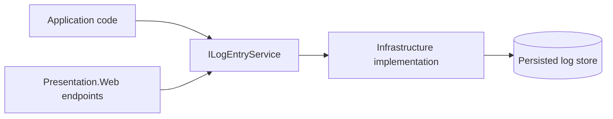

# Log Entries Feature Documentation

[TOC]

## Overview

The Log Entries feature provides an application-level API for querying, streaming, exporting, and cleaning up persisted logs. It does not replace the logging pipeline itself. Instead, it gives the rest of the devkit a stable contract for operational access to log data once logs have already been written to a store.

`Application.Utilities` defines the contract in `ILogEntryService` and the DTOs used by callers. Infrastructure projects provide concrete implementations, and `Presentation.Web` exposes a ready-made HTTP endpoint set.

## What The Feature Covers

- paged log queries with continuation tokens
- live streaming of newly written log entries
- export to CSV, JSON, or plain text
- aggregated statistics by level and time interval
- cleanup and archival-oriented maintenance operations
- correlation-oriented filtering by trace, correlation, module, and log key metadata

## Core Contract

The central abstraction is `ILogEntryService`.

It exposes these operations:

- `QueryAsync(...)`
- `StreamAsync(...)`
- `ExportAsync(...)`
- `GetStatisticsAsync(...)`
- `CleanupAsync(...)`
- `SubscribeAsync(...)`

The application package also defines:

- `LogEntryQueryRequest`
- `LogEntryQueryResponse`
- `LogEntryModel`
- `LogEntryStatisticsModel`
- `LogEntryExportFormat`

## Setup

The log-entries feature needs more than just `ILogEntryService`. A working setup has four parts:

1. the application must write structured logs into a persistent store
2. the EF Core context used by the query service must implement `ILoggingContext`
3. the host must register `ILogEntryService` plus the maintenance queue and hosted service
4. the web host can optionally expose `LogEntryEndpoints`

The DoFiesta example wires those pieces together in [Program.cs](/f:/projects/bit/bIT.bITdevKit/examples/DoFiesta/DoFiesta.Presentation.Web.Server/Program.cs) and [CoreDbContext.cs](/f:/projects/bit/bIT.bITdevKit/examples/DoFiesta/DoFiesta.Infrastructure/Modules/Core/EntityFramework/CoreDbContext.cs).

### 1. Persist Logs

The query feature only works if your logging pipeline writes log events into a durable store. Serilog needs to be configured with the [MSSQL](https://github.com/serilog-mssql/serilog-sinks-mssqlserver) sink in appsettings.json.

```json
"Serilog": {
    "WriteTo": [
      {
        "Name": "MSSqlServer",
        "Args": {
          "connectionString": "Server=localhost,14333;Database=db;User Id=sa;Password=pw",
          "sinkOptionsSection": {
            "tableName": "__Logging_LogEntries",
            "schemaName": "core",
            "autoCreateSqlTable": false,
            "batchPostingLimit": 1000,
            "batchPeriod": "00:00:15"
          },
          "columnOptionsSection": {
            "disableTriggers": true,
            "clusteredColumnstoreIndex": false,
            "primaryKeyColumnName": "Id",
            "addStandardColumns": [
              {
                "ColumnName": "Id",
                "DataType": "bigint"
              },
              "Message",
              "MessageTemplate",
              "Level",
              "TimeStamp",
              "Exception",
              "LogEvent",
              "TraceId",
              "SpanId"
            ],
            "removeStandardColumns": [ "Properties" ],
            "timeStamp": {
              "columnName": "TimeStamp",
              "DataType": "datetimeoffset",
              "convertToUtc": true
            },
            "additionalColumns": [
              {
                "ColumnName": "CorrelationId",
                "PropertyName": "CorrelationId",
                "DataType": "nvarchar",
                "DataLength": 128,
                "AllowNull": true
              },
              {
                "ColumnName": "LogKey",
                "PropertyName": "LogKey",
                "DataType": "nvarchar",
                "DataLength": 128,
                "AllowNull": true
              },
              {
                "ColumnName": "ModuleName",
                "PropertyName": "ModuleName",
                "DataType": "nvarchar",
                "DataLength": 128,
                "AllowNull": true
              },
              {
                "ColumnName": "ThreadId",
                "PropertyName": "ThreadId",
                "DataType": "nvarchar",
                "DataLength": 128,
                "AllowNull": true
              },
              {
                "ColumnName": "ShortTypeName",
                "PropertyName": "ShortTypeName",
                "DataType": "nvarchar",
                "DataLength": 128,
                "AllowNull": true
              }
            ]
          }
        }
      }
    ]
  },
```

That sink writes into the `core.__Logging_LogEntries` table and includes the extra columns the devkit query model expects, such as:

- `CorrelationId`
- `LogKey`
- `ModuleName`
- `ThreadId`
- `ShortTypeName`
- `TraceId`
- `SpanId`

The host itself enables the configured logging pipeline through:

```csharp
var builder = WebApplication.CreateBuilder(args);
builder.Host.ConfigureLogging();
builder.Host.ConfigureAppConfiguration();
```

### 2. Expose `LogEntries` In Your DbContext

Your EF Core context must implement `ILoggingContext` and expose a `DbSet<LogEntry>`.

```csharp
using BridgingIT.DevKit.Infrastructure.EntityFramework;
using Microsoft.EntityFrameworkCore;

public class CoreDbContext(DbContextOptions<CoreDbContext> options) :
    ModuleDbContextBase(options),
    ILoggingContext
{
    public DbSet<LogEntry> LogEntries { get; set; }
}
```

This is what allows `LogEntryService<TContext>` and `LogEntryMaintenanceService<TContext>` to query and maintain persisted log rows.

### 3. Register The Application And Maintenance Services

DoFiesta registers the query service, maintenance queue, and hosted maintenance worker directly in the web host:

```csharp
using BridgingIT.DevKit.Application.Utilities;
using BridgingIT.DevKit.Infrastructure.EntityFramework;
using BridgingIT.DevKit.Presentation.Web;

builder.Services.AddScoped<ILogEntryService, LogEntryService<CoreDbContext>>();
builder.Services.AddSingleton<LogEntryMaintenanceQueue>();

if (!EnvironmentExtensions.IsBuildTimeOpenApiGeneration())
{
    builder.Services.AddHostedService<LogEntryMaintenanceService<CoreDbContext>>();
}

builder.Services.AddEndpoints<LogEntryEndpoints>(builder.Environment.IsDevelopment());
```

What each registration does:

- `ILogEntryService`: exposes the query, streaming, export, statistics, and cleanup API
- `LogEntryMaintenanceQueue`: collects cleanup/archive requests
- `LogEntryMaintenanceService<TContext>`: processes queued maintenance work and periodic retention tasks in the background
- `LogEntryEndpoints`: exposes the operational HTTP surface

### 4. Make Sure The Log Table Exists

Because the query service reads from persisted rows, your database schema must include the logging table used by the sink. The schema is expected to be managed explicitly instead of being created ad hoc by Serilog. That means it should have a migration in your infrastructure project that creates the logging table with the expected shape. The sink's `autoCreateSqlTable` option should be set to `false` to avoid conflicts.

In practice that means:

- your database must exist before you expect log queries to work
- the logging table shape must match the sink configuration
- the same database should be reachable by both the logging sink and `CoreDbContext`

### Minimal Host Example

```csharp
var builder = WebApplication.CreateBuilder(args);

builder.Host.ConfigureLogging();
builder.Host.ConfigureAppConfiguration();

builder.Services.AddScoped<ILogEntryService, LogEntryService<AppDbContext>>();
builder.Services.AddSingleton<LogEntryMaintenanceQueue>();
builder.Services.AddHostedService<LogEntryMaintenanceService<AppDbContext>>();
builder.Services.AddEndpoints<LogEntryEndpoints>(builder.Environment.IsDevelopment());
```

And the corresponding DbContext contract:

```csharp
public class AppDbContext(DbContextOptions<AppDbContext> options) :
    DbContext(options),
    ILoggingContext
{
    public DbSet<LogEntry> LogEntries { get; set; }
}
```

## Query Model

`LogEntryQueryRequest` supports operational filters instead of hard-coding one reporting view.

Important filters include:

- `StartTime` and `EndTime`
- `Age`
- `Level`
- `TraceId`
- `CorrelationId`
- `LogKey`
- `ModuleName`
- `ShortTypeName`
- `SearchText`
- `PageSize`
- `ContinuationToken`

Important rules:

- `StartTime` and `Age` are mutually exclusive
- `PageSize` must be positive
- `SearchText` is validated to reject control characters

The service returns a `LogEntryQueryResponse` with:

- `Items`
- `ContinuationToken`
- `PageSize`

That makes the API suitable for dashboards, admin APIs, and support tooling without forcing offset-based paging.

## Typical Usage

### Querying

```csharp
public sealed class OperationsService(ILogEntryService logs)
{
    public Task<LogEntryQueryResponse> GetRecentErrorsAsync(CancellationToken cancellationToken)
    {
        return logs.QueryAsync(new LogEntryQueryRequest
        {
            Age = TimeSpan.FromDays(1),
            Level = LogLevel.Error,
            PageSize = 200
        }, cancellationToken);
    }
}
```

### Streaming

```csharp
await foreach (var entry in logs.StreamAsync(
    startTime: DateTimeOffset.UtcNow.AddMinutes(-5),
    level: LogLevel.Warning,
    pollingInterval: TimeSpan.FromSeconds(2),
    cancellationToken: cancellationToken))
{
    Console.WriteLine($"{entry.TimeStamp:u} {entry.Level} {entry.Message}");
}
```

### Exporting

```csharp
await using var stream = await logs.ExportAsync(
    new LogEntryQueryRequest
    {
        Age = TimeSpan.FromDays(7),
        ModuleName = "Sales"
    },
    LogEntryExportFormat.Csv,
    cancellationToken);
```

### Statistics

```csharp
var stats = await logs.GetStatisticsAsync(
    startTime: DateTimeOffset.UtcNow.AddDays(-1),
    endTime: DateTimeOffset.UtcNow,
    groupByInterval: TimeSpan.FromHours(1),
    cancellationToken: cancellationToken);
```

## HTTP Endpoints

`Presentation.Web` exposes this feature through `LogEntryEndpoints`.

By default the endpoint group is:

`/api/_system/logentries`

The built-in routes cover:

- `GET /api/_system/logentries`
- `GET /api/_system/logentries/stream`
- `GET /api/_system/logentries/stats`
- `GET /api/_system/logentries/export`
- `DELETE /api/_system/logentries`

The default endpoint options require authorization, which makes these endpoints suitable for internal admin and support surfaces rather than public APIs.

## Data Shape

Each `LogEntryModel` exposes operational metadata that is useful when diagnosing distributed flows:

- message and message template
- level and timestamp
- exception text
- trace and span identifiers
- correlation identifier
- log key
- module name
- thread id
- short type name
- structured log event properties

That makes the feature especially useful when combined with module scoping and distributed tracing.

## Architecture



The important boundary is that `Application.Utilities` owns the contract, not the persistence strategy. This lets the same query and export model work with different infrastructure implementations while keeping consumers stable.

## Practical Notes

- Query paging is continuation-token based, not page-number based.
- `Age` is converted into a start time relative to the current moment.
- Live streaming is polling-based and intended for operational dashboards and support tools.
- Cleanup is a maintenance operation, not a query concern.
- Export format is intentionally narrow and operational: `Csv`, `Json`, or `Txt`.

## Best Practices

- Use `ContinuationToken` instead of trying to emulate offset paging.
- Prefer `Age` for operational dashboards and `StartTime`/`EndTime` for reporting screens.
- Filter by `TraceId` or `CorrelationId` when you need one end-to-end request or workflow.
- Filter by `ModuleName` and `LogKey` when you need module-level operational slices.
- Keep the HTTP endpoints behind authorization and treat them as operational tooling.
- Let infrastructure own retention and archival strategy; use `CleanupAsync(...)` as the application-facing maintenance entry point.

## Related Docs

- [Presentation Endpoints](./features-presentation-endpoints.md)
- [Common Observability Tracing](./common-observability-tracing.md)
- [Modules](./features-modules.md)
