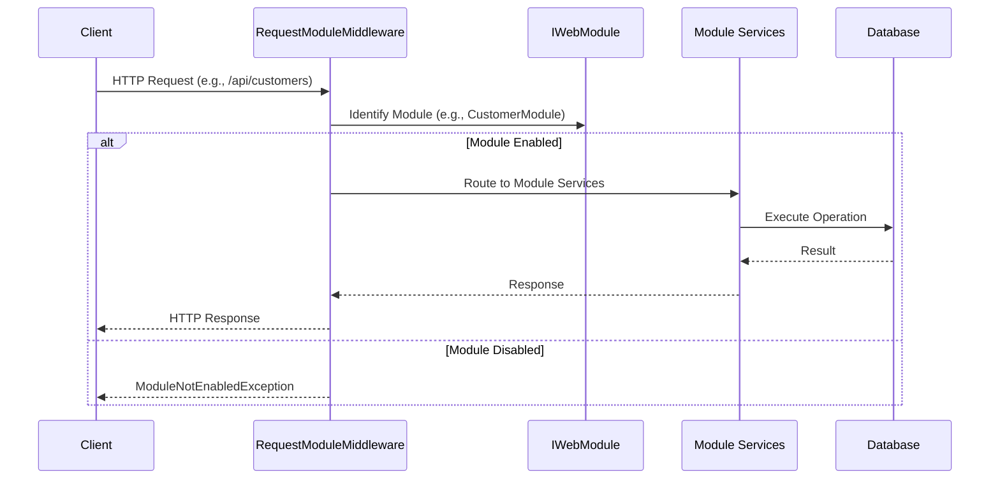

# Modules Feature Documentation

[TOC]

## Overview

The `Modules` feature in bITDevKit enables developers to build modular monoliths, where an application is organized into independent, self-contained feature modules within a single host and repository. Each feature module encapsulates its own business logic, data access and presentation, providing clear boundaries for development and testing.

Designed for .NET developers, this feature supports parallel development, feature toggling and request scoping, all while leveraging shared infrastructure. Modules integrate seamlessly with bITDevKit components like requesters, notifiers and repositories, using strongly-typed configurations and pluggable behaviors to ensure flexibility and maintainability.

### Background

A modular monolith combines the simplicity of a monolithic application—single deployment, shared runtime, unified codebase—with the modularity of microservices. By dividing the application into logical modules aligned with business domains, it avoids the "big ball of mud" problem of traditional monoliths, where code becomes tangled and hard to maintain. This approach allows teams to develop and test features independently within the same repository, reducing coordination overhead compared to microservices while enabling scalability and potential migration to distributed systems. The `Modules` feature supports this by providing tools to define, configure and manage modules, ensuring each operates as a cohesive unit with minimal dependencies, enhancing testability and maintainability.

### Challenges

Traditional monoliths often suffer from tightly coupled code, making changes risky and slowing development. Teams struggle to work on features in parallel and toggling functionality or scaling specific components is cumbersome. Managing configurations and request scoping across logical boundaries is also challenging, leading to inconsistent behavior and maintenance overhead.

### Solution

The `Modules` feature addresses these issues by enabling developers to define modules that encapsulate specific functionality, such as customer or order management. Each module handles its own services, configurations and endpoints, with support for enabling/disabling modules, scoping requests and integrating with other bITDevKit features. This modular structure reduces coupling, simplifies testing and supports independent development, all within a single host, making it ideal for modern .NET applications.

### Key Features

- **Independent Modules**: Encapsulate business logic, data access and endpoints within a single module.
- **Configuration Binding**: Bind module settings from `appsettings.json` or environment variables with validation.
- **Feature Toggling**: Enable or disable modules per environment for flexible deployment.
- **Request Scoping**: Route requests to specific modules based on paths or headers, with logging and error handling.
- **DI Integration**: Register module-specific services via dependency injection, minimizing dependencies.
- **Extensibility**: Use behaviors for cross-cutting concerns like validation or retries in requesters and notifiers.

## Architecture

The `Modules` feature centers on the `IModule` and `IWebModule` interfaces, defining lifecycle methods: `Register` for service registration, `Use` for middleware configuration and `Map` for endpoint routing. The `AddModules` extension initializes the system, discovering modules and binding configurations from `appsettings.json` sections (e.g., "Modules:CustomerModule"). The `RequestModuleMiddleware` scopes HTTP requests to modules, adding metadata to logs and headers and throws `ModuleNotEnabledException` for disabled modules. The `ModuleScopeBehavior` ensures commands and notifications execute only for enabled modules. Modules integrate with requesters, notifiers and repositories, leveraging behaviors for logging, auditing or event publishing, resolved via dependency injection for testability.



## Use Cases

This feature is ideal for scenarios requiring clear separation of business domains, such as managing customers and orders in an e-commerce platform. It supports rapid development by allowing teams to work on isolated modules, simplifies feature toggling for beta or environment-specific functionality and enables request scoping for multi-tenant applications. Modules are also suitable for prototyping, as they can be developed and tested independently and provide a foundation for transitioning to microservices if needed.

## Basic Usage

Start by defining a module class and configuring the application host. The following example shows a `CustomerModule` for managing customer data.

### Module Definition and Setup

```csharp
public class CustomerModule : WebModuleBase
{
    public override IServiceCollection Register(
        IServiceCollection services,
        IConfiguration configuration = null,
        IWebHostEnvironment environment = null)
    {
        var moduleConfiguration = this.Configure<CustomerModuleConfiguration, CustomerModuleConfiguration.Validator>(services, configuration);

        services.AddSqlServerDbContext<CustomerDbContext>(o => o
            .UseConnectionString(moduleConfiguration.ConnectionStrings["Default"])
            .UseLogger())
            .WithDatabaseMigratorService(o => o
                .Enabled(environment.IsLocalDevelopment())
                .DeleteOnStartup(environment.IsLocalDevelopment()));

        services.AddEntityFrameworkRepository<Customer, CustomerDbContext>()
            .WithBehavior<RepositoryLoggingBehavior<Customer>>()
            .WithBehavior<RepositoryAuditStateBehavior<Customer>>();

        services.AddEndpoints<CustomerEndpoints>();

        return services;
    }
}
```

Configure the module in `appsettings.json`:

```json
{
  "Modules": {
    "CustomerModule": {
      "Enabled": true,
      "ConnectionStrings": {
        "Default": "Server=(localdb)\\MSSQLLocalDB;Database=customers;Trusted_Connection=True"
      }
    }
  }
}
```

Define a configuration class and validator:

```csharp
public class CustomerModuleConfiguration
{
    public IReadOnlyDictionary<string, string> ConnectionStrings { get; set; }

    public class Validator : AbstractValidator<CustomerModuleConfiguration>
    {
        public Validator()
        {
            RuleFor(c => c.ConnectionStrings)
                .NotNull().NotEmpty()
                .Must(c => c.ContainsKey("Default"))
                .WithMessage("Connection string 'Default' is required");
        }
    }
}
```

Register the module in the host:

```csharp
var builder = WebApplication.CreateBuilder(args);

builder.Services.AddModules(builder.Configuration, builder.Environment)
    .WithModule<CustomerModule>()
    .WithModuleContextAccessors()
    .WithRequestModuleContextAccessors();

var app = builder.Build();
app.MapModules();
```

### Defining Endpoints

Define module-specific endpoints using minimal APIs:

```csharp
public class CustomerEndpoints : EndpointsBase
{
    public override void Map(IEndpointRouteBuilder app)
    {
        var group = app.MapGroup("api/customers").WithTags("Customers");

        group.MapGet("/{id:guid}", async (IRequester requester, Guid id) =>
        {
            var result = await requester.SendAsync(new CustomerFindOneQuery(id.ToString()));
            return result.MapHttpOk();
        }).WithName("Customers.GetById");

        group.MapPost("", async (IRequester requester, CustomerModel model) =>
        {
            var result = await requester.SendAsync(new CustomerCreateCommand(model));
            return result.MapHttpCreated(value => $"/api/customers/{value.Id}");
        }).WithName("Customers.Create");
    }
}
```

Register endpoints in the module:

```csharp
services.AddEndpoints<CustomerEndpoints>();
```

### Scoping Requests

Use the `RequestModuleMiddleware` to scope HTTP requests to modules:

```csharp
app.UseRequestModule();
```

For commands and queries, apply the `ModuleScopeBehavior`:

```csharp
services.AddRequester()
    .AddHandlers()
    .WithBehavior(typeof(ModuleScopeBehavior<,>));
```

This ensures requests and commands are processed only if the module is enabled, with errors for disabled modules.

### Feature Toggling

Toggle modules by setting the `Enabled` property in `appsettings.json`:

```json
{
  "Modules": {
    "CustomerModule": {
      "Enabled": false
    }
  }
}
```

Disabled modules throw a `ModuleNotEnabledException` when accessed.

## Best Practices

- Align modules with business domains (e.g., customers vs. orders) for clear boundaries.
- Use separate database contexts or schemas to isolate module data.
- Leverage shared modules for common utilities to avoid duplication.
- Enable or disable modules per environment for flexible feature management.
- Test modules independently with mocked dependencies for faster iteration.
- Design modules to be extractable as microservices if future needs arise.
- Use strongly-typed configurations with validation to prevent runtime errors.

## Appendix A: Comparison with Microservices

### Overview

Modules in a monolith contrast with microservices, which are independently deployable services. Both aim to separate concerns, but they differ in deployment and complexity.

### Characteristics

#### Modular Monolith
- **Approach**: Single deployment with logically separated modules, sharing a runtime and repository.
- **Strengths**: Simplifies deployment, reduces distributed system complexity, supports parallel development.
- **Considerations**: Shared resources may cause contention, requires careful boundary design.

#### Microservices
- **Approach**: Independent services with separate deployments and databases.
- **Strengths**: Scales independently, isolates failures, allows polyglot persistence.
- **Considerations**: Increases operational complexity due to a network involved, requires distributed system expertise.

### Tradeoffs

- **Deployment**: Modular monoliths deploy as a single unit, simplifying operations but limiting independent scaling. Microservices deploy separately, enabling fine-grained scaling but requiring orchestration.
- **Complexity**: Modules reduce distributed system challenges, while microservices introduce network latency and consistency issues.
- **Development**: Modules support parallel work within one repo, while microservices require cross-team coordination.
- **Migration**: Modules can be extracted to microservices, providing a transition path.

### Practical Considerations

The Modules feature is ideal for teams seeking modularity without microservices’ overhead. It supports rapid development and testing, with a clear path to distributed systems if needed. For complex, high-scale systems, microservices may be more suitable, but modules offer a simpler starting point.