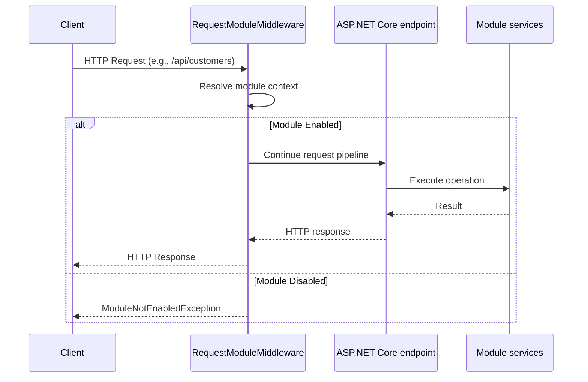

# Modules

> Structure modular monoliths as independently configurable feature modules within one host.

[TOC]

## Overview

The `Modules` feature in bITdevKit supports modular monoliths: applications organized into feature modules within one host and repository. A module owns service registration, can contribute middleware and, for web modules, can map endpoints. Teams can use those lifecycle boundaries to keep business logic, data access and presentation code grouped by domain.

The feature also provides configuration binding, module enablement and request-context resolution. Modules can use other bITdevKit components, including Requester, Notifier and repositories, through normal dependency injection.

### Background

A modular monolith combines a single deployment, shared runtime and unified codebase with explicit internal boundaries. Dividing an application into modules aligned with business domains can reduce accidental coupling and make ownership clearer. These boundaries still depend on the application design: the Modules feature supplies lifecycle and context mechanisms, but it does not enforce data or source-code isolation.

## Challenges

In a growing monolith, service registration, middleware, endpoints and configuration can become difficult to associate with the feature that owns them. Disabling a feature or identifying the active feature for an HTTP request or an in-process request also requires consistent conventions.

## Solution

Define each feature as an `IModule` or `IWebModule`. The host discovers modules, registers selected modules, runs their application-pipeline hooks and maps web-module routes. Configuration controls whether a module is enabled, while context accessors resolve a module from an HTTP request or .NET type. Disabled modules can then be rejected by HTTP middleware or a Requester/Notifier pipeline behavior.

## Key Features

- **Module lifecycle**: Use `Register`, `Use` and, for web modules, `Map` to group startup responsibilities.
- **Configuration binding**: Bind and validate settings from the `Modules:{module-name}` configuration section.
- **Module enablement**: Set `Modules:{module-name}:Enabled` to `false` to mark a module as disabled.
- **Request context**: Resolve a module from the `ModuleName` header or query parameter, a module segment in the path or a configured API path selector.
- **Type context**: Resolve a module from a request type's assembly metadata or namespace.
- **Diagnostics**: Add the module name to logging scopes, tracing baggage, metrics tags and HTTP response headers.
- **Pipeline integration**: Reject Requester and Notifier operations associated with disabled modules by using `ModuleScopeBehavior<,>`.

## Architecture

The `Modules` feature centers on the `IModule` and `IWebModule` interfaces. `IModule.Register` adds services, `IModule.Use` contributes to the application pipeline and `IWebModule.Map` contributes routes. `AddModules` discovers module types and registers the modules selected with `WithModule<T>()`; the assembly-scanning overload can register every discovered module instead.

`ModuleBase` derives the default module name by removing `Module` from the class name and converting the result to lowercase. For example, `CustomerModule` is named `customer`, so its configuration section is `Modules:customer`. A module is disabled only when its `Enabled` value is `false`; registration and lifecycle callbacks still run, while context-aware middleware and behaviors reject work associated with that disabled module.

`RequestModuleMiddleware`, installed by `UseRequestModuleContext`, resolves an HTTP request's module. For a resolved module, it adds the module name to the log scope, activity baggage, response headers and request items. `ModuleScopeBehavior<,>` performs the corresponding enablement check for Requester and Notifier operations whose request type can be associated with a module.


```mermaid
sequenceDiagram
    participant Client
    participant Middleware as RequestModuleMiddleware
    participant Endpoint as ASP.NET Core endpoint
    participant Services as Module services

    Client->>Middleware: HTTP Request (e.g., /api/customers)
    Middleware->>Middleware: Resolve module context
    alt Module Enabled
        Middleware->>Endpoint: Continue request pipeline
        Endpoint->>Services: Execute operation
        Services-->>Endpoint: Result
        Endpoint-->>Middleware: HTTP response
        Middleware-->>Client: HTTP Response
    else Module Disabled
        Middleware-->>Client: ModuleNotEnabledException
    end
```

## Use Cases

Use modules to group domain-aligned features such as customer and order management, to keep feature-specific startup code together or to make a feature unavailable through configuration. Module context is also useful for adding a feature identifier to logs and traces. A modular structure can make later extraction into a separate service easier, but extraction and independent deployment are not provided by this feature.

## Basic Usage

Start by defining a module class and configuring the application host. The following example shows a `CustomerModule` for managing customer data.

### Module definition and setup

```csharp
public class CustomerModule : WebModuleBase
{
    public override IServiceCollection Register(
        IServiceCollection services,
        IConfiguration configuration = null,
        IWebHostEnvironment environment = null)
    {
        var moduleConfiguration = this.Configure<CustomerModuleConfiguration, CustomerModuleConfiguration.Validator>(services, configuration);

        services.AddSqlServerDbContext<CustomerDbContext>(o => o
            .UseConnectionString(moduleConfiguration.ConnectionStrings["Default"])
            .UseLogger())
            .WithDatabaseMigratorService(o => o
                .Enabled(environment.IsLocalDevelopment())
                .DeleteOnStartup(environment.IsLocalDevelopment()));

        services.AddEntityFrameworkRepository<Customer, CustomerDbContext>()
            .WithBehavior<RepositoryLoggingBehavior<Customer>>()
            .WithBehavior<RepositoryAuditStateBehavior<Customer>>();

        services.AddEndpoints<CustomerEndpoints>();

        return services;
    }

    public override IApplicationBuilder Use(
        IApplicationBuilder app,
        IConfiguration configuration = null,
        IWebHostEnvironment environment = null)
    {
        return app;
    }

    public override IEndpointRouteBuilder Map(
        IEndpointRouteBuilder app,
        IConfiguration configuration = null,
        IWebHostEnvironment environment = null)
    {
        return app;
    }
}
```

Configure the module in `appsettings.json`:

```json
{
  "Modules": {
    "customer": {
      "Enabled": true,
      "ConnectionStrings": {
        "Default": "Server=(localdb)\\MSSQLLocalDB;Database=customers;Trusted_Connection=True"
      }
    }
  }
}
```

Define a configuration class and validator:

```csharp
public class CustomerModuleConfiguration
{
    public IReadOnlyDictionary<string, string> ConnectionStrings { get; set; }

    public class Validator : AbstractValidator<CustomerModuleConfiguration>
    {
        public Validator()
        {
            RuleFor(c => c.ConnectionStrings)
                .NotNull().NotEmpty()
                .Must(c => c.ContainsKey("Default"))
                .WithMessage("Connection string 'Default' is required");
        }
    }
}
```

Register the module in the host:

```csharp
var builder = WebApplication.CreateBuilder(args);

builder.Services.AddModules(builder.Configuration, builder.Environment)
    .WithModule<CustomerModule>();

var app = builder.Build();
app.UseRequestModuleContext();
app.UseModules();
app.MapModules();
app.MapEndpoints();
app.Run();
```

With the module enabled, `GET /api/customers/{id}` reaches `CustomerEndpoints`. `MapHttpOk` converts a successful result to HTTP 200 and maps a failed result to the configured HTTP error response instead of reading a missing value.

### Defining endpoints

Define module-specific endpoints using minimal APIs:

```csharp
public class CustomerEndpoints : EndpointsBase
{
    public override void Map(IEndpointRouteBuilder app)
    {
        var group = app.MapGroup("api/customers").WithTags("Customers");

        group.MapGet("/{id:guid}", async (IRequester requester, Guid id) =>
        {
            var result = await requester.SendAsync(new CustomerFindOneQuery(id.ToString()));
            return result.MapHttpOk();
        }).WithName("Customers.GetById");

        group.MapPost("", async (IRequester requester, CustomerModel model) =>
        {
            var result = await requester.SendAsync(new CustomerCreateCommand(model));
            return result.MapHttpCreated(value => $"/api/customers/{value.Id}");
        }).WithName("Customers.Create");
    }
}
```

Register endpoints in the module:

```csharp
services.AddEndpoints<CustomerEndpoints>();
```

### Scoping requests

Install `RequestModuleMiddleware` to resolve module context for HTTP requests:

```csharp
app.UseRequestModuleContext();
```

For commands and queries, apply the `ModuleScopeBehavior`:

```csharp
services.AddRequester()
    .AddHandlers()
    .WithBehavior(typeof(ModuleScopeBehavior<,>));
```

The behavior rejects a command, query or notification when its request type resolves to a disabled module. If no accessor resolves the type, the operation continues with the module name `UnknownModule`.

### Feature toggling

Toggle modules by setting the `Enabled` property in `appsettings.json`:

```json
{
  "Modules": {
    "customer": {
      "Enabled": false
    }
  }
}
```

When middleware or `ModuleScopeBehavior<,>` resolves a disabled module, it throws `ModuleNotEnabledException`. Disabling a module does not skip its `Register`, `Use` or `Map` callback.

## Best practices

- Align modules with business domains (e.g., customers vs. orders) for clear boundaries.
- Use separate database contexts or schemas to isolate module data.
- Keep shared utilities outside domain modules when they do not have a clear domain owner.
- Use environment-specific configuration when module availability differs by environment.
- Test module registration, middleware and endpoint mapping independently where practical.
- Keep cross-module dependencies explicit if later extraction is a requirement.
- Use strongly-typed configurations with validation to prevent runtime errors.

## Appendix A: Comparison with microservices

### Summary

Modules in a monolith contrast with microservices, which are independently deployable services. Both aim to separate concerns, but they differ in deployment and complexity.

### Characteristics

#### Modular monolith

- **Approach**: Single deployment with logically separated modules, sharing a runtime and repository.
- **Strengths**: Simplifies deployment, reduces distributed system complexity, supports parallel development.
- **Considerations**: Shared resources may cause contention, requires careful boundary design.

#### Microservices

- **Approach**: Independent services with separate deployments and databases.
- **Strengths**: Scales independently, isolates failures, allows polyglot persistence.
- **Considerations**: Increases operational complexity due to a network involved, requires distributed system expertise.

### Tradeoffs

- **Deployment**: Modular monoliths deploy as a single unit, simplifying operations but limiting independent scaling. Microservices deploy separately, enabling fine-grained scaling but requiring orchestration.
- **Complexity**: Modules reduce distributed system challenges, while microservices introduce network latency and consistency issues.
- **Development**: Modules support parallel work within one repo, while microservices require cross-team coordination.
- **Migration**: Modules can be extracted to microservices, providing a transition path.

### Practical considerations

Choose modules when one deployment and runtime fit the operational requirements but explicit feature boundaries are still useful. Choose separate services when independent deployment, scaling or failure isolation justify the additional network and operational concerns. The Modules feature does not automate a later migration; it provides lifecycle boundaries that can support one.
