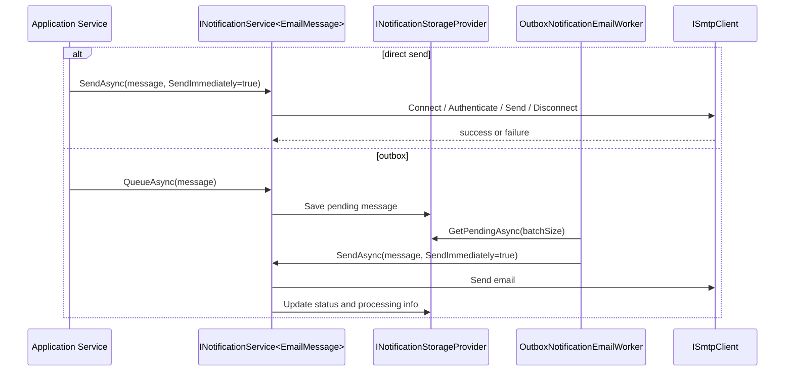

# Notifications Feature Documentation

> Send and queue application notifications through transport-agnostic contracts with clear delivery boundaries.

[TOC]

## Overview

The Notifications feature provides an application-level abstraction for sending and queueing notification messages, with the current built-in focus on email. It separates the notification contract from the delivery mechanism so application code can work with `INotificationService<TMessage>` instead of directly depending on SMTP or storage concerns.

At the core, `Application.Notifications` defines:

- `INotificationMessage` as the message contract
- `INotificationService<TMessage>` as the send and queue API
- `EmailMessage` as the built-in email notification model
- `INotificationStorageProvider` as the persistence abstraction for queued notifications

The feature supports two main operating modes:

- direct sending through an SMTP client
- queued and outbox-style sending through a storage provider plus background worker

## Key Capabilities

- Email-focused notification model with recipients, headers, priority, reply-to, and attachments
- Real SMTP delivery through MailKit
- Fake SMTP delivery for tests and local verification
- In-memory storage provider by default when no persistent provider is configured
- Optional outbox processing with hosted background delivery
- Immediate processing mode that can wake the outbox worker as soon as a message is queued
- Consistent `Result`-based success and failure handling

## Core Types

### Notification Contracts

- `INotificationMessage`: minimal message contract with an `Id`
- `INotificationService<TMessage>`: exposes `SendAsync(...)` and `QueueAsync(...)`
- `INotificationStorageProvider`: persists pending notifications and retrieves batches for processing

### Email Model

`EmailMessage` is the built-in notification type and contains:

- `To`, `CC`, and `BCC`
- `From` and `ReplyTo`
- `Subject` and `Body`
- `IsHtml`
- `Headers`
- `Attachments`
- `Priority`
- `Status`
- `RetryCount`
- `CreatedAt` and `SentAt`
- a flexible `Properties` bag for outbox metadata and processing details

Attachments are represented by `EmailAttachment` and can be regular or embedded attachments.

## Basic Setup

The base registration entry point is `AddNotificationService<TMessage>(...)`.

```csharp
using BridgingIT.DevKit.Application.Notifications;

services.AddNotificationService<EmailMessage>(builder.Configuration, o =>
{
    o.WithSmtpClient()
     .WithSmtpSettings(s =>
     {
         s.Host = "smtp.example.com";
         s.Port = 587;
         s.UseSsl = true;
         s.Username = "smtp-user";
         s.Password = "smtp-password";
         s.SenderAddress = "noreply@example.com";
         s.SenderName = "Example App";
     })
     .WithTimeout(TimeSpan.FromSeconds(30));
});
```

If no storage provider is registered, the feature falls back to the in-memory notification storage provider.

## Fake SMTP

For local verification or tests, the feature can use `FakeSmtpClient` instead of a real SMTP server.

```csharp
services.AddNotificationService<EmailMessage>(builder.Configuration, o =>
{
    o.WithFakeSmtpClient()
     .WithInMemoryStorageProvider();
});
```

`FakeSmtpClient` implements MailKit's `ISmtpClient` but logs activity instead of delivering mail to a real server. That makes it useful for integration-style tests and local debugging of email flows.

## Sending And Queueing

### Direct Send

When outbox processing is not configured, `SendAsync(...)` sends the email immediately through the configured SMTP client.

```csharp
public sealed class WelcomeService(INotificationService<EmailMessage> notifications)
{
    public async Task SendWelcomeAsync(string email, CancellationToken cancellationToken)
    {
        var message = new EmailMessage
        {
            Id = Guid.NewGuid(),
            Subject = "Welcome",
            Body = "Your account is ready.",
            To = [email],
            IsHtml = false
        };

        var result = await notifications.SendAsync(
            message,
            new NotificationSendOptions { SendImmediately = true },
            cancellationToken);

        if (result.IsFailure)
        {
            // inspect result.Errors
        }
    }
}
```

### Queueing

`QueueAsync(...)` is intended for outbox-backed processing. Without an outbox configuration, queueing does not persist work and only logs a warning. In practice, that means `QueueAsync(...)` should be used together with a persistent storage provider and `WithOutbox<TContext>(...)`.

## Outbox Processing

The outbox integration is added by the infrastructure package and turns queued notifications into a background delivery pipeline.

```csharp
using BridgingIT.DevKit.Application.Notifications;

services.AddNotificationService<EmailMessage>(builder.Configuration, o =>
{
    o.WithSmtpClient()
     .WithEntityFrameworkStorageProvider<AppDbContext>()
     .WithOutbox<AppDbContext>(c => c
         .StartupDelay(TimeSpan.FromSeconds(10))
         .ProcessingInterval(TimeSpan.FromSeconds(30))
         .ProcessingMode(OutboxNotificationEmailProcessingMode.Interval)
         .ProcessingCount(100)
         .RetryCount(3));
});
```

Once outbox processing is enabled:

- new messages are saved through `INotificationStorageProvider`
- `OutboxNotificationEmailService` runs as a hosted background service
- `OutboxNotificationEmailWorker` loads pending messages in batches
- each message is sent through `INotificationService<EmailMessage>`
- status and retry metadata are updated after processing

Two processing styles are supported:

- `Interval`: the hosted worker polls on the configured interval
- `Immediate`: queueing can trigger worker processing immediately through `IOutboxNotificationEmailQueue`

## Storage Providers

The notification feature depends on `INotificationStorageProvider` for queued delivery.

Available patterns in the current codebase:

- `InMemoryNotificationStorageProvider` for tests, demos, and ephemeral processing
- Entity Framework provider registration from infrastructure for persistent outbox storage

The storage abstraction is intentionally small:

- `SaveAsync(...)`
- `UpdateAsync(...)`
- `DeleteAsync(...)`
- `GetPendingAsync(...)`

That keeps the application layer focused on notification workflows while letting infrastructure choose how messages are stored.

## Delivery Flow



## Configuration Notes

`NotificationServiceOptions` groups:

- `SmtpSettings`
- `OutboxOptions`
- `Timeout`
- `IsOutboxConfigured`

`OutboxNotificationEmailOptions` controls background behavior such as:

- `StartupDelay`
- `ProcessingInterval`
- `ProcessingDelay`
- `ProcessingJitter`
- `ProcessingMode`
- `ProcessingCount`
- `RetryCount`
- `PurgeOnStartup`
- `PurgeProcessedOnStartup`

## Best Practices

- Use `SendAsync(...)` for simple, synchronous notification flows.
- Use `QueueAsync(...)` only when an outbox storage provider is configured.
- Prefer a persistent provider plus `WithOutbox<TContext>(...)` for important business notifications.
- Use `FakeSmtpClient` in tests and local environments where you want to inspect behavior without real delivery.
- Treat handlers and application services as responsible for building `EmailMessage` content, while the notification feature owns transport and persistence.
- Keep attachments modest in size and be deliberate about when you embed binary payloads in queued messages.

## Related Docs

- [Messaging](./features-messaging.md)
- [Results](./features-results.md)
- [JobScheduling](./features-jobscheduling.md)
