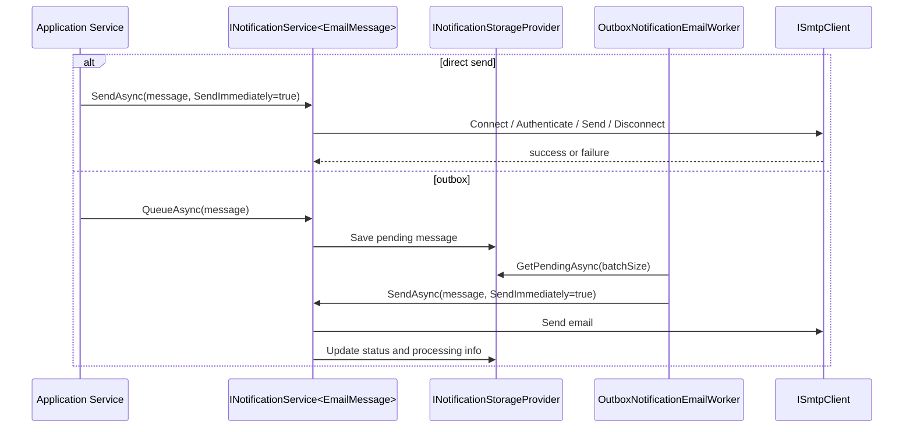

# Notifications Feature Documentation

> Send and queue application notifications through transport-agnostic contracts with clear delivery boundaries.

[TOC]

## Overview

The Notifications feature provides an application-level abstraction for sending and queueing notification messages, with the current built-in focus on email. It separates the notification contract from the delivery mechanism so application code can work with `INotificationService<TMessage>` instead of directly depending on SMTP or storage concerns.

At the core, `Application.Notifications` defines:

- `INotificationMessage` as the message contract
- `INotificationService<TMessage>` as the send and queue API
- `EmailMessage` as the built-in email notification model
- `INotificationStorageProvider` as the persistence abstraction for queued notifications

The feature supports two main operating modes:

- direct sending through an SMTP client
- queued and outbox-style sending through a storage provider plus background worker

## Key Capabilities

- Email-focused notification model with recipients, headers, priority, reply-to, and attachments
- Real SMTP delivery through MailKit
- Fake SMTP delivery for tests and local verification
- In-memory storage provider by default when no persistent provider is configured
- Optional outbox processing with hosted background delivery
- Immediate processing mode that can wake the outbox worker as soon as a message is queued
- Consistent `Result`-based success and failure handling

## Core Types

### Notification Contracts

- `INotificationMessage`: minimal message contract with an `Id`
- `INotificationService<TMessage>`: exposes `SendAsync(...)` and `QueueAsync(...)`
- `INotificationStorageProvider`: persists pending notifications and retrieves batches for processing

### Email Model

`EmailMessage` is the built-in notification type and contains:

- `To`, `CC`, and `BCC`
- `From` and `ReplyTo`
- `Subject` and `Body`
- `IsHtml`
- `Headers`
- `Attachments`
- `Priority`
- `Status`
- `RetryCount`
- `CreatedAt` and `SentAt`
- a flexible `Properties` bag for outbox metadata and processing details

Attachments are represented by `EmailAttachment` and can be regular or embedded attachments.

## Basic Setup

The base registration entry point is `AddNotificationService<TMessage>(...)`.

```csharp
using BridgingIT.DevKit.Application.Notifications;

services.AddNotificationService<EmailMessage>(builder.Configuration, o =>
{
    o.WithSmtpClient()
     .WithSmtpSettings(s =>
     {
         s.Host = "smtp.example.com";
         s.Port = 587;
         s.UseSsl = true;
         s.Username = "smtp-user";
         s.Password = "smtp-password";
         s.SenderAddress = "noreply@example.com";
         s.SenderName = "Example App";
     })
     .WithTimeout(TimeSpan.FromSeconds(30));
});
```

If no storage provider is registered, the feature falls back to the in-memory notification storage provider.

## Fake SMTP

For local verification or tests, the feature can use `FakeSmtpClient` instead of a real SMTP server.

```csharp
services.AddNotificationService<EmailMessage>(builder.Configuration, o =>
{
    o.WithFakeSmtpClient()
     .WithInMemoryStorageProvider();
});
```

`FakeSmtpClient` implements MailKit's `ISmtpClient` but logs activity instead of delivering mail to a real server. That makes it useful for integration-style tests and local debugging of email flows.

## Sending And Queueing

### Direct Send

When outbox processing is not configured, `SendAsync(...)` sends the email immediately through the configured SMTP client.

```csharp
public sealed class WelcomeService(INotificationService<EmailMessage> notifications)
{
    public async Task SendWelcomeAsync(string email, CancellationToken cancellationToken)
    {
        var message = new EmailMessage
        {
            Id = Guid.NewGuid(),
            Subject = "Welcome",
            Body = "Your account is ready.",
            To = [email],
            IsHtml = false
        };

        var result = await notifications.SendAsync(
            message,
            new NotificationSendOptions { SendImmediately = true },
            cancellationToken);

        if (result.IsFailure)
        {
            // inspect result.Errors
        }
    }
}
```

### Queueing

`QueueAsync(...)` is intended for outbox-backed processing. Without an outbox configuration, queueing does not persist work and only logs a warning. In practice, that means `QueueAsync(...)` should be used together with a persistent storage provider and `WithOutbox<TContext>(...)`.

## Outbox Processing

The outbox integration is added by the infrastructure package and turns queued notifications into a background delivery pipeline.

```csharp
using BridgingIT.DevKit.Application.Notifications;

services.AddNotificationService<EmailMessage>(builder.Configuration, o =>
{
    o.WithSmtpClient()
     .WithEntityFrameworkStorageProvider<AppDbContext>()
     .WithOutbox<AppDbContext>(c => c
          .StartupDelay(TimeSpan.FromSeconds(10))
          .ProcessingInterval(TimeSpan.FromSeconds(30))
          .LeaseDuration(TimeSpan.FromMinutes(5))
          .ProcessingMode(OutboxNotificationEmailProcessingMode.Interval)
          .ProcessingCount(100)
          .RetryCount(3));
});
```

Once outbox processing is enabled:

- new messages are saved through `INotificationStorageProvider`
- `OutboxNotificationEmailService` runs as a hosted background service
- `OutboxNotificationEmailWorker` claims pending messages in batches by taking a time-bounded lease in storage
- each message is sent through `INotificationService<EmailMessage>`
- status, retry metadata, and lease state are updated after processing

Two processing styles are supported:

- `Interval`: the hosted worker polls on the configured interval
- `Immediate`: queueing can trigger worker processing immediately through `IOutboxNotificationEmailQueue`

## Storage Providers

The notification feature depends on `INotificationStorageProvider` for queued delivery.

Available providers include:

- `InMemoryNotificationStorageProvider` for tests, demos, and ephemeral processing
- Entity Framework provider registration from infrastructure for persistent outbox storage

- `EntityFrameworkNotificationStorageProvider` for Entity Framework Core-based persistence, typically used with `WithOutbox<TContext>(...)`
- `EntityFrameworkNotificationEmailStorageProvider<TContext>` for Entity Framework Core-based persistence, typically used with `WithOutbox<TContext>(...)`

The storage abstraction is intentionally small:

- `SaveAsync(...)`
- `UpdateAsync(...)`
- `DeleteAsync(...)`
- `GetPendingAsync(...)`

That keeps the application layer focused on notification workflows while letting infrastructure choose how messages are stored.

### Entity Framework Provider

The Entity Framework provider stores queued emails in `__Notifications_Emails` and attachments in `__Notifications_EmailAttachments`.

For outbox polling, it is hardened for shared-database and multi-node deployments:

- pending rows are **claimed**, not just read
- each claim writes `Status=Locked`, `LockedBy`, `LockedUntil`, and a new provider-neutral `ConcurrencyVersion`
- only the worker instance that owns the current lease can persist the final status change for that claimed message
- expired leases can be taken over by another node, so a crashed worker does not strand mail forever
- failed rows remain eligible for retry until `RetryCount` reaches the configured `OutboxNotificationEmailOptions.RetryCount`

For higher-volume outbox usage, the provider uses a composite polling index on `(Status, LockedUntil, CreatedAt)` and keeps attachments in a separate table so the hot polling query does not need attachment payload columns.

Because the lease and concurrency columns are part of the EF entity model, consuming applications must add and apply their own migration after upgrading the package.

## Delivery Flow



## Operational Endpoints

`Presentation.Web.Notifications` exposes an operational REST surface for the persisted email outbox. These endpoints are intended for dashboards and support tooling rather than end-user mail composition.

Register them from the fluent notification builder:

```csharp
services.AddNotificationService<EmailMessage>(builder.Configuration, o =>
{
    o.WithEntityFrameworkStorageProvider<AppDbContext>()
     .WithOutbox<AppDbContext>()
     .AddEndpoints(options => options
         .RequireAuthorization()
         .GroupPath("/api/_system/notifications/emails"));
});
```

The endpoint group exposes:

- `GET /api/_system/notifications/emails` to list persisted emails with filters such as `status`, `subject`, `lockedBy`, and `take`
- `GET /api/_system/notifications/emails/stats` to retrieve aggregate outbox counts
- `GET /api/_system/notifications/emails/{id}` to inspect one email
- `GET /api/_system/notifications/emails/{id}/content` to fetch the stored body
- `POST /api/_system/notifications/emails/{id}/retry` to reset a failed row back to pending
- `DELETE /api/_system/notifications/emails/{id}` to delete one row
- `DELETE /api/_system/notifications/emails` to purge rows by age and status

For typed operational access inside the application layer, use `INotificationEmailOutboxService`.

## Configuration Notes

`NotificationServiceOptions` groups:

- `SmtpSettings`
- `OutboxOptions`
- `Timeout`
- `IsOutboxConfigured`

`OutboxNotificationEmailOptions` controls background behavior such as:

- `StartupDelay`
- `ProcessingInterval`
- `LeaseDuration`
- `ProcessingDelay`
- `ProcessingJitter`
- `ProcessingMode`
- `ProcessingCount`
- `RetryCount`
- `PurgeOnStartup`
- `PurgeProcessedOnStartup`

## Best Practices

- Use `SendAsync(...)` for simple, synchronous notification flows.
- Use `QueueAsync(...)` only when an outbox storage provider is configured.
- Prefer a persistent provider plus `WithOutbox<TContext>(...)` for important business notifications.
- Use `FakeSmtpClient` in tests and local environments where you want to inspect behavior without real delivery.
- Treat handlers and application services as responsible for building `EmailMessage` content, while the notification feature owns transport and persistence.
- Keep attachments modest in size and be deliberate about when you embed binary payloads in queued messages.

## Related Docs

- [Messaging](./features-messaging.md)
- [Results](./features-results.md)
- [JobScheduling](./features-jobscheduling.md)
