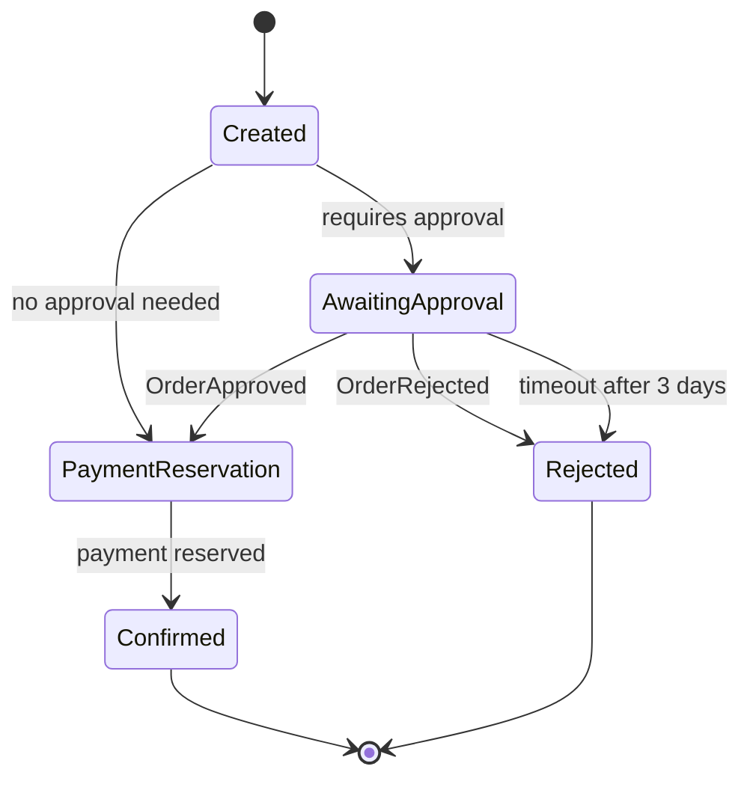
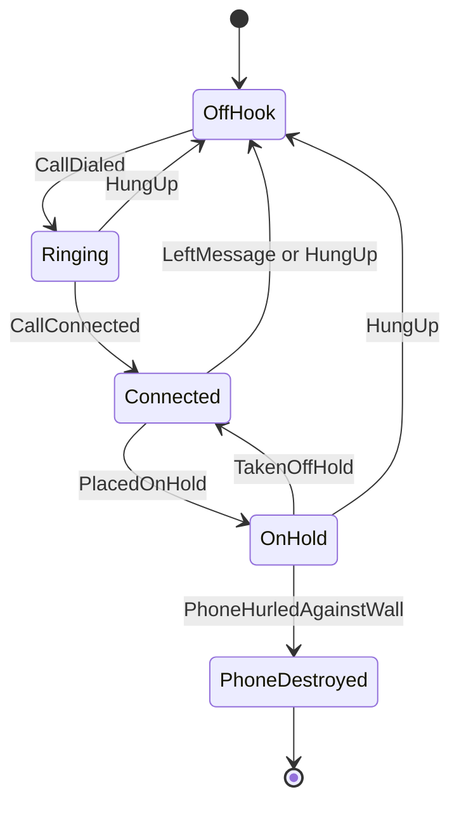
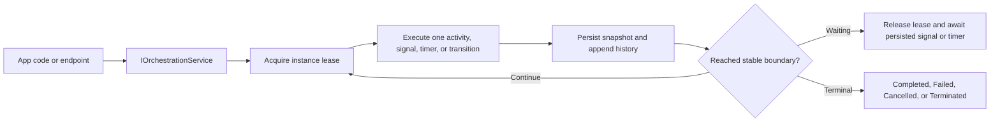
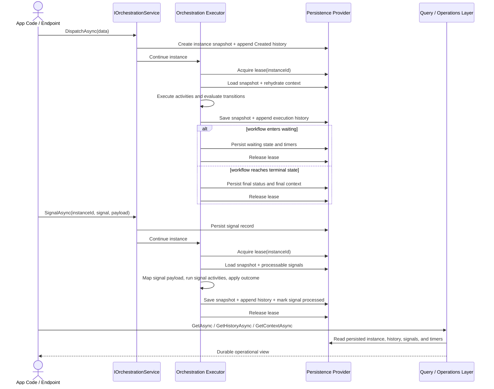

# Orchestrations Feature Documentation

> Define durable, stateful workflows in code with explicit states, activities, signals, timers, persisted history, and operational query endpoints.

[TOC]

## Overview

The orchestration feature is the devkit's code-first runtime for long-running processes.

Use it when a workflow needs one or more of the following:

- explicit business states
- durable waiting for external input
- timeout-driven progression
- persisted execution history
- pause, resume, cancel, or terminate operations
- queryable runtime state for dashboards or support tooling

Disclaimer: It is intentionally a code-first orchestration engine for application-level long-running workflows. It does not try to compete with full-fledged workflow products or workflow servers such as Elsa Workflows, Camunda, or similar platforms. If you need a visual designer, BPMN-style modeling, cross-system workflow hosting, or a standalone workflow platform, evaluate those tools directly instead of forcing this feature into that role.

The feature is split across three projects:

- `Application.Orchestrations`: authoring model, runtime services, query contracts, in-memory persistence, and test harness
- `Infrastructure.EntityFramework.Orchestrations`: durable Entity Framework persistence provider
- `Presentation.Web.Orchestrations`: operational HTTP endpoints

At the API surface, orchestration runtime and query operations follow the devkit `Result` pattern. That means callers inspect `IsSuccess`, `IsFailure`, `Messages`, and `Errors` explicitly rather than inferring business/runtime outcomes from exceptions alone.

## When To Use It

Orchestration is a good fit for:

- approval flows
- long-running order or fulfillment processes
- workflows that must survive restarts when durable persistence is configured and background execution is enabled
- processes that wait for user input or external events
- workflows that need repair and inspection endpoints

It is usually not the best fit for:

- short synchronous request handlers with no waiting, here the [Pipelines](./features-pipelines.md) feature is a better fit
- pure pub/sub event fan-out, here the [Messaging](./features-messaging.md) feature is a better fit
- simple queue-based background jobs with one handler and no business state machine, here the [Queueing](./features-queueing.md) feature is a better fit

## Core Concepts

- `Orchestration<TData>` defines the workflow in code.
- States are durable business phases such as `Created`, `AwaitingApproval`, or `Confirmed`.
- Activities perform work inside a state and return `OrchestrationOutcome` values such as `Continue`, `Retry`, `Wait`, `Complete`, `Cancel`, or `Terminate`.
- Transitions move the instance to the next state.
- Signals are durable external inputs correlated to a specific orchestration instance.
- Timers are durable wake-up points used for timeouts, delayed retries, and scheduled continuation.
- The orchestration context carries typed data plus a property bag for execution-scoped metadata.

## Registration

### In-memory Runtime

`AddOrchestrations()` registers the orchestration runtime and uses the in-memory persistence provider by default. This is a good default for local development, tests, and workflows that do not need durable storage.

```csharp
using BridgingIT.DevKit.Application.Orchestrations;

builder.Services
    .AddOrchestrations()
    .WithOrchestration<OrderApprovalOrchestration>()
    .WithOrchestration<TelephoneCallOrchestration>();
```

### Durable Entity Framework Runtime

To switch from in-memory persistence to durable storage, implement `IOrchestrationContext` on your application `DbContext` and chain `WithEntityFramework<TContext>()`.

```csharp
public class AppDbContext : DbContext, IOrchestrationContext
{
    public DbSet<OrchestrationInstance> OrchestrationInstances { get; set; }

    public DbSet<OrchestrationHistory> OrchestrationHistory { get; set; }

    public DbSet<OrchestrationSignal> OrchestrationSignals { get; set; }

    public DbSet<OrchestrationTimer> OrchestrationTimers { get; set; }
}
```

```csharp
builder.Services
    .AddOrchestrations()
    .WithOrchestration<OrderApprovalOrchestration>()
    .WithOrchestration<TelephoneCallOrchestration>()
    .WithEntityFramework<AppDbContext>();
```

### Add Operational Endpoints

If you want the built-in orchestration management and query routes, add the endpoint package and register the endpoint group from the orchestration builder.

```csharp
builder.Services
    .AddOrchestrations()
    .WithOrchestration<OrderApprovalOrchestration>()
    .WithEntityFramework<AppDbContext>()
    .AddEndpoints(options => options
        .RequireAuthorization());
```

The default route group is `/_bdk/api/orchestrations`.

### Add Global Orchestration Behaviors

Orchestration behaviors are global runtime decorators. They are not registered per orchestration type. Once registered on `AddOrchestrations()`, they wrap activity execution for all orchestrations in the current application.

This behavior pipeline applies to:

- normal state activities
- signal activities
- compensation activities

Example:

```csharp
builder.Services
    .AddOrchestrations()
    .WithBehavior<CustomOrchestrationBehavior>()
    .WithOrchestration<OrderApprovalOrchestration>()
    .WithOrchestration<TelephoneCallOrchestration>();
```

The behavior registration surface supports:

- `.WithBehavior<TBehavior>()`
- `.WithBehavior(Func<IServiceProvider, IOrchestrationBehavior>)`
- `.WithBehavior(IOrchestrationBehavior)`

Use this pipeline for cross-cutting concerns such as:

- metrics
- tracing
- custom logging
- execution guards or policy enforcement

Built-in examples include:

- `DummyOrchestrationBehavior`
- `ChaosExceptionOrchestrationBehavior`

The behavior context includes orchestration and activity metadata such as:

- orchestration name
- instance id
- current state
- current activity
- activity kind
- attempt number

`ChaosExceptionOrchestrationBehavior` is global like other orchestration behaviors, but it only injects failures for orchestration types that explicitly implement `IChaosExceptionOrchestration`.

Example:

```csharp
public class OrderApprovalOrchestration : Orchestration<OrderApprovalData>, IChaosExceptionOrchestration
{
    ChaosExceptionOrchestrationOptions IChaosExceptionOrchestration.Options => new()
    {
        InjectionRate = 0.10,
        Fault = new ChaosException("Injected orchestration fault.")
    };

    protected override void Define(IOrchestrationBuilder<OrderApprovalData> builder)
    {
        // orchestration definition
    }
}
```

### Background Execution Settings

Automatic timer continuation and wait-boundary recovery are controlled through the `AddOrchestrations` fluent builder. The builder configures `OrchestrationExecutionSettings` for the runtime.

```csharp
builder.Services
    .AddOrchestrations(o => o
        .Enabled(true)
        .StartupDelay("00:00:30")
        .BackgroundSweepInterval("00:00:15")
        .BackgroundSweepBatchSize(20))
    .WithOrchestration<OrderApprovalOrchestration>();
```

When background execution is enabled, the runtime uses:

- in-process timer watchers for low-latency same-process wakeups
- an internal background recovery worker that sweeps due timers and repairs incomplete waiting boundaries after restarts or mid-boundary failures

## Authoring Model

An orchestration is a class derived from `Orchestration<TData>`.

Inside `Define(...)`, you describe one durable state machine. Each state can combine:

- states
- sequential activities
- signal waits or signal reactions
- timeouts
- transitions
- explicit terminal behavior

Activities can be:

- class-based (`Activity<TActivity>()`)
- inline (`Activity((context, cancellationToken) => ...)`)

Signals can be declared with typed payloads when the workflow consumes payload data:

- `WaitForSignal<OrderApprovedSignal>(...)`

Or non-generic when only the signal name matters:

- `WaitForSignal("CallDialed", ...)`

### State Surface

The core state DSL is intentionally small. A state can declare:

- `Activity<TActivity>()` or `Activity(...)`
- `WhenSignal(...)` for reactive signal handling in the current state
- `WaitForSignal(...)` for an explicit waiting condition
- `TimeoutAfter(...)` for a durable state timeout
- `TransitionTo(...)` for explicit business progression
- `Complete(...)`, `Cancel(...)`, `Terminate(...)`, or `Wait(...)` for terminal or waiting directives

In practice, most orchestrations read clearly when you treat a state as a stable business phase and keep activities focused on one integration or one business mutation at a time.

### `WhenSignal(...)` vs `WaitForSignal(...)`

Both APIs process durable persisted signals, but they express different intent:

- `WhenSignal(...)` means the current state reacts to a signal if it arrives while that state is active.
- `WaitForSignal(...)` means the state is expected to enter or remain in a waiting condition until the matching signal arrives.

Use the generic form when the workflow consumes payload data:

```csharp
state.WaitForSignal<OrderApprovedSignal>("OrderApproved", signal => signal
    .MapToContext((context, payload) =>
    {
        context.Data.ApprovalUserId = payload.ApprovedBy;
    })
    .TransitionTo("PaymentReservation"));
```

Use the non-generic form when only the signal name matters:

```csharp
state.WhenSignal("HungUp", signal => signal
    .TransitionTo("OffHook"));
```

### Activity Configuration

Activities are context-centered. They read from `context.Data`, write durable workflow data back into the context, and return an `OrchestrationOutcome` that tells the runtime what to do next.

The current activity configuration surface supports:

- retry configuration via `Retry(...)`
- compensation registration via `CompensateWith<TActivity>()` or inline `CompensateWith(...)`

```csharp
state.Activity<ReservePaymentActivity>(activity => activity
    .Retry(new OrchestrationRetryPolicy
    {
        MaxAttempts = 3,
        Delay = TimeSpan.FromSeconds(10),
        BackoffMode = OrchestrationRetryBackoffMode.FixedDelay,
    })
    .CompensateWith<ReleasePaymentActivity>());
```

This keeps retry and compensation behavior close to the activity that owns the side effect.

Retries still execute through the global orchestration behavior pipeline, so cross-cutting behaviors observe each activity attempt individually.

### Writing Custom Activities

Use a custom activity class when the step is reusable, needs constructor-injected services, or is large enough that an inline lambda would hide the intent of the workflow.

The contract is intentionally small:

```csharp
public interface IOrchestrationActivity<TData>
    where TData : class, IOrchestrationData
{
    Task<OrchestrationOutcome> ExecuteAsync(
        OrchestrationContext<TData> context,
        CancellationToken cancellationToken = default);
}
```

#### Minimal Custom Activity

```csharp
public class DetermineApprovalRequirementActivity : IOrchestrationActivity<OrderApprovalData>
{
    public Task<OrchestrationOutcome> ExecuteAsync(
        OrchestrationContext<OrderApprovalData> context,
        CancellationToken cancellationToken)
    {
        context.Data.RequiresApproval = context.Data.OrderAmount >= 100m;
        return Task.FromResult(OrchestrationOutcome.Continue());
    }
}
```

This is the simplest pattern:

- read existing workflow data from `context.Data`
- update durable workflow data on `context.Data` or `context.Properties`
- return an explicit outcome

#### Activity With Constructor Injection

Custom activities can use constructor injection for application services. The runtime creates class-based activities through `ActivatorUtilities`, so the activity type itself does not need special orchestration-specific registration, but any dependencies it uses must already be registered in the container.

```csharp
public class ReservePaymentActivity : IOrchestrationActivity<OrderApprovalData>
{
    private readonly IPaymentService paymentService;

    public ReservePaymentActivity(IPaymentService paymentService)
    {
        this.paymentService = paymentService;
    }

    public async Task<OrchestrationOutcome> ExecuteAsync(
        OrchestrationContext<OrderApprovalData> context,
        CancellationToken cancellationToken)
    {
        var reservation = await this.paymentService.ReserveAsync(
            context.Data.OrderId,
            context.Data.OrderAmount,
            cancellationToken);

        context.Data.PaymentReservationId = reservation.Id;
        return OrchestrationOutcome.Continue();
    }
}
```

Use the activity from the orchestration definition like any other class-based step:

```csharp
builder.State("PaymentReservation", state => state
    .Activity<ReservePaymentActivity>()
    .TransitionTo("Confirmed"));
```

#### Returning Outcomes Correctly

Custom activities control execution by returning `OrchestrationOutcome` values.

Typical patterns are:

- `OrchestrationOutcome.Continue()` when the step completed and the state should keep progressing
- `OrchestrationOutcome.Retry("...")` when the step should be retried according to configured retry policy
- `OrchestrationOutcome.Wait("...")` or `Wait(delay, reason)` when the step should intentionally suspend progression
- `OrchestrationOutcome.Complete()`, `Cancel(...)`, or `Terminate(...)` when the activity itself decides the workflow should end

Example with a retry-oriented activity:

```csharp
public class ReservePaymentActivity : IOrchestrationActivity<OrderApprovalData>
{
    public Task<OrchestrationOutcome> ExecuteAsync(
        OrchestrationContext<OrderApprovalData> context,
        CancellationToken cancellationToken)
    {
        context.Data.ReservationAttempts++;

        if (context.Data.ReservationAttempts == 1)
        {
            return Task.FromResult(OrchestrationOutcome.Retry("Reserve payment once more."));
        }

        context.Data.PaymentReservationId = $"payment-{context.Data.OrderId}-{context.Data.ReservationAttempts}";
        return Task.FromResult(OrchestrationOutcome.Continue());
    }
}
```

#### What A Custom Activity Should And Should Not Do

Good custom activities:

- focus on one business or integration step
- write any needed future data into orchestration context
- treat re-execution as normal and safe
- use exceptions for technical faults, not for expected business branching

Avoid activities that:

- keep important state only in local variables or service singletons
- depend on ambient mutable process state that cannot be recovered from persistence
- mix several unrelated integration steps into one large opaque activity
- use exceptions to model ordinary business rejections that should be explicit outcomes or transitions instead

#### `context.Data` vs `context.Properties`

Use `context.Data` for durable business data that defines the workflow state and should be easy to understand from the orchestration's public data contract.

Use `context.Properties` for execution-scoped helper metadata that supports orchestration mechanics, helper activities, or internal coordination data that does not belong in the main business model.

As a rule of thumb:

- if another business step or external caller needs to understand the value, put it in `context.Data`
- if the value is mainly runtime/helper metadata, put it in `context.Properties`

#### When To Use An Inline Activity Instead

Inline activities are still the better choice for very small, orchestration-local mutations:

```csharp
state.Activity((context, cancellationToken) =>
{
    context.Data.ConfirmationSent = true;
    return Task.FromResult(OrchestrationOutcome.Continue());
});
```

Move that logic into a custom activity class when it becomes reusable, needs injected services, or deserves its own test surface.

#### Optional: Add Your Own DSL Wrapper

If your application uses the same custom activity in many orchestrations, you can wrap it in your own extension method so the orchestration reads in product language instead of infrastructure language.

```csharp
public static IOrchestrationStateBuilder<OrderApprovalData> ReservePayment(
    this IOrchestrationStateBuilder<OrderApprovalData> state)
{
    return state.Activity<ReservePaymentActivity>();
}
```

That keeps the runtime model unchanged while making orchestration definitions more expressive.

### Built-In Activity Helpers

A focused set of authoring helpers on top of the base state DSL is available.

#### `LogActivity(...)`

Writes a structured log message and returns `Continue`.

```csharp
state.LogActivity(
    context => $"Order {context.Data.OrderId} entered manual review.",
    LogLevel.Information);
```

#### `TransformActivity(...)`

Mutates orchestration context in-place and returns `Continue`. This is useful for deriving workflow data without introducing a dedicated activity class.

```csharp
state.TransformActivity(context =>
{
    context.Data.RequiresApproval = context.Data.OrderAmount >= 1000m;
});
```

#### `DecisionActivity(...)`

Calculates the next `OrchestrationOutcome` from current context.

```csharp
state.DecisionActivity(context =>
    context.Data.RequiresApproval
        ? OrchestrationOutcome.Wait("Approval required.")
        : OrchestrationOutcome.Continue());
```

#### `WaitActivity(...)`

Returns a waiting outcome, optionally with a delay and reason.

```csharp
state.WaitActivity(TimeSpan.FromHours(1), "Waiting before retrying downstream sync.");
```

#### Built-In Outbound Integrations

`QueryActivity(...)`, `CommandActivity(...)`, and `SendRequestActivity(...)` are outbound orchestration activities built on top of `IRequester`.

`PublishNotificationActivity(...)` is the outbound notifier-based variant built on top of `INotifier`.

`PublishMessageActivity(...)` and `SendQueueMessageActivity(...)` are the transport-oriented outbound variants built on top of `IMessageBroker` and `IQueueBroker`.

`ExecutePipelineActivity(...)` is the pipeline-oriented variant built on top of `IPipelineFactory`.

These helpers keep integration work explicit in the orchestration definition:

- the outbound payload is built from `OrchestrationContext<TData>`
- request, notification, message, and queue-message metadata can be populated from orchestration state
- requester-based activities can map a successful response back into orchestration data
- notifier-based activities continue after `INotifier.PublishAsync(...)` succeeds
- message and queue activities continue after `IMessageBroker.Publish(...)` or `IQueueBroker.Enqueue(...)` succeeds
- pipeline activities create or map a typed `PipelineContextBase`, execute the pipeline, and can map the pipeline context back into orchestration data after success
- missing registrations, failed `Result`s, and thrown exceptions fail the activity through normal orchestration failure and retry behavior

Use these helpers when the orchestration needs to invoke application-level requests, notifications, messages, queue dispatch, or an in-process pipeline as part of the workflow, while keeping retries and failure handling inside the normal activity model.

#### `QueryActivity(...)`

Builds a request from the orchestration context, sends it through `IRequester`, and can map a successful response back into orchestration data.

```csharp
state.QueryActivity<OrderWorkflowData, GetOrderSummaryQuery, OrderSummary>(activity => activity
    .Request(context => new GetOrderSummaryQuery(context.Data.OrderId))
    .MapResult((context, result) => context.Data.Summary = result));
```

#### `CommandActivity(...)`

Builds a request from orchestration context, sends it through `IRequester`, and may optionally map a successful command result back into context.

```csharp
state.CommandActivity<OrderWorkflowData, ReserveInventoryCommand, ReservationResult>(activity => activity
    .Request(context => new ReserveInventoryCommand(context.Data.OrderId))
    .MapResult((context, result) => context.Data.ReservationId = result.ReservationId));
```

#### `SendRequestActivity(...)`

Provides the same requester-backed execution model as `QueryActivity(...)` and `CommandActivity(...)`, but without query/command semantics in the activity name.

```csharp
state.SendRequestActivity<OrderWorkflowData, SyncPartnerRequest, SyncPartnerResponse>(activity => activity
    .Request(context => new SyncPartnerRequest(context.Data.OrderId))
    .MapResult((context, result) => context.Data.SyncToken = result.Token));
```

#### `PublishNotificationActivity(...)`

Builds a notification from orchestration context, publishes it through `INotifier`, and continues after publish succeeds.

```csharp
state.PublishNotificationActivity<OrderWorkflowData, OrderSubmittedNotification>(activity => activity
    .Notification(context => new OrderSubmittedNotification(context.Data.OrderId))
    .ExecutionMode(ExecutionMode.FireAndForget));
```

#### `PublishMessageActivity(...)`

Builds a typed message from orchestration context, publishes it through `IMessageBroker`, and continues after the broker accepts the publish operation.

```csharp
state.PublishMessageActivity<OrderWorkflowData, OrderSubmittedMessage>(activity => activity
    .Message(context => new OrderSubmittedMessage
    {
        OrderId = context.Data.OrderId,
    })
    .CorrelationId(context => context.CorrelationId)
    .Property("OrchestrationInstanceId", context => context.InstanceId));
```

#### `SendQueueMessageActivity(...)`

Builds a typed queue message from orchestration context, enqueues it through `IQueueBroker`, and continues after the broker accepts the enqueue operation.

```csharp
state.SendQueueMessageActivity<OrderWorkflowData, GenerateInvoiceQueueMessage>(activity => activity
    .Message(context => new GenerateInvoiceQueueMessage
    {
        OrderId = context.Data.OrderId,
    })
    .CorrelationId(context => context.CorrelationId)
    .Property("CurrentState", context => context.CurrentState));
```

#### `ExecutePipelineActivity(...)`

Builds or maps a typed pipeline context from the orchestration context, executes a registered pipeline through `IPipelineFactory`, and can map the pipeline context back into orchestration data after successful execution.

```csharp
state.ExecutePipelineActivity<OrderWorkflowData, OrderSyncPipeline, OrderSyncPipelineContext>(activity => activity
    .Context(context => new OrderSyncPipelineContext
    {
        OrderId = context.Data.OrderId,
    })
    .MapToContext((context, pipelineContext) => pipelineContext.Source = "orchestration")
    .MapFromContext((context, pipelineContext) => context.Data.SyncToken = pipelineContext.Token)
    .Item("CorrelationId", context => context.CorrelationId));
```

#### `StartChildOrchestrationActivity(...)`

Dispatches a child orchestration, stores child execution state in the parent context property bag, and can wait for child completion, state, or outcome before continuing.

```csharp
state.StartChildOrchestrationActivity<ParentData, ChildOrchestration, ChildData>(child => child
    .WithData(context => new ChildData
    {
        OrderId = context.Data.OrderId,
    })
    .StoreInstanceId((context, instanceId) => context.Data.ChildInstanceId = instanceId)
    .WaitForCompletion());
```

#### `Parallel(...)`

Creates logical parallel branches with durable branch state and explicit join behavior.

```csharp
state.Parallel(parallel => parallel
    .Branch("Inventory", branch => branch
        .Activity<ReserveInventoryActivity>())
    .Branch("Payment", branch => branch
        .Activity<ReservePaymentActivity>())
    .JoinAll());
```

#### `Loop(...)`

Creates a durable loop with persisted iteration state.

```csharp
state.Loop("RetryPartnerSync", loop => loop
    .While(context => !context.Data.IsSynchronized)
    .MaxIterations(5)
    .Activity<SyncPartnerActivity>());
```

#### `ApprovalActivity(...)`

Creates an approval step backed by ordinary orchestration signals. The helper stores approval metadata in the property bag, waits for approval or rejection signals, maps resolution data into context, and can transition directly.

```csharp
state.ApprovalActivity(activity => activity
    .Title(context => $"Approve order {context.Data.OrderId}")
    .AssignedToRole("SalesManager")
    .ApprovedSignal("OrderApproved")
    .RejectedSignal("OrderRejected")
    .OnApproved((context, decision) => context.Data.ApprovalUserId = decision.UserId)
    .ApprovedTransition("PaymentReservation")
    .RejectedTransition("Rejected"));
```

#### `HumanTaskActivity(...)`

Creates a more general manual task step backed by completion and cancellation signals. Like approval, it stores task metadata in the property bag and maps signal resolution data back into context.

```csharp
state.HumanTaskActivity(activity => activity
    .Title(context => $"Review customer data for {context.Data.OrderId}")
    .Description("Verify and correct the customer record before continuing.")
    .AssignedToRole("Backoffice")
    .CompletedSignal("CustomerReviewCompleted")
    .CancelledSignal("CustomerReviewCancelled")
    .CompletedTransition("ReadyForFulfillment")
    .CancelledTransition("Rejected"));
```

The built-in helpers above are part of the current public authoring surface. If you need domain-specific helpers beyond those, prefer adding application-level wrapper extensions on top of the existing activity model instead of extending orchestration runtime internals first.

### Activity Outcome And Completion Semantics

The activity lifecycle is more important than it first appears because it defines the feature's durability behavior.

For each activity attempt, the runtime does the following under the instance lease:

1. sets `CurrentActivity`
2. executes the activity
3. resolves retry policy and outcome handling
4. appends execution history
5. persists the updated context snapshot
6. either continues, waits, retries, transitions, or enters a terminal outcome

The common outcomes are:

- `Continue`: append `ActivityCompleted`, persist the snapshot, and move to the next activity
- `Retry`: either retry immediately or schedule a persisted retry and emit `ActivityRetried` or `ActivityRetryScheduled`
- `Wait`: persist waiting metadata and release execution until a signal or timer resumes the instance
- `Complete`, `Cancel`, `Terminate`: persist terminal status and final context snapshot

If an activity throws, the runtime records `ActivityFailed`, applies retry policy if configured, and only marks the instance failed when no recovery path remains.

Two details matter for authors:

- successful compensable activities register compensation only after the forward activity has completed successfully
- signal-driven activities follow the same durability rules and are recorded separately as signal activity execution history

That is why activities should be idempotent and why any data needed later in the workflow must be written into orchestration context rather than kept in local variables.

## Example: Order Approval

The `OrderApprovalOrchestration` example shows a typical business workflow:

- validate the order
- decide whether approval is required
- wait for approval or rejection
- time out if approval never arrives
- reserve payment
- complete or reject the process



### Context Data

```csharp
public class OrderApprovalData : IOrchestrationData
{
    public string OrderId { get; set; }

    public string CustomerId { get; set; }

    public decimal OrderAmount { get; set; }

    public bool RequiresApproval { get; set; }

    public string ApprovalUserId { get; set; }

    public string RejectionReason { get; set; }

    public string PaymentReservationId { get; set; }

    public int ReservationAttempts { get; set; }

    public bool ConfirmationSent { get; set; }
}
```

### Definition Sketch

```csharp
public class OrderApprovalOrchestration : Orchestration<OrderApprovalData>
{
    protected override void Define(IOrchestrationBuilder<OrderApprovalData> builder)
    {
        builder
            .State("Created", state => state
                .Activity<ValidateOrderActivity>()
                .Activity<DetermineApprovalRequirementActivity>()
                .TransitionTo("AwaitingApproval", context => context.Data.RequiresApproval)
                .TransitionTo("PaymentReservation", context => !context.Data.RequiresApproval))
            .State("AwaitingApproval", state => state
                .WaitForSignal<OrderApprovedSignal>("OrderApproved", signal => signal
                    .MapToContext((context, payload) => context.Data.ApprovalUserId = payload.ApprovedBy)
                    .TransitionTo("PaymentReservation"))
                .WaitForSignal<OrderRejectedSignal>("OrderRejected", signal => signal
                    .MapToContext((context, payload) => context.Data.RejectionReason = payload.Reason)
                    .TransitionTo("Rejected"))
                .TimeoutAfter(TimeSpan.FromDays(3))
                    .TransitionTo("Rejected"))
            .State("PaymentReservation", state => state
                .Activity<ReservePaymentActivity>()
                .TransitionTo("Confirmed"))
            .State("Confirmed", state => state
                .Activity<SendConfirmationActivity>()
                .Complete())
            .State("Rejected", state => state
                .Activity<SendRejectionNotificationActivity>()
                .Terminate("Order was rejected or approval timed out."));
    }
}
```

### Start the Workflow

```csharp
public class OrdersApplicationService(IOrchestrationService orchestrations)
{
    public async Task<Guid> StartAsync(Order order, CancellationToken cancellationToken)
    {
        var result = await orchestrations.DispatchAsync<OrderApprovalOrchestration, OrderApprovalData>(
            new OrderApprovalData
            {
                OrderId = order.Id,
                CustomerId = order.CustomerId,
                OrderAmount = order.TotalAmount,
            },
            cancellationToken);

        if (result.IsFailure)
        {
            throw new InvalidOperationException(string.Join(", ", result.Messages));
        }

        return result.Value; // instanceId
    }
}
```

### Approve or Reject

```csharp
var approve = await orchestrations.SignalAsync(
    result.Value, // instanceId
    "OrderApproved",
    new OrderApprovedSignal
    {
        ApprovedBy = currentUser.Id,
    },
    cancellationToken: cancellationToken);
```

```csharp
var reject = await orchestrations.SignalAsync(
    result.Value, // instanceId
    "OrderRejected",
    new OrderRejectedSignal
    {
        Reason = "Credit review failed.",
    },
    cancellationToken: cancellationToken);
```

## Example: Telephone Call State Machine

The `TelephoneCallOrchestration` example shows a signal-driven workflow where external events control all meaningful progression.



### Context Data

```csharp
public class TelephoneCallData : IOrchestrationData
{
    public string CallId { get; set; }

    public string PhoneNumber { get; set; }

    public bool IsOnHold { get; set; }

    public bool IsDestroyed { get; set; }

    public List<string> Trace { get; set; } = [];
}
```

### Definition Sketch

```csharp
public class TelephoneCallOrchestration : Orchestration<TelephoneCallData>
{
    protected override void Define(IOrchestrationBuilder<TelephoneCallData> builder)
    {
        builder
            .State("OffHook", state => state
                .WaitForSignal("CallDialed", signal => signal
                    .TransitionTo("Ringing")))
            .State("Ringing", state => state
                .WaitForSignal("HungUp", signal => signal
                    .TransitionTo("OffHook"))
                .WaitForSignal("CallConnected", signal => signal
                    .TransitionTo("Connected")))
            .State("Connected", state => state
                .WaitForSignal("LeftMessage", signal => signal
                    .TransitionTo("OffHook"))
                .WaitForSignal("HungUp", signal => signal
                    .TransitionTo("OffHook"))
                .WaitForSignal("PlacedOnHold", signal => signal
                    .Activity((context, cancellationToken) =>
                    {
                        context.Data.IsOnHold = true;
                        context.Data.Trace.Add("muzak-started");
                        return Task.FromResult(OrchestrationOutcome.Continue());
                    })
                    .TransitionTo("OnHold")))
            .State("OnHold", state => state
                .WaitForSignal("TakenOffHold", signal => signal
                    .Activity((context, cancellationToken) =>
                    {
                        context.Data.IsOnHold = false;
                        context.Data.Trace.Add("muzak-stopped");
                        return Task.FromResult(OrchestrationOutcome.Continue());
                    })
                    .TransitionTo("Connected"))
                .WaitForSignal("HungUp", signal => signal
                    .TransitionTo("OffHook"))
                .WaitForSignal("PhoneHurledAgainstWall", signal => signal
                    .Activity((context, cancellationToken) =>
                    {
                        context.Data.IsDestroyed = true;
                        context.Data.Trace.Add("phone-destroyed");
                        return Task.FromResult(OrchestrationOutcome.Continue());
                    })
                    .TransitionTo("PhoneDestroyed")));
    }
}
```

### Drive It With Signals

```csharp
await orchestrations.SignalAsync(instanceId, "CallDialed", cancellationToken: cancellationToken);
await orchestrations.SignalAsync(instanceId, "CallConnected", cancellationToken: cancellationToken);
await orchestrations.SignalAsync(instanceId, "PlacedOnHold", cancellationToken: cancellationToken);
await orchestrations.SignalAsync(instanceId, "TakenOffHold", cancellationToken: cancellationToken);
```

## Durable Timers and Signals

Durable orchestration combines durable timers with durable signals.

The important point is that the orchestration does not rely on in-memory sleeps, polling loops, or a continuously running workflow object. It persists its current state, decides what it is waiting for next, and then resumes only when one of the durable wake-up conditions becomes true.

### Durable timers

When orchestration logic determines that nothing should happen yet, it can return a waiting outcome with a delay or an absolute next moment to resume for. The runtime then persists a timer record instead of keeping the instance active in memory.

That timer becomes part of the orchestration's durable state:

- the instance status moves into a waiting condition
- the current state and context snapshot are saved
- persisted wait-plan metadata records why the instance is waiting and which timer continuations are expected
- the timer due time is persisted
- the runtime releases the lease and stops executing the instance

When the timer later becomes due, the runtime reacquires the instance and continues from the same persisted state. In practice, that is how reminder-style workflows can wait until a future boundary such as "lead reminder window starts" or "next overdue reminder is allowed" without any polling loop in application code.

The result is that long waits are cheap and restart-safe when background execution is enabled. If the process or host restarts during the wait:

- pending timers remain in persistent storage
- the internal background recovery worker sweeps due timers and continues waiting instances
- if a crash happened after the waiting snapshot was persisted but before all timers were created, the persisted wait-plan metadata lets the worker recreate the missing timers idempotently

Due-timer pickup is poll-based and lease-protected. That means continuation happens at or shortly after the due time, not necessarily on the exact due timestamp.

### Durable signals

Signals are the complementary mechanism. A signal is a persisted external input correlated to a specific orchestration instance.

When a matching signal arrives:

- the signal is stored durably
- optional payload data is preserved
- the runtime processes it against the orchestration's active state definition
- mapped payload values can update the orchestration context
- the workflow can then stay in the same state, transition, or re-plan its next timer

This is what allows a waiting orchestration to react immediately to external changes instead of only waiting for the next scheduled timer. A signal can effectively interrupt the previously planned wait, update the workflow data, and cause the next wake-up time to be recalculated from the new context.

### How timers and signals work together

The two mechanisms are usually used together rather than in isolation:

- timers handle "resume me at or after this future point in time"
- signals handle "resume me because something external changed"

For example, a workflow might schedule a timer for a future reminder boundary, but before that time arrives a signal can update the due date, priority, status, or assignee. When that happens, the orchestration re-evaluates its persisted context and can replace the old plan with a new one. That is the core pattern behind workflows that need both time-based progression and external intervention.

### Why this matters operationally

Because both timers and signals are persisted artifacts, they are inspectable and recoverable through the orchestration query and operations surface. Operators can see:

- the current orchestration state and status
- the latest persisted context snapshot
- which signals were delivered and how they were processed
- which timers were scheduled, consumed, or are still pending
- the durable reason and plan for the current waiting boundary

That visibility is what makes durable orchestration practical for long-running workflows. The engine is not just waiting in memory; it is recording the exact reason why the instance is paused and what event or time boundary will wake it next.

## Starting And Controlling Instances

The runtime surface is built around `IOrchestrationService`.

### Execute Inline

Use `ExecuteAsync` when the orchestration is expected to finish inline without entering a waiting or paused boundary.

If the orchestration reaches a waiting or paused condition instead, the call returns a failed `Result<OrchestrationExecuteResult>` because inline execution cannot complete across that durable boundary.

```csharp
var result = await orchestrations.ExecuteAsync<OrderApprovalOrchestration, OrderApprovalData>(
    new OrderApprovalData
    {
        OrderId = "ORD-1001",
        CustomerId = "CUST-42",
        OrderAmount = 25m,
    },
    cancellationToken);
```

### Dispatch for Background Progression

Use `DispatchAsync` for workflows that may wait for signals or timers.

```csharp
var result = await orchestrations.DispatchAsync<OrderApprovalOrchestration, OrderApprovalData>(
    new OrderApprovalData
    {
        OrderId = "ORD-1002",
        CustomerId = "CUST-77",
        OrderAmount = 2500m,
    },
    cancellationToken);
```

### Dispatch And Wait for a Milestone

Use `DispatchAndWaitAsync` when you want background execution but still need to wait for completion, a specific state, or a specific outcome.

```csharp
var result = await orchestrations.DispatchAndWaitAsync<OrderApprovalOrchestration, OrderApprovalData>(
    new OrderApprovalData
    {
        OrderId = "ORD-1003",
        CustomerId = "CUST-88",
        OrderAmount = 2500m,
    },
    waitFor: WaitFor.State("Confirmed", "Rejected"),
    timeout: TimeSpan.FromSeconds(30),
    cancellationToken: cancellationToken);
```

### Pause, Resume, Cancel, And Terminate

```csharp
await orchestrations.PauseAsync(instanceId, "Waiting for manual review", cancellationToken);
await orchestrations.ResumeAsync(instanceId, cancellationToken);
await orchestrations.CancelAsync(instanceId, "Customer withdrew request", cancellationToken);
await orchestrations.TerminateAsync(instanceId, "Manual operator stop", cancellationToken);
```

### What The Control Actions Actually Do

These actions are not just convenience methods. Each one changes persisted orchestration state under the instance lease and becomes part of the durable execution history.

#### `PauseAsync(...)`

Use pause when you want to stop forward execution without ending the orchestration.

What happens:

- the runtime stores the current lifecycle status as pause metadata
- the optional reason is persisted
- the instance status is changed to `Paused`
- a `Paused` history event is appended
- the orchestration remains non-terminal

What does not happen:

- the current business state is not changed
- pending signals and timers are not discarded
- the orchestration does not continue processing while paused

Important paused-state behavior:

- new signals can still be accepted and persisted while the instance is paused
- those signals do not advance the workflow until the instance is resumed
- due timers remain part of persisted state and stay observable through queries/endpoints

This makes pause a good operator action for temporary intervention, maintenance windows, or manual review situations where the workflow should continue later from the same state.

#### `ResumeAsync(...)`

Use resume to continue an instance that was previously paused.

What happens:

- the persisted pause reason is removed
- the previously stored pre-pause lifecycle status is restored when available
- if no previous status was stored, the runtime falls back to `Running`
- a `Resumed` history event is appended
- the runtime immediately continues processing from the persisted snapshot

In practice this means resume is active, not passive. It does not only flip a status flag; it re-enters the runtime loop and gives the instance a chance to process queued signals, due timers, transitions, or remaining activities right away.

#### `CancelAsync(...)`

Use cancel when the process should stop in a controlled cancelled state.

What happens:

- the instance status is changed to `Cancelled`
- `CompletedUtc` is set
- the optional reason is stored as failure/cancellation metadata
- pending state-specific signals are marked obsolete or ignored through the normal artifact cleanup path
- pending state-specific timers are marked obsolete
- a `Cancelled` history event is appended

For users and operators, cancellation means the orchestration is terminal and will not resume automatically later.

One implementation detail matters here: an external `CancelAsync(...)` is a direct lifecycle operation. It does not re-run the state machine to produce a cancel outcome from inside workflow code. If you need orchestration-defined cleanup logic or compensation behavior, model that explicitly inside the orchestration itself rather than assuming an operator-issued cancel will invoke custom state logic.

#### `TerminateAsync(...)`

Use terminate when you need a hard operational stop that is not considered a successful or business-cancelled completion.

What happens:

- the instance status is changed to `Terminated`
- `CompletedUtc` is set
- the optional reason is persisted
- pending state-specific signals and timers are obsoleted using the same cleanup path as cancellation
- a `Terminated` history event is appended

Termination is also terminal. It is the right choice for cases such as irrecoverable operator intervention, unsupported runtime conditions, or explicit stop decisions that should not be interpreted as normal business cancellation.

#### Choosing The Right Action

- pause: temporarily stop progression, keep the workflow resumable
- resume: continue a paused workflow from its persisted point
- cancel: end the workflow as a controlled cancelled business/operational outcome
- terminate: end the workflow as an explicit hard stop

#### Common Validation Failures

The runtime returns `Result` failures for invalid lifecycle operations. Common examples are:

- pausing an already paused instance
- resuming an instance that is not paused
- cancelling or terminating an already terminal instance
- operating on an instance that does not exist

That behavior is consistent across the programmatic API and the operational endpoints.

## Querying Persisted State

Use `IOrchestrationQueryService` for operational reads. Query data is derived from persisted state, not worker-local memory.

```csharp
public sealed class OrchestrationDashboardService(IOrchestrationQueryService queries)
{
    public Task<ResultPaged<OrchestrationInstanceModel>> GetWaitingOrdersAsync(CancellationToken cancellationToken)
    {
        return queries.QueryAsync(new OrchestrationQueryRequest
        {
            OrchestrationName = nameof(OrderApprovalOrchestration),
            Statuses = ["Waiting"],
            Take = 50,
        }, cancellationToken);
    }
}
```

```csharp
var instance = await queries.GetAsync(instanceId, cancellationToken);
var context = await queries.GetContextAsync(instanceId, cancellationToken);
var history = await queries.GetHistoryAsync(instanceId, cancellationToken);
var signals = await queries.GetSignalsAsync(instanceId, cancellationToken);
var timers = await queries.GetTimersAsync(instanceId, cancellationToken);
var metrics = await queries.GetMetricsAsync(cancellationToken: cancellationToken);
```

Useful filters on `OrchestrationQueryRequest` include:

- orchestration name
- status
- current state
- correlation id
- concurrency key
- started/completed date ranges
- paging and sorting

## Testing

Use `OrchestrationTestHarness` for deterministic unit tests. The harness runs on the in-memory runtime and includes a fake clock for timer-driven workflows.

### Approval Flow Test

```csharp
await using var harness = OrchestrationTestHarness.CreateBuilder()
    .WithOrchestration<OrderApprovalOrchestration>()
    .Build();

var dispatch = await harness.DispatchAsync<OrderApprovalOrchestration, OrderApprovalData>(
    new OrderApprovalData
    {
        OrderId = "ORD-1001",
        CustomerId = "CUST-42",
        OrderAmount = 2500m,
    });

await harness.Assert(dispatch.Value).BeWaitingAsync("AwaitingApproval");

await harness.SignalAsync(
    dispatch.Value,
    "OrderApproved",
    new OrderApprovedSignal { ApprovedBy = "manager-1" });

await harness.Assert(dispatch.Value).BeCompletedAsync("Confirmed");
await harness.Assert(dispatch.Value).HaveHistoryEventAsync("SignalProcessed");
```

### Timeout Test

```csharp
await using var harness = OrchestrationTestHarness.CreateBuilder()
    .WithOrchestration<OrderApprovalOrchestration>()
    .Build();

var dispatch = await harness.DispatchAsync<OrderApprovalOrchestration, OrderApprovalData>(
    new OrderApprovalData
    {
        OrderId = "ORD-1004",
        CustomerId = "CUST-99",
        OrderAmount = 4000m,
    });

await harness.AdvanceTimeAsync(TimeSpan.FromDays(3).Add(TimeSpan.FromSeconds(1)));

await harness.Assert(dispatch.Value).HaveStatusAsync(OrchestrationStatus.Terminated);
await harness.Assert(dispatch.Value).HaveCurrentStateAsync("Rejected");
```

### Telephone Call Test

```csharp
await using var harness = OrchestrationTestHarness.CreateBuilder()
    .WithOrchestration<TelephoneCallOrchestration>()
    .Build();

var dispatch = await harness.DispatchAsync<TelephoneCallOrchestration, TelephoneCallData>(
    new TelephoneCallData { CallId = "call-42" });

await harness.SignalAsync(dispatch.Value, "CallDialed");
await harness.SignalAsync(dispatch.Value, "CallConnected");
await harness.SignalAsync(dispatch.Value, "PlacedOnHold");
await harness.SignalAsync(dispatch.Value, "PhoneHurledAgainstWall");

await harness.Assert(dispatch.Value).HaveCurrentStateAsync("PhoneDestroyed");
await harness.Assert(dispatch.Value).HaveStatusAsync(OrchestrationStatus.Terminated);
```

## Operational Endpoints

When `Presentation.Web.Orchestrations` is registered, the default group path is `/_bdk/api/orchestrations`.

Key routes:

- `GET /_bdk/api/orchestrations`
- `GET /_bdk/api/orchestrations/metrics`
- `GET /_bdk/api/orchestrations/{instanceId}`
- `GET /_bdk/api/orchestrations/{instanceId}/context`
- `GET /_bdk/api/orchestrations/{instanceId}/history`
- `GET /_bdk/api/orchestrations/{instanceId}/signals`
- `GET /_bdk/api/orchestrations/{instanceId}/timers`
- `POST /_bdk/api/orchestrations/{instanceId}/signal`
- `POST /_bdk/api/orchestrations/{instanceId}/pause`
- `POST /_bdk/api/orchestrations/{instanceId}/resume`
- `POST /_bdk/api/orchestrations/{instanceId}/cancel`
- `POST /_bdk/api/orchestrations/{instanceId}/terminate`
- `POST /_bdk/api/orchestrations/{instanceId}/archive`
- `POST /_bdk/api/orchestrations/{instanceId}/repair/release-lease`
- `POST /_bdk/api/orchestrations/{instanceId}/repair/requeue-timers`
- `DELETE /_bdk/api/orchestrations`

These routes are intended for:

- support dashboards
- workflow inspection
- operator-driven control actions
- repair operations for stuck instances

## Architecture

Internally, orchestration definitions are executed by `IOrchestrationService` through a lease-protected runtime loop that evaluates states, activities, signals, and timers, persists context snapshots plus execution history through the configured persistence provider, and exposes the resulting durable state through query services and optional operational endpoints for inspection, control, and repair.

### Internal Layers

The implementation is easiest to understand as four cooperating layers:

- authoring layer: `Orchestration<TData>`, state builders, signal builders, timer builders, and the advanced workflow helpers
- runtime/control layer: `IOrchestrationService` and the executor that creates instances, acquires leases, advances state, and applies outcomes
- persistence layer: instance snapshots, leases, history, signals, timers, serializer, and provider-specific storage implementations
- operations layer: query services, administration services, and optional HTTP endpoints over persisted orchestration data

In practice, this means orchestration definitions stay provider-neutral while the runtime depends on persistence abstractions rather than on Entity Framework directly.



The flowchart above shows the control loop. The sequence below shows how the main components collaborate across dispatch, waiting, signal delivery, and operational reads.



### Runtime Execution Loop

At a high level, one orchestration instance advances like this:

1. create or load the latest persisted instance snapshot
2. acquire an exclusive lease for that instance
3. rehydrate the typed orchestration context from the stored snapshot
4. enter the initial state if this is the first execution pass
5. process an eligible signal or due timer if one exists for the current state
6. otherwise execute the next sequential activity in the current state
7. persist context, history, and state changes at the relevant durable boundary
8. evaluate transitions or terminal directives
9. either continue under the lease, move into waiting, or end in a terminal status

The important consequence is that the next decision is always derived from persisted state, not from ambient in-memory worker state.

### Durable Boundaries

The runtime persists orchestration data at every meaningful boundary, not just at final completion. The practical boundaries to keep in mind are:

- instance creation
- entry into the initial or next state
- completion or failure of an activity attempt
- signal acceptance and payload-to-context mapping
- signal activity completion
- transition application
- entering waiting
- timer scheduling and timer consumption
- pause, resume, cancel, terminate, and completion

This is why the system can recover from restarts and lease loss without replaying hidden in-memory mutations.

### Lease And Concurrency Model

State mutation is single-instance serialized through a lease. Multiple orchestration instances can progress concurrently, but only one worker may advance a given instance at a time.

That lease protects:

- activity execution persistence
- signal handling persistence
- timer consumption persistence
- state transitions
- compensation steps
- control operations such as pause, resume, cancel, and terminate

If a worker loses the lease, it must stop mutating the instance. Another worker resumes only from the latest persisted snapshot.

### Signal And Timer Processing

Signals and timers are durable records, not in-memory callbacks.

Signal processing works like this:

- incoming signals are persisted first
- the runtime matches them against the current persisted state
- payload mapping runs under the lease
- any signal activities run under the same durability rules as ordinary state activities
- unmatched signals are ignored or rejected for the current state rather than buffered for some future state

Timer processing works like this:

- state timeouts and delay timers are persisted with due UTC timestamps
- due timers are consumed under the instance lease
- timers that are no longer relevant because state already changed are marked obsolete
- consumed timers either resume waiting execution or trigger a configured timeout transition

### Persistence Model

The persistence provider stores several different kinds of orchestration data:

- the latest instance snapshot with current status, current state, and serialized context
- append-only execution history
- persisted incoming signals and their processing status
- persisted timers and their consumption status
- lease metadata and execution coordination state

The in-memory provider is useful for tests and local execution. The Entity Framework provider makes the same runtime contract durable in the application database through `IOrchestrationContext`.

### Query And Operations Model

Runtime writes state; query services and endpoints read persisted state.

That separation matters operationally:

- dashboards read `IOrchestrationQueryService`
- support tooling inspects context snapshots, history, signals, and timers
- administration actions such as archive, purge, release lease, or requeue timers run through explicit operational services and endpoints

Because these reads come from persisted storage, operational tooling sees the same orchestration truth the runtime uses for recovery and continuation.

Important implementation rules for authors:

- state mutations are lease-protected
- signals are persisted before processing
- timers are persisted before execution
- context snapshots are persisted at durable boundaries
- query endpoints and query services read from persisted state
- activities should be idempotent because retries and recovery can re-run work

For most developers, the practical takeaway is simple: keep orchestration context serializable, treat activities as retryable units, and model long-running behavior with explicit states and signals rather than hidden ambient state.

## Example Sources

The examples used in this guide are based on the runnable unit-test orchestrations in:

- `tests/Application.UnitTests/Orchestration/OrderApprovalOrchestration.cs`
- `tests/Application.UnitTests/Orchestration/TelephoneCallOrchestration.cs`
- `tests/Application.UnitTests/Orchestration/OrderApprovalOrchestrationTests.cs`
- `tests/Application.UnitTests/Orchestration/TelephoneCallOrchestrationTests.cs`

The original design specification is documented in `docs/specs/spec-application-orchestration.md`.
