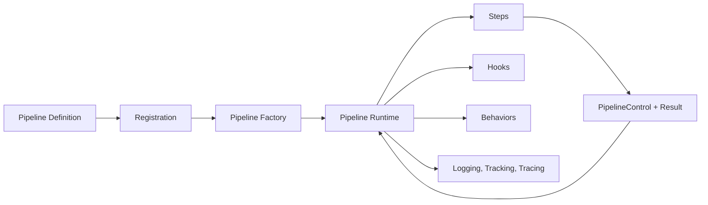
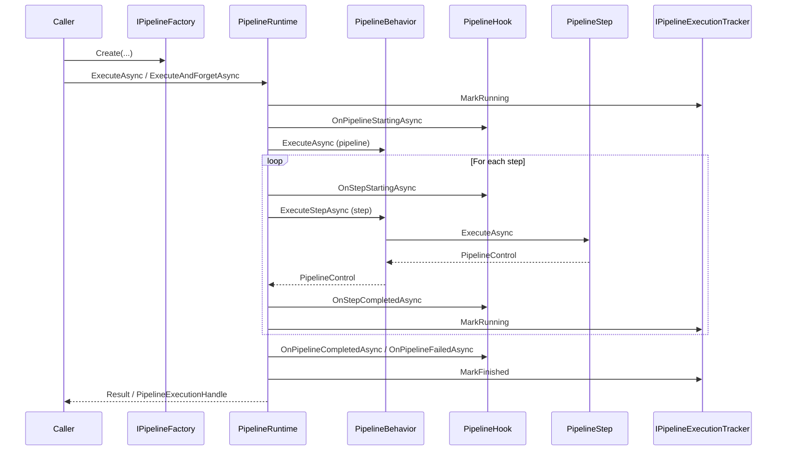
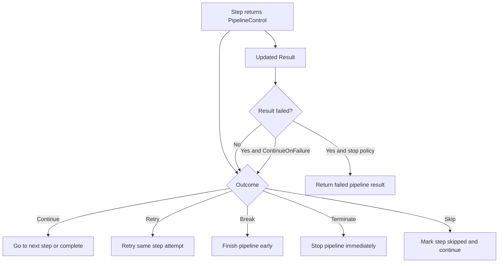
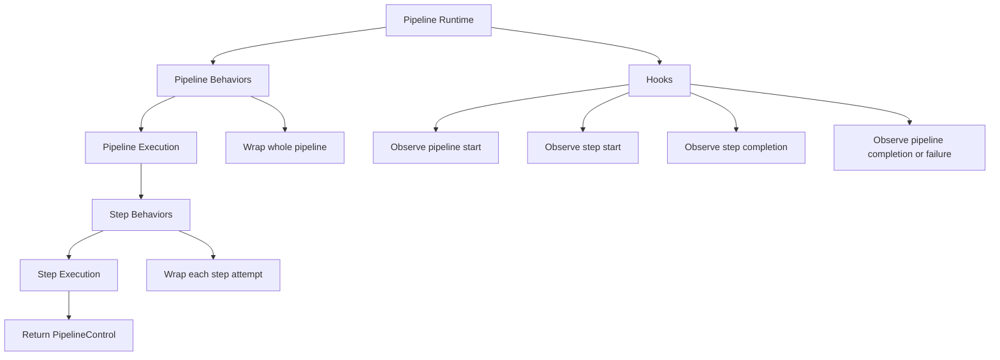
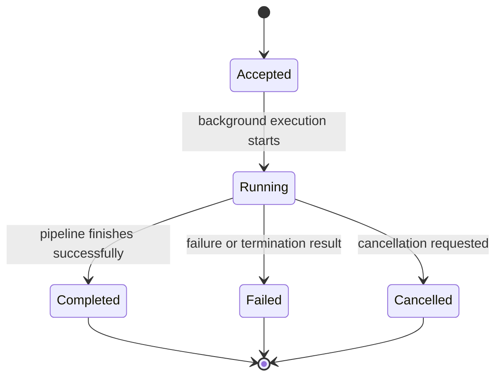
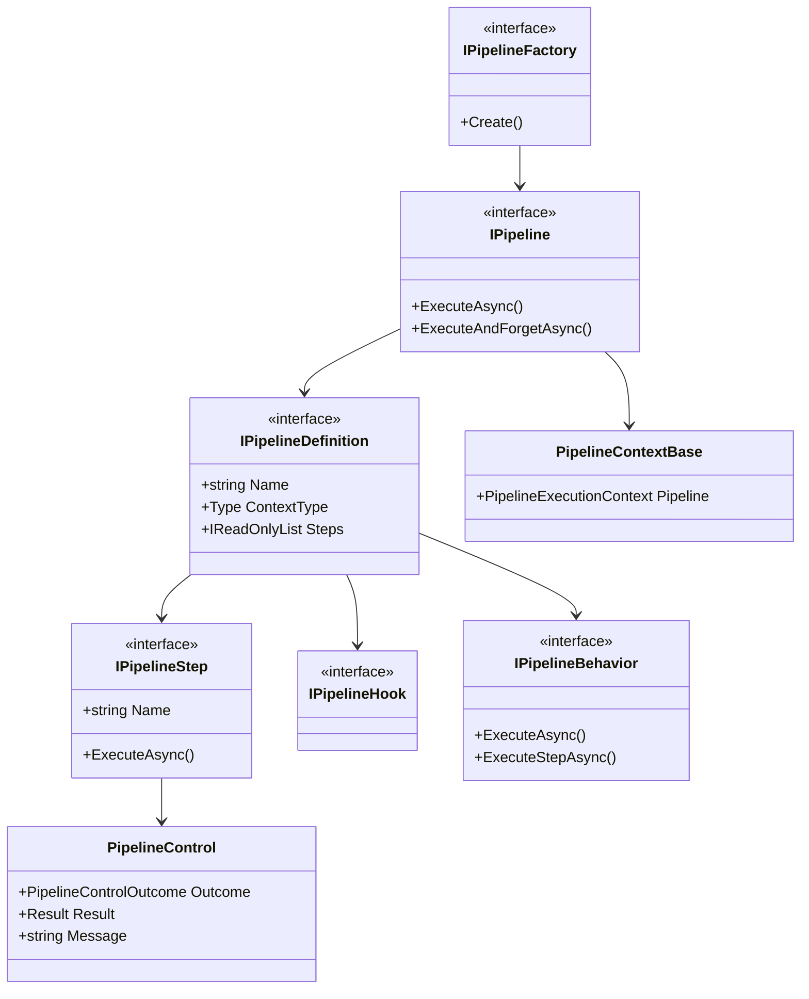

# Pipelines Feature Documentation

> Build structured, observable multi-step workflows with low-friction defaults.

[TOC]

## Overview

The Pipelines feature provides a lightweight way to define and execute ordered multi-step workflows in code.
It is designed for scenarios where work should move through a known series of steps, with shared
context, explicit control flow, consistent logging, and [Result](./features-results.md)-based error
handling.

Conceptually, the feature is derived from the classic pipeline pattern and is closely related to the
chain of responsibility pattern. Each step participates in an ordered flow, can contribute work,
and can influence whether execution continues, retries, breaks, or terminates.

It is intentionally not a classical full workflow engine. The feature focuses on in-process,
code-first workflow orchestration with sane defaults, not on visual workflow modeling, long-running
distributed orchestration, or enterprise BPM-style process management.

Typical examples:

- import and synchronization flows
- background processing workflows
- validation and enrichment pipelines
- multi-step integration calls
- operational scripts that need tracing, logging, and retries

### Challenges

When implementing workflow-style application logic directly in services or handlers, teams often run
into the same problems:

1. **Scattered flow logic**: The sequence of work is spread across multiple services and methods.
2. **Implicit control flow**: It is hard to see when processing continues, stops, retries, or exits early.
3. **Inconsistent observability**: Logging, tracing, and progress reporting vary from step to step.
4. **Weak reuse**: Common cross-cutting concerns like timing, tracing, or auditing get reimplemented.
5. **Background execution friction**: Running workflows in the background with tracking and completion callbacks adds plumbing.
6. **Boilerplate for simple flows**: Developers end up writing too much code for small workflows.

### Solution

The Pipelines feature addresses these problems with:

1. **Explicit pipeline definitions**
   Pipelines are declared as named, ordered definitions with steps, hooks, and behaviors.
2. **Unified execution model**
   Sync steps, async steps, class-based steps, and inline steps all run through the same engine.
3. **Result-based flow**
   Each step returns a `PipelineControl` containing both control intent and the carried `Result`.
4. **Low-friction authoring**
   Defaults like convention-based names, fluent builders, inline steps, and packaged definitions reduce ceremony.
5. **Built-in observability**
   The engine provides structured logging, tracking, and optional tracing.
6. **Composable extensibility**
   Hooks observe lifecycle events and behaviors wrap execution around the pipeline and its steps.

### High-Level Flow



### Key Concepts

- `Pipeline`
  An ordered workflow with a name, optional shared context, steps, hooks, and behaviors.
- `PipelineContextBase`
  Shared execution context base type. Custom pipeline contexts derive from this type.
- `PipelineControl`
  The step return type. It carries the updated `Result` plus a control outcome like `Continue`, `Retry`, `Break`, or `Terminate`.
- `Result`
  The immutable carried operation state that flows through the pipeline.
- `Hook`
  Observes lifecycle events such as pipeline start, step start, step completion, and pipeline completion/failure.
- `Behavior`
  Wraps execution around the whole pipeline and around each step attempt.

## Basic Usage

There are three main ways to define pipelines:

1. packaged pipeline definitions
2. direct fluent builders
3. inline registration during DI setup

### Packaged Pipeline Definition

Packaged definitions are a good default when a pipeline is reusable or belongs clearly to one feature.

```csharp
public partial class OrderImportContext : PipelineContextBase
{
    [ValidateNotEmpty("Source file name is required.")]
    public string SourceFileName { get; set; }

    public int ImportedOrderCount { get; set; }
}

public class OrderImportPipeline : PipelineDefinition<OrderImportContext>
{
    protected override void Configure(IPipelineDefinitionBuilder<OrderImportContext> builder)
    {
        builder
            .AddStep<ValidateOrderImportStep>()
            .AddStep<LoadOrdersStep>()
            .AddStep<PersistOrdersStep>()
            .AddHook<PipelineAuditHook>()
            .AddBehavior<PipelineTracingBehavior>()
            .AddBehavior<PipelineTimingBehavior>();
    }
}

public class ValidateOrderImportStep : PipelineStep<OrderImportContext>
{
    protected override PipelineControl Execute(
        OrderImportContext context,
        Result result,
        PipelineExecutionOptions options)
    {
        if (string.IsNullOrWhiteSpace(context.SourceFileName))
        {
            return PipelineControl.Terminate(
                result.WithError(new Error("Source file name is required.")));
        }

        return PipelineControl.Continue(result.WithMessage("Validation finished."));
    }
}

public class LoadOrdersStep : AsyncPipelineStep<OrderImportContext>
{
    protected override async ValueTask<PipelineControl> ExecuteAsync(
        OrderImportContext context,
        Result result,
        PipelineExecutionOptions options,
        CancellationToken cancellationToken)
    {
        await Task.Delay(10, cancellationToken);
        context.ImportedOrderCount = 42;

        return PipelineControl.Continue(result.WithMessage("Orders loaded."));
    }
}
```

### Context Validation

When the context type declares validation attributes or a static `[Validate]` method, the pipeline engine validates the context before hooks, behaviors, and steps run.

```csharp
public partial class OrderImportContext : PipelineContextBase
{
    [ValidateNotEmpty("Source file name is required.")]
    public string SourceFileName { get; set; }

    public int ImportedOrderCount { get; set; }

    [Validate]
    private static void Validate(InlineValidator<OrderImportContext> validator)
    {
        validator.RuleFor(x => x.ImportedOrderCount).GreaterThanOrEqualTo(0);
    }
}
```

Add the code-generation analyzer package to the project that contains the pipeline context:

```xml
<PackageReference Include="BridgingIT.DevKit.Common.Utilities.CodeGen"
                  Version="x.y.z"
                  PrivateAssets="all" />
```

### Authoring and Registration Options

```mermaid
flowchart TD
    A[Developer] --> B{How to define pipeline?}
    B -->|Reusable feature workflow| C[PipelineDefinition<TContext>]
    B -->|Programmatic definition| D[PipelineDefinitionBuilder<TContext>]
    B -->|Small local workflow| E[services.AddPipelines().WithPipeline(...)]

    C --> F[Register packaged pipeline]
    D --> G[Build IPipelineDefinition]
    E --> H[Register inline pipeline]

    F --> I[IPipelineFactory]
    G --> I
    H --> I
```

### Direct Builder

Use the builder directly when you want to construct a definition programmatically.

```csharp
var definition = new PipelineDefinitionBuilder<OrderImportContext>("order-import")
    .AddStep<ValidateOrderImportStep>()
    .AddStep<LoadOrdersStep>()
    .AddStep(context => context.ImportedOrderCount++)
    .AddAsyncStep(async execution =>
    {
        await Task.Yield();
        return execution.Continue(execution.Result.WithMessage("Inline step finished."));
    })
    .AddBehavior<PipelineTracingBehavior>()
    .Build();
```

### Inline Registration During DI Setup

Inline registration is useful for small, local pipelines that do not need a dedicated class.

```csharp
services.AddPipelines()
    .WithPipeline<OrderImportContext>("order-import", builder => builder
        .AddStep<ValidateOrderImportStep>()
        .AddStep<LoadOrdersStep>()
        .AddStep(context => context.ImportedOrderCount++)
        .AddBehavior<PipelineTracingBehavior>());
```

## Registration and Resolution

### Registering Pipelines

Register packaged pipelines:

```csharp
services.AddPipelines()
    .WithPipeline<OrderImportPipeline>();
```

Register inline pipelines:

```csharp
services.AddPipelines()
    .WithPipeline<OrderImportContext>("order-import", builder => builder
        .AddStep<ValidateOrderImportStep>());
```

Register all packaged pipelines from one or more assemblies:

```csharp
services.AddPipelines()
    .WithPipelinesFromAssembly<OrderImportPipeline>();

services.AddPipelines()
    .WithPipelinesFromAssemblies(
        typeof(ModuleAAssemblyMarker).Assembly,
        typeof(ModuleBAssemblyMarker).Assembly);
```

`AddPipelines()` is additive, so multiple modules in the same host may call it independently.

### Resolving Pipelines

Resolve by name:

```csharp
var pipeline = pipelineFactory.Create<OrderImportContext>("order-import");
```

Resolve by packaged definition type and context:

```csharp
var pipeline = pipelineFactory.Create<OrderImportPipeline, OrderImportContext>();
```

Resolve a packaged no-context pipeline:

```csharp
var pipeline = pipelineFactory.Create<FileCleanupPipeline>();
```

## Execution

### Awaited Execution

```csharp
var context = new OrderImportContext
{
    SourceFileName = "orders.csv"
};

var result = await pipeline.ExecuteAsync(
    context,
    options => options
        .ContinueOnFailure()
        .MaxRetryAttemptsPerStep(3));
```

### Fire-and-Forget Execution

```csharp
var handle = await pipeline.ExecuteAndForgetAsync(
    context,
    options => options.WhenCompleted(completion =>
    {
        Console.WriteLine($"Pipeline {completion.ExecutionId} finished with {completion.Status}");
        return ValueTask.CompletedTask;
    }));

var snapshot = await tracker.GetAsync(handle.ExecutionId);
```

### Execution Options

Pipeline execution can be configured per run through `PipelineExecutionOptions` or the fluent
options builder passed to `ExecuteAsync(...)` and `ExecuteAndForgetAsync(...)`.

The main options are:

- `ContinueOnFailure()`
  Allows later steps to continue even when the carried `Result` is already failed.
- `MaxRetryAttemptsPerStep(int value)`
  Controls how many times a step may return `Retry(...)` before the runtime stops and marks the
  execution as failed.
- `WithProgress(IProgress<ProgressReport>)`
  Exposes a progress reporter to steps through `options.Progress`, so step implementations can
  report their own progress.
- `AccumulateDiagnosticsOnFailure(bool value = true)`
  Controls whether messages and errors are preserved when execution stops because of failure.
- `AccumulateDiagnosticsOnBreak(bool value = true)`
  Controls whether messages and errors are preserved when execution stops because of a `Break(...)`
  outcome.
- `WhenCompleted(Func<PipelineCompletion, ValueTask>)`
  Registers a completion callback for fire-and-forget execution after the tracked snapshot has been
  finalized.

Example:

```csharp
var result = await pipeline.ExecuteAsync(
    context,
    options => options
        .ContinueOnFailure()
        .MaxRetryAttemptsPerStep(5)
        .AccumulateDiagnosticsOnFailure()
        .WithProgress(new Progress<ProgressReport>(report =>
            Console.WriteLine($"{report.Operation}: {report.PercentageComplete}%"))));
```

### Runtime Execution Flow



## Step Authoring

### Class-Based Steps

Use class-based steps for reusable or non-trivial workflow logic.

```csharp
public class PersistOrdersStep : AsyncPipelineStep<OrderImportContext>
{
    protected override async ValueTask<PipelineControl> ExecuteAsync(
        OrderImportContext context,
        Result result,
        PipelineExecutionOptions options,
        CancellationToken cancellationToken)
    {
        await repository.SaveAsync(context.ImportedOrderCount, cancellationToken);
        return PipelineControl.Continue(result.WithMessage("Orders persisted."));
    }
}
```

### Inline Steps

Inline steps are convenient for small workflow fragments.

```csharp
builder
    .AddStep(() => Console.WriteLine("sync step"))
    .AddAsyncStep(async () => await Task.Yield())
    .AddStep(context => context.ImportedOrderCount++)
    .AddAsyncStep(async context =>
    {
        await Task.Delay(10);
        context.ImportedOrderCount++;
    });
```

For full control, use the execution object:

```csharp
builder.AddAsyncStep(async execution =>
{
    var repository = execution.Services.GetRequiredService<IOrderRepository>();

    if (execution.Result.IsFailure)
    {
        return execution.Break();
    }

    await repository.SaveAsync(execution.CancellationToken);
    return execution.Continue(execution.Result.WithMessage("Saved from inline step."));
});
```

## Flow Control

Every step returns a `PipelineControl`, which combines:

- the updated carried `Result`
- the step control outcome

### Continue

Continue to the next step, or complete normally if this is the last step.

```csharp
return PipelineControl.Continue(result.WithMessage("Validation passed."));
```

### Retry

Retry the same step immediately, bounded by `MaxRetryAttemptsPerStep`.

```csharp
return PipelineControl.Retry(result.WithMessage("Transient failure, retrying."));
```

### Break

End the pipeline early in a controlled way.

```csharp
return PipelineControl.Break(result.WithMessage("No work required."));
```

### Terminate

Stop the pipeline intentionally without continuing.

```csharp
return PipelineControl.Terminate(result.WithError(new Error("Import blocked.")));
```

### Failures and Exceptions

If a step throws:

- the engine catches the exception
- it appends an `ExceptionError` to the carried `Result`
- the `Result` becomes failed
- continuation is then decided by pipeline options such as `ContinueOnFailure`

This makes thrown exceptions behave consistently with class-based and inline steps alike.

### Step Outcome Model



## Hooks and Behaviors

### Hooks

Hooks observe lifecycle events. They do not wrap execution.

Use hooks for:

- auditing
- notifications
- pipeline lifecycle observation
- step lifecycle observation

```csharp
public class PipelineAuditHook : PipelineHook<PipelineContextBase>
{
    public override ValueTask OnPipelineStartingAsync(
        PipelineContextBase context,
        CancellationToken cancellationToken)
    {
        logger.LogInformation("Pipeline {Name} started", context.Pipeline.Name);
        return ValueTask.CompletedTask;
    }
}
```

### Behaviors

Behaviors wrap execution around:

- the whole pipeline
- each step attempt

Use behaviors for:

- tracing
- timing
- ambient scopes
- cross-cutting execution concerns

```csharp
builder
    .AddBehavior<PipelineTracingBehavior>()
    .AddBehavior<PipelineTimingBehavior>();
```

### Extensibility Roles



## Naming Conventions and Defaults

The feature intentionally uses low-friction defaults.

### Pipeline Names

Packaged pipeline definitions default to kebab-case from the type name with a trailing `Pipeline`
removed:

- `OrderImportPipeline` -> `order-import`

### Step Names

Class-based steps default to kebab-case from the type name with a trailing `Step` removed:

- `ValidateOrderImportStep` -> `validate-order-import`
- `PersistOrdersStep` -> `persist-orders`

Inline steps default to generated names:

- `inline-step-1`
- `inline-step-2`

These names are used consistently for:

- internal logging
- tracking
- current-step reporting
- tracing
- diagnostics

## Conditional Registration

Steps, hooks, and behaviors can be included or excluded when building the definition.

```csharp
var enableLoad = true;
var enableTracing = false;

builder
    .AddStep<ValidateOrderImportStep>()
    .AddStep<LoadOrdersStep>(enableLoad)
    .AddBehavior<PipelineTracingBehavior>(enableTracing);
```

If `enabled` is `false`, the component is not registered into the built definition at all. It is
not present at runtime.

## Logging and Tracing

### Internal Logging

The engine logs pipeline progression internally using the pipeline and step names, not CLR type
names.

The message format follows the standard devkit shape:

- `[PLN] message (prop1=abc, prop2=xyz, ...)`
- `[PLN] message finished (prop1=abc, prop2=xyz, ...) -> took 12.23ms`

### Tracing

`PipelineTracingBehavior` integrates with `ActivitySource` and OpenTelemetry:

- one outer activity for the pipeline
- nested activities for each executed step

This produces end-to-end trace visibility without requiring step authors to manage activities
themselves.

## Tracking

Tracking is primarily relevant for fire-and-forget execution through `ExecuteAndForgetAsync(...)`.
When a pipeline is executed in the background, the caller receives a `PipelineExecutionHandle`
immediately and can later inspect progress and the final outcome through
`IPipelineExecutionTracker`.

This is useful when:

- a request should hand off long-running work and return quickly
- a UI or API wants to poll for progress or final completion
- operational tooling should inspect what the pipeline is currently doing
- completion callbacks are helpful, but external consumers still need a queryable execution state

The tracker stores execution snapshots that represent the latest known state of a background run.
Those snapshots are updated by the runtime as execution progresses.

Snapshots expose:

- `ExecutionId`
- `PipelineName`
- `Status`
- `CurrentStepName`
- `StartedUtc`
- `CompletedUtc`
- latest carried `Result`

In practice, that means a caller can see:

- whether the execution has only been accepted or is already running
- which step is currently being executed
- when execution started and when it finished
- whether the pipeline completed, failed, or was cancelled
- the latest carried `Result`, including accumulated messages and errors

The snapshot is finalized before a configured `WhenCompleted(...)` callback is invoked. This makes
the tracker the canonical source for querying execution state, while the callback acts as a
convenience notification mechanism.

Statuses:

- `Accepted`
- `Running`
- `Completed`
- `Failed`
- `Cancelled`

### Background Execution State Model



## Architecture

### Component Overview



### Folder Structure

The implementation is organized by sub-feature:

- `Configuration`
- `Context`
- `Definitions`
- `Execution`
- `Registration`
- `Steps`
- `Tracking`
- `Observability`
- `Hooks`
- `Behaviors`

This keeps authoring, runtime, tracking, and extensibility concerns easier to navigate.

## Best Practices

1. **Prefer packaged pipelines for reusable workflows**
   Use `PipelineDefinition<TContext>` when a flow belongs clearly to a feature or module.
2. **Use inline steps for small local logic**
   Inline steps are great for small orchestration fragments, not large business workflows.
3. **Keep shared data in the context**
   Put workflow state in the pipeline context instead of scattering transient variables across steps.
4. **Use `Result` for recoverable failures**
   Let the carried `Result` describe business or technical failure state explicitly.
5. **Reserve exceptions for exceptional cases**
   Thrown exceptions are supported, but normal flow should prefer `Result` and `PipelineControl`.
6. **Keep behaviors cross-cutting**
   Tracing, timing, and ambient scopes belong in behaviors, not in step logic.
7. **Use hooks for observation**
   Auditing and lifecycle observation should normally be hook-based.
8. **Rely on defaults when they are good enough**
   Convention-based names and fluent builders exist to reduce friction.

## When to Use Pipelines

Pipelines are a strong fit when:

- work is naturally step-based
- the sequence should be explicit and observable
- shared state should flow through one context object
- retries, early exits, background execution, or tracing are needed

Pipelines are usually not the best choice when:

- the logic is a simple one-method operation
- there is no meaningful step structure
- orchestration overhead would exceed the value of the abstraction

Choose the simplest tool that fits. Pipelines are intended to be lightweight workflow composition,
not a full workflow engine.

## Relation to Other Features

The Pipelines feature integrates especially well with:

- [Results](./features-results.md)
  The carried `Result` is the primary success/failure state through the pipeline.
- [Rules](./features-rules.md)
  Rules are a good fit inside validation steps.

Together, these features support explicit flow control, rich validation, and consistent outcome
handling without introducing a heavyweight orchestration framework.

## Appendix A: Pipeline Code Generation

The Pipelines feature also offers an optional source-generation layer for packaged pipelines. It is
meant to remove repetitive authoring boilerplate, while still using the same runtime, the same
registration model, and the same execution semantics described above.

### What It Adds

Code generation is focused on packaged pipeline definitions:

- declare a `partial` pipeline class with `[Pipeline]` and no explicit base class
- declare step methods with `[PipelineStep(order)]`
- add class-level hooks with `[PipelineHook(typeof(...))]`
- add class-level behaviors with `[PipelineBehavior(typeof(...))]`

Use `[Pipeline]` for no-context pipelines and `[Pipeline(typeof(TContext))]` for context-aware
pipelines. The generator then emits the normal packaged pipeline definition plumbing, including the
appropriate `PipelineDefinition` base class, for you. Generated pipelines still register like
manual packaged pipelines:

```csharp
services.AddPipelines()
    .WithPipeline<OrderImportPipeline>();
```

and resolve the same way:

```csharp
var pipeline = pipelineFactory.Create<OrderImportPipeline, OrderImportContext>();
```

### Example

```csharp
[Pipeline(typeof(OrderImportContext))]
[PipelineHook(typeof(PipelineAuditHook))]
[PipelineBehavior(typeof(PipelineTracingBehavior))]
[PipelineBehavior(typeof(PipelineTimingBehavior))]
public partial class OrderImportPipeline
{
    [PipelineStep(10)]
    public Result Validate(OrderImportContext context, Result result)
    {
        return result.WithMessage("validated");
    }

    [PipelineStep(20)]
    public async Task<Result> LoadAsync(
        OrderImportContext context,
        Result result,
        IOrderImportRepository repository,
        CancellationToken cancellationToken)
    {
        var orders = await repository.LoadAsync(context.SourceFileName, cancellationToken);
        context.ImportedOrderCount = orders.Count;
        return result.WithMessage($"loaded {orders.Count} orders");
    }

    [PipelineStep(30, Name = "persist-generated")]
    public PipelineControl Persist(
        OrderImportContext context,
        Result result,
        IOrderRepository repository)
    {
        repository.SaveImportedOrders(context.TenantId);
        return PipelineControl.Continue(result.WithMessage("persisted"));
    }

    partial void OnConfigureGenerated(IPipelineDefinitionBuilder<OrderImportContext> builder)
    {
        builder.AddStep(ctx => ctx.Pipeline.Items.Set("extended", true), name: "manual-extension");
    }
}
```

### Supported Step Signatures

Generated step methods may use these runtime inputs:

- `TContext`
- `Result`
- `CancellationToken`

Any additional method parameters are treated as DI services and resolved through the normal
container.

Supported return types are:

- `void`
- `Task`
- `Result`
- `Task<Result>`
- `PipelineControl`
- `Task<PipelineControl>`

The runtime behavior matches manual steps:

- `void` and `Task` keep the current carried `Result` and continue
- `Result` and `Task<Result>` replace the carried `Result` and continue
- `PipelineControl` and `Task<PipelineControl>` provide full flow control, including `Retry(...)`,
  `Break(...)`, and `Terminate(...)`

### Naming and Diagnostics

Generated pipelines follow the same naming conventions as manual pipelines:

- pipeline names default from the class name, for example `OrderImportPipeline` -> `order-import`
- step names default from the method name, for example `LoadAsync` -> `load`
- explicit names can still be provided through `PipelineStepAttribute.Name`

The generator also emits compile-time diagnostics for invalid authoring, including:

- pipeline class is not `partial`
- pipeline class declares an explicit base class
- declared pipeline context does not derive from `PipelineContextBase`
- unsupported step method signatures
- `async void` step methods
- duplicate generated step orders
- duplicate generated step names
- incompatible hook or behavior types

The source generation acts as a thin authoring convenience layer instead of a second hidden pipeline model.
