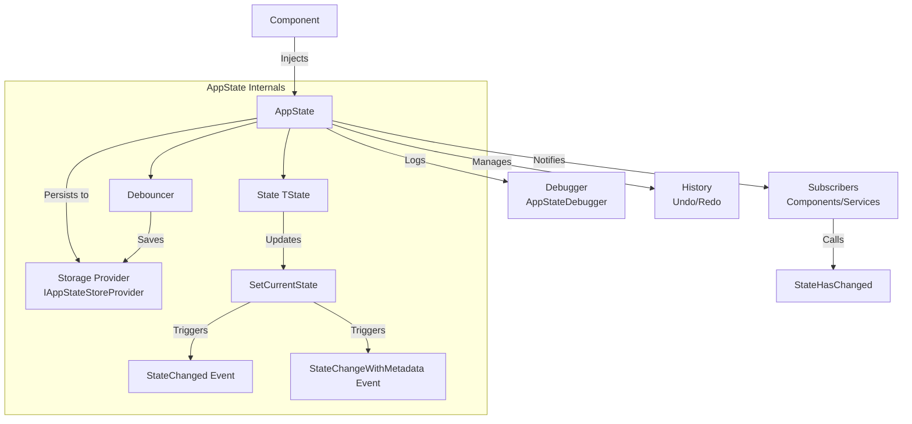
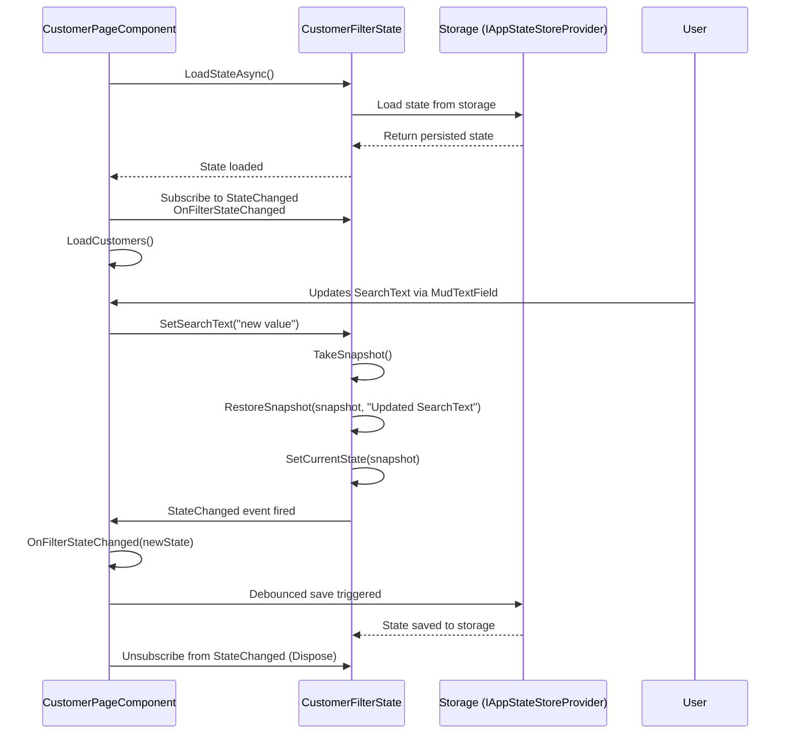

# AppState Feature Documentation

## Overview

`AppState<T>` is an abstract base class designed for state management in Blazor applications. It provides features for persistence, history (undo/redo), and change notifications, making it ideal for managing application state in a robust and scalable way. Developers can create strongly-typed state classes that persist to storage (e.g., local storage), support undo/redo operations, and notify subscribers of state changes.

### Visual Overview

Below is a Mermaid flowchart that illustrates the key components and flow of `AppState<T>`:



- **Component**: A Blazor component that injects `AppState<T>` to manage state.
- **AppState**: The core state management class, handling state updates, persistence, history, and notifications.
- **Storage Provider**: Persists state to storage (e.g., local storage).
- **Subscribers**: Components or services that react to state changes via events.
- **Debugger**: Logs state changes for debugging.
- **History**: Manages undo/redo operations.
- **Debouncer**: Delays state saving to improve performance.

### Component Interaction with Filter State

Below is a sequence diagram that illustrates how the `CustomerPageComponent` interacts with `CustomerFilterState` during its lifecycle, including initialization, state updates, and filtering:



- **Initialization**: The component loads the state from storage and subscribes to `StateChanged` with the `OnFilterStateChanged` handler.
- **Data Loading**: The component loads customers.
- **User Interaction**: The user updates the `SearchText` filter, triggering `SetSearchText`.
- **State Update**: `SetSearchText` updates the state via `RestoreSnapshot`, which calls `SetCurrentState`.
- **Notification**: `SetCurrentState` fires the `StateChanged` event, notifying the component.
- **Reaction**: The component’s `OnFilterStateChanged` handler is called with the new state.
- **Persistence**: The debouncer saves the updated state to storage.
- **Cleanup**: The component unsubscribes from events during disposal.

## Key Features

- **State Persistence**: Persist state to a storage provider (e.g., local storage) using `IAppStateStoreProvider`.
- **History Management**: Enable undo/redo with configurable history limits via `AppStateOptions`.
- **Change Notifications**: Raise `StateChanged` and `StateChangeWithMetadata` events when the state changes, allowing components and services to react.
- **Debounced Saving**: Automatically save state changes with a configurable debounce delay.
- **Thread Safety**: Uses concurrent collections for history management.
- **Debugging**: Supports debugging via `AppStateDebugger` for logging and tracking state changes.

## Usage

### 1. Creating a State Class

To use `AppState<T>`, create a derived class that defines your state model and implements the required abstract methods. For example, `CustomerFilterState` manages filter state for a customer list.

```csharp
public class CustomerFilterStateModel
{
    public Status Status { get; set; }
    public string CustomerType { get; set; }
    public string SearchText { get; set; } = string.Empty;
}

public class CustomerFilterState : AppState<CustomerFilterStateModel>
{
    public CustomerFilterState(
        ILogger<CustomerFilterState> logger,
        AppStateOptions options,
        IAppStateStoreProvider storageProvider = null,
        IUserContextProvider userContextProvider = null,
        AppStateDebugger debugger = null)
        : base(logger, options, storageProvider, userContextProvider, debugger)
    {
    }

    private CustomerFilterStateModel currentState = new();

    protected override CustomerFilterStateModel GetCurrentState() => this.currentState;

    protected override CustomerFilterStateModel CreateDefaultState() => new();

    protected override void UpdateState(CustomerFilterStateModel state) => this.currentState = state;

    public Status Status
    {
        get => this.currentState.Status;
        set => this.SetStatus(value).Wait();
    }

    public string CustomerType
    {
        get => this.currentState.CustomerType;
        set => this.SetCustomerType(value).Wait();
    }

    public string SearchText
    {
        get => this.currentState.SearchText;
        set => this.SetSearchText(value).Wait();
    }

    public async Task SetStatus(Status value)
    {
        var snapshot = this.TakeSnapshot();
        snapshot.Status = value;
        await this.RestoreSnapshot(snapshot, $"Updated {nameof(CustomerFilterStateModel.Status)} -> {value}");
    }

    public async Task SetCustomerType(string value)
    {
        var snapshot = this.TakeSnapshot();
        snapshot.CustomerType = value;
        await this.RestoreSnapshot(snapshot, $"Updated {nameof(CustomerFilterStateModel.CustomerType)} -> {value}");
    }

    public async Task SetSearchText(string value)
    {
        var snapshot = this.TakeSnapshot();
        snapshot.SearchText = value ?? string.Empty;
        await this.RestoreSnapshot(snapshot, $"Updated {nameof(CustomerFilterStateModel.SearchText)} -> {value}");
    }
}
```

**Key Points**:

- Implement the abstract methods: `GetCurrentState`, `CreateDefaultState`, and `UpdateState`.
- Use properties to expose state values and update the state using methods like `SetSearchText`, which call `RestoreSnapshot` to trigger change notifications.
- Add validation in setter methods to ensure state integrity (e.g., validating `Status` values).

### 2. Registering the State in DI

Use the `StateBuilder` to register your state class in the DI container, typically with a scoped lifetime for local storage persistence.

**Example:** `Program.cs`

```csharp
builder.Services.AddAppState()
    .WithDebugging(debug =>
    {
        debug.LoggingEnabled = true;
        debug.StateChangesTracked = true;
    })
    .AddState<CustomerFilterState>()
        .AsLocalStorageScoped()
        .WithHistory(maxItems: 10)
        .WithDebounceDelay(TimeSpan.FromSeconds(1))
        .Done();
```

**Persistence Options**:

- `AsLocalStorageScoped`: Persists the state to local storage with a scoped lifetime.
- `WithPersistence(StatePersistenceType.ComponentScoped)`: Persists state only for the lifetime of a component.
- `WithPersistence(StatePersistenceType.SessionScoped)`: Persists state for the session duration.
- `WithDebounceDelay`: Sets the delay for debounced state saving (e.g., 1 second to balance performance and persistence).

### 3. Subscribing to State Changes

Components can subscribe to the `StateChanged` or `StateChangeWithMetadata` events to react to state changes, such as updating the UI or re-fetching data.

- `StateChanged`: `Action<object>` - Provides the new state object whenever the state changes.
- `StateChangeWithMetadata`: `Action<IStateChangeMetadata>` - Provides detailed metadata about the change, including `StateId`, `Timestamp`, `Operation`, `OldValue`, `NewValue`, and `Reason`.

**Example: Customer Filter Component**

```razor
<MudSelect T="string" Label="Status" Dense="true" Clearable="true"
           Value="@FilterState.Status" ValueChanged="@(async (string value) => await FilterState.SetStatus(value))"
           Margin="Margin.Dense" Style="width: 120px;">
    <MudSelectItem Value="@(null)">Alle</MudSelectItem>
    <MudSelectItem Value="@("Aktiv")">Aktiv</MudSelectItem>
    <MudSelectItem Value="@("Inaktiv")">Inaktiv</MudSelectItem>
</MudSelect>

<MudTextField Value="@FilterState.SearchText" ValueChanged="@(async (string value) => await FilterState.SetSearchText(value))"
              Placeholder="Search customers" Clearable="true"
              Adornment="Adornment.Start" AdornmentIcon="@Icons.Material.Filled.Search"
              IconSize="Size.Medium" Immediate="true" DebounceInterval="300"
              Margin="Margin.Dense" Style="width: 230px;" />
```

**Code-Behind**:

```csharp
protected override async Task OnInitializedAsync()
{
    await FilterState.LoadStateAsync();
    FilterState.StateChanged += OnFilterStateChanged;

    await LoadCustomers();
}

private async void OnFilterStateChanged(object newState)
{
    Console.WriteLine($"Filter state changed: {JsonSerializer.Serialize(newState)}");
    await ApplyFilters();
}

public void Dispose()
{
    FilterState.StateChanged -= OnFilterStateChanged;
}
```

**Key Points**:

- Use `Value` and `ValueChanged` to update state properties without `@bind-`.
- Subscribe to `StateChanged` in `OnInitialized` to react to state changes.
- Unsubscribe in `Dispose` to prevent memory leaks.

### 4. Persisting and Loading State

- **Load State**: Call `LoadStateAsync` to initialize the state from storage during component initialization.
- **Save State**: State changes are automatically saved with a debounce delay (configured via `AppStateOptions`).

**Example**:

```csharp
protected override async Task OnInitializedAsync()
{
    await FilterState.LoadStateAsync();
    FilterState.StateChanged += OnFilterStateChanged;

    await LoadCustomers();
}
```

### 5. Using Undo/Redo

Enable history in the `AppStateOptions` to support undo/redo operations.

**Example: Enabling Undo/Redo**

```csharp
builder.Services.AddAppState()
    .WithDebugging(debug =>
    {
        debug.LoggingEnabled = true;
        debug.StateChangesTracked = true;
    })
    .AddState<CustomerFilterState>()
        .AsLocalStorageScoped()
        .WithHistory(maxItems: 10)
        .Done();
```

**Example: Adding Undo/Redo Buttons**

```razor
<MudButton OnClick="@(() => FilterState.UndoAsync())" Disabled="@(!FilterState.CanUndo)">Undo</MudButton>
<MudButton OnClick="@(() => FilterState.RedoAsync())" Disabled="@(!FilterState.CanRedo)">Redo</MudButton>
```

### 6. Triggering State Changes Manually

If you need to notify subscribers without changing the state (e.g., after loading entities to apply filtering based on the current state), directly call the event handler instead of invoking the event. This ensures the handler is triggered with the current state.

**Example**:

```csharp
await LoadEntities();
OnFilterStateChanged(FilterState.CurrentState); // Trigger filtering by directly calling the handler
```

### 7. Testing and Debugging

Use the `AppStateDebugger` to log and track state changes for debugging.

**Example: Enabling Debugging**

```csharp
builder.Services.AddAppState()
    .WithDebugging(debug =>
    {
        debug.LoggingEnabled = true;
        debug.StateChangesTracked = true;
    })
    .AddState<CustomerFilterState>()
        .AsLocalStorageScoped()
        .Done();
```

### 8. Performance Considerations

- **Large State Objects**: Minimize the size of `TState` to reduce serialization overhead during persistence.
- **Frequent Updates**: Use a reasonable debounce delay to avoid excessive saves (e.g., 300-1000ms).
- **History Management**: Set a low `maxItems` for history to prevent memory bloat (e.g., 10-50 items).

### 9. Integration with Other Services

Integrate `AppState<T>` with other services (e.g., a mediator for commands/queries) to fetch data or perform actions based on state changes.

**Example: Using a Mediator**

```csharp
private async Task LoadCustomers()
{
    var filter = new CustomerFilter
    {
        SearchText = FilterState.SearchText,
        Status = FilterState.Status
    };
    var response = await mediator.Send(new FetchCustomersQuery(filter));
    customers = response.Result.Value.ToList();

    OnFilterStateChanged(FilterState.CurrentState); // Apply filtering after loading
}
```

### 10. Lifecycle Management

- **Scoped Lifetime**: `AppState<T>` instances are typically scoped, meaning they’re created when a new DI scope begins (e.g., a new page load) and disposed when the scope ends.
- **Disposal**: Ensure components unsubscribe from events in `Dispose` to avoid memory leaks. `AppState<T>` itself disposes the debouncer in its `Dispose` method.

## Best Practices

- **Scoped Lifetime**: Use `AsLocalStorageScoped` to ensure components on the same page share the same state instance.
- **Unsubscribe Events**: Always unsubscribe from `StateChanged` and `StateChangeWithMetadata` in `Dispose` to prevent memory leaks.
- **Debounce Delay**: Configure the debounce delay to balance performance and persistence (e.g., `.WithDebounceDelay(TimeSpan.FromSeconds(1))`).
- **History Limits**: Set a reasonable `maxItems` for history to avoid excessive memory usage (e.g., 10-50 items).
- **Thread Safety**: Ensure your state model (`TState`) is thread-safe if accessed concurrently.

## Common Scenarios

- **Filter Form**: A form updates the state (e.g., `SearchText`), and a table component reacts by re-filtering data.
- **State Reset**: A reset button calls `ResetAsync` to clear the state and storage, notifying all subscribers.
- **Undo/Redo**: A component provides undo/redo buttons to revert or reapply state changes.
- **Multi-Component Updates**: Multiple components on the same page subscribe to `StateChanged` to react to state changes (e.g., a filter form and a summary component).
- **Advanced Scenarios**:
  - **Nested State**: Combine multiple `AppState<T>` instances for nested state management (e.g., a parent state managing child states).
  - **Multi-Page Apps**: Use a singleton lifetime for state classes if they need to persist across page navigation.

## Appendix: Internals of AppState

### State Storage
- **Current State**: Stored in a private field (e.g., `currentState`) in the derived class, managed through `GetCurrentState` and `UpdateState` methods.
- **Persistence**: The state is serialized to JSON and saved to storage via `IAppStateStoreProvider` (e.g., local storage) in the `SaveStateAsyncInternal` method, which is called by the debouncer.
- **Loading**: The `LoadStateAsync` method deserializes the state from storage and updates the current state using `SetCurrentState`.

### History Management
- **Undo/Redo Stacks**: Maintains two `Stack<TState>` objects (`undoStack` and `redoStack`) to store state snapshots for undo/redo operations.
- **Limits**: The maximum number of history items is controlled by `AppStateOptions.MaxHistoryItems`, preventing excessive memory usage.
- **Operations**: `UndoAsync` pops a state from `undoStack`, pushes the current state to `redoStack`, and restores the previous state. `RedoAsync` does the reverse.

### Change Notifications
- **Events**: Defines `StateChanged` (`Action<object>`) and `StateChangeWithMetadata` (`Action<IStateChangeMetadata>`) events to notify subscribers.
- **Triggering**: Events are fired in `SetCurrentState` when the state changes (i.e., when `oldState` and `newState` are not equal, based on `Equals` comparison).
- **Metadata**: The `StateChangeWithMetadata` event includes a `StateChangeMetadata<T>` object with properties like `StateId`, `Timestamp`, `Operation`, `OldValue`, `NewValue`, and `Reason`.

### Debounced Saving
- **Debouncer**: Utilizes a `Debouncer` instance (`saveDebouncer`) to delay state persistence, reducing the frequency of storage writes.
- **Configuration**: The debounce delay is set via `AppStateOptions.DebounceDelay` (e.g., 300ms by default).
- **Mechanism**: The `saveDebouncer` triggers `SaveStateAsyncInternal`, which serializes the state and saves it to storage.

### Debugging
- **Debugger Integration**: Uses `AppStateDebugger` to log state changes and track metadata, controlled by `LoggingEnabled` and `StateChangesTracked` settings.
- **Logging**: State changes are logged with details like the reason, old state, and new state, aiding in debugging.

### Lifecycle
- **Initialization**: `AppState<T>` instances are created via dependency injection with a scoped lifetime, typically during page load or component initialization.
- **Disposal**: The `Dispose` method ensures the `saveDebouncer` is disposed, cleaning up resources when the instance is no longer needed.