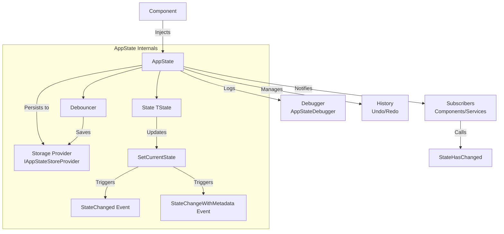
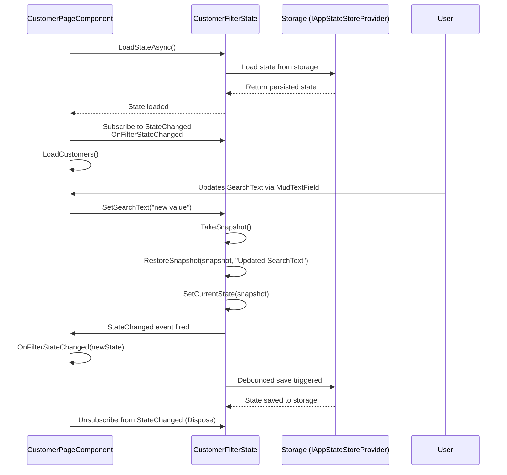

# AppState

> Manage Blazor application state with persistence, history, and change notifications.

[TOC]

## Overview

`AppState<T>` is an abstract base class for Blazor application state. A derived state class can persist snapshots, retain undo and redo history, and notify subscribers when the state changes.

### Visual overview

Below is a Mermaid flowchart that illustrates the key components and flow of `AppState<T>`:


```mermaid
flowchart TD
    A[Component] -->|Injects| B[AppState<T>]
    B -->|Persists to| C[Storage Provider<br> IAppStateStoreProvider]
    B -->|Notifies| D[Subscribers<br> Components/Services]
    B -->|Logs| E[Debugger<br> AppStateDebugger]
    B -->|Manages| F[History<br>Undo/Redo]

    subgraph AppState Internals
        B --> G[State TState]
        B --> H[Debouncer]
        G -->|Updates| I[SetCurrentState]
        I -->|Triggers| J[StateChanged Event]
        I -->|Triggers| K[StateChangeWithMetadata Event]
        H -->|Saves| C
    end

    D -->|Calls| L[StateHasChanged]
```

- **Component**: A Blazor component that injects `AppState<T>` to manage state.
- **AppState**: The core state management class, handling state updates, persistence, history, and notifications.
- **Storage Provider**: Persists state to storage (e.g., local storage).
- **Subscribers**: Components or services that react to state changes via events.
- **Debugger**: Logs state changes for debugging.
- **History**: Manages undo/redo operations.
- **Debouncer**: Delays state saving to improve performance.

### Component interaction with filter state

Below is a sequence diagram that illustrates how the `CustomerPageComponent` interacts with `CustomerFilterState` during its lifecycle, including initialization, state updates, and filtering:


```mermaid
sequenceDiagram
    participant C as CustomerPageComponent
    participant F as CustomerFilterState
    participant S as Storage (IAppStateStoreProvider)
    participant U as User

    C->>F: LoadStateAsync()
    F->>S: Load state from storage
    S-->>F: Return persisted state
    F-->>C: State loaded

    C->>F: Subscribe to StateChanged<br>OnFilterStateChanged
    C->>C: LoadCustomers()

    U->>C: Updates SearchText via MudTextField
    C->>F: SetSearchText("new value")
    F->>F: TakeSnapshot()
    F->>F: RestoreSnapshot(snapshot, "Updated SearchText")
    F->>F: SetCurrentState(snapshot)
    F->>C: StateChanged event fired
    C->>C: OnFilterStateChanged(newState)

    F->>S: Debounced save triggered
    S-->>F: State saved to storage

    C->>F: Unsubscribe from StateChanged (Dispose)
```

- **Initialization**: The component loads the state from storage and subscribes to `StateChanged` with the `OnFilterStateChanged` handler.
- **Data Loading**: The component loads customers.
- **User Interaction**: The user updates the `SearchText` filter, triggering `SetSearchText`.
- **State Update**: `SetSearchText` updates the state via `RestoreSnapshot`, which calls `SetCurrentState`.
- **Notification**: `SetCurrentState` fires the `StateChanged` event, notifying the component.
- **Reaction**: The component's `OnFilterStateChanged` handler is called with the new state.
- **Persistence**: The debouncer saves the updated state to storage.
- **Cleanup**: The component unsubscribes from events during disposal.

## Challenges

Interactive Blazor components need shared typed state without duplicating event wiring and browser persistence logic. State changes may also need undo/redo history, delayed writes, user-specific storage keys, and diagnostics. Components must still own event subscriptions and respect Blazor's async rendering lifecycle.

## Solution

Derive a state service from `AppState<TState>`, register it through `AddAppState()`, and select a storage strategy with the per-state builder. Derived methods update a copied snapshot through `RestoreSnapshot(...)`; the base class manages history, notifications, and debounced persistence.

## Key Features

- **State Persistence**: Persist state to a storage provider (e.g., local storage) using `IAppStateStoreProvider`.
- **History Management**: Enable undo/redo with configurable history limits via `AppStateOptions`.
- **Change Notifications**: Raise `StateChanged` and `StateChangeWithMetadata` events when the state changes, allowing components and services to react.
- **Debounced Saving**: Automatically save state changes with a configurable debounce delay.
- **Scoped State Services**: Registers each state with a configurable DI lifetime; history uses ordinary in-memory stacks and should be updated through the owning Blazor synchronization context.
- **Debugging**: Supports debugging via `AppStateDebugger` for logging and tracking state changes.

## Architecture

Each concrete state owns its current `TState` value. `AppState<TState>` creates JSON-based snapshots, records optional undo and redo history, raises change events, and asks the configured `IAppStateStoreProvider` to persist after a debounce delay. The builder registers the concrete state, `IAppState`, storage providers, debugger, user-context provider, and manager.

## Use Cases

- retain filter values while navigating a Blazor application
- persist UI preferences in browser local storage
- share one scoped state service between several components
- add undo and redo controls to an editor
- observe state transitions during development

## Basic Usage

Define a small state service with asynchronous mutation methods:

```csharp
using BridgingIT.DevKit.Presentation.Web.Client;

public sealed class CounterStateModel
{
    public int Count { get; set; }
}

public sealed class CounterState : AppState<CounterStateModel>
{
    private CounterStateModel currentState = new();

    public CounterState(
        ILogger<CounterState> logger,
        AppStateOptions options,
        IAppStateStoreProvider storageProvider = null,
        IUserContextProvider userContextProvider = null,
        AppStateDebugger debugger = null)
        : base(logger, options, storageProvider, userContextProvider, debugger)
    {
    }

    public int Count => this.currentState.Count;

    protected override CounterStateModel GetCurrentState() => this.currentState;

    protected override CounterStateModel CreateDefaultState() => new();

    protected override void UpdateState(CounterStateModel state) =>
        this.currentState = state;

    public async Task IncrementAsync()
    {
        var next = this.TakeSnapshot();
        next.Count++;
        await this.RestoreSnapshot(next, "Incremented counter");
    }
}
```

Register it with component-scoped persistence behavior and bounded history:

```csharp
builder.Services.AddAppState()
    .AddState<CounterState>()
        .AsComponentScoped()
        .WithHistory(maxItems: 10)
        .Done();
```

Inject the service into a component and call its async update method:

```razor
@inject CounterState Counter

<p>Count: @Counter.Count</p>
<button @onclick="Counter.IncrementAsync">Increment</button>
```

Selecting **Increment** changes the displayed count and records an undo snapshot. Use `AsLocalStorageScoped()` instead when the value must survive a browser refresh.

## Detailed usage

### 1. Creating a state class

To use `AppState<T>`, create a derived class that defines your state model and implements the required abstract methods. For example, `CustomerFilterState` manages filter state for a customer list.

```csharp
public class CustomerFilterStateModel
{
    public string Status { get; set; }
    public string CustomerType { get; set; }
    public string SearchText { get; set; } = string.Empty;
}

public class CustomerFilterState : AppState<CustomerFilterStateModel>
{
    public CustomerFilterState(
        ILogger<CustomerFilterState> logger,
        AppStateOptions options,
        IAppStateStoreProvider storageProvider = null,
        IUserContextProvider userContextProvider = null,
        AppStateDebugger debugger = null)
        : base(logger, options, storageProvider, userContextProvider, debugger)
    {
    }

    private CustomerFilterStateModel currentState = new();

    protected override CustomerFilterStateModel GetCurrentState() => this.currentState;

    protected override CustomerFilterStateModel CreateDefaultState() => new();

    protected override void UpdateState(CustomerFilterStateModel state) => this.currentState = state;

    public string Status => this.currentState.Status;

    public string CustomerType => this.currentState.CustomerType;

    public string SearchText => this.currentState.SearchText;

    public async Task SetStatus(string value)
    {
        var snapshot = this.TakeSnapshot();
        snapshot.Status = value;
        await this.RestoreSnapshot(snapshot, $"Updated {nameof(CustomerFilterStateModel.Status)} -> {value}");
    }

    public async Task SetCustomerType(string value)
    {
        var snapshot = this.TakeSnapshot();
        snapshot.CustomerType = value;
        await this.RestoreSnapshot(snapshot, $"Updated {nameof(CustomerFilterStateModel.CustomerType)} -> {value}");
    }

    public async Task SetSearchText(string value)
    {
        var snapshot = this.TakeSnapshot();
        snapshot.SearchText = value ?? string.Empty;
        await this.RestoreSnapshot(snapshot, $"Updated {nameof(CustomerFilterStateModel.SearchText)} -> {value}");
    }
}
```

**Key points**:

- Implement the abstract methods: `GetCurrentState`, `CreateDefaultState`, and `UpdateState`.
- Use properties to expose state values and update the state using methods like `SetSearchText`, which call `RestoreSnapshot` to trigger change notifications.
- Add validation in setter methods to ensure state integrity (e.g., validating `Status` values).

### 2. Registering the state in DI

Use the `AppStateBuilder` to register your state class in the DI container. The state is scoped by default; persistence is configured separately.

**Example:** `Program.cs`

```csharp
builder.Services.AddAppState()
    .WithDebugging(debug =>
    {
        debug.LoggingEnabled = true;
        debug.StateChangesTracked = true;
    })
    .AddState<CustomerFilterState>()
        .AsLocalStorageScoped()
        .WithHistory(maxItems: 10)
        .WithDebounceDelay(TimeSpan.FromSeconds(1))
        .Done();
```

**Persistence options**:

- `AsLocalStorageScoped`: Persists the state to local storage with a scoped lifetime.
- `AsComponentScoped`: Uses the no-op component persistence provider; state is retained only by the registered service instance.
- `AsInMemoryScoped`: Uses the scoped in-memory session provider and does not survive refresh or process restart.
- `WithPersistence<TProvider>()`: Uses a custom `IAppStateStoreProvider` implementation.
- `WithDebounceDelay`: Sets the delay for debounced state saving (e.g., 1 second to balance performance and persistence).

The names above select persistence behavior. The `AddState<TState>(ServiceLifetime)` argument controls the state service's DI lifetime separately.

### 3. Subscribing to state changes

Components can subscribe to the `StateChanged` or `StateChangeWithMetadata` events to react to state changes, such as updating the UI or re-fetching data.

- `StateChanged`: `Action<object>` - Provides the new state object whenever the state changes.
- `StateChangeWithMetadata`: `Action<IStateChangeMetadata>` - Provides detailed metadata about the change, including `StateId`, `Timestamp`, `Operation`, `OldValue`, `NewValue`, and `Reason`.

#### Customer filter component

```razor
<MudSelect T="string" Label="Status" Dense="true" Clearable="true"
           Value="@FilterState.Status" ValueChanged="@(async (string value) => await FilterState.SetStatus(value))"
           Margin="Margin.Dense" Style="width: 120px;">
    <MudSelectItem Value="@(null)">Alle</MudSelectItem>
    <MudSelectItem Value="@("Aktiv")">Aktiv</MudSelectItem>
    <MudSelectItem Value="@("Inaktiv")">Inaktiv</MudSelectItem>
</MudSelect>

<MudTextField Value="@FilterState.SearchText" ValueChanged="@(async (string value) => await FilterState.SetSearchText(value))"
              Placeholder="Search customers" Clearable="true"
              Adornment="Adornment.Start" AdornmentIcon="@Icons.Material.Filled.Search"
              IconSize="Size.Medium" Immediate="true" DebounceInterval="300"
              Margin="Margin.Dense" Style="width: 230px;" />
```

**Code-behind**:

```csharp
protected override async Task OnInitializedAsync()
{
    await FilterState.LoadStateAsync();
    FilterState.StateChanged += OnFilterStateChanged;

    await LoadCustomers();
}

private void OnFilterStateChanged(object newState)
{
    Console.WriteLine($"Filter state changed: {JsonSerializer.Serialize(newState)}");
    _ = InvokeAsync(async () =>
    {
        await ApplyFilters();
        StateHasChanged();
    });
}

public void Dispose()
{
    FilterState.StateChanged -= OnFilterStateChanged;
}
```

**Key points**:

- Use `Value` and `ValueChanged` to update state properties without `@bind-`.
- Subscribe to `StateChanged` in `OnInitialized` to react to state changes.
- Unsubscribe in `Dispose` to prevent memory leaks.

### 4. Persisting and loading state

- **Load State**: Call `LoadStateAsync` to initialize the state from storage during component initialization.
- **Save State**: State changes are automatically saved with a debounce delay (configured via `AppStateOptions`).

`SaveStateAsync()` is currently a no-op; update state through `RestoreSnapshot(...)` so the base class schedules persistence.

**Example**:

```csharp
protected override async Task OnInitializedAsync()
{
    await FilterState.LoadStateAsync();
    FilterState.StateChanged += OnFilterStateChanged;

    await LoadCustomers();
}
```

### 5. Using undo and redo

Enable history in the `AppStateOptions` to support undo/redo operations.

#### Enable undo and redo

```csharp
builder.Services.AddAppState()
    .WithDebugging(debug =>
    {
        debug.LoggingEnabled = true;
        debug.StateChangesTracked = true;
    })
    .AddState<CustomerFilterState>()
        .AsLocalStorageScoped()
        .WithHistory(maxItems: 10)
        .Done();
```

#### Add undo and redo buttons

```razor
<MudButton OnClick="@(() => FilterState.UndoAsync())" Disabled="@(!FilterState.CanUndo)">Undo</MudButton>
<MudButton OnClick="@(() => FilterState.RedoAsync())" Disabled="@(!FilterState.CanRedo)">Redo</MudButton>
```

### 6. Triggering state changes manually

If you need to notify subscribers without changing the state (e.g., after loading entities to apply filtering based on the current state), directly call the event handler instead of invoking the event. This ensures the handler is triggered with the current state.

**Example**:

```csharp
await LoadEntities();
OnFilterStateChanged(FilterState.CurrentState); // Trigger filtering by directly calling the handler
```

### 7. Testing and debugging

Use the `AppStateDebugger` to log and track state changes for debugging.

#### Enable debugging

```csharp
builder.Services.AddAppState()
    .WithDebugging(debug =>
    {
        debug.LoggingEnabled = true;
        debug.StateChangesTracked = true;
    })
    .AddState<CustomerFilterState>()
        .AsLocalStorageScoped()
        .Done();
```

### 8. Performance considerations

- **Large State Objects**: Minimize the size of `TState` to reduce serialization overhead during persistence.
- **Frequent Updates**: Use a reasonable debounce delay to avoid excessive saves (e.g., 300-1000ms).
- **History Management**: Set a low `maxItems` for history to prevent memory bloat (e.g., 10-50 items).

### 9. Integration with other services

Integrate `AppState<T>` with other services (e.g., a mediator for commands/queries) to fetch data or perform actions based on state changes.

#### Use a requester or mediator

```csharp
private async Task LoadCustomers()
{
    var filter = new CustomerFilter
    {
        SearchText = FilterState.SearchText,
        Status = FilterState.Status
    };
    var response = await requester.SendAsync(new FetchCustomersQuery(filter));
    if (response.IsFailure)
    {
        customers = [];
        return;
    }

    customers = response.Value.ToList();

    OnFilterStateChanged(FilterState.CurrentState); // Apply filtering after loading
}
```

### 10. Lifecycle management

- **Scoped Lifetime**: `AppState<T>` instances are scoped by default. In Blazor WebAssembly, scoped services normally live for the client application; in Blazor Server, they normally live for the circuit. They are not created once per page navigation.
- **Disposal**: Ensure components unsubscribe from events in `Dispose` to avoid memory leaks. `AppState<T>` itself disposes the debouncer in its `Dispose` method.

## Best practices

- **Choose Lifetime Separately**: Use `AddState<TState>(lifetime)` for DI lifetime and `AsLocalStorageScoped()` or another persistence method for storage behavior.
- **Unsubscribe Events**: Always unsubscribe from `StateChanged` and `StateChangeWithMetadata` in `Dispose` to prevent memory leaks.
- **Debounce Delay**: Configure the debounce delay to balance performance and persistence (e.g., `.WithDebounceDelay(TimeSpan.FromSeconds(1))`).
- **History Limits**: Set a reasonable `maxItems` for history to avoid excessive memory usage (e.g., 10-50 items).
- **Renderer Context**: The built-in history stacks are not concurrent collections. Serialize updates through the owning Blazor renderer context when multiple asynchronous sources can mutate one state.

## Common scenarios

- **Filter Form**: A form updates the state (e.g., `SearchText`), and a table component reacts by re-filtering data.
- **State Reset**: A reset button calls `ResetAsync` to clear the state and storage, notifying all subscribers.
- **Undo/Redo**: A component provides undo/redo buttons to revert or reapply state changes.
- **Multi-Component Updates**: Multiple components on the same page subscribe to `StateChanged` to react to state changes (e.g., a filter form and a summary component).
- **Advanced Scenarios**:
  - **Nested State**: Combine multiple `AppState<T>` instances for nested state management (e.g., a parent state managing child states).
  - **Multi-Page Apps**: Prefer browser persistence for refreshes and inspect the host's scoped-service semantics before changing a state to singleton, especially in Blazor Server.

## Appendix: internals of AppState

### State storage

- **Current State**: Stored in a private field (e.g., `currentState`) in the derived class, managed through `GetCurrentState` and `UpdateState` methods.
- **Persistence**: The state is serialized to JSON and saved to storage via `IAppStateStoreProvider` (e.g., local storage) in the `SaveStateAsyncInternal` method, which is called by the debouncer.
- **Loading**: The `LoadStateAsync` method deserializes the state from storage and updates the current state using `SetCurrentState`.

### History management

- **Undo/Redo Stacks**: Maintains two `Stack<TState>` objects (`undoStack` and `redoStack`) to store state snapshots for undo/redo operations.
- **Limits**: The maximum number of history items is controlled by `AppStateOptions.MaxHistoryItems`, preventing excessive memory usage.
- **Operations**: `UndoAsync` pops a state from `undoStack`, pushes the current state to `redoStack`, and restores the previous state. `RedoAsync` does the reverse.

### Change notifications

- **Events**: Defines `StateChanged` (`Action<object>`) and `StateChangeWithMetadata` (`Action<IStateChangeMetadata>`) events to notify subscribers.
- **Triggering**: Events are fired in `SetCurrentState` when the state changes (i.e., when `oldState` and `newState` are not equal, based on `Equals` comparison).
- **Metadata**: The `StateChangeWithMetadata` event includes a `StateChangeMetadata<T>` object with properties like `StateId`, `Timestamp`, `Operation`, `OldValue`, `NewValue`, and `Reason`.

### Debounced saving

- **Debouncer**: Utilizes a `Debouncer` instance (`saveDebouncer`) to delay state persistence, reducing the frequency of storage writes.
- **Configuration**: The debounce delay is set via `AppStateOptions.DebounceDelay` (500 ms by default).
- **Mechanism**: The `saveDebouncer` triggers `SaveStateAsyncInternal`, which serializes the state and saves it to storage.

### Debugging

- **Debugger Integration**: Uses `AppStateDebugger` to log state changes and track metadata, controlled by `LoggingEnabled` and `StateChangesTracked` settings.
- **Logging**: State changes are logged with details like the reason, old state, and new state, aiding in debugging.

### Lifecycle

- **Initialization**: `AppState<T>` instances are created through dependency injection. The default registration lifetime is scoped, with host-specific scope boundaries.
- **Disposal**: The `Dispose` method ensures the `saveDebouncer` is disposed, cleaning up resources when the instance is no longer needed.
