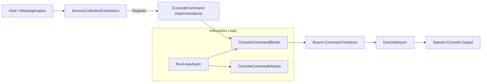
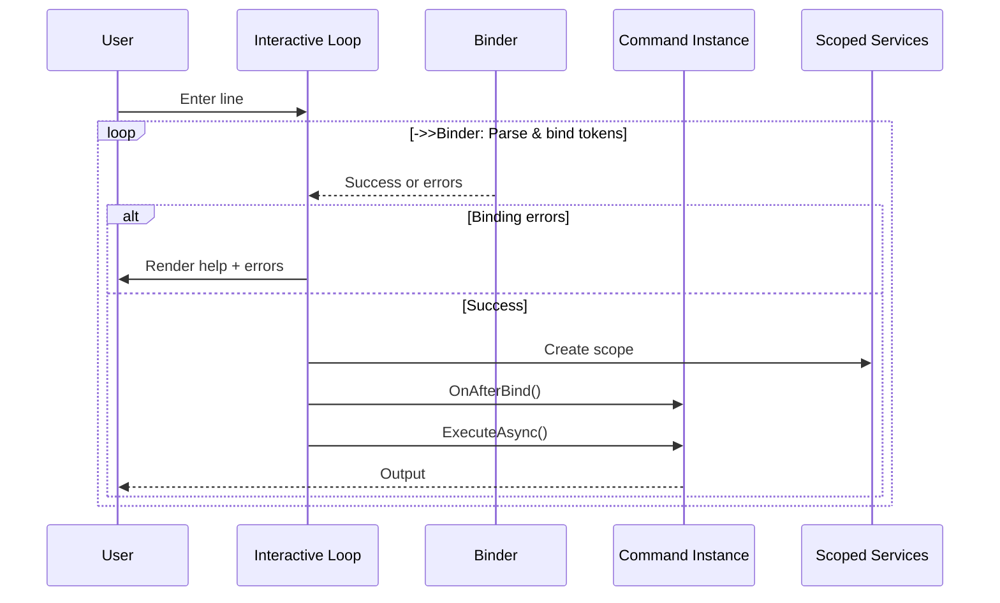

# Console Commands

> Expose operational and administrative actions through discoverable console commands and an interactive shell.

[TOC]

## Overview

The Console Commands feature provides an integrated, extensible command execution environment for applications built with the bITDevKit. It supports two complementary modes:

1. Non-interactive command execution ("single-shot") suitable for automation, scripting, diagnostics or administrative tasks at startup.
2. Interactive in-process console ("interactive shell") that runs alongside a locally hosted ASP.NET Core application using Kestrel.

Commands are lightweight classes derived from `ConsoleCommandBase` and registered through dependency injection. They expose arguments and options through attributes, support grouped subcommand hierarchies, use Spectre.Console for terminal output and share binding and help behavior through `ConsoleCommandExecutor` and `ConsoleCommandBinder`.

## Challenges

Modern local development and operational workflows often face:

- Manual repetition of diagnostic and maintenance tasks (threads, memory, GC, environment info).
- Lack of a consistent, discoverable interface for custom runtime operations.
- Ad hoc scripts that duplicate logic scattered across multiple project areas.
- Difficulties in adding structured, option-rich commands without verbose parsing code.
- Need for both interactive exploration and automation-friendly single-run invocation.

## Solution

The feature addresses these challenges by supplying:

- A unified command abstraction (`IConsoleCommand`) with a lean base class (`ConsoleCommandBase`).
- Attribute-driven option and argument binding (`ConsoleCommandOptionAttribute`, `ConsoleCommandArgumentAttribute`).
- Grouped subcommands (`IGroupedConsoleCommand`) enabling hierarchical organization (e.g. `history list`, `diag perf`).
- Automatic help generation and validation errors through a central binder.
- Interactive loop with history persistence and restart support for local development.
- Native console themes aligned with dashboard theme names for prompt and console log output.
- Consistent diagnostics commands (status, metrics, memory, threads, GC, env, diag group).
- Extensible registration via fluent builders (`AddConsoleCommands`, `AddConsoleCommandsInteractive`).
- Spectre.Console-based formatting (tables, markup, rules) for clear developer feedback.

### Use case catalog

| Scenario | Description | Example |
| ---------- | ------------- | --------- |
| Local runtime diagnostics | Inspect memory, GC, thread pool, performance and environment info while developing | `diag perf` `gc --no-collect` `threads` |
| Operational introspection | Quick status snapshot / health indicator without external tools | `status` `metrics` |
| Automated task invocation | Trigger maintenance, job scheduling or batch operations via CLI | `jobs trigger --name=reindex` |
| Environment launch helpers | Open bound Kestrel addresses with optional filtering | `browse open --all` |
| Documentation lookup | Open the official bITdevKit documentation from any Console Commands host | `docs` `docs --url` |
| Console theme selection | Change the native console prompt and console log colors | `console theme` `console theme matrix` |
| GC experimentation | Force collections in development to validate memory patterns | `diag gc --force` |
| Extension via custom commands | Project-specific automation (seed data, cache warmup, export) | `seed data --count=50` |

## Key Features

- Shared command contracts for single-shot and interactive execution.
- Attribute-based binding for positional arguments, named options, aliases, required values and defaults.
- Grouped command hierarchies such as `history list` and `diag perf`.
- Consistent help, validation and result handling through `ConsoleCommandExecutor` and `ConsoleCommandBinder`.
- Persistent history, console themes and development-only restart support for interactive hosts.
- Spectre.Console output for tables, markup and other terminal components.

## Architecture



### Core components

| Component | Responsibility |
| ----------- | ---------------- |
| `ConsoleCommandBase` | Base class offering name, alias, description and execution contract. |
| `IConsoleCommand` | Marker + contract for binding and execution. |
| `IGroupedConsoleCommand` | Adds `GroupName` + `GroupAliases` to nest subcommands. |
| `ConsoleCommandBinder` | Reflection-based binder parsing options/arguments, building help and caching metadata. |
| `ServiceCollectionExtensions` | Registers interactive or non-interactive command sets. |
| `ApplicationBuilderExtensions.UseConsoleCommandsInteractive` | Activates the input loop for local Kestrel hosting. |
| `ConsoleCommandHistory` | Persists and serves command history between sessions. |
| `ConsoleTheme` | Persists and serves the native console theme used by prompts and console log output. |
| Diagnostic helpers (diag group) | Aggregated runtime tables (`DiagnosticTablesBuilder`). |

## Use Cases

Use Console Commands to expose local diagnostics, maintenance operations and application-specific developer tools through one command model. Single-shot hosts suit scripts and CI tasks. The interactive loop suits local ASP.NET Core development. The [use case catalog](#use-case-catalog) lists representative commands.

## Basic Usage

Register a command, build the host and pass the process arguments to `ConsoleCommandExecutor`. Check the returned result so the process reports failure to its caller.

```csharp
using BridgingIT.DevKit.Presentation;
using Microsoft.Extensions.DependencyInjection;
using Spectre.Console;

var builder = DevKitApplication.CreateBuilder(args, builder => builder
    .AddConsoleCommands(commands => commands
        .WithCommand<EchoConsoleCommand>()));

using var host = builder.Build();
var console = host.Services.GetRequiredService<IAnsiConsole>();
var executor = new ConsoleCommandExecutor();
var result = await executor.ExecuteAsync(
    args,
    console,
    host.Services,
    ConsoleCommandExecutionSource.Terminal);

return result.Succeeded ? 0 : 1;
```

With the example command defined below, this invocation writes two numbered uppercase lines and exits with code `0`:

```bash
app echo "hello" --repeat=2 --upper
```

Unknown commands and binding errors write help or error details and return a failed result, allowing the process to exit with code `1`.

## Detailed setup

### Register non-interactive commands

Use when you need single-run invocation (e.g. hosted service executing a command supplied via args).

```csharp
var builder = DevKitApplication.CreateBuilder(args, builder => builder
    .AddConsoleCommands(cfg =>
    {
        cfg.WithCommand<SampleConsoleCommand>(); // register commands
    }));

using var host = builder.Build();
var console = host.Services.GetRequiredService<IAnsiConsole>();
var executor = new ConsoleCommandExecutor();
var result = await executor.ExecuteAsync(
    args,
    console,
    host.Services,
    ConsoleCommandExecutionSource.Terminal);

return result.Succeeded ? 0 : 1;
```

`DevKitApplication` keeps local CLI host advertisement disabled by default, so single-shot console command applications do not need to opt out of descriptor writing.

The raw generic host remains supported for applications that do not need the DevKit fluent builder:

```csharp
var builder = Host.CreateApplicationBuilder(args);

builder.Services.AddConsoleCommands(cfg =>
{
    cfg.WithCommand<SampleConsoleCommand>();
});
```

The shared docs command can be registered the same way when an application host, worker or custom tool should expose the official documentation shortcut:

```csharp
builder.Services.AddConsoleCommands(cfg =>
{
    cfg.WithCommand<DocsConsoleCommand>();
});
```

Use `docs` to open the official documentation in the default browser, or `docs --url` to write the URL without opening a browser. The packaged `bdk docs` command uses this same shared command with CLI-specific JSON and CI behavior layered around it.

### Register interactive commands

Enable the interactive loop for local development.

```csharp
builder.Services.AddConsoleCommandsInteractive(cfg =>
{
    cfg.WithCommand<SeedDataConsoleCommand>();
});

var app = builder.Build();
app.UseConsoleCommandsInteractive();
```

### Environment constraints

The interactive loop is automatically bypassed in non-development environments (local checks).

## Command definition

### Options and arguments

Annotate public properties:

- `ConsoleCommandOptionAttribute`: Named option (`--name value` or short alias `-n value`) plus optional default.
- `ConsoleCommandArgumentAttribute`: Positional argument by index.

Binding rules:

- Booleans are treated as flags (presence => true unless explicitly `false`).
- Missing required options/arguments produce binder errors and detailed help output.
- Unrecognized tokens yield validation feedback.

### Example: simple echo command

```csharp
public class EchoConsoleCommand : ConsoleCommandBase
{
    [ConsoleCommandArgument(0, Description = "Text to echo", Required = true)]
    public string Text { get; set; }

    [ConsoleCommandOption("repeat", Alias = "r", Description = "Repeat count", Default = 1)]
    public int Repeat { get; set; }

    [ConsoleCommandOption("upper", Alias = "u", Description = "Uppercase output")]
    public bool Upper { get; set; }

    public EchoConsoleCommand()
        : base("echo", "Echo text with optional repetition") { }

    public override Task ExecuteAsync(
        IAnsiConsole console,
        IServiceProvider services,
        CancellationToken cancellationToken = default)
    {
        var output = this.Upper ? this.Text.ToUpperInvariant() : this.Text;
        for (var i = 0; i < this.Repeat; i++)
        {
            console.MarkupLine($"[green]{Markup.Escape(output)}[/]");
        }

        return Task.CompletedTask;
    }
}
```

Usage:

```bash
echo "hello world" --repeat=3 --upper
```

### Example: grouped command

Grouped commands share a `GroupName` token followed by subcommand names.

```bash
history list --max=25
history clear --keep-last=5
history search restart
```

Each subcommand class implements `IGroupedConsoleCommand` and supplies its own `Name` / `Description` while inheriting group metadata.

### Lifecycle hook

`OnAfterBind(console, tokens)` allows post-binding adjustment / validation (e.g. deriving repeat count from another option).

## Interactive mode

### Launch

When registered and running locally, a banner appears and the loop waits for user input. History is appended after each line. Control signals:

- Empty line: ignored.
- `quit` / `exit` / `q`: graceful shutdown.
- `restart`: development-only restart (spawns new process, sets environment marker).

### Help system

- `help` lists all commands and grouped subcommands.
- `help history` shows group subcommands.
- `help history list` shows detailed option/argument help for a specific subcommand.

### History management

| Command | Purpose |
| --------- | --------- |
| `history list --max=50` | Show recent entries. |
| `history search cache` | Find entries containing a substring. |
| `history clear --keep-last=10` | Trim or fully clear persisted history file. |

### Restart flow

`restart` (development only) sets a transient environment variable to prevent nested restarts, spawns a new instance then stops current process.

## Diagnostics (`diag` group)

The `diag` group centralizes point-in-time runtime introspection.

| Subcommand | Description | Key Metrics |
| ------------ | ------------- | ------------- |
| `diag gc [--force]` | GC memory and collections; optional full collection in Development. | Heap size, fragmented bytes, generation counts. |
| `diag threads` | Thread pool configuration and usage. | Min/max/available/used, pending work items. |
| `diag mem` | Detailed process and managed memory summary. | Working set, private bytes, heap, fragment. |
| `diag perf` | Aggregate performance snapshot. | CPU %, avg latency, request/failure counts. |
| `diag env` | Runtime and environment information. | Framework, OS, architecture, GC mode, build configuration. |

All output is tabular via Spectre.Console for readability and consistent formatting.

## Non-interactive invocation

You can host commands in a console entry point to perform a single operation based on command-line args:

```csharp
var console = host.Services.GetRequiredService<IAnsiConsole>();
var executor = new ConsoleCommandExecutor();
var result = await executor.ExecuteAsync(
    args,
    console,
    host.Services,
    ConsoleCommandExecutionSource.Terminal,
    cancellationToken);

if (!result.Succeeded)
{
    return 1;
}

return 0;
```

The executor handles quoted input, grouped commands, scoped dependency resolution, binding, help output, history and execution failures. This approach enables automation (CI tasks, maintenance jobs) while reusing the same command implementations as interactive mode.

## Error handling and validation

- Binding errors enumerate missing or invalid tokens and automatically print detailed help.
- Execution exceptions are caught and rendered in red markup with the message only (stack framing left to external logging).
- History IO issues are surfaced as a single yellow warning line after `history list`.

## Extensibility

### Add custom commands

1. Create a class deriving `ConsoleCommandBase` (or implementing `IGroupedConsoleCommand` for groups).
2. Decorate properties with option / argument attributes.
3. Register via builder (`cfg.WithCommand<YourCommand>()`).
4. Implement `ExecuteAsync` producing Spectre.Console output (tables, markup, panels).

### Introduce new groups

Group multiple related sub-operations (e.g. `cache warm`, `cache stats`). Provide a consistent `GroupName` and optional aliases. Each subcommand remains small and focused.

### Share utilities

Refactor repeated metrics/data gathering into internal static helper classes (similar to `DiagnosticTablesBuilder`) to keep execution methods lean.

## Best practices

| Practice | Recommendation |
| ---------- | --------------- |
| Keep commands atomic | One responsibility per command/subcommand; compose externally rather than adding mode flags that diverge logic. |
| Validate early | Use `OnAfterBind` for inter-property checks and normalization. |
| Prefer descriptive names | Short primary name, optional aliases for ergonomics (e.g. `memory` + alias `mem`). |
| Restrict sensitive operations | Forceful GC, restarts, destructive clears limited to Development. |
| Use tables over plain text | Structured output improves readability and scripting parse potential. |
| Avoid blocking long tasks | For lengthy operations, print progress or consider asynchronous job dispatch. |
| Reuse DI services | Resolve repositories, evaluators, or runtime stats through scoped provider inside `ExecuteAsync`. |
| Document examples | Provide inline comments or README excerpts for complex commands. |
| Keep history manageable | Offer truncation defaults (`--max`) to avoid flooding output. |
| Fail fast | Stop on binding errors before executing heavy logic. |

## Troubleshooting

| Issue | Cause | Resolution |
| ------- | ------- | ----------- |
| "Unknown command" | Typo or not registered | Run `help` to verify registration; ensure command added via builder. |
| No interactive loop | Environment not local/development | Check `IsDevelopment()`, ensure Kestrel addresses feature available. |
| `--force` ignored | Non-development environment | Run in Development or remove sensitive flag. |
| Restart does nothing | Already restarting or not development | Clear marker env var; verify environment name. |
| History empty | First run or file inaccessible | Execute multiple commands; check temp path permissions. |
| GC metrics static | `--no-collect` or insufficient allocations | Use commands that allocate or force collection where permitted. |
| High failure counts | Underlying application endpoints return 5xx responses | Investigate application logs; metrics only report counts. |
| CPU percentage shows zero | Uptime is too short for a representative sample | Wait a few seconds and run `diag perf` again. |

## Advanced topics

### Integrating with external scripts

Non-interactive commands can be wrapped by shell scripts or scheduled tasks (e.g. Windows Task Scheduler) by passing the command tokens as part of process args. Consistent parsing semantics ensure parity with interactive usage.

### Custom output formats

While tables are recommended, commands may output JSON for machine consumption. Provide a `--json` option where appropriate and serialize with indentation for clarity.

### Security considerations

Do not expose interactive console capabilities in production internet-facing environments. Group names or command names should not leak sensitive operational intentions. Restrict potentially destructive commands via environment checks and role guards if extended.

### Future extensions (suggested roadmap)

- Latency distribution and percentiles in `diag perf`.
- Endpoint-specific HTTP statistics (per route breakdown).
- Snapshot comparison and export (`diag diff`, `diag export`).
- Tracing capture (`diag trace`).
- Pluggable authorization for privileged commands.

## Appendix A: command lifecycle (interactive)



## Appendix B: key interfaces and base class

| Type | Summary |
| ------ | --------- |
| `IConsoleCommand` | Name, aliases, description, matching, lifecycle hook, async execution. |
| `IGroupedConsoleCommand` | Extends a command with a group identity and aliases for hierarchical invocation. |
| `ConsoleCommandBase` | Implements common plumbing; derived classes only override `ExecuteAsync`. |
| `ConsoleCommandBinder` | Discovers annotated properties, parses tokens, assigns values, emits help. |

## Appendix C: example group design

```bash
Group: diag
Subcommands: gc, threads, mem, perf, env
Goal: Centralize diagnostics; each subcommand returns one cohesive table.
Additions (future): heap, latency, http, allocations, exceptions.
```

## Appendix D: non-interactive pattern

Minimal bootstrap for executing a single command outside interactive mode:

```csharp
var console = host.Services.GetRequiredService<IAnsiConsole>();
var executor = new ConsoleCommandExecutor();
var result = await executor.ExecuteAsync(
    args,
    console,
    host.Services,
    ConsoleCommandExecutionSource.Terminal,
    cancellationToken);

return result.Succeeded ? 0 : 1;
```

## Disclaimer

The Console Commands feature is designed primarily for development, diagnostics and controlled operational scenarios. It is **not** a replacement for full remote administration tooling, nor intended for production exposure without additional security measures.
