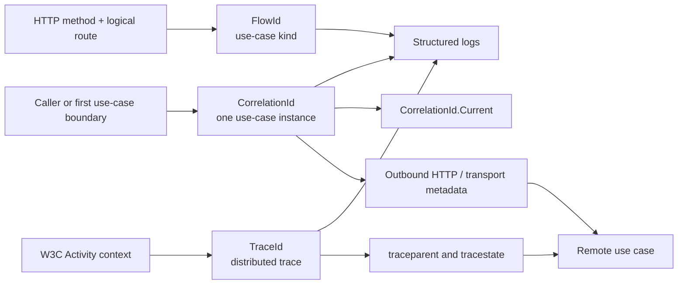
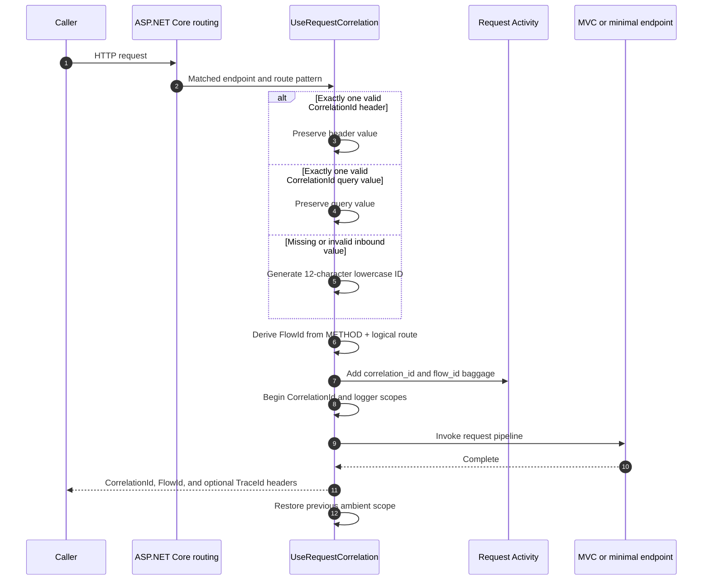
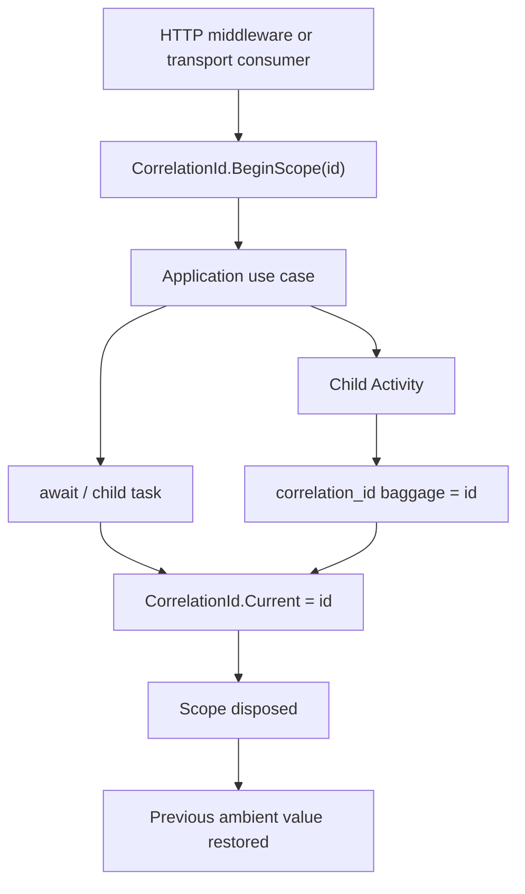
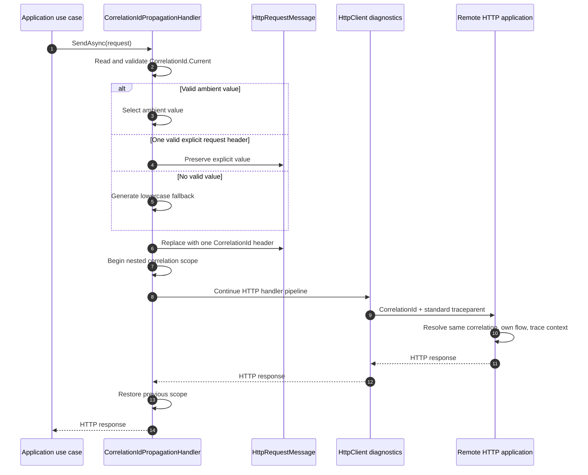

# Presentation Correlation ID

> Correlate one application use case across inbound HTTP requests, asynchronous execution, logs,
> activities, outbound HTTP calls, and supported transport boundaries.

[TOC]

## Overview

A correlation ID answers: **which application use case does this work belong to?**

The DevKit keeps that identity separate from endpoint identity and distributed tracing:

| Identifier | Meaning | Lifetime | Propagation |
| --- | --- | --- | --- |
| `CorrelationId` | One logical application use case across boundaries | Supplied by a caller or generated at the first boundary | Explicit `CorrelationId` header, transport metadata, envelopes, or `CorrelationId.BeginScope(...)` |
| `FlowId` | The kind of inbound HTTP use case | Deterministic for HTTP method plus logical route | Recalculated by each receiving HTTP application; not sent by the outbound handler |
| `TraceId` | One W3C distributed trace | Managed by `System.Diagnostics.Activity` | Standard tracing headers such as `traceparent`; not copied into `CorrelationId` |

These values can appear together in response headers and log scopes, but they are not aliases:

- Two calls to `GET /orders/{id}` have different correlation IDs.
- Those calls have the same flow ID because they execute the same HTTP use case.
- Their trace IDs depend on the distributed tracing context and remain separate from both.



## Challenges

One use case can cross HTTP calls, asynchronous work, transports, activities, and logs. A trace ID alone does not always represent that application-level lifetime. Route instances and route kinds also need distinct identities. Unvalidated caller values can create malformed headers or unsafe log data.

## Solution

DevKit treats `CorrelationId`, `FlowId`, and W3C `TraceId` as separate identifiers. Request middleware validates or creates the correlation ID, derives a route-based flow ID, and scopes both for downstream work. Explicit transport integrations carry correlation values across process or durable boundaries.

## Key Features

- fixed header, query, validation, and generation rules
- ambient `CorrelationId.Current` based on `AsyncLocal` and activity baggage
- stable request state across duplicate middleware and pipeline re-execution
- deterministic HTTP flow IDs based on method and logical route
- response headers and structured logger scopes
- per-client or host-wide `IHttpClientFactory` propagation
- documented propagation contracts for supported durable features

## Architecture

`CorrelationIdProviderMiddleware` runs after routing, creates one request state, and establishes correlation and logging scopes around the remaining pipeline. `CorrelationIdPropagationHandler` performs the corresponding outbound HTTP work. Messaging, queueing, jobs, and other durable features serialize correlation metadata through their own contracts.

## Use Cases

- group logs for one user-visible operation across services
- distinguish one route kind from individual route invocations
- preserve an inbound correlation ID in downstream HTTP calls
- establish a correlation scope around consumed or scheduled work
- inspect correlation, flow, and trace identifiers in diagnostics

## Basic Usage

This example places correlation middleware after routing and returns the three identifiers visible to an endpoint.

```csharp
using System.Diagnostics;
using BridgingIT.DevKit.Common;
using BridgingIT.DevKit.Presentation.Web;

var builder = WebApplication.CreateBuilder(args);
var app = builder.Build();

app.UseRouting();
app.UseRequestCorrelation();

app.MapGet("/diagnostics/correlation", (HttpContext context) => Results.Ok(new
{
    CorrelationId = context.TryGetCorrelationId(),
    FlowId = context.Items["FlowId"]?.ToString(),
    TraceId = Activity.Current?.TraceId.ToString()
}));

app.Run();
```

Calling `GET /diagnostics/correlation` with `CorrelationId: order-123` returns `order-123` in the JSON body and the `CorrelationId` response header. Calls without a valid value receive a generated 12-character lowercase identifier.

## Packages and components

| Package | Component | Responsibility |
| --- | --- | --- |
| `BridgingIT.DevKit.Common.Abstractions` | `CorrelationId` | Header/baggage names, validation, ambient access, and explicit scopes |
| `BridgingIT.DevKit.Presentation.Web` | `CorrelationIdProviderMiddleware` and `UseRequestCorrelation()` | Resolve inbound IDs, derive the flow ID, enrich the request activity and logger, and expose response headers |
| `BridgingIT.DevKit.Common.Utilities` | `CorrelationIdPropagationHandler` | Add the current correlation ID to factory-created outbound HTTP requests |
| `BridgingIT.DevKit.Common.Utilities` | `AddCorrelationIdPropagation()` | Enable outbound propagation globally or on one named/typed client |
| `BridgingIT.DevKit.Common.Extensions.Web` | `HttpContext.TryGetCorrelationId()` | Read the resolved request value from `HttpContext.Items` |

Application and domain code should normally use `CorrelationId.Current`. Direct `HttpContext` access is
appropriate only in presentation-bound code.

## Inbound HTTP lifecycle

Register request correlation after routing and before logging, metrics, modules, authentication handlers,
or endpoints that need the identifiers:

```csharp
app.UseRouting();
app.UseRequestCorrelation();
app.UseRequestModuleContext();
app.UseRequestLogging();

app.UseAuthentication();
app.UseAuthorization();

app.MapEndpoints();
```

Routing must run first because the flow ID uses the matched minimal API or MVC route pattern.



### Resolution and validation

The fixed resolution order is:

1. One valid `CorrelationId` request header.
2. One valid `CorrelationId` query-string value.
3. A newly generated 12-character lowercase alphanumeric value.

A valid correlation ID:

- contains 1–128 characters;
- contains only ASCII letters, digits, `-`, `_`, `.`, or `:`;
- occurs exactly once in the selected header or query-string source.

Invalid or multiple values do not produce an HTTP error. They are ignored and resolution continues to
the next source. For example, an invalid header can fall back to a valid query value. If no source is
valid, the middleware generates a replacement.

Inbound values preserve their casing. Generated request correlation IDs are lowercase.

Query-string correlation IDs are supported for developer tooling and constrained integrations. Prefer
the header for normal service calls because URLs commonly appear in browser history, access logs,
proxies, and monitoring systems.

Correlation IDs are diagnostic identifiers, not credentials. Do not put secrets, access tokens, or
personal information in them, and never use possession of a correlation ID for authorization.

### Request state and re-execution

The middleware stores one private request state object in `HttpContext.Items`. It then exposes:

- `HttpContext.Items["CorrelationId"]`;
- `HttpContext.Items["FlowId"]`;
- `CorrelationId.Current`;
- request `Activity` baggage named `correlation_id` and `flow_id`;
- logger scope properties `CorrelationId`, `FlowId`, and `TraceId`;
- response headers `CorrelationId`, `FlowId`, and, when an activity exists, `TraceId`.

The private request state is reused when:

- `UseRequestCorrelation()` is accidentally registered more than once;
- exception handling re-executes the ASP.NET Core pipeline for the same `HttpContext`.

The original correlation and flow IDs therefore remain stable for the entire HTTP request.

## Ambient correlation scope

`CorrelationId.Current` resolves the explicitly scoped value first and then the current activity's
`correlation_id` baggage value:

```csharp
var correlationId = CorrelationId.Current;
```

Use `BeginScope(...)` at a non-HTTP use-case boundary or when consuming explicitly transported work:

```csharp
using (CorrelationId.BeginScope(workItem.CorrelationId))
{
    await ProcessAsync(workItem, cancellationToken);
}
```

Disposing the scope restores the previous value. Normal `async`/`await` execution and child tasks that
flow `ExecutionContext` inherit the `AsyncLocal` scope. Child activities also inherit parent activity
baggage.



Do not assume ambient state crosses:

- another process;
- durable storage;
- a broker that does not copy correlation metadata;
- work started with suppressed `ExecutionContext`;
- manually detached work whose lifetime exceeds the originating scope.

At those boundaries, capture the value explicitly, serialize it as transport metadata, and establish a
new scope or activity baggage value when the work is consumed.

## Flow ID lifecycle

The flow ID identifies an HTTP use-case kind rather than one invocation.

The middleware hashes:

```text
UPPERCASE_HTTP_METHOD + " " + LOGICAL_ROUTE
```

Examples:

| Endpoint | Flow identity input |
| --- | --- |
| Minimal API `MapGet("/orders/{id}", ...)` | `GET /orders/{id}` |
| Minimal API `MapPost("/orders/{id}", ...)` | `POST /orders/{id}` |
| Attribute-routed MVC action | HTTP method plus attribute route template |
| Conventional MVC action | HTTP method plus conventional route, controller, and action |

Route values such as order IDs are deliberately excluded, so `/orders/1` and `/orders/2` share a flow
ID. Changing `GET` to `POST`, selecting another route, or selecting another conventional controller
action produces a different flow ID.

If no endpoint route is available, the middleware falls back to the request path. Registering after
routing avoids that less-stable fallback.

Flow IDs are local classifications. The outbound HTTP propagation handler does not copy them. A remote
service derives its own flow ID from the remote method and route while preserving the correlation ID.

## Trace ID lifecycle

ASP.NET Core creates the inbound request `Activity`. The middleware reads its W3C `TraceId` and exposes
that value in the logger scope and `TraceId` response header.

The trace ID remains separate from the application correlation ID:

- Do not assign `Activity.TraceId` to `CorrelationId`.
- Do not manually place `TraceId` in the `CorrelationId` header.
- Let `HttpClient` diagnostics and OpenTelemetry propagate W3C `traceparent` and `tracestate`.
- Use the correlation ID to group one logical use case even when tracing is disabled, sampled, or split
  across transport-specific activities.

## Outbound HTTP lifecycle

Enable propagation on the client that owns the external boundary:

```csharp
services.AddHttpClient<IOpenMeteoClient, OpenMeteoClient>(client =>
{
    client.Timeout = TimeSpan.FromSeconds(10);
}).AddCorrelationIdPropagation();
```

This explicit form is recommended when only selected external integrations should receive the
application correlation ID.

Enable propagation for every client created by `IHttpClientFactory` when that is the host-wide policy:

```csharp
services.AddCorrelationIdPropagation();

services.AddHttpClient<IOpenMeteoClient, OpenMeteoClient>();
services.AddHttpClient("payments");
```

Both registration forms are safe to call repeatedly. They work with named, typed, and generated clients
that use `IHttpClientFactory`. They cannot intercept a manually constructed `new HttpClient()`.

For every outbound request, `CorrelationIdPropagationHandler`:

1. Uses a valid `CorrelationId.Current`.
2. Otherwise preserves one valid `CorrelationId` header already on the request.
3. Otherwise generates a new 12-character lowercase identifier.
4. Removes any previous values and writes exactly one valid header.
5. Establishes that value as `CorrelationId.Current` while later message handlers and the primary HTTP
   handler execute.
6. Restores the previous ambient value after the HTTP pipeline completes.



The generated fallback guarantees a header even when the call did not start inside a correlated use
case. That fallback is scoped only to the outbound handler pipeline. If logs and other work before or
after the HTTP call must share it, establish the correlation ID at the enclosing use-case boundary
instead.

## Supported cross-boundary propagation

Ambient state is process-local, so cross-process and durable features must carry the value explicitly.

Broadcasting owns its envelope, HTTP transport, receiver, and handler-scope propagation. See
[Common Utilities: Broadcasting](./common-utilities.md#broadcasting) for that complete lifecycle and
sequence diagram.

### Messaging, queueing, outbox, jobs, and orchestrations

The corresponding feature owns each durable correlation contract:

- Standard messaging and queueing behaviors/providers copy correlation activity baggage into message
  properties or broker metadata and restore it into consumer activities.
- The Entity Framework domain-event outbox stores correlation and flow properties and restores them
  when processing the event.
- Jobs expose explicit correlation fields in dispatch options, execution context, history, activities,
  and logs.
- Orchestration activity builders can map correlation IDs into requests, notifications, messages, and
  queue items.

Use the feature-specific registration and mapping APIs documented on their pages. Do not rely on
`AsyncLocal` alone for delayed, persisted, retried, or remote work.

## Reading and logging the IDs

Application code:

```csharp
var correlationId = CorrelationId.Current;
```

Presentation-only code:

```csharp
var correlationId = httpContext.TryGetCorrelationId();
var flowId = httpContext.Items["FlowId"]?.ToString();
var traceId = Activity.Current?.TraceId.ToString();
```

The request middleware automatically places all three values in the logger scope. Prefer structured
logging and let the scope enrich each log entry:

```csharp
logger.LogInformation("Loading weather forecast for {City}", city);
```

Avoid repeating IDs in every message template unless the log event is crossing a boundary where the
normal scope is unavailable.

## Operational guidance

- Treat correlation IDs as untrusted diagnostic input.
- Keep the 128-character and character-set validation fixed at every HTTP boundary.
- Prefer headers over query strings.
- Never use a correlation ID as proof of identity, authorization, tenancy, or idempotency.
- Do not place secrets or personal information in an ID.
- Preserve a transported ID instead of generating a new one at every internal method.
- Generate or establish a new ID when starting an independent use case.
- Propagate only `CorrelationId` through the custom HTTP handler; leave W3C trace headers to tracing
  instrumentation.
- Register `UseRequestCorrelation()` before middleware and endpoints that need ambient IDs.
- Prefer per-client outbound registration when external services should be selected intentionally.
- Use the global outbound registration only when propagation to every factory-created client is the
  application policy.

## Testing

For inbound tests, assert that:

- valid header and query values are preserved according to precedence;
- invalid, oversized, or repeated values result in a generated ID without an error response;
- minimal API and MVC route values do not change a flow ID;
- method or logical route changes do change a flow ID;
- exception re-execution and duplicate middleware registration retain the original values.

For application and handler tests, establish an explicit scope:

```csharp
using var scope = CorrelationId.BeginScope("test-correlation");

await service.ExecuteAsync(cancellationToken);
```

For outbound HTTP tests, use a recording primary `HttpMessageHandler` and assert that exactly one
`CorrelationId` header reaches it.

## Related documentation

- [Presentation Host](./features-presentation.md)
- [Presentation Endpoints](./features-presentation-endpoints.md)
- [Common Utilities](./common-utilities.md)
- [Common Observability Tracing](./common-observability-tracing.md)
- [Broadcasting](./common-utilities.md#broadcasting)
- [Messaging](./features-messaging.md)
- [Queueing](./features-queueing.md)
- [Jobs](./features-jobs.md)
- [Orchestrations](./features-orchestrations.md)
