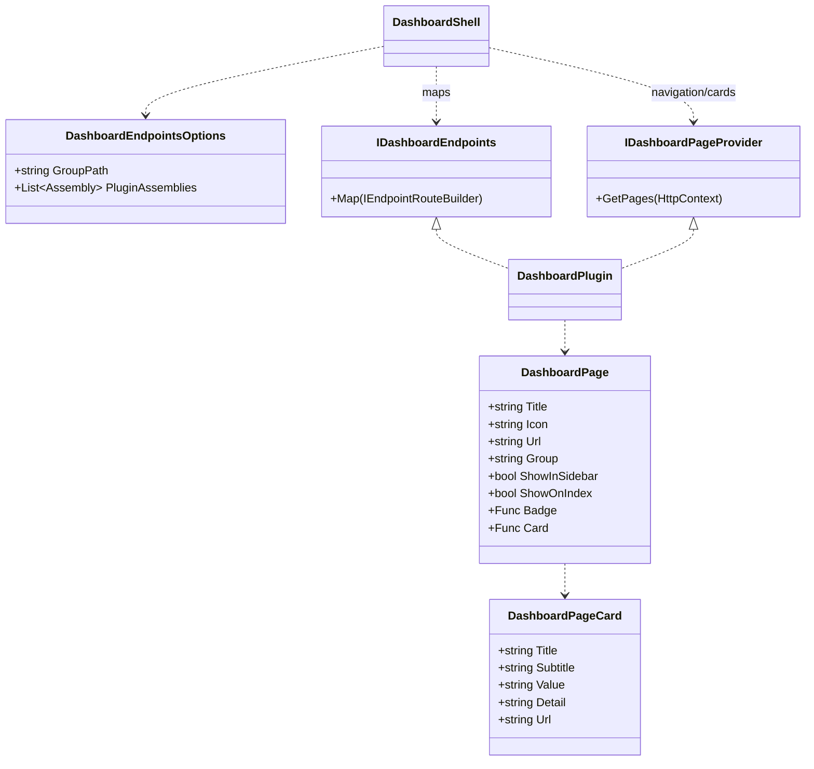
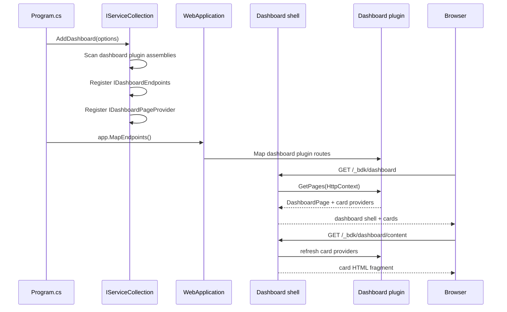

# Presentation Dashboard Feature Documentation

> Host developer dashboard pages as a modular shell with pluggable RazorSlice pages, grouped navigation, and live-updating dashboard cards.

[TOC]

## Overview

The Dashboard feature provides a server-rendered developer dashboard under a configurable route, by default `/_bdk/dashboard`. The shell owns the layout, sidebar, grouping, card index, and common styling. Feature packages and application projects contribute their own pages through small plugin contracts.

Dashboard pages are Minimal API endpoints that render [RazorSlices](https://github.com/DamianEdwards/RazorSlices). Pages can also publish navigation metadata and an optional compact card for the dashboard index page. Cards are refreshed in-place by a dashboard HTML fragment endpoint, so the index can show current plugin state without reloading the full shell.

### Challenges

- Extensibility: Let bITdevKit packages and application projects add dashboard pages without editing the dashboard shell.
- Navigation: Keep the sidebar aware of plugged-in pages and group pages by feature area.
- Server rendering: Render pages directly from in-process services instead of routing through HTTP JSON APIs.
- Live overview: Let plugin cards update on the dashboard index without a full page reload.
- External assemblies: Support dashboard plugins that live outside `Presentation.Web`.

### Solution

- Shell: `AddDashboard(...)` registers the dashboard shell and discovers dashboard plugins.
- Endpoints: `IDashboardEndpoints` marks endpoint classes that map dashboard routes.
- Pages: RazorSlice pages render dashboard content using normal Razor syntax and optional layout models.
- Navigation and cards: `IDashboardPageProvider` contributes sidebar items and optional dashboard index cards.
- Helpers: `MapDashboardPage(...)`, `DashboardPath.Combine(...)`, and `Results.Extensions.DashboardRazorSlice(...)` simplify plugin page mapping.

## Core Contracts

- `DashboardEndpointsOptions` ([src/Presentation.Web/Dashboard/DashboardEndpointsOptions.cs](src/Presentation.Web/Dashboard/DashboardEndpointsOptions.cs))
  - `Enabled`: Enables or disables the dashboard.
  - `GroupPath`: Base dashboard path. Defaults to `/_bdk/dashboard`.
  - `GroupTag`: Endpoint group tag.
  - `PluginAssemblies`: Additional assemblies to scan for dashboard plugins.
- `IDashboardEndpoints` ([src/Presentation.Web/Dashboard/IDashboardEndpoints.cs](src/Presentation.Web/Dashboard/IDashboardEndpoints.cs))
  - Marker contract for dashboard-specific endpoint sets.
  - Extends the regular presentation `IEndpoints` contract.
- `IDashboardPageProvider` ([src/Presentation.Web/Dashboard/IDashboardPageProvider.cs](src/Presentation.Web/Dashboard/IDashboardPageProvider.cs))
  - Provides `DashboardPage` descriptors for sidebar navigation and optional index cards.
- `DashboardPage` ([src/Presentation.Web/Dashboard/DashboardPage.cs](src/Presentation.Web/Dashboard/DashboardPage.cs))
  - Defines title, icon, URL, group, ordering, sidebar visibility, optional badge, and optional card provider.
- `DashboardPageCard` ([src/Presentation.Web/Dashboard/DashboardPage.cs](src/Presentation.Web/Dashboard/DashboardPage.cs))
  - Defines compact card content for the dashboard index.
- Route helpers ([src/Presentation.Web/Dashboard/DashboardRouteBuilderExtensions.cs](src/Presentation.Web/Dashboard/DashboardRouteBuilderExtensions.cs))
  - `MapDashboardPage<TPage>(...)`: Maps a typed RazorSlice page.
  - `MapDashboardPage(..., razorIdentifier, assembly, ...)`: Maps a compiled RazorSlice by identifier from a plugin assembly.
- Path helper ([src/Presentation.Web/Dashboard/DashboardPath.cs](src/Presentation.Web/Dashboard/DashboardPath.cs))
  - `DashboardPath.Combine(...)`: Combines route segments with one slash.

## Architecture

### Class Diagram



### Sequence (Registration → Render)



## Getting Started

### Register the Dashboard

Register the dashboard during service configuration.

```csharp
builder.Services.AddDashboard(options =>
{
    options.WithGroupPath("/_bdk/dashboard");
});
```

Map registered endpoints once during application startup.

```csharp
var app = builder.Build();

app.MapEndpoints();
```

The dashboard uses the existing endpoint registration pipeline. `AddDashboard(...)` registers dashboard endpoint classes with `AddEndpoints(...)`; `app.MapEndpoints()` maps them.

### Include Plugin Assemblies

The dashboard scans the core dashboard assembly, explicitly configured plugin assemblies, and currently loaded assemblies containing dashboard contracts. For application plugins, prefer explicit registration so discovery does not depend on load order.

```csharp
builder.Services.AddDashboard(options =>
{
    options.WithPluginAssemblyContaining<CatalogDashboardEndpoints>();
});
```

For multiple assemblies:

```csharp
builder.Services.AddDashboard(options =>
{
    options.WithPluginAssemblies(
        typeof(CatalogDashboardEndpoints).Assembly,
        typeof(ReportingDashboardEndpoints).Assembly);
});
```

### Built-In Routes

The dashboard shell uses fixed built-in routes below the configured `GroupPath`. Plugin pages own and map their own route segments; the shell does not maintain a central list of plugin paths.

| Path | Default |
| --- | --- |
| Dashboard index | `/_bdk/dashboard` |
| Dashboard index content fragment | `/_bdk/dashboard/content` |
| Health page | `/_bdk/dashboard/health` |
| Health content fragment | `/_bdk/dashboard/health/content` |
| Metrics page | `/_bdk/dashboard/metrics` |
| Metrics content fragment | `/_bdk/dashboard/metrics/content` |
| Identity page | `/_bdk/dashboard/identity` |
| Identity client credentials login | `/_bdk/dashboard/identity/client-credentials/login` |

## Built-In Pages

### Dashboard Index

The dashboard index shows cards contributed by dashboard page providers. It includes a refresh interval dropdown with fixed intervals:

- `Off`
- `1 sec`
- `5 sec`
- `15 sec`
- `30 sec`

The selected interval is stored in `localStorage`. Refresh uses a recursive `setTimeout` loop and an `AbortController`, so refreshes do not overlap and an in-flight request is cancelled when the interval changes. The page pauses automatic refresh while the browser tab is hidden and refreshes once when the tab becomes visible again.

The index refresh endpoint returns only card HTML. It does not render the full dashboard layout.

### Metrics

The metrics page is server-rendered and reads in-process snapshot services directly. It does not call the metrics JSON endpoints. The page has its own content fragment endpoint and refresh controls for updating only the metrics body.

Metrics remain optional. Registering the dashboard does not automatically register metrics; applications opt into metrics separately.

### Health

The health page is server-rendered and invokes the registered ASP.NET Core health checks through `HealthCheckService` from `Microsoft.Extensions.Diagnostics.HealthChecks`. It does not call a `/healthz` endpoint.

The page shows the overall status, number of registered checks, unhealthy count, total duration, and a compact table of health check entries. It has its own content fragment endpoint and refresh controls for updating only the health body.

Register health checks in the host application with the standard ASP.NET Core API:

```csharp
builder.Services.AddHealthChecks()
    .AddCheck("self", () => HealthCheckResult.Healthy());
```

If `AddHealthChecks()` is not registered, the page and card show an unavailable state instead of failing the dashboard.

### Identity

The identity page displays current user information using the current user accessor and request principal. When the fake identity provider is registered, the page can show a client credentials login action. If the fake provider is not available, fake-provider-specific UI is hidden.

## Adding a Project specific Dashboard Page

A project dashboard page normally has three parts:

1. A RazorSlice page under the project or module.
2. An `IDashboardEndpoints` implementation that maps the route.
3. An `IDashboardPageProvider` implementation that contributes sidebar/card metadata.

The examples below are self-contained and use a fictitious catalog module.

### Folder Layout

```text
# Presentation.Web

Modules/
  Catalog/
    Dashboard/
      CatalogDashboardEndpoints.cs
      CatalogDashboardPageProvider.cs
      Pages/
        Index.cshtml
        _ViewImports.cshtml
```

### RazorSlice Imports

For project-local dashboard pages, add a `_ViewImports.cshtml` beside the page.

```razor
@using BridgingIT.DevKit.Presentation.Web.Dashboard
@using BridgingIT.DevKit.Presentation.Web.Dashboard.Pages
@using Microsoft.Extensions.DependencyInjection
@using RazorSlices
```

### RazorSlice Page

Use normal Razor syntax and the dashboard layout. The page can resolve services directly because it is server-rendered.

```razor
@using MyApp.Modules.Catalog.Application
@inherits RazorSlice
@implements IUsesLayout<BridgingIT.DevKit.Presentation.Web.Dashboard.Pages._DashboardLayout, DashboardLayoutModel>

@{
    var requester = this.HttpContext.RequestServices.GetRequiredService<IRequester>();
    var productsResult = await requester.SendAsync(new ProductSummaryQuery(), cancellationToken: this.HttpContext.RequestAborted);
    var products = productsResult.IsSuccess ? productsResult.Value : new ProductSummaryModel();
}

<div class="d-flex justify-content-between align-items-center py-2 mb-2 border-bottom">
    <div>
        <h4 class="m-0">Catalog</h4>
        <div class="text-muted small">Product inventory overview</div>
    </div>
    <span class="text-muted small">Updated @DateTimeOffset.UtcNow.LocalDateTime.ToString("T", CultureInfo.InvariantCulture)</span>
</div>

@if (productsResult.IsFailure)
{
    <div class="alert alert-danger py-2">
        @foreach (var error in productsResult.Errors)
        {
            <div>@error.Message</div>
        }
    </div>
}

<div class="row g-2 mb-2">
    <div class="col-6 col-lg-3">
        <div class="card h-100">
            <div class="card-body p-3">
                <div class="text-muted small">Products</div>
                <div class="fs-4 fw-semibold">@products.ProductCount</div>
            </div>
        </div>
    </div>
    <div class="col-6 col-lg-3">
        <div class="card h-100">
            <div class="card-body p-3">
                <div class="text-muted small">Out of stock</div>
                <div class="fs-4 fw-semibold">@products.OutOfStockCount</div>
            </div>
        </div>
    </div>
</div>

@functions {
    public DashboardLayoutModel LayoutModel => new() { Title = "Catalog" };
}
```

## Mapping Plugin Endpoints

Use `IDashboardEndpoints` for dashboard routes. Dashboard plugin endpoints should map into the configured dashboard group so paths remain consistent when the host changes `GroupPath`.

### Typed RazorSlice Mapping

When the generated RazorSlice type is available to the endpoint class, use the typed helper.

```csharp
namespace MyApp.Modules.Catalog.Dashboard;

using BridgingIT.DevKit.Presentation.Web.Dashboard;
using Microsoft.AspNetCore.Routing;

public sealed class CatalogDashboardEndpoints(DashboardEndpointsOptions options)
    : EndpointsBase, IDashboardEndpoints
{
    public override void Map(IEndpointRouteBuilder app)
    {
        if (!options.Enabled)
        {
            return;
        }

        var group = this.MapGroup(app, options)
            .WithTags("_bdk.Dashboard.Catalog");

        group.MapDashboardPage<Pages.Index>(
            "/catalog",
            "_bdk.Dashboard.Catalog",
            "Dashboard Catalog",
            "Shows catalog dashboard information.");
    }
}
```

### Path-Based RazorSlice Mapping

For project pages where the generated RazorSlice type is awkward to reference, use the path-based helper. The `razorIdentifier` is the compiled RazorSlice identifier, usually the project-relative path with a leading slash.

```csharp
namespace MyApp.Modules.Catalog.Dashboard;

using BridgingIT.DevKit.Presentation.Web.Dashboard;
using Microsoft.AspNetCore.Routing;

public sealed class CatalogDashboardEndpoints(DashboardEndpointsOptions options)
    : EndpointsBase, IDashboardEndpoints
{
    private const string CatalogPath = "/catalog";

    public override void Map(IEndpointRouteBuilder app)
    {
        if (!options.Enabled)
        {
            return;
        }

        var group = this.MapGroup(app, options)
            .WithTags("_bdk.Dashboard.Catalog");

        group.MapDashboardPage(
            CatalogPath,
            "/Modules/Catalog/Dashboard/Pages/Index.cshtml",
            typeof(CatalogDashboardEndpoints).Assembly,
            "_bdk.Dashboard.Catalog",
            "Dashboard Catalog",
            "Shows catalog dashboard information.");
    }

    internal static string BuildCatalogPath(DashboardEndpointsOptions options)
    {
        return DashboardPath.Combine(options?.GroupPath, CatalogPath);
    }
}
```

## Adding Sidebar Navigation and Cards

Implement `IDashboardPageProvider` to tell the dashboard shell about pages. A provider can return one or many pages.

```csharp
namespace MyApp.Modules.Catalog.Dashboard;

using BridgingIT.DevKit.Presentation.Web.Dashboard;
using Microsoft.AspNetCore.Http;

public sealed class CatalogDashboardPageProvider(DashboardEndpointsOptions options)
    : IDashboardPageProvider
{
    public IEnumerable<DashboardPage> GetPages(HttpContext httpContext)
    {
        yield return new DashboardPage(
            "Catalog",
            "boxes",
            CatalogDashboardEndpoints.BuildCatalogPath(options))
        {
            Group = "Application",
            GroupOrder = 100,
            Order = 10,
            Badge = GetBadgeAsync,
            Card = GetCardAsync
        };
    }

    private static async ValueTask<int?> GetBadgeAsync(HttpContext httpContext)
    {
        var requester = httpContext.RequestServices.GetService<IRequester>();
        if (requester is null)
        {
            return null;
        }

        var result = await requester.SendAsync(
            new ProductSummaryQuery(),
            cancellationToken: httpContext.RequestAborted);

        return result.IsSuccess ? result.Value.OutOfStockCount : null;
    }

    private async ValueTask<DashboardPageCard> GetCardAsync(HttpContext httpContext)
    {
        var requester = httpContext.RequestServices.GetService<IRequester>();
        if (requester is null)
        {
            return new DashboardPageCard("Catalog", "Products", "Unavailable")
            {
                Detail = "Requester is not registered",
                Icon = "boxes",
                Url = CatalogDashboardEndpoints.BuildCatalogPath(options),
                Group = "Application",
                GroupOrder = 100,
                Order = 10
            };
        }

        var result = await requester.SendAsync(
            new ProductSummaryQuery(),
            cancellationToken: httpContext.RequestAborted);

        if (result.IsFailure)
        {
            return new DashboardPageCard("Catalog", "Products", "Error")
            {
                Detail = result.Errors.FirstOrDefault()?.Message,
                Icon = "boxes",
                Url = CatalogDashboardEndpoints.BuildCatalogPath(options),
                Group = "Application",
                GroupOrder = 100,
                Order = 10
            };
        }

        return new DashboardPageCard(
            "Catalog",
            "Products",
            result.Value.ProductCount.ToString(CultureInfo.InvariantCulture))
        {
            Detail = $"{result.Value.OutOfStockCount} out of stock",
            Icon = "boxes",
            Url = CatalogDashboardEndpoints.BuildCatalogPath(options),
            Group = "Application",
            GroupOrder = 100,
            Order = 10
        };
    }
}
```

### Page Descriptor Guidance

- `Title`: Display name in sidebar and default card title.
- `Icon`: Bootstrap icon name without the `bi-` prefix.
- `Url`: Absolute dashboard URL. Use `DashboardPath.Combine(...)`.
- `Group`: Sidebar/card group heading.
- `GroupOrder`: Sort order for groups.
- `Order`: Sort order inside the group.
- `ShowInSidebar`: Set to `false` for utility or fragment pages.
- `ShowOnIndex`: Set to `false` for pages that should not create dashboard cards.
- `Badge`: Optional async count shown in the sidebar.
- `Card`: Optional async card provider for the dashboard index.

Providers are called at render time. Keep badge and card work lightweight, use in-process services, and handle missing optional services gracefully.

## Dashboard Index Cards

Cards are rendered on the dashboard index and refreshed through the index content fragment endpoint. A card provider can return live values such as counts, health summaries, queue depth, or last activity.

If a page has `ShowOnIndex = true` but no `Card` delegate, the shell can still produce a default card from page metadata. Define `Card` when the plugin has useful summary data.

The dashboard catches page provider/card failures and keeps rendering the rest of the dashboard. Failed card providers are logged and replaced with an unavailable card state.

## Sidebar Grouping

The sidebar groups pages by `DashboardPage.Group`. Groups are visually separated. Built-in bITdevKit pages use the `bdk` group. Application pages should use an application-specific group such as `Application`, `Catalog`, `Operations`, or the module name.

Use `GroupOrder` to place groups predictably:

```csharp
new DashboardPage("Orders", "receipt", "/_bdk/dashboard/orders")
{
    Group = "Application",
    GroupOrder = 100,
    Order = 20
};
```

## Refresh Strategy

The dashboard shell uses fragment endpoints for refreshable regions:

- `/_bdk/dashboard/content`: dashboard index cards.
- `/_bdk/dashboard/health/content`: health body.
- `/_bdk/dashboard/metrics/content`: metrics body.

The browser-side refresh strategy:

- Stores interval selection in `localStorage`.
- Uses `fetch()` to request server-rendered HTML fragments.
- Replaces only the content container `innerHTML`.
- Uses recursive `setTimeout` instead of `setInterval` to avoid overlapping refreshes.
- Uses `AbortController` to cancel in-flight requests when the interval changes.
- Keeps previous content visible on failure and updates status text.
- Pauses automatic refresh while `document.hidden` is `true`.

Project-specific pages can use the same pattern when only part of a page should update. Add a fragment RazorSlice, map a second dashboard endpoint, and replace a scoped content container from JavaScript.

## External Plugin Assemblies

Dashboard plugins can live in separate packages or application assemblies. A plugin assembly should provide:

- One or more `IDashboardEndpoints` implementations.
- Optional `IDashboardPageProvider` implementations.
- RazorSlice pages compiled into the plugin assembly.

Register the plugin assembly explicitly from the host:

```csharp
builder.Services.AddDashboard(options =>
{
    options.WithPluginAssemblyContaining<MyPluginDashboardEndpoints>();
});
```

The dashboard scans configured plugin assemblies for endpoint and page provider implementations. It also scans currently loaded assemblies as a convenience, but explicit registration is recommended for reusable packages.

## Troubleshooting

- Dashboard returns 404: Ensure `builder.Services.AddDashboard(...)` is called and `app.MapEndpoints()` is executed.
- Plugin page route is missing: Ensure the plugin assembly is loaded and registered with `WithPluginAssemblyContaining<T>()`.
- Sidebar item is missing: Ensure an `IDashboardPageProvider` implementation is concrete, public, and in a scanned assembly.
- Card does not appear: Ensure `ShowOnIndex` is `true` and the page provider returns a page. Check logs for provider/card exceptions.
- Path-based RazorSlice cannot render: Verify the RazorSlice identifier and assembly. The identifier is usually the project-relative `.cshtml` path with a leading slash.
- Authorization behaves differently than expected: Dashboard routes are endpoint routes. Apply authorization through the inherited endpoint options and `MapGroup(...)` behavior, or require authorization on the mapped route group.
- Refresh shows stale content: Confirm the fragment endpoint returns updated server-rendered HTML and that the browser interval is not set to `Off`.

## Appendix A — Minimal Plugin

The following is the smallest useful dashboard plugin: one route, one page, one sidebar item, and one card.

```csharp
public sealed class HealthDashboardEndpoints(DashboardEndpointsOptions options)
    : EndpointsBase, IDashboardEndpoints
{
    private const string Path = "/health";

    public override void Map(IEndpointRouteBuilder app)
    {
        var group = this.MapGroup(app, options)
            .WithTags("_bdk.Dashboard.Health");

        group.MapDashboardPage<Pages.Health>(
            Path,
            "_bdk.Dashboard.Health",
            "Dashboard Health");
    }

    public static string BuildPath(DashboardEndpointsOptions options)
    {
        return DashboardPath.Combine(options?.GroupPath, Path);
    }
}

public sealed class HealthDashboardPageProvider(DashboardEndpointsOptions options)
    : IDashboardPageProvider
{
    public IEnumerable<DashboardPage> GetPages(HttpContext httpContext)
    {
        yield return new DashboardPage("Health", "activity", HealthDashboardEndpoints.BuildPath(options))
        {
            Group = "Application",
            GroupOrder = 100,
            Order = 0,
            Card = _ => ValueTask.FromResult(new DashboardPageCard("Health", "System", "OK")
            {
                Detail = "Application is responding",
                Icon = "activity",
                Url = HealthDashboardEndpoints.BuildPath(options),
                Group = "Application",
                GroupOrder = 100,
                Order = 0
            })
        };
    }
}
```

```razor
@inherits RazorSlice
@implements IUsesLayout<BridgingIT.DevKit.Presentation.Web.Dashboard.Pages._DashboardLayout, DashboardLayoutModel>

<div class="d-flex justify-content-between align-items-center py-2 mb-2 border-bottom">
    <h4 class="m-0">Health</h4>
    <span class="text-muted small">Updated @DateTimeOffset.UtcNow.LocalDateTime.ToString("T", CultureInfo.InvariantCulture)</span>
</div>

<div class="card">
    <div class="card-body p-3">
        <h6 class="card-title">Application</h6>
        <div class="fs-4 fw-semibold">OK</div>
    </div>
</div>

@functions {
    public DashboardLayoutModel LayoutModel => new() { Title = "Health" };
}
```

Register it:

```csharp
builder.Services.AddDashboard(options =>
{
    options.WithPluginAssemblyContaining<HealthDashboardEndpoints>();
});
```
