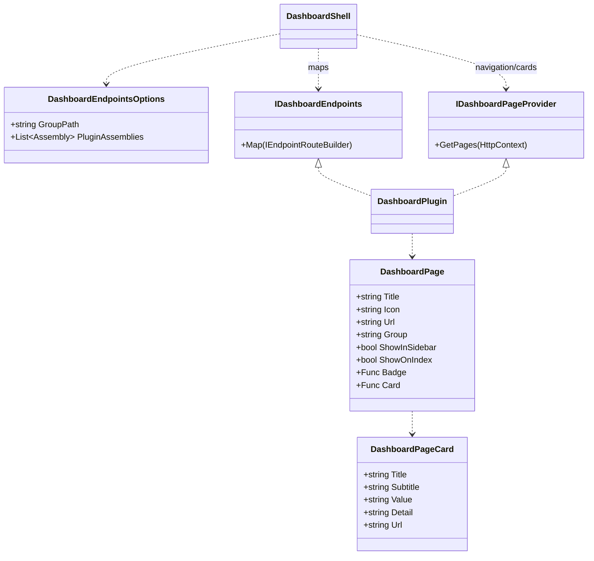
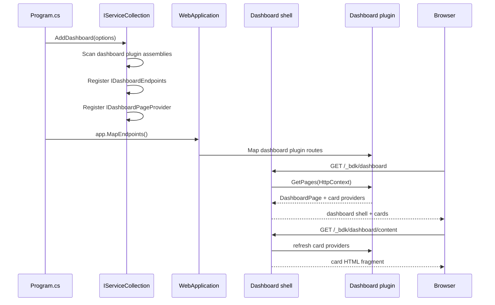

# Presentation Dashboard Feature Documentation

> Host developer dashboard pages as a modular shell with pluggable RazorSlice pages, grouped navigation, and live-updating dashboard cards.

[TOC]

## Overview

The Dashboard feature provides a server-rendered developer dashboard under a configurable route, by default `/_bdk/dashboard`. The shell owns the layout, sidebar, grouping, card index, and common styling. Feature packages and application projects contribute their own pages through small plugin contracts.

Dashboard pages are Minimal API endpoints that render [RazorSlices](https://github.com/DamianEdwards/RazorSlices). Pages can also publish navigation metadata and an optional compact card for the dashboard index page. Cards are refreshed in-place by a dashboard HTML fragment endpoint, so the index can show current plugin state without reloading the full shell.

### Challenges

- Extensibility: Let bITdevKit packages and application projects add dashboard pages without editing the dashboard shell.
- Navigation: Keep the sidebar aware of plugged-in pages and group pages by feature area.
- Server rendering: Render pages directly from in-process services instead of routing through HTTP JSON APIs.
- Live overview: Let plugin cards update on the dashboard index without a full page reload.
- External assemblies: Support dashboard plugins that live outside `Presentation.Web`.

### Solution

- Shell: `AddDashboard(...)` registers the dashboard shell and discovers dashboard plugins.
- Endpoints: `IDashboardEndpoints` marks endpoint classes that map dashboard routes.
- Pages: RazorSlice pages render dashboard content using normal Razor syntax and optional layout models.
- Navigation and cards: `IDashboardPageProvider` contributes sidebar items and optional dashboard index cards.
- Page sets: `DashboardPageSet` lets modules define multiple pages, content fragments, page-local actions, navigation, and cards from one builder.
- Helpers: `MapDashboardPage(...)`, `DashboardPath.Combine(...)`, and `Results.Extensions.DashboardRazorSlice(...)` simplify plugin page mapping.

## Core Contracts

- `DashboardEndpointsOptions` ([src/Presentation.Web/Dashboard/DashboardEndpointsOptions.cs](src/Presentation.Web/Dashboard/DashboardEndpointsOptions.cs))
  - `Enabled`: Enables or disables the dashboard.
  - `GroupPath`: Base dashboard path. Defaults to `/_bdk/dashboard`.
  - `GroupTag`: Endpoint group tag.
  - `AuthorizationMode`: Controls dashboard authorization behavior. Defaults to `Auto`.
  - `RequireRoles`, `RequirePolicy`, `RequireAuthenticationSchemes`: Inherited endpoint authorization requirements that can be configured through `Authorize(...)`.
  - `SignOutAuthenticationSchemes`: Authentication schemes used by the dashboard sign-out route. If empty, sign-out uses the dashboard authentication schemes.
  - `DisabledPageKeys`: Stable page keys hidden from sidebar navigation and dashboard index cards.
  - `PluginAssemblies`: Additional assemblies to scan for dashboard plugins.
- `DashboardAuthorizationOptionsBuilder` ([src/Presentation.Web/Dashboard/DashboardEndpointsOptionsBuilder.cs](src/Presentation.Web/Dashboard/DashboardEndpointsOptionsBuilder.cs))
  - `UseCookie(...)`: Reuses an existing host cookie scheme for dashboard access.
  - `UseExistingScheme(...)`: Reuses another host-owned authentication scheme.
  - `UseOpenIdConnect(authority, ...)`: Registers dashboard-owned cookie and OIDC schemes with dashboard conventions.
  - `UseOpenIdConnect(Action<OpenIdConnectOptions>, ...)`: Registers dashboard-owned cookie and OIDC schemes with raw ASP.NET Core handler configuration.
- `DashboardOpenIdConnectOptionsBuilder` ([src/Presentation.Web/Dashboard/DashboardEndpointsOptionsBuilder.cs](src/Presentation.Web/Dashboard/DashboardEndpointsOptionsBuilder.cs))
  - `WithClientId(...)`: Overrides the default dashboard client id.
  - `WithMetadataAddress(...)`: Overrides the default discovery document address.
  - `RequireHttpsMetadata(...)`: Controls whether OIDC metadata must be loaded over HTTPS.
  - `RequireSignedTokens()`: Enables signed-token and issuer-signing-key validation.
  - `Configure(...)`: Applies low-level `OpenIdConnectOptions` customization after dashboard conventions.
- `DashboardAuthenticationDefaults` ([src/Presentation.Web/Dashboard/DashboardAuthenticationDefaults.cs](src/Presentation.Web/Dashboard/DashboardAuthenticationDefaults.cs))
  - Provides the dashboard-owned authentication scheme names and the default OIDC client id `dashboard`.
- `IDashboardEndpoints` ([src/Presentation.Web/Dashboard/IDashboardEndpoints.cs](src/Presentation.Web/Dashboard/IDashboardEndpoints.cs))
  - Marker contract for dashboard-specific endpoint sets.
  - Extends the regular presentation `IEndpoints` contract.
- `IDashboardPageProvider` ([src/Presentation.Web/Dashboard/IDashboardPageProvider.cs](src/Presentation.Web/Dashboard/IDashboardPageProvider.cs))
  - Provides `DashboardPage` descriptors for sidebar navigation and optional index cards.
- `DashboardPageSet` ([src/Presentation.Web/Dashboard/DashboardPageSet.cs](src/Presentation.Web/Dashboard/DashboardPageSet.cs))
  - Recommended base for module dashboards that own one or more pages.
  - Implements endpoint mapping and page metadata from a single `DashboardPageSetBuilder` declaration.
- `DashboardPage` ([src/Presentation.Web/Dashboard/DashboardPage.cs](src/Presentation.Web/Dashboard/DashboardPage.cs))
  - Defines title, icon, URL, group, ordering, sidebar visibility, optional badge, and optional card provider.
- `DashboardPageCard` ([src/Presentation.Web/Dashboard/DashboardPage.cs](src/Presentation.Web/Dashboard/DashboardPage.cs))
  - Defines compact card content for the dashboard index.
- Route helpers ([src/Presentation.Web/Dashboard/DashboardRouteBuilderExtensions.cs](src/Presentation.Web/Dashboard/DashboardRouteBuilderExtensions.cs))
  - `MapDashboardPage<TPage>(...)`: Maps a typed RazorSlice page.
  - `MapDashboardPage(..., razorIdentifier, assembly, ...)`: Maps a compiled RazorSlice by identifier from a plugin assembly.
- Path helper ([src/Presentation.Web/Dashboard/DashboardPath.cs](src/Presentation.Web/Dashboard/DashboardPath.cs))
  - `DashboardPath.Combine(...)`: Combines route segments with one slash.

## Architecture

### Class Diagram



### Sequence (Registration → Render)



## Getting Started

### Register the Dashboard

Register the dashboard during service configuration.

```csharp
builder.Services.AddDashboard(options =>
{
    options.WithGroupPath("/_bdk/dashboard");
});
```

Hide auto-discovered feature pages by stable page key when a host wants to keep the feature registered but remove its dashboard navigation and index card:

```csharp
builder.Services.AddDashboard(options => options
    .DisablePages("metrics", "storage.documents"));
```

The final argument may be a boolean switch, which is useful for environment-specific setup:

```csharp
builder.Services.AddDashboard(options => options
    .DisablePages("metrics", "storage.documents", !builder.Environment.IsDevelopment()));
```

Built-in page keys:

| Page | Key | Screenshot |
| --- | --- | --- |
| Overview | `dashboard.overview` | [Overview](assets/dashboard/01-overview-overview.png) |
| System | `dashboard.system` | [System](assets/dashboard/03-system-system.png) |
| Health | `health` | [Health](assets/dashboard/05-health-health.png) |
| Metrics | `metrics` | [Metrics](assets/dashboard/04-metrics-metrics.png) |
| Identity | `identity` | [Identity](assets/dashboard/02-identity-identity.png) |
| Console | `console` | [Console](assets/dashboard/15-console-console.png) |
| MCP | `mcp` | [MCP](assets/dashboard/16-mcp-mcp.png) |
| Logs | `logging.logs` | [Logs](assets/dashboard/07-logentries-logs.png) |
| Errors | `logging.errors` | [Errors](assets/dashboard/08-errors-errors.png) |
| Logs Stream | `logging.stream` | [Logs Stream](assets/dashboard/09-logentries-stream-logs-stream.png) |
| Jobs | `jobs` | [Jobs](assets/dashboard/06-jobs-jobs.png) |
| Messaging | `messaging` | [Messaging](assets/dashboard/10-messaging-messaging.png) |
| Queueing | `queueing` | [Queueing](assets/dashboard/11-queueing-queueing.png) |
| Orchestrations | `orchestrations` | [Orchestrations](assets/dashboard/12-orchestrations-orchestrations.png) |
| File Storage | `storage.files` | [Files](assets/dashboard/13-storage-files-files.png) |
| Document Storage | `storage.documents` | [Documents](assets/dashboard/14-storage-documents-documents.png) |

Project-specific pages declared with `DashboardPageSet` use the key passed to `.Page(...)`. For example, a page declared as `.Page("customer-management", "/app/core/customers")` can be hidden with:

```csharp
builder.Services.AddDashboard(options => options
    .DisablePages("customer-management"));
```

Map registered endpoints once during application startup.

```csharp
var app = builder.Build();

app.MapEndpoints();
```

The dashboard uses the existing endpoint registration pipeline. `AddDashboard(...)` registers dashboard endpoint classes with `AddEndpoints(...)`; `app.MapEndpoints()` maps them.

### Authentication And Authorization

Dashboard routes use the same endpoint authorization pipeline as other bITdevKit endpoints. By default, the dashboard runs in `Auto` authorization mode:

- if the application has no authentication schemes registered, the dashboard remains anonymous
- if the application has authentication schemes registered, dashboard routes require authorization

Use `Authorize(...)` to require a dashboard role, policy, or authentication mode. This keeps the dashboard generic: a host application can reuse an existing cookie login, let the dashboard register its own OIDC flow, or explicitly reference another ASP.NET Core authentication scheme.

```csharp
builder.Services.AddDashboard(options => options
    .Enabled(true)
    .Authorize(authorization => authorization
        .Auto()
        .RequireRole(Role.Administrators)));
```

Use `RequireAuthenticated()` when the dashboard must always require authentication after registration, even if the application has not configured authentication yet.

```csharp
builder.Services.AddDashboard(options => options
    .Authorize(authorization => authorization.RequireAuthenticated()));
```

Use `AllowAnonymous()` only for hosts that intentionally expose the dashboard without authentication.

```csharp
builder.Services.AddDashboard(options => options.AllowAnonymous());
```

If the host application already has an interactive cookie login, reuse that cookie scheme. This is common when the Web API is hosted together with a Blazor, Angular, or other SPA shell.

```csharp
builder.Services.AddDashboard(options => options
    .Authorize(authorization => authorization
        .UseCookie("ApplicationCookie", signOut: true) // use an existing cookie scheme by name
        // .UseCookie(CookieAuthenticationDefaults.AuthenticationScheme, signOut: true) // use default asp.net cookie scheme
        //.UseCookie(signOut: true) // use default asp.net cookie scheme
        .RequireRole(Role.Administrators)));
```

When a reused cookie principal is authenticated but misses the required dashboard role or policy, the dashboard handles the forbid result for dashboard paths and redirects to the built-in dashboard access-denied page. Other application routes continue to use the host application's normal authorization behavior.

For server-rendered dashboards that should trigger an interactive login but the host API only has JWT bearer authentication, let the dashboard register its own cookie, OIDC, and policy schemes. The dashboard does not perform client-credentials login for page access; browser access uses an interactive authorization-code flow. The default dashboard client id is `dashboard`.

```csharp
builder.Services.AddDashboard(options => options
    .Authorize(authorization => authorization
        .UseOpenIdConnect("https://idp.example")
        .RequireRole(Role.Administrators)));
```

The fluent OIDC overload sets these values by convention:

- metadata address: `{authority}/.well-known/openid-configuration`
- client id: `dashboard`
- response type: authorization code
- callback path: `/_bdk/dashboard/signin-oidc`
- sign-out callback path: `/_bdk/dashboard/signout-callback-oidc`
- scopes: `openid`, `profile`, `email`, `roles`
- issuer validation, audience validation, lifetime validation, and dashboard role claim mapping

Token signature checks are relaxed by default so development and lightweight identity providers can be used without extra setup. Use `RequireSignedTokens()` when the dashboard should require signed tokens and issuer signing key validation.

Register the dashboard as an OIDC client at the identity provider. With the default dashboard path and client id, the redirect URI is:

```text
https://localhost:5001/_bdk/dashboard/signin-oidc
```

Use `WithClientId(...)` when the identity provider uses a client id other than `dashboard`.

```csharp
builder.Services.AddDashboard(options => options
    .Authorize(authorization => authorization
        .UseOpenIdConnect(
            "https://idp.example",
            oidc => oidc.WithClientId("operations-dashboard"))
        .RequireRole(Role.Administrators)));
```

For providers where the dashboard should require signed tokens and issuer signing key validation, opt in explicitly.

```csharp
builder.Services.AddDashboard(options => options
    .Authorize(authorization => authorization
        .UseOpenIdConnect(
            "https://idp.example",
            oidc => oidc.RequireSignedTokens())
        .RequireRole(Role.Administrators)));
```

For HTTP-only local identity providers, disable the metadata HTTPS requirement.

```csharp
builder.Services.AddDashboard(options => options
    .Authorize(authorization => authorization
        .UseOpenIdConnect(
            "http://localhost:8080",
            oidc => oidc.RequireHttpsMetadata(false))
        .RequireRole(Role.Administrators)));
```

Use the raw `OpenIdConnectOptions` overload when a provider needs handler-specific settings that are not covered by the dashboard fluent builder.

```csharp
builder.Services.AddDashboard(options => options
    .Authorize(authorization => authorization
        .UseOpenIdConnect(oidc =>
        {
            oidc.Authority = "https://idp.example";
            oidc.ClientId = "dashboard";
            oidc.ResponseMode = "form_post";
        })
        .RequireRole(Role.Administrators)));
```

Use `UseExistingScheme(...)` for advanced host-owned schemes that are not cookies.

```csharp
builder.Services.AddDashboard(options => options
    .Authorize(authorization => authorization
        .UseExistingScheme("MyScheme", signOut: false)
        .RequirePolicy("DashboardAccess")));
```

When the dashboard registers its own OIDC flow, it automatically uses the built-in access-denied page and sign-out route. When the current dashboard principal is authenticated, the dashboard shell shows a sign-out action in the header. The action posts to the built-in dashboard sign-out route and redirects back to the current dashboard URL, which triggers the configured authentication challenge again. Configure `.SignOutAuthenticationScheme(...)` manually only when using a custom scheme that needs separate sign-out behavior.

### Include Plugin Assemblies

The dashboard scans the core dashboard assembly, explicitly configured plugin assemblies, and currently loaded assemblies containing dashboard contracts. For application plugins, prefer explicit registration so discovery does not depend on load order.

```csharp
builder.Services.AddDashboard(options =>
{
    options.WithPluginAssemblyContaining<CatalogDashboardEndpoints>();
});
```

For multiple assemblies:

```csharp
builder.Services.AddDashboard(options =>
{
    options.WithPluginAssemblies(
        typeof(CatalogDashboardEndpoints).Assembly,
        typeof(ReportingDashboardEndpoints).Assembly);
});
```

### Built-In Routes

The dashboard shell uses fixed built-in routes below the configured `GroupPath`. Plugin pages own and map their own route segments; the shell does not maintain a central list of plugin paths.

| Path | Default |
| --- | --- |
| Dashboard index | `/_bdk/dashboard` |
| Dashboard index content fragment | `/_bdk/dashboard/content` |
| Dashboard access denied | `/_bdk/dashboard/access-denied` |
| Dashboard sign-out | `POST /_bdk/dashboard/signout` |
| Health page | `/_bdk/dashboard/health` |
| Health content fragment | `/_bdk/dashboard/health/content` |
| Metrics page | `/_bdk/dashboard/metrics` |
| Metrics content fragment | `/_bdk/dashboard/metrics/content` |
| Identity page | `/_bdk/dashboard/identity` |
| Identity client credentials login | `/_bdk/dashboard/identity/client-credentials/login` |
| File storage explorer | `/_bdk/dashboard/storage/files` |
| Document storage explorer | `/_bdk/dashboard/storage/documents` |

## Built-In Pages

### Dashboard Index

The dashboard index shows cards contributed by dashboard page providers. It includes a refresh interval dropdown with fixed intervals:

- `Off`
- `1 sec`
- `5 sec`
- `15 sec`
- `30 sec`

The selected interval is stored in `localStorage`. Refresh uses a recursive `setTimeout` loop and an `AbortController`, so refreshes do not overlap and an in-flight request is cancelled when the interval changes. The page pauses automatic refresh while the browser tab is hidden and refreshes once when the tab becomes visible again.

The index refresh endpoint returns only card HTML. It does not render the full dashboard layout.

### Metrics

The metrics page is server-rendered and reads in-process snapshot services directly. It does not call the metrics JSON endpoints. The page has its own content fragment endpoint and refresh controls for updating only the metrics body.

Metrics remain optional. Registering the dashboard does not automatically register metrics; applications opt into metrics separately.

### Health

The health page is server-rendered and invokes the registered ASP.NET Core health checks through `HealthCheckService` from `Microsoft.Extensions.Diagnostics.HealthChecks`. It does not call a `/healthz` endpoint.

The page shows the overall status, number of registered checks, unhealthy count, total duration, and a compact table of health check entries. It has its own content fragment endpoint and refresh controls for updating only the health body.

Register health checks in the host application with the standard ASP.NET Core API:

```csharp
builder.Services.AddHealthChecks()
    .AddCheck("self", () => HealthCheckResult.Healthy());
```

If `AddHealthChecks()` is not registered, the page and card show an unavailable state instead of failing the dashboard.

### Identity

The identity page displays current user information using the current user accessor and request principal. When the fake identity provider is registered, the page can show a client credentials login action. If the fake provider is not available, fake-provider-specific UI is hidden.

### Document Storage

The document storage page is contributed by `Presentation.Web.Storage` and is shown only when `AddDocumentStorage(...)` is active and at least one typed document client is registered. The page is server-rendered and uses the existing `IDocumentStoreClient<T>` instances for the selected document type.

The page lets operators switch between registered document clients on the fly, page through document keys with selectable page sizes of 100, 250, 500, or 1000 items remembered in browser storage, filter by partition and row key, reset filters, create a new document from keyed pasted or written JSON, download a document from the table, open exact documents in a details dialog, edit payload JSON with syntax validation, and delete one or more checked documents after a browser confirmation alert that includes the affected keys. New-document creation checks the selected client first and reports a conflict instead of overwriting an existing key. Paging, filtering, and reset actions clear row selections so stale checked rows are not reused. It does not expose a separate REST admin API; dashboard-local fragment and form-action routes serve the rendered page workflow.

## Adding Project-Specific Dashboard Pages

For new project or module pages, prefer `DashboardPageSet`. A page set lets one module declare all of its dashboard pages, content fragments, local action routes, sidebar metadata, and index cards in one class. The low-level `IDashboardEndpoints` and `IDashboardPageProvider` contracts remain available for advanced or unusual plugins.

### Folder Layout

```text
# Presentation.Web

Modules/
  Catalog/
    Dashboard/
      CatalogDashboard.cs
      Pages/
        Overview.cshtml
        OverviewContent.cshtml
        ProductManagement.cshtml
        ProductManagementContent.cshtml
        _ViewImports.cshtml
```

### Project Package Reference

The application or plugin assembly that owns the `.cshtml` files must reference `RazorSlices` directly so RazorSlice proxy types are generated for that assembly. With central package management, add the reference without a version:

```xml
<ItemGroup>
  <PackageReference Include="RazorSlices" />
</ItemGroup>
```

### Page Set

Use one page set per module. Each page owns its display route, optional content fragments, optional dashboard index card, and optional local actions.

```csharp
namespace MyApp.Modules.Catalog.Dashboard;

using BridgingIT.DevKit.Presentation.Web.Dashboard;

public sealed class CatalogDashboard(DashboardEndpointsOptions options)
    : DashboardPageSet(options)
{
    protected override void Configure(DashboardPageSetBuilder pages)
    {
        pages.WithTags("_bdk.Dashboard.Catalog");

        pages.Group("Catalog", order: 100)
            .Page("overview", "/catalog")
                .Title("Overview")
                .Icon("boxes")
                .Order(0)
                .Description("Catalog overview")
                .Razor<Pages.Overview>()
                .Content<Pages.OverviewContent>()
                .Card(GetOverviewCardAsync)
            .Page("product-management", "/catalog/products")
                .Title("Product Management")
                .Icon("box-seam")
                .Order(10)
                .Description("Manage catalog products")
                .Razor<Pages.ProductManagement>()
                .Content<Pages.ProductManagementContent>()
                .HideFromIndex()
                .Post("/create", CreateProductAsync)
                    .Name("_bdk.Dashboard.Catalog.ProductCreate");
    }

    private static async ValueTask<DashboardPageCard> GetOverviewCardAsync(DashboardPageCardContext card)
    {
        var requester = card.HttpContext.RequestServices.GetService<IRequester>();
        if (requester is null)
        {
            return card.Unavailable("Requester unavailable");
        }

        var result = await requester.SendAsync(new ProductSummaryQuery(), cancellationToken: card.HttpContext.RequestAborted);
        return result.IsSuccess
            ? card.Value(result.Value.ProductCount.ToString(CultureInfo.InvariantCulture), "products")
            : card.Error(result.Errors.FirstOrDefault()?.Message ?? "Could not load products");
    }
}
```

The builder derives:

- endpoint mappings for the page and content fragments
- absolute dashboard URLs
- sidebar items
- default index card metadata
- endpoint names, summaries, and descriptions
- page-local action routes such as `/catalog/products/create`

Use `.HideFromSidebar()` for utility pages and `.HideFromIndex()` for pages that should not appear as index cards.

### RazorSlice Imports

For project-local dashboard pages, add a `_ViewImports.cshtml` beside the pages.

```razor
@using BridgingIT.DevKit.Presentation.Web.Dashboard
@using BridgingIT.DevKit.Presentation.Web.Dashboard.Pages
@using Microsoft.Extensions.DependencyInjection
@using RazorSlices

@tagHelperPrefix __disable_tagHelpers__:
@removeTagHelper *, Microsoft.AspNetCore.Mvc.Razor
```

RazorSlices currently do not support Tag Helpers in this repo because warnings are treated as errors and RazorSlices marks Tag Helper APIs obsolete. Use RazorSlice base classes and normal Razor markup instead.

### RazorSlice Page

Use `DashboardPageSlice` for full dashboard pages and `DashboardContentSlice` for content fragments. The page can resolve services directly because it is server-rendered.

```razor
@using MyApp.Modules.Catalog.Application
@inherits DashboardPageSlice

@{
    var contentPath = this.Dashboard.Url("overview", "content");
}

<div class="d-flex justify-content-between align-items-center py-2 mb-2 border-bottom">
    <div>
        <h4 class="m-0">Catalog</h4>
        <div class="text-muted small">Product inventory overview</div>
    </div>
    <span class="text-muted small">Updated @DateTimeOffset.UtcNow.LocalDateTime.ToString("T", CultureInfo.InvariantCulture)</span>
</div>

<div id="catalog-overview-content">
    <div class="text-muted small py-2">Loading catalog content...</div>
</div>

<script>
    (() => {
        window.bdkDashboard.createRefresher({
            contentUrl: '@contentPath',
            contentSelector: '#catalog-overview-content'
        }).refresh(true);
    })();
</script>

@functions {
    public override string PageTitle => "Catalog";
}
```

### Page Descriptor Guidance

- `.Title(...)`: Display name in sidebar and default card title.
- `.Icon(...)`: Bootstrap icon name without the `bi-` prefix.
- `.Group(...)`: Sidebar/card group heading and group sort order.
- `.Order(...)`: Sort order inside the group.
- `.HideFromSidebar()`: Use for utility pages.
- `.HideFromIndex()`: Use for pages that should not create dashboard cards.
- `.Badge(...)`: Optional async count shown in the sidebar.
- `.Card(...)`: Optional async card provider for the dashboard index.
- `.Razor<TPage>()`: Main typed RazorSlice page.
- `.Content<TPage>()`: Optional typed refreshable RazorSlice fragment below the page route.
- `.Get(...)`, `.Post(...)`, `.Put(...)`, `.Delete(...)`: Optional page-local Minimal API action routes.

Page sets are called at render time to provide navigation and cards. Keep badge and card work lightweight, use in-process services, and handle missing optional services gracefully.

### Advanced Manual Mapping

For advanced cases, implement `IDashboardEndpoints` to map custom routes and `IDashboardPageProvider` to contribute sidebar/card metadata manually. Use `MapDashboardPage<TPage>(...)` for typed RazorSlices or `MapDashboardPage(..., razorIdentifier, assembly, ...)` when the generated RazorSlice type is awkward to reference.

## Dashboard Index Cards

Cards are rendered on the dashboard index and refreshed through the index content fragment endpoint. A card provider can return live values such as counts, health summaries, queue depth, or last activity.

If a page has `ShowOnIndex = true` but no `Card` delegate, the shell can still produce a default card from page metadata. Define `Card` when the plugin has useful summary data.

The dashboard catches page provider/card failures and keeps rendering the rest of the dashboard. Failed card providers are logged and replaced with an unavailable card state.

## Sidebar Grouping

The sidebar groups pages by `DashboardPage.Group`. Groups are visually separated. Built-in bITdevKit pages use the `bdk` group. Application pages should use an application-specific group such as `Application`, `Catalog`, `Operations`, or the module name.

Use `GroupOrder` to place groups predictably:

```csharp
new DashboardPage("orders", "Orders", "receipt", "/_bdk/dashboard/orders")
{
    Group = "Application",
    GroupOrder = 100,
    Order = 20
};
```

## Refresh Strategy

The dashboard shell uses fragment endpoints for refreshable regions:

- `/_bdk/dashboard/content`: dashboard index cards.
- `/_bdk/dashboard/health/content`: health body.
- `/_bdk/dashboard/metrics/content`: metrics body.

The browser-side refresh strategy:

- Stores interval selection in `localStorage`.
- Uses `fetch()` to request server-rendered HTML fragments.
- Replaces only the content container `innerHTML`.
- Uses recursive `setTimeout` instead of `setInterval` to avoid overlapping refreshes.
- Uses `AbortController` to cancel in-flight requests when the interval changes.
- Keeps previous content visible on failure and updates status text.
- Pauses automatic refresh while `document.hidden` is `true`.

Project-specific pages can use the same pattern when only part of a page should update. Add a fragment RazorSlice, map a second dashboard endpoint, and replace a scoped content container from JavaScript.

## External Plugin Assemblies

Dashboard plugins can live in separate packages or application assemblies. A plugin assembly should provide:

- One or more `DashboardPageSet` implementations, or advanced manual `IDashboardEndpoints` implementations.
- Optional manual `IDashboardPageProvider` implementations when not using `DashboardPageSet`.
- RazorSlice pages compiled into the plugin assembly. Reference `RazorSlices` directly when using typed `.Razor<TPage>()` and `.Content<TPage>()` page declarations.

Register the plugin assembly explicitly from the host:

```csharp
builder.Services.AddDashboard(options =>
{
    options.WithPluginAssemblyContaining<MyPluginDashboard>();
});
```

The dashboard scans configured plugin assemblies for endpoint and page provider implementations. It also scans currently loaded assemblies as a convenience, but explicit registration is recommended for reusable packages.

## Troubleshooting

- Dashboard returns 404: Ensure `builder.Services.AddDashboard(...)` is called and `app.MapEndpoints()` is executed.
- Plugin page route is missing: Ensure the plugin assembly is loaded and registered with `WithPluginAssemblyContaining<T>()`.
- Sidebar item is missing: Ensure an `IDashboardPageProvider` implementation is concrete, public, and in a scanned assembly.
- Card does not appear: Ensure `ShowOnIndex` is `true` and the page provider returns a page. Check logs for provider/card exceptions.
- Typed RazorSlice type is missing: Verify the application or plugin assembly references `RazorSlices` directly, and prefer unique page-specific `.cshtml` filenames such as `Overview.cshtml` and `OverviewContent.cshtml`.
- Path-based RazorSlice cannot render: Verify the RazorSlice identifier and assembly. The identifier is usually the project-relative `.cshtml` path with a leading slash.
- Authorization behaves differently than expected: Dashboard routes are endpoint routes. Apply authorization through the inherited endpoint options and `MapGroup(...)` behavior, or require authorization on the mapped route group.
- OIDC login does not start: Ensure the dashboard is configured with an authentication scheme whose challenge forwards to the OIDC handler, and that the identity provider client includes the dashboard callback URI.
- Refresh shows stale content: Confirm the fragment endpoint returns updated server-rendered HTML and that the browser interval is not set to `Off`.

## Appendix A — Minimal Plugin

The following is the smallest useful dashboard plugin with the recommended page-set API: one route, one page, one sidebar item, and one card.

```csharp
public sealed class HealthDashboard(DashboardEndpointsOptions options)
    : DashboardPageSet(options)
{
    protected override void Configure(DashboardPageSetBuilder pages)
    {
        pages.Group("Application", 100)
            .Page("health", "/health")
                .Title("Health")
                .Icon("activity")
                .Order(0)
                .Razor<Pages.Health>()
                .Card(card => ValueTask.FromResult(
                    card.Value("OK", "Application is responding", "System")));
    }
}
```

```razor
@inherits DashboardPageSlice

<div class="d-flex justify-content-between align-items-center py-2 mb-2 border-bottom">
    <h4 class="m-0">Health</h4>
    <span class="text-muted small">Updated @DateTimeOffset.UtcNow.LocalDateTime.ToString("T", CultureInfo.InvariantCulture)</span>
</div>

<div class="card">
    <div class="card-body p-3">
        <h6 class="card-title">Application</h6>
        <div class="fs-4 fw-semibold">OK</div>
    </div>
</div>

@functions {
    public override string PageTitle => "Health";
}
```

Register external plugin assemblies explicitly:

```csharp
builder.Services.AddDashboard(options =>
{
    options.WithPluginAssemblyContaining<HealthDashboard>();
});
```
