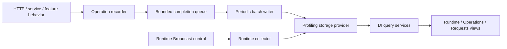

# Profiling

> Investigate process behavior with Runtime snapshots and application bottlenecks with independent Operation segments.

[TOC]

## Overview

Profiling is one opt-in development feature with independent Runtime and Operation capabilities. Runtime Profiling collects bounded CPU, memory, allocation and GC snapshots. Operation Profiling records one business execution and aggregates its timed segments. Request Profiling adapts the same operation recorder to HTTP; services, Blazor interactions, jobs, pipelines and orchestration slices use it without HTTP or an active Runtime session.

All recorded timestamps use UTC. Elapsed time uses a monotonic clock. Dashboard JSON endpoints serve dashboard pages; they are not a supported API for external clients. Business response payloads and request bodies are not stored.

## Challenges

A slow operation can spend time loading data, transforming it, or running independent feature steps. Process-wide counters alone cannot identify that split. Instrumentation must remain bounded and must not put persistence on the business execution path.

## Solution

The recorder captures bounded in-memory state, freezes an immutable completion record and enqueues it without waiting. One periodic worker persists batches through the selected provider. Read-only query services build dashboard views from retained data without flushing the queue. Runtime continues to use its separate Broadcast-controlled lifecycle and collector.

## Key Features

- Independent Runtime sampling, general Operation timings and automatic HTTP capture.
- Repeated, nested and parallel segments aggregated by complete case-insensitive key paths.
- Typed dimensions, measurements, safe outcome/failure summaries and explicit partial coverage.
- All-request, probability and token-budget HTTP sampling strategies.
- Memory or Entity Framework provider selection, bounded retention and fenced all/range clearing.
- Runtime, Operations and Requests views with shared authorization, UTC and refresh behavior.
- Bounded time/process correlation, without assigning process resource totals to individual operations.
- Optional feature behaviors that remain usable when Profiling registration is omitted.

## Architecture

`IOperationProfiler` owns synchronous execution-local capture. `OperationProfilingCompletionQueue` and `OperationProfilingWriterService` own nonblocking completion and periodic persistence. `IProfilingStorageProvider` exposes independent Runtime/Operation facets and maintenance. `IOperationProfilingQueryService` owns bounded reads, analysis and Runtime overlays. Runtime control, probes, collectors, measurements, archive and evaluation APIs use the `RuntimeProfiling` names and retain their own ownership.



## Use Cases

- Identify which segment keys become slower under concurrent requests.
- Compare retained timing distributions by key, kind and typed dimensions.
- Investigate repeated SQL, cache, transformation or service work without recording a dependency trace.
- Open a diagnostics ID from a response header and inspect its retained operation.
- Overlay process snapshots around an operation while keeping sampling gaps visible.
- Reproduce a Runtime workload, compare snapshots and retain a terminal Runtime archive.

## Basic Usage

The following development-only endpoint starts a bounded in-memory session, records a marker, waits for samples, and stops the session. Each result is checked before its value is used, and the response reports the session key and final state.

```csharp
using BridgingIT.DevKit.Common;

var builder = WebApplication.CreateBuilder(args);

builder.Services.AddProfiling(options => options
    .Enabled(builder.Environment.IsDevelopment()))
    .WithRuntimeProfiling(options => options
    .SamplingInterval(TimeSpan.FromSeconds(1))
    .Duration(TimeSpan.FromSeconds(10)));

var app = builder.Build();

if (app.Environment.IsDevelopment())
{
    app.MapPost("/dev/profiling/sample", async (
        IRuntimeProfilingControlService profiling,
        CancellationToken cancellationToken) =>
    {
        var started = await profiling.StartAsync(
            new RuntimeProfilingStartRequest("sample workload"),
            cancellationToken);

        if (started.IsFailure)
        {
            return Results.Problem(string.Join(
                "; ",
                started.Errors.Select(error => error.Message)));
        }

        var marked = await profiling.AddMarkerAsync(
            "workload started",
            cancellationToken);

        if (marked.IsFailure)
        {
            await profiling.StopAsync(CancellationToken.None);
            return Results.Problem(string.Join(
                "; ",
                marked.Errors.Select(error => error.Message)));
        }

        await Task.Delay(TimeSpan.FromSeconds(3), cancellationToken);

        var stopped = await profiling.StopAsync(cancellationToken);
        if (stopped.IsFailure)
        {
            return Results.Problem(string.Join(
                "; ",
                stopped.Errors.Select(error => error.Message)));
        }

        return Results.Ok(new
        {
            Session = stopped.Value.Session.Identity.Key,
            stopped.Value.Session.State,
            ParticipatingNodes = stopped.Value.NodeOutcomes.Count
        });
    });
}

app.Run();
```

Calling `POST /dev/profiling/sample` returns the readable session key and a terminal state. The session remains available in the in-memory store until retention removes it or the process exits.

## Operation and Request setup

Enable each capture capability explicitly. Choose one storage provider for the overarching feature:

```csharp
builder.Services.AddProfiling(options => options.Enabled(builder.Environment.IsDevelopment()))
    .WithRuntimeProfiling(options => options.SamplingInterval(TimeSpan.FromSeconds(1)))
    .WithOperationProfiling(options => options.FlushInterval(TimeSpan.FromSeconds(1)).BatchSize(512))
    .WithRequestProfiling(options => options
        .StripPathPrefix("/api")
        .Blacklist("/_bdk/**", "/healthz", "/swagger/**")
        .WithSampling(sampling => sampling.AllRequests()))
    .WithInMemoryProvider();
builder.Services.AddDashboard(options => options.Enabled(builder.Environment.IsDevelopment()));
```

`WithRequestProfiling` fails setup validation if Operations was not explicitly enabled. Omit Runtime to use Operations alone. Disable Requests to stop automatic HTTP capture while retaining manually started operations. `AddProfiling` without an enabled operation capability supplies an inactive facade; omitting `AddProfiling` supplies no profiling dependencies. Feature behaviors resolve their optional dependency gracefully.

Place the outer request observer before error handling and the exception observer immediately inside the handler. Keep routing, CORS, security and response processing inside the observation boundary:

```csharp
app.UseRequestProfiling();
app.UseExceptionHandler(); // use the host's configured error handler
app.UseRequestProfilingExceptionObserver();
app.UseRouting();
app.UseCors();
app.UseAuthentication();
app.UseAuthorization();
app.MapEndpoints();
```

The default operation key is the request path. Prefix stripping respects path-segment boundaries. Blacklist patterns use `*` within a path segment and `**` across segments; they match the normalized request path before key-prefix stripping. A match suppresses replacement operations in that request flow. Keep dashboard, health and documentation requests excluded when profiling a workload.

Selected eligible requests receive `X-Request-Profiling-Id`. This ID identifies the occurrence, not a durable-storage receipt: queue limits, loss, pending flush, expiry or clearing can make exact lookup unavailable. It is distinct from the application correlation/request ID. Cached responses do not replay stale profiling IDs. Response bytes distinguish observed, partial/unavailable and declared sizes. Body observation does not read, buffer, or retain payload contents.

### Enrichment and segments

Inject `IOperationProfiler` into a controller, minimal API or service. Middleware owns the HTTP operation; the handler enriches that owner:

```csharp
app.MapGet("/catalog", async (IOperationProfiler profiling, CancellationToken token) =>
{
    profiling.SetKey("catalog:list");
    profiling.SetDimension("category", "books");
    profiling.SetDimension("batchSize", 20); // numeric, distinct from the string "20"
    var result = await profiling.RunSegmentAsync("Query", (_, ct) => Task.FromResult(Result<int>.Success(20)),
        token, value => OperationProfilingHelpers.ClassifyResult(value));
    return Results.Ok(result.Value);
});
```

Outside HTTP, own a root explicitly or use the helper that preserves business results, exceptions and cancellation:

```csharp
var count = await profiling.RunOperationAsync("catalog:refresh", OperationProfilingKind.Service,
    async (operation, token) =>
    {
        operation.SetDimension("region", "west");
        for (var index = 0; index < 3; index++)
        {
            using var load = operation.BeginSegment("Load");
            await load.RunSegmentAsync("Transform", (_, ct) => Task.CompletedTask, token);
            load.SetMeasurement("items", 10, "count", MeasurementAggregation.Sum);
            load.Complete();
        }
        return 30;
    }, cancellationToken);
```

Segments with the same complete path aggregate invocation counts, total/self durations, min/max, outcome buckets and compatible measurement reductions. Names compare ordinally without case: `Load` and `load` belong to the same group. Nested `Load/Transform` differs from top-level `Transform`. Invocation means use summed duration/count; invocation percentiles and chronological traces are unavailable. Parallel invocation totals can exceed root elapsed time. Exclusive wall-time bars represent top-level key buckets, Parallel overlap and Outside segments; they are percentages of monotonic root duration.

Explicitly complete manual scopes. Disposed-but-uncompleted, abandoned or clipped scopes keep incomplete/partial quality. Helpers observe delegate completion automatically. Safe error descriptors contain source/code/type and bounded policy-approved messages; raw stacks and result payloads are excluded. Recoverable observation faults discard inconsistent capture and preserve exactly-once business work. Process-fatal failures, invalid explicit setup and application expressions computing metadata are outside that guarantee.

### Sampling, persistence and limits

All eligible requests are selected by default. Select a built-in strategy fluently, for example `WithSampling(s => s.Probability(0.1))` or `WithSampling(s => s.RateLimit(25, 50))`; the last explicit strategy wins. Strategies are singleton and evaluated once at entry. Stored policy/probability labels describe selection, not the probability of durable retention. Sampled counts/percentiles are not extrapolated to all traffic.

| Operation default | Value |
| --- | --- |
| Active roots / charged bytes | 1,024 / 32 MiB |
| Root duration / record charge limit | 15 minutes / 64 KiB |
| Aggregate paths / live segments / depth | 128 / 256 / 32 |
| Queue records / charged bytes, including in-flight retries | 8,192 / 64 MiB |
| Flush interval / batch records / batch charge | 1 second / 512 / 4 MiB |
| Batch starts per cycle / cycle time budget | 8 / 250 ms |
| Attempt deadline / shutdown drain | 5 seconds / 5 seconds |
| Memory retention | 10,000 operations / 128 MiB / 24 hours |
| EF retention | 100,000 operations / 7 days |
| Concurrent query views / deadline | 4, without waiting / 5 seconds |
| Page size / exact analysis / Runtime overlay | at most 200 / 10,000 roots / 2,000 snapshots |

Batch and retry work is independent of the caller's request token. Provider attempts are idempotent per writer/sequence and atomic per root. A timed-out attempt that ignores cancellation holds its writer slot until it returns; no overlapping write is launched. Health distinguishes local queue/in-flight/age, persistence failure/loss/unknown commits, administrative discards, retention removals and local sampling counters. Shared-provider counts cover retained shared history; live counters belong to the serving node. No universal throughput or overhead percentage is implied by the configured ceilings.

### Operation dashboard and queries

Operations and Requests share Slow, Recent and By count modes, result choices 10/25/50/100, typed filters and full retained group counts. Requests always fixes kind to `HttpRequest`. Rows show the executing node and outcome/coverage; details show aggregated segment paths and safe metadata. Exact ID lookup ignores list windows/outcomes but retains authorization/provider scope.

Initial rendering and content refresh call the same DI model builder/query facade. Dashboard JSON uses that facade too, without HTTP loopback, direct EF queries in Razor or queue flushing. Auto refresh pauses in hidden tabs, cancels obsolete selectors, preserves expansion/scroll and keeps visibly stale data after errors. Paged selections retain a publication boundary and disable auto refresh until Refresh latest. Clearing, retention, changed filters or an expired five-minute boundary require a fresh selection.

Queries allow eight general dimension predicates and four grouping dimensions. Expanding a group uses at most four additional exact/missing group selectors while preserving the general filters. Exact analysis returns midpoint medians and nearest-rank p95/p99 from retained owner observations. Segment means remain invocation-weighted; distributions refer to per-operation aggregates and are not averages of percentiles.

Runtime overlays require exact process identity and observed UTC interval overlap. They show actual collection windows, surrounding samples, sample-rate intervals and gaps. They do not imply ownership, interpolate missing samples or assign process CPU/memory/GC to the operation. Both views provide node/time navigation in the other direction.

### Provider clearing and extension

Inject `IProfilingStorageProvider` to clear `ProfilingDataSet.Runtime`, `Operations` or `All`, optionally within a UTC interval through `ProfilingClearRequest`. Ranges are inclusive/exclusive. Providers fence delayed writers and uncertain commits before deleting retained history; timeout/cancellation does not pretend a clear completed. Active Runtime sessions retain their control restrictions. Operation dashboard pages expose no clearing HTTP endpoint.

A custom `IProfilingStorageProvider` must supply the documented independent facets, capabilities, idempotency, retention and clear semantics. Use `WithProvider<TProvider>(factory)` for explicit selection. Runtime overlay support is optional through `IRuntimeProfilingCorrelationStore`; missing support produces an unavailable overlay instead of loading all history. Built-in EF uses application-owned scoped contexts and migrations, not a request's DbContext or startup DDL.

## Local development setup

Start with the process-local in-memory provider when profiling one application process. Keep collection, the dashboard, and Console Commands restricted to Development.

```csharp
builder.Services
    .AddProfiling(options => options
        .Enabled(builder.Environment.IsDevelopment()))
    .WithRuntimeProfiling(options => options
        .SamplingInterval(TimeSpan.FromSeconds(1))
        .Duration(TimeSpan.FromSeconds(30)))
    .AddConsoleCommands(builder.Environment.IsDevelopment());

builder.Services.AddDashboard(options => options.Enabled(builder.Environment.IsDevelopment()));
```

After building the application, map the registered endpoints as usual:

```csharp
app.MapEndpoints();
```

`AddProfiling` registers shared services and uses `InMemoryProfilingStorageProvider` by default. It enables no capture capability implicitly. `WithRuntimeProfiling` adds Runtime collection and Broadcast control; `WithOperationProfiling` adds independent operation recording and the periodic writer. `WithRequestProfiling` requires explicitly enabled Operations and adds the HTTP adapter. The shared master flag gates both capabilities.

The global `AddDashboard` call discovers Profiling automatically. There is no Profiling-specific dashboard registration call: the navigation item appears when Profiling is enabled and stays hidden when it is disabled.

The built-in defaults are:

| Setting | Default |
| --- | ---: |
| Sampling interval | 1 second |
| Minimum sampling interval | 500 milliseconds |
| Session duration | 30 seconds |
| Dashboard refresh | 5 seconds |
| Maximum retained unpinned terminal sessions | 20 |
| Maximum unpinned terminal session age | 7 days |
| Participation deadline | 1 second |
| Finalization grace period | 1 second |

Every session has an automatic maximum duration. A manual stop ends collection early without changing that original logical end time.

## Dashboard

The Profiling landing page is `/_bdk/dashboard/profiling` under the default dashboard prefix. It chooses Runtime when Runtime capture is enabled, otherwise Operations when Operation capture is enabled. The three views are `/profiling/runtime`, `/profiling/operations`, and `/profiling/requests`; retained history remains available when a subfeature stops capturing. The following workflow describes the Runtime view. A selected session and node can be shared with readable eight-character keys:

```text
/_bdk/dashboard/profiling/runtime?session=a1b2c3d4&node=e5f6g7h8
```

The dashboard groups the workflow into four tabs:

| Tab | Use it to |
| --- | --- |
| **Overview** | Inspect the latest or selected snapshot, follow memory and GC-pressure charts, and view session and action markers, measured ranges, and the selected snapshot. |
| **Analysis** | Evaluate the selected node's timeline or the selected snapshot pair using deterministic KPIs and evidence-backed signals. |
| **Comparison** | Compare exactly two ordered snapshots from the selected session and node. |
| **Info** | Inspect measured segments, custom metric observations, and immutable runtime context. |

Session controls above the tabs start or stop collection, take a manual snapshot, request a normal `GC.Collect()`, add markers, edit metadata, export or import sessions, and remove stored data. Information icons explain metrics and evaluation results in plain language.

### Dashboard usage guide

1. **Start a session.** Enter a short **Name**, choose the sampling interval and maximum duration, and select the green start control. The control becomes a red stop control while collection is running. Use **History** when you want to inspect an existing session instead.
2. **Reproduce one focused scenario.** Exercise the code path you want to investigate. Add markers before transitions such as warm-up, workload, and recovery so those moments are visible on the charts.
3. **Inspect the evidence.** In **Overview**, choose the contributing **Node** and follow the snapshot cards and charts. Select a snapshot to mark it on both charts and inspect its values. The focus actions enlarge both charts or show every metric from the selected snapshot.
4. **Compare or evaluate.** Use **Comparison** for a bounded earlier-versus-later question. Use **Analysis** for trends across the complete selected-node timeline. Read data-quality limitations first, then review each KPI, signal, supporting evidence, and suggested action.
5. **Preserve or investigate a useful run.** Stop the session, add metadata or pin it when needed, then use the download action next to **History** for an importable archive or the activity action for a Perfetto trace. Imported archive JSON reappears in History and can be inspected and evaluated normally. A Perfetto trace is for visualization only. Use **Copy JSON** when only the selected snapshot is needed.
6. **Clean up deliberately.** The overflow menu imports sessions and contains deletion operations. Delete the selected terminal session, remove all unpinned sessions, or use the confirmed clear-all operation to empty the Profiling store.

For useful timeline analysis, collect at least five snapshots over five seconds. Ten snapshots over ten seconds gives the evaluator enough coverage for high-confidence results when the required metrics and sampling quality are also available. Compare related evidence instead of interpreting one isolated value: for example, CPU together with allocation rate and GC pause, or managed-heap growth together with post-Gen2 evidence.

A manual snapshot works during collection. When no session is active, it creates a terminal standalone session containing that snapshot. Requesting garbage collection changes the runtime you are measuring, so use it deliberately when investigating post-GC retention rather than as a routine step.

Session and node selection remain visible above the tabs. Metadata is viewed and edited through a compact button and standard dashboard dialog. Session operations use icon controls with tooltips and an overflow panel for import and destructive actions. The Sessions and Current Snapshot sections can be collapsed to make more room for the charts.

### Optional local stress workload

The flame action immediately left of the refresh interval starts the default stress workload and returns without blocking the dashboard request. It uses dedicated CPU workers, sustains short-lived and large-object allocations, retains a bounded 32–128 MiB based on available memory, and forces one full GC while retained objects remain reachable. The complete background workload is recorded as a named `Profiling stress test` segment so its duration is visible as a labeled range on both charts. A second run is rejected until the current 30-second run finishes. The workload affects only the process hosting the dashboard and stops during application shutdown.

Application code can reuse `IRuntimeProfilingStressService` with a `RuntimeProfilingStressRequest` to select the duration, CPU-worker count, and retained-memory size for one run. `RuntimeProfilingStressRequest.Default` provides the same adaptive 30-second settings used by the dashboard; the dashboard intentionally exposes no editable stress profile.

Use this workload only to verify that collection and visualization work or to learn how known CPU, allocation, memory, and GC activity appears. It is not a benchmark and does not represent an application's real workload.

### Live analysis, refresh, and charts

The browser-wide **Live analysis** switch is off by default. When enabled, it evaluates only after a new snapshot, never overlaps evaluation calls, and cannot run more frequently than dashboard refresh. This switch changes browser behavior only; it does not enable collection or alter console/programmatic evaluation.

Periodic refresh is state-preserving. It patches collection status, metrics, charts, snapshot choices, segments, and custom metrics in place instead of replacing the complete workbench. Focused controls, unsaved metadata and marker text, selected comparison snapshots, file selection, open detail panels, analysis output, chart filters, and scroll position remain unchanged. Selecting another session or node deliberately resets context-specific controls and analysis.

Chart timelines and snapshot selectors display UTC, matching the stored and exported timestamps. Every snapshot option includes its sequence, UTC date and time to the second, and readable snapshot key. Segment and action labels reserve additional space above the plotting area so their rotated text remains visible.

The charts use Plotly's standard interaction controls, including area-selection zoom, pan, autoscale, and reset. Mouse-wheel zoom is disabled so scrolling over a chart does not unexpectedly change its time range. The chart focus action opens both charts together on the same timeline.

Profiling dashboard routes inherit the dashboard's authentication and authorization policy. Do not expose the dashboard anonymously. There is intentionally no evaluation export, copy, or download route.

## Console commands

Register commands with `.AddConsoleCommands()`. The primary group is `profiling` and the short group alias is `prof`.

| Command | Purpose |
| --- | --- |
| `profiling status` | Show feature availability, the active session, state, and participating-node count. |
| `profiling start --name warmup --interval 500ms --duration 30s` | Start a session with optional name, sampling interval, and duration overrides. |
| `profiling stop` | Best-effort stop of the active logical session across the current target snapshot. |
| `profiling snapshot --name checkpoint` | Capture immediately; when idle, create one terminal standalone snapshot session. |
| `profiling gc` | Request one normal deployment-wide `GC.Collect()` action. |
| `profiling mark --name "load started"` | Add a shared instantaneous marker to the active session. |
| `profiling analyze --session a1b2c3d4 --node e5f6g7h8` | Analyze the complete available timeline for one selected node. |
| `profiling analyze --session a1b2c3d4 --node e5f6g7h8 --snapshot-a i9j0k1l2 --snapshot-b m3n4o5p6` | Analyze exactly two ordered snapshots. |
| `profiling analyze --session a1b2c3d4 --node e5f6g7h8 --json` | Write the computed evaluation contract as JSON without persisting it. |
| `profiling export --session a1b2c3d4 --output run.json` | Export a complete terminal session archive. Add paired `--node` and `--snapshot` to export one snapshot. |
| `profiling export --session a1b2c3d4 --format perfetto --output run.perfetto.json` | Export a complete terminal session as a one-way Perfetto visualization trace. |
| `profiling export --session a1b2c3d4 --output run.json --overwrite` | Explicitly replace an existing archive after a successful temporary-file write. |
| `profiling import --file run.json` | Import an archive as a fresh terminal session and report its new key. |
| `profiling clear --yes` | Remove every stored session and snapshot, including pinned sessions. |

`profiling clear` without `--yes` changes nothing. Clear is also rejected while a session is active.

## Programmatic usage

`IRuntimeProfilingControlService` is the shared lifecycle path used by dashboard and Console Commands:

```csharp
var started = await control.StartAsync(
    new RuntimeProfilingStartRequest("checkout", Duration: TimeSpan.FromSeconds(20)),
    cancellationToken);

await control.AddMarkerAsync("warmup complete", cancellationToken);
await control.SnapshotAsync(cancellationToken: cancellationToken);
await control.CollectGarbageAsync(cancellationToken);
await control.StopAsync(cancellationToken);
```

Use `IRuntimeProfilingMeasurementService` when work must deliberately own or join a Runtime sampling session. Use `IOperationProfiler` for independent business-operation timings. When no session is active, the outer scope owns a bounded session and stops it when disposed. During an active session it creates a node-owned segment and does not stop the shared session. Nested scopes create nested segments on the same node.

```csharp
await measurements.MeasureAsync(
    "import customers",
    token => importer.ImportAsync(token),
    cancellationToken);

await using var scope = (await measurements.BeginAsync("rebuild index", cancellationToken)).Value;
try
{
    await rebuilder.RunAsync(cancellationToken);
}
catch (Exception exception)
{
    scope.MarkFailed(exception); // stores safe exception metadata, not a stack trace
    throw;
}
```

Use `IRuntimeProfilingQueryService` for stored data, raw comparisons, raw snapshot export, and computed evaluation:

```csharp
var evaluation = await queries.EvaluateAsync(
    new RuntimeProfilingEvaluationRequest(sessionKey, nodeKey),
    cancellationToken);

var pair = await queries.EvaluateAsync(
    new RuntimeProfilingEvaluationRequest(sessionKey, nodeKey, snapshotAKey, snapshotBKey),
    cancellationToken);

var rawJson = await queries.ExportSnapshotsJsonAsync(sessionKey, nodeKey, cancellationToken);
```

Use `IRuntimeProfilingArchiveService` for round-trippable archives. Callers own the streams; the service never accepts a filesystem path:

```csharp
await archives.ExportSessionAsync(sessionKey, destination, cancellationToken);
await archives.ExportSnapshotAsync(
    sessionKey,
    nodeKey,
    snapshotKey,
    destination,
    cancellationToken);

var imported = await archives.ImportAsync(source, cancellationToken);
var importedSessionKey = imported.Value.SessionKey;
```

Use `IRuntimeProfilingPerfettoExportService` when another developer tool needs the session as Trace Event JSON. The caller owns the stream, and only terminal sessions are accepted:

```csharp
await perfetto.ExportSessionAsync(sessionKey, destination, cancellationToken);
```

Open the resulting `*.perfetto.json` file in [Perfetto UI](https://ui.perfetto.dev/). The trace uses a session lane for shared markers and a separate synthetic process for each profiling node. Captured numeric metrics become counters, action and snapshot markers become instant events, and measured segments become duration events. Runtime and session context remain available in event details.

This is a visualization export, not a sampled call-stack trace. It does not create flame graphs, method-level CPU attribution, or allocation stack traces because Profiling does not collect that evidence.

Imported sessions appear in the normal session list and can be selected, inspected, and evaluated like any other terminal session. This does not add session-to-session comparison.

Application code can also emit supported stable, untagged .NET `Meter` counters, gauges, and durations. Profiling bounds accepted instrument identities and does not accept high-cardinality tags.

## Durable and multi-node registration

Most local profiling needs only the in-memory setup. Use this section when profiling must survive process restarts or one session must collect from multiple application processes.

Coordinated Runtime collection across independent processes requires both of these capabilities. Shared Operation history requires the shared provider but does not require Runtime or Broadcast:

1. One shared Profiling store, normally the Entity Framework provider.
2. One shared Broadcasting registry plus a transport through which every registered node is directly reachable.

Register the shared Broadcast provider before adding the HTTP transport and Profiling:

```csharp
builder.Services
    .AddBroadcasting(options => options
        .Enabled(builder.Environment.IsDevelopment())
        .Scopes("my-application"))
    .UseRegistryProvider(typeof(MySharedBroadcastRegistry))
    .WithHttpTransport(options =>
        options.SharedSecret(builder.Configuration["Broadcasting:SharedSecret"]));

builder.Services
    .AddProfiling(options => options.Enabled(builder.Environment.IsDevelopment()))
    .WithEntityFrameworkStore<AppDbContext>()
    .AddConsoleCommands(builder.Environment.IsDevelopment());
```

`MySharedBroadcastRegistry` is an application-selected `IBroadcastRegistryStore` implementation whose `Capabilities.IsShared` value is `true`. Every process must use the same registry, Profiling database, Broadcast scopes, and HTTP authentication secret. `app.MapEndpoints()` maps the Broadcast receiver and Profiling dashboard endpoints.

Profiling rejects start and snapshot operations before creating a session or publishing a command when multiple targets are present and the selected Profiling store reports that it is process-local. This prevents a misleading partial multi-node session.

### Entity Framework context

The consuming application owns its `DbContext`, implements `IProfilingDbContext`, and explicitly configures the profiling model. `DbContext.Set<TEntity>()` already supplies the interface contract; individual profiling `DbSet` properties are unnecessary.

```csharp
public sealed class AppDbContext(DbContextOptions<AppDbContext> options)
    : DbContext(options), IProfilingDbContext
{
    protected override void OnModelCreating(ModelBuilder modelBuilder)
    {
        base.OnModelCreating(modelBuilder);
        modelBuilder.ConfigureProfiling();
    }
}
```

`ConfigureProfiling()` keeps independently queried data and coordination in tables. Runtime context, markers, segments, and tags use parent JSON columns. Operations contain their complete bounded immutable payload in `RecordJson`; indexed segment projections contain `SummaryJson`. Measurements and their outcome/reducer details are retained in that JSON, with no additional measurement table. Typed dimension and segment projections remain relational for portable bounded filtering and grouping across SQLite, SQL Server, and PostgreSQL.

The consuming application creates, reviews, and deploys its own EF migration using its normal workflow. `WithEntityFrameworkProvider<AppDbContext>()` does not create or migrate tables at startup. An upgrade from the intermediate model removes the redundant operation-measurement table explicitly through the host's migration; unrelated application data is preserved.

Recoverable operation-observation failures are isolated from application execution, including clocks, metadata, logging, middleware callbacks, and background worker setup/shutdown. Helpers invoke business delegates once and preserve their return value, exception, and cancellation. Unexpected inconsistent capture is discarded and its recording budget released; diagnostic failures remain visible in health counters. Process-fatal failures and application code used to compute metadata remain outside this guarantee.

## Session and node semantics

- Start freezes one exact Broadcast target snapshot. Only nodes that accept that start command are expected participants.
- A later manual snapshot targets all currently registered nodes. A late node contributes as an ad-hoc participant and does not change the expected set.
- Stop is best effort. The logical session becomes `Stopped` before the current target snapshot receives the stop command, and an unreachable node is reported in the immediate outcomes.
- Automatic finalization after the original end and grace period is idempotent. An expected participant that did not complete, or that recorded a failed capture, produces `CompletedWithWarnings`.
- Startup reconciliation performs one bounded pass for overdue running sessions. It does not poll the store.
- Late records cannot recreate a deleted or cleared session.
- Retention removes old unpinned terminal sessions by age and count. Pinned sessions are retained until explicitly deleted or included in a confirmed clear-all operation.

## Deterministic evaluation

Evaluation returns independent KPIs, evidence-backed signals, suggested actions, data quality, and limitations. There is explicitly no combined performance score. Rule thresholds and labels are built in and cannot be configured, extended, or versioned.

Timeline analysis needs at least five valid snapshots spanning five seconds before it emits interpretive signals. High confidence also needs at least ten snapshots spanning ten seconds, complete required evidence, acceptable sampling quality, and no attached debugger. Two-snapshot signals are always low confidence.

The principal fixed rules are:

| Area | Fixed evidence |
| --- | --- |
| CPU | Sustained: average at least 70% and at least 60% of intervals at 70%+. Strong: average at least 85% and at least 80% of intervals at 80%+. Rising: second-half increase of at least 20 percentage points and an elevated ending value. |
| Managed/private/LOH growth | At least 20% relative growth plus floors of 32 MiB managed heap, 64 MiB private memory, or 32 MiB LOH. |
| Retention | Managed growth remains after directly observed Gen2 evidence. Missing post-Gen2 evidence suppresses this signal; it is not inferred from ordinary before/after snapshots. |
| LOH fragmentation | Ending fragmentation at least 20% after a rise of at least 10 percentage points. |
| Allocations | Sustained average at least 50 MiB/s; rising allocation at least doubles with a 10 MiB/s increase floor; churn also requires Gen0 rate at least 0.5 collections/s without material heap growth. |
| GC | Notable pause burden at least 5%; strong at least 10%; frequent full GC requires at least two Gen2 collections and at least 0.1 Gen2 collections/s. Supporting allocation or memory evidence distinguishes broader GC pressure. |

Signals use only the simple labels `Notable` and `Investigate`. They focus on CPU, memory, allocation, and GC evidence and return one short fixed suggested action.

### Evaluation limitations

The result explicitly reports limitations instead of manufacturing certainty when:

- the selected timeline is still collecting or has fewer than five snapshots/five seconds;
- the session stopped, failed, or completed with warnings;
- a debugger is attached;
- metrics, post-GC evidence, or intervals are unavailable;
- cumulative counters reset or snapshot sequences contain gaps;
- capture failures occurred, sampling coverage is below 90%, capture overhead is high, or sampling delay is material.

Runtime availability differs by operating system and .NET runtime. An unavailable metric is represented as unavailable and suppresses only the rules that require it.

## Export boundary

Raw JSON export contains normal immutable runtime snapshots only. A selected node export contains that node's snapshots; a complete-session export contains snapshots from expected and ad-hoc contributors. It excludes runtime context, markers, segments, custom metrics, evaluation KPIs, signals, actions, and limitations.

Evaluation JSON produced by `profiling analyze --json` is computed command output, not a persisted or downloadable dashboard artifact.

Portable archives are a separate fixed JSON contract for durable local transfer. Format `bitdevkit.profiling.archive`, version `2`, supports complete terminal sessions and individual immutable snapshots up to 25 MiB. Version 1 input is rejected before mutation. Import generates fresh eight-character lowercase session, node, and snapshot keys, validates the complete graph before one atomic provider mutation, and never restores private Broadcast identities. Re-importing creates another independent terminal copy. Archives use the application-owned Runtime model and do not require a dedicated archive table.

Perfetto export is a separate, one-way Trace Event JSON representation for visual investigation. It includes session and runtime context, readable keys, snapshot counters, shared markers, node actions, measured segments, and custom metric counters. It excludes internal GUIDs and computed evaluation results. Perfetto JSON is not accepted by `profiling import`; use the portable archive when a session must be restored to History.

## Security and operational guidance

- Enable Profiling only for trusted local Development environments. Snapshot collection and forced GC change runtime behavior and consume CPU, memory, and storage.
- Protect the dashboard with the existing dashboard authentication and authorization policy.
- Protect multi-node Broadcast HTTP traffic with a shared secret or an application-selected `IBroadcastHttpAuthentication` implementation.
- Treat host names, process ids, runtime versions, session notes, tags, and raw metrics as diagnostic information.
- Do not put secrets, personal data, request payloads, or high-cardinality identifiers in session metadata, marker names, segment names, or custom metrics.
- Prefer the in-memory provider for one local process. Use shared Profiling and Broadcast providers only when multiple independent development processes must participate.

## Migration from the unused earlier API

This feature adopts the final names and schema without compatibility aliases. Rename the old `IProfilingControlService`, `IProfilingQueryService`, measurement, archive and related Runtime-only contracts to their `IRuntimeProfiling...` equivalents. Rename old Phase/PhaseMarker APIs to timed Segment and instantaneous Marker APIs. Move Runtime options into `WithRuntimeProfiling` and choose the shared provider through `WithInMemoryProvider` or `WithEntityFrameworkProvider<TContext>`.

Runtime archives use version 2. Version 1 input is rejected before any mutation; there is no implicit conversion. JSON snapshot/terminal-session and Perfetto exports remain Runtime features. Operations do not add export endpoints. Review and apply the application-owned EF migration for the final root JSON, indexed segment/dimension projections and coordination schema before enabling the EF provider.

The canonical final-state contract is [Runtime and Operation Profiling](specs/spec-profiling-runtime-and-requests.md). The [implementation plan](../plan/pln-feature-profiling-runtime-and-operations-1.md) and [evidence](../plan/pln-feature-profiling-runtime-and-operations-1-evidence.md) distinguish implementation from measured capacity.

## Related features

- [Presentation Dashboard](./features-presentation-dashboard.md)
- [Console Commands](./features-presentation-console-commands.md)
- [Common Observability Tracing](./common-observability-tracing.md)
